# 1
用函数构建抽象

> 在头脑的活动中，它对简单的想法施加力量，主要是这三种:1。将几个简单的想法组合成一个复合的想法，这样所有复杂的想法就产生了。2.第二种是把两个观念，不管是简单的还是复杂的，放在一起，把它们放在一起，以便立刻看到它们，而不是把它们结合成一个，这样它就能得到所有关于关系的观念。3.第三是将它们与伴随它们真实存在的所有其他观念分开:这被称为抽象，因此它的所有一般观念都是由它们构成的。
> 
> —约翰·洛克，一篇关于人类理解的论文(1690)

我们将要研究一个计算过程的想法。计算过程是存在于计算机中的抽象存在。随着它们的发展，进程操纵其他被称为数据的抽象事物。一个过程的发展是由一个叫做程序的规则模式来指导的。人们创建程序来指导过程。实际上，我们用咒语召唤计算机的灵魂。

计算过程确实很像巫师对灵魂的想法。它看不见也摸不着。它根本不是由物质构成的。但是，很真实。它可以从事智力工作。它可以回答问题。它可以通过在银行付款或控制工厂的机器人手臂来影响世界。我们用来变戏法的程序就像一个巫师的咒语。它们由晦涩难懂的编程语言中的符号表达式精心组合而成，这些语言规定了我们希望流程执行的任务。

在正常工作的计算机中，计算过程精确地执行程序。因此，就像魔法师的学徒一样，编程新手必须学会理解和预测他们变戏法的后果。即使是程序中的小错误(通常被称为 bug)也会产生复杂且无法预料的后果。

幸运的是，学习编程比学习巫术要危险得多，因为我们所接触的灵魂都被安全地包含在其中。然而，真实世界的编程需要细心、专业知识和智慧。例如，计算机辅助设计程序中的一个小错误就可能导致飞机或大坝的灾难性倒塌，或者工业机器人的自我毁灭。

主软件工程师有能力组织程序，以便他们可以合理地确定最终的过程将执行预期的任务。他们可以提前看到他们系统的行为。他们知道如何构建程序，以便意料之外的问题不会导致灾难性的后果，并且当问题确实出现时，他们可以调试他们的程序。设计良好的计算系统，就像设计良好的汽车或核反应堆一样，是以模块化的方式设计的，因此各个部分可以单独构建、替换和调试。

##### JavaScript 编程

我们需要一种合适的语言来描述流程，为此我们将使用编程语言 JavaScript。就像我们的日常思维通常用我们的自然语言(如英语、瑞典语或汉语)来表达，对定量现象的描述用数学符号来表达一样，我们的程序性思维也会用 JavaScript 来表达。JavaScript 是 1995 年开发的一种编程语言，用于通过嵌入网页的脚本来控制万维网浏览器的行为。这种语言是由布伦丹·艾希构思的，最初的名字是摩卡，后来改名为 LiveScript ，最后改名为 JavaScript。名称“JavaScript”是甲骨文公司的商标。

尽管 JavaScript 最初是一种用于编写 web 脚本的语言，但它是一种通用编程语言。JavaScript 解释器是执行 JavaScript 语言描述的过程的机器。第一个 JavaScript 解释器是由网景通信公司的 Eich 为网景浏览器实现的。JavaScript 继承了 Scheme 和 Self 编程语言的核心特性。Scheme 是 Lisp 的一种方言，被用作本书最初版本的编程语言。JavaScript 从 Scheme 继承了它最基本的设计原则，比如词法范围的一级函数和动态类型。

JavaScript 与 Java 语言只有表面上的相似之处，Java(最终)以 Java 命名；Java 和 JavaScript 都使用 C 语言的块结构。与 Java 和 C 语言不同，Java 和 C 语言通常使用编译低级语言，JavaScript 程序最初是由 web 浏览器解释的。在 Netscape Navigator 之后，其他网络浏览器提供了这种语言的解释器，包括微软的 Internet Explorer，其 JavaScript 版本被称为 JScript 。用于控制网络浏览器的 JavaScript 的流行引发了标准化的努力，最终导致了 ECMAScript 。ECMAScript 标准的第一版由 Guy Lewis Steele Jr .领导并于 1997 年 6 月完成(ECMA 1997)。第六版称为 ECMAScript 2015，由 Allen Wirfs-Brock 牵头编写，2015 年 6 月由 ECMA 大会通过(ECMA，2015 年)。

在网页中嵌入 JavaScript 程序的实践鼓励了 web 浏览器的开发者实现 JavaScript 解释器。随着这些程序变得越来越复杂，解释器在执行它们时变得更加高效，最终使用了复杂的实现技术，如实时(JIT)编译。在撰写本文时(2021 年)，大多数 JavaScript 程序都嵌入在网页中，并由浏览器解释，但 JavaScript 越来越多地被用作通用编程语言，使用 Node.js 等系统。

ECMAScript 2015 拥有一组功能，使其成为研究重要编程构造和数据结构以及将它们与支持它们的语言功能相关联的优秀媒介。它的词汇范围的一级函数和它们通过 lambda 表达式的语法支持提供了对函数抽象的直接和简洁的访问，并且动态类型允许改编在整本书中保持接近原始的方案。除了这些考虑之外，用 JavaScript 编程非常有趣。

## 1.1 编程的要素

一种强大的编程语言不仅仅是指导计算机执行任务的一种手段。语言也作为一个框架，在这个框架中我们组织我们关于过程的想法。因此，当我们描述一种语言时，我们应该特别注意这种语言提供的将简单的思想结合起来形成更复杂的思想的方法。每种强大的语言都有三种机制来实现这一点:

*   **原语表达式**，表示语言所涉及的最简单的实体，
*   **组合方式**，通过这种方式，复合元素由更简单的元素构建而成，以及
*   **抽象的手段**，通过它可以将复合元素命名并作为单元进行操作。

在编程中，我们处理两种元素:函数和数据。(后来我们会发现，他们真的没有那么泾渭分明。)通俗地说，数据是我们想要操纵的“东西”，函数是操纵数据的规则的描述。因此，任何强大的编程语言都应该能够描述原始数据和原始函数，并且应该具有组合和抽象函数和数据的方法。

在这一章中，我们将只处理简单的数字数据，这样我们就可以把重点放在构造函数的规则上。 [¹](#c1-fn-0001) 在后面的章节中，我们将看到同样的规则也允许我们构建函数来操作复合数据。

### 1.1.1 表达式

开始编程的一个简单方法是研究一些与 JavaScript 语言解释器的典型交互。您键入一个语句，解释器通过显示其评估该语句的结果来做出响应。

您可能输入的一种语句是表达式语句，它由一个表达式后跟一个分号组成。一种原始表达式是数字。(更准确地说，您键入的表达式由表示以 10 为基数的数字组成。)如果你用程序呈现 JavaScript

```js
486;
```

解释器将通过打印 [²](#c1-fn-0002) 做出响应

```js
486
```

表示数字的表达式可以与运算符(例如`+`或`*`)组合，以形成复合表达式，该复合表达式表示对应的原始函数对这些数字的应用。举个例子，

```js
137 + 349;
486

1000 - 334;
666

5 * 99;
495

10 / 4;
2.5

2.7 + 10;
12.7
```

像这样的表达式，包含其他表达式作为组成部分，被称为组合。由中间的一个运算符符号和其左右的操作数表达式组成的组合称为运算符组合。运算符组合的值是通过将运算符指定的函数应用于作为操作数值的参数而获得的。

在操作数之间放置操作符的惯例被称为中缀符号。它遵循你在学校和日常生活中最熟悉的数学符号。与数学一样，运算符组合可以嵌套*，也就是说，它们可以拥有本身就是运算符组合的操作数:*

```js
(3 * 5) + (10 - 6);
19
```

通常，括号用于对运算符组合进行分组，以避免歧义。当省略括号时，JavaScript 也遵循通常的约定:乘法和除法比加法和减法绑定得更强。举个例子，

```js
3 * 5 + 10 / 2;
```

代表

```js
(3 * 5) + (10 / 2);
```

我们说`*`和`/`的比`+`和`-`的优先级高。加法和减法的序列是从左向右读取的，乘法和除法的序列也是如此。因此，

```js
1 - 5 / 2 * 4 + 3;
```

代表

```js
(1 - ((5 / 2) * 4)) + 3;
```

我们说运算符`+`、`-`、`*`和`/`是左联。

这种嵌套的深度以及 JavaScript 解释器可以评估的表达式的整体复杂性(原则上)没有限制。我们人类可能会被一些相对简单的表达搞糊涂，比如

```js
3 * 2 * (3 - 5 + 4) + 27 / 6 * 10;
```

解释者很容易估计为 57。我们可以通过在表格中写这样一个表达式来帮助自己

```js
3 * 2 * (3 - 5 + 4)
+
27 / 6 * 10;
```

从视觉上区分表情的主要成分。

即使是复杂的表达式，解释器也总是在相同的基本循环中运行:它读取用户输入的语句，对语句求值，并打印结果。这种操作模式通常表示为解释器在读取-评估-打印循环中运行。请特别注意，没有必要明确指示解释器打印语句的值。 [³](#c1-fn-0003)*  *### 1.1.2 命名和环境

编程语言的一个重要方面是它提供了使用名称来引用计算对象的方法，我们的第一个这样的方法是常量。我们说名字标识了一个常量，它的值是对象。

在 JavaScript 中，我们用常量声明来命名常量。

```js
const size = 2;
```

使解释器将值 2 与名称`size`相关联。 [⁴](#c1-fn-0004) 一旦名称`size`与数字 2 相关联，我们就可以通过名称来引用值 2:

```js
size;
2

5 * size;
10
```

下面是使用`**const**`的更多例子:

```js
const pi = 3.14159;

const radius = 10;

pi * radius * radius;
314.159

const circumference = 2 * pi * radius;

circumference;
62.8318
```

常量声明是我们语言中最简单的抽象方式，因为它允许我们使用简单的名字来引用复合运算的结果，比如上面计算的`circumference`。一般来说，计算对象可能具有非常复杂的结构，每次我们想要使用它们时，都必须记住并重复它们的细节，这将是非常不方便的。事实上，复杂的程序是通过逐步构建越来越复杂的计算对象来构建的。解释器使得这种一步一步的程序构造特别方便，因为名称-对象关联可以在连续的交互中逐步创建。这个特性鼓励程序的增量开发和测试，并且在很大程度上是 JavaScript 程序通常由大量相对简单的函数组成的原因。

应该清楚的是，将值与名称相关联并在以后检索它们的可能性意味着解释器必须保持某种记忆来跟踪名称-对象对。这个内存被称为环境(更准确地说是程序环境，因为我们将在后面看到一个计算可能涉及许多不同的环境)。 [⁵](#c1-fn-0005)

### 1.1.3 评估运算符组合

我们在这一章的目标之一是分离出关于程序化思考的问题。作为一个恰当的例子，让我们考虑，在评估运算符组合时，解释器本身也在遵循一个过程。

*   要评估运算符组合，请执行以下操作:
    1.  1。对组合的操作数表达式求值。
    2.  2。将运算符表示的函数应用于作为操作数值的参数。

甚至这个简单的规则也说明了一般过程中的一些要点。首先，观察第一步，为了完成组合的求值过程，我们必须首先对组合的每个操作数执行求值过程。因此，评估规则本质上是递归；也就是说，作为其步骤之一，它包括调用规则本身的需要。

注意递归的思想可以多么简洁地用来表达，在深度嵌套组合的情况下，否则会被视为一个相当复杂的过程。例如，评估

```js
(2 + 4 * 6) * (3 + 12);
```

要求评估规则应用于四种不同的组合。我们可以通过用树的形式表示这种组合来获得这个过程的图片，如图[图 1.1](#c1-fig-0001) 所示。每个组合都由一个节点表示，节点的分支对应于该组合的运算符和操作数。终端节点(即没有分支的节点)代表运算符或数字。从树的角度来看求值，我们可以想象操作数的值向上渗透，从终端节点开始，然后在越来越高的级别上组合。总的来说，我们将会看到递归是一种非常强大的处理层次化、树状对象的技术。事实上，评估规则的“向上过滤值”形式是一种被称为树累积的通用过程的示例。

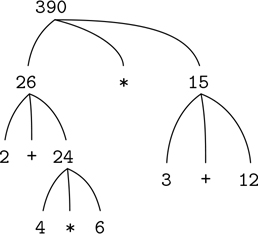

[图 1.1](#c1-fig-0001a) 树形表示，显示每个子表达式的值。

接下来，观察第一步的重复应用将我们带到了需要评估的点，不是组合，而是数字或名称等原始表达式。我们通过规定来处理原始情况

*   数字的值是它们命名的数字，并且
*   名称的值是环境中与这些名称相关联的对象。

要注意的关键点是环境在决定表达中名字的意义方面的作用。在像 JavaScript 这样的交互式语言中，如果不指定任何可以为名称`x`提供含义的环境信息，谈论像`x + 1`这样的表达式的值是没有意义的。正如我们将在第三章中看到的，环境作为评估发生的背景的一般概念将在我们理解程序执行中起重要作用。

请注意，上面给出的评估规则不处理声明。例如，评估`**const** x = 3;`并没有将相等运算符`=`应用于两个参数，其中一个是名字`x`的值，另一个是 3，因为声明的目的正是将`x`与一个值相关联。(也就是说，`**const** x = 3;`不是一个组合。)

`**const**`中的字母以粗体显示，表示它是 JavaScript 中的一个关键字。关键字具有特定的含义，因此不能用作名称。语句中的关键字或关键字组合指示 JavaScript 解释器以特殊方式处理该语句。每个这样的句法形式都有自己的求值规则。各种各样的语句和表达式(每一种都有相关的求值规则)构成了编程语言的语法。

### 1.1.4 复合功能

我们已经在 JavaScript 中确定了一些在任何强大的编程语言中都必须出现的元素:

*   数字和算术运算是原始数据和函数。
*   组合嵌套提供了一种组合操作的方法。
*   将名称与值相关联的常量声明提供了一种有限的抽象方法。

现在我们将学习函数声明，这是一种更强大的抽象技术，通过这种技术，复合操作可以被命名，然后被称为一个单元。

我们首先研究如何表达“平方”的概念我们可能会说，“要计算某物的平方，需要乘以它本身。”这在我们的语言中表达为

```js
function square(x) {
    return x * x;
}
```

我们可以这样理解:

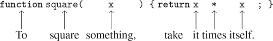

我们这里有一个复合函数，它被命名为`square`。函数表示将某物乘以自身的运算。要相乘的东西被赋予了一个本地名`x`，这个名字的作用相当于代词在自然语言中的作用。评估声明创建了这个复合函数，并将其与名称`square`相关联。 [⁶](#c1-fn-0006)

函数声明的最简单形式是

```js
function name(parameters) { return expression; }
```

名称是与环境中的功能定义相关联的符号。[⁷](#c1-fn-0007)参数是在函数体中使用的名称，用于引用函数的相应参数。参数在括号内分组，并用逗号分隔，因为它们将出现在所声明函数的应用程序中。在最简单的形式中，函数声明的主体是一个单独的返回语句、 [⁸](#c1-fn-0008) ，它由关键字`**return**`后跟返回表达式组成，当参数被函数应用到的实际参数替换时，返回表达式将产生函数应用的值。像常量声明和表达式语句一样，return 语句以分号结尾。

声明了`square`之后，我们现在可以在函数应用表达式中使用它，我们用分号将它变成一个语句:

```js
square(21);
441
```

在运算符组合之后，函数应用是我们遇到的将表达式组合成更大表达式的第二种组合。函数应用程序的一般形式是

```js
function-expression(argument-expressions)
```

其中应用程序的函数 - 表达式指定了应用于逗号分隔的参数 - 表达式的函数。为了评估一个函数应用程序，解释器遵循一个与 1.1.3 节中描述的操作符组合非常相似的过程。

*   要评估函数应用程序，请执行以下操作:
    1.  1。评估应用程序的子表达式，即函数表达式和参数表达式。
    2.  2。将函数表达式的值应用于自变量表达式的值。

```js
square(2 + 5);
49
```

这里，自变量表达式本身是一个复合表达式，运算符组合`2 + 5`。

```js
square(square(3));
81
```

当然，函数应用表达式也可以作为参数表达式。

我们也可以使用`square`作为定义其他函数的基础。例如，x²+y²可以表示为

```js
square(x) + square(y)
```

我们可以很容易地声明一个函数`sum_of_squares` [⁹](#c1-fn-0009) ，给定任意两个数字作为自变量，产生它们的平方和:

```js
function sum_of_squares(x, y) {
    return square(x) + square(y);
}

sum_of_squares(3, 4);
25
```

现在我们可以使用`sum_of_squares`作为构建进一步功能的基础:

```js
function f(a) {
    return sum_of_squares(a + 1, a * 2);
}

f(5);
136
```

除了复合函数，任何 JavaScript 环境都提供了内置于解释器或从库中加载的原语函数。除了操作符提供的原函数之外，本书中使用的 JavaScript 环境还包括额外的原函数，比如函数`math_log`，它计算参数的自然对数。 [^(10)](#c1-fn-0010) 这些额外的原函数的用法和复合函数完全一样；评估应用程序`math_log(1)`的结果是 0。事实上，人们无法通过查看上面给出的`sum_of_squares`的定义来判断`square`是内置在解释器中、从库中加载还是定义为复合函数。

### 1.1.5 功能应用的替代模型

为了评估函数应用程序，解释器遵循 1.1.4 节中描述的过程。也就是说，解释器评估应用程序的元素，并将函数(应用程序的函数表达式的值)应用于自变量(应用程序的自变量表达式的值)。

我们可以假设原语函数的应用是由解释器或库来处理的。对于复合函数，应用过程如下:

*   若要将复合函数应用于参数，请用相应的参数替换每个参数，然后计算函数的返回表达式。 [^(11)](#c1-fn-0011)

为了说明这个过程，让我们来评估这个应用程序

```js
f(5)
```

其中`f`是 1.1.4 节中声明的函数。我们从检索`f`的返回表达式开始:

```js
sum_of_squares(a + 1, a * 2)
```

然后我们用自变量 5 替换参数`a`:

```js
sum_of_squares(5 + 1, 5 * 2)
```

因此，这个问题归结为用两个参数和一个函数表达式`sum_of_squares`评估一个应用程序。评估这个应用程序涉及三个子问题。我们必须对函数表达式求值以获得要应用的函数，并且必须对参数表达式求值以获得参数。现在`5 + 1`产生 6，`5 * 2`产生 10，所以我们必须对 6 和 10 应用`sum_of_squares`函数。这些值替换了`sum_of_squares`主体中的参数`x`和`y`，将表达式简化为

```js
square(6) + square(10)
```

如果我们使用`square`的声明，这就简化为

```js
(6 * 6) + (10 * 10)
```

这通过乘法减少到

```js
36 + 100
```

最后是

```js
136
```

我们刚刚描述的过程被称为函数应用的替代模型。就本章所涉及的功能而言，它可以被视为一个决定功能应用“意义”的模型。然而，有两点应该强调:

*   替换的目的是帮助我们思考函数的应用，而不是提供解释器如何真正工作的描述。典型的解释器不会通过操作函数文本来替换参数值，从而评估函数应用程序。实际上,“替换”是通过使用参数的本地环境来完成的。我们将在第三章和第四章中详细讨论解释器的实现。
*   在本书的整个过程中，我们将呈现一系列解释器如何工作的越来越精细的模型，最后在第五章中给出一个解释器和编译器的完整实现。替代模型只是这些模型中的第一个——一种开始正式思考评估过程的方法。一般来说，在对科学和工程中的现象建模时，我们从简化的、不完整的模型开始。当我们更详细地研究事物时，这些简单的模型变得不够用，必须被更精细的模型所取代。替代模型也不例外。特别是，当我们在第 3 章讨论“可变数据”函数的使用时，我们会看到替代模型失效，必须被一个更复杂的函数应用模型所取代。 [^(12)](#c1-fn-0012)

##### 应用顺序与正常顺序

根据 1.1.4 节中给出的求值描述，解释器首先对函数和自变量表达式求值，然后将结果函数应用于结果自变量。这不是执行评估的唯一方式。另一种评估模型不会评估参数，直到需要它们的值。取而代之的是，它将首先用实参表达式代替形参，直到获得一个只包含运算符和原始函数的表达式，然后执行求值。如果我们用这种方法，评价

```js
f(5)
```

会按照扩张的顺序进行

```js
sum_of_squares(5 + 1, 5 * 2)

square(5 + 1)     + square(5 * 2)

(5 + 1) * (5 + 1) + (5 * 2) * (5 * 2)
```

随后是削减

```js
6    *    6    +    10    *    10

    36         +         100

              136
```

这和我们之前的评估模型给出的答案是一样的，只是过程不同。特别地，这里对应于表达式的简化，`5 + 1`和`5 * 2`的评估各执行两次

```js
x * x
```

将`x`分别替换为`5 + 1`和`5 * 2`。

这种可选的“完全扩展然后缩减”评估方法被称为正常顺序评估，与解释器实际使用的“评估参数然后应用”方法形成对比，后者被称为应用顺序评估。可以看出，对于可以使用替换(包括本书前两章中的所有函数)建模并产生合法值的函数应用程序，正常顺序和应用顺序计算产生相同的值。(参考练习 1.5，了解“非法”值的实例，其中正常顺序和应用顺序评估不会给出相同的结果。)

JavaScript 使用应用顺序求值，部分原因是因为避免了对表达式的多次求值而获得了额外的效率，例如上面的`5 + 1`和`5 * 2`所示，更重要的是，因为当我们离开可以通过替换建模的函数领域时，正常顺序求值变得更加复杂。另一方面，正常秩序评估可以是一个非常有价值的工具，我们将在第三章和第四章中研究它的一些含义。 [^(13)](#c1-fn-0013)

### 1.1.6 条件表达式和谓词

我们在这一点上可以定义的函数类的表达能力是非常有限的，因为我们没有办法进行测试，也没有办法根据测试的结果执行不同的操作。例如，我们不能声明一个函数，它通过测试一个数是否为非负来计算这个数的绝对值，并根据规则在每种情况下采取不同的操作

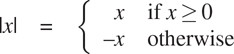

这个构造是一个案例分析，可以使用一个条件表达式用 JavaScript 写成

```js
function abs(x) {
    return x >= 0 ? x : - x;
}
```

在英语中可以表达为“如果 x 大于或等于零，则返回 x；否则返回-x。”条件表达式的一般形式是

```js
predicate ? consequent-expression : alternative-expression
```

条件表达式以一个谓词开始——也就是说，一个表达式的值要么是真要么是假，这是 JavaScript 中两个不同的布尔值。原始布尔表达式`**true**`和`**false**`通常分别计算布尔值 true 和 false。谓语后面是一个问号，后件 - 表达式，一个冒号，最后是替代 - 表达式。

为了评估一个条件表达式，解释器从评估表达式的谓词开始。如果谓词评估为真，解释器评估结果 - 表达式，并返回其值作为条件的值。如果谓词评估为假，它评估替代 - 表达式，并返回其值作为条件的值。 [^(14)](#c1-fn-0014)

单词谓词用于返回 true 或 false 的运算符和函数，以及评估为 true 或 false 的表达式。绝对值函数`abs`使用原始谓词`>=`，一个接受两个数字作为参数并测试第一个数字是否大于或等于第二个数字的操作符，相应地返回 true 或 false。

如果我们喜欢单独处理零的情况，我们可以通过编写来指定计算一个数的绝对值的函数

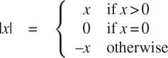

在 JavaScript 中，我们通过将条件表达式作为替代表达式嵌套在其他条件表达式中来表达具有多个案例的案例分析:

```js
function abs(x) {
    return x > 0
           ? x
           : x === 0
           ? 0
           : - x;
}
```

替代表达式`x === 0 ? 0 : - x`不需要括号，因为条件表达式的语法形式是右关联的。解释器忽略空格和换行符，为了可读性，这里插入了空格和换行符，以便在案例分析的第一个谓词下对齐`?`和`:`。案例分析的一般形式是

```js
p[1]
? e[1]
: p[2]
? e[2]
⁝
: p[n]
? e[n]
: final-alternative-expression
```

我们把一个谓词 p[I]和它的后置表达式 e[I]一起称为一个子句。案例分析可以看作是一个子句序列，后面跟着一个最终的替代表达式。根据条件表达式的求值，通过首先求值谓词 p1 来求值一个案例分析。如果其值为假，则对 p2 求值。如果 p2 的值也为假，则 p3 被求值。这个过程一直继续，直到找到一个值为真的谓词，在这种情况下，解释器返回子句的相应结果表达式 e 的值作为案例分析的值。如果没有发现 p 为真，那么案例分析的值就是最终替代表达式的值。

除了应用于数字的`>=`、`>`、`<`、`<=`、`===`、`!==`等原始谓词外， [^(15)](#c1-fn-0015) 还有逻辑组合运算，使我们能够构造复合谓词。最常用的三种是:

*   expression[1] `&&` expression[2]

    这个操作表达的是逻辑连词，意思和英文单词“and”大致相同。这种句法形式是句法糖[1616](#c1-fn-0016)为

    表情[1]`?`表情 [2] `: **false**`。

*   expression[1] `||` expression[2]

    这个运算表达的是逻辑析取，意思和英文单词“or”大致相同。这种句法形式是句法糖

    表达式[1]`? **true** :`表达式 [2] 。

*   `!` expression

    这个操作表示逻辑否定，意思和英文单词“not”大致相同。当表达式评估为假时，表达式的值为真，当表达式评估为真时，表达式的值为假。

注意`&&`和`||`是语法形式，不是运算符；他们的右手表达式并不总是被求值。另一方面，运营商`!`遵循第 1.1.3 节的评估规则。它是一个一元操作符，这意味着它只接受一个参数，而到目前为止讨论的算术操作符和原始谓词是二元，接受两个参数。运算符`!`位于其参数之前；我们称之为前缀运算符。另一个前缀运算符是数值求反运算符，上面的`abs`函数中的表达式`- x`就是一个例子。

作为如何使用这些谓词的一个例子，数 x 在范围 5<x10 内的条件可以表示为

```js
x > 5 && x < 10
```

语法形式`&&`的优先级低于比较运算符`>`和`<`，条件表达式语法形式`· · · ?· · · :· · ·`的优先级低于迄今为止我们遇到的任何其他运算符，这是我们在上面的`abs`函数中使用的一个属性。

作为另一个例子，我们可以声明一个谓词来测试一个数字是否大于或等于另一个数字

```js
function greater_or_equal(x, y) {
    return x > y || x === y;
}
```

或者可选地作为

```js
function greater_or_equal(x, y) {
    return ! (x < y);
}
```

当函数`greater_or_equal`应用于两个数字时，其行为与运算符`>=`相同。一元运算符的优先级高于二元运算符，因此本例中的括号是必要的。

##### 练习 1.1

下面是一系列陈述。解释器响应每条语句打印出来的结果是什么？假设序列将按照其出现的顺序进行评估。

```js
10;

5 + 3 + 4;

9 - 1;

6 / 2;

2 * 4 + (4 - 6);

const a = 3;

const b = a + 1;

 a + b + a * b;

a === b;

b > a && b < a * b ? b : a;

a === 4
? 6
: b === 4
? 6 + 7 + a
: 25;

2 + (b > a ? b : a);

(a > b
? a
: a < b
? b
: -1)
*
(a + 1);
```

最后两个语句中条件表达式周围的括号是必要的，因为条件表达式语法形式的优先级低于算术运算符`+`和`*`。

##### 练习 1.2

将下面的表达式翻译成 JavaScript

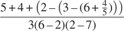

##### 练习 1.3

声明一个函数，该函数以三个数字作为参数，并返回两个较大数字的平方和。

##### 练习 1.4

请注意，我们的评估模型允许函数表达式是复合表达式的应用程序。用这个观察来描述`a_plus_abs_b`的行为:

```js
function plus(a, b) { return a + b; }
function minus(a, b) { return a - b; }
function a_plus_abs_b(a, b) {
    return (b >= 0 ? plus : minus)(a, b);
}
```

##### 练习 1.5

Ben Bitdiddle 发明了一个测试来确定他面对的解释器是使用应用顺序求值还是正常顺序求值。他声明了以下两个函数:

```js
function p() { return p(); }

function test(x, y) {
    return x === 0 ? 0 : y;
}
```

然后他评估陈述

```js
test(0, p());
```

对于使用应用顺序求值的解释器，Ben 会观察到什么行为？对于使用正常顺序求值的解释器，他会观察到什么行为？解释一下你的答案。(假设无论解释器使用正常顺序还是应用顺序，条件表达式的求值规则都是相同的:首先对谓词表达式求值，结果决定是对结果表达式求值还是对替代表达式求值。)

### 1.1.7 举例:牛顿法求平方根

如上所述，函数很像普通的数学函数。它们指定由一个或多个参数确定的值。但是数学函数和计算机函数有一个重要的区别。电脑功能必须有效。

作为一个恰当的例子，考虑计算平方根的问题。我们可以将平方根函数定义为

```js
 = the y such that y ≥ 0 and y2 = x
```

这描述了一个完全合法的数学函数。我们可以用它来识别一个数是否是另一个数的平方根，或者得出关于平方根的一般事实。另一方面，这个定义没有描述计算机的功能。事实上，它几乎没有告诉我们如何实际找到一个给定数字的平方根。用伪 JavaScript 重新表述这个定义没有任何帮助:

```js
function sqrt(x) {
    return the y with y >= 0 && square(y) === x;
}
```

这只能回避问题。

数学函数和计算机函数之间的对比反映了描述事物的属性和描述如何做事情之间的一般区别，或者有时被称为陈述性知识和命令性知识之间的区别。在数学中，我们通常关心陈述性(是什么)描述，而在计算机科学中，我们通常关心命令性(如何)描述。 [^(17)](#c1-fn-0017)

如何计算平方根？最常见的方法是使用牛顿的逐次逼近法，即每当我们对一个数 x 的平方根值有一个猜测 y 时，我们可以通过对 y 与 x / y 求平均值来执行一个简单的操作，以获得一个更好的猜测值(更接近实际的平方根)。 [^(18)](#c1-fn-0018) 例如，我们可以如下计算 2 的平方根。假设我们最初的猜测是 1:

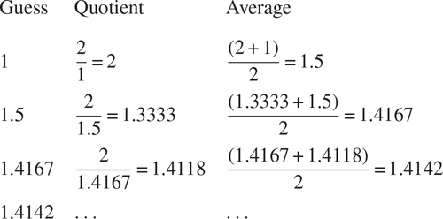

继续这个过程，我们获得了对平方根越来越好的近似。

现在让我们从功能的角度来形式化这个过程。我们从根号(我们试图计算其平方根的数字)的值和猜测值开始。如果猜测对我们的目的来说足够好，我们就完成了；如果没有，我们必须用改进的猜测重复这个过程。我们把这个基本策略写成一个函数:

```js
function sqrt_iter(guess, x) {
    return is_good_enough(guess, x)
           ? guess
           : sqrt_iter(improve(guess, x), x);
}
```

通过用根号和旧猜测值的商对猜测值进行平均，可以改进猜测值:

```js
function improve(guess, x) {
    return average(guess, x / guess);
}
```

在哪里

```js
function average(x, y) {
    return (x + y) / 2;
}
```

我们还必须说明我们所说的“足够好”是什么意思以下内容可以作为示例，但这并不是一个很好的测试。(参见练习 1.7。)想法是改进答案，直到它足够接近，使得它的平方与根号的差异小于预定的容差(这里是 0.001): [^(19)](#c1-fn-0019)

```js
function is_good_enough(guess, x) {
    return abs(square(guess) - x) < 0.001;
}
```

最后，我们需要一个开始的方法。例如，我们总是可以猜测任何数字的平方根是 1:

```js
function sqrt(x) {
    return sqrt_iter(1, x);
}
```

如果我们向解释器输入这些声明，我们可以像使用任何函数一样使用`sqrt`:

```js
sqrt(9);
3.00009155413138

sqrt(100 + 37);
11.704699917758145

sqrt(sqrt(2) + sqrt(3));
1.7739279023207892

square(sqrt(1000));
1000.000369924366
```

`sqrt`程序也说明了我们到目前为止介绍的简单函数语言足以编写任何纯数字程序，比如用 C 或 Pascal 编写的程序。这可能看起来令人惊讶，因为我们的语言中没有包含任何指导计算机反复做某事的迭代(循环)结构。另一方面,`sqrt_iter`函数演示了除了调用函数的普通能力之外，如何不使用特殊的构造来完成迭代。 [^(20)](#c1-fn-0020)

##### 练习 1.6

Alyssa P. Hacker 不喜欢条件表达式的语法，涉及到字符`?`和`:`。"为什么我不能声明一个普通的条件函数，它的应用就像条件表达式一样？"她问道。21 Alyssa 的朋友 Eva Lu Ator 声称这确实可以实现，她声明了一个`conditional`函数如下:

```js
function conditional(predicate, then_clause, else_clause) {
    return predicate ? then_clause : else_clause;
}
```

Eva 为 Alyssa 演示了该计划:

```js
conditional(2 === 3, 0, 5);
5
conditional(1 === 1, 0, 5);
0
```

欣喜之余，Alyssa 用`conditional`重写了平方根程序:

```js
function sqrt_iter(guess, x) {
    return conditional(is_good_enough(guess, x),
                        guess,
                        sqrt_iter(improve(guess, x),
                                  x));
}
```

当 Alyssa 试图用这个来计算平方根时会发生什么？解释一下。

##### 练习 1.7

用于计算平方根的`is_good_enough`测试对于寻找非常小的数字的平方根不是很有效。此外，在真实的计算机中，算术运算几乎总是以有限的精度执行。这使得我们的测试不适用于非常大的数量。请解释这些陈述，并举例说明测试在小数字和大数字情况下是如何失败的。实现`is_good_enough`的另一个策略是观察`guess`如何从一个迭代变化到下一个迭代，当变化只是猜测的一小部分时停止。设计一个使用这种终结测试的平方根函数。这对小数字和大数字更有效吗？

##### 练习 1.8

牛顿的立方根方法基于以下事实:如果 y 是 x 的立方根的近似值，则该值给出了更好的近似值

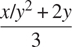

使用此公式实现类似于平方根函数的立方根函数。(在 1.3.4 节中，我们将看到如何实现牛顿法作为这些平方根和立方根函数的抽象。)

### 1.1.8 起到黑盒抽象的作用

函数`sqrt`是由一组相互定义的函数定义的流程的第一个例子。注意`sqrt_iter`的声明是递归；也就是说，函数是根据它本身来定义的。能够根据函数本身来定义函数的想法可能会令人不安；这种“循环”定义怎么可能有意义，这似乎还不清楚，更不用说指定一个由计算机执行的明确定义的过程了。这将在第 1.2 节中详细讨论。但是首先让我们考虑一下`sqrt`这个例子所展示的其他一些要点。

请注意，计算平方根的问题自然会分解成许多子问题:如何判断猜测是否足够好，如何改进猜测，等等。这些任务中的每一项都由单独的功能来完成。整个`sqrt`程序可以被视为一簇功能(如图[图 1.2](#c1-fig-0008) 所示)，反映了问题分解成子问题。

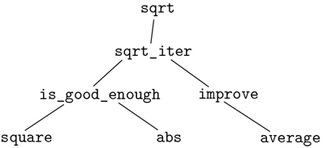

[图 1.2](#c1-fig-0008a)`sqrt`程序的功能分解。

这种分解策略的重要性不仅仅在于将程序分成几个部分。毕竟，我们可以把任何一个大程序分成几个部分——前十行，接下来十行，接下来十行，等等。相反，每个功能完成一个可识别的任务是至关重要的，这个任务可以作为定义其他功能的模块。例如，当我们根据`square`定义`is_good_enough`函数时，我们可以将`square`函数视为一个“黑盒”。我们现在并不关心函数如何计算结果，只关心函数计算平方的事实。如何计算平方的细节可以省略，稍后再考虑。事实上，就`is_good_enough`功能而言，`square`并不完全是一个功能，而是一个功能的抽象，即所谓的功能抽象。在这个抽象层次上，任何计算平方的函数都是一样好的。

因此，仅考虑它们返回的值，下面两个平方一个数的函数应该是不可区分的。每个都接受一个数字参数，并产生该数字的平方作为值。 [^(22)](#c1-fn-0022)

```js
function square(x) {
    return x * x;
}

function square(x) {
    return math_exp(double(math_log(x)));
}

function double(x) {
    return x + x;
}
```

所以函数应该能够抑制细节。该函数的用户可能没有自己编写该函数，但可能从另一个程序员那里作为黑盒获得了该函数。用户不需要知道该功能是如何实现的就可以使用它。

##### 本地名称

对于函数的用户来说，函数实现的一个细节应该无关紧要，那就是实现者对函数参数名称的选择。因此，以下功能应该是不可区分的:

```js
function square(x) {
    return x * x;
}

function square(y) {
    return y * y;
}
```

这个原则——函数的意义应该独立于其作者使用的参数名——表面上似乎是不言而喻的，但其后果是深远的。最简单的结果是函数的参数名必须位于函数体的局部。例如，我们在平方根函数中的`is_good_enough`声明中使用了`square`:

```js
function is_good_enough(guess, x) {
    return abs(square(guess) - x) < 0.001;
}
```

`is_good_enough`作者的意图是确定第一个参数的平方是否在第二个参数的给定容差内。我们看到`is_good_enough`的作者用`guess`这个名字指代第一个论点，用`x`指代第二个论点。`square`的论点是`guess`。如果`square`的作者用`x`(如上)来指代那个论点，我们看到`is_good_ enough`中的`x`一定是与`square`不同的`x`。运行函数`square`不得影响`is_good_enough`使用的`x`的值，因为在`square`完成计算后`is_good_enough`可能需要`x`的值。

如果参数对于它们各自的函数体不是本地的，那么`square`中的参数`x`可能会与`is_good_ enough`中的参数`x`混淆，`is_good_enough`的行为将取决于我们使用的`square`的版本。因此，`square`不是我们想要的黑盒。

函数的参数在函数声明中有一个非常特殊的角色，因为参数的名称无关紧要。这样的名字叫做绑定，我们说函数声明绑定它的参数。如果绑定名称在整个声明中被一致地重命名，那么函数声明的意义是不变的。 [^(23)](#c1-fn-0023) 如果一个名字没有被绑定，我们说它是自由的。绑定为其声明名称的语句集被称为该名称的作用域。在函数声明中，声明为函数参数的绑定名称的作用域是函数体。

在上面的`is_good_enough`声明中，`guess`和`x`是绑定名称，而`abs`和`square`是自由名称。`is_good_enough`的含义应该独立于我们为`guess`和`x`选择的名称，只要它们与`abs`和`square`不同。(如果我们将`guess`重命名为`abs`，我们会因为捕获名称`abs`而引入一个 bug。它会从自由变成束缚。)然而，`is_good_enough`的含义并不独立于其自由名称的选择。这当然取决于这样一个事实(声明之外的):名字`abs`指的是计算一个数的绝对值的函数。如果我们在声明中用`math_cos`(原始余弦函数)代替`abs`，函数`is_good_enough`将计算一个不同的函数。

##### 内部声明和块结构

到目前为止，我们有一种可用的名称隔离:函数的参数对于函数体是局部的。平方根程序展示了我们控制名字使用的另一种方式。现有程序由单独的功能组成:

```js
function sqrt(x) {
    return sqrt_iter(1, x);
}
function sqrt_iter(guess, x) {
    return is_good_enough(guess, x)
           ? guess
           : sqrt_iter(improve(guess, x), x);
}
function is_good_enough(guess, x) {
    return abs(square(guess) - x) < 0.001;
}
function improve(guess, x) {
    return average(guess, x / guess);
}
```

这个程序的问题在于，对`sqrt`的用户来说唯一重要的功能是`sqrt`。其他功能(`sqrt_iter`、`is_good_enough`和`improve`)只会让他们头脑混乱。他们可能没有声明任何其他名为`is_good_enough`的函数作为另一个程序的一部分来与平方根程序一起工作，因为`sqrt`需要它。在由许多独立的程序员构建大型系统时，这个问题尤其严重。例如，在大型数值函数库的构建中，许多数值函数被计算为逐次逼近，因此可能有名为`is_good_enough`和`improve`的函数作为辅助函数。我们希望将子函数本地化，将它们隐藏在`sqrt`中，这样`sqrt`可以与其他逐次逼近共存，每个都有自己的私有`is_good_enough`函数。
为了使这成为可能，我们允许一个函数拥有对该函数来说是局部的内部声明。例如，在平方根问题中，我们可以写

```js
function sqrt(x) {
    function is_good_enough(guess, x) {
        return abs(square(guess) - x) < 0.001;
    }
    function improve(guess, x) {
        return average(guess, x / guess);
        }
    function sqrt_iter(guess, x) {
        return is_good_enough(guess, x)
               ? guess
               : sqrt_iter(improve(guess, x), x);
    }
    return sqrt_iter(1, x);
}
```

任何匹配的大括号对都指定了一个块，并且该块内部的声明是该块的局部声明。这种声明的嵌套，称为块结构，基本上是最简单的名称包装问题的正确解决方案。但是这里隐藏着一个更好的想法。除了内部化辅助函数的声明，我们还可以简化它们。由于`x`被绑定在`sqrt`的声明中，所以`sqrt`内部声明的`is_good_enough`、`improve`、`sqrt_iter`都在`x`的范围内。因此，没有必要明确地将`x`传递给这些函数中的每一个。相反，我们允许`x`在内部声明中是一个自由名称，如下所示。然后`x`从调用封闭函数`sqrt`的参数中获取其值。这个规程叫做词法范围。 [^(24)](#c1-fn-0024)

```js
function sqrt(x) {
    function is_good_enough(guess) {
        return abs(square(guess) - x) < 0.001;
    }
    function improve(guess) {
        return average(guess, x / guess);
    }
    function sqrt_iter(guess) {
        return is_good_enough(guess)
               ? guess
               : sqrt_iter(improve(guess));
    }
    return sqrt_iter(1);
}
```

我们将广泛使用块结构来帮助我们将大型程序分解成易于处理的部分。 [^(25)](#c1-fn-0025) 块结构的思想起源于编程语言 Algol 60。它出现在大多数高级编程语言中，是帮助组织大型程序构造的重要工具。*  *## 1.2 函数及其生成的过程

我们现在已经考虑了编程的元素:我们已经使用了原始的算术运算，我们已经组合了这些运算，并且我们通过将它们声明为复合函数来抽象这些复合运算。但这不足以让我们说我们知道如何编程。我们的情况类似于一个人学习了国际象棋中棋子移动的规则，但对典型的开局、战术或战略一无所知。像新手棋手一样，我们还不知道领域中的常见使用模式。我们不知道哪些步骤是值得做的(哪些函数是值得声明的)。我们缺乏预测一个动作(执行一个功能)的后果的经验。

正如在任何综合的、创造性的活动中一样，将所考虑的行为的后果可视化的能力对于成为一名专业程序员来说是至关重要的。例如，要成为一名专业摄影师，你必须学会如何观察一个场景，并知道每个区域在每一种可能的曝光和处理选项下，在照片上会有多暗。只有这样，人们才能逆向推理，规划取景、照明、曝光和处理，以获得想要的效果。编程也是如此，我们计划一个过程要采取的行动，我们通过程序来控制这个过程。要成为专家，我们必须学会将各种类型的功能所产生的过程可视化。只有在我们发展了这样一种技能之后，我们才能学会可靠地构建展示出期望行为的程序。

函数是计算过程的局部演化的模式。它规定了流程的每个阶段如何建立在前一个阶段的基础上。我们希望能够对一个过程的整体，或者说全局行为做出陈述，这个过程的局部演化已经被一个函数指定了。这在一般情况下很难做到，但我们至少可以尝试描述一些典型的过程演化模式。

在这一节中，我们将研究由简单函数生成的过程的一些常见“形状”。我们还将研究这些过程消耗重要的时间和空间计算资源的速率。我们将考虑的函数非常简单。他们的角色就像摄影中的测试模式一样:作为过于简单的原型模式，而不是他们自己的实际例子。

### 1.2.1 线性递归与迭代

我们首先考虑阶乘函数，定义如下

```js
n! = n · (n – 1) · (n – 2) · · · 3 · 2 · 1
```

有许多方法可以计算阶乘。一种方法是利用观察到的 n ！等于 n 倍(n–1)！对于任意正整数 n :

```js
n! = n · [(n – 1) · (n – 2) · · · 3 · 2 · 1] = n · (n – 1)!
```

这样，我们就可以计算出 n ！通过计算(n–1)！并将结果乘以 n 。如果我们加上规定 1！等于 1，这个观察结果直接转化为计算机函数:

```js
function factorial(n) {
    return n === 1
           ? 1
           : n * factorial(n - 1);
}
```

我们可以用 1.1.5 节的替代模型来观看动作计算 6 中的这个函数！，如图[图 1.3](#c1-fig-0009) 所示。

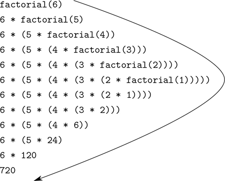

[图 1.3](#c1-fig-0009a) 一个用于计算 6 的线性递归过程！。

现在让我们从不同的角度来看阶乘的计算。我们可以描述一个计算规则。通过指定我们首先将 1 乘以 2，然后将结果乘以 3，然后乘以 4，等等，直到我们到达 n 。更正式的说法是，我们维护一个运行的产品，以及一个从 1 数到 n 的计数器。我们可以这样描述计算:计数器和乘积根据规则同时从一个步骤变化到下一个步骤

```js
product ← counter · product 
counter ← counter + 1
```

并规定 n ！是计数器超过 n 时的乘积值。

同样，我们可以将我们的描述改写为计算阶乘的函数: [^(26)](#c1-fn-0026)

```js
function factorial(n) {
    return fact_iter(1, 1, n);
}
function fact_iter(product, counter, max_count) {
    return counter > max_count
           ? product
           : fact_iter(counter * product,
                       counter + 1,
                       max_count);
}
```

和前面一样，我们可以用代入模型来形象化计算 6 的过程！，如图[图 1.4](#c1-fig-0010) 所示。

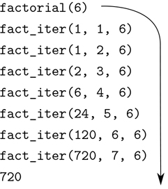

[图 1.4](#c1-fig-0010a) 用于计算 6 的线性迭代过程！。

比较这两个过程。从一个角度来看，他们似乎没有什么不同。两者在相同的域上计算相同的数学函数，并且每一个都需要与 n 成比例的步骤来计算 n ！。事实上，这两个过程甚至执行相同的乘法序列，获得相同的部分乘积序列。另一方面，当我们考虑这两个过程的“形状”时，我们发现它们的发展完全不同。

考虑第一个过程。替代模型揭示了先膨胀后收缩的形状，如图 1.3 中[的箭头所示。当该过程建立起一串延迟操作(在本例中，是一串乘法)时，就会发生扩展。收缩是在实际操作时发生的。这种以一系列延迟操作为特征的过程被称为递归过程。执行这个过程需要解释器跟踪随后要执行的操作。在 n 的计算中！延迟乘法链的长度以及跟踪它所需的信息量随着 n 线性增长(与 n 成比例)，就像步骤的数量一样。这样的过程被称为线性递归过程。](#c1-fig-0009)

相比之下，第二个过程不会增长和收缩。在每一步，对于任何 n ，我们需要跟踪的只是名字`product`、`counter`和`max_count`的当前值。我们称之为迭代过程。一般来说，一个迭代过程的状态可以用固定数量的状态变量来概括，还有一个固定的规则来描述当过程从一个状态移动到另一个状态时状态变量应该如何更新，以及一个(可选的)结束测试来指定过程应该终止的条件。在计算 n ！，所需的步骤数随着 n 线性增长。这样的过程被称为线性迭代过程。

这两个过程之间的差异可以从另一个角度来看。在迭代的情况下，状态变量提供了过程在任一点的状态的完整描述。如果我们在两个步骤之间停止计算，我们需要做的就是向解释器提供三个状态变量的值来恢复计算。递归过程并非如此。在这种情况下，有一些附加的“隐藏”信息，由解释器维护，不包含在状态变量中，它指示在协商延迟操作链中“进程在哪里”。链条越长，必须维护的信息就越多。 [^(27)](#c1-fn-0027)

在对比迭代和递归时，我们必须小心不要混淆递归过程和递归函数的概念。当我们将一个函数描述为递归时，我们指的是语法事实，即函数声明(直接或间接)指的是函数本身。但是当我们将一个过程描述为遵循一种模式时，比如说线性递归，我们谈论的是过程如何演化，而不是函数如何编写的语法。我们将诸如`fact_iter`这样的递归函数称为生成迭代过程，这似乎令人不安。然而，这个过程实际上是迭代的:它的状态完全由它的三个状态变量捕获，为了执行这个过程，解释器只需要记住三个名字。

过程和函数之间的区别可能令人困惑的一个原因是，大多数公共语言(包括 C、Java 和 Python)的实现都是以这样一种方式设计的，即任何递归函数的解释都会消耗大量的内存，这些内存随着函数调用的数量而增长，即使所描述的过程原则上是迭代的。因此，这些语言只能通过求助于特殊目的的“循环结构”来描述迭代过程，例如`do`、`repeat`、`until`、`for`和`while`。我们将在第五章中讨论的 JavaScript 实现没有这个缺陷。它将在常数空间中执行一个迭代过程，即使这个迭代过程是用递归函数描述的。具有该属性的实现被称为尾递归。 [^(28)](#c1-fn-0028) 在 tailrecursive 实现中，迭代可以用普通的函数调用机制来表达，因此特殊的迭代构造只在语法上有用。 [^(29)](#c1-fn-0029)

##### 练习 1.9

下面两个函数中的每一个都根据函数`inc`定义了一个将两个正整数相加的方法，其中函数`inc`的参数增加 1，函数`dec`的参数减少 1。

```js
function plus(a, b) {
    return a === 0 ? b : inc(plus(dec(a), b));
}

function plus(a, b) {
    return a === 0 ? b : plus(dec(a), inc(b));
}
```

使用替代模型，说明每个函数在评估`plus(4, 5);`时产生的过程。这些过程是迭代的还是递归的？

##### 练习 1.10

下面的函数计算一个称为阿克曼函数的数学函数。

```js
function A(x, y) {
    return y === 0
           ? 0
           : x === 0
           ? 2 * y
           : y === 1
           ? 2
           : A(x - 1, A(x, y - 1));
}
```

下列陈述的价值是什么？

```js
A(1, 10);

A(2, 4);

A(3, 3);
```

考虑以下函数，其中`A`是上面声明的函数:

```js
function f(n) {
    return A(0, n);
}
function g(n) {
    return A(1, n);
}
function h(n) {
    return A(2, n);
}
function k(n) {
    return 5 * n * n;
}
```

给出函数`f`、`g`、`h`对 n 的正整数值计算的函数的简明数学定义。比如 k ( n )计算 5n2。

### 1.2.2 树递归

另一种常见的计算模式叫做树递归。例如，考虑计算斐波那契数列，其中每个数字都是前两个数字的和:

```js
0, 1, 1, 2, 3, 5, 8, 13, 21, . . .
```

一般来说，斐波纳契数可以由规则来定义

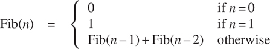

我们可以立即将这个定义转化为计算斐波纳契数的递归函数:

```js
function fib(n) {
    return n === 0
           ? 0
           : n === 1
           ? 1
           : fib(n - 1) + fib(n - 2);
}
```

考虑一下这种计算的模式。为了计算`fib(5)`，我们计算`fib(4)`和`fib(3)`。为了计算`fib(4)`，我们计算`fib(3)`和`fib(2)`。一般来说，演化后的流程看起来像一棵树，如图[图 1.5](#c1-fig-0012) 所示。请注意，分支在每一层都分裂成两个(底部除外)；这反映了一个事实，即`fib`函数每次被调用时都会调用自己两次。

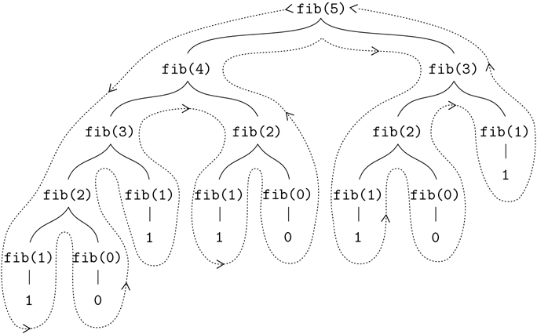

[图 1.5](#c1-fig-0012a) 计算`fib(5)`中生成的树递归过程。

这个函数作为一个典型的树递归是有指导意义的，但是它是一个计算斐波那契数的糟糕方法，因为它做了太多多余的计算。请注意图 1.5 中的[和](#c1-fig-0012)中的`fib(3)`的整个计算——几乎一半的工作——都是重复的。事实上，不难看出，函数将计算`fib(1)`或`fib(0)`的次数(一般来说是上述树中的叶子数)恰恰是 Fib( n + 1)。为了了解这有多糟糕，我们可以展示 Fib( n )的值随着 n 呈指数增长。更准确地说(见练习 1.13)，Fib( n )是最接近 ϕ ^n / 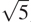的整数，其中

```js
ϕ = (1 + )/2 ≈ 1.6180
```

是黄金分割比，满足等式

```js
ϕ2 = ϕ + 1
```

因此，该过程使用随着输入呈指数增长的许多步骤。另一方面，所需的空间仅随输入线性增长，因为我们只需要跟踪在计算中的任何点上树中哪些节点在我们之上。通常，树递归过程所需的步骤数将与树中的节点数成比例，而所需的空间将与树的最大深度成比例。

我们也可以制定一个迭代过程来计算斐波纳契数。这个想法是使用一对整数 a 和 b ，初始化为 Fib(1) = 1 和 Fib(0) = 0，并重复应用同时变换

```js
a ← a + b
b ← a
```

不难看出，在应用这个变换 n 次之后， a 和 b 将分别等于 Fib( n + 1)和 Fib( n )。因此，我们可以使用函数迭代计算斐波那契数

```js
function fib(n) {
    return fib_iter(1, 0, n);
}
function fib_iter(a, b, count) {
    return count === 0
           ? b
           : fib_iter(a + b, a, count - 1);
}
```

计算 Fib( n )的第二种方法是线性迭代。这两种方法所需的步骤数量差异巨大——一种是线性的，另一种与 Fib( n )本身增长一样快——即使对于小的输入也是如此。

人们不应该由此得出结论，树递归过程是无用的。当我们考虑对层次结构数据而不是数字进行操作的过程时，我们会发现树递归是一种自然而强大的工具。[30但是即使在数值运算中，树递归过程也可以帮助我们理解和设计程序。例如，尽管第一个`fib`函数的效率比第二个低得多，但它更简单，只不过是将斐波那契数列的定义翻译成 JavaScript。为了制定迭代算法，需要注意到计算可以被重铸为具有三个状态变量的迭代。](#c1-fn-0030)

##### 示例:计数变化

提出迭代斐波那契算法只需要一点小聪明。相比之下，考虑下面的问题:给定半美元、25 美分、10 美分、5 美分和 1 美分(分别为 50 美分、25 美分、10 美分、5 美分和 1 美分)，我们可以用多少种不同的方法兑换 1 美元(100 美分)？更一般地说，我们能不能写一个函数来计算改变任何给定金额的方法的数量？

这个问题有一个简单的递归函数解决方案。假设我们认为可用的硬币类型是按照某种顺序排列的。那么下面的关系成立:

使用 n 种硬币来兑换数量个的方法等于

*   使用除第一种硬币之外的所有硬币来改变数量的方法 a ，加上
*   使用所有 n 种硬币兑换金额的方式数量 a–d，其中 d 为第一种硬币的面额。

要明白为什么这是真的，可以观察到改变的方式可以分为两组:一组不使用第一种硬币，另一组使用第一种硬币。因此，在不使用任何第一种硬币的情况下，对某一数量进行兑换的方法的总数等于对该数量进行兑换的方法的总数，加上假设我们使用第一种硬币进行兑换的方法的总数。但是后一个数字等于使用第一种硬币后剩余的零钱的数量。

因此，我们可以递归地将兑换给定金额的问题简化为兑换较小金额或使用较少种类硬币的问题。仔细考虑这个归约规则，并说服自己，如果我们指定以下退化情况，我们可以用它来描述一个算法: [^(31)](#c1-fn-0031)

*   如果 a 正好是 0，我们应该把它算作一种改变的方式。
*   如果 a 小于 0，我们应该把它算作 0 种改变的方法。
*   如果 n 是 0，我们应该把它算作 0 种改变的方式。

我们可以很容易地将这种描述转化为递归函数:

```js
function count_change(amount) {
    return cc(amount, 5);
}
function cc(amount, kinds_of_coins) {
    return amount === 0
           ? 1
           : amount < 0 || kinds_of_coins === 0
           ? 0
           : cc(amount, kinds_of_coins - 1)
             +
             cc(amount - first_denomination(kinds_of_coins), 
                kinds_of_coins);
}
function first_denomination(kinds_of_coins) {
    return kinds_of_coins === 1 ? 1
         : kinds_of_coins === 2 ? 5
         : kinds_of_coins === 3 ? 10
         : kinds_of_coins === 4 ? 25
         : kinds_of_coins === 5 ? 50
         : 0;
}
```

(`first_denomination`函数将可用硬币种类的数量作为输入，并返回第一种硬币的面额。这里我们认为硬币是按照从大到小的顺序排列的，但是任何顺序都可以。)我们现在可以回答我们最初关于兑换一美元的问题了:

```js
count_change(100);
292
```

函数`count_change`生成一个具有冗余的树递归过程，类似于我们的第一个实现`fib`中的那些。另一方面，如何设计一个更好的算法来计算结果并不明显，我们把这个问题作为一个挑战。观察到树递归过程可能效率非常低，但通常易于指定和理解，这使得人们提出可以通过设计“智能编译器”来获得两个世界的最佳效果，该编译器可以将树递归函数转换为计算相同结果的更有效的函数。 [^(32)](#c1-fn-0032)

##### 练习 1.11

一个函数 f 由规则 f(n)=nifn<3 和 f(n)=f(n–1)+2f(n–2)+定义编写一个 JavaScript 函数，通过递归过程计算 f 。编写一个通过迭代过程计算 f 的函数。

##### 练习 1.12

下面这个数字的模式叫做帕斯卡三角形。

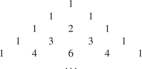

三角形边上的数字都是 1，三角形里面的每个数字都是它上面两个数字之和。写一个函数，通过递归过程计算帕斯卡三角形的元素。

##### 练习 1.13

证明 Fib( n )是最接近ϕ^n/的整数，其中 ϕ = (1 +  )/2。提示:用归纳法和斐波那契数列的定义证明 fib(n)=(ϕ^n–ψ^n)/，其中ψ=(1—)/2。

### 1.2.3 订单增长

前面的例子说明了进程消耗计算资源的速度可能有很大的不同。描述这种差异的一个方便的方法是使用增长顺序的概念来获得一个过程在投入变大时所需资源的总量。

设 n 为衡量问题大小的参数，设 R ( n )为处理大小为 n 的问题所需的资源量。在我们之前的例子中，我们将 n 作为要计算给定函数的数字，但是也有其他的可能性。例如，如果我们的目标是计算一个数的平方根的近似值，我们可以将 n 作为所需精度的位数。对于矩阵乘法来说，我们可能会将 n 作为矩阵的行数。一般来说，问题有许多特性，根据这些特性来分析一个给定的过程是可取的。类似地， R ( n )可能测量使用的内部存储寄存器的数量，执行的基本机器操作的数量，等等。在一次只进行固定次数运算的计算机中，所需的时间将与基本的机器运算次数成正比。

我们说 R ( n )有增长顺序θ(f(n【T7]))，写成 R(n)=θ(f(n)(读作“θoff(n)”)，如果有正常数 k 【T21

```js
k1 f (n) ≤ R(n) ≤ k2 f (n)
```

对于任何足够大的 n 值。(换句话说，对于大的 n ，值 R ( n )夹在 k[1]f(n)和 k[2f(n)之间。)]

例如，使用第 1.2.1 节中描述的计算阶乘的线性递归过程，步骤数与输入 n 成比例增长。因此，该过程所需的步骤随着θ(n)而增长。我们还看到，所需空间随着θ(n)而增长。对于迭代阶乘，步数仍然是θ(n)，但空间是θ(1)——即常数。 [^(34)](#c1-fn-0034) 树递归斐波纳契运算需要θ(ϕ^n)步数和空间θ(n)，其中 ϕ 是 1.2.2 节所述的黄金分割比。

增长的顺序仅仅提供了一个过程行为的粗略描述。比如一个需要 n ² 步的流程和一个需要 1000 n ² 步的流程和一个需要 3n²+10n+17 步的流程都有θ(n²)的增长顺序。另一方面，增长的顺序提供了一个有用的指示，当我们改变问题的规模时，我们可以期望过程的行为如何改变。对于一个θ(n)(线性)进程，大小加倍将会使使用的资源量大致加倍。对于指数过程，问题规模的每一个增量都会将资源利用率乘以一个常数因子。在 1.2 节的剩余部分，我们将考察两个增长顺序为对数的算法，因此问题规模加倍会增加恒定量的资源需求。

##### 练习 1.14

画出说明 1.2.2 节的`count_change`函数在找零 11 美分时产生的过程的树。当要改变的量增加时，该过程使用的空间和步骤数量的增长顺序是什么？

##### 练习 1.15

如果 x 足够小，角度的正弦(以弧度表示)可以通过利用近似 sin x ≈ x 和三角恒等式来计算

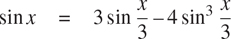

来减少罪的论点的篇幅。(在本练习中，如果角度的大小不大于 0.1 弧度，则认为该角度“足够小”。)这些想法被合并到以下功能中:

```js
function cube(x) {
    return x * x * x;
}
function p(x) {
    return 3 * x - 4 * cube(x);
}
function sine(angle) {
    return ! (abs(angle) > 0.1)
           ? angle
           : p(sine(angle / 3));
}
```

1.  a. 评估`sine(12.15)`时，函数`p`应用了多少次？
2.  b. 对`sine(a)`求值时，`sine`函数生成的进程所使用的空间和步数(作为 a 的函数)的增长顺序是什么？

### 1.2.4 取幂

考虑计算给定数字的指数的问题。我们想要一个函数，它以基数 b 和正整数指数 n 作为参数，并计算 b ^n 。一种方法是通过递归定义

```js
bn = b bn–1
b0 = 1
```

这很容易转化为函数

```js
function expt(b, n) {
    return n === 0
           ? 1
           : b * expt(b, n - 1);
}
```

这是一个线性递归过程，需要θ(n 步和θ(n 空间)。正如阶乘，我们可以很容易地制定一个等价的线性迭代:

```js
function expt(b, n) {
    return expt_iter(b, n, 1);
}
function expt_iter(b, counter, product) {
    return counter === 0
           ? product
           : expt_iter(b, counter - 1, b * product);
}
```

这个版本需要θ(n)步和θ(1)空间。

通过使用连续平方，我们可以用更少的步骤计算指数。例如，不是计算 b8 为

```js
b · (b · (b · (b · (b · (b · (b · b))))))
```

我们可以用三次乘法来计算:

```js
b2 = b · b
b4 = b2 · b2
b8 = b4 · b4
```

这种方法适用于指数为 2 的幂的情况。如果我们使用这个规则，我们也可以利用连续平方来计算指数

```js
bn = (bn/2)2  if n is even
bn = b · bn–1  if n is odd
```

我们可以将这种方法表达为一个函数:

```js
function fast_expt(b, n) {
    return n === 0
           ? 1
           : is_even(n)
           ? square(fast_expt(b, n / 2))
           : b * fast_expt(b, n - 1);
}
```

其中，测试整数是否为偶数的谓词是根据运算符`%`定义的，该运算符通过

```js
function is_even(n) {
    return n % 2 === 0;
}
```

由`fast_expt`进化的过程在空间和步骤数量上都与 n 成对数增长。要了解这一点，可以观察到使用`fast_expt`计算 b2nT30 只需要比计算 b^n多一次乘法运算。因此，我们可以计算的指数的大小随着我们被允许的每一次新乘法而加倍(大约)。因此， n 的指数所需的乘法次数大约与 n 以 2 为底的对数一样快。这个过程有θ(logn)的增长。 [^(35)](#c1-fn-0035)

随着 n 变大，θ(对数 n 增长和θ(n)增长之间的差异变得显著。例如， n = 1000 的`fast_expt`只需要 14 次乘法。 [^(36)](#c1-fn-0036) 也可以利用连续平方的思想设计一种迭代算法，用对数步数计算指数(见练习 1.16)，尽管迭代算法通常不会像递归算法那样简单明了。 [^(37)](#c1-fn-0037)

##### 练习 1.16

像`fast_expt`一样，设计一个演化出迭代取幂过程的函数，该过程使用连续平方和对数步数。(提示:使用观察值(b^n^(/2))²=(b²)^n^(/2)，连同指数 n 和基数 b ，保留一个额外的状态变量 a 过程开始时 a 取 1，过程结束时 a 的值给出答案。一般来说，定义一个从一个状态到另一个状态保持不变的不变量的技术是一种考虑迭代算法设计的强大方法。)

##### 练习 1.17

本节中的取幂算法基于通过重复乘法来执行取幂。以类似的方式，可以通过重复加法来执行整数乘法。以下乘法函数(其中假设我们的语言只能加法，不能乘法)类似于`expt`函数:

```js
function times(a, b) {
    return b === 0
           ? 0
           : a + times(a, b - 1);
}
```

该算法采取了许多步骤，这些步骤在`b`中是线性的。现在假设我们除了加法之外，还包括函数`double`，它将一个整数加倍，以及函数`halve`，它将一个(偶数)整数除以 2。使用这些，设计一个类似于`fast_expt`的乘法函数，使用对数级。

##### 练习 1.18

利用练习 1.16 和 1.17 的结果，设计一个函数，产生一个迭代过程，用加法、加倍和减半的方式将两个整数相乘，并使用对数级数的步骤。 [^(38)](#c1-fn-0038)

##### 练习 1.19

有一个聪明的算法可以在对数级中计算斐波那契数。回忆 1.2.2 节`fib_iter`过程中状态变量 a 和 b 的变换:a+b 和 b a 。将这个转换称为 T ，观察到从 1 和 0 开始，反复应用 Tn 次 n 次，产生 Fib( n + 1)和 Fib( n )对。换句话说，斐波那契数列是通过应用 T^n、变换 T 的 n 次方而产生的，从对(1，0)开始。现在考虑 T 是一族变换 T [pq] 中 p = 0 和 q = 1 的特例，其中 T [pq] 根据 a←bq+【t5t】变换对( a ， b )说明如果我们将这样的变换 T [pq] 应用两次，效果与使用相同形式的单个变换 T[p][′][q][′]相同，并且计算 p′和 q′这为我们提供了一种明确的方法来平方这些变换，因此我们可以使用连续平方来计算 T ^n ，就像在`fast_expt`函数中一样。将所有这些放在一起，完成下面的函数，它以对数级的步骤运行: [^(39)](#c1-fn-0039)

```js
function fib(n) {
    return fib_iter(1, 0, 0, 1, n);
}
function fib_iter(a, b, p, q, count) {
    return count === 0
           ? b
           : is_even(count)
           ? fib_iter(a,
                      b,
                      (??),          // compute p′
                      (??),          // compute q′
                      count / 2)
           : fib_iter(b * q + a * q + a * p,
                      b * p + a * q,
                      p,
                      q,
                      count - 1);
}
```

### 1.2.5 最大公约数

两个整数 a 和 b 的最大公约数(GCD)被定义为除以 a 和 b 且没有余数的最大整数。比如 16 和 28 的 GCD 是 4。在第二章中，当我们研究如何实现有理数算术时，我们需要能够计算 gcd，以便将有理数减少到最低项。(为了将有理数化为最低项，我们必须将分子和分母都除以它们的 GCD。例如，16/28 减少到 4/7。)求两个整数的 GCD 的一个方法是对它们进行因式分解，寻找公因式，但是有一个著名的算法要高效得多。

该算法的思想基于这样的观察，如果当 a 被 b 除时 r 是余数，那么 a 和 b 的公约数与 b 和 r 的公约数完全相同。因此，我们可以使用等式

```js
GCD(a, b) = GCD(b, r)
```

将计算 GCD 的问题逐步简化为计算越来越小的整数对的 GCD 的问题。举个例子，

```js
GCD(206, 40) = GCD(40, 6)
       = GCD(6, 4)
       = GCD(4, 2)
       = GCD(2, 0)
       = 2
```

将 GCD(206，40)缩减为 GCD(2，0)，即 2。可以证明，从任意两个正整数开始并执行重复的归约，最终总是会产生第二个数为 0 的对。那么 GCD 就是配对中的另一个数。这种计算 GCD 的方法被称为欧几里德算法。 [^(40)](#c1-fn-0040)

很容易将欧几里德算法表达为一个函数:

```js
function gcd(a, b) {
    return b === 0 ? a : gcd(b, a % b);
}
```

这产生了一个迭代过程，其步骤数随着所涉及数字的对数而增长。

欧几里德算法所需的步骤数呈对数增长，这一事实与斐波纳契数有着有趣的关系:

* * *

**Lamé定理:**如果欧几里德算法需要 k 步计算某对的 GCD，那么该对中较小的数一定大于或等于第 k 个斐波那契数。 [^(41)](#c1-fn-0041)

* * *

我们可以用这个定理来得到欧几里德算法的增长阶估计。设 n 为函数的两个输入中较小的一个。如果流程需要 k 步，那么我们必须有 n≥fib(k)≈ϕ^k/。因此步数 k 随着 n 的对数(以 ϕ 为底)增长。因此，增长的顺序是θ(logn)。

##### 练习 1.20

函数生成的过程当然取决于解释器使用的规则。作为一个例子，考虑上面给出的迭代`gcd`函数。假设我们使用正常顺序评估来解释这个函数，如 1.1.5 节所讨论的。(练习 1.5 中描述了条件表达式的正常顺序求值规则。)使用替换法(对于正常订单)，说明评估`gcd(206, 40)`产生的过程，并指出实际执行的`remainder`操作。在`gcd(206, 40)`的正常顺序评估中，实际执行了多少次`remainder`操作？在应用顺序评估中？

### 示例:测试素性

本节描述了检查整数 n 的素性的两种方法，一种是使用增长顺序θ(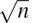)，另一种是使用增长顺序θ(logn)的“概率”算法。本节末尾的练习提出了基于这些算法的编程项目。

##### 寻找约数

自古以来，数学家们就对有关素数的问题着迷，许多人都致力于确定检验数字是否为素数的方法的问题。检验一个数是否是质数的一种方法是找出这个数的约数。下面的程序找到给定数字 n 的最小整数除数(大于 1)。它通过测试 n 是否能被从 2 开始的连续整数整除，以一种简单的方式实现这一点。

```js
function smallest_divisor(n) {
    return find_divisor(n, 2);
}
function find_divisor(n, test_divisor) {
    return square(test_divisor) > n
           ? n
           : divides(test_divisor, n)
           ? test_divisor
           : find_divisor(n, test_divisor + 1);
}
function divides(a, b) {
    return b % a === 0;
}
```

我们可以这样来检验一个数是否是质数: n 是质数当且仅当 n 是它自己的最小除数。

```js
function is_prime(n) {
    return n === smallest_divisor(n);
}
```

对`find_divisor`的最终测试是基于这样的事实:如果 n 不是质数，那么它必须有一个小于或等于的除数。 [^( 42 )](#c1-fn-0042) 这意味着算法只需要测试 1 和之间的除数。因此，将 n 识别为素数所需的步骤数将具有增长顺序θ()。

##### 费马试验

θ(logn)素性测试基于数论的一个结果，即费马小定理。 [^(43)](#c1-fn-0043)

* * *

**费马小定理:**若 n 为素数， a 为任意小于 n 的正整数，则 a 的 n 次幂全等于 a 模 n 。

* * *

(如果两个数被 n 除后有相同的余数，则称这两个数为同余模 n 。一个数 a 除以 n 的余数也被称为 a 模 n 的余数或简称为 a 模 n 的余数。)

如果 n 不是素数，那么，一般来说，大多数数 an 都不会满足上述关系。这就产生了下面的测试素性的算法:给定一个数 n ，选取一个随机数 an 并计算 a^n模 n 的余数。如果结果不等于 a ，那么 n 肯定不是素数。如果是 a，那么很有可能 n 是质数。现在选择另一个随机数 a ，用同样的方法测试。如果它也满足等式，那么我们可以更加确信 n 是质数。通过尝试越来越多的 a 的值，我们可以增加对结果的信心。这种算法被称为费马测试。

为了实现费马测试，我们需要一个函数来计算一个数对另一个数的指数:

```js
function expmod(base, exp, m) {
    return exp === 0
           ? 1
           : is_even(exp)
           ? square(expmod(base, exp / 2, m)) % m
           : (base * expmod(base, exp - 1, m)) % m;
}
```

这与 1.2.4 节的`fast_expt`功能非常相似。它使用连续平方，因此步数与指数成对数增长。 [^(44)](#c1-fn-0044)

费马试验是在 1 和 n–1 之间随机选择一个数字 a 并检查 a 的 n 次方的余数模 n 是否等于 a 。使用原始函数`math_random`选择随机数 a ，该函数返回一个小于 1 的非负数。因此，为了获得一个介于 1 和 n–1 之间的随机数，我们将`math_random`的返回值乘以 n–1，用原始函数`math_floor`将结果向下舍入，并加上 1:

```js
function fermat_test(n) {
    function try_it(a) {
        return expmod(a, n, n) === a;
    }
    return try_it(1 + math_floor(math_random() * (n - 1)));
}
```

下面的函数按照参数指定的次数运行测试。如果测试每次都成功，则其值为 true，否则为 false。

```js
function fast_is_prime(n, times) {
    return times === 0
           ? true
           : fermat_test(n)
           ? fast_is_prime(n, times - 1)
           : false;
}
```

##### 概率方法

费马测试在性质上不同于大多数熟悉的算法，在这些算法中，计算出的答案保证是正确的。这里，得到的答案只是可能正确。更准确地说，如果 n 没有通过费马测试，我们可以确定 n 不是质数。但是， n 通过测试的事实，虽然是一个非常强烈的暗示，但仍然不能保证 n 是质数。我们想说的是，对于任何一个数 n ，如果我们进行足够多次的测试，发现 n 总是通过测试，那么我们的素性测试中的错误概率就可以做到我们喜欢的那样小。

不幸的是，这种说法并不完全正确。确实存在欺骗费马测试的数字:不是质数的数字 n ，但具有这样的性质:对于所有整数 a < n ，a ^n 同余于 a 模 n 。这样的数字是极其罕见的，所以费马试验在实践中是相当可靠的。 [^(45)](#c1-fn-0045) 费马试验有变异，不能被忽悠。在这些测试中，与费马方法一样，人们通过选择一个随机整数 an 并检查依赖于 n 和 a 的某些条件来测试整数 n 的素性。(参见练习 1.28 中的测试示例。)另一方面，与费马测试相反，人们可以证明，对于任何 n ，条件对于大多数整数 an 都不成立，除非 n 是素数。因此，如果 n 通过随机选择 a 的测试，那么几率甚至比 n 是质数还要大。如果 n 通过两次随机选择 a 的测试，则 n 为质数的几率大于 3/4。通过使用越来越多随机选择的和值进行测试，我们可以使错误概率尽可能小。

可以证明错误概率变得任意小的测试的存在激发了人们对这种算法的兴趣，这种算法被称为概率算法。在这个领域有大量的研究活动，概率算法已经卓有成效地应用于许多领域。 [^(46)](#c1-fn-0046)

##### 练习 1.21

使用`smallest_divisor`函数找出下列每个数字的最小除数:199，1999，19999。

##### 练习 1.22

假设一个没有参数的原始函数`get_time`返回自 1970 年 1 月 1 日星期四 00:00:00 UTC 以来经过的毫秒数。 [^(47)](#c1-fn-0047) 下面的`timed_prime_test`函数，当用整数 n 调用时，打印 n 并检查 n 是否为质数。如果 n 为质数，该功能将打印三个星号 [^(48)](#c1-fn-0048) ，后跟执行测试所用的时间。

```js
function timed_prime_test(n) { 
    display(n);
    return start_prime_test(n, get_time());
}
function start_prime_test(n, start_time) {
    return is_prime(n)
           ? report_prime(get_time() - start_time)
           : true;
}
function report_prime(elapsed_time) {
    display(" *** ");
    display(elapsed_time);
}
```

使用这个函数，写一个函数`search_for_primes`,检查指定范围内连续奇数整数的素性。用你的函数求大于 1000 的三个最小素数；大于 10000；大于 10 万；大于 100 万。注意测试每个素数所需的时间。因为测试算法的增长顺序是θ()，所以你应该预计测试 10，000 左右的素数所需的时间大约是测试 1000 左右的素数所需的时间的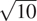倍。你的计时数据证实了这一点吗？10 万和 100 万的数据在多大程度上支持了的预测？你的结果是否符合你机器上的程序运行时间与计算所需的步骤数成正比的概念？

##### 练习 1.23

本节开头显示的`smallest_divisor`函数做了许多不必要的测试:在它检查这个数是否能被 2 整除之后，检查它是否能被任何更大的偶数整除就没有意义了。这表明用于`test_divisor`的值不应该是 2，3，4，5，6，.。。而是 2，3，5，7，9，为了实现这种变化，声明一个函数`next`，如果它的输入等于 2，则返回 3，否则返回它的输入加 2。修改`smallest_divisor`功能，用`next(test_divisor)`代替`test_divisor + 1`。用`timed_prime_test`合并这个`smallest_divisor`的修改版本，对练习 1.22 中找到的 12 个素数中的每一个进行测试。因为这个修改将测试步骤的数量减半，所以您应该期望它的运行速度提高一倍。这个预期得到证实了吗？如果不是，观察到的两种算法的速度之比是多少，如何解释它不同于 2 的事实？

##### 练习 1.24

修改练习 1.22 的`timed_prime_test`函数以使用`fast_is_prime`(费马方法)，并测试你在练习中发现的 12 个素数。因为费马测试有θ(logn)增长，你认为测试接近 100 万的素数所需的时间与测试接近 1000 的素数所需的时间相比如何？你的数据证实了这一点吗？你能解释你发现的任何差异吗？

##### 练习 1.25

Alyssa P. Hacker 抱怨说我们在写`expmod`的时候做了很多额外的工作。毕竟，她说，既然我们已经知道如何计算指数，我们可以简单地写

```js
function expmod(base, exp, m) {
    return fast_expt(base, exp) % m;
}
```

她是正确的吗？这个功能也适用于我们的快速 prime 测试器吗？解释一下。

##### 练习 1.26

路易斯·雷森纳做练习 1.24 有很大困难。他的`fast_is_prime`测试似乎比他的`is_prime`测试运行得更慢。路易斯叫他的朋友伊娃·卢阿特尔过来帮忙。当他们检查 Louis 的代码时，他们发现他重写了`expmod`函数以使用显式乘法，而不是调用`square`:

```js
function expmod(base, exp, m) {
    return exp === 0
           ? 1
           : is_even(exp)
           ? (  expmod(base, exp / 2, m)
              * expmod(base, exp / 2, m)) % m
           : (base * expmod(base, exp - 1, m)) % m;
}
```

“我看不出这有什么不同，”路易斯说。“我愿意。”伊娃说。“通过编写这样的函数，您已经将θ(logn)过程转换为θ(n)过程。”解释一下。

##### 练习 1.27

证明脚注 45 中列出的卡迈克尔数字确实欺骗了费马检验。也就是说，编写一个函数，该函数取一个整数 n ，并测试对于每个 a < n ， a ^n 是否与 a 模 n 同余，并在给定的 Carmichael 数上尝试您的函数。

##### 练习 1.28

费马试验的一个变体被称为米勒-拉宾试验(米勒 1976；拉宾 1980)。这从费马小定理的另一种形式开始，即如果 n 是一个质数，并且 a 是任何小于 n 的正整数，那么 a 的(n–1)次方等于 1 模 n 。为了通过米勒-拉宾测试来测试一个数 n 的素性，我们选取一个随机数 a < n 并使用`expmod`函数将 a 提升到(n【T28–1】的 st 次幂模 n 。然而，每当我们执行`expmod`中的平方步骤时，我们检查是否发现了“1 模 n 的非平凡平方根”，也就是说，一个不等于 1 或 n–1 的数的平方等于 1 模 n 。有可能证明，如果存在这样一个 1 的非平凡平方根，那么 n 不是素数。也有可能证明，如果 n 是一个不是素数的奇数，那么，对于至少一半的数 a < n ，以这种方式计算 a^n^(–1)将揭示 1 模 n 的非平凡平方根。(这就是米勒-拉宾测试不能被愚弄的原因。)修改`expmod`函数，如果它发现 1 的非平凡平方根，则发出信号，并使用类似于`fermat_test`的函数来实现米勒-拉宾测试。通过测试各种已知的素数和非素数来检查你的函数。提示:产生`expmod`信号的一种简便方法是让它返回 0。

## 1.3 用高阶函数表达抽象

我们已经看到，函数实际上是描述独立于特定数字的数字复合运算的抽象。例如，当我们声明

```js
function cube(x) {
    return x * x * x;
}
```

我们不是在讨论一个特定数的立方，而是在讨论一种获得任意数的立方的方法。当然，我们可以不声明这个函数，而总是编写如下表达式

```js
3 * 3 * 3
x * x * x
y * y * y
```

而且从来没有明确提到过`cube`。这将使我们处于非常不利的地位，迫使我们总是在特定操作的层次上工作，而这些操作恰好是语言中的原语(在这种情况下是乘法)，而不是高级操作。我们的程序能够计算立方体，但是我们的语言缺乏表达立方体概念的能力。我们应该从强大的编程语言中要求的一件事是，通过给公共模式命名来构建抽象，然后直接根据抽象工作。函数提供了这种能力。这就是为什么除了最原始的编程语言之外，其他语言都包含声明函数的机制。

然而，即使在数字处理中，如果我们局限于参数必须是数字的函数，我们创造抽象概念的能力也会受到严重限制。通常，相同的编程模式将用于许多不同的功能。为了将这种模式表达为概念，我们需要构造能够接受函数作为参数或者返回函数作为值的函数。操纵函数的函数称为高阶函数。本节展示了高阶函数如何作为强大的抽象机制，极大地增强我们语言的表达能力。

### 1.3.1 用作自变量

考虑以下三个函数。第一个函数计算从`a`到`b`的整数之和:

```js
function sum_integers(a, b) {
    return a > b
           ? 0
           : a + sum_integers(a + 1, b);
}
```

第二个函数计算给定范围内整数的立方之和:

```js
function sum_cubes(a, b) {
    return a > b
           ? 0
           : cube(a) + sum_cubes(a + 1, b);
}
```

第三个函数计算数列中一系列项的总和

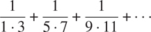

收敛到 π /8(非常慢): [^(49)](#c1-fn-0049)

```js
function pi_sum(a, b) {
    return a > b
           ? 0
           : 1 / (a * (a + 2)) + pi_sum(a + 4, b);
}
```

这三个功能显然共享一个共同的底层模式。它们在很大程度上是相同的，不同之处仅在于函数的名称，用于计算要添加的项的函数`a`，以及提供`a`的下一个值的函数。我们可以通过填充同一个模板中的槽来生成每个函数:

```js
function name(a, b) {
    return a > b
           ? 0
           : term(a) + name(next(a), b);
}
```

这种常见模式的存在是一个强有力的证据，表明有一个有用的抽象正等待被呈现出来。事实上，数学家很久以前就发现了级数求和的抽象概念，并发明了“西格玛符号”，例如

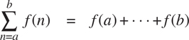

来表达这个概念。sigma 符号的强大之处在于，它允许数学家处理求和本身的概念，而不仅仅是特定的和，例如，制定与被求和的特定序列无关的和的一般结果。

同样，作为程序设计者，我们希望我们的语言足够强大，这样我们就可以编写一个函数来表达求和本身的概念，而不仅仅是计算特定和的函数。我们可以在函数式语言中很容易地做到这一点，方法是采用上面显示的通用模板，并将“插槽”转换为参数:

```js
function sum(term, a, next, b) {
    return a > b
           ? 0
           : term(a) + sum(term, next(a), next, b);
}
```

注意，`sum`将上下界`a`和`b`以及函数`term`和`next`作为它的参数。我们可以像使用任何函数一样使用`sum`。例如，我们可以使用它(以及一个将其参数增加 1 的函数`inc`)来定义`sum_cubes`:

```js
function inc(n) {
    return n + 1;
}
function sum_cubes(a, b) {
    return sum(cube, a, inc, b);
}
```

利用这个，我们可以计算从 1 到 10 的整数的立方之和:

```js
sum_cubes(1, 10);
3025
```

借助于计算该项的恒等函数，我们可以用`sum`来定义`sum_ integers`:

```js
function identity(x) {
    return x;
}

function sum_integers(a, b) {
    return sum(identity, a, inc, b);
}
```

然后我们可以把从 1 到 10 的整数加起来:

```js
sum_integers(1, 10);
55
```

我们也可以同样定义`pi_sum`:[^(50)](#c1-fn-0050)

```js
function pi_sum(a, b) {
    function pi_term(x) {
        return 1 / (x * (x + 2));
    }
    function pi_next(x) {
        return x + 4;
    }
    return sum(pi_term, a, pi_next, b);
}
```

使用这些函数，我们可以计算出 π 的近似值:

```js
8 * pi_sum(1, 1000);
3.139592655589783
```

一旦我们有了`sum`，我们就可以用它作为构建进一步概念的基础。例如，在极限值 a 和 b 之间的函数 f 的定积分可以使用以下公式进行数值近似

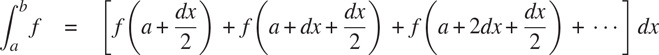

对于 dx 的小值。我们可以将它直接表示为一个函数:

```js
function integral(f, a, b, dx) {
    function add_dx(x) {
        return x + dx;
    }
    return sum(f, a + dx / 2, add_dx, b) * dx;
}

integral(cube, 0, 1, 0.01);
0.24998750000000042

integral(cube, 0, 1, 0.001);
0.249999875000001
```

(0 和 1 之间的`cube`积分的精确值是 1/4。)

##### 练习 1.29

辛普森法则是一种比上述方法更精确的数值积分方法。使用辛普森法则，函数 f 在 a 和 b 之间的积分近似为


其中 h=(b–a)/n，对于某些偶数整数 n ，以及 y[k]=f(a+KH)。(增加 n 会增加近似的精确度。)声明一个函数，该函数将参数 f、a 、 b 和 n 作为参数，并返回使用辛普森规则计算的积分值。使用您的函数在 0 和 1 之间积分`cube`(其中 n = 100， n = 1000)，并将结果与上面所示的`integral`函数的结果进行比较。

##### 练习 1.30

上面的`sum`函数生成一个线性递归。可以重写该函数，以便迭代地执行求和。通过填写以下声明中缺少的表达式来说明如何做到这一点:

```js
function sum(term, a, next, b) {
    function iter(a, result) {
        return 〈??〉
               ? 〈??〉
               : iter(〈??〉, 〈??〉);
    }
    return iter(〈??〉, 〈??〉);
}
```

##### 练习 1.31

1.  a .`sum`函数只是大量类似抽象中最简单的一个，这些抽象可以被捕捉为高阶函数。写一个类似的函数叫做`product`，它返回一个函数在给定范围内各点的值的乘积。演示如何根据`product`定义`factorial`。同样使用`product`计算 π 的近似值，使用公式[^(52)](#c1-fn-0052)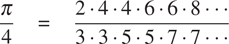

2.  b. 如果你的`product`函数生成了一个递归过程，那就写一个生成迭代过程的。如果它生成一个迭代过程，那么就写一个生成递归过程的程序。

##### 练习 1.32

1.  a. Show that `sum` and `product` (exercise 1.31) are both special cases of a still more general notion called `accumulate` that combines a collection of terms, using some general accumulation function:

    ```js
    accumulate(combiner, null_value, term, a, next, b);
    ```

    函数`accumulate`将与`sum`和`product`相同的术语和范围规格作为参数，以及一个`combiner`函数(两个参数),指定当前术语如何与前面术语的累积相结合，以及一个`null_value`,指定当术语用完时使用什么基值。编写`accumulate`并展示如何将`sum`和`product`都声明为对`accumulate`的简单调用。

    b.如果你的`accumulate`函数生成了一个递归过程，写一个生成迭代过程的函数。如果它生成一个迭代过程，那么就写一个生成递归过程的程序。

##### 练习 1.33

通过在要组合的术语上引入过滤器的概念，您可以获得一个更加通用的`accumulate`(练习 1.32)。也就是说，只组合那些从满足指定条件的范围内的值派生的术语。产生的`filtered_ accumulate`抽象采用与 accumulate 相同的参数，以及一个指定过滤器的参数的附加谓词。将`filtered_accumulate`写成一个函数。展示如何使用`filtered_accumulate`表达以下内容:

1.  a. 区间 a 到 b 的素数的平方和(假设你已经写好了一个`is_prime`谓词)
2.  b. 所有小于 n 且与 n 互质的正整数的乘积(即所有正整数 i < n 使得 GCD( i ， n ) = 1)。

### 1.3.2 使用 Lambda 表达式构造函数

在 1.3.1 节中使用`sum`时，不得不声明像`pi_term`和`pi_next`这样的小函数，以便我们可以将它们用作高阶函数的参数，这看起来非常尴尬。比起声明`pi_next`和`pi_term`，更方便的方法是直接指定“返回其输入递增 4 的函数”和“返回其输入乘以输入加 2 的倒数的函数”我们可以通过引入λ表达式作为创建函数的语法形式来做到这一点。使用 lambda 表达式，我们可以将我们想要的描述为

```js
x => x + 4
```

和

```js
x => 1 / (x * (x + 2))
```

然后我们可以不用声明任何辅助函数来表达我们的`pi_sum`函数:

```js
function pi_sum(a, b) {
    return sum(x => 1 / (x * (x + 2)),
               a,
               x => x + 4,
               b);
}
```

再次使用 lambda 表达式，我们可以编写`integral`函数，而不必声明辅助函数`add_dx`:

```js
function integral(f, a, b, dx) {
    return sum(f,
               a + dx / 2,
               x => x + dx,
               b)
           * 
           dx;
}
```

一般来说，lambda 表达式用于创建函数的方式与函数声明相同，只是没有为函数指定名称，并且省略了`**return**`关键字和大括号(如果只有一个参数，参数列表两边的括号也可以省略，就像我们看到的例子一样)。 [^(53)](#c1-fn-0053)

```js
(parameters) => expression
```

结果函数就像使用函数声明语句创建的函数一样。唯一的区别是它没有与环境中的任何名称相关联。我们认为

```js
function plus4(x) {
    return x + 4;
}
```

相当于 [^(54)](#c1-fn-0054)

```js
const plus4 = x => x + 4;
```

我们可以如下阅读 lambda 表达式:

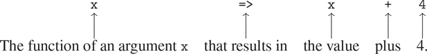

像任何以函数作为其值的表达式一样，lambda 表达式可以用作应用程序中的函数表达式，例如

```js
((x, y, z) => x + y + square(z))(1, 2, 3);
12
```

或者，更一般地，在我们通常使用函数名的任何上下文中。 [^(55)](#c1-fn-0055) 注意`=>`的优先级比函数应用程序低，因此 lambda 表达式两边的括号在这里是必要的。

##### 使用`const`创建本地名称

lambda 表达式的另一个用途是创建本地名称。在我们的函数中，除了那些已经作为参数绑定的名字之外，我们经常需要局部名字。例如，假设我们希望计算函数

```js
f (x, y) = x(1 + xy)2 + y(1 – y) + (1 + xy)(1 – y) 
```

我们也可以表达为

```js
   a = 1 + xy
   b = 1 – y
f (x, y) = xa2 + yb + ab
```

在编写计算 f、的函数时，我们希望不仅包括局部名称 x 和 y ，还包括中间量的名称，如 a 和 b 。实现这一点的一种方法是使用辅助函数来绑定本地名称:

```js
function f(x, y) {
    function f_helper(a, b) {
        return x * square(a) + y * b + a * b;
    }
    return f_helper(1 + x * y, 1 - y);
}
```

当然，我们可以使用 lambda 表达式指定一个匿名函数来绑定我们的本地名称。然后，函数体变成对该函数的单个调用:

```js
function f_2(x, y) {
    return ( (a, b) => x * square(a) + y * b + a * b
           )(1 + x * y, 1 - y);
}
```

声明局部名称的一个更方便的方法是在函数体中使用常量声明。使用`**const**`，该函数可以写成

```js
function f_3(x, y) {
    const a = 1 + x * y; 
    const b = 1 - y;
    return x * square(a) + y * b + a * b;
}
```

在一个块中用`**const**`声明的名字以紧邻的块的主体作为它们的作用域。[^(56)](#c1-fn-0056)^([^(57)](#c1-fn-0057))

##### 条件语句

我们已经看到，声明函数声明的局部名称通常是有用的。当函数变大时，我们应该尽可能缩小名字的范围。以练习 1.26 中的`expmod`为例。

```js
function expmod(base, exp, m) {
    return exp === 0
           ? 1
           : is_even(exp)
           ? ( expmod(base, exp / 2, m)
              * expmod(base, exp / 2, m)) % m
           : (base * expmod(base, exp - 1, m)) % m;
}
```

这个函数的效率非常低，因为它包含两个相同的调用:

```js
expmod(base, exp / 2, m);
```

虽然在本例中使用`square`函数可以很容易地解决这个问题，但这通常并不容易。如果不使用`square`，我们可能会为表达式引入一个本地名称，如下所示:

```js
function expmod(base, exp, m) {
    const half_exp = expmod(base, exp / 2, m);
    return exp === 0
           ? 1
           : is_even(exp)
           ? (half_exp * half_exp) % m
           : (base * expmod(base, exp - 1, m)) % m;
}
```

这将使函数不仅效率低下，而且实际上没有终止性！问题是常量声明出现在条件表达式之外，这意味着即使满足基本情况`exp === 0`也要执行。为了避免这种情况，我们提供了条件语句，并允许返回语句出现在语句的分支中。使用条件语句，我们可以如下编写函数`expmod`:

```js
function expmod(base, exp, m) {
    if (exp === 0) {
        return 1;
    } else {
        if (is_even(exp)) {
            const half_exp = expmod(base, exp / 2, m);
            return (half_exp * half_exp) % m;
        } else {
            return (base * expmod(base, exp - 1, m)) % m;
        }
    }
}
```

条件语句的一般形式是

```js
if (predicate) { consequent-statements } else { alternative-statements }
```

至于条件表达式，解释器首先评估谓词。如果评估为真，解释器依次评估结果 - 语句，如果评估为假，解释器依次评估替代 - 语句。return 语句的计算从周围函数返回，忽略序列中 return 语句之后的任何语句以及条件语句之后的任何语句。请注意，出现在任一部分中的任何常量声明都是该部分的局部声明，因为每个部分都用大括号括起来，从而形成了自己的块。

##### 练习 1.34

假设我们声明

```js
function f(g) {
    return g(2);
}
```

那么我们有

```js
f(square);
4

f(z => z * (z + 1));
6
```

如果我们(固执地)要求解释者评估应用程序`f(f)`，会发生什么？解释一下。

### 1.3.3 功能为一般方法

我们在 1.1.4 节中介绍了复合函数，作为抽象数字运算模式的一种机制，以使它们独立于所涉及的特定数字。对于高阶函数，比如 1.3.1 节中的`integral`函数，我们开始看到一种更强大的抽象:用于表达一般计算方法的函数，独立于所涉及的特定函数。在本节中，我们将讨论两个更详细的例子——寻找零点和函数不动点的一般方法——并展示如何将这些方法直接表示为函数。

##### 用半区间法求方程的根

半区间法是一种简单而强大的技术，用于寻找方程 f ( x ) = 0 的根，其中 f 是一个连续函数。其思想是，如果给我们点 a 和 b ，使得 f(a)<0<f(b)，那么 f 在 a 和 b 之间必须至少有一个零。为了定位零点，让 x 是 a 和 b 的平均值，并计算 f ( x )。如果 f ( x ) >为 0，那么 f 在 a 和 x 之间必须为零。如果 f ( x ) < 0，那么 f 在 x 和 b 之间必须有一个零。这样继续下去，我们可以识别出越来越小的区间，在这些区间上 f 必须为零。当我们到达一个间隔足够小的点时，这个过程就停止了。由于不确定性的区间在过程的每一步减少一半，所需的最大步骤数增长为θ(log(L/T)，其中 L 是原始区间的长度， T 是误差容限(即我们将认为“足够小”的区间大小)。下面是实现这一策略的函数:

```js
function search(f, neg_point, pos_point) {
    const midpoint = average(neg_point, pos_point);
    if (close_enough(neg_point, pos_point)) {
        return midpoint;
    } else {
        const test_value = f(midpoint);
        return positive(test_value)
               ? search(f, neg_point, midpoint)
               : negative(test_value)
               ? search(f, midpoint, pos_point)
               : midpoint;
    }
}
```

我们假设最初给定函数 f 以及其值为负和正的点。我们首先计算两个给定点的中点。接下来，我们检查给定的区间是否足够小，如果足够小，我们就返回中点作为我们的答案。否则，我们计算中点处 f 的值作为测试值。如果测试值是正的，那么我们继续这个过程，从原来的负点到中点运行一个新的区间。如果测试值为负，我们继续从中点到正点的区间。最后，测试值有可能是 0，在这种情况下，中点本身就是我们要寻找的根。为了测试端点是否“足够接近”，我们可以使用一个类似于 1.1.7 节中用于计算平方根的函数: [^(58)](#c1-fn-0058)

```js
function close_enough(x, y) {
    return abs(x - y) < 0.001;
}
```

函数`search`很难直接使用，因为我们可能会不小心给它一些点，在这些点上 f 的值没有所需的符号，在这种情况下，我们会得到一个错误的答案。相反，我们将通过下面的函数使用`search`,该函数检查哪个端点具有负函数值，哪个端点具有正值，并相应地调用`search`函数。如果该函数在两个给定点上具有相同的符号，则不能使用半区间方法，在这种情况下，该函数发出错误信号。 [^(59)](#c1-fn-0059)

```js
function half_interval_method(f, a, b) {
    const a_value = f(a);
    const b_value = f(b);
    return negative(a_value) && positive(b_value)
           ? search(f, a, b)
           : negative(b_value) && positive(a_value)
           ? search(f, b, a)
           : error("values are not of opposite sign");
}
```

以下示例使用半区间法将 π 近似为 sin x = 0 的 2 和 4 之间的根:

```js
half_interval_method(math_sin, 2, 4);
3.14111328125
```

这里再举一个例子，用半区间法在 1 和 2 之间求方程 x3–2x–3 = 0 的根:

```js
half_interval_method(x => x * x * x - 2 * x - 3, 1, 2);
1.89306640625
```

##### 寻找函数的不动点

如果 x 满足方程 f(x)=x，则一个数 x 称为函数 f 的不动点。对于一些函数 f 我们可以通过从初始猜测开始并重复应用 f 来定位固定点，

```js
f (x), f (f (x)), f (f (f (x))), . . .
```

直到数值变化不大。使用这个想法，我们可以设计一个函数`fixed_point`,它将一个函数和一个初始猜测作为输入，并产生该函数的一个固定点的近似值。我们重复应用该函数，直到找到两个连续值，它们的差小于某个规定的容差:

```js
const tolerance = 0.00001;
function fixed_point(f, first_guess) {
    function close_enough(x, y) {
        return abs(x - y) < tolerance;
    }
    function try_with(guess) {
        const next = f(guess);
        return close_enough(guess, next)
               ? next
               : try_with(next);
    }
    return try_with(first_guess);
}
```

比如我们可以用这个方法来近似余弦函数的不动点，从 1 开始作为初始近似: [^(60)](#c1-fn-0060)

```js
fixed_point(math_cos, 1);
0.7390822985224023
```

同样，我们可以找到方程 y= siny+cosy 的解:

```js
fixed_point(y => math_sin(y) + math_cos(y), 1);
1.2587315962971173
```

定点过程使人想起我们在 1.1.7 节中用来求平方根的过程。这两种方法都是基于反复改进猜测直到结果满足某种标准的想法。事实上，我们可以很容易地将平方根计算公式化为定点搜索。计算某数 x 的平方根需要找到一个 y 使得 y2=x。将这个等式转换成等价形式 y=x/y，我们认识到我们正在寻找函数[^(61)](#c1-fn-0061)y x/y 的一个固定点，因此我们可以尝试计算平方根为

```js
function sqrt(x) {
    return fixed_point(y => x / y, 1);
}
```

不幸的是，这种定点搜索并不收敛。考虑一个最初的猜测 yT2【1】。下一个猜测是 y[2]=x/y[1]下一个猜测是 y[3]=x/y[2]=x/(x/y 这导致了一个无限循环，其中两个猜测 y1 和 y2 一遍又一遍地重复，围绕着答案振荡。

控制这种波动的一个方法是防止猜测变化太大。由于答案总是在我们的猜测 y 和 x / y 之间，所以我们可以通过将 y 与 x / y 进行平均来做出一个新的猜测，这个新的猜测距离 y 没有距离 x / y 远，这样在 y 之后的下一个猜测就是 ( 【T21 做出这样一系列猜测的过程，简单来说就是寻找 y(y+x/y)不动点的过程:

```js
function sqrt(x) {
    return fixed_point(y => average(y, x / y), 1);
}
```

(注意 y=(y+x/y)是方程 y=x/y 的简单变换；要导出它，将 y 加到等式的两边，然后除以 2。)

通过这种修改，平方根函数可以工作。事实上，如果我们解开定义，我们可以看到这里生成的平方根的近似序列与我们在 1.1.7 节中的原始平方根函数生成的序列完全相同。这种将逐次逼近平均到一个解的方法，我们称之为平均阻尼的技术，通常有助于定点搜索的收敛。

##### 练习 1.35

证明黄金分割比ϕ(1 . 2 . 2 节)是变换 x1+1/x 的不动点，并利用这个事实通过`fixed_point`函数计算 ϕ 。

##### 练习 1.36

使用练习 1.22 中显示的原函数`display`，修改`fixed_point`，使其打印生成的近似序列。然后通过找到 xlog(1000)/log(x)的一个不动点，求出 x^xx= 1000 的解。(使用原始函数`math_log`，它计算自然对数。)比较使用和不使用平均阻尼时的步数。(注意，不能以猜测值 1 开始`fixed_point`，因为这会导致除以 log(1) = 0。)

##### 练习 1.37

一个无限的连分数是以下形式的表达式

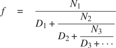

作为一个例子，一个人可以表明，在 n[I]t31】和 d[I]t35】都等于 1 的情况下，无限连分数展开产生 1/ ϕ ，其中 ϕ 是黄金分割比例(在 1.2.2 节中描述)。逼近无穷连分数的一种方法是在给定项数后截断展开式。这种截断——所谓的 k 项有限连分式——具有以下形式

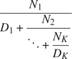

1.  a. Suppose that `n` and `d` are functions of one argument (the term index i) that return the N[i] and D[i] of the terms of the continued fraction. Declare a function `cont_frac` such that evaluating `cont_frac(n, d, k)` computes the value of the k-term finite continued fraction. Check your function by approximating 1ϕ using

    ```js
    cont_frac(i => 1, i => 1, k);
    ```

    用于`k`的连续值。为了得到精确到小数点后 4 位的近似值，必须使`k`多大？

2.  b. 如果你的`cont_frac`函数生成一个递归过程，写一个生成迭代过程的函数。如果它生成一个迭代过程，那么就写一个生成递归过程的程序。

##### 练习 1.38

1737 年，瑞士数学家莱昂哈德·欧拉出版了回忆录 De Fractionibus Continuis ，其中包括对 e–2 的连分数展开，其中 e 是自然对数的底数。在这个分数里，N[I]都是 1，D[I]依次是 1，2，1，1，1，4，1，1，6，1，1，8，写一个程序，用你练习 1.37 里的`cont_frac`函数来近似 e ，基于欧拉展开式。

##### 练习 1.39

德国数学家 J.H. Lambert 在 1770 年发表了正切函数的连分式表示:

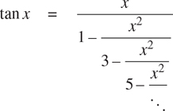

其中 x 以弧度为单位。声明一个函数`tan_cf(x, k)`，它根据 Lambert 公式计算正切函数的近似值。和练习 1.37 一样，`k`指定了要计算的项数。

### 1.3.4 功能为返回值

上面的例子展示了将函数作为参数传递的能力如何显著增强了我们的编程语言的表达能力。通过创建返回值本身就是函数的函数，我们可以获得更强的表达能力。

我们可以通过再次查看 1.3.3 节末尾描述的定点例子来说明这一点。我们将平方根函数的新版本公式化为定点搜索，从观察到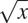是函数 yx/y 的定点开始。然后我们使用平均阻尼使近似收敛。平均阻尼本身是一种有用的通用技术。也就是说，给定一个函数 f，我们考虑这个函数在 x 的值等于 x 和 f ( x )的平均值。

我们可以用下面的函数来表达平均阻尼的概念:

```js
function average_damp(f) {
    return x => average(x, f(x));
}
```

函数`average_damp`将函数`f`作为其参数，并返回一个函数(由 lambda 表达式生成)作为其值，当该函数应用于数字`x`时，会生成`x`和`f(x)`的平均值。例如，将`average_damp`应用于`square`函数会产生一个函数，该函数在某个数字 x 处的值是 x 和 x2 的平均值。将此结果函数应用于 10 将得出 10 和 100 的平均值，即 55: [^(62)](#c1-fn-0062)

```js
average_damp(square)(10);
55
```

使用`average_damp`，我们可以将平方根函数重新表述如下:

```js
function sqrt(x) {
    return fixed_point(average_damp(y => x / y), 1);
}
```

注意这个公式是如何使方法中的三个概念变得清晰的:定点搜索、平均阻尼和函数 y x / y 。将平方根法的公式与第 1.1.7 节给出的原始公式进行比较是有益的。请记住，这些函数表达了相同的过程，请注意，当我们用这些抽象来表达过程时，这个想法变得多么清晰。一般来说，有许多方法可以将过程公式化为一个函数。有经验的程序员知道如何选择特别清晰的流程公式，以及流程中有用的元素被公开为可以在其他应用程序中重用的独立实体。作为重用的一个简单例子，请注意， x 的立方根是函数 y x/y²的一个不动点，因此我们可以立即将我们的平方根函数推广为提取立方根的函数: [^(63)](#c1-fn-0063)

```js
function cube_root(x) {
   return fixed_point(average_damp(y => x / square(y)), 1);
}
```

##### 牛顿方法

当我们第一次介绍平方根函数时，在 1.1.7 节中，我们提到这是牛顿法的特例。如果 xg(x)是一个可微函数，那么方程 g ( x ) = 0 的一个解就是函数 xf(x)的一个不动点其中

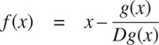

而 Dg ( x )是在 x 处求的 g 的导数。牛顿法就是我们上面看到的不动点法的运用，通过寻找函数 f 的不动点来逼近方程的一个解。 [^(64)](#c1-fn-0064) 对于许多函数 g 以及对于 x 的足够好的初始猜测，牛顿法非常迅速地收敛到 g ( x ) = 0 的解。 [^(65)](#c1-fn-0065)

为了将牛顿法实现为函数，首先要表达导数的思想。注意，“导数”和平均阻尼一样，是将一个函数转换成另一个函数的东西。例如，函数 xx3 的导数就是函数 x3x2。一般来说，如果 g 是一个函数，而 dx 是一个小数字，那么 g 的导数 Dg 是这样一个函数，它在任意数字 x 处的值由下式给出(在小 dx 的范围内)


因此，我们可以将导数的概念(取 dx 为 0.00001)表示为函数

```js
function deriv(g) {
    return x => (g(x + dx) - g(x)) / dx;
}
```

与宣言一起

```js
const dx = 0.00001;
```

和`average_damp`一样，`deriv`是一个以函数为自变量，以值返回函数的函数。例如，为了逼近 xx³在 5 处的导数(其精确值为 75 ),我们可以计算

```js
function cube(x) { return x * x * x; }

deriv(cube)(5);
75.00014999664018
```

借助`deriv`，我们可以把牛顿法表述为一个定点过程:

```js
function newton_transform(g) {
    return x => x - g(x) / deriv(g)(x);
}
function newtons_method(g, guess) {
    return fixed_point(newton_transform(g), guess);
}
```

`newton_transform`函数表达了本节开头的公式，而`newtons_method`很容易根据这个公式来定义。它以一个函数作为参数，这个函数计算我们想要找到零的函数，以及一个初始猜测。例如，为了找到 x 的平方根，我们可以使用牛顿法来找到函数 yy2–x 的零点，从最初的猜测 1 开始。 [^(66)](#c1-fn-0066) 这提供了平方根函数的另一种形式:

```js
function sqrt(x) {
    return newtons_method(y => square(y) - x, 1);
}
```

##### 抽象和一流的功能

我们已经看到了两种将平方根计算表示为更一般方法的实例的方法，一种是定点搜索，另一种是使用牛顿法。由于牛顿的方法本身被表达为定点过程，我们实际上看到了两种计算平方根的方法作为定点。每一种方法都是从一个函数开始，找到这个函数的某个变换的不动点。我们可以将这一总体想法本身表达为一个函数:

```js
function fixed_point_of_transform(g, transform, guess) {
    return fixed_point(transform(g), guess);
}
```

这个非常普通的函数以一个计算某个函数的函数`g`、一个转换函数`g`和一个初始猜测为参数。返回的结果是转换函数的固定点。

使用这个抽象，我们可以改写本节中的第一个平方根计算(这里我们寻找平均阻尼版本的 yx/y)作为这个通用方法的一个实例:

```js
function sqrt(x) {
    return fixed_point_of_transform(
               y => x / y,
               average_damp,
               1);
}
```

类似地，我们可以将这一节中的第二次平方根计算(牛顿法的一个实例，用于找到 yy²–x 的牛顿变换的一个固定点)表示为

```js
function sqrt(x) {
    return fixed_point_of_transform(
               y => square(y) - x,
               newton_transform,
               1);
}
```

我们在 1.3 节开始时观察到复合函数是一个重要的抽象机制，因为它们允许我们将一般的计算方法表达为编程语言中的显式元素。现在我们已经看到了高阶函数如何允许我们操纵这些通用方法来创建进一步的抽象。

作为程序员，我们应该注意识别程序中底层抽象的机会，并在此基础上构建和概括它们以创建更强大的抽象。这并不是说一个人应该总是尽可能用最抽象的方式编写程序；专业程序员知道如何选择适合他们任务的抽象层次。但是，能够根据这些抽象进行思考是很重要的，这样我们就可以准备好在新的环境中应用它们。高阶函数的意义在于，它们使我们能够将这些抽象明确地表示为编程语言中的元素，这样它们就可以像其他计算元素一样被处理。

一般来说，编程语言对计算元素的操作方式施加了限制。限制最少的元素据说拥有一级状态。一流元素的一些“权利和特权”有: [^(67)](#c1-fn-0067)

*   他们可以用名字来称呼。
*   它们可以作为参数传递给函数。
*   它们可以作为函数的结果返回。
*   它们可以包含在数据结构中。 [^(68)](#c1-fn-0068)

与其他高级编程语言一样，JavaScript 赋予函数完全的一流地位。这给高效实现带来了挑战，但由此带来的表达能力的提升是巨大的。 [^(69)](#c1-fn-0069)

##### 练习 1.40

声明一个函数`cubic`,它可以与函数`newtons_method`一起用于以下形式的表达式中

```js
newtons_method(cubic(a, b, c), 1)
```

求三次 x3+ax2+bx+c 的近似零点。

##### 练习 1.41

声明一个函数`double`，该函数将一个参数的函数作为参数，并返回一个应用原始函数两次的函数。举个例子，如果`inc`是一个给自变量加 1 的函数，那么`double(inc)`应该是一个加 2 的函数。由返回什么值

```js
double(double(double))(inc)(5);
```

##### 练习 1.42

设 f 和 g 为两个单参数函数。 g 后的成分 f 定义为函数 xf(g(x))。声明一个实现组合的函数`compose`。例如，如果`inc`是一个参数加 1 的函数，

```js
compose(square, inc)(6);
49
```

##### 练习 1.43

如果 f 是一个数值函数， n 是一个正整数，那么我们就可以形成 f 的第 n 次重复应用，定义为在 x 处的值为 f ( f ( )的函数。。。(f(x)。。。))。例如:如果 f 是函数 x  x + 1，那么 f 的第 n 次重复应用就是函数 xx+n。如果 f 是一个数的平方运算，那么 f 的第 n 次重复应用就是将其自变量提升到 2 ^( n ) 次方的函数。编写一个函数，将计算 f 和正整数 n 的函数作为输入，并返回计算第 n 次重复应用 f 的函数。您的函数应该能够按如下方式使用:

```js
repeated(square, 2)(5);
625
```

提示:你可能会发现使用练习 1.42 中的`compose`很方便。

##### 练习 1.44

平滑函数的思想是信号处理中的一个重要概念。如果 f 是一个函数而 dx 是某个小数字，那么 f 的平滑版本就是这样一个函数，它在某个点 x 的值是 f(x–dx)、 f ( x )和 f ( 【T25 编写一个函数`smooth`，它将计算 f 的函数作为输入，并返回一个计算平滑后的 f 的函数。重复平滑一个函数(即平滑平滑后的函数，等等)以获得 n 重平滑函数有时是有价值的。演示如何使用练习 1.43 中的`smooth`和`repeated`生成任意给定函数的 n 倍平滑函数。

##### 练习 1.45

我们在 1.3.3 节中看到，试图通过天真地找到一个固定点 y  x / y 来计算平方根并不收敛，这可以通过平均阻尼来解决。同样的方法也适用于寻找作为平均阻尼的 yx/y²的不动点的立方根。不幸的是，该过程不适用于第四根——单个平均阻尼不足以对 yx/y³收敛进行定点搜索。另一方面，如果我们平均阻尼两次(即，使用平均阻尼的平均阻尼为 yx/y³)，定点搜索确实收敛。根据 yx/y^n^(–1)的重复平均阻尼，做一些实验来确定作为定点搜索计算 n 根需要多少个平均阻尼。用这个实现一个简单的函数，用练习 1.43 中的`fixed_point`、`average_damp`和`repeated`函数计算 n 次方根。假设您需要的任何算术运算都可以作为原语获得。

##### 练习 1.46

本章中描述的几种数值方法是一种非常通用的计算策略的实例，称为迭代改进。迭代改进是指，为了计算某个东西，我们从答案的初始猜测开始，测试猜测是否足够好，否则改进猜测，并使用改进的猜测作为新的猜测继续这个过程。编写一个函数`iterative_improve`,它采用两个函数作为参数:一个判断猜测是否足够好的方法和一个改进猜测的方法。函数`iterative_improve`应该返回一个函数作为它的值，该函数将猜测作为参数，并不断改进猜测，直到它足够好。将 1.1.7 节的`sqrt`功能和 1.3.3 节的`fixed_point`功能用`iterative_improve`改写。*  *将数字描述为“简单数据”是赤裸裸的虚张声势。事实上，对数字的处理是任何编程语言中最棘手和最令人困惑的方面之一。涉及的一些典型问题是这样的:一些计算机系统区分整数，如 2，和实数，如 2.71。实数 2.00 和整数 2 有区别吗？整数使用的算术运算和实数使用的运算一样吗？6 除以 2 等于 3，还是等于 3.0？我们能代表多大的数字？我们可以表示多少位小数精度？整数的范围和实数的范围一样吗？当然，除了这些问题之外，还有一系列关于舍入和截断误差的问题——整个数值分析科学。由于本书的重点是大规模程序设计而不是数值技术，我们将忽略这些问题。本章中的数值示例将展示在非整数运算中使用保留有限小数位数精度的算术运算时观察到的常见舍入行为。

[2](#c1-fn-0002a) 在本书中，我们通过用倾斜的字符显示解释器打印的文本来区分用户输入的内容和解释器打印的文本。

[3](#c1-fn-0003a) JavaScript 遵循每个语句都有一个值的惯例(参见练习 4.8)。这种惯例，再加上 JavaScript 程序员不关心效率的名声，让我们套用 Alan Perlis 对 Lisp 程序员的一句俏皮话(他自己也在套用 Oscar Wilde 的话): JavaScript 程序员知道所有东西的价值，却不知道任何东西的成本。

在本书中，我们没有展示解释器对以声明结尾的程序的评估的反应，因为这可能依赖于先前的语句。详见练习 4.8。

第三章将展示环境的概念对于理解解释器如何工作是至关重要的。第四章将使用环境来实现解释器。

[6](#c1-fn-0006a) 注意，这里有两个不同的操作被组合在一起:我们正在创建函数，并给它命名为`square`。将这两个概念分开是可能的，也是非常重要的——创建函数而不命名，以及给已经创建的函数命名。我们将在 1.3.2 节中看到如何做到这一点。

[7](#c1-fn-0007a) 在整本书中，我们将使用斜体符号来描述表达式的一般语法——例如 name——来表示表达式中的“槽”,以便在实际使用这样的表达式时进行填充。

更一般地说，函数体可以是一系列语句。在这种情况下，解释器依次评估序列中的每个语句，直到一个返回语句确定函数应用的值。

[9](#c1-fn-0009a) 像`sum_of_squares`这样由多个部分组成的名字的书写方式会影响程序的可读性，编程社区对此有不同的看法。根据常见的 JavaScript 约定，名为的骆驼案，其名称应该是`sumOfSquares`。本书中使用的约定被称为 snake case ，选择它是因为它与本书 Scheme 版本中使用的约定更相似，在 Scheme 版本中，连字符扮演我们的下划线角色。

我们的 JavaScript 环境包含了 ECMAScript 的 Math 对象的所有函数和常量，命名为`math_. . .`。例如，ECMAScript 的`Math.log`可用作`math_log`。这本书的麻省理工学院出版社网页包括 JavaScript 包`sicp`，它提供了这些和所有其他在书中被认为是基本的 JavaScript 函数。

[11](#c1-fn-0011a) 如果函数体是一个语句序列，则用替换的参数对函数体求值，应用的值就是遇到的第一个返回语句的返回表达式的值。

[12](#c1-fn-0012a) 尽管替换的想法很简单，但给替换过程下一个严格的数学定义却异常复杂。这个问题是由于函数的参数名和函数可能应用的表达式中使用的(可能相同的)名称可能会混淆。事实上，在逻辑和编程语义的文献中，对替换的错误定义由来已久。参见 Stoy 1977 对替代的详细讨论。

[13](#c1-fn-0013a) 在第 3 章中，我们将介绍流处理，这是一种处理明显“无限”数据结构的方式，通过合并有限形式的正常顺序评估。在 4.2 节中，我们将修改 JavaScript 解释器来产生 JavaScript 的正常顺序变体。

完整 JavaScript 中的条件接受任何值，而不仅仅是布尔值，作为评估谓词表达式的结果(详见 4.1.3 节的脚注 14)。本书中的程序只使用布尔值作为条件句的谓语。

现在，我们将这些操作符限制为数字参数。在 2.3.1 和 3.3.1 节中，我们将概括等式和不等式谓词`===`和`!==`。

用彼得·兰丁创造的一个短语来说， [16](#c1-fn-0016a) 句法形式是可以用更统一的方式书写的事物的简单方便的替代表层结构，有时被称为句法糖。

陈述性和命令性描述密切相关，数学和计算机科学也是如此。例如，说一个程序产生的答案是“正确的”,就是对这个程序做一个声明性的陈述。有大量的研究旨在建立证明程序是正确的技术，并且该主题的大部分技术困难与协商命令性语句(从中构造程序)和声明性语句(可用于推断事物)之间的转换有关。与此相关，编程语言设计者已经探索了所谓的超高级语言，在这种语言中，人们实际上是根据声明性语句来编程的。这个想法是让解释器足够复杂，这样，给定程序员指定的“是什么”的知识，它们可以自动生成“如何”的知识。这在总体上是做不到的，但在一些重要领域已经取得了进展。我们将在第四章重新讨论这个观点。

[18](#c1-fn-0018a) 这个平方根算法其实是牛顿法的一个特例，牛顿法是一种求方程根的通用技术。平方根算法本身是在公元一世纪由亚历山大的 Heron 开发的。我们将在 1.3.4 节中看到如何将一般的牛顿法表达为一个 JavaScript 函数。

我们通常以`is_`开头给谓词命名，以帮助我们记住它们是谓词。

担心使用函数调用实现迭代所涉及的效率问题的读者应该注意 1.2.1 节中关于“尾部递归”的注释。

[21](#c1-fn-0021a) 作为一个 Lisp 黑客从最初的计算机程序的结构和解释开始，Alyssa 更喜欢更简单、更统一的语法。

甚至不清楚这些功能中哪一个是更有效的实现。这取决于可用的硬件。有些机器的“明显”实现是效率较低的。考虑一台机器，它有大量的对数和反对数表，并以非常有效的方式存储着。

[23](#c1-fn-0023a) 一致重命名的概念实际上很微妙，很难正式定义。著名的逻辑学家在这里犯了令人尴尬的错误。

[24](#c1-fn-0024a) 词法作用域规定函数中的自由名被用来引用封闭函数声明所做的绑定；也就是说，它们是在声明函数的环境中查找的。当我们在第三章学习环境和解释者的详细行为时，我们将会看到这是如何工作的。

嵌入式声明必须首先出现在函数体中。管理层不对运行将声明和使用交织在一起的程序的后果负责；另见第 1.3.2 节脚注 54 和 56。

[26](#c1-fn-0026a) 在一个真实的程序中我们可能会使用上一节介绍的块结构来隐藏`fact_iter`的声明:
**function**factorial(n){
**function**ITER(product，counter){
**return**counter>n
？乘积
: iter(计数器*乘积，
计数器+1)；
}
**返回** iter(1，1)；
}
我们在这里避免这样做，以尽量减少要同时考虑的事情。

[27](#c1-fn-0027a) 当我们在第五章讨论寄存器机器上的函数实现时，我们会看到，任何迭代过程都可以“在硬件中”实现为一台具有固定寄存器集且没有辅助存储器的机器。相比之下，实现一个递归过程需要一台机器，它使用一种叫做栈的辅助数据结构。

尾递归作为一种编译器优化技巧早已广为人知。卡尔·休伊特(1977)为尾部递归提供了一个连贯的语义基础，他用我们将在第三章讨论的计算的“信息传递”模型来解释它。受此启发，杰拉德·让伊·萨斯曼和小盖伊·路易斯·斯蒂尔(见斯蒂尔 1975)为 Scheme 构造了一个尾递归解释器。Steele 后来展示了尾部递归是编译函数调用的自然方式的结果(Steele 1977)。IEEE Scheme 标准要求 Scheme 实现是尾递归的。JavaScript 的 ECMA 标准最终紧随其后推出了 ECMAScript 2015 (ECMA 2015)。但是，请注意，在撰写本文时(2021 年)，大多数 JavaScript 实现在尾部递归方面都不符合这个标准。

练习 4.7 探索了 JavaScript 的 while 循环，作为产生迭代过程的函数的语法糖。与其他传统语言一样，完整的 JavaScript 语言具有大量的语法形式，所有这些都可以用 Lisp 语言更统一地表达。这一点，再加上这些结构通常包含分号，而分号的位置规则有时并不明显，艾伦·珀利斯(Alan Perlis)开玩笑说:“句法糖导致分号的癌症。”

第 1.1.3 节暗示了一个例子:解释器本身使用一个树递归过程来评估表达式。

[31](#c1-fn-0031a) 例如，详细研究归约规则如何应用于用便士和镍币兑换 10 美分的问题。

处理冗余计算的一种方法是安排事情，这样我们可以在计算时自动构建一个数值表。每当我们被要求将函数应用于某个参数时，我们首先查看该值是否已经存储在表中，在这种情况下，我们避免执行多余的计算。这种策略被称为列表或记忆，可以以一种简单的方式实现。制表有时可用于将需要指数数量步骤的过程(如`count_change`)转化为空间和时间需求随输入线性增长的过程。参见练习 3.27。

[33](#c1-fn-0033a) 帕斯卡三角形的元素称为二项式系数，因为第 n 行由(x+y)^n展开式中各项的系数组成。这种计算系数的模式出现在布莱士·帕斯卡 1653 年关于概率理论的开创性著作《T21 三角形算法教程》中。根据 Edwards (2019)，同样的模式也出现在 11 世纪波斯数学家 Al-Karaji、12 世纪印度数学家 Bhaskara 和 13 世纪中国数学家杨辉的著作中。

这些说法掩盖了大量的过分简单化。例如，如果我们把过程步骤算作“机器操作”,我们就假设执行一次乘法所需的机器操作的数量与被乘数字的大小无关，如果数字足够大，这个假设就是错误的。类似的评论也适用于对空间的估计。像过程的设计和描述一样，过程的分析可以在不同的抽象层次上进行。

[35](#c1-fn-0035a) 更准确地说，所需乘法次数等于比 n 的对数基数 2 少 1，加上 n 的二进制表示中的 1 的数量。这个总数总是小于 n 的对数基数 2 的两倍。顺序符号定义中的任意常数 k [1] 和 k [2] 意味着，对于对数过程来说，取对数的底数并不重要，因此所有这样的过程都被描述为θ(logn)。

你可能想知道为什么有人会关心数字的 1000 次方。参见第 1.2.6 节。

[37](#c1-fn-0037a) 这种迭代算法是古老的。它出现在Á·查里亚写于公元前 200 年前的《大藏经》中。参见 Knuth 1997b，第 4.6.3 节，对这种方法和其他取幂方法的全面讨论和分析。

这种算法很古老，有时被称为乘法的“俄罗斯农民方法”。使用它的例子可以在 Rhind Papyrus 中找到，这是现存的两个最古老的数学文献之一，由一个名叫 A'h-mose 的埃及抄写员写于公元前 1700 年(从一个更古老的文献中复制而来)。

这个练习是 Joe Stoy 根据 Kaldewaij 1990 年的一个例子提出的。

[40](#c1-fn-0040a) 欧几里得算法之所以这样叫，是因为它出现在欧几里得的元素(第 7 册，ca。公元前 300 年)。根据 Knuth (1997a)，它可以被认为是已知的最古老的非平凡算法。古埃及的乘法方法(练习 1.18)肯定更古老，但是，正如 Knuth 解释的那样，欧几里得算法是已知的最古老的算法，它是作为一种通用算法提出的，而不是作为一组说明性的例子。

这个定理在 1845 年被法国数学家和工程师加布里埃尔·拉米证明，他主要以对数学物理的贡献而闻名。为了证明该定理，我们考虑成对(a[k]T5、b[k]T9)，其中 a[k]b[k]，为此欧几里德算法终止于 k 步。这个证明是基于这样的主张，如果(a[k][+1]，b[k][+1])(a[k]，b[k])(a[k][-1] 那么我们必须有 b[k][+1]b[k]+b[k][–1]。 为了验证该声明，考虑通过应用变换 a[k][–1]=b[k]，b[k][–1]= a[k]除以来定义缩减步长第二个等式是指 a[k]=QB[k]+b[k][–1]对于某正整数 q 。而既然 q 至少必须是 1 我们有 a[k]=QB[k]+b[k][–1]b[k]+b[k 但是在前面的缩减步骤中我们有 b[k][+1]=a[k]。因此，b[k][+1]=a[k]b[k]+b[k][–1]。这证实了这一说法。现在我们可以在 k 上用归纳法证明定理，算法需要终止的步数。对于 k = 1，结果是正确的，因为这仅仅要求 b 至少与 Fib(1) = 1 一样大。现在，假设对于所有小于或等于 k 的整数，结果为真，并为 k + 1 建立结果。让(a[k][+1]，b[k][+1])(a[k]，b[k])(a[k 通过我们的归纳假设，我们有 b[k][–1]Fib(k–1)和 b[k]Fib(k)。因此，应用我们刚刚证明的要求以及斐波纳契数的定义，给出了 b[k][+1]b[k]+b[k][–1]Fib(k+Fib(]]

[42](#c1-fn-0042a) 如果 d 是 n 的约数，那么 n / d 也是。但是 d 和 n / d 不能都大于。

皮耶·德·费玛(1601-1665)被认为是现代数论的创始人。他获得了许多重要的数论结果，但他通常只公布结果，而不提供证明。费马的小定理在他 1640 年写的一封信中陈述过。欧拉在 1736 年给出了第一个公开发表的证明(在莱布尼茨未发表的手稿中发现了更早的相同证明)。费马最著名的结果——被称为费马大定理——在 1637 年被他写在《算术》(由三世纪的希腊数学家丢番图所著)一书中，并注明“我发现了一个真正了不起的证明，但这个范围太小，不足以包含它”寻找费马大定理的证明成为数论中最著名的挑战之一。普林斯顿大学的安德鲁·怀尔斯终于在 1995 年给出了一个完整的解决方案。

[44](#c1-fn-0044a) 指数 e 大于 1 的情况下的归约步骤是基于这样一个事实:对于任意整数 x 、 y 和 m ，我们可以通过分别计算 x 乘以 y 模 m 的余数来找到 x 模 m 的余数例如，在 e 为偶数的情况下，我们计算 b^e^(/2)模 m 的余数，对其求平方，并取余数模 m 。这项技术很有用，因为它意味着我们可以执行我们的计算，而不必处理比 m 大得多的数字。(对比练习 1.25。)

欺骗费马测试的数字被称为卡尔麦克数，除了知道它们极其罕见之外，人们对它们知之甚少。有 255 个卡迈克尔数字低于 100，000，000。最小的几个是 561，1105，1729，2465，2821，6601。在测试随机选择的非常大的数的素性时，偶然发现一个愚弄费马测试的值的机会小于宇宙辐射导致计算机在执行“正确”算法时出错的机会。考虑一个算法不适合第一个原因，而不适合第二个原因，说明了数学和工程之间的区别。

概率素数测试最引人注目的应用之一是在密码学领域。尽管截至本文撰写之时(2021 年)，对任意 300 位数字进行因式分解在计算上是不可行的，但这种数字的素性可以通过费马测试在几秒钟内检查出来。这个事实构成了 Rivest、Shamir 和 Adleman (1977)提出的构造“牢不可破的代码”的技术的基础。由此产生的 RSA 算法已经成为一种广泛使用的增强电子通信安全性的技术。由于这一点和相关的发展，素数的研究，曾经被认为是“纯”数学中的一个主题的缩影，仅仅是为了它本身而研究，现在被证明对密码学、电子资金转移和信息检索有重要的实际应用。

[47](#c1-fn-0047a) 这个日期被称为 UNIX 纪元，是 UNIX ^(TM) 操作系统中处理时间的函数规范的一部分。

[48](#c1-fn-0048a) 原始函数`display`返回它的参数，但也打印它。这里的`" *** "`是一个字符串，一个我们作为参数传递给`display`函数的字符序列。2.3.1 节更全面地介绍了字符串。

[49](#c1-fn-0049a) 这一系列，通常以对等形式写成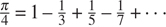，是由于莱布尼茨。我们将在 3.5.3 节中看到如何使用它作为一些奇特的数字技巧的基础。

请注意，我们使用了块结构(1.1.8 节)来将`pi_next`和`pi_term`的声明嵌入到`pi_sum`中，因为这些函数不太可能用于任何其他目的。我们将在 1.3.2 节中看到如何完全摆脱它们。

练习 1.31-1.33 的目的是展示通过使用适当的抽象来整合许多看似不同的操作所获得的表达能力。然而，尽管积累和过滤是很好的想法，但是我们在使用它们的时候还是有些束手束脚，因为我们还没有数据结构来为这些抽象提供合适的组合方式。当我们展示如何使用序列作为接口来组合过滤器和累加器以构建更强大的抽象时，我们将在第 2.2.3 节回到这些想法。我们将在那里看到这些方法如何真正成为设计程序的强大而优雅的方法。

[52](#c1-fn-0052a) 这个公式是十七世纪英国数学家约翰·沃利斯发现的。

在第 2.2.4 节中，我们将扩展 lambda 表达式的语法，以允许块作为主体，而不仅仅是一个表达式，就像函数声明语句一样。

在 JavaScript 中，两个版本之间有细微的差别:函数声明语句被自动“提升”(移动)到周围块的开头，或者如果它出现在任何块之外，则移动到程序的开头，而常量声明则不移动。用函数声明声明的名字可以用赋值重新赋值(3.1.1 节)，而用常量声明声明的名字则不能。在本书中，我们避开这些特性，将函数声明视为与相应的常量声明等价。

如果使用一个比 lambda 表达式更明显的术语，比如函数定义，对学习 JavaScript 的人来说会更清楚，也不会那么吓人。但是这种约定已经根深蒂固了，不仅对于 Lisp 和 Scheme，对于 JavaScript、Java 和其他语言也是如此，毫无疑问，这部分是由于本书 Scheme 版本的影响。这个符号来自于数学逻辑学家阿隆佐·邱奇(1941 年)引入的数学形式体系 λ 微积分。丘奇开发了 λ 微积分，为研究函数和函数应用的概念提供了一个严格的基础。T20 演算已经成为对编程语言语义进行数学研究的基本工具。

[56](#c1-fn-0056a) 注意，在一个块中声明的名字不能在声明被完全评估之前使用，不管在块外是否声明了相同的名字。因此，在下面的程序中，试图使用在顶层声明的`a`来为在`f`中声明的`b`的计算提供一个值是行不通的。
**常量**a = 1；
**函数**f(x){
**const**b = a+x；
**const**a = 5；
**回车**a+b；
}
f(10)；
程序导致错误，因为`a + x`中的`a`在它的声明被求值之前被使用。我们将在 4.1.6 节(练习 4.19)中回到这个程序，在我们了解了更多关于评估的内容之后。

[57](#c1-fn-0057a) 替换模型可以扩展为，对于一个常量声明，`=`之后的表达式的值被替换为其余块体中`=`之前的名称(声明之后)，类似于函数应用的求值中自变量对参数的替换。

[58](#c1-fn-0058a) 我们使用 0.001 作为一个代表性的“小”数字，来表示计算中可接受误差的公差。实际计算的适当容差取决于要解决的问题以及计算机和算法的局限性。这通常是一个非常微妙的问题，需要数字分析师或其他魔术师的帮助。

[59](#c1-fn-0059a) 这可以通过使用`error`来完成，它将一个字符串作为参数，这个字符串作为错误信息显示，同时显示的还有引起`error`调用的程序行号。

[60](#c1-fn-0060a) 要在计算器上获得余弦的固定点，将其设置为弧度模式，然后重复按 cos 按钮，直到数值不再变化。

[61](#c1-fn-0061a) (读作“映射到”)是数学家书写 lambda 表达式的方式。 y x / y 表示`y => x / y`，即在 y 处取值为 x / y 的函数。

注意，这是一个应用程序，它的函数表达式本身就是一个应用程序。练习 1.4 已经展示了形成这种应用程序的能力，但这只是一个玩具示例。在这里，我们开始看到这种应用程序的真正需求——当应用一个作为高阶函数返回值而获得的函数时。

进一步的概括参见练习 1.45。

[64](#c1-fn-0064a) 初等微积分书籍通常用逼近的顺序来描述牛顿法 x[n][+1]=x[n]–g(x[n]【T41)/Dg(x[n]【T47 用语言来谈论过程和使用不动点的概念简化了方法的描述。

牛顿法并不总是收敛到一个答案，但是可以证明，在有利的情况下，每次迭代都会使近似解的位数精度加倍。在这种情况下，牛顿法比半区间法收敛得快得多。

[66](#c1-fn-0066a) 对于求平方根，牛顿法从任意一个起点都很快收敛到正确的解。

[67](#c1-fn-0067a) 编程语言元素一流地位的概念源于英国计算机科学家克里斯托弗·斯特雷奇(1916-1975)。

[68](#c1-fn-0068a) 我们在第二章介绍数据结构后会看到这方面的例子。

[69](#c1-fn-0069a) 一流函数的主要实现成本是，允许函数作为值返回需要为函数的自由名称保留存储空间，即使函数没有执行。在我们将在 4.1 节中研究的 JavaScript 实现中，这些名称存储在函数的环境中。*