# 2
用数据构建抽象

> 我们现在到了数学抽象的决定性一步:我们忘记了符号代表什么。。。。[数学家]不必无所事事；他可以用这些符号进行许多操作，而不必看它们所代表的东西。
> 
> —赫尔曼·韦勒，数学思维方式

我们在第一章集中讨论了计算过程和函数在程序设计中的作用。我们看到了如何使用原始数据(数字)和原始操作(算术运算)，如何通过组合、条件和参数的使用来组合函数以形成复合函数，以及如何通过使用函数声明来抽象流程。我们看到一个函数可以被视为一个过程的局部演化的模式，我们对函数中包含的一些常见过程模式进行了分类、推理和简单的算法分析。我们还看到，高阶函数通过使我们能够操纵一般的计算方法，从而进行推理，增强了我们语言的能力。这是编程的本质。

在这一章中，我们将研究更复杂的数据。第一章中的所有函数都是对简单的数字数据进行操作的，而简单的数据不足以解决我们希望用计算来解决的许多问题。程序通常被设计成模拟复杂的现象，并且为了模拟具有几个方面的真实世界的现象，人们常常必须构造具有几个部分的计算对象。因此，尽管我们在第 1 章的重点是通过组合函数形成复合函数来构建抽象，但我们在本章转向任何编程语言的另一个关键方面:它提供了通过组合数据对象形成复合数据来构建抽象的方法。

为什么我们希望在编程语言中使用复合数据？出于同样的原因，我们需要复合功能:提升我们设计程序的概念层次，增加我们设计的模块性，增强我们语言的表达能力。正如声明函数的能力使我们能够在比语言的原始操作更高的概念层次上处理过程一样，构造复合数据对象的能力使我们能够在比语言的原始数据对象更高的概念层次上处理数据。

考虑设计一个用有理数进行算术运算的系统的任务。我们可以想象一个运算`add_rat`,它取两个有理数并产生它们的和。就简单的数据而言，一个有理数可以被认为是两个整数:一个分子和一个分母。因此，我们可以设计一个程序，其中每个有理数由两个整数(一个分子和一个分母)表示，而`add_rat`由两个函数实现(一个产生总和的分子，一个产生分母)。但是这将会很尴尬，因为我们需要明确地跟踪哪些分子对应于哪些分母。在一个打算对许多有理数执行许多运算的系统中，这样的簿记细节会使程序变得非常混乱，更不用说它们会对我们的大脑产生什么影响了。如果我们能够将分子和分母“粘在一起”形成一对——一个复合数据对象——我们的程序能够以一种与将有理数视为一个单一概念单位相一致的方式操纵它，那将会好得多。

复合数据的使用也使我们能够增加程序的模块性。如果我们可以直接将有理数作为对象来操作，那么我们就可以将程序中处理有理数本身的部分与有理数如何表示成整数对的细节分开。将处理数据对象如何表示的程序部分与处理数据对象如何使用的程序部分隔离开来的一般技术是一种强大的设计方法，称为数据抽象。我们将看到数据抽象如何使程序更容易设计、维护和修改。

复合数据的使用导致了我们编程语言表达能力的真正提高。考虑由形成一个 ax + 的“线性组合”的思路。我们可能想写一个函数，接受 a 、 b 、 x 和 y 作为参数，并通过返回 ax + 的值。如果参数是数字，这并不困难，因为我们可以很容易地声明函数

```js
function linear_combination(a, b, x, y) {
    return a * x + b * y;
}
```

但是假设我们不仅仅关心数字。假设我们想要描述一个无论何时定义加法和乘法都形成线性组合的过程——对于有理数、复数、多项式或任何东西。我们可以把它表达为形式的函数

**function** linear_combination(a, b, x, y) {

```js
    return add(mul(a, x), mul(b, y));
}
```

其中`add`和`mul`不是原始函数`+`和`*`，而是更复杂的东西，它们将对我们作为参数`a`、`b`、`x`和`y`传入的任何类型的数据执行适当的操作。关键是`linear_combination`需要知道的关于`a`、`b`、`x`和`y`的唯一事情是函数`add`和`mul`将执行适当的操作。从函数`linear_combination`的角度来看，什么是`a`、`b`、`x`和`y`是不相关的，更不相关的是它们可能如何碰巧用更原始的数据来表示。这个例子说明了为什么我们的编程语言提供直接操纵复合对象的能力是重要的:没有这一点，像`linear_combination`这样的函数就无法在不知道它们的详细结构的情况下将其参数传递给`add`和`mul`。 [¹](#c2-fn-0001)

我们从实现上面提到的有理数算术系统开始这一章。这将构成我们讨论复合数据和数据抽象的背景。与复合函数一样，要解决的主要问题是抽象作为一种处理复杂性的技术，我们将看到数据抽象如何使我们能够在程序的不同部分之间建立合适的抽象壁垒。

我们将看到，形成复合数据的关键是，编程语言应该提供某种“胶水”，以便数据对象可以组合起来形成更复杂的数据对象。胶水有很多种。事实上，我们将发现如何不使用任何特殊的“数据”操作，只使用函数来形成复合数据。这将进一步模糊“功能”和“数据”之间的区别，这在第一章的末尾已经变得模糊不清了。我们还将探索一些表示序列和树的传统技术。处理复合数据的一个关键思想是闭包的概念——我们用来组合数据对象的胶水应该允许我们不仅组合原始数据对象，也组合复合数据对象。另一个关键思想是，复合数据对象可以作为传统接口以混合匹配的方式组合程序模块。我们通过展示一种利用闭包的简单图形语言来说明其中的一些想法。

然后，我们将通过引入符号表达式来增强语言的表达能力，这些数据的基本部分可以是任意符号，而不仅仅是数字。我们探索了表示对象集合的各种替代方法。我们将会发现，正如给定的数值函数可以通过许多不同的计算过程来计算一样，给定的数据结构可以通过许多方式用更简单的对象来表示，并且表示的选择可以对操纵数据的过程的时间和空间要求产生重大影响。我们将在符号微分、集合表示和信息编码的背景下研究这些观点。接下来，我们将讨论处理数据的问题，这些数据可能由程序的不同部分以不同的方式表示。这导致需要实现通用操作，它必须处理许多不同类型的数据。在存在通用操作的情况下保持模块化需要比简单的数据抽象更强大的抽象障碍。特别是，我们引入了数据导向编程，作为一种技术，它允许单独的数据表示被孤立地设计，然后被相加地(即，没有修改)组合。为了说明这种方法对系统设计的强大作用，我们在本章结束时将我们所学的知识应用于一个对多项式执行符号运算的包的实现，其中多项式的系数可以是整数、有理数、复数，甚至其他多项式。

## 2.1 数据抽象介绍

在第 1.1.8 节中，我们注意到，在创建更复杂的功能时用作元素的功能不仅可以被视为特定操作的集合，还可以被视为功能抽象。也就是说，函数如何实现的细节可以被取消，特定的函数本身可以被具有相同整体行为的任何其他函数替换。换句话说，我们可以做一个抽象，将函数的使用方式与函数如何根据更原始的函数实现的细节分开。复合数据的类似概念叫做数据抽象。数据抽象是一种方法学，它使我们能够将复合数据对象的使用方式与从更原始的数据对象构造复合数据对象的细节隔离开来。

数据抽象的基本思想是构建使用复合数据对象的程序，以便它们操作“抽象数据”也就是说，我们的程序应该以这样一种方式使用数据，即不要对数据做任何假设，这些假设对于执行手头的任务并不是绝对必要的。同时,“具体的”数据表示是独立于使用数据的程序而定义的。我们系统的这两个部分之间的接口将是一组函数，称为选择器和构造器，它们根据具体表示实现抽象数据。为了说明这种技术，我们将考虑如何设计一组操作有理数的函数。

### 2.1.1 示例:有理数的算术运算

假设我们想用有理数做算术。我们希望能够将它们相加、相减、相乘和相除，并测试两个有理数是否相等。

让我们从假设我们已经有了从分子和分母构造有理数的方法开始。我们还假设，给定一个有理数，我们有办法提取(或选择)它的分子和分母。让我们进一步假设构造函数和选择器可以作为函数使用:

*   `make_rat(`n`,`d`)`返回分子为整数 n 分母为整数 d 的有理数。
*   `numer(` x `)`返回有理数 x 的分子。
*   `denom(` x `)`返回有理数 x 的分母。

我们在这里使用了一个强大的综合策略:如意算盘。我们还没有说有理数是如何表示的，或者函数`numer`、`denom`和`make_rat`应该如何实现。即便如此，如果我们有这三个函数，我们就可以用下面的关系式进行加、减、乘、除和等式检验:

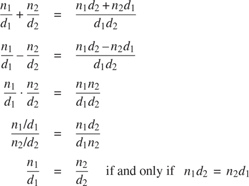

我们可以将这些规则表示为函数:

```js
function add_rat(x, y) {
    return make_rat(numer(x) * denom(y) + numer(y) * denom(x),
                    denom(x) * denom(y));
}
function sub_rat(x, y) {
    return make_rat(numer(x) * denom(y) - numer(y) * denom(x),
                    denom(x) * denom(y));
}
function mul_rat(x, y) {
    return make_rat(numer(x) * numer(y),
                    denom(x) * denom(y));
}
function div_rat(x, y) {
    return make_rat(numer(x) * denom(y),
                    denom(x) * numer(y));
}
function equal_rat(x, y) {
    return numer(x) * denom(y) === numer(y) * denom(x);
}
```

现在我们有了根据选择器定义的有理数运算

以及构造函数`numer`、`denom`和`make_rat`。但是我们还没有定义这些。我们需要的是用某种方法把分子和分母粘在一起，形成一个有理数。

##### 双；对；副

为了使我们能够实现数据抽象的具体层次，我们的 JavaScript 环境提供了一个叫做对的复合结构，它可以用原语函数`pair`来构造。该函数接受两个参数，并返回包含这两个参数的复合数据对象。给定一对，我们可以使用原语函数`head`和`tail`提取零件。因此，我们可以如下使用`pair`、`head`和`tail`:

```js
const x = pair(1, 2);
head(x);
1
tail(x);
2
```

请注意，pair 是一个数据对象，它可以被命名和操作，就像原始数据对象一样。而且，`pair`可以用来组成元素为对的对，以此类推:

```js
const x = pair(1, 2);

const y = pair(3, 4);

const z = pair(x, y);

head(head(z));
1

head(tail(z));
3
```

在 2.2 节中，我们将看到这种组合数据对的能力意味着数据对可以作为通用的构建模块来创建各种复杂的数据结构。由函数`pair`、`head`和`tail`实现的单一复合数据原语对，是我们需要的唯一粘合剂。成对构造的数据对象被称为列表结构数据。

##### 表示有理数

结对提供了一种完成有理数系统的自然方法。简单地把一个有理数表示成一对两个整数:一个分子和一个分母。那么`make_rat`、`numer`、`denom`很容易实现如下: [²](#c2-fn-0002)

```js
function make_rat(n, d) { return pair(n, d); }
function numer(x) { return head(x); }
function denom(x) { return tail(x); }
```

此外，为了显示我们的计算结果，我们可以通过打印分子、斜线和分母来打印有理数。我们使用原语函数`stringify`将任何值(这里是一个数字)转换成一个字符串。JavaScript 中的运算符`+`被重载；它可以应用于两个数字或两个字符串，在后一种情况下，它返回连接两个字符串的结果。 [³](#c2-fn-0003)

```js
function print_rat(x) {
    return display(stringify(numer(x)) + " / " + stringify(denom(x)));
}
```

现在我们可以试试我们的有理数函数: [⁴](#c2-fn-0004)

```js
const one_half = make_rat(1, 2);

print_rat(one_half);
"1 / 2"

const one_third = make_rat(1, 3);

print_rat(add_rat(one_half, one_third));
"5 / 6"

print_rat(mul_rat(one_half, one_third));
"1 / 6"

print_rat(add_rat(one_third, one_third));
"6 / 9"
```

如最后一个例子所示，我们的有理数实现没有将有理数减少到最低项。我们可以通过改变`make_rat`来补救。如果我们有一个像 1.2.5 节中那样的`gcd`函数，它产生两个整数的最大公约数，我们可以在构造对之前使用`gcd`将分子和分母减少到最低项:

```js
function make_rat(n, d) {
    const g = gcd(n, d);
    return pair(n / g, d / g);
}
```

现在我们有了

```js
print_rat(add_rat(one_third, one_third));
"2 / 3"
```

如你所愿。这个修改是通过改变构造函数`make_ rat`来完成的，而没有改变任何实现实际操作的函数(比如`add_rat`和`mul_rat`)。

##### 练习 2.1

定义一个更好的版本的`make_rat`,处理正反两个参数。函数`make_rat`应该将符号归一化，这样如果有理数为正，分子和分母都为正，如果有理数为负，只有分子为负。

### 2.1.2 抽象障碍

在继续更多复合数据和数据抽象的例子之前，让我们考虑一下有理数例子提出的一些问题。我们根据构造函数`make_rat`和选择器`numer`和`denom`定义了有理数运算。一般而言，数据抽象的基本思想是为每种类型的数据对象标识一组基本操作，根据这些操作，该类型的数据对象的所有操作将被表达，然后在操作数据时仅使用那些操作。

我们可以想象有理数系统的结构，如图图 2.1：所示。水平线代表隔离系统不同“层次”的抽象障碍。在每一层，屏障将使用数据抽象的程序(上图)与实现数据抽象的程序(下图)分开。使用有理数的程序只根据有理数包提供的“公共使用”的函数来操纵它们:`add_rat`、`sub_rat`、`mul_rat`、`div_rat`和`equal_rat`。反过来，这些仅根据构造函数和选择器`make_rat`、`numer`和`denom`来实现，它们本身是成对实现的。只要可以通过使用`pair`、`head`和`tail`来操作 pairs，pairs 是如何实现的细节与其余的有理数包无关。实际上，每一层的功能都是定义抽象障碍和连接不同层的接口。这个简单的想法有很多优点。一个优点是它使程序更容易维护和修改。任何复杂的数据结构都可以用编程语言提供的原始数据结构以多种方式表示。当然，表示的选择会影响对其进行操作的程序；因此，如果表示在以后某个时间被改变，所有这样的程序可能必须相应地被修改。在大型程序的情况下，这项任务可能既费时又费钱，除非通过设计将对表示的依赖限制在很少的程序模块中。

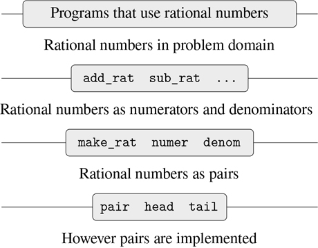

图 2.1：有理数包中的数据抽象壁垒。

例如，解决将有理数归约到最低项的问题的另一种方法是，每当我们访问有理数的部分时，而不是当我们构造它时，执行归约。这导致了不同的构造函数和选择器函数:

```js
function make_rat(n, d) {
    return pair(n, d);
}
function numer(x) {
    const g = gcd(head(x), tail(x));
    return head(x) / g;
}
function denom(x) {
    const g = gcd(head(x), tail(x));
    return tail(x) / g;
}
```

这个实现与前一个实现的区别在于我们何时计算`gcd`。如果在我们对有理数的典型使用中，我们多次访问同一个有理数的分子和分母，那么最好在构造有理数时计算`gcd`。如果没有，我们最好等到访问时间再计算`gcd`。在任何情况下，当我们从一种表示转换到另一种表示时，函数`add_rat`、`sub_rat`等等根本不需要修改。

将对表示的依赖约束到几个接口函数有助于我们设计程序以及修改它们，因为它允许我们保持考虑替代实现的灵活性。继续我们简单的例子，假设我们正在设计一个有理数包，我们最初不能决定是在构造时还是在选择时执行`gcd`。数据抽象方法为我们提供了一种推迟决策的方式，而不会丧失在系统的其余部分取得进展的能力。

##### 练习 2.2

考虑在平面中表示线段的问题。每个线段被表示为一对点:起点和终点。声明一个构造函数`make_segment`和选择器`start_segment`和`end_segment`，它们根据点来定义段的表示。此外，一个点可以表示为一对数字:x 坐标和 y 坐标。相应地，指定一个构造函数`make_point`和定义这个表示的选择器`x_point`和`y_point`。最后，使用您的选择器和构造函数，声明一个函数`midpoint_segment`,它将一条线段作为参数，并返回它的中点(其坐标是端点坐标的平均值的点)。要尝试您的函数，您需要一种打印点的方法:

```js
function print_point(p) {
    return display("(" + stringify(x_point(p)) + ", "
                       + stringify(y_point(p)) + ")");
}
```

##### 练习 2.3

实现平面中矩形的表示。(提示:你可能想利用练习 2.2。)根据您的构造函数和选择器，创建计算给定矩形的周长和面积的函数。现在为矩形实现一个不同的表示。你能为你的系统设计合适的抽象障碍吗，这样同样的周长和面积函数就可以使用任何一种表示了？

### 2.1.3 什么是数据？

我们在第 2.1.1 节开始了有理数的实现，根据三个未指定的函数:`make_rat`、`numer`和`denom`实现了有理数运算`add_rat`、`sub_rat`等等。在这一点上，我们可以认为操作是根据数据对象定义的——分子、分母和有理数——其行为由后三个函数指定。

但是数据到底是什么意思呢？仅仅说“由给定的选择器和构造器实现的东西”是不够的显然，不是每一组任意的三个函数都可以作为有理数实现的适当基础。我们需要保证，如果我们从一对整数`n`和`d`中构造一个有理数`x`，那么提取`x`中的`numer`和`denom`并将它们相除将会产生与用`n`除以`d`相同的结果。换句话说，`make_rat`、`numer`、`denom`必须满足条件，对于任意整数`n`和任意非零整数`d`，如果`x`为`make_rat(n, d)`，则

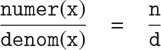

事实上，这是`make_rat`、`numer`和`denom`必须满足的唯一条件，以便形成有理数表示的合适基础。一般来说，我们可以认为数据是由一些选择器和构造函数的集合定义的，以及这些函数必须满足的特定条件，以便成为有效的表示。 [⁵](#c2-fn-0005)

这个观点不仅可以用来定义“高级”数据对象，比如有理数，也可以用来定义低级对象。考虑对的概念，我们用它来定义我们的有理数。我们实际上从未说过什么是 pair，只知道该语言提供了函数`pair`、`head`和`tail`来对 pair 进行操作。但是关于这三个操作，我们唯一需要知道的是，如果我们使用`pair`将两个对象粘合在一起，我们可以使用`head`和`tail`来检索对象。也就是说，这些操作满足这样的条件:对于任意对象`x`和`y`，如果`z`是`pair(x, y)`，那么`head(z)`是`x`并且`tail(z)`是`y`。事实上，我们提到这三个函数作为原语包含在我们的语言中。然而，满足上述条件的任何三元组函数都可以用作实现函数对的基础。我们可以实现`pair`、`head`和`tail`而不使用任何数据结构，只使用函数，这一事实突出地说明了这一点。下面是定义: [⁶](#c2-fn-0006)

```js
function pair(x, y) {
    function dispatch(m) {
        return m === 0
               ? x
               : m === 1
               ? y
               : error(m, "argument not 0 or 1 – pair");
    }
    return dispatch;
}
function head(z) { return z(0); }
function tail(z) { return z(1); }
```

函数的这种用法与我们对数据应该是什么的直观概念完全不同。然而，为了证明这是一种有效的表示对的方法，我们需要做的就是验证这些函数满足上面给出的条件。

需要注意的一点是，`pair(x, y)`返回的值是一个函数，即内部定义的函数`dispatch`，它接受一个参数，并根据参数是 0 还是 1 返回`x`或`y`。相应地，`head(z)`被定义为将`z`应用于 0。因此，如果`z`是由`pair(x, y)`形成的函数，那么`z`应用于 0 将产生`x`。因此，我们已经表明`head(pair(x, y))`按照预期产生`x`。同样，`tail(pair(x, y))`将`pair(x, y)`返回的函数应用于 1，1 返回`y`。因此，pairs 的这个函数实现是一个有效的实现，如果我们只使用`pair`、`head`和`tail`来访问 pairs，我们就无法将这个实现与使用“真实”数据结构的实现区分开来。

展示偶对的函数表示的要点不在于我们的语言是这样工作的(pairs 的有效实现可能使用 JavaScript 的原语 vector 数据结构),而在于它可以这样工作。函数表示虽然晦涩难懂，但却是表示线对的完美方式，因为它满足了线对需要满足的唯一条件。这个示例还演示了将函数作为对象进行操作的能力自动提供了表示复合数据的能力。现在这可能看起来有点奇怪，但是数据的函数表示将在我们的编程清单中扮演核心角色。这种编程风格通常被称为消息传递，我们将在第 3 章中使用它作为解决建模和仿真问题的基本工具。

##### 练习 2.4

这是对的另一种函数表示。对于这个表示，验证`head(pair(x, y))`对于任何对象`x`和`y`都产生`x`。

```js
function pair(x, y) {
    return m => m(x, y);
}
function head(z) {
    return z((p, q) => p);
}
```

`tail`的对应定义是什么？(提示:要验证这是否可行，请使用 1.1.5 节中的替代模型。)

##### 练习 2.5

说明如果我们将对 a 和 b 表示为是 2^a3^b的乘积的整数，我们可以仅使用数字和算术运算来表示非负整数对。给出`pair`、`head`和`tail`功能的相应定义。

##### 练习 2.6

如果将对表示为函数(练习 2.4)还不够令人难以置信，那么考虑一下，在一种可以操作函数的语言中，我们可以通过实现 0 和将 1 加为的运算来处理没有数字的情况(至少就非负整数而言)

```js
const zero = f => x => x;

function add_1(n) {
    return f => x => f(n(f)(x));
}
```

这种表示法被称为教会数字，以其发明者阿隆佐·邱奇的名字命名，他是发明了 λ 微积分的逻辑学家。

直接定义`one`和`two`(不用`zero`和`add_1`)。(提示:使用替换来评估`add_1(zero)`)。直接给出加法函数`plus`的定义(不是就`add_1`的重复应用而言)。

### 2.1.4 扩展练习:区间算术

Alyssa P. Hacker 正在设计一个系统来帮助人们解决工程问题。她想在自己的系统中提供的一个功能是能够以已知的精度处理不精确的量(如物理设备的测量参数)，这样当用这样的近似量进行计算时，结果将是已知精度的数字。

电气工程师将使用艾丽莎的系统来计算电量。他们有时需要用公式计算两个电阻 R1 和 R2 的并联等效电阻 R [p] 的值

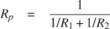

电阻值通常只在电阻制造商保证的一定容差范围内。例如，如果您购买一个标有“6.8 欧姆，10%容差”的电阻器，您只能确定该电阻器的电阻在 6.8–0.68 = 6.12 和 6.8 + 0.68 = 7.48 欧姆之间。因此，如果有一个 6.8 欧姆的 10%电阻与一个 4.7 欧姆的 5%电阻并联，组合电阻的范围可以从约 2.58 欧姆(如果两个电阻在下限)到约 2.97 欧姆(如果两个电阻在上限)。

Alyssa 的想法是将“区间算术”实现为一组用于组合“区间”(代表一个不精确量的可能值范围的对象)的算术运算。两个区间加、减、乘、除的结果本身就是一个区间，代表结果的范围。

Alyssa 假设存在一个称为“区间”的抽象对象，它有两个端点:一个下界和一个上界。她还假设，给定一个区间的端点，她可以使用数据构造函数`make_interval`来构造区间。Alyssa 首先编写了一个将两个音程相加的函数。她推断该和的最小值可能是两个下限的和，最大值可能是两个上限的和:

```js
function add_interval(x, y) {
    return make_interval(lower_bound(x) + lower_bound(y),
                         upper_bound(x) + upper_bound(y));
}
```

Alyssa 还通过找出边界乘积的最小值和最大值，并使用它们作为结果区间的边界，来计算两个区间的乘积。(函数`math_min`和`math_max`是找到任意数量参数的最小值或最大值的原语。)

```js
function mul_interval(x, y) {
    const p1 = lower_bound(x) * lower_bound(y); 
    const p2 = lower_bound(x) * upper_bound(y);
    const p3 = upper_bound(x) * lower_bound(y);
    const p4 = upper_bound(x) * upper_bound(y);
    return make_interval(math_min(p1, p2, p3, p4),
                         math_max(p1, p2, p3, p4));
}
```

为了划分两个区间，Alyssa 将第一个区间乘以第二个区间的倒数。请注意，倒数区间的界限依次是上界的倒数和下界的倒数。

```js
function div_interval(x, y) {
    return mul_interval(x, make_interval(1 / upper_bound(y),
                                         1 / lower_bound(y)));
}
```

##### 练习 2.7

Alyssa 的程序是不完整的，因为她没有指定区间抽象的实现。以下是区间构造函数的定义:

```js
function make_interval(x, y) { return pair(x, y); }
```

定义选择器`upper_bound`和`lower_bound`来完成实现。

##### 练习 2.8

使用类似于 Alyssa 的推理，描述如何计算两个区间的差。定义一个相应的减法函数，叫做`sub_interval`。

##### 练习 2.9

区间的宽度是其上下界之差的一半。宽度是由区间指定的数的不确定性的度量。对于一些算术运算，组合两个区间的结果的宽度仅仅是自变量区间宽度的函数，而对于其他运算，组合的宽度不是自变量区间宽度的函数。证明两个区间的和(或差)的宽度仅仅是被加(或减)的区间宽度的函数。举例说明这对于乘法或除法是不成立的。

##### 练习 2.10

系统编程专家本·比特德尔(Ben Bitdiddle)越过艾丽莎的肩膀评论说，不清楚除以零区间意味着什么。修改 Alyssa 的程序来检查这种情况，并在出现错误时发出信号。

##### 练习 2.11

顺便提一下，Ben 还神秘地评论道:“通过测试区间端点的符号，可以将`mul_interval`分成九种情况，其中只有一种需要两次以上的乘法运算。”使用 Ben 的建议重写这个函数。

在调试完她的程序后，Alyssa 将它展示给一个潜在用户，该用户抱怨她的程序解决了错误的问题。他想要一个程序，可以处理表示为中心值和附加公差的数字；例如，他希望使用 3.5±0.15 这样的区间，而不是[3.35，3.65]。Alyssa 回到自己的办公桌前，通过提供备用构造函数和备用选择器来解决这个问题:

```js
function make_center_width(c, w) {
    return make_interval(c - w, c + w);
}
function center(i) {
    return (lower_bound(i) + upper_bound(i)) / 2;
}
function width(i) {
    return (upper_bound(i) - lower_bound(i)) / 2;
}
```

不幸的是，Alyssa 的大多数用户都是工程师。实际工程情况通常涉及只有很小不确定性的测量，测量为区间宽度与区间中点的比值。工程师通常规定器件参数的百分比容差，如前面给出的电阻规格。

##### 练习 2.12

定义一个构造函数`make_center_percent`，它采用一个中心和一个百分比公差，并产生所需的间隔。您还必须定义一个选择器`percent`来产生给定间隔的百分比公差。`center`选择器如上图所示。

##### 练习 2.13

证明在小百分比容差的假设下，根据因子的容差，有一个简单的公式来计算两个区间乘积的近似百分比容差。你可以通过假设所有的数字都是正数来简化这个问题。

经过大量的工作，Alyssa P. Hacker 交付了她完成的系统。几年后，当她完全忘记这件事的时候，她接到一个愤怒的用户 Lem E. Tweakit 打来的疯狂电话。Lem 似乎已经注意到，并联电阻的公式可以用两种代数等价的方式来表示:

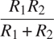

和

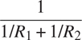

他编写了以下两个程序，每个程序都以不同的方式计算 parallelresistors 公式:

```js
function par1(r1, r2) {
    return div_interval(mul_interval(r1, r2),
                        add_interval(r1, r2));
}
function par2(r1, r2) {
    const one = make_interval(1, 1);
    return div_interval(one,
                        add_interval(div_interval(one, r1),
                                     div_interval(one, r2)));
}
```

Lem 抱怨说，Alyssa 的程序对这两种计算方式给出了不同的答案。这是一个严重的投诉。

##### 练习 2.14

证明 Lem 是正确的。研究系统在各种算术表达式上的行为。做一些区间 A 和 B ，用它们来计算表达式 A / A 和 A / B 。通过使用宽度为中心值一小部分的间隔，您将获得最大的洞察力。检查中心百分比形式的计算结果(参见练习 2.12)。

##### 练习 2.15

另一位用户 Eva Lu Ator 也注意到由不同但代数等价的表达式计算的不同间隔。她说，如果一个用 Alyssa 系统计算区间的公式可以写成这样一种形式，即代表一个不确定数的名字不会重复，那么它将产生更严格的误差界限。因此，她说，`par2`是一个比`par1`更“好”的并联电阻程序。她说得对吗？为什么？

##### 练习 2.16

解释，一般来说，为什么等价的代数表达式可能导致不同的答案。你能设计一个没有这个缺点的区间算术软件包吗？或者这个任务是不可能的？(警告:这个问题很难。)

## 2.2 分层数据和闭合属性

正如我们所看到的，pairs 提供了一种原始的“粘合剂”,我们可以用它来构造复合数据对象。图 2.2：显示了一种标准的可视化配对方式——在本例中，配对由`pair(1, 2)`组成。在这个被称为盒子和指针符号的表示中，每个复合对象被显示为一个盒子的指针。一对的盒子有两个部分，左边部分是头部，右边部分是尾部。

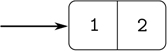

图 2.2：`pair(1, 2)`的盒指针表示。

我们已经看到,`pair`不仅可以用来组合数字，也可以用来组合成对。(在做练习 2.2 和 2.3 时，你利用了这个事实，或者应该利用了这个事实。)因此，pairs 提供了一个通用的构建模块，我们可以从中构建各种数据结构。图 2.3：显示了使用配对组合数字 1、2、3 和 4 的两种方式。

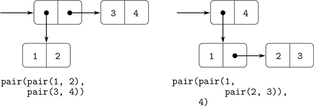

图 2.3：两种方式组合 1、2、3、4 使用成对。

创建元素是对的对的能力是列表结构作为表示工具的重要性的本质。我们将这种能力称为`pair`的闭包属性。一般来说，如果组合数据对象的操作的结果本身可以使用相同的操作来组合，则该操作满足闭包属性。 [⁷](#c2-fn-0007) 封闭是任何组合方式中权力的关键，因为它允许我们创建层级结构——由零件组成的结构，而结构本身又由零件组成，如此等等。

从第一章开始，我们已经在处理函数时使用了闭包，因为除了最简单的程序之外，所有程序都依赖于这样一个事实，即组合的元素本身也可以是组合。在这一节中，我们将讨论复合数据闭包的后果。我们描述了一些使用对来表示序列和树的传统技术，并且展示了一种图形语言，它以一种生动的方式说明了闭包。

### 2.2.1 表示顺序

我们可以用偶对构建的一个有用的结构是一个序列——数据对象的有序集合。当然，有许多方法可以用对来表示序列。图 2.4 给出了一个特别直观的表示，其中序列 1，2，3，4 被表示为一串对。每对的`head`是链中对应的物品，该对的`tail`是链中的下一对。最后一对的`tail`表示序列的结束，在盒指针图中表示为对角线，在程序中表示为 JavaScript 的原始值`null`。整个序列由嵌套的`pair`操作构成:

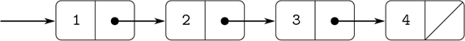

图 2.4：把序列 1、2、3、4 表示为一串对子。

```js
pair(1,
     pair(2,
          pair(3,
               pair(4, null))));
```

这种由嵌套的`pair`应用程序形成的序列对被称为列表，我们的 JavaScript 环境提供了一个称为`list`的原语来帮助构建列表。 [⁸](#c2-fn-0008) 以上序列可能由`list(1, 2, 3, 4)`产生。总的来说，

```js
list(a[1], a[2], . . ., a[n])
```

相当于

```js
pair(a[1], pair(a[2], pair(. . ., pair(a[n], null). . .)))
```

我们的解释器使用我们称之为盒符号的盒指针图的文本表示来打印对。`pair(1, 2)`的结果打印为`[1, 2]`，图 2.4：中的数据对象打印为`[1, [2, [3, [4, null]]]]`:

```js
const one_through_four = list(1, 2, 3, 4);

one_through_four;
[1, [2, [3, [4, null]]]]
```

我们可以认为`head`选择了列表中的第一项，而`tail`选择了除第一项之外的所有子列表。`head`和`tail`的嵌套应用可用于提取列表中的第二、第三和后续项目。构造函数`pair`制作了一个类似于原始列表的列表，但是在开头添加了一个附加项。

```js
head(one_through_four);
1

tail(one_through_four);
[2, [3, [4, null]]]

head(tail(one_through_four));
2

pair(10, one_through_four);
[10, [1, [2, [3, [4, null]]]]]

pair(5, one_through_four);
[5, [1, [2, [3, [4, null]]]]]
```

用于终止线对链的值`null`可以被认为是一个没有元素的序列，即空列表。 [⁹](#c2-fn-0009)

方框符号有时很难读懂。在本书中，当我们想要指出一个数据结构的列表性质时，我们将使用替代的列表符号:只要有可能，列表符号使用`list`的应用程序，它的评估将产生期望的结构。例如，代替方框符号

```js
[1, [[2, 3], [[4, [5, null]], [6, null]]]]
```

我们写作

```js
list(1, [2, 3], list(4, 5), 6)
```

在列表符号中。 [^(10)](#c2-fn-0010)

##### 列表操作

使用对来表示列表中的元素序列伴随着传统的编程技术，通过连续使用`tail`遍历列表来操纵列表。例如，函数`list_ref`将一个列表和一个数字 n 作为参数，并返回列表的第 n 项。习惯上从 0 开始给列表中的元素编号。计算`list_ref`的方法如下:

*   对于 n = 0，`list_ref`应该返回列表的`head`。
*   否则，`list_ref`应该返回列表中`tail`的第(n–1)项。

```js
function list_ref(items, n) {
    return n === 0
           ? head(items)
           : list_ref(tail(items), n - 1);
}

const squares = list(1, 4, 9, 16, 25);

list_ref(squares, 3);
16
```

通常我们会遍历整个列表。为了帮助实现这一点，我们的 JavaScript 环境包含了一个基本谓词`is_null`，它测试它的参数是否为空列表。返回列表中项目数量的函数`length`展示了这种典型的使用模式:

```js
function length(items) {
    return is_null(items)
           ? 0
           : 1 + length(tail(items));
}

const odds = list(1, 3, 5, 7);

length(odds);
4
```

`length`函数实现了一个简单的递归计划。还原步骤是:

*   任何列表的`length`都是 1 加上列表的`tail`的`length`。

这是连续应用的，直到我们达到基本情况:

*   空单的`length`为 0。

我们也可以以迭代的方式计算`length`:

```js
function length(items) {
    function length_iter(a, count) {
        return is_null(a)
               ? count
               : length_iter(tail(a), count + 1);
    }
    return length_iter(items, 0);
}
```

另一种传统的编程技术是通过使用`pair`将元素连接到列表的前面来构造答案列表，同时使用`tail`向下遍历列表，如在函数`append`中，该函数将两个列表作为参数，并将它们的元素组合成一个新列表:

```js
append(squares, odds);
list(1, 4, 9, 16, 25, 1, 3, 5, 7)

append(odds, squares);
list(1, 3, 5, 7, 1, 4, 9, 16, 25)
```

函数`append`也是使用递归计划实现的。要`append`列出`list1`和`list2`，请执行以下操作:

*   如果`list1`是空单，那么结果就是`list2`。
*   否则，`list1`的`tail`和`list2`的`append`，将`list1`的`head`邻接到结果:

```js
function append(list1, list2) {
    return is_null(list1)
           ? list2
           : pair(head(list1), append(tail(list1), list2));
}
```

##### 练习 2.17

定义一个函数`last_pair`,该函数返回只包含给定(非空)列表的最后一个元素的列表:

```js
last_pair(list(23, 72, 149, 34));
list(34)
```

##### 练习 2.18

定义一个函数`reverse`，该函数将一个列表作为参数，并以相反的顺序返回相同元素的列表:

```js
reverse(list(1, 4, 9, 16, 25));
list(25, 16, 9, 4, 1)
```

##### 练习 2.19

考虑第 1.2.2 节的变更计数程序。如果能够方便地改变程序使用的货币就好了，这样我们就可以计算出兑换英镑的方法。随着程序的编写，货币的知识一部分分布到函数`first_denomination`中，一部分分布到函数`count_change`中(其中知道美国硬币有五种)。如果能提供一个硬币清单，用来找零钱，那就更好了。

我们想重写函数`cc`,这样它的第二个参数是要使用的硬币的值的列表，而不是指定使用哪个硬币的整数。然后我们可以有定义每种货币的列表:

```js
const us_coins = list(50, 25, 10, 5, 1);
const uk_coins = list(100, 50, 20, 10, 5, 2, 1);
```

然后我们可以如下调用`cc`:

```js
cc(100, us_coins);
292
```

为此，需要稍微改变程序`cc`。它仍然具有相同的形式，但是它访问第二个参数的方式不同，如下所示:

```js
function cc(amount, coin_values) {
    return amount === 0
           ? 1
           : amount < 0 || no_more(coin_values)
           ? 0
           : cc(amount, except_first_denomination(coin_values)) +
             cc(amount - first_denomination(coin_values), coin_values);
}
```

根据对列表结构的原始操作定义函数`first_denomination`、`except_first_denomination`和`no_more`。列表的顺序`coin_values`是否影响`cc`产生的答案？为什么或为什么不？

##### 练习 2.20

在存在高阶函数的情况下，函数并不严格需要有多个参数；一个就够了。如果我们有一个像`plus`这样自然需要两个参数的函数，我们可以写一个函数的变体，一次传递一个参数。将变量应用于第一个参数可以返回一个函数，然后我们可以将该函数应用于第二个参数，依此类推。这种被称为 currying 的做法以美国数学家和逻辑学家哈斯凯尔·布鲁克斯·加里的名字命名，在 Haskell 和 OCaml 等编程语言中很常见。在 JavaScript 中，`plus`的一个简化版本如下。

```js
function plus_curried(x) {
    return y => x + y;
}
```

编写一个函数`brooks`,它将一个定制函数作为第一个参数，将定制函数应用到的一系列参数作为第二个参数，一个接一个，按照给定的顺序。例如，下面的`brooks`应用应该与`plus_curried(3)(4)`具有相同的效果:

```js
brooks(plus_curried, list(3, 4));
7
```

既然如此，我们不妨试试这个功能`brooks`！编写一个函数`brooks_curried`，可以应用如下:

```js
brooks_curried(list(plus_curried, 3, 4));
7
```

用这个函数`brooks_curried`，对下面两个语句求值的结果是什么？

```js
brooks_curried(list(brooks_curried,
                    list(plus_curried, 3, 4)));

brooks_curried(list(brooks_curried,
                    list(brooks_curried,
                         list(plus_curried, 3, 4))));
```

##### 列表映射

一个非常有用的操作是对列表中的每个元素进行某种转换，并生成结果列表。例如，下面的函数按给定的因子缩放列表中的每个数字:

```js
function scale_list(items, factor) {
    return is_null(items)
           ? null
           : pair(head(items) * factor,
                  scale_list(tail(items), factor));
}

scale_list(list(1, 2, 3, 4, 5), 10);
[10, [20, [30, [40, [50, null]]]]]
```

我们可以抽象出这个一般的概念，并把它作为一个通用的模式，用一个高阶函数来表达，就像 1.3 节一样。这里的高阶函数称为`map`。函数`map`将一个参数和一个列表的函数作为参数，并返回通过将函数应用于列表中的每个元素而产生的结果列表:

```js
function map(fun, items) {
    return is_null(items)
           ? null
           : pair(fun(head(items)),
                  map(fun, tail(items)));
}

map(abs, list(-10, 2.5, -11.6, 17));
[10, [2.5, [11.6, [17, null]]]]

map(x => x * x, list(1, 2, 3, 4));
[1, [4, [9, [16, null]]]]
```

现在我们可以用`map`来给`scale_list`一个新的定义:

```js
function scale_list(items, factor) {
    return map(x => x * factor, items);
}
```

函数`map`是一个重要的构造，不仅因为它捕获了一个公共模式，还因为它在处理列表时建立了一个更高层次的抽象。在最初的`scale_list`定义中，程序的递归结构把注意力吸引到了列表的元素间处理上。根据`map`定义`scale_list`抑制了细节层次，并强调缩放将元素列表转换为结果列表。这两个定义的区别不在于计算机执行的是不同的过程(它不是),而在于我们对过程的思考方式不同。实际上，`map`有助于建立一个抽象屏障，将转换列表的函数的实现与如何提取和组合列表元素的细节隔离开来。就像图 2.1 所示的障碍一样，这种抽象给了我们改变序列如何实现的底层细节的灵活性，同时保留了将序列转换成序列的操作的概念框架。2.2.3 节详述了序列作为组织程序的框架的这种用途。

##### 练习 2.21

函数`square_list`将一列数字作为参数，并返回这些数字的平方列表。

```js
square_list(list(1, 2, 3, 4));
[1, [4, [9, [16, null]]]]
```

这里有两种不同的`square_list`定义。通过填写缺少的表达式来完成这两个问题:

```js
function square_list(items) {
    return is_null(items)
           ? null
           : pair(〈??〉, 〈??〉);
}

function square_list(items) {
    return map(〈??〉, 〈??〉);
}
```

##### 练习 2.22

Louis Reasoner 试图重写练习 2.21 的第一个`square_list`函数，使其演变成一个迭代过程:

```js
function square_list(items) {
    function iter(things, answer) {
        return is_null(things)
               ? answer
               : iter(tail(things),
                      pair(square(head(things)),
                           answer));
    }
    return iter(items, null);
}
```

不幸的是，以这种方式定义`square_list`会产生与所需顺序相反的答案列表。为什么？

然后，Louis 试图通过与`pair`交换参数来修复他的 bug:

```js
function square_list(items) {
    function iter(things, answer) {
        return is_null(things)
               ? answer
               : iter(tail(things),
                      pair(answer,
                           square(head(things))));
    }
    return iter(items, null);
}
```

这个也不行。解释一下。

##### 练习 2.23

`for_each`的功能与`map`类似。它接受一个函数和一个元素列表作为参数。然而，`for_each`并没有形成一个结果列表，而是将函数从左到右依次应用于每个元素。通过将函数应用到元素而返回的值根本不会被使用— `for_each`用于执行某个动作的函数，比如打印。举个例子，

```js
for_each(x => display(x), list(57, 321, 88));
57
321
88
```

对`for_each`(上面没有说明)的调用返回的值可以是任意的，比如 true。给出一个`for_each`的实现。

### 2.2.2 层次结构

用列表来表示序列自然地推广到表示其元素本身可能是序列的序列。例如，我们可以把对象`[[1, [2, null]], [3, [4, null]]]`看作由

```js
pair(list(1, 2), list(3, 4));
```

作为三个条目的列表，第一个条目本身就是一个列表，`[1, [2, null]]`。图 2.5：显示了这种结构的线对表示。

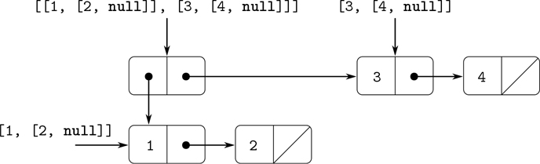

图 2.5：由`pair(list(1, 2), list(3, 4))`构成的结构。

另一种考虑元素是序列的序列的方式是树。序列的元素是树的分支，本身是序列的元素是子树。图 2.6：显示了图 2.5 中的树形结构。

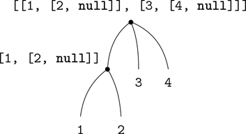

图 2.6：图 2.5 中的列表结构视为一棵树。

递归是处理树结构的一种自然工具，因为我们通常可以将树上的操作简化为树枝上的操作，而树枝上的操作又依次简化为树枝上的操作，如此类推，直到到达树叶。例如，比较第 2.2.1 节的`length`函数和`count_leaves`函数，后者返回一棵树的总叶子数:

```js
const x = pair(list(1, 2), list(3, 4));

length(x);
3

count_leaves(x);
4

list(x, x);
list(list(list(1, 2), 3, 4), list(list(1, 2), 3, 4))

length(list(x, x));
2

count_leaves(list(x, x));
8
```

为了实现`count_leaves`，调用计算`length`的递归计划:

*   列表`x`的`length`为 1 加上`x`的`tail`的`length`。
*   空单的`length`为 0。

功能`count_leaves`也差不多。空列表的值是相同的:

*   `count_leaves`空单为 0。

但是在归约步骤中，当我们去掉列表中的`head`时，我们必须考虑到`head`本身可能是一棵树，我们需要计算它的叶子。因此，合适的还原步骤是

*   一棵树`x`的`count_leaves`是`x`的`head`的`count_leaves`加上`x`的`tail`的`count_leaves`。

最后，通过取`head`，我们得到实际的叶子，所以我们需要另一个基本情况:

*   `count_leaves`一片叶子是 1。

为了帮助在树上编写递归函数，我们的 JavaScript 环境提供了基本谓词`is_pair`，它测试它的参数是否是一对。下面是完整的功能: [^(11)](#c2-fn-0011)

```js
function count_leaves(x) {
    return is_null(x)
           ? 0
           : ! is_pair(x)
           ? 1
           : count_leaves(head(x)) + count_leaves(tail(x));
}
```

##### 练习 2.24

假设我们评估表达式`list(1, list(2, list(3, 4)))`。给出解释器打印的结果，相应的盒指针结构，以及对树的解释(如图图 2.6： )。

##### 练习 2.25

给出`head`和`tail`的组合，它们将从以下列表中选出 7 个，以列表符号给出:

```js
list(1, 3, list(5, 7), 9)

list(list(7))

list(1, list(2, list(3, list(4, list(5, list(6, 7))))))
```

##### 练习 2.26

假设我们将`x`和`y`定义为两个列表:

```js
const x = list(1, 2, 3);
const y = list(4, 5, 6);
```

用方框表示法和列表表示法计算下列每个表达式的结果是什么？

```js
append(x, y)

pair(x, y)

list(x, y)
```

##### 练习 2.27

修改练习 2.18 中的`reverse`函数，生成一个`deep_reverse`函数，它将一个列表作为参数，并返回一个列表作为它的值，该列表的元素被反转，所有子列表也被深度反转。举个例子，

```js
const x = list(list(1, 2), list(3, 4));

x;
list(list(1, 2), list(3, 4))

reverse(x);
list(list(3, 4), list(1, 2))

deep_reverse(x);
list(list(4, 3), list(2, 1))
```

##### 练习 2.28

编写一个函数`fringe`，它将一棵树(表示为一个列表)作为参数，并返回一个列表，该列表的元素是从左到右排列的所有树叶。举个例子，

```js
const x = list(list(1, 2), list(3, 4));

fringe(x);
list(1, 2, 3, 4)

fringe(list(x, x));
list(1, 2, 3, 4, 1, 2, 3, 4)
```

##### 练习 2.29

二进制手机包括两个分支，一个左分支和一个右分支。每根树枝都是一根有一定长度的杆，上面挂着一个重物或另一个二进制移动物体。我们可以通过从两个分支(例如，使用`list`)构建复合数据来表示二进制移动:

```js
function make_mobile(left, right) {
    return list(left, right);
}
```

分支由一个`length`(必须是一个数字)和一个`structure`构成，后者可以是一个数字(代表简单的重量)或另一个移动:

```js
function make_branch(length, structure) {
    return list(length, structure);
}
```

1.  a. 写对应的选择器`left_branch`和`right_branch`，返回一个移动的分支，`branch_length`和`branch_structure`，返回一个分支的组件。
2.  使用你的选择器，定义一个函数`total_weight`返回一个手机的总重量。
3.  c. 如果左上分支施加的扭矩等于右上分支施加的扭矩(也就是说，如果左侧杆的长度乘以悬挂在该杆上的重量等于右侧相应的乘积)，并且悬挂在其分支上的每个子移动装置都是平衡的，则称该移动装置是平衡的。设计一个测试二进制移动是否平衡的谓词。
4.  d. Suppose we change the representation of mobiles so that the constructors are

    ```js
    function make_mobile(left, right) {
        return pair(left, right);
    }
    function make_branch(length, structure) {
        return pair(length, structure);
    }
    ```

    你需要改变你的程序多少来转换成新的表示？

##### 树上的映射

正如`map`是处理序列的强大抽象一样，`map`和递归一起是处理树的强大抽象。例如，`scale_tree`函数，类似于 2.2.1 节的`scale_list`，将一个数字因子和一个树叶是数字的树作为参数。它返回相同形状的树，其中每个数字都乘以因子。`scale_tree`的递归计划类似于`count_leaves`的递归计划:

```js
function scale_tree(tree, factor) {
    return is_null(tree)
           ? null
           : ! is_pair(tree)
           ? tree * factor
           : pair(scale_tree(head(tree), factor),
                  scale_tree(tail(tree), factor));
}

scale_tree(list(1, list(2, list(3, 4), 5), list(6, 7)),
           10);
list(10, list(20, list(30, 40), 50), list(60, 70))
```

实现`scale_tree`的另一种方式是将树视为一系列子树，并使用`map`。我们映射序列，依次缩放每个子树，并返回结果列表。在基本情况下，树是一片叶子，我们只需乘以因子:

```js
function scale_tree(tree, factor) {
    return map(sub_tree => is_pair(sub_tree)
                           ? scale_tree(sub_tree, factor)
                           : sub_tree * factor,
               tree);
}
```

许多树操作可以通过序列操作和递归的类似组合来实现。

##### 练习 2.30

声明一个类似于练习 2.21 的`square_list`函数的函数`square_tree`。也就是说，`square_tree`应该表现如下:

```js
square_tree(list(1,
                 list(2, list(3, 4), 5),
                 list(6, 7)));
list(1, list(4, list(9, 16), 25), list(36, 49)))
```

直接声明`square_tree`(即不使用任何高阶函数)，也可以使用`map`和递归。

##### 练习 2.31

将练习 2.30 的答案抽象成一个函数`tree_map`，其属性`square_tree`可以声明为

```js
function square_tree(tree) { return tree_map(square, tree); }
```

##### 练习 2.32

我们可以将一个集合表示为不同元素的列表，并且可以将该集合的所有子集的集合表示为列表的列表。例如，如果集合是`list(1, 2, 3)`，那么所有子集的集合是

```js
list(null, list(3), list(2), list(2, 3),
     list(1), list(1, 3), list(1, 2),
     list(1, 2, 3))
```

完成以下生成集合的子集的函数的声明，并给出其工作原理的清晰解释:

```js
function subsets(s) {
    if (is_null(s)) {
        return list(null);
    } else {
        const rest = subsets(tail(s));
        return append(rest, map( ?? , rest));
    }
}
```

### 2.2.3 序列作为常规接口

在使用复合数据的过程中，我们强调了数据抽象如何允许我们设计程序而不陷入数据表示的细节中，以及抽象如何为我们保留了试验替代表示的灵活性。在本节中，我们将介绍另一个处理数据结构的强大设计原则——使用传统接口。

在 1.3 节中，我们看到了作为高阶函数实现的程序抽象是如何在处理数字数据的程序中捕获通用模式的。我们制定处理复合数据的类似操作的能力主要取决于我们操作数据结构的方式。例如，考虑下面的函数，类似于 2.2.2 节的`count_leaves`函数，它将一棵树作为自变量，并计算奇数树叶的平方和:

```js
function sum_odd_squares(tree) {
    return is_null(tree)
           ? 0
           : ! is_pair(tree)
           ? is_odd(tree) ? square(tree) : 0
           : sum_odd_squares(head(tree)) +
             sum_odd_squares(tail(tree));
}
```

从表面上看，这个函数与下面的函数有很大的不同，后者构造了一个所有偶数 Fibonacci 数 Fib( k )的列表，其中 k 小于或等于给定的整数 n :

```js
function even_fibs(n) {
    function next(k) {
        if (k > n) {
            return null;
        } else {
            const f = fib(k);
            return is_even(f)
                   ? pair(f, next(k + 1))
                   : next(k + 1);
        }
    }
    return next(0);
}
```

尽管这两个函数在结构上非常不同，但对这两种计算的更抽象的描述揭示了大量的相似性。第一个程序

*   枚举一棵树的叶子；
*   过滤它们，选择奇数；
*   将选中的每一个方块化；和
*   使用`+`累加结果，从 0 开始。

第二个节目

*   枚举从 0 到 n 的整数；
*   计算每个整数的斐波那契数；
*   过滤它们，选择偶数的；和
*   使用`pair`累加结果，从空列表开始。

信号处理工程师会发现很自然地将这些过程概念化为流经级联阶段的信号，每个阶段实现程序计划的一部分，如图图 2.7：所示。在`sum_odd_squares`中，我们从一个枚举器开始，它生成一个由给定树的叶子组成的“信号”。该信号通过一个滤波器，该滤波器除了奇数元素之外，其他元素都被滤除。产生的信号依次通过图，图是一个将`square`功能应用于每个元素的“传感器”。然后，映射的输出被馈送到一个累加器，该累加器使用`+`从初始 0 开始合并元素。`even_fibs`的计划是类似的。

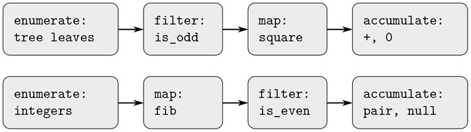

图 2.7：函数`sum_odd_squares`(上图)和`even_fibs`(下图)的信号流程图揭示了两个程序之间的共性。

不幸的是，上面的两个函数声明没有展示这种信号流结构。例如，如果我们检查`sum_odd_squares`函数，我们发现枚举部分由`is_null`和`is_pair`测试实现，部分由函数的树递归结构实现。类似地，这种积累部分出现在测试中，部分出现在递归中使用的加法中。一般来说，两种功能都没有与信号流描述中的元素相对应的独特部分。我们的两个函数以不同的方式分解计算，将枚举分布在程序中，并将其与映射、过滤和累积混合在一起。如果我们能够组织我们的程序，使信号流结构在我们编写的函数中显现出来，这将增加最终程序的概念清晰度。

##### 顺序操作

组织程序以便更清楚地反映信号流结构的关键是集中于从过程的一个阶段流向下一个阶段的“信号”。如果我们将这些信号表示为列表，那么我们可以使用列表操作来实现每个阶段的处理。例如，我们可以使用第 2.2.1 节中的`map`函数实现信号流图的映射阶段:

```js
map(square, list(1, 2, 3, 4, 5));
list(1, 4, 9, 16, 25)
```

过滤一个序列，只选择那些满足给定谓词的元素，这是通过

```js
function filter(predicate, sequence) {
    return is_null(sequence)
           ? null
           : predicate(head(sequence))
           ? pair(head(sequence),
                  filter(predicate, tail(sequence)))
           : filter(predicate, tail(sequence));
}
```

举个例子，

```js
filter(is_odd, list(1, 2, 3, 4, 5));
list(1, 3, 5)
```

累积可以通过以下方式实现

```js
function accumulate(op, initial, sequence) {
    return is_null(sequence)
           ? initial
           : op(head(sequence),
                accumulate(op, initial, tail(sequence)));
}

accumulate(plus, 0, list(1, 2, 3, 4, 5));
15

accumulate(times, 1, list(1, 2, 3, 4, 5));
120

accumulate(pair, null, list(1, 2, 3, 4, 5));
list(1, 2, 3, 4, 5)
```

实现信号流图剩下的工作就是枚举要处理的元素序列。对于`even_fibs`，我们需要生成给定范围内的整数序列，我们可以这样做:

```js
function enumerate_interval(low, high) {
    return low > high
           ? null
           : pair(low,
                  enumerate_interval(low + 1, high));
}

enumerate_interval(2, 7);
list(2, 3, 4, 5, 6, 7)
```

要枚举一棵树的叶子，我们可以用 [^(12)](#c2-fn-0012)

```js
function enumerate_tree(tree) {
    return is_null(tree)
           ? null
           : ! is_pair(tree)
           ? list(tree)
           : append(enumerate_tree(head(tree)),
                    enumerate_tree(tail(tree)));
}

enumerate_tree(list(1, list(2, list(3, 4)), 5));
list(1, 2, 3, 4, 5)
```

现在我们可以将`sum_odd_squares`和`even_fibs`重新表述为信号流程图。对于`sum_odd_squares`，我们枚举树的叶子序列，过滤它以仅保留序列中的奇数，对每个元素求平方，并对结果求和:

```js
function sum_odd_squares(tree) {
    return accumulate(plus,
                      0,
                      map(square,
                          filter(is_odd,
                                 enumerate_tree(tree))));
}
```

对于`even_fibs`，我们枚举从 0 到 n 的整数，为这些整数中的每一个生成斐波那契数，过滤结果序列以仅保留偶数元素，并将结果累积到一个列表中:

```js
function even_fibs(n) {
    return accumulate(pair,
                      null,
                      filter(is_even,
                             map(fib,
                                 enumerate_interval(0, n))));
}
```

将程序表达为序列操作的价值在于，这有助于我们做出模块化的程序设计，即通过组合相对独立的片段来构建的设计。我们可以通过提供标准组件库和以灵活方式连接组件的传统接口来鼓励模块化设计。

模块化结构是控制工程设计复杂性的有力策略。例如，在实际的信号处理应用中，设计人员通常通过级联从标准化的滤波器和传感器系列中选择的元件来构建系统。类似地，序列操作提供了一个标准程序元素库，我们可以混合和匹配这些元素。例如，我们可以在一个程序中重用来自`sum_odd_squares`和`even_fibs`函数的片段，该程序构造第一个 n 个 + 1 个斐波那契数的正方形列表:

```js
function list_fib_squares(n) {
    return accumulate(pair,
                      null,
                      map(square,
                          map(fib,
                              enumerate_interval(0, n))));
}

list_fib_squares(10);
list(0, 1, 1, 4, 9, 25, 64, 169, 441, 1156, 3025)
```

我们可以重新排列这些片段，并用它们来计算一个序列中奇数的平方的乘积:

```js
function product_of_squares_of_odd_elements(sequence) {
    return accumulate(times,
                      1,
                      map(square,
                          filter(is_odd, sequence)));
}

product_of_squares_of_odd_elements(list(1, 2, 3, 4, 5));
225
```

我们还可以用序列运算来描述传统的数据处理应用程序。假设我们有一个人事记录序列，我们想找到工资最高的程序员的工资。假设我们有一个返回工资记录的选择器`salary`，和一个测试记录是否属于程序员的谓词`is_programmer`。然后我们可以写作

```js
function salary_of_highest_paid_programmer(records) {
    return accumulate(math_max,
                      0,
                      map(salary,
                          filter(is_programmer, records)));
}
```

这些例子只是暗示了可以用序列运算来表达的大量运算。 [^(13)](#c2-fn-0013)

序列，在这里实现为列表，作为一个传统的接口，允许我们组合处理模块。此外，当我们将结构统一表示为序列时，我们已经将程序中的数据结构依赖性局限于少量的序列操作。通过改变这些，我们可以试验序列的替代表示，同时保持程序的整体设计不变。我们将在 3.5 节中利用这种能力，当我们将序列处理范式推广到接受无限序列时。

##### 练习 2.33

填写缺失的表达式，完成以下一些基本列表操作操作的累积定义:

```js
function map(f, sequence) {
    return accumulate((x, y) => 〈??〉,
                      null, sequence);
}
function append(se1, seq2) {
    return accumulatqe(pair, 〈??〉, 〈??〉);
}
function length(sequence) {
    return accumulate( 〈??〉, 0, sequence);
}
```

##### 练习 2.34

在给定的值 x 下，对 x 中的多项式求值可以表示为累加。我们评估多项式

```js
a[n]·x^n + a[n–1]·x^(n–1) + ... + a[1]·x + a[0]
```

使用众所周知的算法霍纳法则，其计算结构如下

```js
(... (a[n]·x + a[n–1]) x + ... + a[1]) x + a[0]
```

换句话说，我们从`a[n]`开始，乘以`x`，加上`a[n–1]`，乘以`x`，以此类推，直到我们到达`a[0]`。 [^(14)](#c2-fn-0014) 填写以下模板，生成一个使用霍纳法则计算多项式的函数。假设多项式的系数是按顺序排列的，从`a[0]`到`a[n]`。

```js
function horner_eval(x, coefficient_sequence) {
    return accumulate((this_coeff, higher_terms) => ?? ,
                      0,
                      coefficient_sequence);
}
```

例如，要计算 1+3x+5xx³+x⁵atx= 2，您将计算

```js
horner_eval(2, list(1, 3, 0, 5, 0, 1));
```

##### 练习 2.35

将第 2.2.2 节中的`count_leaves`重新定义为累积:

```js
function count_leaves(t) {
    return accumulate( ?? , ?? , map( ?? , ?? ));
}
```

##### 练习 2.36

函数`accumulate_n`类似于`accumulate`,除了它将一系列序列作为它的第三个参数，这些序列都被假设具有相同数量的元素。它应用指定的累积函数来组合序列的所有第一个元素、序列的所有第二个元素，依此类推，并返回结果序列。例如，如果`s`是一个包含四个序列的序列

```js
list(list(1, 2, 3), list(4, 5, 6), list(7, 8, 9), list(10, 11, 12))
```

那么`accumulate_n(plus, 0, s)`的值应该是序列`list(22, 26, 30)`。在下面`accumulate_n`的定义中填入缺少的表达式:

```js
function accumulate_n(op, init, seqs) {
    return is_null(head(seqs))
           ? null
           : pair(accumulate(op, init, 〈??〉),
                  accumulate_n(op, init, 〈??〉));
}
```

##### 练习 2.37

假设我们将向量 v=(v[I])表示为数列，将矩阵 m=(m[ij])表示为向量序列(矩阵的行)。例如，矩阵

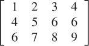

表示为以下序列:

```js
list(list(1, 2, 3, 4),
     list(4, 5, 6, 6),
     list(6, 7, 8, 9))
```

有了这种表示，我们可以用序列运算简明地表达基本的矩阵和向量运算。这些运算(在任何矩阵代数书籍中都有描述)如下:

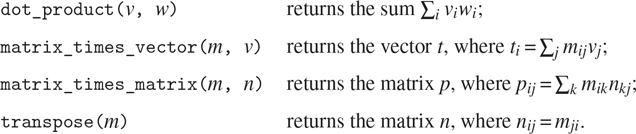

我们可以将点积定义为 [^(15)](#c2-fn-0015)

```js
function dot_product(v, w) {
    return accumulate(plus, 0, accumulate_n(times, 1, list(v, w)));
}
```

填写下列函数中缺少的表达式，以计算其他矩阵运算。(函数`accumulate_n`在练习 2.36 中声明。)

```js
function matrix_times_vector(m, v) {
    return map( ?? , m);
}
function transpose(mat) {
    return accumulate_n( ?? , ?? , mat);
}
function matrix_times_matrix(n, m) {
    const cols = transpose(n);
    return map( ?? , m);
}
```

##### 练习 2.38

`accumulate`函数也称为`fold_right`，因为它将序列的第一个元素与右侧所有元素的组合结果相结合。还有一个`fold_left`，类似于`fold_right`，除了它组合了反方向工作的元素:

```js
function fold_left(op, initial, sequence) {
    function iter(result, rest) {
        return is_null(rest)
               ? result
               : iter(op(result, head(rest)),
                      tail(rest));
    }
    return iter(initial, sequence);
}
```

的价值观是什么

```js
fold_right(divide, 1, list(1, 2, 3));

fold_left(divide, 1, list(1, 2, 3));

fold_right(list, null, list(1, 2, 3));

fold_left(list, null, list(1, 2, 3));
```

给出一个`op`应该满足的属性，以保证`fold_right`和`fold_left`对于任何序列都会产生相同的值。

##### 练习 2.39

根据练习 2.38 中的`fold_right`和`fold_left`完成以下`reverse`(练习 2.18)的定义:

```js
function reverse(sequence) {
    return fold_right((x, y) => ?? , null, sequence);
}

function reverse(sequence) {
    return fold_left((x, y) => ?? , null, sequence);
}
```

##### 嵌套映射

我们可以扩展 sequence 范式，以包含许多通常使用嵌套循环表示的计算。 [^(16)](#c2-fn-0016) 考虑这个问题:给定一个正整数 n ，求所有有序的互不相同的正整数对 i 和 j ，其中 1 j < i n ，使得 i + j 为素数。例如，如果 n 为 6，则配对如下:

| `i` | 2 | 3 | 4 | 4 | 5 | 6 | 6 |
| --- | --- | --- | --- | --- | --- | --- | --- |
| `j` | 1 | 2 | 1 | 3 | 2 | 1 | 5 |
| `i + j` | 3 | 5 | 5 | 7 | 7 | 7 | 11 |

组织这种计算的一种自然方式是生成所有小于或等于 n 的正整数有序对的序列，过滤以选择那些和为素数的对，然后，对于通过过滤器的每一对( i ， j )，生成三元组( i ， j ，I【T72+】【t77)

这里有一个生成偶对序列的方法:对于每个整数`i < n`，枚举整数`j < i`，对于每个这样的`i`和`j`生成`pair(i, j)`。在序列操作方面，我们沿着序列`enumerate_interval(1, n)`进行映射。对于这个序列中的每个`i`，我们沿着序列`enumerate_interval(1, i - 1)`进行映射。对于后面这个序列中的每个`j`，我们生成一对`list(i, j)`。这给了我们每个`i`的偶对序列。组合所有`i`的所有序列(通过与`append`累加)产生所需的序列对: [^(17)](#c2-fn-0017)

```js
accumulate(append,
           null,
           map(i => map(j => list(i, j),
                        enumerate_interval(1, i - 1)),
               enumerate_interval(1, n)));
```

用`append`进行映射和累加的组合在这类程序中很常见，我们将把它作为一个独立的函数:

```js
function flatmap(f, seq) {
    return accumulate(append, null, map(f, seq));
}
```

现在过滤这一对序列，找出和为质数的对。为序列的每个元素调用过滤器谓词；它的参数是一个对，它必须从对中提取整数。因此，应用于序列中每个元素的谓词是

```js
function is_prime_sum(pair) {
    return is_prime(head(pair) + head(tail(pair)));
}
```

最后，通过使用以下函数映射过滤后的对来生成结果序列，该函数构造一个三元组，由对中的两个元素及其总和组成:

```js
function make_pair_sum(pair) {
    return list(head(pair), head(tail(pair)),
                head(pair) + head(tail(pair)));
}
```

将所有这些步骤结合起来就产生了完整的功能:

```js
function prime_sum_pairs(n) {
    return map(make_pair_sum,
               filter(is_prime_sum,
                      flatmap(i => map(j => list(i, j),
                                       enumerate_interval(1, i - 1)),
                              enumerate_interval(1, n))));
}
```

嵌套映射对于枚举间隔以外的序列也很有用。假设我们希望生成集合 S 的所有排列；也就是对集合中的项目进行排序的所有方式。例如，{1，2，3}的排列是{1，2，3}、{1，3，2}、{2，1，3}、{2，3，1}、{3，1，2}和{3，2，1}。下面是一个生成 S 排列的方案:对于 S 中的每一项 x ，递归生成 S–x、[18](#c2-fn-0018)的排列顺序，并将 x 邻接到每一项的前面。对于 S 中的每个 x ，这产生了从 x 开始的 S 的排列序列。组合所有 x 的这些序列给出了 S:[^(19)](#c2-fn-0019)的所有排列

```js
function permutations(s) {
    return is_null(s) // empty set?
           ? list(null) // sequence containing empty set
           : flatmap(x => map(p => pair(x, p),
                              permutations(remove(x, s))),
                     s);
}
```

注意这个策略是如何将生成 S 的排列的问题简化为生成比 S 更少元素的集合的排列的问题。在最后一种情况下，我们一直工作到空列表，它表示一组没有元素的集合。为此，我们生成`list(null)`，它是一个只有一项的序列，即没有元素的集合。`permutations`中使用的`remove`函数返回给定序列中除给定项目之外的所有项目。这可以表示为一个简单的过滤器:

```js
function remove(item, sequence) {
    return filter(x => ! (x === item),
                  sequence);
}
```

##### 练习 2.40

编写一个函数`unique_pairs`，在给定一个整数 n 的情况下，用 1 j < i n 生成一系列对( i ， j )。使用`unique_pairs`简化上面给出的`prime_sum_pairs`的定义。

##### 练习 2.41

编写一个函数，找出所有小于或等于给定整数 n 且总和为给定整数 s 的不同正整数 i 、 j 和 k 的有序三元组。

##### 练习 2.42

“八皇后难题”询问如何将八个皇后放置在棋盘上，使得没有皇后被其他皇后牵制(即，没有两个皇后在同一行、列或对角线上)。图 2.8 显示了一种可能的解决方案。解决这个难题的一个方法是全面展开工作，在每列中放置一个皇后。一旦我们放置了 k–1 张皇后牌，我们必须将 k 张皇后牌放置在一个不会检查棋盘上任何一张皇后牌的位置。我们可以递归地制定这种方法:假设我们已经生成了将 k–1 皇后放置在棋盘的前 k–1 列中的所有可能方式的序列。对于这些方法中的每一种，通过在第 k 列的每一行中放置一个皇后来生成一组扩展的位置。现在过滤这些，只保留第 k 列中的皇后相对于其他皇后安全的位置。这产生了将 k 皇后放置在第一个 k 列中的所有方式的顺序。通过继续这个过程，我们将不仅产生一个解决方案，而是这个难题的所有解决方案。

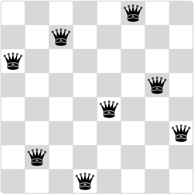

图 2.8：八皇后谜题的一种解法。

我们将该解决方案实现为函数`queens`，该函数返回将`n`个皇后放置在`n x n`棋盘上的问题的所有解决方案的序列。函数`queens`有一个内部函数`queens_cols`，它返回将皇后放入棋盘前 k 列的所有方法的顺序。

```js
function queens(board_size) {
    function queen_cols(k) {
        return k === 0
               ? list(empty_board)
               : filter(positions => is_safe(k, positions),
                        flatmap(rest_of_queens =>
                                  map(new_row =>
                                        adjoin_position(new_row, k,
                                                        rest_of_queens),
                                      enumerate_interval(1, board_size)),
                                queen_cols(k - 1)));
    }
    return queen_cols(board_size);
}
```

在这个函数中，`rest_of_queens`是一种将 k–1 皇后放置在前 k–1 列中的方法，`new_row`是一个建议行，用于放置第 k 列的皇后。通过实现板位置集合的表示来完成程序，包括将一个新的行列位置连接到一个位置集合的函数`adjoin_position`，以及表示一个空的位置集合的函数`empty_board`。您还必须编写函数`is_safe`，它为一组位置确定第 k 列中的皇后相对于其他皇后是否安全。(注意，我们只需要检查新的女王是否安全——其他女王已经被保证相对于彼此是安全的。)

##### 练习 2.43

路易斯·雷森纳在做练习 2.42 的时候很难受。他的`queens`功能看起来可以用，但是运行速度极慢。(路易斯从来没有设法等待足够长的时间来解决甚至 6 6 号案件。)当 Louis 向 Eva Lu Ator 寻求帮助时，她指出他互换了`flatmap`中嵌套映射的顺序，写为

```js
flatmap(new_row =>
          map(rest_of_queens =>
                adjoin_position(new_row, k, rest_of_queens),
              queen_cols(k - 1)),
        enumerate_interval(1, board_size));
```

解释为什么这种交换会使程序运行缓慢。估计路易斯的程序解决八皇后难题需要多长时间，假设练习 2.42 中的程序及时解决难题 T 。

### 2.2.4 举例:一种图片语言

本节介绍了一种简单的绘图语言，它展示了数据抽象和闭包的强大功能，并以一种基本的方式利用了高阶函数。该语言旨在使试验模式变得容易，例如图 2.9 中的模式，这些模式由重复的元素组成，这些元素被移动和缩放。 [^(20)](#c2-fn-0020) 在这种语言中，被组合的数据对象被表示为函数而不是列表结构。正如满足闭包属性的`pair`允许我们轻松构建任意复杂的列表结构一样，这种语言中的操作也满足闭包属性，允许我们轻松构建任意复杂的模式。

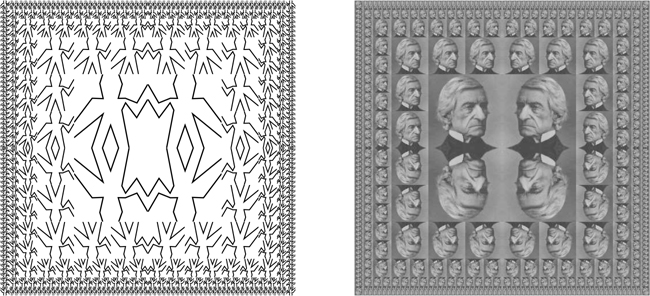

图 2.9：用图片语言生成的设计。

##### 图片语言

当我们在 1.1 节开始学习编程时，我们强调了通过关注语言的原语、组合方式和抽象方式来描述语言的重要性。我们将遵循这个框架。

这种画面语言的优雅之处在于只有一种元素，叫做画家。画家绘制图像，该图像被移动和缩放以适合指定的平行四边形框架。例如，有一个我们称之为`wave`的原始画家，他画了一个粗糙的线条画，如图图 2.10：所示。图画的实际形状取决于画框——图 2.10：中的所有四幅图像都是由同一个`wave`画家绘制的，但是相对于四个不同的画框。画家可以比这更精细:名为`rogers`的原始画家为麻省理工学院的创始人威廉·巴顿·罗杰斯画了一幅画，如图图 2.11：所示。[^(21)](#c2-fn-0021)图 2.11：中的四幅图像是针对与图 2.10：中的`wave`图像相同的四帧绘制的。

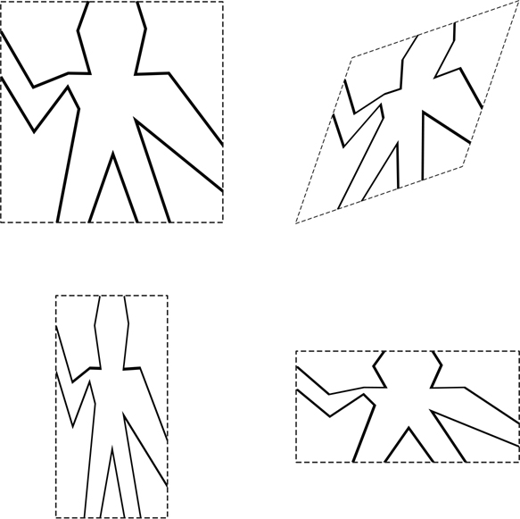

图 2.10：由`wave`画师产生的图像，关于四个不同的帧。用虚线显示的帧不是图像的一部分。

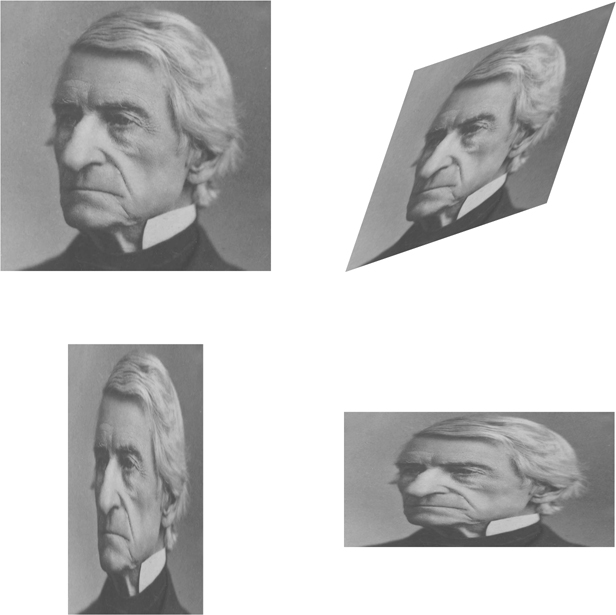

图 2.11：麻省理工学院创始人兼首任校长威廉·巴顿·罗杰斯的画像，与图 2.10[中的四个画框相对而画(原图由麻省理工学院博物馆提供)。](#c2-fig-0017)

为了组合图像，我们使用各种操作从给定的画师构造新的画师。例如，`beside`操作采用两个画师，并生成一个新的复合画师，在帧的左半部分绘制第一个画师的图像，在帧的右半部分绘制第二个画师的图像。类似地，`below`采用两个画家并产生一个复合画家，该复合画家在第二个画家的图像下面绘制第一个画家的图像。一些操作转换单个画师以产生新的画师。例如，`flip_vert`取一个画师，产生一个颠倒画其图像的画师，`flip_horiz`产生一个颠倒画原画师图像的画师。

图 2.12：显示了一个名为`wave4`的画家的图，该图从`wave`开始分两个阶段构建:

```js
const wave2 = beside(wave, flip_vert(wave));
const wave4 = below(wave2, wave2);
```

在以这种方式构建一个复杂的图像时，我们利用了这样一个事实，即画家在语言的组合方式下是封闭的。两个画师的`beside`或`below`本身就是画师；因此，我们可以将其作为制作更复杂的画家的元素。与使用`pair`构建列表结构一样，组合方式下的数据闭合对于仅使用少量操作创建复杂结构的能力至关重要。

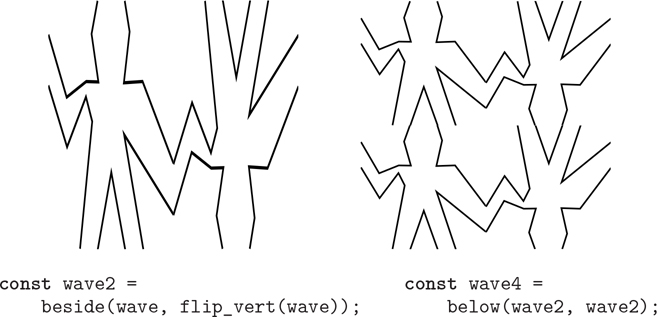

图 2.12：创建复杂图形，从图 2.10：的`wave`画师开始。

一旦我们可以组合画家，我们希望能够抽象出组合画家的典型模式。我们将把画图操作实现为 JavaScript 函数。这意味着在图片语言中我们不需要特殊的抽象机制:由于组合的方式是普通的 JavaScript 函数，我们自动地拥有了用函数可以做的任何画图操作的能力。例如，我们可以将`wave4`中的模式抽象为

```js
function flipped_pairs(painter) {
    const painter2 = beside(painter, flip_vert(painter));
    return below(painter2, painter2);
}
```

并将`wave4`声明为该模式的一个实例:

```js
const wave4 = flipped_pairs(wave);
```

我们也可以定义递归运算。这里有一个使油漆工向右分裂和分支，如图[图 2.13 和 2.14](#c2-fig-0020) :

```js
function right_split(painter, n) {
    if (n === 0) {
        return painter;
    } else {
        const smaller = right_split(painter, n - 1);
        return beside(painter, below(smaller, smaller));
    }
}
```

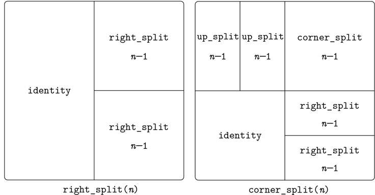

图 2.13：为`right_split`和`corner_split`的递归计划。

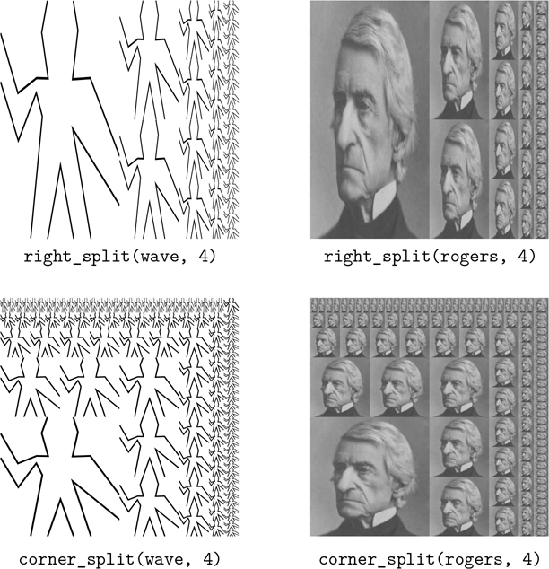

图 2.14：将递归运算`right_split`应用于画师`wave`和`rogers`。组合四个`corner_split`图形产生对称的`square_limit`，如图 2.9 中的[所示。](#c2-fig-0016)

我们可以通过向上和向右分支来生成平衡的模式(参见练习 2.44 和[图 2.13 和 2.14](#c2-fig-0020) ):

```js
function corner_split(painter, n) {
    if (n === 0) {
        return painter;
    } else {
        const up = up_split(painter, n - 1);
        const right = right_split(painter, n - 1);
        const top_left = beside(up, up);
        const bottom_right = below(right, right);
        const corner = corner_split(painter, n - 1);
        return beside(below(painter, top_left),
                      below(bottom_right, corner));
    }
}
```

通过适当放置四个`corner_split`副本，我们得到一个名为`square_limit`的图案，其在`wave`和`rogers`中的应用如图图 2.9：所示:

```js
function square_limit(painter, n) {
    const quarter = corner_split(painter, n);
    const half = beside(flip_horiz(quarter), quarter);
    return below(flip_vert(half), half);
}
```

##### 练习 2.44

声明`corner_split`使用的函数`up_split`。它与`right_split`相似，只是它切换了`below`和`beside`的角色。

##### 高阶运算

除了抽象组合画师的模式，我们还可以在更高的层次上工作，抽象组合画师操作的模式。也就是说，我们可以将 painter 操作视为要操作的元素，并可以编写这些元素的组合方式——将 painter 操作作为参数并创建新的 painter 操作的函数。

例如，`flipped_pairs`和`square_limit`各以正方形图案排列一个画家图像的四个副本；它们的区别仅在于如何定位副本。抽象这种 painter 组合模式的一种方法是使用下面的函数，该函数采用四个单参数 painter 操作，并产生一个 painter 操作，该操作用这四个操作转换给定的 painter，并将结果排列在一个正方形中。 [^(22)](#c2-fn-0022) 功能`tl`、`tr`、`bl`和`br`分别是应用于左上复印、右上复印、左下复印和右下复印的变换。

```js
function square_of_four(tl, tr, bl, br) {
    return painter => {
        const top = beside(tl(painter), tr(painter));
        const bottom = beside(bl(painter), br(painter));
        return below(bottom, top);
    };
}
```

那么`flipped_pairs`可以用`square_of_four`来定义如下: [^(23)](#c2-fn-0023)

```js
function flipped_pairs(painter) {
    const combine4 = square_of_four(identity, flip_vert,
                                    identity, flip_vert);
    return combine4(painter);
}
```

而`square_limit`可以表示为 [^(24)](#c2-fn-0024)

```js
function square_limit(painter, n) {
    const combine4 = square_of_four(flip_horiz, identity,
                                    rotate180, flip_vert);
    return combine4(corner_split(painter, n));
}
```

##### 练习 2.45

函数`right_split`和`up_split`可以表示为一般分割操作的实例。用求值的属性声明一个函数`split`

```js
const right_split = split(beside, below);
const up_split = split(below, beside);
```

产生与已经声明的函数行为相同的函数`right_split`和`up_split`。

##### 框架

在我们展示如何实现画家和他们的组合方式之前，我们必须首先考虑框架。一个帧可以用三个向量来描述——一个原点向量和两个边缘向量。原点向量指定框架的原点相对于平面中某个绝对原点的偏移量，边缘向量指定框架的角相对于其原点的偏移量。如果边缘垂直，框架将是矩形的。否则框架将是一个更一般的平行四边形。

图 2.15：显示了一个帧及其相关向量。根据数据抽象，我们还不需要具体说明框架是如何表示的，只是说有一个构造函数`make_frame`，它接受三个向量并产生一个框架，以及三个相应的选择器`origin_frame`、`edge1_frame`和`edge2_frame`(见练习 2.47)。

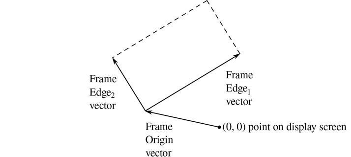

图 2.15：一个帧由三个向量描述——一个原点和两条边。

我们将使用单位正方形中的坐标(0 ≤ x ， y ≤ 1)来指定图像。对于每一帧，我们关联一个帧坐标图，它将用于移动和缩放图像以适应帧。通过将矢量 **v** = ( x ， y )映射到矢量和，地图将单位正方形转换为框架

```js
Origin(Frame) + x · Edge1 (Frame) + y · Edge2 (Frame)
```

例如，(0，0)映射到帧的原点，(1，1)映射到原点对角的顶点，(0.5，0.5)映射到帧的中心。我们可以用下面的函数创建一个帧的坐标图: [^(25)](#c2-fn-0025)

```js
function frame_coord_map(frame) {
    return v => add_vect(origin_frame(frame),
                         add_vect(scale_vect(xcor_vect(v),
                                             edge1_frame(frame)),
                                  scale_vect(ycor_vect(v),
                                             edge2_frame(frame))));
}
```

请注意，将`frame_coord_map`应用于一个帧会返回一个函数，该函数在给定一个向量的情况下会返回一个向量。如果自变量向量在单位正方形中，则结果向量将在框架中。举个例子，

```js
frame_coord_map(a_frame)(make_vect(0, 0)); 
```

返回与相同的向量

```js
origin_frame(a_frame);
```

##### 练习 2.46

从原点到一点的二维向量 v 可以表示为一个由 x 坐标和 y 坐标组成的对。通过给出一个构造函数`make_vect`和相应的选择器`xcor_vect`和`ycor_vect`来实现向量的数据抽象。根据您的选择器和构造器，实现函数`add_vect`、`sub_vect`和`scale_vect`，它们执行向量加法、向量减法和向量乘以标量的操作:

| (x1，y1)+(x2，y2) | = | (x[1]+x[2]，y[1]+y[2]) |
| (x1，y1)–(x2，y2) | = | (x[1]–x[2]，y[1]–y[2]) |
| s ( x ， y ) | = | ( sx ， sy ) |

##### 练习 2.47

下面是两个可能的框架构造函数:

```js
function make_frame(origin, edge1, edge2) {
    return list(origin, edge1, edge2);
}

function make_frame(origin, edge1, edge2) {
   return pair(origin, pair(edge1, edge2));
}
```

为每个构造函数提供适当的选择器来产生框架的实现。

##### 画家

画师被表示为一个函数，给定一个帧作为参数，绘制一个特定的图像，移动和缩放以适合该帧。也就是说，如果`p`是画师，`f`是画框，那么我们通过以`f`为自变量调用`p`来产生`f`中`p`的形象。

原始画师是如何实现的细节取决于图形系统的特定特征和要绘制的图像类型。例如，假设我们有一个函数`draw_line`，它在屏幕上的两个指定点之间画了一条线。然后我们可以为线条画创建画师，例如图 2.10：中的`wave`画师，来自如下的线段列表: [^(26)](#c2-fn-0026)

```js
function segments_to_painter(segment_list) {
    return frame =>
             for_each(segment =>
                        draw_line(
                            frame_coord_map(frame)
                                (start_segment(segment)),
                            frame_coord_map(frame)
                                (end_segment(segment))),
                      segment_list);
}
```

使用相对于单位正方形的坐标给出线段。对于列表中的每个线段，画家用帧坐标图变换线段端点，并在变换后的点之间画一条线。

将画家表现为功能在图像语言中竖起了一个强大的抽象障碍。我们可以创造和混合各种原始画家，基于各种图形能力。它们实现的细节并不重要。任何函数都可以充当画师，只要它以一个框架作为参数，并绘制适合该框架的缩放内容。 [^(27)](#c2-fn-0027)

##### 练习 2.48

平面中的有向线段可以表示为一对向量，一个向量从线段的原点到起点，另一个向量从线段的原点到终点。使用练习 2.46 中的向量表示法，用构造器`make_segment`和选择器`start_segment`和`end_segment`定义线段的表示法。

##### 练习 2.49

使用`segments_to_painter`定义以下原始画家:

1.  a. 画出指定画框轮廓的画家。
2.  b. 通过连接画框的对角来画一个“X”的画家。
3.  c. 通过连接画框两边的中点画出菱形的画家。
4.  d. 那个`wave`油漆工。

##### 转换和组合画家

对画师(如`flip_vert`或`beside`)的操作是通过创建一个画师来工作的，该画师针对从参数帧导出的帧调用原始画师。因此，举例来说，`flip_vert`不需要知道画家如何工作来翻转它——它只需要知道如何颠倒框架:翻转的画家只是使用原始画家，但是在颠倒的框架中。

画师操作基于函数`transform_painter`，该函数将画师和关于如何变换帧并生成新画师的信息作为参数。当在框架上调用转换的画师时，转换框架并在转换的框架上调用原始画师。`transform_painter`的参数是指定新帧角的点(表示为向量):当映射到帧中时，第一个点指定新帧的原点，另外两个点指定其边缘向量的端点。因此，单位正方形内的参数指定包含在原始框架内的框架。

```js
function transform_painter(painter, origin, corner1, corner2) {
    return frame => {
             const m = frame_coord_map(frame);
             const new_origin = m(origin);
             return painter(make_frame(
                                new_origin,
                                sub_vect(m(corner1), new_origin),
                                sub_vect(m(corner2), new_origin)));
           };
}
```

以下是垂直翻转画家图像的方法:

```js
function flip_vert(painter) {
    return transform_painter(painter,
                             make_vect(0, 1),  // new origin
                             make_vect(1, 1),  // new end of edge1
                             make_vect(0, 0)); // new end of edge2
}
```

使用`transform_painter`，我们可以很容易地定义新的转换。例如，我们可以声明一个画师，将其图像缩小到给定帧的右上方四分之一:

```js
function shrink_to_upper_right(painter) {
    return transform_painter(painter,
                             make_vect(0.5, 0.5),
                             make_vect(1, 0.5),
                             make_vect(0.5, 1));
}
```

其他变换将图像逆时针旋转 90 度[28](#c2-fn-0028)

```js
function rotate90(painter) {
    return transform_painter(painter,
                             make_vect(1, 0),
                             make_vect(1, 1),
                             make_vect(0, 0));
}
```

或者向画面中央挤压图像: [^(29)](#c2-fn-0029)

```js
function squash_inwards(painter) {
    return transform_painter(painter,
                             make_vect(0, 0),
                             make_vect(0.65, 0.35),
                             make_vect(0.35, 0.65));
}
```

框架变换也是定义组合两个或更多画家的方法的关键。例如，`beside`函数获取两个画师，将他们转换为分别在一个参数帧的左半部分和右半部分绘画，并生成一个新的复合画师。当给定复合绘制者一个帧时，它调用第一个变换的绘制者在该帧的左半部分进行绘制，并调用第二个变换的绘制者在该帧的右半部分进行绘制:

```js
function beside(painter1, painter2) {
    const split_point = make_vect(0.5, 0);
    const paint_left = transform_painter(painter1,
                                         make_vect(0, 0),
                                         split_point,
                                         make_vect(0, 1));
    const paint_right = transform_painter(painter2,
                                         split_point,
                                         make_vect(1, 0),
                                         make_vect(0.5, 1));
    return frame => {
               paint_left(frame);
               paint_right(frame);
           };
}
```

观察画师数据抽象，尤其是画师作为函数的表示，如何使`beside`易于实现。`beside`函数不需要知道组件绘制者的任何细节，只需要知道每个绘制者将在其指定的框架中绘制一些东西。

##### 练习 2.50

声明水平翻转画师的转换`flip_horiz`，以及逆时针旋转画师 180 度和 270 度的转换。

##### 练习 2.51

为油漆工声明`below`操作。函数`below`以两个画师为参数。给定一个框架，生成的画家在框架的底部绘制第一个画家，在顶部绘制第二个画家。用两种不同的方式定义`below`——首先通过编写一个类似于上面给出的`beside`函数的函数，再次根据`beside`和合适的旋转操作(来自练习 2.50)。

##### 稳健设计的语言层次

图片语言利用了我们已经介绍的关于函数和数据抽象的一些关键思想。基本的数据抽象，画家，是使用函数表示实现的，这使得该语言能够以统一的方式处理不同的基本绘图功能。组合的方式满足封闭性，这允许我们容易地建立复杂的设计。最后，所有抽象功能的工具都可以为我们所用，为画家抽象出组合的方式。

我们还对语言和程序设计的另一个重要概念有所了解。这就是分层设计的方法，即一个复杂的系统应该由一系列的层次构成，这些层次是用一系列的语言描述的。每个级别都是通过组合在该级别被视为图元的部分来构建的，并且在每个级别构建的部分被用作下一级别的图元。在分层设计的每一层使用的语言都有适合该细节层的原语、组合方式和抽象方式。

分层设计遍及复杂系统工程。例如，在计算机工程中，电阻器和晶体管被组合(并用模拟电路语言描述)以产生诸如与门和或门之类的部件，这些部件形成了数字电路设计语言的原语。 [^(30)](#c2-fn-0030) 这些部分组合起来构建处理器、总线结构和存储系统，它们依次组合起来形成计算机，使用适合计算机架构的语言。计算机被组合起来形成分布式系统，使用适合于描述网络互连的语言，等等。

作为分层的一个微小例子，我们的图片语言使用原始元素(原始画家)来指定点和线，以提供像`rogers`这样的画家的形状。我们对图片语言的大部分描述集中在使用几何组合器如`beside`和`below`来组合这些原语。我们还在更高的层次上工作，将`beside`和`below`视为在一种语言中被操纵的原语，其操作，例如`square_of_four`，捕获了组合几何组合器的常见模式。

分层设计有助于使程序变得健壮，也就是说，它使得规范中的小变化可能需要程序中相应的小变化。例如，假设我们想要基于图 2.9 中的[所示的`wave`来改变图像。我们可以在最底层改变`wave`元素的详细外观；我们可以在中层工作，改变`corner_split`复制`wave`的方式；我们可以在最高层工作，改变`square_limit`安排四个角落的方式。一般来说，分层设计的每一层都提供了不同的词汇来表达系统的特征，并提供了不同的能力来改变它。](#c2-fig-0016)

##### 练习 2.52

通过在上述每个水平上工作，改变图 2.9 中[所示的`wave`的平方极限。特别是:](#c2-fig-0016)

1.  a. 在练习 2.49 的图元`wave`画师上添加一些线段(比如添加一个微笑)。
2.  b. 更改由`corner_split`构建的图案(例如，仅使用`up_split`和`right_split`图像的一个副本，而不是两个)。
3.  c. 修改使用`square_of_four`的`square_limit`版本，以便以不同的模式组装拐角。(例如，你可以让大个子罗杰斯先生从广场的每个角落往外看。)

## 2.3 符号数据

到目前为止，我们使用的所有复合数据对象最终都是由数字构成的。在本节中，我们通过引入将字符串作为数据处理的能力来扩展我们语言的表示能力。

### 2.3.1 琴弦

到目前为止，我们已经使用字符串来显示消息，使用函数`display`和`error`(例如练习 1.22)。我们可以使用字符串和列表形成复合数据，例如

```js
list("a", "b", "c", "d")
list(23, 45, 17)
list(list("Jakob", 27), list("Lova", 9), list("Luisa", 24))
```

为了区分字符串和名称，我们用双引号将它们括起来。例如，JavaScript 表达式`z`表示名称`z`的值，而 JavaScript 表达式`"z"`表示由单个字符组成的字符串，即英文字母表中小写的最后一个字母。

通过引号，我们可以区分字符串和名称:

```js
const a = 1;
const b = 2;

list(a, b);
[1, [2, null]]

list("a", "b");
["a", ["b", null]]

list("a", b);
["a", [2, null]]
```

在 1.1.6 节中，我们引入了`===`和`!==`作为数字的基本谓词。从现在开始，我们将允许两个字符串作为`===`和`!==`的操作数。当且仅当两个字符串相同时，谓词`===`返回 true，当且仅当两个字符串不相同时，`!==`返回 true。 [^(31)](#c2-fn-0031) 使用`===`，我们可以实现一个叫做`member`的有用函数。这需要两个参数:一个字符串和一个字符串列表，或者一个数字和一个数字列表。如果第一个参数不包含在列表中(即，不是列表中任何项目的`===`，则`member`返回`null`。否则，它返回列表的子列表，从第一次出现的字符串或数字开始:

```js
function member(item, x) {
    return is_null(x)
           ? null
           : item === head(x)
           ? x
           : member(item, tail(x));
}
```

例如，的值

```js
member("apple", list("pear", "banana", "prune"))
```

是`null`，而的值

```js
member("apple", list("x", "y", "apple", "pear"))
```

是`list("apple", "pear")`。

##### 练习 2.53

用方框表示法和列表表示法计算下列每个表达式的结果是什么？

```js
list("a", "b", "c")

list(list("george"))

tail(list(list("x1", "x2"), list("y1", "y2")))

tail(head(list(list("x1", "x2"), list("y1", "y2"))))

member("red", list("blue", "shoes", "yellow", "socks"))

member("red", list("red", "shoes", "blue", "socks"))
```

##### 练习 2.54

如果两个列表包含以相同顺序排列的相同元素，则称它们为`equal`。举个例子，

```js
equal(list("this", "is", "a", "list"), list("this", "is", "a", "list"))
```

是真的，但是

```js
equal(list("this", "is", "a", "list"), list("this", list("is", "a"), "list"))
```

是假的。更准确地说，我们可以根据数字和字符串的基本`===`等式递归地定义`equal`，如果`a`和`b`都是字符串或者都是数字并且都是`===`，或者都是成对的，使得`head(a)`是`equal`到`head(b)`并且`tail(a)`是`equal`到`tail(b)`。利用这个想法，将`equal`实现为一个函数。

##### 练习 2.55

JavaScript 解释器读取双引号`"`后的字符，直到找到另一个双引号。两者之间的所有字符都是字符串的一部分，不包括双引号本身。但是如果我们希望一个字符串包含双引号呢？为此，JavaScript 还允许用单引号来分隔字符串，例如在`'say your name aloud'`中。在单引号字符串中，我们可以使用双引号，反之亦然，所以如果我们从 0 开始计数，`'say "your name" aloud'`和`"say 'your name' aloud"`是在位置 4 和 14 具有不同字符的有效字符串。根据使用的字体，两个单引号可能不容易与双引号区分开来。你能指出哪个是哪个，并计算出下列表达式的值吗？

```js
' " ' === " "
```

### 2.3.2 示例:符号微分

作为符号操作的说明和数据抽象的进一步说明，考虑执行代数表达式的符号微分的函数的设计。我们希望函数将一个代数表达式和一个变量作为自变量，并返回表达式对变量的导数。例如，如果函数的参数是 ax²+bx+c 和 x ，那么函数应该返回 2 ax + b 。符号微分在编程语言 Lisp 中具有特殊的历史意义。这是开发一种用于符号操作的计算机语言背后的激励例子之一。此外，它标志着导致符号数学工作的强大系统开发的研究路线的开始，这些系统今天被应用数学家和物理学家例行使用。

在开发符号微分程序时，我们将遵循我们在开发 2.1.1 节的有理数系统时所遵循的相同的数据抽象策略。也就是说，我们将首先定义一个微分算法，该算法对诸如“和”、“积”和“变量”之类的抽象对象进行运算，而不用担心如何表示这些对象。只有在此之后，我们才会解决表示问题。

##### 抽象数据的微分程序

为了简单起见，我们将考虑一个非常简单的符号微分程序，它处理只使用两个参数的加法和乘法运算构建的表达式。任何这种表达式的微分可以通过应用以下归约规则来进行:


注意，后两个规则本质上是递归的。也就是说，要得到一个和的导数，我们首先要找到各项的导数，然后将它们相加。每一项都可能是一个需要分解的表达式。分解成越来越小的碎片，最终会产生要么是常数要么是变量的碎片，它们的导数要么是 0，要么是 1。

为了在函数中体现这些规则，我们沉溺于一厢情愿的想法，正如我们在设计有理数实现时所做的那样。如果我们有一种表示代数表达式的方法，我们应该能够判断一个表达式是和、积、常数还是变量。我们应该能够提取表达式的各个部分。例如，对于一个和，我们希望能够提取加数(第一项)和被加数(第二项)。我们也应该能够从部件中构造表达式。假设我们已经有了实现以下选择器、构造器和谓词的函数:

| `is_variable(e)` | `e`是变量吗？ |
| `is_same_variable(v1, v2)` | `v1`和`v2`是同一个变量吗？ |
| `is_sum(e)` | `e`是和吗？ |
| `addend(e)` | 总和的加数`e`。 |
| `augend(e)` | 总和的被加数`e`。 |
| `make_sum(a1, a2)` | 构造`a1`和`a2`的和。 |
| `is_product(e)` | `e`是产品吗？ |
| `multiplier(e)` | 产品的乘数`e`。 |
| `multiplicand(e)` | 产品的被乘数`e`。 |
| `make_product(m1, m2)` | 构建`m1`和`m2`的产品。 |

使用这些以及标识数字的基本谓词`is_number`，我们可以将微分规则表示为以下函数:

```js
function deriv(exp, variable) {
    return is_number(exp)
           ? 0
           : is_variable(exp)
           ? is_same_variable(exp, variable) ? 1 : 0
           : is_sum(exp)
           ? make_sum(deriv(addend(exp), variable),
                      deriv(augend(exp), variable))
           : is_product(exp)
           ? make_sum(make_product(multiplier(exp),
                                   deriv(multiplicand(exp),
                                         variable)),
                     make_product(deriv(multiplier(exp),
                                         variable),
                                  multiplicand(exp)))
           : error(exp, "unknown expression type – deriv");
}
```

此`deriv`功能包含完整的微分算法。因为它是用抽象数据表示的，所以无论我们选择如何表示代数表达式，只要我们设计一组合适的选择器和构造器，它都是可行的。这是我们接下来必须解决的问题。

##### 表示代数表达式

我们可以想象用链表结构来表示代数表达式的多种方式。例如，我们可以使用反映通常代数符号的符号列表，将 ax + b 表示为`list("a", "*", "x", "+", "b")`。但是，如果我们在表示表达式的 JavaScript 值中反映表达式的数学结构，会更方便；即把 ax + b 表示为`list("+", list("*", "a", "x"), "b")`。将二元运算符放在其操作数前面称为前缀符号，与 1.1.1 节中介绍的中缀符号形成对比。使用前缀符号，我们对微分问题的数据表示如下:

*   变量只是字符串。它们由原始谓词`is_string` :

    ```js
        function is_variable(x) { return is_string(x); }
    ```

    来标识
*   两个变量相同，如果代表它们的字符串相等:

    ```js
        function is_same_variable(v1, v2) {         return is_variable(v1) && is_variable(v2) && v1 === v2;     }
    ```

*   总和与乘积被构造为列表:

    ```js
        function make_sum(a1, a2) { return list("+", a1, a2); }     function make_product(m1, m2) { return list("*", m1, m2); }
    ```

*   sum 是一个列表，它的第一个元素是字符串`"+"` :

    ```js
        function is_sum(x) {         return is_pair(x) && head(x) === "+";     }
    ```

*   加数是求和列表的第二项:

    ```js
        function addend(s) { return head(tail(s)); }
    ```

*   被加数是求和列表的第三项:

    ```js
        function augend(s) { return head(tail(tail(s))); }
    ```

*   产品是一个列表，它的第一个元素是字符串`"*"` :

    ```js
        function is_product(x) {         return is_pair(x) && head(x) === "*";     }
    ```

*   乘数是产品列表的第二项:

    ```js
        function multiplier(s) { return head(tail(s)); }
    ```

*   被乘数是乘积表的第三项:

    ```js
        function multiplicand(s) { return head(tail(tail(s))); }
    ```

因此，我们只需要将这些与`deriv`所体现的算法结合起来，就可以得到一个有效的符号微分程序。让我们看一些它的行为的例子:

```js
deriv(list("+", "x", 3), "x");
list("+", 1, 0)

deriv(list("*", "x", "y"), "x");
list("+", list("*", "x", 0), list("*", 1, "y"))

deriv(list("*", list("*", "x", "y"), list("+", "x", 3)), "x");
list("+", list("*", list("*", "x", "y"), list("+", 1, 0)),
          list("*", list("+", list("*", "x", 0), list("*", 1, "y")), 
                    list("+", "x", 3)))
```

程序产生正确的答案；然而，它们并不简单。的确如此


但是我们希望程序知道 x 0 = 0，1 y = y ，0 + y = y 。第二个例子的答案应该是简单的`y`。如第三个例子所示，当表达式很复杂时，这就成了一个严重的问题。

我们的困难很像我们在有理数实现中遇到的困难:我们没有将答案简化为最简单的形式。为了减少有理数，我们只需要改变实现的构造函数和选择器。我们可以在这里采用类似的策略。我们根本不会改变`deriv`。相反，我们将更改`make_sum`，以便如果两个被加数都是数字，`make_sum`将把它们相加并返回它们的和。同样，如果其中一个被加数为 0，那么`make_sum`将返回另一个被加数。

```js
function make_sum(a1, a2) {
    return number_equal(a1, 0)
           ? a2
           : number_equal(a2, 0)
           ? a1
           : is_number(a1) && is_number(a2)
           ? a1 + a2
           : list("+", a1, a2);
}
```

这使用了函数`number_equal`，它检查一个表达式是否等于一个给定的数字:

```js
function number_equal(exp, num) {
    return is_number(exp) && exp === num;
}
```

类似地，我们将改变`make_product`来构建规则，即 0 乘以任何东西都是 0，1 乘以任何东西都是东西本身:

```js
function make_product(m1, m2) {
    return number_equal(m1, 0) || number_equal(m2, 0)
           ? 0
           : number_equal(m1, 1)
           ? m2
           : number_equal(m2, 1)
           ? m1
           : is_number(m1) && is_number(m2)
           ? m1 * m2
           : list("*", m1, m2);
}
```

下面是这个版本在我们的三个示例中的工作方式:

```js
deriv(list("+", "x", 3), "x");
1

deriv(list("*", "x", "y"), "x");
"y"

deriv(list("*", list("*", "x", "y"), list("+", "x", 3)), "x");
list("+", list("*", "x", "y"), list("*", "y", list("+", "x", 3)))
```

虽然这是一个很大的进步，但第三个例子表明，在我们得到一个程序，把表达式转换成我们可能认为“最简单”的形式之前，还有很长的路要走。代数简化的问题是复杂的，因为除了其他原因之外，对一个目的来说最简单的形式对另一个目的来说可能不简单。

##### 练习 2.56

展示如何扩展基本的区分器来处理更多种类的表达式。例如，实现差异化规则

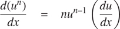

通过在`deriv`程序中添加一个新的子句，并定义适当的功能`is_exp`、`base`、`exponent`和`make_exp`。(您可以使用字符串`"**"`来表示取幂运算。)建立这样的规则:任何事物的 0 次幂都是 1，任何事物的 1 次幂都是事物本身。

##### 练习 2.57

扩展微分程序以处理任意数量(两个或更多)项的和与积。那么上面的最后一个例子可以表示为

```js
deriv(list("*", "x", "y", list("+", "x", 3)), "x");
```

试着只改变求和与乘积的表示，而不改变`deriv`函数。例如，总和的`addend`将是第一项，`augend`将是其余项的总和。

##### 练习 2.58

假设我们想修改微分程序，使其能够使用普通的数学符号，其中`"+"`和`"*"`是中缀而不是前缀运算符。因为微分程序是根据抽象数据定义的，所以我们可以修改它，仅通过改变谓词、选择器和构造函数来处理不同的表达式表示，这些谓词、选择器和构造函数定义了微分器要操作的代数表达式的表示。

1.  a. Show how to do this in order to differentiate algebraic expressions presented in infix form, as in this example:

    ```js
    list("x", "+", list(3, "*", list("x", "+", list("y", "+", 2))))
    ```

    为了简化任务，假设`"+"`和`"*"`总是接受两个参数，并且表达式完全用括号括起来。

2.  b. The problem becomes substantially harder if we allow a notation closer to ordinary infix notation, which omits unnecessary parentheses and assumes that multiplication has higher precedence than addition, as in this example:

    ```js
    list("x", "+", "3", "*", list("x", "+", "y", "+", 2))
    ```

    你能为这种符号设计适当的谓词、选择器和构造函数，使我们的派生程序仍然工作吗？

### 2.3.3 示例:表示集合

在前面的例子中，我们构建了两种复合数据对象的表示:有理数和代数表达式。在其中一个例子中，我们可以选择在构造时或选择时简化(减少)表达式，但除此之外，选择这些结构的列表表示是很简单的。当我们转向集合的表示时，表示的选择就不那么明显了。事实上，有许多可能的表现形式，它们在几个方面有很大的不同。

通俗地说，集合就是不同对象的集合。为了给出更精确的定义，我们可以采用数据抽象的方法。也就是说，我们通过指定要在集合上使用的操作来定义“集合”。这些是`union_set`、`intersection_set`、`is_element_of_set`和`adjoin_set`。函数`is_ element_of_set`是一个判定给定元素是否是集合成员的谓词。函数`adjoin_set`将一个对象和一个集合作为参数，并返回一个包含原始集合的元素以及相邻元素的集合。函数`union_set`计算两个集合的并集，这两个集合是包含出现在任一参数中的每个元素的集合。函数`intersection_set`计算两个集合的交集，这两个集合只包含出现在两个参数中的元素。从数据抽象的角度来看，我们可以自由地设计任何表示，以与上面给出的解释一致的方式实现这些操作。 [^(33)](#c2-fn-0033)

##### 设置为无序列表

表示集合的一种方式是作为其元素的列表，其中没有一个元素出现超过一次。空集由空列表表示。在此表示中，`is_element_of_set`类似于第 2.3.1 节中的函数`member`。它使用了`equal`而不是`===`，这样集合元素就不仅仅是数字或字符串了:

```js
function is_element_of_set(x, set) {
    return is_null(set)
           ? false
           : equal(x, head(set))
           ? true
           : is_element_of_set(x, tail(set));
}
```

利用这一点，我们可以写出`adjoin_set`。如果要邻接的对象已经在集合中，我们只需返回集合。否则，我们使用`pair`将对象添加到代表集合的列表中:

```js
function adjoin_set(x, set) {
    return is_element_of_set(x, set)
           ? set
           : pair(x, set);
}
```

对于`intersection_set`,我们可以使用递归策略。如果我们知道如何形成`set2`和`set1`的`tail`的交集，我们只需要决定是否将`set1`的`head`包含在此。但这个要看`head(set1)`是否也在`set2`里。下面是结果函数:

```js
function intersection_set(set1, set2) {
    return is_null(set1) || is_null(set2)
           ? null
           : is_element_of_set(head(set1), set2)
           ? pair(head(set1), intersection_set(tail(set1), set2))
           : intersection_set(tail(set1), set2);
}
```

在设计表现形式时，我们应该关心的问题之一是效率。考虑我们的集合操作所需的步骤数。由于都使用`is_element_of_set`，所以这个操作的速度对 set 整体实现的效率有很大的影响。现在，为了检查一个对象是否是一个集合的成员，`is_element_of_set`可能必须扫描整个集合。(在最坏的情况下，对象不在集合中。)因此，如果集合有 n 个元素，`is_element_of_set`可能会占用 n 个步骤。因此，所需的步数随着θ(n)增加。使用该操作的`adjoin_set`所需的步数也增长为θ(n)。对于对`set1`的每个元素进行`is_element_of_set`检查的`intersection_set`，所需的步数随着所涉及的集合大小的乘积而增加，或者对于两个集合大小 n 的θ(n2)。对于`union_set`来说也是如此。

##### 练习 2.59

实现集合的无序列表表示的`union_set`操作。

##### 练习 2.60

我们指定一个集合将被表示为一个没有重复的列表。现在假设我们允许复制。例如，集合{1，2，3}可以表示为列表`list(2, 3, 2, 1, 3, 2, 2)`。设计功能`is_element_of_set`、`adjoin_set`、`union_set`和`intersection_set`对该表示进行操作。与非重复表示的相应函数相比，每个函数的效率如何？有什么应用程序你会优先使用这种表示而不是非重复的表示吗？

##### 设置为有序列表

加快集合运算速度的一种方法是改变表示法，使集合元素按升序排列。要做到这一点，我们需要某种方法来比较两个对象，以便我们可以说哪个更大。例如，我们可以按字典顺序比较字符串，或者我们可以商定某种方法，为一个对象分配一个唯一的数字，然后通过比较相应的数字来比较元素。为了使我们的讨论简单，我们将只考虑集合元素是数字的情况，这样我们可以使用`>`和`<`来比较元素。我们将通过按升序排列元素来表示一组数字。我们上面的第一个表示允许我们通过以任何顺序列出元素来表示集合{1，3，6，10}，而我们的新表示只允许列表`list(1, 3, 6, 10)`。

排序的一个优势在`is_element_of_set`中显现出来:在检查一个项目的存在时，我们不再需要扫描整个集合。如果我们到达的集合元素大于我们要查找的项目，那么我们知道该项目不在集合中:

```js
function is_element_of_set(x, set) {
    return is_null(set)
           ? false
           : x === head(set)
           ? true
           : x < head(set)
           ? false
           : // x > head(set)
             is_element_of_set(x, tail(set));
}
```

这样节省了多少步骤？在最坏的情况下，我们要寻找的项目可能是集合中最大的一个，所以步骤的数量与无序表示相同。另一方面，如果我们搜索许多不同大小的项目，我们可以预期，有时我们将能够在列表的开始附近停止搜索，而其他时候我们仍然需要检查列表的大部分。平均来说，我们应该预期必须检查该组中大约一半的项目。因此，所需的平均步骤数大约为 n /2。这仍然是θ(n)增长，但是平均来说，它确实比以前的实现节省了 2 倍的步骤。

我们用`intersection_set`获得了更令人印象深刻的加速。在无序表示中，这个操作需要θ(n²)步，因为我们对`set1`的每个元素执行了一次`set2`的完整扫描。但是有了有序表示，我们可以用更巧妙的方法。首先比较两个集合的初始元素`x1`和`x2`。如果`x1`等于`x2`，那么这就给出了交集的一个元素，交集的其余部分就是两个集合的`tail`的交集。然而，假设`x1`小于`x2`。由于`x2`是`set2`中最小的元素，我们可以立即断定`x1`不可能出现在`set2`中的任何地方，因此不在交集中。因此，交点等于`set2`与`set1`的`tail`的交点。同样，如果`x2`小于`x1`，那么交集由`set1`与`set2`的`tail`的交集给出。下面是函数:

```js
function intersection_set(set1, set2) {
    if (is_null(set1) || is_null(set2)) {
        return null;
    } else {
        const x1 = head(set1);
        const x2 = head(set2);
        return x1 === x2
               ? pair(x1, intersection_set(tail(set1), tail(set2)))
               : x1 < x2
               ? intersection_set(tail(set1), set2)
               : // x2 < x1
                 intersection_set(set1, tail(set2));
    }
}
```

为了估计该过程所需的步骤数，请注意，在每一步，我们都将交集问题简化为计算较小集合的交集——从`set1`或`set2`或两者中移除第一个元素。因此，所需的步骤数最多是`set1`和`set2`的大小之和，而不是无序表示中大小的乘积。这是θ(n)增长，而不是θ(n2)—即使对于中等大小的集合来说，这也是一个相当大的加速。

##### 练习 2.61

使用有序表示给出`adjoin_set`的实现。通过与`is_element_of_set`的类比，展示如何利用有序来产生一个函数，这个函数平均需要无序表示一半的步骤。

##### 练习 2.62

对于表示为有序列表的集合，给出`union_set`的θ(n)实现。

##### 作为二叉树的集合

通过以树的形式排列集合元素，我们可以比有序列表表示做得更好。树的每个节点保存集合中的一个元素，称为该节点上的“条目”，以及到另外两个(可能是空的)节点中的每一个的链接。“左”链接指向比节点处的元素小的元素，“右”链接指向比节点处的元素大的元素。图 2.16：显示了一些代表集合{1，3，5，7，9，11}的树。同一集合可以由树以多种不同的方式来表示。对于有效的表示，我们唯一需要的是左子树中的所有元素都小于节点条目，而右子树中的所有元素都大于节点条目。

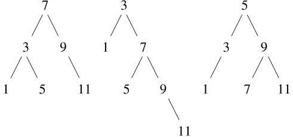

图 2.16：表示集合{1，3，5，7，9，11}的各种二叉树。

树表示的优点是:假设我们想要检查一个数 x 是否包含在一个集合中。我们首先将 x 与顶部节点中的条目进行比较。如果 x 小于这个，我们知道只需要搜索左边的子树；如果 x 更大，我们只需要搜索右边的子树。现在，如果树是“平衡的”，这些子树中的每一个都将是原来的一半大小。因此，在一个步骤中，我们已经将搜索大小为 n 的树的问题简化为搜索大小为 n /2 的树。由于树的大小在每一步都减半，我们应该预计搜索大小为 n 的树所需的步骤数随着θ(logn)的增加而增加。 [^(34)](#c2-fn-0034)

我们可以用列表来表示树。每个节点都是一个包含三个条目的列表:节点处的条目、左子树和右子树。空列表的左边或右边的子树将指示那里没有连接的子树。我们可以用以下函数来描述这种表示: [^(35)](#c2-fn-0035)

```js
function entry(tree) { return head(tree); }
function left_branch(tree) { return head(tail(tree)); }
function right_branch(tree) { return head(tail(tail(tree))); }
function make_tree(entry, left, right) {
    return list(entry, left, right);
}
```

现在我们可以使用上述策略编写`is_element_of_set`:

```js
function is_element_of_set(x, set) {
    return is_null(set)
           ? false
           : x === entry(set)
           ? true
           : x < entry(set)
           ? is_element_of_set(x, left_branch(set))
           : // x > entry(set)
             is_element_of_set(x, right_branch(set));
}
```

将一个项目连接到集合的实现方式类似，也需要θ(logn)步。为了邻接一个条目`x`，我们将`x`与节点条目进行比较，以确定`x`是应该添加到右边还是左边的分支，在将`x`邻接到适当的分支后，我们将这个新构建的分支与原始条目和另一个分支组合在一起。如果`x`等于条目，我们就返回节点。如果我们被要求将`x`连接到一个空的树，我们将生成一个以`x`为条目的树，并清空左右分支。下面是函数:

```js
function adjoin_set(x, set) {
    return is_null(set)
           ? make_tree(x, null, null)
           : x === entry(set)
           ? set
           : x < entry(set)
           ? make_tree(entry(set),
                       adjoin_set(x, left_branch(set)),
                       right_branch(set))
           : // x > entry(set)
             make_tree(entry(set),
                       left_branch(set),
                       adjoin_set(x, right_branch(set)));
}
```

上面声称搜索树可以在对数数量的步骤中执行，这是基于树是“平衡的”的假设，即每棵树的左右子树具有大约相同数量的元素，使得每个子树包含其父树的大约一半的元素。但是我们怎么能确定我们建造的树是平衡的呢？即使我们从平衡的树开始，用`adjoin_set`添加元素也可能产生不平衡的结果。由于新邻接元素的位置取决于该元素与集合中已有项目的比较情况，我们可以预期，如果我们“随机”添加元素，树将趋于平均平衡。但这不是保证。例如，如果我们从一个空集开始，并依次邻接数字 1 到 7，我们最终会得到一个高度不平衡的树，如图图 2.17：所示。在这棵树中，所有左边的子树都是空的，所以它比简单的有序列表没有优势。解决这个问题的一种方法是定义一种操作，将任意树转换成具有相同元素的平衡树。然后，我们可以在每隔几个`adjoin_set`操作之后执行这个转换，以保持我们的集合平衡。还有其他方法可以解决这个问题，其中大多数涉及设计新的数据结构，搜索和插入都可以在θ(logn 步中完成。 [^(36)](#c2-fn-0036)

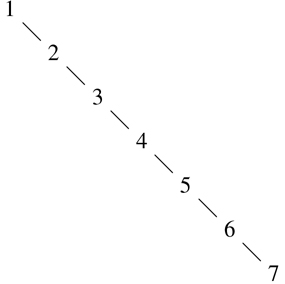

图 2.17：由邻接 1 到 7 依次产生的不平衡树。

##### 练习 2.63

下面两个函数中的每一个都将二叉树转换成列表。

```js
function tree_to_list_1(tree) {
    return is_null(tree)
           ? null
           : append(tree_to_list_1(left_branch(tree)),
                    pair(entry(tree),
                         tree_to_list_1(right_branch(tree))));
}

function tree_to_list_2(tree) {
    function copy_to_list(tree, result_list) {
        return is_null(tree)
               ? result_list
               : copy_to_list(left_branch(tree),
                              pair(entry(tree),
                                   copy_to_list(right_branch(tree),
                                                result_list)));
    }
    return copy_to_list(tree, null);
}
```

1.  这两个函数对每棵树都产生相同的结果吗？如果不是，结果有什么不同？这两个函数为图 2.16：中的树产生了什么列表？
2.  b. 这两个函数在把一棵有 n 个元素的平衡树转换成一个链表所需的步骤数上，增长顺序是否相同？如果不是，哪个长得更慢？

##### 练习 2.64

下面的函数`list_to_tree`将有序列表转换成平衡二叉树。助手函数`partial_tree`将整数 n 和至少有 n 个元素的列表作为参数，并构建包含列表的前 n 个元素的平衡树。`partial_tree`返回的结果是一个 pair(由`pair`构成)，其`head`是构造的树，其`tail`是树中未包含的元素列表。

```js
function list_to_tree(elements) {
    return head(partial_tree(elements, length(elements)));
}
function partial_tree(elts, n) {
    if (n === 0) {
        return pair(null, elts);
    } else {
        const left_size = math_floor((n - 1) / 2);
        const left_result = partial_tree(elts, left_size);
        const left_tree = head(left_result);
        const non_left_elts = tail(left_result);
        const right_size = n - (left_size + 1);
        const this_entry = head(non_left_elts);
        const right_result = partial_tree(tail(non_left_elts), right_size);
        const right_tree = head(right_result);
        const remaining_elts = tail(right_result);
        return pair(make_tree(this_entry, left_tree, right_tree),
                    remaining_elts);
    }
}
```

1.  写一小段话，尽可能清楚地解释`partial_tree`是如何工作的。为列表`list(1, 3, 5, 7, 9, 11)`绘制`list_to_tree`生成的树。
2.  b .`list_to_tree`转换一个 n 元素列表所需步骤数的增长顺序是什么？

##### 练习 2.65

使用练习 2.63 和 2.64 的结果，给出作为(平衡)二叉树实现的集合的`union_set`和`intersection_set`的θ(n)实现。 [^(37)](#c2-fn-0037)

##### 集合与信息检索

我们已经研究了使用列表来表示集合的选项，并且已经看到了数据对象表示的选择如何对使用数据的程序的性能有很大的影响。关注集合的另一个原因是，这里讨论的技术在涉及信息检索的应用中反复出现。

考虑一个包含大量个人记录的数据库，如公司的人事档案或会计系统中的交易。典型的数据管理系统花费大量时间来访问或修改记录中的数据，因此需要一种高效的方法来访问记录。这是通过识别每个记录的一部分作为识别关键字来实现的。关键字可以是唯一标识记录的任何东西。对于人事档案，它可能是员工的 ID 号。对于会计系统，它可能是一个交易号。无论键是什么，当我们将记录定义为一个数据结构时，我们应该包括一个`key`选择器函数，用于检索与给定记录相关联的键。

现在我们将数据库表示为一组记录。为了定位具有给定键的记录，我们使用了函数`lookup`，它将一个键和一个数据库作为参数，返回具有该键的记录，如果没有这样的记录，则返回 false。功能`lookup`的实现方式与`is_element_of_set`几乎相同。例如，如果记录集被实现为一个无序列表，我们可以使用

```js
function lookup(given_key, set_of_records) {
    return is_null(set_of_records)
           ? false
           : equal(given_key, key(head(set_of_records)))
           ? head(set_of_records)
           : lookup(given_key, tail(set_of_records));
}
```

当然，有比无序列表更好的方式来表示大型集合。必须“随机访问”记录的信息检索系统通常是通过基于树的方法实现的，例如前面讨论的二叉树表示。在设计这样一个系统时，数据抽象的方法会有很大的帮助。设计者可以使用简单、直接的表示(如无序列表)来创建初始实现。这对于最终的系统来说是不合适的，但是对于提供一个“快速而肮脏”的数据库来测试系统的其余部分是有用的。稍后，可以修改数据表示，使其更加复杂。如果根据抽象选择器和构造器访问数据库，这种表示上的改变不需要对系统的其余部分进行任何改变。

##### 练习 2.66

对于记录集被构造为二叉树的情况，实现`lookup`函数，按键的数值排序。

### 2.3.4 举例:霍夫曼编码树

本节提供了使用列表结构和数据抽象来操作集合和树的实践。本申请涉及将数据表示为 1 和 0(比特)序列的方法。例如，用于在计算机中表示文本的 ASCII 标准代码将每个字符编码为七位序列。使用 7 位可以让我们区分 2 个 ^(7 个)，或者 128 个可能的不同字符。一般来说，如果我们想要区分 n 个不同的符号，我们将需要使用每个符号 log[2]n 位。例如，如果我们所有的信息由八个符号 A、B、C、D、E、F、G 和 H 组成，我们可以选择每个字符三位的代码

| A | 000 | C | 010 | E | 100 | G | 110 |
| B | 001 | D | 011 | F | 101 | H | 111 |

有了这个代码，信息

```js
BACADAEAFABBAAAGAH
```

被编码为 54 位的字符串

```js
001000010000011000100000101000001001000000000110000111
```

诸如 ASCII 和上面的 A 到 H 码之类的码被称为固定长度码，因为它们用相同数量的比特来表示消息中的每个符号。有时使用变长码是有利的，其中不同的符号可以用不同的位数来表示。例如，莫尔斯电码对字母表中的每个字母不使用相同数量的点和破折号。特别是 E，最常用的字母，用一个点表示。一般来说，如果我们的消息是这样的，一些符号非常频繁地出现，而一些符号非常罕见，那么如果我们将较短的代码分配给频繁出现的符号，我们可以更有效地编码数据(即，每条消息使用较少的比特)。考虑字母 A 到 H 的以下替代代码:

| A | 0 | C | 1010 | E | 1100 | G | 1110 |
| B | 100 | D | 1011 | F | 1101 | H | 1111 |

使用这段代码，与上面相同的消息被编码为字符串

```js
100010100101101100011010100100000111001111
```

这个字符串包含 42 位，因此与上面显示的固定长度代码相比，它节省了 20%以上的空间。

使用可变长度代码的困难之一是，在读取 0 和 1 的序列时，要知道何时到达了符号的末尾。莫尔斯电码通过在每个字母的点和破折号序列后使用特殊的分隔符(在这种情况下，是一个停顿)来解决这个问题。另一个解决方案是以这样一种方式设计代码，即任何符号的完整代码都不是另一个符号的代码的开始(或前缀)。这样的代码称为前缀代码。在上面的例子中，A 用 0 编码，B 用 100 编码，所以其他符号都不能有以 0 或 100 开头的代码。

一般来说，如果我们使用变长前缀码，利用要编码的消息中符号的相对频率，我们可以实现显著的节约。一种特殊的编码方法叫做霍夫曼编码法，以其发现者大卫·霍夫曼命名。霍夫曼码可以表示为二叉树，其叶子是被编码的符号。在树的每个非叶子节点处，有一个集合包含位于该节点下的叶子中的所有符号。此外，叶子上的每个符号被分配一个权重(这是它的相对频率)，并且每个非叶子节点包含一个权重，该权重是位于它下面的叶子的所有权重之和。在编码或解码过程中不使用权重。我们将在下面看到它们是如何被用来帮助构建树的。

图 2.18：显示了上面给出的 A 到 H 代码的霍夫曼树。叶子上的权重表示该树是为 A 出现的相对频率为 8、B 出现的相对频率为 3、其他字母出现的相对频率为 1 的消息而设计的。

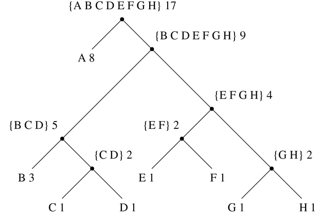

图 2.18：一棵霍夫曼编码树。

给定一个霍夫曼树，我们可以从根开始找到任何符号的编码，并向下移动，直到到达保存该符号的叶子。每次我们向下移动一个左分支，我们给代码加一个 0，每次向下移动一个右分支，我们加一个 1。(我们通过测试看哪个分支是符号的叶节点或者在它的集合中包含符号来决定跟随哪个分支。)例如，从图 2.18：中的树根开始，我们沿着一个右分支，然后一个左分支，然后一个右分支，然后一个右分支，到达 D 的叶子；因此，D 的代码是 1011。

为了使用霍夫曼树解码位序列，我们从根开始，并使用位序列的连续 0 和 1 来确定是向下移动左分支还是右分支。每当我们来到一片树叶，我们就在信息中生成一个新的符号，此时我们从树根开始寻找下一个符号。例如，假设我们得到了上面的树和序列 10001010。从根开始，我们向下移动右分支(因为字符串的第一位是 1)，然后向下移动左分支(因为第二位是 0)，然后向下移动左分支(因为第三位也是 0)。这将我们带到 B 的叶子，所以解码消息的第一个符号是 B。现在我们从根开始，我们向左移动，因为字符串中的下一位是 0。这将我们带到 a 的叶子。然后，我们用字符串 1010 的剩余部分再次从根开始，所以我们向右、向左、向右、向左移动并到达 c。因此，整个消息是 BAC。

##### 生成霍夫曼树

给定一个符号“字母表”及其相对频率，我们如何构造“最佳”代码？(换句话说，哪棵树会用最少的比特来编码消息？)Huffman 给出了这样做的算法，并表明在符号的相对频率与构造代码的频率相匹配的情况下，得到的代码确实是消息的最佳变长代码。这里我们将不证明霍夫曼码的这种最优性，但是我们将展示霍夫曼树是如何构造的。 [^(38)](#c2-fn-0038)

生成霍夫曼树的算法非常简单。这个想法是排列树，使出现频率最低的符号出现在离根最远的地方。从包含符号及其频率的叶节点集开始，这些符号及其频率由构造代码的初始数据确定。现在找到两个权重最低的叶子，将它们合并产生一个节点，将这两个节点作为其左右分支。新节点的权重是两个权重的和。从原始集合中移除两个叶子，并用这个新节点替换它们。现在继续这个过程。在每一步，合并两个权重最小的节点，将它们从集合中移除，并用一个以这两个节点作为其左右分支的节点来替换它们。当只剩下一个节点，即整个树的根节点时，该过程停止。下面是图 2.18 中[的霍夫曼树是如何生成的:](#c2-fig-0028)

| 初始叶 | {(A8)(B3)(C1)(D1)(E1)(f1)(G1)(h1)} |
| 合并 | {(A8)(B3)({ C D } 2)(E1)(f1)(G1)(h1)} |
| 合并 | {(A8)(B3)({ C D } 2)({ E F } 2)(G1)(h1)} |
| 合并 | {(A8)(B3)({ C D } 2)({ E F } 2)({ G H } 2)} |
| 合并 | {(A 8) (B 3) ({C D} 2) ({E F G H} 4)} |
| 合并 | {(A 8) ({B C D} 5) ({E F G H} 4)} |
| 合并 | {(A 8) ({B C D E F G H} 9)} |
| 最终合并 | { { A B C D E F G H } 17)} |

该算法并不总是指定唯一的树，因为在每一步可能都没有唯一的最小权重节点。此外，两个节点被合并的顺序的选择(即，哪个将是右分支，哪个将是左分支)是任意的。

##### 表示霍夫曼树

在下面的练习中，我们将使用一个系统，该系统使用霍夫曼树对消息进行编码和解码，并根据上述算法生成霍夫曼树。我们将从讨论树是如何表现的开始。

树的叶子由一个由字符串`"leaf"`、叶子上的符号和权重组成的列表表示:

```js
function make_leaf(symbol, weight) {
    return list("leaf", symbol, weight);
}
function is_leaf(object) {
    return head(object) === "leaf";
}
function symbol_leaf(x) { return head(tail(x)); }
function weight_leaf(x) { return head(tail(tail(x))); }
```

一般的树会是一个字符串`"code_tree"`，一个左分支，一个右分支，一组符号，一个权重的列表。符号集将只是一个符号列表，而不是一些更复杂的集合表示。当我们通过合并两个节点来构建树时，我们获得作为节点权重之和的树的权重，以及作为节点的符号集的并集的符号集。由于我们的符号集被表示为列表，我们可以通过使用我们在 2.2.1 节中定义的`append`函数来形成并集:

```js
function make_code_tree(left, right) {
    return list("code_tree", left, right,
                append(symbols(left), symbols(right)),
                weight(left) + weight(right));
}
```

如果我们以这种方式生成一棵树，我们有以下选择器:

```js
function left_branch(tree) { return head(tail(tree)); }
function right_branch(tree) { return head(tail(tail(tree))); }
function symbols(tree) {
    return is_leaf(tree)
           ? list(symbol_leaf(tree))
           : head(tail(tail(tail(tree))));
}
function weight(tree) {
    return is_leaf(tree)
           ? weight_leaf(tree)
           : head(tail(tail(tail(tail(tree)))));
}
```

函数`symbols`和`weight`必须做一些稍微不同的事情，这取决于它们是用树叶还是用普通树来调用。这些是通用函数(可以处理多种数据的函数)的简单例子，我们将在 2.4 和 2.5 节中详细讨论。

##### 解码功能

下面的函数实现解码算法。它接受一个由 0 和 1 组成的列表，以及一棵霍夫曼树作为参数。

```js
function decode(bits, tree) {
    function decode_1(bits, current_branch) {
        if (is_null(bits)) {
            return null;
        } else {
            const next_branch = choose_branch(head(bits),
                                              current_branch);
            return is_leaf(next_branch)
                   ? pair(symbol_leaf(next_branch),
                          decode_1(tail(bits), tree))
                   : decode_1(tail(bits), next_branch);
        }
    }
    return decode_1(bits, tree);
}
function choose_branch(bit, branch) {
    return bit === 0
           ? left_branch(branch)
           : bit === 1
           ? right_branch(branch)
           : error(bit, "bad bit – choose_branch");
}
```

函数`decode_1`有两个参数:剩余位的列表和当前在树中的位置。它继续沿着树“向下”移动，根据列表中的下一位是 0 还是 1 来选择左分支或右分支。(这是通过功能`choose_branch`完成的。)当它到达一个叶子时，它通过将该叶子上的符号与解码消息的其余部分的结果邻接，从树根开始，将该符号作为消息中的下一个符号返回。请注意`choose_branch`最后一个子句中的错误检查，如果函数在输入数据中发现除了 0 或 1 之外的其他值，它会发出报错。

##### 加权元素集

在我们对树的表示中，每个非叶节点包含一组符号，我们将其表示为一个简单的列表。然而，上面讨论的树生成算法要求我们也处理树叶和树的集合，连续合并两个最小的项目。因为我们需要反复寻找集合中最小的项目，所以对这种集合使用有序表示是很方便的。

我们将把一组树叶和树表示为一个元素列表，按照权重递增的顺序排列。下面的`adjoin_set`构造集合的函数类似于练习 2.61 中描述的函数；但是，项目是根据它们的权重进行比较的，并且被添加到集合中的元素从来就不在集合中。

```js
function adjoin_set(x, set) {
    return is_null(set)
           ? list(x)
           : weight(x) < weight(head(set))
           ? pair(x, set)
           : pair(head(set), adjoin_set(x, tail(set)));
}
```

以下函数采用符号频率对列表，例如

```js
list(list("A", 4), list("B", 2), list("C", 1), list("D", 1))
```

并且构建初始有序树叶集，准备根据霍夫曼算法进行合并:

```js
function make_leaf_set(pairs) {
    if (is_null(pairs)) {
        return null;
    } else {
        const first_pair = head(pairs);
        return adjoin_set(
                   make_leaf(head(first_pair),        // symbol
                             head(tail(first_pair))), // frequency
                   make_leaf_set(tail(pairs)));
    }
}
```

##### 练习 2.67

声明编码树和示例消息:

```js
const sample_tree = make_code_tree(make_leaf("A", 4),
                                   make_code_tree(make_leaf("B", 2),
                                                  make_code_tree(
                                                      make_leaf("D", 1),
                                                      make_leaf("C", 1))));
const sample_message = list(0, 1, 1, 0, 0, 1, 0, 1, 0, 1, 1, 1, 0);
```

使用`decode`功能解码信息，并给出结果。

##### 练习 2.68

`encode`函数将一个消息和一个树作为参数，并生成给出编码消息的位列表。

```js
function encode(message, tree) {
    return is_null(message)
           ? null
           : append(encode_symbol(head(message), tree),
                    encode(tail(message), tree));
}
```

您必须编写的函数`encode_symbol`根据给定的树返回给定符号编码的位列表。你应该设计`encode_symbol`,这样如果符号根本不在树中，它就会发出错误信号。通过使用示例树对练习 2.67 中获得的结果进行编码来测试您的函数，并查看它是否与原始示例消息相同。

##### 练习 2.69

下面的函数将符号-频率对的列表(其中没有符号出现在多于一对中)作为其参数，并根据霍夫曼算法生成霍夫曼编码树。

```js
function generate_huffman_tree(pairs) {
    return successive_merge(make_leaf_set(pairs));
}
```

上面给出了将对列表转换成有序树叶集的函数`make_leaf_set`。使用`make_code_tree`编写函数`successive_merge`，连续合并集合中最小权重的元素，直到只剩下一个元素，这就是想要的霍夫曼树。(这个函数有点复杂，但并不复杂。如果你发现自己在设计一个复杂的函数，那么你几乎肯定是做错了。您可以充分利用我们使用有序集合表示这一事实。)

##### 练习 2.70

以下具有相关相对频率的八符号字母表被设计成有效地编码 20 世纪 50 年代摇滚歌曲的歌词。(注意,“字母表”的“符号”不必是单个字母。)

| A | 2 | 钠 | 16 |
| 繁荣 | 1 | 恒星时角 | 3 |
| 得到 | 2 | 叫喊声 | 9 |
| 工作 | 2 | 嚯 | 1 |

使用`generate_huffman_tree`(练习 2.69)生成相应的霍夫曼树，并使用`encode`(练习 2.68)对以下消息进行编码:

```js
Get a job
Sha na na na na na na na na
Get a job
Sha na na na na na na na na
Wah yip yip yip yip yip yip yip yip yip
Sha boom
```

编码需要多少位？如果我们对八符号字母表使用固定长度的代码，那么对这首歌进行编码所需的最小位数是多少？

##### 练习 2.71

假设我们有一个霍夫曼树，用于 n 个符号的字母表，并且这些符号的相对频率是 1，2，4，.。。，2n–1。画出 n =5 的树；对于 n =10。在这样的树中(对于一般的 n )需要多少位来编码最频繁的符号？最不常用的符号？

##### 练习 2.72

考虑你在练习 2.68 中设计的编码函数。编码一个符号所需的步骤数量的增长顺序是什么？确保包括在遇到的每个节点搜索符号列表所需的步骤数。总体上回答这个问题是困难的。考虑特殊情况，其中 n 符号的相对频率如练习 2.71 中所述，并给出编码字母表中最频繁和最不频繁符号所需步骤数的增长顺序(作为 n 的函数)。

## 2.4 抽象数据的多重表示

我们引入了数据抽象，这是一种结构化系统的方法，使得程序的大部分可以独立于实现程序所操作的数据对象的选择而被指定。例如，我们在 2.1.1 节中看到了如何根据计算机语言构造复合数据的基本机制，将设计使用有理数的程序的任务与实现有理数的任务分开。关键思想是建立一个抽象屏障——在本例中，是有理数的选择器和构造器(`make_rat`、`numer`、`denom`)——将有理数的使用方式与它们在列表结构方面的底层表示隔离开来。类似的抽象障碍将执行有理数运算的函数(`add_rat`、`sub_rat`、`mul_rat`和`div_rat`)的细节与使用有理数的“高级”函数隔离开来。最终程序的结构如图图 2.1：所示。

这些数据抽象障碍是控制复杂性的强大工具。通过隔离数据对象的底层表示，我们可以将设计一个大型程序的任务分成可以单独执行的更小的任务。但是这种数据抽象还不够强大，因为谈论数据对象的“底层表示”并不总是有意义的。

首先，一个数据对象可能有不止一种有用的表示，我们可能希望设计能够处理多种表示的系统。举个简单的例子，复数可能有两种几乎等价的表示方式:矩形形式(实部和虚部)和极坐标形式(幅度和角度)。有时矩形更合适，有时极坐标更合适。事实上，想象一个系统，其中复数以两种方式表示，并且操作复数的函数以任一种方式工作，这是完全合理的。

更重要的是，编程系统通常是由许多人长时间工作设计的，服从于随时间变化的需求。在这样的环境中，每个人都不可能事先就数据表示的选择达成一致。因此，除了将表示与使用隔离的数据抽象障碍之外，我们还需要将不同的设计选择相互隔离并允许不同的选择在单个程序中共存的抽象障碍。此外，由于大型程序通常是通过组合孤立设计的现有模块创建的，我们需要约定允许程序员将模块合并到更大的系统中，也就是说，不需要重新设计或重新实现这些模块。

在这一节中，我们将学习如何处理程序不同部分以不同方式表示的数据。这需要构造通用函数——可以对可能以多种方式表示的数据进行操作的函数。我们构建通用函数的主要技术将是根据具有类型标签的数据对象来工作，也就是说，数据对象包含关于如何处理它们的显式信息。我们还将讨论数据导向的编程，这是一个强大而方便的实现策略，用于用一般操作附加地组装系统。

我们从简单的复数例子开始。我们将看到类型标签和数据导向样式如何使我们能够为复数设计单独的矩形和极坐标表示，同时保持抽象“复数”数据对象的概念。我们将通过为复数(`add_complex`、`sub_complex`、`mul_complex`和`div_complex`)定义算术函数来实现这一点，这些函数使用通用选择器来访问复数的各个部分，而与数字的表示方式无关。产生的复数系统，如图 2.19 所示，包含两种不同的抽象障碍。“水平”抽象障碍与图 2.1 中的角色相同。它们将“高级”操作与“低级”表示隔离开来。此外，还有一个“垂直”障碍，让我们能够单独设计和安装替代的表现形式。

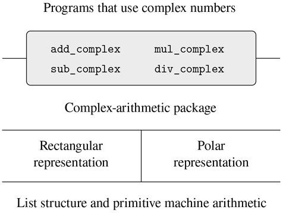

图 2.19：复数系统中的数据抽象障碍。

在 2.5 节中，我们将展示如何使用类型标签和数据导向风格来开发一个通用的算术包。这提供了一些函数(`add`、`mul`等等)，可以用来操作各种“数字”，并且在需要一种新的数字时可以很容易地扩展。在 2.5.3 节中，我们将展示如何在执行符号代数的系统中使用泛型算法。

### 2.4.1 复数的表示

我们将开发一个对复数执行算术运算的系统，作为一个使用一般运算的程序的简单但不现实的例子。我们首先讨论作为有序对的复数的两种貌似合理的表示:矩形形式(实部和虚部)和极坐标形式(幅度和角度)。第 2.4.2 节将展示如何通过使用类型标签和泛型操作使两种表示在一个系统中共存。

像有理数一样，复数自然表示为有序对。复数的集合可以被认为是具有两个正交轴的二维空间，即“实”轴和“虚”轴。(参见图 2.20： 。)从这个角度来看，复数 z=x+iy(其中 I²=–1)可以认为是平面中实坐标为 x ，虚坐标为 y 的点。在这种表示中，复数的相加简化为坐标的相加:

| 实部(z1+z2) | = | 实部(z1)+实部(z2) |
| 虚部(z1+z2) | = | 虚部(z1)+虚部(z2) |

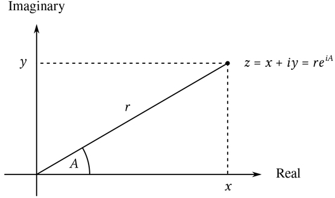

图 2.20：复数为平面上的点。

当复数相乘时，更自然的想法是用极坐标形式来表示复数，如幅度和角度( r 和 A 在图 2.20： )。两个复数的乘积是通过将一个复数拉伸另一个复数的长度，然后将其旋转另一个复数的角度而获得的向量:

| 星等(z1z2) | = | 量级(z1)量级(z2) |
| 角度(z1z2) | = | 角度(z1)+角度(z2) |

因此，复数有两种不同的表示法，适用于不同的运算。然而，从编写使用复数的程序的人的角度来看，数据抽象的原则表明，不管计算机使用哪种表示法，处理复数的所有操作都应该是可用的。例如，能够找到由直角坐标指定的复数的幅度通常是有用的。类似地，能够确定由极坐标指定的复数的实部通常是有用的。

为了设计这样一个系统，我们可以遵循我们在 2.1.1 节中设计有理数包时所遵循的相同的数据抽象策略。假设对复数的运算是通过四个选择器来实现的:`real_part`、`imag_part`、`magnitude`和`angle`。还假设我们有两个构造复数的函数:`make_from_real_imag`返回指定实部和虚部的复数，`make_from_mag_ang`返回指定幅度和角度的复数。这些函数具有这样的性质，对于任何复数`z`，两者都

```js
make_from_real_imag(real_part(z), imag_part(z));
```

和

```js
make_from_mag_ang(magnitude(z), angle(z));
```

产生等于`z`的复数。

使用这些构造函数和选择器，我们可以使用构造函数和选择器指定的“抽象数据”来实现复数上的算术，就像我们在 2.1.1 节中对有理数所做的那样。如上述公式所示，我们可以根据实部和虚部对复数进行加减运算，同时根据幅度和角度对复数进行乘除运算:

```js
function add_complex(z1, z2) {
    return make_from_real_imag(real_part(z1) + real_part(z2),
                               imag_part(z1) + imag_part(z2));
}
function sub_complex(z1, z2) {
    return make_from_real_imag(real_part(z1) - real_part(z2),
                               imag_part(z1) - imag_part(z2));
}
function mul_complex(z1, z2) {
    return make_from_mag_ang(magnitude(z1) * magnitude(z2),
                             angle(z1) + angle(z2));
}
function div_complex(z1, z2) {
    return make_from_mag_ang(magnitude(z1) / magnitude(z2),
                             angle(z1) - angle(z2));
}
```

为了完成复数包，我们必须选择一种表示，并且我们必须根据原始数字和原始列表结构来实现构造器和选择器。有两种明显的方法可以做到这一点:我们可以将一个复数以“矩形形式”表示为一对(实部、虚部)，或者以“极坐标形式”表示为一对(幅度、角度)。我们应该选择哪一个？

为了使不同的选择具体化，想象有两个程序员，Ben Bitdiddle 和 Alyssa P. Hacker，他们独立地设计复数系统的表示。Ben 选择用矩形来表示复数。有了这个选择，选择一个复数的实部和虚部就简单了，就像用给定的实部和虚部构造一个复数一样。为了找到幅度和角度，或者用给定的幅度和角度构造一个复数，他使用了三角关系

| x = r cos A | r = 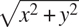 |
| y=rsinA | A = arctan( y ， x ) |

其将实部和虚部( x 、 y )与幅度和角度( r 、 A )相关联。因此，本的表示由以下选择器和构造器给出:

```js
function real_part(z) { return head(z); }
function imag_part(z) { return tail(z); }
function magnitude(z) {
    return math_sqrt(square(real_part(z)) + square(imag_part(z)));
}
function angle(z) {
    return math_atan2(imag_part(z), real_part(z));
}
function make_from_real_imag(x, y) { return pair(x, y); }

function make_from_mag_ang(r, a) {
    return pair(r * math_cos(a), r * math_sin(a));
}
```

相比之下，Alyssa 选择用极坐标形式表示复数。对她来说，选择幅度和角度很简单，但她必须使用三角关系来获得实部和虚部。艾丽莎的表述是:

```js
function real_part(z) {
    return magnitude(z) * math_cos(angle(z));
}
function imag_part(z) {
    return magnitude(z) * math_sin(angle(z));
}
function magnitude(z) { return head(z); }
function angle(z) { return tail(z); }
function make_from_real_imag(x, y) {
    return pair(math_sqrt(square(x) + square(y)),
                math_atan2(y, x));
}
function make_from_mag_ang(r, a) { return pair(r, a); }
```

数据抽象的原则确保了`add_ complex`、`sub_complex`、`mul_complex`和`div_complex`的相同实现将与本的表示或艾丽莎的表示一起工作。

### 2.4.2 标记数据

看待数据抽象的一种方式是“最小承诺原则”的应用在实现 2.4.1 节中的复数系统时，我们可以使用本的直角坐标表示法或阿丽莎的极坐标表示法。由选择器和构造器形成的抽象障碍允许我们将数据对象的具体表示的选择推迟到最后一刻，从而在我们的系统设计中保持最大的灵活性。

最小承诺原则甚至可以延伸到更极端的情况。如果我们愿意，我们甚至可以在设计完选择器和构造函数后保持表示的模糊性，并选择使用 Ben 的表示和 Alyssa 的表示。但是，如果两种表示都包含在一个系统中，我们将需要某种方法来区分极坐标形式的数据和矩形形式的数据。否则，例如，如果我们被要求找出(3，4)对中的`magnitude`，我们将不知道是回答 5(以矩形形式解释数字)还是 3(以极坐标形式解释数字)。实现这种区分的一个简单方法是包含一个类型标签——字符串`"rectangular"`或`"polar"`——作为每个复数的一部分。然后，当我们需要操作一个复数时，我们可以使用标签来决定应用哪个选择器。

为了操作带标签的数据，我们将假设我们有函数`type_tag`和`contents`，它们从数据对象中提取标签和实际内容(在复数的情况下，是极坐标或直角坐标)。我们还将假设一个函数`attach_tag`，它接受一个标签和内容，并产生一个带标签的数据对象。实现这一点的直接方法是使用普通的列表结构:

```js
function attach_tag(type_tag, contents) {
    return pair(type_tag, contents);
}
function type_tag(datum) {
    return is_pair(datum)
           ? head(datum)
           : error(datum, "bad tagged datum – type_tag");
}
function contents(datum) {
    return is_pair(datum)
           ? tail(datum)
           : error(datum, "bad tagged datum – contents");
}
```

使用`type_tag`，我们可以定义谓词`is_rectangular`和`is_polar`，它们分别识别矩形和极性数字:

```js
function is_rectangular(z) {
    return type_tag(z) === "rectangular";
}
function is_polar(z) {
    return type_tag(z) === "polar";
}
```

有了类型标签，Ben 和 Alyssa 现在可以修改他们的代码，这样他们的两种不同的表示就可以在同一个系统中共存。每当本构造一个复数时，他都将其标记为矩形。每当艾丽莎构造一个复数时，她都将其标记为极坐标。此外，Ben 和 Alyssa 必须确保他们的函数名称不会冲突。一种方法是 Ben 在他的每个表示函数的名字后面加上后缀`rectangular`，Alyssa 在她的名字后面加上`polar`。这是本在第 2.4.1 节中修改过的矩形表示法:

```js
function real_part_rectangular(z) { return head(z); }
function imag_part_rectangular(z) { return tail(z); }
function magnitude_rectangular(z) {
    return math_sqrt(square(real_part_rectangular(z)) +
                     square(imag_part_rectangular(z)));
}
function angle_rectangular(z) {
    return math_atan(imag_part_rectangular(z),
                     real_part_rectangular(z));
}
function make_from_real_imag_rectangular(x, y) {
    return attach_tag("rectangular", pair(x, y));
}
function make_from_mag_ang_rectangular(r, a) {
    return attach_tag("rectangular",
                      pair(r * math_cos(a), r * math_sin(a)));
}
```

这是艾丽莎修改后的极坐标图:

```js
function real_part_polar(z) {
    return magnitude_polar(z) * math_cos(angle_polar(z));
}
function imag_part_polar(z) {
    return magnitude_polar(z) * math_sin(angle_polar(z));
}
function magnitude_polar(z) { return head(z); }
function angle_polar(z) { return tail(z); }
function make_from_real_imag_polar(x, y) {
    return attach_tag("polar",
                      pair(math_sqrt(square(x) + square(y)),
                           math_atan(y, x)));
}
function make_from_mag_ang_polar(r, a) {
    return attach_tag("polar", pair(r, a));
}
```

每个泛型选择器都被实现为一个函数，该函数检查其参数的标签，并调用适当的函数来处理该类型的数据。例如，为了获得一个复数的实部，`real_part`检查标签以确定是使用 Ben 的`real_part_rectangular`还是 Alyssa 的`real_ part_polar`。在任一情况下，我们使用`contents`提取裸露的、未标记的数据，并根据需要将其发送至矩形或极坐标函数:

```js
function real_part(z) {
    return is_rectangular(z)
           ? real_part_rectangular(contents(z))
           : is_polar(z)
           ? real_part_polar(contents(z))
           : error(z, "unknown type – real_part");
}
function imag_part(z) {
    return is_rectangular(z)
           ? imag_part_rectangular(contents(z))
           : is_polar(z)
           ? imag_part_polar(contents(z))
           : error(z, "unknown type – imag_part");
}
function magnitude(z) {
    return is_rectangular(z)
           ? magnitude_rectangular(contents(z))
           : is_polar(z)
           ? magnitude_polar(contents(z))
           : error(z, "unknown type – magnitude");
}
function angle(z) {
    return is_rectangular(z)
           ? angle_rectangular(contents(z))
           : is_polar(z)
           ? angle_polar(contents(z))
           : error(z, "unknown type – angle");
}
```

为了实现复数算术运算，我们可以使用 2.4.1 节中的相同函数`add_complex`、`sub_complex`、`mul_complex`和`div_complex`，因为它们调用的选择器是通用的，因此可以使用任何一种表示。比如功能`add_complex`还是

```js
function add_complex(z1, z2) {
    return make_from_real_imag(real_part(z1) + real_part(z2),
                               imag_part(z1) + imag_part(z2));
}
```

最后，我们必须选择是用 Ben 的表示法还是 Alyssa 的表示法来构造复数。一个合理的选择是每当我们有实部和虚部时就构造矩形数，每当我们有幅度和角度时就构造极坐标:

```js
function make_from_real_imag(x, y) {
    return make_from_real_imag_rectangular(x, y);
}
function make_from_mag_ang(r, a) {
    return make_from_mag_ang_polar(r, a);
}
```

由此产生的复数系统具有图 2.21 所示的结构。该系统被分解为三个相对独立的部分:复数算术运算、Alyssa 的极坐标实现和 Ben 的直角坐标实现。极坐标和矩形实现可能是由 Ben 和 Alyssa 分别编写的，这两种实现都可以被第三个程序员用作底层表示，以抽象构造器/选择器接口的形式实现复数运算函数。

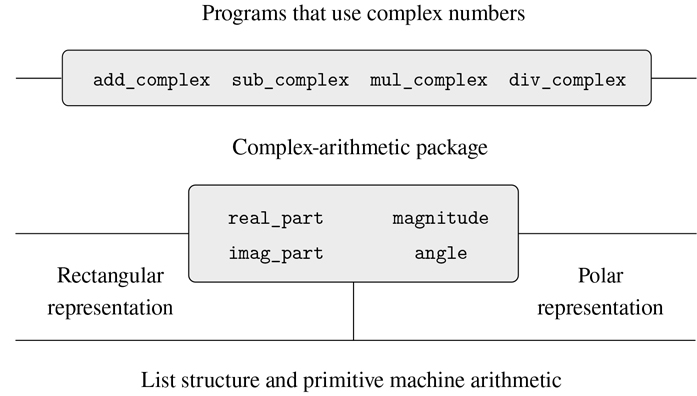

图 2.21：通用复数运算系统的结构。

因为每个数据对象都用它的类型来标记，所以选择器以通用的方式对数据进行操作。也就是说，每个选择器被定义为具有依赖于它所应用的特定数据类型的行为。请注意连接不同表示的一般机制:在给定的表示实现中(比如 Alyssa 的极坐标包)，复数是一个无类型对(幅度、角度)。当一个通用选择器对多个`polar`类型进行操作时，它会去掉标签并将内容传递给 Alyssa 的代码。相反，当 Alyssa 构造一个通用的数字时，她用一个类型来标记它，以便它可以被更高级别的函数正确地识别。正如我们将在 2.5 节中看到的，当数据对象从一级传递到另一级时，这种剥离和附加标签的原则是一种重要的组织策略。

### 2.4.3 数据导向编程和可加性

检查数据类型并调用适当函数的一般策略被称为对类型的调度。这是在系统设计中获得模块化的有力策略。另一方面，如 2.4.2 节中那样实现分派有两个明显的弱点。一个缺点是通用接口函数(`real_part`、`imag_part`、`magnitude`和`angle`)必须知道所有不同的表示。例如，假设我们想要将一种新的复数表示合并到我们的复数系统中。我们需要用一个类型来标识这个新的表示，然后向每个通用接口函数添加一个子句来检查新的类型，并为该表示应用适当的选择器。

这种技术的另一个弱点是，即使单独的表示可以单独设计，我们也必须保证整个系统中没有两个函数同名。这就是为什么 Ben 和 Alyssa 不得不从第 2.4.1 节中更改他们原始函数的名称。

这两个弱点背后的问题是实现通用接口的技术不是附加的。实现通用选择器函数的人必须在每次安装新的表示时修改这些函数，与各个表示接口的人必须修改他们的代码以避免名称冲突。在每一种情况下，必须对代码进行的更改都是简单明了的，但它们仍然必须进行，这是不方便和错误的来源。这对于目前的复数系统来说不是什么大问题，但是假设复数有数百种不同的表示，而不是两种。假设在抽象数据接口中有许多通用选择器需要维护。事实上，假设没有一个程序员知道所有的接口函数或所有的表示。这个问题是真实的，必须在大型数据库管理系统这样的程序中解决。

我们需要的是进一步模块化系统设计的方法。这是由称为数据导向编程的编程技术提供的。要理解数据导向编程是如何工作的，首先要观察到，每当我们处理一组不同类型的通用操作时，我们实际上是在处理一个二维表，该表包含一个轴上的可能操作和另一个轴上的可能类型。表中的条目是为每种类型的参数实现每个操作的函数。在上一节开发的复数系统中，操作名、数据类型和实际函数之间的对应分布在通用接口函数的各种条件子句中。但是同样的信息也可以组织成表格，如图 2.22 所示。

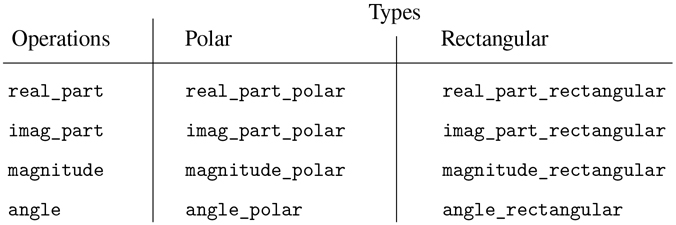

图 2.22：复数系统运算表。

数据导向编程是一种设计程序直接使用这种表的技术。之前，我们实现了将复数算术代码与两个表示包作为一组函数进行接口的机制，每个函数对类型执行显式调度。这里，我们将把接口实现为一个函数，它在表中查找操作名和参数类型的组合，以找到要应用的正确函数，然后将它应用于参数的内容。如果我们这样做了，那么为了向系统添加新的表示包，我们不需要改变任何现有的功能；我们只需要向表中添加新的条目。

为了实现这个计划，假设我们有两个函数`put`和`get`，用于操作操作和类型表:

*   `put(`op`,` type`,` item`)`

    将项目安装在表格中，由操作和类型索引。

*   `get(`op`,` type`)`

    在表格中查找 op ， type 条目并返回在那里找到的条目。如果没有找到条目，`get`返回一个惟一的原始值，这个值由名称`undefined`引用，并由原始谓词`is_undefined`识别。 [^(41)](#c2-fn-0041)

现在，我们可以假设`put`和`get`包含在我们的语言中。在第 3 章(第 3.3.3 节)中，我们将看到如何实现这些和其他操作来操纵表。

下面是如何在复数系统中使用数据导向编程。开发了矩形表示的 Ben 实现了他的代码，就像他最初做的那样。他定义了一个函数集合或一个包，并通过向表中添加条目来告诉系统如何对矩形数字进行操作，从而将这些函数连接到系统的其余部分。这是通过调用以下函数来实现的:

```js
function install_rectangular_package() {
    // internal functions
    function real_part(z) { return head(z); }
    function imag_part(z) { return tail(z); }
    function make_from_real_imag(x, y) { return pair(x, y); }
    function magnitude(z) {
        return math_sqrt(square(real_part(z)) + square(imag_part(z)));
    }
    function angle(z) {
        return math_atan(imag_part(z), real_part(z));
    }
    function make_from_mag_ang(r, a) {
        return pair(r * math_cos(a), r * math_sin(a));
    }

    // interface to the rest of the system
    function tag(x) { return attach_tag("rectangular", x); }
    put("real_part", list("rectangular"), real_part);
    put("imag_part", list("rectangular"), imag_part);
    put("magnitude", list("rectangular"), magnitude);
    put("angle", list("rectangular"), angle);
    put("make_from_real_imag", "rectangular",
        (x, y) => tag(make_from_real_imag(x, y)));
    put("make_from_mag_ang", "rectangular",
        (r, a) => tag(make_from_mag_ang(r, a)));
    return "done";
}
```

请注意，这里的内部函数与本在独立工作时编写的第 2.4.1 节中的函数相同。为了将它们连接到系统的其余部分，不需要进行任何改变。此外，由于这些函数声明在安装函数内部，Ben 不必担心与矩形包外部的其他函数发生名称冲突。为了将这些接口到系统的其余部分，Ben 在操作名`real_part`和类型`list("rectangular")`下安装了他的`real_part`函数，对于其他选择器也是如此。 [^(42)](#c2-fn-0042) 该接口还定义了外部系统要使用的构造函数。 [^(43)](#c2-fn-0043) 这些与 Ben 内部定义的构造函数相同，除了它们附加了标签。

Alyssa 的 polar 包与之类似:

```js
function install_polar_package() {
    // internal functions
    function magnitude(z) { return head(z); }
    function angle(z) { return tail(z); }
    function make_from_mag_ang(r, a) { return pair(r, a); }
    function real_part(z) {
        return magnitude(z) * math_cos(angle(z));
    }
    function imag_part(z) {
        return magnitude(z) * math_sin(angle(z));
    }
    function make_from_real_imag(x, y) {
        return pair(math_sqrt(square(x) + square(y)),
                    math_atan(y, x));
    }    

    // interface to the rest of the system
    function tag(x) { return attach_tag("polar", x); }
    put("real_part", list("polar"), real_part);
    put("imag_part", list("polar"), imag_part);
    put("magnitude", list("polar"), magnitude);
    put("angle", list("polar"), angle);
    put("make_from_real_imag", "polar",
        (x, y) => tag(make_from_real_imag(x, y)));
    put("make_from_mag_ang", "polar",
        (r, a) => tag(make_from_mag_ang(r, a)));
    return "done";
}
```

尽管 Ben 和 Alyssa 都仍然使用他们的原始函数，并使用彼此相同的名称(例如`real_part`)，但是这些声明现在是不同函数的内部声明(参见 1.1.8 节)，因此不存在名称冲突。

复数算术选择器通过一个名为`apply_generic`的通用“操作”函数来访问表，该函数对一些参数应用通用操作。函数`apply_generic`在操作名称和参数类型下的表中查找，并应用结果函数(如果存在): [^(44)](#c2-fn-0044)

```js
function apply_generic(op, args) {
    const type_tags = map(type_tag, args);
    const fun = get(op, type_tags);
    return ! is_undefined(fun)
           ? apply_in_underlying_javascript(fun, map(contents, args))
           : error(list(op, type_tags),
                   "no method for these types – apply_generic");
}
```

使用`apply_generic`，我们可以如下定义我们的通用选择器:

```js
function real_part(z) { return apply_generic("real_part", list(z)); }
function imag_part(z) { return apply_generic("imag_part", list(z)); }
function magnitude(z) { return apply_generic("magnitude", list(z)); }
function angle(z)     { return apply_generic("angle", list(z));     }
```

注意，如果向系统中添加新的表示，这些根本不会改变。

我们还可以从表中提取构造函数，这些构造函数将被包外部的程序用来从实部和虚部以及幅度和角度生成复数。如 2.4.2 节所述，只要有实部和虚部，我们就构造矩形数，只要有幅度和角度，我们就构造极坐标:

```js
function make_from_real_imag(x, y) {
    return get("make_from_real_imag", "rectangular")(x, y);
}
function make_from_mag_ang(r, a) {
    return get("make_from_mag_ang", "polar")(r, a);
}
```

##### 练习 2.73

第 2.3.2 节描述了一个执行符号微分的程序:

```js
function deriv(exp, variable) {
    return is_number(exp)
           ? 0
           : is_variable(exp)
           ? is_same_variable(exp, variable) ? 1 : 0
           : is_sum(exp)
           ? make_sum(deriv(addend(exp), variable),
                      deriv(augend(exp), variable))
           : is_product(exp)
           ? make_sum(make_product(multiplier(exp),
                                   deriv(multiplicand(exp), variable)),
                      make_product(deriv(multiplier(exp), variable),
                                   multiplicand(exp)))
           // more rules can be added here
           : error(exp, "unknown expression type – deriv");
}
deriv(list("*", list("*", "x", "y"), list("+", "x", 4)), "x");
list("+", list("*", list("*", x, y), list("+", 1, 0)),
          list("*", list("+", list("*", x, 0), list("*", 1, y)),
                    list("+", x, 4)))
```

我们可以把这个程序看作是对要区分的表达式类型执行调度。在这种情况下，数据的“类型标签”是代数运算符符号(如“+”)，正在执行的操作是`deriv`。我们可以通过将基本的导数函数重写为

```js
function deriv(exp, variable) {
    return is_number(exp)
           ? 0
           : is_variable(exp)
           ? is_same_variable(exp, variable) ? 1 : 0
           : get("deriv", operator(exp))(operands(exp), variable);
}
function operator(exp) { return head(exp); }
function operands(exp) { return tail(exp); }
```

1.  解释上面做了什么。为什么我们不能将谓词`is_number`和`is_variable`吸收到数据导向的分派中？
2.  b. 在上面程序使用的表中写出和与积的导数的函数，以及安装它们所需的辅助代码。
3.  c. 选择你喜欢的任何附加微分规则，例如指数的微分规则(练习 2.56)，并将其安装在这个数据导向系统中。
4.  d. In this simple algebraic manipulator the type of an expression is the algebraic operator that binds it together. Suppose, however, we indexed the functions in the opposite way, so that the dispatch line in `deriv` looked like

    ```js
    get(operator(exp), "deriv")(operands(exp), variable);
    ```

    衍生系统需要做哪些相应的改变？

##### 练习 2.74

贪得无厌企业有限公司是一家高度分散的集团公司，由遍布世界各地的大量独立部门组成。该公司的计算机设备刚刚通过一种巧妙的网络接口方案相互连接起来，使整个网络对任何用户来说都像是一台计算机。贪得无厌的总裁第一次尝试利用网络的能力从部门文件中提取管理信息，她沮丧地发现，尽管所有部门文件都以 JavaScript 的数据结构实现，但不同部门使用的特定数据结构各不相同。匆忙召开了一次各司管理人员会议，以寻求一种战略来整合档案，既满足总部的需要，又保持各司现有的自主权。

展示如何用数据导向编程实现这样的策略。例如，假设每个部门的人事记录由一个文件组成，该文件包含一组以雇员姓名为关键字的记录。集合的结构因部门而异。此外，每个员工的记录本身就是一个集合(每个部门的结构不同)，其中包含以标识符为关键字的信息，如`address`和`salary`。特别是:

1.  a. 为总部实现一个`get_record`功能，从指定的人事档案中检索指定员工的记录。该功能应适用于任何部门的文件。解释各个部门的文件应该如何组织。特别是，必须提供什么类型的信息？
2.  b. 为总部实现一个`get_salary`函数，该函数从任何部门的人事档案中返回给定员工的工资信息。为了使这种操作有效，应该如何构造记录？
3.  c. 为总部实现一个`find_employee_record`功能。这将在所有部门的文件中搜索给定雇员的记录，并返回记录。假设这个函数将雇员的姓名和所有部门的文件列表作为参数。
4.  d. 当贪得无厌接手一家新公司，为了将新的人事信息纳入中央系统，必须做哪些改变？

##### 信息传递

数据导向编程的关键思想是通过显式处理操作和类型表来处理程序中的一般操作，例如图 2.22 中的表。我们在 2.4.2 节中使用的编程风格通过让每个操作负责自己的分派来组织类型上所需的分派。实际上，这将操作和类型表分解成行，每个通用操作函数代表表中的一行。

另一种实现策略是将表分解成列，而不是使用调度数据类型的“智能操作”，而是使用调度操作名称的“智能数据对象”。我们可以通过这样的方式来实现这一点:将一个数据对象(比如一个矩形数字)表示为一个函数，该函数将所需的操作名称作为输入，并执行指定的操作。在这样的规程中，`make_from_real_imag`可以写成

```js
function make_from_real_imag(x, y) {
    function dispatch(op) {
        return op === "real_part"
               ? x
               : op === "imag_part"
               ? y
               : op === "magnitude"
               ? math_sqrt(square(x) + square(y))
               : op === "angle"
               ? math_atan(y, x)
               : error(op, "unknown op – make_from_real_imag");
    }
    return dispatch;
}
```

相应的`apply_generic`函数将一个通用操作应用于一个参数，现在只需将操作的名称提供给数据对象，并让该对象完成这项工作: [^(45)](#c2-fn-0045)

```js
function apply_generic(op, arg) { return head(arg)(op); }
```

注意，`make_from_real_imag`返回的值是一个函数——内部的`dispatch`函数。这是当`apply_generic`请求执行操作时调用的函数。

这种编程风格被称为消息传递。该名称来源于这样一个形象，即数据对象是一个实体，它将请求的操作名称作为“消息”接收我们已经在第 2.1.3 节中看到了一个消息传递的例子，在那里我们看到了如何定义`pair`、`head`和`tail`，没有数据对象，只有函数。在这里，我们看到消息传递不是一种数学技巧，而是一种用一般操作组织系统的有用技术。在本章的剩余部分，我们将继续使用面向数据的编程，而不是消息传递，来讨论一般的算术运算。在第三章中，我们将回到消息传递，我们将看到它是构造模拟程序的一个强有力的工具。

##### 练习 2.75

以消息传递的方式实现构造函数`make_from_mag_ang`。该功能应类似于上面给出的`make_from_real_imag`功能。

##### 练习 2.76

随着具有通用操作的大型系统的发展，可能需要新类型的数据对象或新操作。对于三种策略中的每一种——具有显式分派的通用操作、数据导向风格和消息传递风格——描述为了添加新类型或新操作而必须对系统进行的更改。哪个组织最适合经常添加新类型的系统？对于必须经常添加新操作的系统，哪种方法最合适？

## 2.5 具有通用操作的系统

在上一节中，我们看到了如何设计可以用多种方式表示数据对象的系统。关键思想是通过通用接口函数将指定数据操作的代码与几种表示联系起来。现在，我们将看到如何使用同样的思想，不仅定义在不同表示上通用的操作，而且定义在不同类型的参数上通用的操作。我们已经看到了几个不同的算术运算包:内置于我们语言中的原始算术(`+`、`-`、`*`、`/`)、2.1.1 节中的有理数算术(`add_rat`、`sub_rat`、`mul_rat`、`div_rat`)以及我们在 2.4.3 节中实现的复数算术。我们现在将使用数据导向技术构建一个算术运算包，它包含了我们已经构建的所有算术运算包。

图 2.23：显示了我们将要构建的系统的结构。注意抽象障碍。从使用“数字”的人的角度来看，有一个函数`add`可以处理提供的任何数字。函数`add`是一个通用接口的一部分，它允许使用数字的程序统一访问独立的普通算术、有理算术和复杂算术包。任何单个算术包(如复杂包)本身都可以通过通用函数(如`add_complex`)访问，这些函数组合了为不同表示(如矩形和极坐标)设计的包。此外，该系统的结构是可加的，因此人们可以分别设计单独的算术包，然后将它们组合起来，形成一个通用的算术系统。

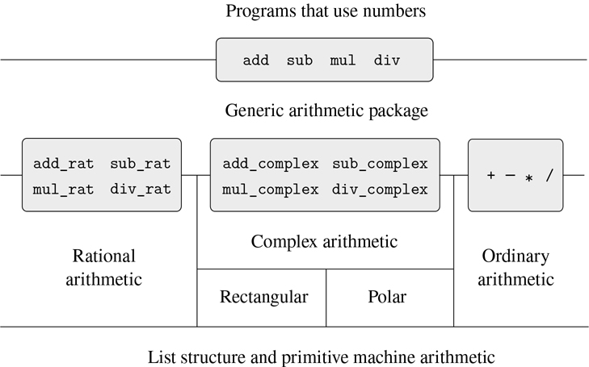

图 2.23：通用算术系统。

### 2.5.1 通用算术运算

设计通用算术运算的任务类似于设计通用复数运算的任务。例如，我们希望有一个普通的加法函数`add`,它像普通的原始加法函数`+`一样作用于普通的数字，像有理数函数`add_rat`一样作用于复数函数`add_complex`。通过遵循我们在 2.4.3 节中使用的相同策略来实现复数的通用选择器，我们可以实现`add`和其他通用算术运算。我们将为每种数字附加一个类型标签，并根据其参数的数据类型将通用函数分派到一个适当的包中。

通用算术函数定义如下:

```js
function add(x, y) { return apply_generic("add", list(x, y)); }
function sub(x, y) { return apply_generic("sub", list(x, y)); }
function mul(x, y) { return apply_generic("mul", list(x, y)); }
function div(x, y) { return apply_generic("div", list(x, y)); }
```

我们首先安装一个处理普通数字的包，也就是我们语言的原始数字。我们用字符串`"javascript_number"`标记这些。这个包中的算术运算是基本的算术函数(因此不需要定义额外的函数来处理未标记的数字)。因为这些操作每个都有两个参数，所以它们被安装在由 list `list("javascript_number", "javascript_number")`键入的表中:

```js
function install_javascript_number_package() {
    function tag(x) {
        return attach_tag("javascript_number", x);
    }
    put("add", list("javascript_number", "javascript_number"),
        (x, y) => tag(x + y));
    put("sub", list("javascript_number", "javascript_number"),
        (x, y) => tag(x - y));
    put("mul", list("javascript_number", "javascript_number"),
        (x, y) => tag(x * y));
    put("div", list("javascript_number", "javascript_number"),
        (x, y) => tag(x / y));
    put("make", "javascript_number",
        x => tag(x));
    return "done";
}
```

JavaScript-number 软件包的用户将通过以下函数创建(带标签的)普通数字:

```js
function make_javascript_number(n) {
    return get("make", "javascript_number")(n);
}
```

既然通用算术系统的框架已经到位，我们可以很容易地包括新的数字类型。这是一个执行理性算术的包。注意，作为可加性的一个好处，我们可以不加修改地使用 2.1.1 节中的有理数代码作为包中的内部函数:

```js
function install_rational_package() {
    // internal functions
    function numer(x) { return head(x); }
    function denom(x) { return tail(x); }
    function make_rat(n, d) {
        const g = gcd(n, d);
        return pair(n / g, d / g);
    }
    function add_rat(x, y) {
        return make_rat(numer(x) * denom(y) + numer(y) * denom(x),
                        denom(x) * denom(y));
    }
    function sub_rat(x, y) {
        return make_rat(numer(x) * denom(y) - numer(y) * denom(x),
                        denom(x) * denom(y));
    }
    function mul_rat(x, y) {
        return make_rat(numer(x) * numer(y),
                        denom(x) * denom(y));
    }
    function div_rat(x, y) {
        return make_rat(numer(x) * denom(y),
                        denom(x) * numer(y));
    }
    // interface to rest of the system
    function tag(x) {
        return attach_tag("rational", x);
    }
    put("add", list("rational", "rational"),
        (x, y) => tag(add_rat(x, y)));
    put("sub", list("rational", "rational"),
        (x, y) => tag(sub_rat(x, y)));
    put("mul", list("rational", "rational"),
        (x, y) => tag(mul_rat(x, y)));
    put("div", list("rational", "rational"),
        (x, y) => tag(div_rat(x, y)));
    put("make", "rational",
        (n, d) => tag(make_rat(n, d)));
    return "done";
}

function make_rational(n, d) {
    return get("make", "rational")(n, d);
}
```

我们可以安装一个类似的包来处理复数，使用标签`"complex"`。在创建包的过程中，我们从表中提取出由矩形和极坐标包定义的操作`make_from_real_imag`和`make_from_mag_ang`。加法允许我们使用第 2.4.1 节中相同的`add_complex`、`sub_complex`、`mul_complex`和`div_complex`函数作为内部运算。

```js
function install_complex_package() {
    // imported functions from rectangular and polar packages
    function make_from_real_imag(x, y) {
        return get("make_from_real_imag", "rectangular")(x, y);
    }
    function make_from_mag_ang(r, a) {
        return get("make_from_mag_ang", "polar")(r, a);
    }
    // internal functions
    function add_complex(z1, z2) {
        return make_from_real_imag(real_part(z1) + real_part(z2),
                                   imag_part(z1) + imag_part(z2));
    }
    function sub_complex(z1, z2) {
        return make_from_real_imag(real_part(z1) - real_part(z2),
                                   imag_part(z1) - imag_part(z2));
    }
    function mul_complex(z1, z2) {
        return make_from_mag_ang(magnitude(z1) * magnitude(z2),
                                 angle(z1) + angle(z2));
    }
function div_complex(z1, z2) {
    return make_from_mag_ang(magnitude(z1) / magnitude(z2),
                                 angle(z1) - angle(z2));
    }
    // interface to rest of the system
    function tag(z) { return attach_tag("complex", z); }
    put("add", list("complex", "complex"),
        (z1, z2) => tag(add_complex(z1, z2)));
    put("sub", list("complex", "complex"),
        (z1, z2) => tag(sub_complex(z1, z2)));
    put("mul", list("complex", "complex"),
        (z1, z2) => tag(mul_complex(z1, z2)));
    put("div", list("complex", "complex"),
        (z1, z2) => tag(div_complex(z1, z2)));
    put("make_from_real_imag", "complex",
        (x, y) => tag(make_from_real_imag(x, y)));
    put("make_from_mag_ang", "complex",
        (r, a) => tag(make_from_mag_ang(r, a)));
    return "done";
}
```

复数包之外的程序可以从实部和虚部或者从幅度和角度构造复数。请注意，最初在矩形和极坐标包中定义的底层函数是如何被导出到复杂包中，并从那里导出到外部世界的。

```js
function make_complex_from_real_imag(x, y){
    return get("make_from_real_imag", "complex")(x, y);
}
function make_complex_from_mag_ang(r, a){
    return get("make_from_mag_ang", "complex")(r, a);
}
```

我们这里有一个两级标记系统。一个典型的复数，如矩形形式的 3 + 4 i ，将被表示为如图图 2.24：所示。外部标签(`"complex"`)用于将编号指向复合包装。一旦进入复杂包装，下一个标签(`"rectangular"`)用于将数字指向矩形包装。在一个大而复杂的系统中，可能有许多层次，每一层都通过一般操作与下一层连接。当数据对象被“向下”传递时，用于将它导向适当包的外部标签被剥离(通过应用`contents`)，下一层标签(如果有)变得可见，用于进一步的分派。

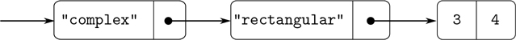

图 2.24：以矩形形式表示 3 + 4i。

在上面的包中，我们使用了`add_rat`、`add_complex`和其他算术函数，与最初编写的完全一样。然而，一旦这些声明是不同安装函数的内部声明，它们就不再需要彼此不同的名字:我们可以在两个包中简单地将它们命名为`add`、`sub`、`mul`和`div`。

##### 练习 2.77

Louis Reasoner 尝试对表达式`magnitude(z)`求值，其中`z`是图 2.24 中[所示的对象。令他惊讶的是，他得到的不是答案 5，而是来自`apply_generic`的错误消息，说没有对类型`list("complex")`进行操作`magnitude`的方法。他向 Alyssa P. Hacker 展示了这种交互，Hacker 说“问题是复数选择器从来不是为`"complex"`数定义的，只是为`"polar"`和`"rectangular"`数定义的。您所要做的就是将以下内容添加到`complex`包中:"](#c2-fig-0034)

```js
put("real_part", list("complex"), real_part);
put("imag_part", list("complex"), imag_part);
put("magnitude", list("complex"), magnitude);
put("angle",      list("complex"), angle);
```

请详细描述这种方法的工作原理。例如，跟踪评估表达式`magnitude(z)`时调用的所有函数，其中`z`是图[2.24](#c2-fig-0034)中显示的对象。特别是，`apply_generic`被调用了多少次？在每种情况下，分派给什么功能？

##### 练习 2.78

`javascript_number`包中的内部函数本质上只不过是对原函数`+`、`-`等的调用。不可能直接使用该语言的原语，因为我们的类型标记系统要求每个数据对象都有一个与之相关的类型。然而，事实上，所有的 JavaScript 实现都有一个类型系统，它们在内部使用。像`is_string`和`is_number`这样的基本谓词决定了数据对象是否有特定的类型。修改 2.4.2 节中的`type_tag`、`contents`和`attach_tag`的定义，以便我们的通用系统利用 JavaScript 的内部类型系统。也就是说，系统应该像以前一样工作，只是普通数字应该简单地表示为 JavaScript 数字，而不是表示为`head`是字符串`"javascript_number"`的数字对。

##### 练习 2.79

定义一个测试两个数相等的通用等式谓词`is_equal`，并将其安装在通用算术包中。这个操作应该适用于普通数字、有理数和复数。

##### 练习 2.80

定义一个测试其参数是否为零的通用谓词`is_equal_to_zero`，并将其安装在通用算术包中。这个操作应该适用于普通数字、有理数和复数。

### 2.5.2 合并不同类型的数据

我们已经看到了如何定义一个包含普通数字、复数、有理数以及我们可能决定发明的任何其他类型的数字的统一算术系统，但是我们忽略了一个重要的问题。到目前为止，我们定义的操作将不同的数据类型视为完全独立的。因此，有单独的软件包用于相加，比如说，两个普通的数，或者两个复数。我们还没有考虑的是，定义跨越类型边界的运算是有意义的，比如把一个复数加到一个普通数上。我们已经煞费苦心地在我们程序的各个部分之间引入障碍，这样它们就可以被分别开发和理解。我们希望以某种谨慎控制的方式引入跨类型操作，这样我们就可以在不严重违反我们的模块边界的情况下支持它们。

处理跨类型操作的一种方法是为操作有效的每种可能的类型组合设计不同的函数。例如，我们可以扩展复数包，使其提供将复数加到普通数上的功能，并使用标签`list("complex", "javascript_number")` : [^(46)](#c2-fn-0046) 将其安装到表中

```js
// to be included in the complex package
function add_complex_to_javascript_num(z, x) {
    return make_complex_from_real_imag(real_part(z) + x, imag_part(z));
}
put("add", list("complex", "javascript_number"),
    (z, x) => tag(add_complex_to_javascript_num(z, x)));
```

这种技术是可行的，但是很麻烦。使用这样的系统，引入新类型的成本不仅仅是构建该类型的功能包，还包括构建和安装实现跨类型操作的功能。这很容易比在类型本身上定义操作所需的代码多得多。这种方法也削弱了我们额外组合独立包的能力，或者至少限制了单个包的实现者需要考虑其他包的程度。例如，在上面的例子中，处理复数和普通数的混合运算应该是复数包的责任，这似乎是合理的。然而，组合有理数和复数可能由 complex 包、rational 包或使用从这两个包中提取的操作的第三方包来完成。在设计具有许多包和许多跨类型操作的系统时，为包之间的责任划分制定一致的策略可能是一项艰巨的任务。

##### 强迫

在完全不相关的操作作用于完全不相关的类型的一般情况下，实现显式的跨类型操作尽管可能很麻烦，但却是人们所能希望的最好结果。幸运的是，通过利用潜在于我们的类型系统中的额外结构，我们通常可以做得更好。通常，不同的数据类型并不是完全独立的，并且可能存在将一种类型的对象视为另一种类型的方法。这个过程叫做胁迫。例如，如果我们被要求将一个普通数与一个复数进行算术组合，我们可以将这个普通数视为一个虚数为零的复数。这将问题转化为组合两个复数的问题，这可以由复数算术包以普通方式处理。

一般来说，我们可以通过设计强制函数来实现这一思想，强制函数将一种类型的对象转换为另一种类型的等价对象。下面是一个典型的强制函数，它将给定的普通数转换为具有实部和零虚部的复数:

```js
function javascript_number_to_complex(n) {
    return make_complex_from_real_imag(contents(n), 0);
}
```

我们将这些强制函数安装在一个特殊的强制表中，在两种类型的名称下进行索引:

```js
put_coercion("javascript_number", "complex",
             javascript_number_to_complex);
```

(我们假设有`put_coercion`和`get_coercion`函数可用于操作这个表。)通常，表中的一些槽将是空的，因为通常不可能将每种类型的任意数据对象强制转换成所有其他类型。例如，没有办法将任意复数强制转换为普通数，因此表中不会包含一般的`complex_to_javascript_number`函数。

一旦强制表被建立，我们可以通过修改第 2.4.3 节的`apply_generic`函数以统一的方式处理强制。当要求应用一个操作时，我们首先检查操作是否是为参数的类型定义的，就像以前一样。如果是这样，我们将分派到 operation-andtype 表中找到的函数。否则，我们尝试强制。为简单起见，我们只考虑有两个自变量的情况。我们检查强制表，看看第一种类型的对象是否能被强制为第二种类型。如果是这样，我们强制第一个参数并再次尝试操作。如果第一种类型的对象通常不能被强制为第二种类型，我们可以反过来尝试强制，看看是否有办法将第二个参数强制为第一个参数的类型。最后，如果没有已知的方法将一种类型强制为另一种类型，我们就放弃。下面是函数:

```js
function apply_generic(op, args) {
    const type_tags = map(type_tag, args);
    const fun = get(op, type_tags);
    if (! is_undefined(fun)) {
        return apply(fun, map(contents, args));
    } else {
        if (length(args) === 2) {
            const type1 = head(type_tags);
            const type2 = head(tail(type_tags));
            const a1 = head(args);
            const a2 = head(tail(args));
            const t1_to_t2 = get_coercion(type1, type2);
            const t2_to_t1 = get_coercion(type2, type1);
            return ! is_undefined(t1_to_t2)
                   ? apply_generic(op, list(t1_to_t2(a1), a2))
                   : ! is_undefined(t2_to_t1)
                   ? apply_generic(op, list(a1, t2_to_t1(a2)))
                   : error(list(op, type_tags),
                           "no method for these types");
        } else {
            return error(list(op, type_tags),
                         "no method for these types");
        }
    }
}
```

如上所述，与定义显式跨类型操作的方法相比，这种强制方案有许多优点。尽管我们仍然需要编写强制函数来关联类型(对于具有 n 个类型的系统，可能需要 n2 个函数)，但我们只需要为每对类型编写一个函数，而不是为每个类型集合和每个泛型操作编写不同的函数。 [^(48)](#c2-fn-0048) 我们在这里指望的是这样一个事实:类型之间适当的转换只取决于类型本身，而不取决于要应用的操作。

另一方面，对于某些应用，我们的强制方案可能不够通用。即使当要组合的两个对象都不能转换成另一个的类型时，仍然可以通过将两个对象转换成第三种类型来执行操作。为了处理这种复杂性并保持程序的模块化，通常有必要构建利用类型间关系的进一步结构的系统，这将在下面讨论。

##### 类型的层次结构

上面介绍的强制方案依赖于类型对之间自然关系的存在。通常在不同类型之间的关系上有更多的“全局”结构。例如，假设我们正在构建一个通用的算术系统来处理整数、有理数、实数和复数。在这样一个系统中，把一个整数看成一种特殊的有理数是很自然的，这种有理数又是一种特殊的实数，而实数又是一种特殊的复数。我们实际拥有的是所谓的类型的层次结构，例如，整数是有理数的一个子类型(也就是说，任何可以应用于有理数的运算都可以自动应用于整数)。相反，我们说有理数形成了整数的一个超类型。这里我们有一个非常简单的层次结构，其中每个类型最多有一个超类型和一个子类型。这种结构称为塔，如图图 2.25：所示。

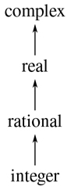

图 2.25：一座塔的类型。

如果我们有一个塔式结构，那么我们可以大大简化向层次结构中添加新类型的问题，因为我们只需要指定新类型如何嵌入到它上面的下一个超类型中，以及它如何成为它下面的超类型。例如，如果我们想把一个整数加到一个复数上，我们不需要显式定义一个特殊的强制函数`integer_to_complex`。而是定义整数如何转化为有理数，有理数如何转化为实数，实数如何转化为复数。然后，我们允许系统通过这些步骤将整数转换为复数，然后将两个复数相加。

我们可以按照以下方式重新设计我们的`apply_generic`函数:对于每种类型，我们需要提供一个`raise`函数，它将该类型的对象在塔中“提升”一级。然后，当系统需要对不同类型的物体进行操作时，它可以连续提升较低类型的物体，直到所有的物体在塔中处于相同的高度。(练习 2.83 和 2.84 涉及实施这种策略的细节。)

塔的另一个优点是，我们可以很容易地实现这样一个概念，即每个类型“继承”一个超类型上定义的所有操作。例如，如果我们不提供一个特殊的函数来寻找一个整数的实数部分，我们仍然应该期望`real_part`将被定义为整数，因为整数是复数的一个子类型。在一个塔中，我们可以通过修改`apply_generic`来安排这一切以统一的方式发生。如果没有为给定的对象类型直接定义所需的操作，我们将该对象提升到其父类型，然后重试。因此，我们沿着塔向上爬，一边爬一边改变我们的论点，直到我们找到一个可以执行所需操作的水平，或者到达顶部(在这种情况下，我们放弃)。

与更一般的层次结构相比，塔式结构的另一个优点是，它为我们提供了一种简单的方法来将数据对象“降低”到最简单的表示形式。例如，如果我们将 2 + 3 i 与 4–3I 相加，那么获得的答案应该是整数 6，而不是复数 6 + 0 i 。练习 2.85 讨论了实施这种下放操作的方法。(诀窍在于我们需要一个通用的方法来区分那些可以降低的对象，比如 6 + 0 i ，和那些不能降低的对象，比如 6 + 2 i 。)

##### 等级制度的不足

如我们所见，如果我们系统中的数据类型可以自然地排列在一个塔中，这就大大简化了处理不同类型上的一般操作的问题。不幸的是，通常情况并非如此。图 2.26：展示了一个更复杂的混合类型排列，这个显示了不同类型的几何图形之间的关系。我们看到，一般来说，一个类型可能有不止一个子类型。例如，三角形和四边形都是多边形的子类型。此外，一个类型可以有多个超类型。例如，等腰直角三角形可以被认为是等腰三角形或直角三角形。这个多重超类型的问题特别棘手，因为这意味着没有唯一的方法在层次结构中“提升”一个类型。找到“正确的”超类型，在其中对一个对象应用一个操作，可能需要在整个类型网络中对一个函数(如`apply_generic`)进行大量的搜索。因为一个类型通常有多个子类型，所以在类型层次结构中强制一个值“向下”也有类似的问题。在大型系统的设计中，处理大量相互关联的类型同时仍然保持模块性是非常困难的，这也是当前研究的一个领域。 [^(49)](#c2-fn-0049)

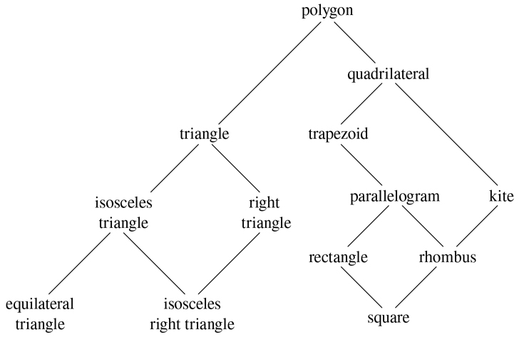

图 2.26：几何图形类型之间的关系。

##### 练习 2.81

Louis Reasoner 注意到`apply_generic`可能会试图将参数强制转换为彼此的类型，即使它们已经具有相同的类型。因此，他推断，我们需要将函数放入强制表中，将每种类型的参数“强制”为它们自己的类型。例如，除了上面所示的`javascript_number_to_complex`胁迫，他还会做:

```js
function javascript_number_to_javascript_number(n) { return n; }
function complex_to_complex(n) { return n; }
put_coercion("javascript_number", "javascript_number",
             javascript_number_to_javascript_number);
put_coercion("complex", "complex", complex_to_complex);
```

1.  a. With Louis's coercion functions installed, what happens if `apply_generic` is called with two arguments of type `"complex"` or two arguments of type `"javascript_ number"` for an operation that is not found in the table for those types? For example, assume that we've defined a generic exponentiation operation:

    ```js
    function exp(x, y) {
        return apply_generic("exp", list(x, y));
    }
    ```

    并且在 JavaScript-number 包中放置了一个求幂函数，但没有在任何其他包中放置:

    ```js
    // following added to JavaScript-number package
    put("exp", list("javascript_number", "javascript_number"),
        (x, y) => tag(math_exp(x, y))); // using primitive math_exp
    ```

    如果我们用两个复数作为参数调用`exp`会怎么样？

2.  路易斯关于必须对相同类型的争论采取某种措施的观点是正确的，还是,`apply_generic`照现在这样工作是正确的？
3.  修改`apply_generic`，这样如果两个参数具有相同的类型，它就不会尝试强制。

##### 练习 2.82

展示如何一般化`apply_generic`来处理多参数的一般情况下的强制。一种策略是尝试将所有参数强制转换为第一个参数的类型，然后转换为第二个参数的类型，依此类推。举例说明这种策略(以及上面给出的两个参数版本)不够通用的情况。(提示:考虑这样一种情况，表中有一些合适的混合类型的操作不会被尝试。)

##### 练习 2.83

假设你正在设计一个通用的算术系统来处理图 2.25 所示的类型:整数、有理数、实数、复数。对于每种类型(除了复杂的)，设计一个功能，将该类型的对象在塔中提升一级。展示如何安装一个通用的`raise`操作，它将适用于每一种类型(复杂类型除外)。

##### 练习 2.84

使用练习 2.83 的`raise`操作，修改`apply_generic`函数，使其通过连续提升的方法强制其参数具有相同的类型，如本节所述。您需要设计一种方法来测试两种类型中哪一种在塔中更高。以与系统的其余部分“兼容”的方式进行，并且不会导致在向塔添加新高度时出现问题。

##### 练习 2.85

本节提到了一种“简化”数据对象的方法，即尽可能降低数据对象的类型。为练习 2.83 中描述的塔设计一个功能`drop`来实现这个功能。关键是以某种通用的方式决定一个物体是否可以被降低。比如复数 1.5 + 0 i 可以降到`"real"`，复数 1 + 0 i 可以降到`"integer"`，复数 2 + 3 i 根本不能降。这里有一个决定一个物体是否可以降低的计划:首先定义一个通用的操作`project`，将一个物体“推”下塔中。例如，投影一个复数会涉及到扔掉虚部。然后，如果我们把一个数`project`它和`raise`结果返回到我们开始时的类型，我们得到的结果和开始时的相等，那么这个数就可以被丢弃。通过编写一个尽可能远地放下对象的`drop`函数，详细展示如何实现这个想法。您需要设计各种投影操作 [^(50)](#c2-fn-0050) 并在系统中安装`project`作为通用操作。你还需要利用一个通用的等式谓词，如练习 2.79 中所描述的。最后，使用`drop`重写练习 2.84 中的`apply_generic`，使其“简化”答案。

##### 练习 2.86

假设我们想要处理复数，其实部、虚部、幅度和角度可以是普通数字、有理数或我们可能希望添加到系统中的其他数字。描述并实施适应这种情况所需的系统变更。你必须定义像`sine`和`cosine`这样的运算，它们是普通数字和有理数的通用运算。

### 2.5.3 举例:符号代数

符号代数表达式的操作是一个复杂的过程，说明了大规模系统设计中出现的许多最困难的问题。一般来说，一个代数表达式可以被看作是一个层次结构，一个应用于操作数的操作符树。我们可以从一组原始对象(如常数和变量)开始构建代数表达式，并通过代数运算符(如加法和乘法)将它们组合起来。像在其他语言中一样，我们形成抽象，使我们能够用简单的术语引用复合对象。符号代数中的典型抽象是线性组合、多项式、有理函数或三角函数等概念。我们可以把这些看作复合“类型”，它们通常对指导表达式的处理很有用。例如，我们可以描述这个表达式

```js
x2 sin(y2 + 1) + x cos 2y + cos(y3 – 2y2)
```

作为 x 中的多项式，其系数是 y 中系数为整数的多项式的三角函数。

我们在这里不打算发展一个完整的代数运算系统。这样的系统是极其复杂的程序，包含了深奥的代数知识和优雅的算法。我们要做的是研究代数操作中一个简单但重要的部分:多项式的算术。我们将举例说明这种系统的设计者所面临的各种决策，以及如何应用抽象数据和一般操作的思想来帮助组织这项工作。

##### 多项式算术

我们在设计多项式运算系统时的第一个任务是决定什么是多项式。多项式通常相对于某些变量来定义(多项式的不确定)。为了简单起见，我们将把自己限制在只有一个不定项的多项式上(一元多项式)。 [^(51)](#c2-fn-0051) 我们将多项式定义为一个项的和，每个项或者是一个系数，或者是一个不定项的幂，或者是一个系数和一个不定项的幂的乘积。系数被定义为不依赖于多项式不定项的代数表达式。举个例子，

```js
5x2 + 3x + 7
```

是 x 中的简单多项式，并且

```js
(y2 + 1)x3 + (2y)x + 1
```

是 x 中的多项式，其系数是 y 中的多项式。

我们已经回避了一些棘手的问题。这几个多项式的第一个和多项式 5y2+3y+7 一样吗，还是不一样？一个合理的答案可能是“是的，如果我们把一个多项式纯粹看作一个数学函数，但是不，如果我们把一个多项式看作一种语法形式。”第二个多项式在代数上等价于 y 中的一个多项式，其系数是 x 中的多项式。我们的系统应该认识到这一点吗？此外，还有其他方法来表示多项式，例如，表示为因子的乘积，或者(对于一元多项式)表示为根的集合，或者表示为多项式在指定点集合上的值的列表。我们可以通过决定在我们的代数操作系统中，一个“多项式”将是一种特殊的语法形式，而不是它的数学含义来巧妙处理这些问题。

现在我们必须考虑如何对多项式进行运算。在这个简单的系统中，我们将只考虑加法和乘法。此外，我们将坚持认为，两个多项式组合必须有相同的不定。

我们将通过遵循熟悉的数据抽象原则来设计我们的系统。我们将使用称为 poly 的数据结构来表示多项式，它由一个变量和一组项组成。我们假设我们有选择器`variable`和`term_list`从一个多边形中提取这些部分，还有一个构造器`make_poly`从给定的变量和术语列表中组装一个多边形。一个变量将只是一个字符串，所以我们可以使用 2.3.2 节的`is_same_variable`函数来比较变量。以下函数定义了多边形的加法和乘法:

```js
function add_poly(p1, p2) {
    return is_same_variable(variable(p1), variable(p2))
           ? make_poly(variable(p1),
                       add_terms(term_list(p1), term_list(p2)))
           : error(list(p1, p2), "polys not in same var – add_poly");
}
function mul_poly(p1, p2) {
    return is_same_variable(variable(p1), variable(p2))
           ? make_poly(variable(p1),
                       mul_terms(term_list(p1), term_list(p2)))
           : error(list(p1, p2), "polys not in same var – mul_poly");
}
```

为了将多项式整合到我们的通用算术系统中，我们需要为它们提供类型标签。我们将使用标签`"polynomial"`，并在操作表中的标签多项式上安装适当的操作。我们将把所有代码嵌入多项式包的安装函数中，类似于 2.5.1 节中的安装函数:

```js
function install_polynomial_package() {
    // internal functions
    // representation of poly
    function make_poly(variable, term_list) {
        return pair(variable, term_list);
    }
    function variable(p) { return head(p); }
    function term_list(p) { return tail(p); }
    〈functions is_same_variable and is_variable from section 2.3.2〉    

    // representation of terms and term lists
    〈functions adjoin_term…coeff from text below〉

    function add_poly(p1, p2) { … }
    〈functions used by add_poly〉
    function mul_poly(p1, p2) { … }
    〈functions used by mul_poly〉    

    // interface to rest of the system
    function tag(p) { return attach_tag("polynomial", p); }
    put("add", list("polynomial", "polynomial"),
        (p1, p2) => tag(add_poly(p1, p2)));
    put("mul", list("polynomial", "polynomial"),
        (p1, p2) => tag(mul_poly(p1, p2)));
    put("make", "polynomial",
        (variable, terms) => tag(make_poly(variable, terms)));
    return "done";
}
```

多项式加法是逐项执行的。必须组合相同顺序的项(即，具有相同的不定幂)。这是通过形成相同阶的新项来实现的，该新项的系数是加数的系数之和。一个加数中的项，如果在另一个加数中没有相同阶的项，就简单地累加到被构造的和多项式中。

为了操作术语列表，我们将假设我们有一个返回空术语列表的构造函数`the_empty_termlist`和一个将新术语连接到术语列表的构造函数`adjoin_ term`。我们还假设我们有一个谓词`is_empty_termlist`来判断给定的术语列表是否为空，一个选择器`first_term`从术语列表中提取最高阶的术语，一个选择器`rest_terms`返回除最高阶术语之外的所有术语。为了操作术语，我们将假设我们有一个构造函数`make_term`，它用给定的阶数和系数构造一个术语，还有选择器`order`和`coeff`，它们分别返回术语的阶数和系数。这些操作允许我们将术语和术语列表都视为数据抽象，它们的具体表示我们可以单独考虑。

下面是为两个多项式的和构造项列表的函数； [^(53)](#c2-fn-0053) 注意，我们稍微扩展了 1.3.2 节中描述的条件语句的语法，用另一个条件语句代替`**else**`后面的块:

```js
function add_terms(L1, L2) {
    if (is_empty_termlist(L1)) {
        return L2;
    } else if (is_empty_termlist(L2)) {
        return L1;
    } else {
        const t1 = first_term(L1);
        const t2 = first_term(L2);
        return order(t1) > order(t2)
               ? adjoin_term(t1, add_terms(rest_terms(L1), L2))
               : order(t1) < order(t2)
               ? adjoin_term(t2, add_terms(L1, rest_terms(L2)))
               : adjoin_term(make_term(order(t1),
                                       add(coeff(t1), coeff(t2))),
                             add_terms(rest_terms(L1),
                                       rest_terms(L2)));
    }
}
```

这里要注意的最重要的一点是，我们使用了通用加法函数`add`来将被组合项的系数加在一起。正如我们将在下面看到的，这具有强大的后果。

为了将两个术语列表相乘，我们将第一个列表的每个术语乘以另一个列表的所有术语，重复使用`mul_term_by_all_terms`，它将给定术语乘以给定术语列表中的所有术语。得到的项列表(第一个列表的每个项一个)被累加成一个总和。将两个项相乘形成一个项，其阶数是因子阶数之和，其系数是因子系数的乘积:

```js
function mul_terms(L1, L2) {
    return is_empty_termlist(L1)
          ? the_empty_termlist
          : add_terms(mul_term_by_all_terms(
                                first_term(L1), L2),
                      mul_terms(rest_terms(L1), L2));
}
function mul_term_by_all_terms(t1, L) {
    if (is_empty_termlist(L)) {
        return the_empty_termlist;
    } else {
        const t2 = first_term(L);
        return adjoin_term(
                   make_term(order(t1) + order(t2),
                             mul(coeff(t1), coeff(t2))),
                   mul_term_by_all_terms(t1, rest_terms(L)));
    }
}
```

这就是多项式加法和乘法的全部内容。注意，由于我们使用通用函数`add`和`mul`对项进行运算，我们的多项式包能够自动处理通用算术包已知的任何类型的系数。如果我们包含一个强制机制，比如 2.5.2 节中讨论的那些机制之一，那么我们也能够自动处理不同系数类型的多项式的运算，比如

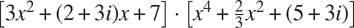

因为我们在通用算术系统中安装了多项式加法和乘法函数`add_ poly`和`mul_poly`作为类型`polynomial`的`add`和`mul`运算，所以我们的系统也能够自动处理多项式运算，例如

```js
(y + 1)x2 + (y2 + 1)x + (y – 1) · (y – 2)x + (y3 + 7)
```

原因是当系统试图合并系数时，会通过`add`和`mul`进行调度。由于系数本身是多项式(在 y ，这些将使用`add_poly`和`mul_poly`组合。结果是一种“数据导向递归”,例如，调用`mul_poly`将导致递归调用`mul_poly`,以便乘以系数。如果系数的系数本身是多项式(可能用于表示三个变量的多项式)，数据方向将确保系统将遵循另一层的递归调用，依此类推，通过数据结构规定的尽可能多的层。 [^(54)](#c2-fn-0054)

##### 表示术语列表

最后，我们必须面对实现术语表的良好表示的工作。术语列表实际上是一组以术语顺序为关键的系数。因此，在 2.3.3 节中讨论的任何表示集合的方法都可以应用于这个任务。另一方面，我们的函数`add_terms`和`mul_terms`总是从最高到最低顺序依次访问术语列表。因此，我们将使用某种有序列表表示。

我们应该如何构建表示术语列表的列表？一个考虑因素是我们想要操作的多项式的“密度”。如果一个多项式在大多数阶上都有非零系数，则称它是稠密的。如果它有许多零项，就说它是稀疏的。举个例子，

```js
A:  x5 + 2x4 + 3x2 – 2x – 5
```

是稠密多项式，而

```js
B:  x100 + 2x2 + 1
```

是稀疏的。

稠密多项式的项列表最有效地表示为系数列表。例如，上面的多项式 A 可以很好地表示为`list(1, 2, 0, 3, -2, -5)`。这种表示中的项的顺序是子列表的长度，从该项的系数开始，递减 1。对于稀疏多项式来说，这是一个可怕的表示，比如 B:会有一大串零被一些孤立的非零项打断。稀疏多项式的项列表的更合理的表示是非零项的列表，其中每个项是包含项的阶和该阶的系数的列表。在这样的方案中，多项式 B 被有效地表示为`list(list(100, 1), list(2, 2), list(0, 1))`。因为大多数多项式操作是在稀疏多项式上执行的，所以我们将使用这种方法。我们将假设术语表被表示为术语表，从最高位到最低位排列。一旦我们做出了这个决定，实现术语和术语列表的选择器和构造器就很简单了: [^(56)](#c2-fn-0056)

```js
function adjoin_term(term, term_list) {
    return is_equal_to_zero(coeff(term))
           ? term_list
           : pair(term, term_list);
}

const the_empty_termlist = null;
function first_term(term_list) { return head(term_list); }
function rest_terms(term_list) { return tail(term_list); }
function is_empty_termlist(term_list) { return is_null(term_list); }

function make_term(order, coeff) { return list(order, coeff); }
function order(term) { return head(term); }
function coeff(term) { return head(tail(term)); }
```

其中`is_equal_to_zero`如练习 2.80 中所定义。(另见下面的练习 2.87。)

多项式软件包的用户将通过函数创建(带标签的)多项式:

```js
function make_polynomial(variable, terms) {
    return get("make", "polynomial")(variable, terms);
}
```

##### 练习 2.87

为通用算术包中的多项式安装`is_equal_to_zero`。这将允许`adjoin_term`处理系数本身就是多项式的多项式。

##### 练习 2.88

扩展多项式系统以包括多项式的减法。(提示:您可能会发现定义通用求反运算很有帮助。)

##### 练习 2.89

将实现上述术语表表示的函数声明为适用于稠密多项式。

##### 练习 2.90

假设我们想要一个对稀疏多项式和稠密多项式都有效的多项式系统。一种方法是在我们的系统中允许两种术语表表示。这种情况类似于 2.4 节中的复数例子，我们允许矩形和极坐标表示。为此，我们必须区分不同类型的术语表，并使术语表上的操作通用化。重新设计多项式系统来实现这种一般化。这是一个重大的努力，而不是局部的改变。

##### 练习 2.91

一元多项式可以除以另一元多项式，得到多项式商和多项式余数。举个例子，

```js
 = x3 + x, remainder x – 1
```

除法可以通过长除法来执行。即被除数的最高阶项除以除数的最高阶项。结果是商的第一项。接下来，将结果乘以除数，从被除数中减去除数，并通过递归地将差除以除数来产生答案的剩余部分。当除数的阶数超过被除数的阶数时停止，并宣布被除数为余数。此外，如果被除数变为零，则返回零作为商和余数。

我们可以在`add_poly`和`mul_poly`的模型上设计一个`div_poly`功能。该函数检查两个多边形是否有相同的变量。如果是这样，`div_poly`去掉变量并将问题传递给`div_terms`，后者对术语列表执行除法运算。函数`div_poly`最终将变量重新附加到`div_terms`提供的结果上。设计`div_terms`来计算除法的商和余数是很方便的。函数`div_terms`可以将两个术语列表作为参数，并返回商术语列表和余数术语列表的列表。

通过填写缺少的部分来完成以下`div_terms`的定义。用它来实现`div_poly`，它接受两个多边形作为参数，并返回一个商和余数多边形的列表。

```js
function div_terms(L1, L2) {
    if (is_empty_termlist(L1)) {
        return list(the_empty_termlist, the_empty_termlist);
    } else {
        const t1 = first_term(L1);
        const t2 = first_term(L2);
        if (order(t2) > order(t1)) {
            return list(the_empty_termlist, L1);
        } else {
            const new_c = div(coeff(t1), coeff(t2));
            const new_o = order(t1) - order(t2);
            const rest_of_result = 〈compute rest of result recursively〉;
            〈form and return complete result〉
        }
    }
}
```

##### 符号代数中的类型层次

我们的多项式系统说明了一种类型的对象(多项式)实际上可能是由许多不同类型的对象组成的复杂对象。这并没有给定义泛型操作带来真正的困难。我们只需要安装适当的通用操作来执行复合类型部分的必要操作。事实上，我们看到多项式形成了一种“递归数据抽象”，因为多项式的各个部分本身可能就是多项式。我们的通用操作和面向数据的编程风格可以毫不费力地处理这种复杂性。

另一方面，多项式代数是一个系统，其中的数据类型不能自然地排列在一个塔中。例如，有可能使 x 中的多项式的系数是 y 中的多项式。也可能有在 y 中的多项式，其系数是在 x 中的多项式。这两种类型都没有以任何自然的方式“凌驾”于另一种之上，但是经常有必要将每一组中的元素加在一起。有几种方法可以做到这一点。一种可能性是通过展开和重新排列项，将一个多项式转换为另一个多项式的类型，以便两个多项式具有相同的主变量。人们可以通过对变量进行排序，从而将任何多项式转换为“标准形式”，其中最高优先级的变量占主导地位，较低优先级的变量隐藏在系数中，从而在此基础上建立一个类似塔的结构。这种策略工作得相当好，只是转换可能会不必要地扩展多项式，使其难以阅读，并且可能降低工作效率。对于这个领域或任何用户可以以各种组合形式(如三角函数、幂级数和积分)动态地使用旧类型来发明新类型的领域，塔式策略肯定是不自然的。

在大规模代数运算系统的设计中，控制强制是一个严重的问题，这并不奇怪。这种系统的复杂性很大程度上与不同类型之间的关系有关。事实上，公平地说，我们还没有完全理解强制。事实上，我们还没有完全理解数据类型的概念。然而，我们所知道的为我们提供了强大的结构化和模块化原则来支持大型系统的设计。

##### 练习 2.92

通过对变量进行排序，扩展多项式包，使多项式的加法和乘法适用于不同变量的多项式。(这个不容易！)

##### 扩展练习:有理函数

我们可以扩展我们的通用算术系统，使其包含有理函数。这些“分数”的分子和分母都是多项式，例如

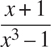

该系统应该能够对有理函数进行加、减、乘、除运算，并执行如下计算

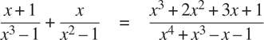

(此处的总和已通过去除共同因素进行了简化。普通的“交叉乘法”会在一个五次多项式上产生一个四次多项式。)

如果我们修改我们的 rational-算术包，使其使用一般运算，那么它将做我们想要做的，除了将分数减少到最低项的问题。

##### 练习 2.93

修改 rational-算术包以使用一般的运算，但是改变`make_rat`,以便它不试图将分数减少到最低项。通过在两个多项式上调用`make_rational`产生一个有理函数来测试您的系统

```js
const p1 = make_polynomial("x", list(make_term(2, 1), make_term(0, 1)));
const p2 = make_polynomial("x", list(make_term(3, 1), make_term(0, 1)));
const rf = make_rational(p2, p1);
```

现在使用`add`将`rf`添加到它自身。你会发现这个加法函数并没有把分数减少到最低项。

我们可以用处理整数的相同方法将多项式分数化简为最低项:修改`make_rat`将分子和分母都除以它们的最大公约数。“最大公约数”的概念对多项式有意义。事实上，我们可以使用适用于整数的相同欧几里德算法来计算两个多项式的 GCD。 [^(57)](#c2-fn-0057) 整数版是

```js
function gcd(a, b) {
    return b === 0
           ? a
           : gcd(b, a % b);
}
```

使用这个，我们可以进行明显的修改来定义一个在术语列表上工作的 GCD 操作:

```js
function gcd_terms(a, b) {
    return is_empty_termlist(b)
           ? a
           : gcd_terms(b, remainder_terms(a, b));
}
```

其中`remainder_terms`挑选出由练习 2.91 中实现的术语列表除法运算`div_terms`返回的列表的剩余部分。

##### 练习 2.94

使用`div_terms`，实现函数`remainder_terms`，并使用该函数如上定义`gcd_ terms`。现在编写一个函数`gcd_poly`来计算两个 polys 的多项式 GCD。(如果两个 polys 不在同一个变量中，该函数将发出错误信号。)在系统中安装一个通用运算`greatest_common_divisor`,对于多项式简化为`gcd_poly`,对于普通数简化为普通`gcd`。作为测试，尝试

```js
const p1 = make_polynomial("x", list(make_term(4, 1), make_term(3, -1),
                                     make_term(2, -2), make_term(1, 2)));
const p2 = make_polynomial("x", list(make_term(3, 1), make_term(1, -1)));
greatest_common_divisor(p1, p2);
```

并用手检查结果。

##### 练习 2.95

定义 P [1] ， P [2] ， P [3] 为多项式

```js
P1:  x2 – 2x + 1
P2:  11x2 + 7
P3:  13x + 5
```

现在定义 Q [1] 为 P [1] 和 P [2] 和 Q [2] 为 P [1] 和 P[3】3]的乘积，并使用`greatest_common_divisor`(练习 2 注意答案和 P1 不一样。这个例子在计算中引入了非整数运算，给 GCD 算法带来了困难。 [^(58)](#c2-fn-0058) 要了解发生了什么，请尝试在计算 GCD 时跟踪`gcd_terms`或尝试手动执行除法。

如果我们使用 GCD 算法的以下修改(它实际上只在整系数多项式的情况下有效),我们可以解决练习 2.95 中展示的问题。在 GCD 计算中执行任何多项式除法之前，我们将被除数乘以一个整数常数因子，选择该因子是为了保证在除法过程中不会出现分数。因此，我们的答案将与实际 GCD 相差一个整数常数因子，但这在将有理函数简化为最低项的情况下无关紧要；GCD 将被用来除分子和分母，因此整数常数因子将被抵消。

更准确的说，如果 P 和 Q 是多项式，设 O1 是 P 的阶(即 P 的最大项的阶)，设 O2 是 Q 的阶。设 c 为 Q 的领先系数。那么可以证明，如果我们将 P 乘以整数因子 c^(1+)^O^(1-)^O^(2，)所得到的多项式可以通过使用`div_terms`算法除以 Q 而不引入任何分数。被除数乘以这个常数然后再除法的运算有时被称为 P 除以 Q 的伪除法。除法的余数被称为伪余数。

##### 练习 2.96

1.  a. 实现函数`pseudoremainder_terms`，除了在调用`div_terms`之前将被除数乘以上述整数因子外，与`remainder_terms`一样。修改`gcd_terms`以使用`pseudoremainder_terms`，并验证`greatest_common_divisor`现在产生一个关于练习 2.95 中的例子的整数系数的答案。
2.  b .GCD 现在有整数系数，但是它们比 P1 的系数大。修改`gcd_terms`，使其通过将所有系数除以它们的(整数)最大公约数，从答案的系数中移除公因数。

因此，以下是如何将有理函数简化为最低项:

*   使用练习 2.96 中的`gcd_ terms`计算分子和分母的 GCD。
*   获得 GCD 后，在除以 GCD 之前，将分子和分母都乘以相同的整数因子，这样除以 GCD 就不会引入任何非整数系数。作为因子，您可以使用 GCD 的前导系数 1+O[1]–O[2]，其中 O [2] 是 GCD 的阶，而 O [1] 是分子和分母的阶的最大值。这将确保分子和分母除以 GCD 不会引入任何分数。
*   这个操作的结果将是一个整数系数的分子和分母。由于所有的整数因子，系数通常会非常大，因此最后一步是通过计算分子和分母的所有系数的(整数)最大公约数并除以该因子来去除冗余因子。

##### 练习 2.97

1.  a. 将此算法实现为一个函数`reduce_terms`，它以两个词条列表`n`和`d`作为自变量，并返回一个列表`nn`、`dd`，它们通过上面给出的算法将`n`和`d`缩减为最低词条。还要写一个类似于`add_poly`的函数`reduce_poly`，检查两个 polys 是否有相同的变量。如果是这样，`reduce_poly`剥离变量并将问题传递给`reduce_terms`，然后将变量重新附加到`reduce_terms`提供的两个术语列表中。
2.  b. Define a function analogous to `reduce_terms` that does what the original `make_rat` did for integers:

    ```js
    function reduce_integers(n, d) {
        const g = gcd(n, d);
        return list(n / g, d / g);
    }
    ```

    并将`reduce`定义为一个通用操作，该操作调用`apply_generic`来分派给`reduce_poly`(对于`polynomial`参数)或`reduce_integers`(对于`javascript_ number`参数)。现在，通过让`make_rat`在给定的分子和分母组合成一个有理数之前调用`reduce`，可以很容易地让有理算术包将分数减少到最低项。系统现在处理整数或多项式的有理表达式。要测试您的程序，请尝试本扩展练习开头的示例:

    ```js
    const p1 = make_polynomial("x", list(make_term(1, 1), make_term(0, 1)));
    const p2 = make_polynomial("x", list(make_term(3, 1), make_term(0, -1)));
    const p3 = make_polynomial("x", list(make_term(1, 1)));
    const p4 = make_polynomial("x", list(make_term(2, 1), make_term(0, -1)));

    const rf1 = make_rational(p1, p2);
    const rf2 = make_rational(p3, p4);

    add(rf1, rf2);
    ```

    看看你是否得到正确的答案，正确地减少到最低的条款。

GCD 计算是任何对有理函数进行运算的系统的核心。上面使用的算法虽然在数学上很简单，但速度非常慢。缓慢部分是由于大量除法运算，部分是由于伪除法产生的中间系数的巨大尺寸。代数操作系统发展中的一个活跃领域是为计算多项式 gcd 设计更好的算法。 [^(59)](#c2-fn-0059)

直接操作函数的能力为编程语言的表达能力提供了类似的增长。例如，在第 1.3.1 节中，我们引入了`sum`函数，它将函数`term`作为参数，并计算在某个指定间隔内`term`的值的和。为了定义`sum`，至关重要的是我们能够把像`term`这样的函数说成是一个独立的实体，而不用考虑如何用更原始的操作来表达`term`。事实上，如果我们没有“函数”的概念，我们甚至会怀疑是否有可能定义像`sum`这样的操作。此外，就执行求和而言，如何从更原始的操作构建`term`的细节是不相关的。

[2](#c2-fn-0002a) 定义选择器和构造函数的另一种方式是
**const**make _ rat = pair；
**const**numer = head；T38constdenom = tail；
第一个定义将名字`make_rat`与表达式`pair`的值关联起来，表达式是构造偶对的原函数。因此`make_rat`和`pair`是同一个基本构造函数的名字。
这样定义选择器和构造函数是高效的:不是`make_rat` 调用 `pair`，`make_rat` 就是 `pair`，所以调用`make_rat`的时候只有一个函数被调用，而不是两个。另一方面，这样做挫败了跟踪函数调用或在函数调用上设置断点的调试辅助:您可能希望看到`make_rat`被调用，但您肯定不想看到对`pair`的每个调用。在本书中，我们选择不使用这种风格的定义。

[3](#c2-fn-0003a) 在 JavaScript 中，运算符`+`也可以应用于一个字符串和一个数字以及其他操作数组合，但在本书中，我们选择将其应用于两个数字或两个字符串。

[4](#c2-fn-0004a) 练习 1.22 中引入的原函数`display`返回它的参数，但是在下面`print_rat`的使用中，我们只显示了`print_rat`打印的内容，而不是解释器打印为`print_rat`返回的值。

令人惊讶的是，这个想法很难严谨地表达出来。给出这样一个公式有两种方法。一种是由 C. A. R. Hoare (1972)首创的，被称为抽象模型的方法。它形式化了“函数加条件”规范，如上面的有理数例子中所概述的。注意，有理数表示的条件是根据整数的事实(相等和除法)来陈述的。一般来说，抽象模型根据先前定义的数据对象类型来定义新类型的数据对象。因此，关于数据对象的断言可以通过将它们简化为关于先前定义的数据对象的断言来检查。另一种方法由麻省理工学院的 Zilles、IBM 的 Goguen、Thatcher、Wagner 和 Wright(参见 Thatcher、Wagner 和 Wright 1978)以及多伦多的 Guttag(参见 Guttag 1977)提出，称为代数规范。它将“函数”视为抽象代数系统的元素，其行为由对应于我们的“条件”的公理指定，并使用抽象代数的技术来检查关于数据对象的断言。Liskov 和 Zilles (1975)在论文中对这两种方法进行了调查。

[6](#c2-fn-0006a)1 . 3 . 3 节中介绍的函数`error`将显示在第一个参数之前的字符串作为可选的第二个参数，例如，如果`m`为 42:
第 7 行出错:参数不为 0 或 1–对:42

[7](#c2-fn-0007a) 这里使用的“闭包”一词来自抽象代数，如果对集合中的元素应用一个运算，产生一个元素，该元素又是集合中的一个元素，则称该元素集合在该运算下是封闭的。编程语言社区也(不幸地)使用“闭包”这个词来描述一个完全不相关的概念:闭包是一种用自由名称表示函数的实现技术。在这本书里，我们不在第二种意义上使用“结束”这个词。

[8](#c2-fn-0008a) 在本书中，我们使用列表来表示由列表结束标记终止的一串对。相反，术语列表结构指的是任何成对的数据结构，而不仅仅是列表。

值`null`在 JavaScript 中有多种用途，但在本书中我们将只使用它来表示空列表。

我们的 JavaScript 环境提供了一个原语函数`display_list`，它的工作方式类似于原语函数`display`，除了它使用列表符号而不是盒子符号。

这两个谓词的顺序很重要，因为`null`满足`is_null`并且也不是一对。

[12](#c2-fn-0012a) 事实上，这正是练习 2.28 中的`fringe`函数。这里我们将其重命名，以强调它是通用序列操作函数家族的一部分。

Richard Waters (1979 年)开发了一个程序，可以自动分析传统的 Fortran 程序，从映射、过滤器和累积的角度来观察它们。他发现 Fortran 科学子程序包中整整 90%的代码恰好符合这种范式。Lisp 作为一种编程语言取得成功的原因之一是，列表提供了一种表达有序集合的标准媒介，因此可以使用更高阶的操作来操作它们。很多现代语言，比如 Python，都吸取了这个教训。

根据 Knuth (1997b)的说法，这个规则是由 W. G. Horner 在十九世纪早期制定的，但该方法实际上是由牛顿在一百多年前使用的。霍纳法则计算多项式所用的加法和乘法比简单的方法少，简单的方法是先计算 a[n]x^n，然后将 a[n][–1]x^n^(–1)等等。事实上，可以证明任何计算任意多项式的算法都必须使用至少与霍纳法则一样多的加法和乘法，因此霍纳法则是多项式计算的最佳算法。A. M. Ostrowski 在 1954 年的一篇论文中证明了这一点(对于加法的数量),这篇论文基本上奠定了现代最优算法研究的基础。潘文石在 1966 年证明了乘法的类似陈述。Borodin 和 Munro (1975)的书提供了关于最优算法的这些和其他结果的概述。

这个定义使用了练习 2.36 中的函数`accumulate_n`。

David Turner 向我们展示了这种嵌套映射的方法，他的语言 KRC 和米兰达为处理这些结构提供了优雅的形式。本节中的例子(也见练习 2.42)改编自特纳 1981。在 3.5.3 节，我们将看到这种方法如何推广到无限序列。

我们在这里将一对表示为两个元素的列表，而不是普通的一对。这样，“对”( i ， j )就表示为`list(i, j)`，而不是`pair(i, j)`。

[18](#c2-fn-0018a) 集合 S–x 是 S 的所有元素的集合，不包括 x 。

[19](#c2-fn-0019a)JavaScript 程序中的字符序列 // 用于引入注释。解释器会忽略从 // 到行尾的所有内容。在这本书里，我们没有使用很多注释；我们试图通过使用描述性的名称来使我们的程序自文档化。

图片语言是基于彼得·亨德森创造的语言，以构建像 M·C·埃舍尔的“广场极限”木刻图像(见亨德森 1982)。木刻包含了重复的缩放图案，类似于使用本节中的`square_limit`功能绘制的排列。

威廉·巴顿·罗杰斯(1804-1882)是麻省理工学院的创始人和首任校长。作为一名地质学家和天才教师，他曾在威廉玛丽学院和弗吉尼亚大学任教。1859 年，他搬到波士顿，在那里他有更多的时间进行研究，致力于建立“理工学院”的计划，并担任马萨诸塞州第一任煤气表州监察员。当麻省理工学院于 1861 年成立时，罗杰斯被选为首任校长。罗杰斯支持“有用的学习”的理想，这不同于当时的大学教育，过分强调经典，正如他所写的那样，“阻碍了自然和社会科学更广泛，更高和更实用的教学和学科。”这种教育同样不同于狭隘的职业学校教育。用罗杰斯的话说:

> 世界强制区分实践工作者和科学工作者是完全无用的，现代的整个经验已经证明它完全没有价值。

Rogers served as president of MIT until 1870, when he resigned due to ill health. In 1878 the second president of MIT, John Runkle, resigned under the pressure of a financial crisis brought on by the Panic of 1873 and strain of fighting off attempts by Harvard to take over MIT. Rogers returned to hold the office of president until 1881.
  Rogers collapsed and died while addressing MIT's graduating class at the commencement exercises of 1882\. Runkle quoted Rogers's last words in a memorial address delivered that same year:

> “今天我站在这里，看看这个研究所是什么样的。。。我想起了科学的起源。我记得 150 年前斯蒂芬·黑尔斯出版了一本关于照明气体的小册子，他说他的研究表明 128 粒烟煤——”
> 
> “烟煤，”这是他在地球上的最后一句话。在这里，他俯身向前，好像在查阅他面前桌子上的一些笔记，然后慢慢恢复直立的姿势，举起双手，从他在尘世的劳动和胜利的场景被翻译成“死亡的明天”，在那里，生命的奥秘被解开了，无形的灵魂在思考无限未来的新的、仍然深不可测的神秘中找到了无尽的满足。

In the words of Francis A. Walker (MIT's third president):

> 他的一生都是最忠诚和最英勇的，他死了，就像一个好骑士所希望的那样，在他的岗位上，在公共职责的角色和行为中。

[22](#c2-fn-0022a) 在`square_of_four`中，我们使用了在 1.3.2 节中引入的 lambda 表达式的语法扩展:lambda 表达式的主体可以是一个块，而不仅仅是一个返回表达式。这样一个λ表达式具有形状`(` 参数 `) => {` 语句 `}`或参数 `=> {` 语句 `}`。

[23](#c2-fn-0023a) 等价地，我们可以写成
**const**flipped _ pairs = square _ of _ four(identity，flip_vert，
identity，flip _ vert)；

[24](#c2-fn-0024a) 功能`rotate180`将油漆工旋转 180 度。使用练习 1.42 中的`compose`函数，我们可以说`compose(flip_vert, flip_horiz)`而不是`rotate180`。

函数`frame_coord_map`使用了下面练习 2.46 中描述的向量运算，我们假设已经使用了一些向量表示法。由于数据抽象，只要向量操作行为正确，向量表示是什么并不重要。

函数`segments_to_painter`使用下面练习 2.48 中描述的线段表示法。它还使用了练习 2.23 中描述的`for_each`功能。

[27](#c2-fn-0027a) 例如，图 2.11：的`rogers`油漆工就是从一张灰度图像中构造出来的。对于给定帧中的每个点，`rogers`画师确定图像中在帧坐标映射下映射到它的点，并相应地对其进行着色。通过允许不同类型的绘制者，我们利用了 2.1.3 节中讨论的抽象数据的概念，我们认为有理数表示可以是满足适当条件的任何东西。在这里，我们利用了一个事实，即画师可以以任何方式实现，只要它在指定的框架中绘制东西。第 2.1.3 节还展示了如何将线对实现为函数。画家是我们数据函数表示的第二个例子。

[28](#c2-fn-0028a) 功能`rotate90`仅适用于方形框架的纯旋转，因为它还会拉伸和收缩图像以适应旋转后的框架。

[29](#c2-fn-0029a)[图 2.10 和 2.11](#c2-fig-0017) 中的菱形图像是在将`squash_inwards`应用于`wave`和`rogers`时创建的。

第 3.3.4 节描述了这样一种语言。

如果两个字符串由相同顺序的相同字符组成，我们可以认为它们是“相同的”。这样的定义回避了一个我们还没有准备好解决的深层问题:编程语言中“相同性”的含义。我们将在第 3 章(第 3.1.3 节)回到这一点。

这本书的最初版本使用了编程语言 Scheme，这是 Lisp 的一种方言。

如果我们想更正式，我们可以指定“与上面给出的解释一致”来表示操作满足一系列规则，例如:

*   对于任何集合`S`和任何对象`x`，`is_element_of_set(x, adjoin_set(x, S))`为真(非正式地:“将一个对象邻接到一个集合产生一个包含该对象的集合”)。
*   对于任意集合`S`、`T`和任意对象`x`，`is_element_of_set(x, union_set(S, T))`等于`is_element_of_set(x, S) || is_element_of_set(x, T)`(非正式:`union_set(S, T)`的元素是在`S`或`T`中的元素)。
*   对于任何对象`x`，`is_element_of_set(x, null)`为假(非正式地:“没有对象是空集的元素”)。

正如我们在 1.2.4 节的快速指数算法和 1.3.3 节的半区间搜索方法中所看到的，在每一步将问题的规模减半是对数增长的显著特征。

我们用树来表示集合，用列表来表示树——实际上，是建立在数据抽象之上的数据抽象。我们可以将函数`entry`、`left_branch`、`right_branch`和`make_tree`视为一种将“二叉树”的抽象与我们可能希望用列表结构来表示这种树的特定方式隔离开来的方式。

[36](#c2-fn-0036a) 这种结构的例子包括 B 树和红黑树。有大量关于数据结构的文献专门讨论这个问题。参见 Cormen，Leiserson，Rivest 和 Stein 2022。

[37](#c2-fn-0037a) 练习 2.63–2.65 由保罗·希尔芬格负责。

参见 Hamming 1980 年关于霍夫曼码的数学性质的讨论。

在实际的计算系统中，由于矩形和极坐标形式之间的转换存在舍入误差，所以大多数时候矩形形式比极坐标形式更好。这就是为什么复数的例子是不现实的。尽管如此，它为使用一般操作的系统设计提供了一个清晰的说明，并为本章后面要开发的更具体的系统提供了一个很好的介绍。

[40](#c2-fn-0040a) 这里提到的反正切函数，由 JavaScript 的`math_atan2`函数计算，定义为带两个参数 y 和 x ，返回正切为 y / x 的角度。自变量的符号决定角度的象限。

名称`undefined`在任何 JavaScript 实现中都是预先声明的，除了引用原始值之外不应该使用。

我们使用列表`list("rectangular")`而不是字符串`"rectangular"`来考虑有多个参数的操作的可能性，这些参数不都是相同的类型。

安装构造函数的类型不必是列表，因为构造函数总是被用来创建一个特定类型的对象。

[44](#c2-fn-0044a) 函数`apply_generic`使用 4.1.4 节(脚注 18)中给出的函数`apply_in_underlying_javascript`，该函数采用两个参数，一个函数和一个列表，并应用该函数，使用列表中的元素作为参数。例如，
apply _ in _ underlying _ JavaScript(sum _ of _ squares，list(1，3))
得出 10。

这种组织的一个限制是它只允许一个参数的通用函数。

我们还必须提供一个几乎相同的函数来处理类型
列表(" javascript_number "，" complex ")。

参见练习 2.82 中的概括。

如果我们聪明的话，我们通常可以用少于 n 个 ^(2 个)的强制函数来应付。例如，如果我们知道如何从类型 1 转换到类型 2，以及如何从类型 2 转换到类型 3，那么我们可以使用这些知识从类型 1 转换到类型 3。当我们向系统添加新类型时，这可以大大减少我们需要显式提供的强制函数的数量。如果我们愿意在我们的系统中构建所需的复杂程度，我们可以让它搜索类型之间的关系“图”,并自动生成那些可以从显式提供的函数中推断出来的强制函数。

这句话也出现在本书的第一版中，它现在和我们在 1984 年写它时一样真实。开发一个有用的、通用的框架来表达不同类型的实体之间的关系(哲学家称之为“本体论”)似乎非常困难。1984 年存在的混乱和现在存在的混乱之间的主要区别是，现在各种不适当的本体论理论已经体现在过多的相应不适当的编程语言中。例如，面向对象编程语言的大部分复杂性——以及当代面向对象语言之间微妙而令人困惑的差异——都集中在对相关类型的泛型操作的处理上。我们在第三章中对计算对象的讨论完全避免了这些问题。熟悉面向对象编程的读者会注意到，我们在第 3 章中有很多关于本地状态的内容，但我们甚至没有提到“类”或“继承”事实上，我们怀疑，如果不借助于知识表示和自动推理方面的工作，这些问题仅仅依靠计算机语言设计是无法得到充分解决的。

使用`math_round`原语可以将一个实数投影为一个整数，该原语返回与其参数最接近的整数。

[51](#c2-fn-0051a) 另一方面，我们会允许系数本身就是多项式的多项式出现在其他变量中。这将给予我们与完全多元系统基本相同的代表能力，尽管它确实会导致强制问题，如下所述。

[52](#c2-fn-0052a) 对于一元多项式，给出一个多项式在给定的一组点上的值可以是一个特别好的表示。这使得多项式算法极其简单。例如，为了获得以这种方式表示的两个多项式的和，我们只需要将对应点处的多项式的值相加。为了转换回更熟悉的表示，我们可以使用拉格朗日插值公式，该公式显示了在给定多项式在 n + 1 点的值的情况下，如何恢复次数为 n 的多项式的系数。

[53](#c2-fn-0053a) 这个操作非常像我们在练习 2.62 中开发的有序`union_set`操作。事实上，如果我们把多项式的项看作是一个按照不定项的幂排序的集合，那么为一个和产生项列表的程序几乎和`union_set`一模一样。

为了使这项工作完全顺利，我们还应该给我们的通用算术系统增加一种能力，通过把一个“数”看作一个系数是这个数的零次多项式，把它强制转换成一个多项式。如果我们要执行
[x²+(y+1)x+5】+[x²+2x+1】
等需要将系数 y + 1 加到系数 2 上的运算，这是很有必要的。

在这些多项式例子中，我们假设我们已经使用练习 2.78 中建议的类型机制实现了通用算术系统。因此，作为普通数字的系数将被表示为数字本身，而不是表示为其`head`是字符串`"javascript_number"`的对。

虽然我们假设术语表是有序的，但是我们已经实现了`adjoin_term`来简单地将新术语连接到现有术语表的前面。只要我们保证使用`adjoin_term`的函数(比如`add_terms`)总是用比列表中出现的更高阶的术语调用它，我们就可以摆脱这种情况。如果我们不想做这样的保证，我们可以实现`adjoin_term`类似于集合的有序列表表示的`adjoin_set`构造函数(练习 2.61)。

欧几里德算法适用于多项式的事实在代数中是形式化的，即多项式形成一种称为欧几里德环的代数域。欧几里德环是一个允许加法、减法和交换乘法的域，以及一种给环的每个元素 x 分配一个正整数“measure”m(x)的方式，该正整数的性质是 m(xy)m(x)对于任何非零的 x 和 y 给定任意一个 x 和 y ，存在一个 q 使得 y=qx+r 和 r = 0 或 m(r)<m( 从抽象的角度来看，这是证明欧几里德算法行得通所需要的。对于整数的定义域，一个整数的测度 m 就是该整数本身的绝对值。对于多项式的定义域，多项式的度量是它的次数。

在 JavaScript 中，整数的除法可以产生有限精度的小数，因此我们可能无法得到有效的除数。

Richard Zippel (1979)发现了一种计算多项式 gcd 的非常有效和优雅的方法。该方法是一种概率算法，正如我们在第一章中讨论的快速素性测试一样。Zippel 的书(1993)描述了这种方法，以及计算多项式 gcd 的其他方法。