# 3
模块性、对象和状态

> Mεταβάλλον αναπαύεται
> 
> (即使它在变化，它也是静止的。)
> 
> —赫拉克利特

> 加上变化，加上这是我的选择。
> 
> 阿方斯·吉田

前面几章介绍了制作程序的基本要素。我们看到了原始函数和原始数据是如何组合起来构建复合实体的，我们也了解到抽象对于帮助我们处理大型系统的复杂性是至关重要的。但是这些工具不足以设计程序。有效的程序综合还需要组织原则，这些原则可以指导我们制定程序的总体设计。特别是，我们需要一些策略来帮助我们构建大型系统，这样它们就可以模块化，也就是说，它们可以被“自然地”划分为可以单独开发和维护的连贯部分。

一个强大的设计策略，特别适用于物理系统建模程序的构建，是将我们程序的结构建立在被建模系统的结构上。对于系统中的每个对象，我们构造一个相应的计算对象。对于每个系统动作，我们在计算模型中定义一个符号操作。我们使用这种策略的希望是，扩展模型以适应新的对象或新的动作不需要对程序进行策略上的改变，只需要添加那些对象或动作的新的符号模拟。如果我们在我们的系统组织中取得了成功，那么要添加一个新的特性或者调试一个旧的特性，我们将不得不仅仅致力于系统的本地化部分。

因此，在很大程度上，我们组织大型程序的方式是由我们对要建模的系统的感知决定的。在这一章中，我们将研究两种突出的组织战略，它们产生于对系统结构的两种截然不同的“世界观”。第一个组织策略集中在对象上，将一个大系统视为不同对象的集合，这些对象的行为可能会随着时间而改变。另一种组织策略关注系统中流动的信息流，就像电气工程师看待信号处理系统一样。

基于对象的方法和流处理方法都在编程中提出了重要的语言问题。对于对象，我们必须关心一个计算对象如何能够改变并保持它的身份。这将迫使我们放弃旧的计算替代模型(第 1.1.5 节),转而支持一种更机械化但理论上更难处理的计算环境模型。在我们的计算模型中，处理对象、变化和身份的困难是需要与时间搏斗的基本结果。当我们允许程序并行执行时，这些困难就变得更大了。当我们将模型中的模拟时间从评估过程中计算机中发生的事件的顺序中分离出来时，流方法可以得到最充分的利用。我们将使用一种被称为延迟评估的技术来实现这一点。

## 3.1 分配和本地状态

我们通常认为世界是由独立的物体组成的，每个物体都有一个随时间变化的状态。如果一个对象的行为受到其历史的影响，则称该对象“有状态”。例如，一个银行账户中有这样一个问题:“我能提取 100 美元吗？”取决于存款和取款交易的历史。我们可以通过一个或多个状态变量来描述一个对象的状态，其中包含了足够的历史信息来确定对象的当前行为。在一个简单的银行系统中，我们可以通过当前余额来描述账户的状态，而不是记住账户交易的全部历史。

在由许多对象组成的系统中，对象很少是完全独立的。每一个都可以通过交互作用影响其他对象的状态，交互作用用于将一个对象的状态变量耦合到其他对象的状态变量。事实上，当系统的状态变量可以被分组为紧密耦合的子系统，而这些子系统与其他子系统只是松散耦合时，系统由独立的对象组成的观点是最有用的。

这种系统视图可以成为组织系统计算模型的强大框架。对于这样一个模块化的模型，它应该被分解成模拟系统中实际对象的计算对象。每个计算对象必须有自己的本地状态变量来描述实际对象的状态。由于被建模的系统中对象的状态随时间变化，相应计算对象的状态变量也必须变化。如果我们选择通过计算机中的运行时间来模拟系统中的时间流，那么我们必须有一种方法来构造计算对象，这些对象的行为会随着程序的运行而改变。特别是，如果我们希望用编程语言中的普通符号名来模拟状态变量，那么该语言必须提供一个赋值操作来使我们能够改变与名称相关的值。

### 3.1.1 局部状态变量

为了说明我们所说的具有时变状态的计算对象是什么意思，让我们对从银行账户取款的情况进行建模。我们将使用函数`withdraw`来实现这一点，该函数将一个要撤销的`amount`作为参数。如果账户中有足够的钱来支付提现，那么`withdraw`应该返还提现后的余额。否则，`withdraw`应返回消息资金不足。例如，如果我们开始

帐户中有 100 美元，我们应该使用`withdraw`获得以下响应序列:

```js
withdraw(25);
75

withdraw(25);
50

withdraw(60);
"Insufficient funds"

withdraw(15);
35
```

注意到表达式`withdraw(25)`被求值两次，得到不同的值。这是一种新的函数行为。直到现在，我们所有的 JavaScript 函数都可以被看作是计算数学函数的规范。对一个函数的调用计算了应用于给定参数的函数值，用相同的参数对同一个函数的两次调用总是产生相同的结果。 [¹](#c3-fn-0001)

到目前为止，我们所有的名字都是不可改变的。当一个函数被应用时，它的参数所引用的值永远不会改变，而一旦一个声明被求值，被声明的名字就永远不会改变它的值。为了实现像`withdraw`这样的函数，我们引入了变量声明，它使用了关键字`**let**`，此外还有常量声明，它使用了关键字`const`。我们可以声明一个变量`balance`来表示账户中的余额，并将`withdraw`定义为一个访问`balance`的函数。`withdraw`功能检查`balance`是否至少与请求的`amount`一样大。如果是，则`withdraw`将`balance`减少`amount`并返回`balance`的新值。否则，`withdraw`返回资金不足消息。以下是`balance`和`withdraw`的声明:

```js
let balance = 100;

function withdraw(amount) {
    if (balance >= amount) {
        balance = balance - amount;
        return balance;
    } else {
        return "Insufficient funds";
    }
}
```

递减`balance`由表达式语句完成

```js
balance = balance - amount;
```

赋值表达式的语法是

```js
name = new-value
```

此处名称已经用`**let**`声明或者作为函数参数声明，新 - 值为任意表达式。赋值改变了的名称，使其值是通过评估新 - 值得到的结果。在目前的情况下，我们正在更改`balance`，这样它的新值将是从以前的值`balance`中减去`amount`的结果。 [²](#c3-fn-0002)

函数`withdraw`还使用一系列语句在`**if**`测试为真的情况下对两条语句求值:首先递减`balance`，然后返回`balance`的值。通常，执行一个序列

```js
stmt[1] stmt[2] . . .stmt[n]
```

使语句 stmt [1] 到 stmt [n] 按顺序求值。 [³](#c3-fn-0003)

虽然`withdraw`按预期工作，但变量`balance`存在问题。如上所述，`balance`是在程序环境中定义的名称，可由任何功能自由访问以进行检查或修改。如果我们能以某种方式使`balance`在`withdraw`的内部，这样`withdraw`将是唯一可以直接访问`balance`的函数，而任何其他函数只能间接访问`balance`(通过调用`withdraw`)。这将更准确地模拟这样一个概念，即`balance`是一个由`withdraw`用来跟踪账户状态的局部状态变量。

我们可以通过重写定义使`balance`在`withdraw`内部，如下所示:

```js
function make_withdraw_balance_100() {
    let balance = 100;
    return amount => {
               if (balance >= amount) {
                   balance = balance - amount;
                   return balance;
               } else {
                   return "Insufficient funds";
               }
           };
}
const new_withdraw = make_withdraw_balance_100();
```

我们在这里所做的是使用`**let**`建立一个带有本地变量`balance`的环境，绑定到初始值 100。在这个本地环境中，我们使用一个 Lambda  表达式 [⁴](#c3-fn-0004) 来创建一个函数，该函数将`amount`作为参数，其行为类似于我们之前的`withdraw`函数。这个函数——作为评估`make_withdraw_balance_100`函数体的结果返回——行为与`withdraw`完全相同，但是它的变量`balance`不能被任何其他函数访问。 [⁵](#c3-fn-0005)

将赋值与变量声明结合起来是我们将用来构造具有局部状态的计算对象的通用编程技术。不幸的是，使用这种技术带来了一个严重的问题:当我们第一次引入函数时，我们也引入了评估的替代模型(1.1.5 节)来解释函数应用的含义。我们说过，应用一个主体是 return 语句的函数应该被解释为用参数的值替换参数来计算函数的返回表达式。对于具有更复杂物体的函数，我们需要用它们的值替换参数来评估整个物体。问题是，一旦我们在语言中引入赋值，替代就不再是函数应用的合适模型。(我们将在 3.1.3 节中看到为什么会这样。)因此，从技术上讲，我们现在还无法理解为什么`new_withdraw`函数会有上述行为。为了真正理解像`new_withdraw`这样的函数，我们需要开发一个新的函数应用模型。在 3.2 节中，我们将介绍这样一个模型，以及对赋值和变量声明的解释。然而，首先，我们检查由`new_withdraw`建立的主题的一些变化。

函数的参数以及用`**let**`声明的名字都是变量。下面的函数`make_withdraw`创建“取款处理器”`make_withdraw`中的参数`balance`指定账户中的初始金额。 [⁶](#c3-fn-0006)

```js
function make_withdraw(balance) {
    return amount => {
               if (balance >= amount) {
                   balance = balance - amount;
                   return balance;
               } else {
                   return "Insufficient funds";
               }
           };
}
```

函数`make_withdraw`可用于创建两个对象`W1`和`W2`:

```js
const W1 = make_withdraw(100);
const W2 = make_withdraw(100);

W1(50);
50

W2(70);
30

W2(40);
"Insufficient funds"

W1(40);
10
```

注意到`W1`和`W2`是完全独立的对象，每个都有自己的局部状态变量`balance`。从其中一个退出不会影响另一个。

我们还可以创建处理存款和取款的对象，因此我们可以表示简单的银行账户。下面是一个返回具有指定初始余额的“银行帐户对象”的函数:

```js
function make_account(balance) {
    function withdraw(amount) {
        if (balance >= amount) {
            balance = balance - amount;
            return balance;
        } else {
            return "Insufficient funds";
        }
    }
    function deposit(amount) {
        balance = balance + amount;
        return balance;
    }
    function dispatch(m) {
        return m === "withdraw"
               ? withdraw
               : m === "deposit"
               ? deposit
               : error(m, "unknown request – make_account");
    }
    return dispatch;
}
```

对`make_account`的每次调用都用本地状态变量`balance`建立一个环境。在这个环境中，`make_account`定义了访问`balance`的函数`deposit`和`withdraw`，以及一个附加函数`dispatch`，该函数将“消息”作为输入并返回两个本地函数之一。`dispatch`函数本身作为代表银行账户对象的值返回。这正是我们在 2.4.3 节中看到的消息传递风格的编程，尽管这里我们将它与修改局部变量的能力结合使用。

功能`make_account`可以如下使用:

```js
const acc = make_account(100);

acc("withdraw")(50);
50

acc("withdraw")(60);
"Insufficient funds"

acc("deposit")(40);
90

acc("withdraw")(60);
30
```

对`acc`的每次调用都返回本地定义的`deposit`或`withdraw`函数，然后应用于指定的`amount`。与`make_withdraw`的情况一样，对`make_account`的另一个调用

```js
const acc2 = make_account(100);
```

会产生一个完全独立的 account 对象，它维护自己的本地`balance`。

##### 练习 3.1

累加器是一个用单个数字参数重复调用的函数，它将参数累加成一个和。每次调用它时，它都返回当前累计的总和。编写一个生成累加器的函数`make_accumulator`，每个累加器保持一个独立的和。`make_accumulator`的输入应指定总和的初始值；例如

```js
const a = make_accumulator(5); 

a(10);
15

a(10);
25
```

##### 练习 3.2

在软件测试应用程序中，能够统计在计算过程中给定函数被调用的次数是很有用的。编写一个函数`make_monitored`，它接受函数`f`作为输入，而函数`f`本身接受一个输入。由`make_monitored`返回的结果是第三个函数，比如说`mf`，它通过维护一个内部计数器来跟踪它被调用的次数。如果`mf`的输入是字符串`"how many calls"`，那么`mf`返回计数器的值。如果输入是字符串`"reset count"`，则`mf`将计数器重置为零。对于任何其他输入，`mf`返回对该输入调用`f`的结果，并递增计数器。例如，我们可以制作一个受监控版本的`sqrt`函数:

```js
const s = make_monitored(math_sqrt);

s(100);
10

s("how many calls");
1
```

##### 练习 3.3

修改`make_account`函数，使其创建受密码保护的账户。也就是说，`make_account`应该将一个字符串作为附加参数，如

```js
const acc = make_account(100, "secret password");
```

只有当请求附有创建帐户时使用的密码时，生成的帐户对象才应该处理该请求，否则应该返回一个投诉:

```js
acc("secret password", "withdraw")(40);
60

acc("some other password", "deposit")(40);
"Incorrect password"
```

##### 练习 3.4

通过添加另一个本地状态变量来修改练习 3.3 的`make_account`函数，这样，如果一个帐户连续七次以上被不正确的密码访问，它将调用函数`call_the_cops`。

### 3.1.2 引进外派的好处

正如我们将会看到的，将赋值引入我们的编程语言会将我们引入一个复杂的概念问题。然而，将系统视为具有本地状态的对象集合是维护模块化设计的一种强大技术。作为一个简单的例子，考虑一个函数`rand`的设计，无论何时调用它，它都返回一个随机选择的整数。

“随机选择”的含义一点也不清楚。我们大概想要的是连续调用`rand`来产生一个具有均匀分布统计特性的数字序列。这里我们不讨论产生合适序列的方法。相反，让我们假设我们有一个函数`rand_update`，它具有这样的性质:如果我们从一个给定的数字 x [1] 开始并形成

```js
x[2] = rand_update(x[1]);
x[3] = rand_update(x[2]);
```

然后值的序列 x1、x2、x3、`. . .`将具有期望的统计特性。 [⁷](#c3-fn-0007)

我们可以将`rand`实现为一个带有局部状态变量`x`的函数，该变量被初始化为某个固定值`random_init`。对`rand`的每个调用计算`x`的当前值的`rand_update`，将其作为随机数返回，并且还将其存储为`x`的新值。

```js
function make_rand() {
    let x = random_init;
    return () => {
              x = rand_update(x);
              return x;
           };
}
const rand = make_rand();
```

当然，我们可以通过简单地直接调用`rand_update`来生成相同的随机数序列，而不使用赋值。然而，这意味着我们程序中使用随机数的任何部分都必须明确地记住作为参数传递给`rand_update`的`x`的当前值。要意识到这是多么令人烦恼，可以考虑使用随机数来实现一种叫做蒙特卡罗模拟的技术。

蒙特卡罗方法包括从一个大的集合中随机选择样本实验，然后根据从这些实验结果列表中估计的概率进行推断。比如我们可以利用 6/ π ² 是随机选取的两个整数没有公因数的概率来近似π；也就是说，它们的最大公约数将是 1。 [⁸](#c3-fn-0008) 为了获得对 π 的近似，我们进行了大量的实验。在每个实验中，我们随机选择两个整数，并进行测试，看看它们的 GCD 是否为 1。通过测试的次数分数给出了我们对 6/ π ² 的估计，由此我们得到了对 π 的近似值。

我们程序的核心是一个函数`monte_carlo`，它将尝试实验的次数以及实验作为参数，表示为一个无参数函数，每次运行时返回 true 或 false。函数`monte_carlo`运行指定次数的实验，并返回一个数字，该数字表示实验为真的实验的比例。

```js
function estimate_pi(trials) {
    return math_sqrt(6 / monte_carlo(trials, dirichlet_test));
}
function dirichlet_test() {
    return gcd(rand(), rand()) === 1;
}
function monte_carlo(trials, experiment) {
    function iter(trials_remaining, trials_passed) {
        return trials_remaining === 0
               ? trials_passed / trials
               : experiment()
               ? iter(trials_remaining - 1, trials_passed + 1)
               : iter(trials_remaining - 1, trials_passed);
    }
    return iter(trials, 0);
}
```

现在让我们直接使用`rand_update`而不是`rand`来尝试相同的计算，如果我们不使用赋值来模拟本地状态，我们将被迫继续进行:

```js
function estimate_pi(trials) {
    return math_sqrt(6 / random_gcd_test(trials, random_init));
}
function random_gcd_test(trials, initial_x) {
    function iter(trials_remaining, trials_passed, x) {
        const x1 = rand_update(x);
        const x2 = rand_update(x1);
        return trials_remaining === 0
               ? trials_passed / trials
               : gcd(x1, x2) === 1
               ? iter(trials_remaining - 1, trials_passed + 1, x2)
               : iter(trials_remaining - 1, trials_passed, x2);
    }
    return iter(trials, 0, initial_x);
}
```

虽然这个程序仍然很简单，但它暴露了一些令人痛苦的模块化漏洞。在我们程序的第一个版本中，使用`rand`，我们可以将蒙特卡罗方法直接表示为一个通用的`monte_carlo`函数，它将一个任意的`experiment`函数作为参数。在我们程序的第二个版本中，随机数生成器没有本地状态，`random_gcd_test`必须显式地操作随机数`x1`和`x2`，并通过迭代循环回收`x2`作为`rand_update`的新输入。随机数的这种显式处理将累积测试结果的结构与我们的特定实验使用两个随机数的事实交织在一起，而其他蒙特卡罗实验可能使用一个或三个随机数。甚至顶层函数`estimate_pi`也必须提供初始随机数。随机数发生器的内部泄漏到程序的其他部分，这一事实使得我们很难将蒙特卡洛的想法分离出来，以便将其应用于其他任务。在程序的第一个版本中，赋值将随机数生成器的状态封装在`rand`函数中，因此随机数生成的细节独立于程序的其余部分。

蒙特卡洛例子所说明的普遍现象是这样的:从一个复杂过程的一部分的观点来看，其他部分似乎随着时间而变化。它们隐藏了时变局部状态。如果我们希望编写其结构反映这种分解的计算机程序，我们就可以制造其行为随时间变化的计算对象(如银行账户和随机数生成器)。我们用局部状态变量来模拟状态，我们用对这些变量的赋值来模拟状态的变化。

很容易得出这样的结论:通过引入赋值和在局部变量中隐藏状态的技术，我们能够以更模块化的方式构造系统，而不是通过传递附加参数来显式地操纵所有状态。不幸的是，正如我们将要看到的，故事并不那么简单。

##### 练习 3.5

蒙特卡洛积分是一种通过蒙特卡洛模拟的方式估算定积分的方法。考虑计算由谓词 P (`x`， y )描述的空间区域的面积，对于该区域中的点(`x`， y )为真，对于不在该区域中的点为假。例如，包含在以(5，7)为中心的半径为 3 的圆内的区域由测试是否(x–5)²+(y–7)²3²的谓词来描述。要估计由这种谓词描述的区域的面积，首先要选择一个包含该区域的矩形。例如，对角位于(2，4)和(8，10)的矩形包含上面的圆。期望的积分是位于该区域中的矩形部分的面积。我们可以通过随机选取位于矩形中的点(`x`， y )来估计积分，并对每个点测试 P (`x`， y )以确定该点是否位于该区域中。如果我们用许多点来尝试，那么落在该区域中的点的分数应该给出位于该区域中的矩形的比例的估计。因此，用这个分数乘以整个矩形的面积应该可以得到积分的估计值。

将蒙特卡罗积分实现为一个函数 estimate_integral，该函数将谓词 P、矩形的上界和下界`x1`、`x2`、`y1`和`y2`以及为产生估计值要执行的试验次数作为参数。你的函数应该使用上面用来估算 π 的同一个`monte_carlo`函数。使用您的`estimate_integral`通过测量单位圆的面积来估算 π 。

您会发现有一个函数返回一个从给定范围内随机选择的数字非常有用。下面的 random_in_range 函数根据 1.2.6 节中使用的 math_random 函数实现了这一点，该函数返回一个小于 1 的非负数。

```js
function random_in_range(low, high) {
    const range = high - low;
    return low + math_random() * range;
}
```

##### 练习 3.6

能够复位随机数发生器以产生从给定值开始的序列是有用的。设计一个新的 rand 函数，使用字符串“`generate`”或字符串“`reset`”作为参数调用该函数，其行为如下:rand(“`generate`”)生成一个新的随机数；rand(`reset`)(新 - 值)将内部状态变量重置为指定的新 - 值。因此，通过重置状态，可以生成可重复的序列。当测试和调试使用随机数的程序时，这些是非常方便的。

### 3.1.3 引入转让的成本

正如我们已经看到的，赋值使我们能够对具有本地状态的对象建模。然而，这种优势是有代价的。我们的编程语言不能再按照我们在 1.1.5 节中介绍的函数应用的替代模型来解释了。此外，没有一个简单的具有“好的”数学属性的模型能够成为处理编程语言中的对象和赋值的合适框架。

只要我们不使用赋值，用相同的自变量对同一个函数进行两次求值将产生相同的结果，因此函数可以被看作是计算数学函数。正如我们在本书前两章所做的那样，不使用赋值的编程被称为函数式编程。

为了理解赋值是如何使事情复杂化的，考虑 3.1.1 节的`make_withdraw`函数的简化版本，它不需要检查不足的数量:

```js
function make_simplified_withdraw(balance) {
    return amount => {
               balance = balance - amount;
               return balance;
           };
}

const W = make_simplified_withdraw(25);

W(20);
5

W(10);
-5
```

将此函数与下面不使用赋值的`make_decrementer`函数进行比较:

```js
function make_decrementer(balance) {
   return amount => balance - amount;
}
```

函数`make_decrementer`返回一个从指定数量`balance`中减去其输入的函数，但是在连续的调用中没有累积效应，就像`make_simplified_withdraw`一样:

```js
const D = make_decrementer(25);

D(20);
5

D(10);
15
```

我们可以用替代模型来解释`make_decrementer`是如何工作的。例如，让我们分析表达式的求值

```js
make_decrementer(25)(20)
```

我们首先通过用 25 代替`make_decrementer`主体中的`balance`来简化应用程序的函数表达式。这将表达式简化为

```js
(amount => 25 - amount)(20)
```

现在，我们通过用 20 代替 Lambda  表达式主体中的`amount`来应用该函数:

```js
25 - 20
```

最后的答案是 5。

但是，请注意，如果我们尝试使用`make_simplified_withdraw`进行类似的替代分析，会发生什么:

```js
make_simplified_withdraw(25)(20)
```

我们首先通过用 25 代替`make_simplified_withdraw`主体中的`balance`来简化函数表达式。这就把表达式简化为 [⁹](#c3-fn-0009)

```js
(amount => {
    balance = 25 - amount;
    return 25;
})(20)
```

现在，我们通过用 20 代替 Lambda  表达式主体中的`amount`来应用该函数:

```js
balance = 25 - 20;
return 25;
```

如果我们坚持替换模型，我们将不得不说函数应用的意义是首先将`balance`设置为 5，然后返回 25 作为表达式的值。这就得到了错误的答案。为了得到正确的答案，我们必须以某种方式区分第一次出现的`balance`(在赋值生效之前)和第二次出现的`balance`(在赋值生效之后)，而替代模型不能做到这一点。

这里的问题是，替换最终是基于这样一个概念，即我们语言中的名字本质上是价值的符号。这对常量来说很有效。但是一个变量，它的值可以随着赋值而改变，不能仅仅是一个值的名字。变量在某种程度上指的是一个可以存储值的地方，存储在这个地方的值可以改变。在 3.2 节中，我们将看到环境如何在我们的计算模型中扮演“位置”的角色。

##### 相同与变化

这里出现的问题比仅仅是一个特定计算模型的崩溃更深刻。一旦我们将变化引入我们的计算模型，许多以前简单明了的概念就成了问题。考虑两个事物“相同”的概念。

假设我们用相同的参数调用`make_decrementer`两次来创建两个函数:

```js
const D1 = make_decrementer(25);
const D2 = make_decrementer(25);
```

`D1`和`D2`是同一个吗？一个可接受的答案是肯定的，因为`D1`和`D2`具有相同的计算行为——都是一个从 25 中减去其输入的函数。事实上，`D1`可以在任何计算中代替`D2`,而不会改变结果。

相比之下，对`make_simplified_withdraw`进行两次调用:

```js
const W1 = make_simplified_withdraw(25);
const W2 = make_simplified_withdraw(25);
```

`W1`和`W2`一样吗？肯定不会，因为对`W1`和`W2`的调用有不同的效果，如下面的交互序列所示:

```js
W1(20);
5

W1(20);
-15

W2(20);
5
```

尽管`W1`和`W2`在某种意义上是“相等的”,因为它们都是通过对同一个表达式`make_simplified_withdraw(25)`求值而创建的，但是在不改变表达式求值结果的情况下，在任何表达式中用`W1`代替`W2`是不正确的。

支持表达式中“equals 可以代替 equals”的概念而不改变表达式的值的语言被称为引用透明的。当我们在计算机语言中包含赋值时，引用透明性就被破坏了。这使得我们很难确定何时可以通过替换等价表达式来简化表达式。因此，对使用赋值的程序进行推理变得非常困难。

一旦我们放弃了引用透明性，计算对象“相同”的概念就很难用一种正式的方式来捕捉。事实上，我们的程序模型在现实世界中“相同”的含义本身并不清楚。一般来说，我们只需修改一个对象，然后观察另一个对象是否以同样的方式发生了变化，就可以确定两个表面上完全相同的对象确实是“同一个”。但是，除了观察“同一个”物体两次，并观察物体的某些属性在两次观察中是否有所不同之外，我们如何判断一个物体是否发生了“变化”？因此，如果没有“相同”的先验概念，我们就不能确定“变化”，如果不观察变化的影响，我们也不能确定相同。

作为这个问题在编程中如何出现的一个例子，考虑 Peter 和 Paul 有一个 100 美元的银行账户的情况。将此建模为

```js
const peter_acc = make_account(100);
const paul_acc = make_account(100);
```

并将其建模为

```js
const peter_acc = make_account(100);
const paul_acc = peter_acc;
```

在第一种情况下，两个银行账户是不同的。彼得进行的交易不会影响保罗的账户，反之亦然。然而，在第二种情况下，我们将`paul_acc`定义为，与`peter_acc`中的相同。实际上，彼得和保罗现在有了一个共同的银行账户，如果彼得从`peter_acc`提款，保罗会发现`paul_acc`里的钱少了。这两种相似但不同的情况会在构建计算模型时造成混乱。特别是对于共享账户，有一个对象(银行账户)有两个不同的名字(`peter_acc`和`paul_acc`)，这可能会特别令人困惑；如果我们正在寻找程序中所有可以改变的地方，我们必须记住也要看看改变的东西。 [^(10)](#c3-fn-0010)

参考上面关于“相同”和“变化”的评论，注意如果彼得和保罗只能检查他们的银行余额，而不能执行改变余额的操作，那么这两个账户是否不同的问题就没有实际意义了。一般来说，只要我们从不修改数据对象，我们就可以认为一个复合数据对象就是它的片段的总和。例如，一个有理数是通过给出它的分子和分母来确定的。但是在变化的情况下，这种观点不再有效，在变化的情况下，复合数据对象具有不同于其组成部分的“身份”。一个银行账户仍然是“同一个”银行账户，即使我们通过提款改变了余额；相反，我们可能有两个不同的银行帐户，它们有相同的州信息。这种复杂性不是因为我们的编程语言，而是因为我们将银行账户视为一个对象。例如，我们通常不把一个有理数看作是一个具有同一性的可变对象，因此我们可以改变分子而仍然有“相同的”有理数。

##### 命令式编程的陷阱

与函数式编程相反，大量使用赋值的编程被称为命令式编程。除了增加计算模型的复杂性，以命令式风格编写的程序容易出现函数式程序中不会出现的错误。例如，回想一下 1.2.1 节中的迭代阶乘程序(这里使用条件语句而不是条件表达式):

```js
function factorial(n) {
    function iter(product, counter) {
        if (counter > n) {
            return product;
        } else {
            return iter(counter * product,
                        counter + 1);
        }
    }
    return iter(1, 1);
}
```

我们可以通过使用显式赋值来更新变量`product`和`counter`的值，而不是在内部迭代循环中传递参数，从而采用一种更强制性的方式:

```js
function factorial(n) { 
    let product = 1;
    let counter = 1;
    function iter() {
        if (counter > n) {
            return product;
        } else {
            product = counter * product;
            counter = counter + 1;
            return iter();
        }
    }
    return iter();
}
```

这不会改变程序产生的结果，但是它引入了一个微妙的陷阱。我们如何决定作业的顺序？碰巧的是，程序写的是正确的。但是按照相反的顺序写作业

```js
counter = counter + 1;
product = counter * product;
```

会产生不同的不正确的结果。一般来说，使用赋值进行编程会迫使我们仔细考虑赋值的相对顺序，以确保每条语句使用的是已更改变量的正确版本。这个问题在函数式程序中根本不会出现。 [^(11)](#c3-fn-0011)

如果我们考虑几个进程同时执行的应用程序，命令式程序的复杂性会变得更糟。我们将在 3.4 节回到这个问题。然而，首先，我们将解决为涉及赋值的表达式提供计算模型的问题，并探索在设计模拟中使用具有本地状态的对象。

##### 练习 3.7

考虑由`make_account`创建的银行账户对象，其密码修改如练习 3.3 所述。假设我们的银行系统需要建立联合账户的能力。定义一个函数`make_joint`来完成这个任务。函数`make_joint`应该有三个参数。第一个是受密码保护的帐户。第二个参数必须与定义账户的密码相匹配，以便继续进行`make_joint`操作。第三个参数是新密码。`make_joint`的功能是使用新密码创建对原账户的额外访问。例如，如果`peter_acc`是一个密码为`"open sesame"`的银行账户，那么

```js
const paul_acc = make_joint(peter_acc, "open sesame", "rosebud");
```

将允许用户使用名称`paul_acc`和密码`"rosebud"`在`peter_acc`上进行交易。您可能希望修改练习 3.3 的解决方案，以适应这一新功能。

##### 练习 3.8

当我们在 1.1.3 节定义评估模型时，我们说过评估表达式的第一步是评估它的子表达式。但是我们从来没有指定子表达式应该被评估的顺序(例如，从左到右或者从右到左)。当我们引入赋值时，运算符组合的操作数的求值顺序会对结果产生影响。定义一个简单的函数`f`，如果从左到右计算`+`的操作数，则计算`f(0) + f(1)`将返回 0；如果从右到左计算操作数，则返回 1。

## 3.2 环境模式的评价

当我们在第 1 章介绍复合函数时，我们使用了评估的替代模型(第 1.1.5 节)来定义将函数应用于自变量的含义:

*   要将复合函数应用于参数，请计算函数的返回表达式(更一般地说，是函数体),其中每个参数都由相应的参数替换。

一旦我们在编程语言中承认了赋值，这样的定义就不再合适了。特别是，第 3.1.3 节认为，在存在转让的情况下，名称不能被视为仅仅代表一种价值。相反，名称必须以某种方式指定一个可以存储值的“位置”。在我们新的评估模型中，这些地方将被保存在名为环境的结构中。

环境是一系列帧。每一帧都是一个绑定的表格(可能是空的)，它将名称与其对应的值相关联。(对于任何名称，单个框架最多可以包含一个绑定。)每个框架也有一个指向它的封闭环境的指针，除非为了讨论的目的，框架被认为是全局的。相对于环境的名称的值是由包含该名称的绑定的环境中的第一帧中的名称的绑定给出的值。如果序列中没有帧为该名称指定绑定，那么该名称在环境中被称为未绑定。

图 3.1：显示了一个由三个框架组成的简单环境结构，标记为 I、II 和 III。在图中，A、B、C 和 D 是指向环境的指针。`c`和 D 指向同一个环境。名字`z`和`x`绑定在第二帧，而`y`和`x`绑定在第一帧，环境 D 中`x`的值为 3。相对于环境`B`的`x`的值也是 3。这确定如下:我们检查序列中的第一帧(帧 III)并且没有找到`x`的绑定，所以我们前进到封闭环境 D 并且在帧 I 中找到绑定。另一方面，环境`A`中的`x`的值是 7，因为序列中的第一帧(帧 II)包含从`x`到 7 的绑定。关于环境 A，帧 II 中`x`到 7 的绑定被说成是遮蔽了帧 I 中`x`到 3 的绑定。

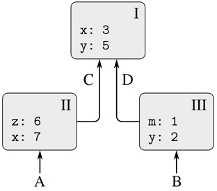

图 3.1：一个简单的环境结构。

环境对求值过程至关重要，因为它决定了表达式求值的上下文。事实上，可以说编程语言中的表达式本身没有任何意义。更确切地说，一个表达式只有在被评估的环境中才有意义。即使对像`display(1)`这样简单的表达式的解释也依赖于这样一种理解，即在名称`display`引用显示值的原始函数的上下文中操作。因此，在我们的评估模型中，我们总是说评估一个关于某些环境的表达式。为了描述与解释器的交互，我们将假设有一个全局环境，由单个框架(没有封闭环境)组成，该框架包括与原语函数相关联的名称的值。例如，`display`是基本显示函数的名称的想法是通过说名称`display`在全局环境中被绑定到基本显示函数来捕捉的。

在我们评估一个程序之前，我们用一个新的框架扩展全局环境，即程序框架，产生程序环境。我们将把程序顶层声明的名字添加到这个框架中，不在任何程序块中。然后，根据程序环境对给定程序进行评估。

### 3.2.1 评标规则

解释器如何评估函数应用程序的总体规范与我们第一次在 1.1.4 节中介绍它时保持不变:

*   要评估应用程序:
    1.  1。评估应用程序的子表达式。 [^(12)](#c3-fn-0012)
    2.  2。将函数子表达式的值应用于参数子表达式的值。

在指定将复合函数应用于自变量意味着什么时，评估的环境模型取代了替代模型。

在评估的环境模型中，函数总是由一些代码和指向环境的指针组成的一对。函数只有一种创建方式:通过计算 Lambda  表达式。这会产生一个函数，其代码从 Lambda  表达式的文本中获得，并且其环境是在其中对 Lambda  表达式进行求值以产生该函数的环境。例如，考虑函数声明

```js
function square(x) {
    return x * x;
}
```

在程序环境中评估。函数声明语法相当于基础隐式 Lambda  表达式。这就相当于使用了 [^(13)](#c3-fn-0013)

```js
const square = x => x * x;
```

该函数计算`x => x * x`并将`square`绑定到结果值，所有这些都在程序环境中完成。

图 3.2：显示了评估该声明语句的结果。全局环境包含程序环境。为了减少混乱，在这个图之后，我们将不显示全局环境(因为它总是相同的)，但是从程序环境向上的指针提醒我们它的存在。函数对象是一对，其代码指定函数有一个参数`x`和一个函数体`**return** x * x;`。函数的环境部分是一个指向程序环境的指针，因为 Lambda  表达式就是在这个环境中被求值以产生函数的。程序框架中添加了一个新的绑定，它将函数对象与名称`square`相关联。

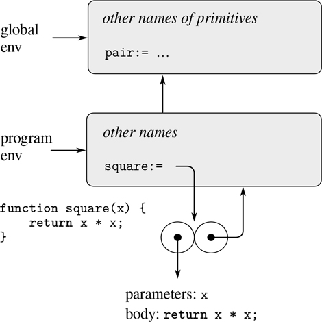

图 3.2：在程序环境中评估`**function** square(x) { **return** x * x; }`产生的环境结构。

一般来说，`const`、`**function**`、`**let**`给帧添加绑定。常量上禁止赋值，所以我们的环境模型需要区分引用常量的名称和引用变量的名称。我们通过在名字后面的冒号后面写一个等号来表示名字是一个常量。我们认为函数声明等同于常数声明； [^(14)](#c3-fn-0014) 观察图 3.2：中冒号后的等号。

现在我们已经看到了函数是如何创建的，我们可以描述函数是如何应用的。环境模型指定:要将函数应用于参数，请创建一个新环境，该环境包含一个将参数绑定到参数值的框架。这个框架的封闭环境是由函数指定的环境。现在，在这个新环境中，评估函数体。

为了说明这个规则是如何遵循的，图 3.3：举例说明了在程序环境中对表达式`square(5)`求值所创建的环境结构，其中`square`是在图 3.2：中生成的函数。应用该函数会创建一个新的环境，在图中标记为 E1，它以一个帧开始，在该帧中，函数的参数`x`被绑定到参数 5。注意，环境 E1 中的名称`x`后面是一个没有等号的冒号，这表示参数`x`被视为一个变量。 [^(15)](#c3-fn-0015) 从该框架向上的指针表示该框架的封闭环境是程序环境。这里选择程序环境，因为这是作为`square`功能对象的一部分指示的环境。在 E1，我们评估函数的主体，`**return** x * x;`。因为在 E1`x`的值是 5，所以结果是`5 * 5`，即 25。

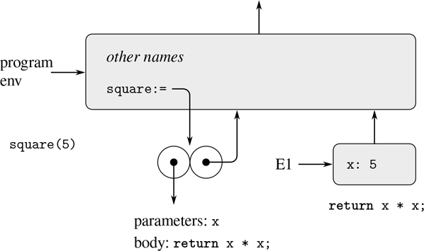

图 3.3：在程序环境中评估`square(5)`创建的环境。

函数应用的环境模型可以概括为两个规则:

*   通过构造框架，将函数的参数绑定到调用的参数，然后在构造的新环境的上下文中评估函数体，将函数对象应用于一组参数。新框架具有作为其封闭环境的正在被应用的功能对象的环境部分。应用程序的结果是对函数体求值时遇到的第一个 return 语句的 return 表达式求值的结果。
*   通过评估与给定环境相关的 Lambda  表达式来创建函数。得到的函数对象是由 Lambda  表达式的文本和指向创建函数的环境的指针组成的一对。

最后，我们指定赋值的行为，这个操作迫使我们首先引入环境模型。在某些环境中对表达式名称 `=` 值求值定位了名称在环境中的绑定。也就是说，人们找到环境中包含名称绑定的第一个帧。如果绑定是一个变量绑定——在框架中仅由名称后的`:`表示——该绑定被更改以反映变量的新值。否则，如果框架中的绑定是常量绑定——在框架中由名称后的`:=`指示——赋值发出`"assignment to constant"`错误信号。如果名字在环境中是未绑定的，那么赋值就发出一个`"variable undeclared"`错误的信号。

这些评估规则虽然比替代模型复杂得多，但仍然相当简单。此外，求值模型虽然抽象，但提供了解释器如何对表达式求值的正确描述。在第四章中，我们将看到这个模型如何作为实现一个工作解释器的蓝图。下面的部分通过分析一些说明性的程序来阐述模型的细节。

### 3.2.2 应用简单功能

当我们在 1.1.5 节中介绍替代模型时，我们展示了应用程序`f(5)`如何计算出 136，给出了以下函数声明:

```js
function square(x) {
    return x * x;
}
function sum_of_squares(x, y) {
    return square(x) + square(y);
}
function f(a) {
    return sum_of_squares(a + 1, a * 2);
}
```

我们可以使用环境模型来分析同一个示例。图 3.4：显示了通过评估程序环境中`f`、`square`和`sum_of_squares`的定义而创建的三个功能对象。每个函数对象都由一些代码和一个指向程序环境的指针组成。

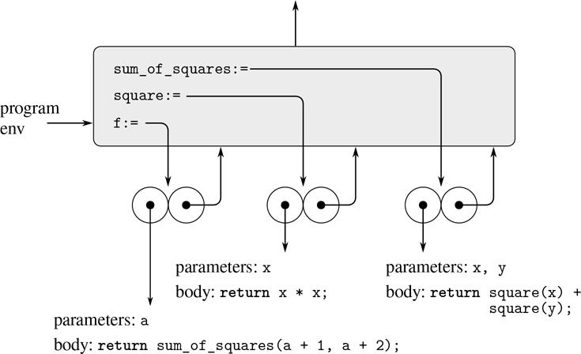

图 3.4：程序框中的功能对象。

在图 3.5：中，我们看到了通过评估表达式`f(5)`创建的环境结构。对`f`的调用创建了一个新的环境，E1，从一个帧开始，其中`f`的参数`a`被绑定到参数 5。在 E1，我们评价`f`的身体:

```js
return sum_of_squares(a + 1, a * 2);
```

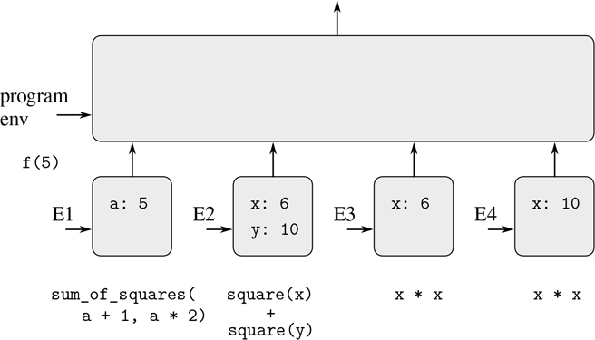

图 3.5：使用图 3.4：中的函数评估`f(5)`创建的环境。

为了评估 return 语句，我们首先评估 return 表达式的子表达式。第一个子表达式`sum_of_squares`的值是一个函数对象。(注意这个值是如何找到的:我们首先查看 E1 的第一帧，它不包含`sum_of_squares`的绑定。然后我们进入封闭环境，即程序环境，找到图 3.4：所示的绑定。)通过应用原语操作`+`和`*`来评估两个组合`a + 1`和`a * 2`以分别获得 6 和 10，来评估另外两个子表达式。

现在我们将函数对象`sum_of_squares`应用于参数 6 和 10。这导致了一个新的环境 E2，其中参数`x`和`y`被绑定到自变量。在 E2 内，我们评估该语句

```js
return square(x) + square(y);
```

这就引出了我们对`square(x)`的求值，其中`square`在程序帧中，而`x`是 6。我们再一次建立了一个新的环境，E3，其中`x`被绑定到 6，在这个环境中我们评估`square`的主体，也就是`**return** x * x;`。同样作为应用`sum_of_squares`的一部分，我们必须评估子表达式`square(y)`，其中`y`为 10。对`square`的第二次调用创建了另一个环境，E4，其中`square`的参数`x`被绑定到 10。在 E4 内部，我们必须评估`**return** x * x;`。

需要注意的重要一点是，每次对`square`的调用都会创建一个新环境，其中包含对`x`的绑定。在这里我们可以看到不同的框架是如何将名为`x`的不同局部变量分开的。注意由`square`创建的每个帧都指向程序环境，因为这是由`square`功能对象指示的环境。

在评估子表达式之后，返回结果。对`square`的两次调用产生的值由`sum_of_squares`相加，这个结果由`f`返回。因为我们在这里关注的是环境结构，所以我们不会详细讨论这些返回值是如何在调用之间传递的；然而，这也是评估过程的一个重要方面，我们将在第 5 章中详细讨论。

##### 练习 3.9

在 1.2.1 节中，我们使用替代模型来分析计算阶乘的两个函数，一个递归版本

```js
function factorial(n) {
    return n === 1
           ? 1
           : n * factorial(n - 1);
}
```

和迭代版本

```js
function factorial(n) {
    return fact_iter(1, 1, n);
}
function fact_iter(product, counter, max_count) {
    return counter > max_count
           ? product
           : fact_iter(counter * product,
                       counter + 1,
                       max_count);
}
```

显示通过使用每个版本的`factorial`函数评估`factorial(6)`创建的环境结构。 [^(16)](#c3-fn-0016)

### 3.2.3 帧作为本地状态的存储库

我们可以转向环境模型，看看如何使用函数和赋值来表示具有本地状态的对象。例如，考虑通过调用函数创建的第 3.1.1 节中的“撤销处理器”

```js
function make_withdraw(balance) {
    return amount => {
               if (balance >= amount) {
                   balance = balance - amount;
                   return balance;
               } else {
                   return "insufficient funds";
               }
           };
}
```

让我们描述一下对…的评价

```js
const W1 = make_withdraw(100); 
```

然后

```js
W1(50);
50
```

图 3.6：显示了在程序环境中声明`make_withdraw`函数的结果。这产生了一个包含指向程序环境的指针的函数对象。到目前为止，这与我们已经看到的例子没有什么不同，只是函数体中的返回表达式本身是一个 Lambda  表达式。

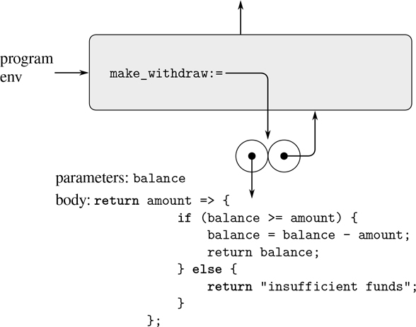

图 3.6：在程序环境中定义`make_withdraw`的结果。

当我们将函数`make_withdraw`应用于一个论点时，计算的有趣部分发生了:

```js
const W1 = make_withdraw(100);
```

像往常一样，我们首先建立一个环境 E1，其中参数`balance`被绑定到参数 100。在这个环境中，我们评估`make_withdraw`的主体，即返回表达式是 Lambda  表达式的返回语句。对这个 Lambda  表达式的求值构造了一个新的 function 对象，其代码由 Lambda  表达式指定，其环境是 E1，即在其中对 Lambda  表达式求值以产生函数的环境。结果函数对象是调用`make_withdraw`返回的值。这在程序环境中被绑定到`W1`，因为常量声明本身在程序环境中被评估。图 3.7：显示了最终的环境结构。

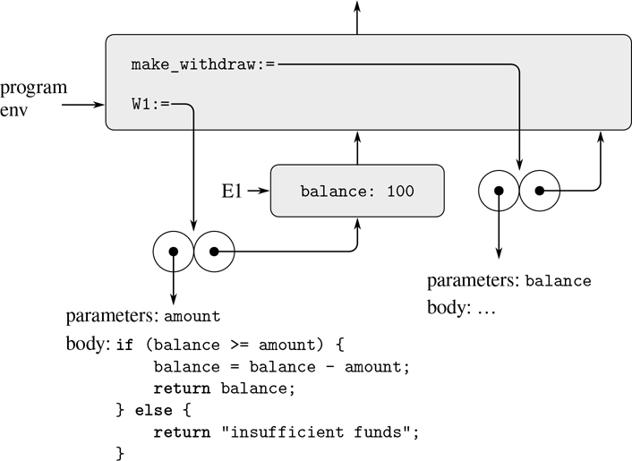

图 3.7：评估`const W1 = make_withdraw(100);`的结果。

现在我们可以分析当`W1`应用于一个论点时会发生什么:

```js
W1(50);
50
```

我们首先构建一个框架，其中`W1`的参数`amount`被绑定到参数 50。要观察的关键点是这个框架的封闭环境不是程序环境，而是环境 E1，因为这是由`W1`功能对象指定的环境。在这个新环境中，我们评估函数体:

```js
if (balance >= amount) {
    balance = balance - amount;
    return balance;
} else {
    return "insufficient funds";
}
```

由此产生的环境结构如图 3.8：所示。被求值的表达式同时引用了`amount`和`balance`。变量`amount`将在环境中的第一帧中找到，而`balance`将通过跟随包围环境指针到 E1 找到。

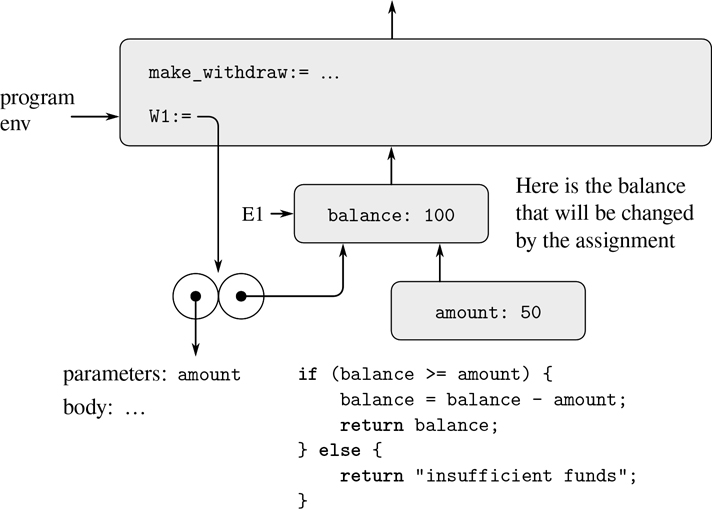

图 3.8：应用功能对象`W1`创建的环境。

当赋值被执行时，`balance`在 E1 的绑定被改变。在完成对`W1`的调用时，`balance`为 50，包含`balance`的框架仍然被函数对象`W1`指向。绑定`amount`的框架(我们在其中执行了改变`balance`的代码)不再相关，因为构建它的函数调用已经终止，并且没有从环境的其他部分指向该框架的指针。下次调用`W1`时，这将构建一个绑定`amount`的新框架，其封闭环境是 E1。我们看到 E1 作为“位置”来保存函数对象`W1`的本地状态变量。图 3.9：显示了调用`W1`后的情况。

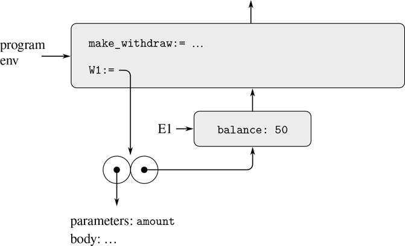

图 3.9：环境调用到`W1`后。

观察当我们通过再次调用`make_withdraw`创建第二个“撤回”对象时会发生什么:

```js
const W2 = make_withdraw(100);
```

这就产生了图 3.10：的环境结构，说明`W2`是一个函数对象，也就是一对带有一些代码和一个环境。`W2`的环境 E2 是通过调用`make_withdraw`创建的。它包含一个具有自己的本地绑定的框架用于`balance`。另一方面，`W1`和`W2`具有相同的代码:由`make_withdraw`主体中的 Lambda  表达式指定的代码。 [^(17)](#c3-fn-0017) 我们在这里看到为什么`W1`和`W2`表现为独立的对象。对`W1`的调用引用存储在 E1 的状态变量`balance`，而对`W2`的调用引用存储在 E2 的`balance`。因此，对一个对象的本地状态的更改不会影响另一个对象。

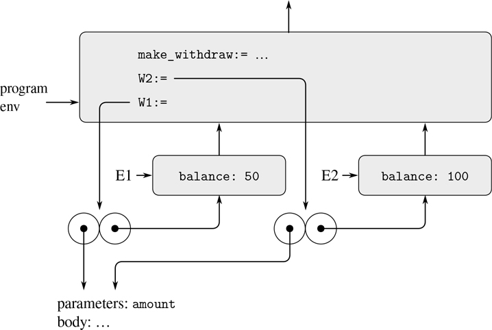

图 3.10：使用`const W2 = make_withdraw(100);`创建第二个对象。

##### 练习 3.10

在`make_withdraw`功能中，本地变量`balance`被创建为`make_withdraw`的参数。我们也可以单独创建本地状态变量，使用我们称之为的立即调用 Lambda  表达式，如下所示:

```js
function make_withdraw(initial_amount) {
    return (balance =>
              amount => {
                  if (balance >= amount) {
                      balance = balance - amount;
                      return balance;
                   } else {
                      return "insufficient funds";
                   }
              })(initial_amount);
}
```

外部 Lambda  表达式在计算后会立即被调用。它的唯一目的是创建一个局部变量`balance`并将其初始化为`initial_amount`。使用环境模型来分析这个`make_withdraw`的替代版本，绘制如上图来说明交互

```js
const W1 = make_withdraw(100);

W1(50);

const W2 = make_withdraw(100);
```

展示两个版本的`make_withdraw`用相同的行为创建对象。这两个版本的环境结构有何不同？

### 3.2.4 内部声明

在这一节中，我们处理函数体或其他包含声明的块(如条件语句的分支)的求值。每个块为块中声明的名称打开一个新的范围。为了在给定的环境中评估一个块，我们通过一个新的框架来扩展该环境，该框架包含在块的主体中直接声明的所有名称(即，在嵌套块之外),然后在新构建的环境中评估主体。

第 1.1.8 节介绍了函数可以有内部声明的思想，从而导致了如下计算平方根的函数中的块结构:

```js
function sqrt(x) {
   function is_good_enough(guess) {
      return abs(square(guess) - x) < 0.001;
   }
   function improve(guess) {
      return average(guess, x / guess);
   }
   function sqrt_iter(guess){
      return is_good_enough(guess)
             ? guess
             : sqrt_iter(improve(guess));
   }
   return sqrt_iter(1);
}
```

现在我们可以使用环境模型来看看为什么这些内部声明的行为符合预期。图 3.11：显示了在表达式`sqrt(2)`的求值中，内部函数`is_good_enough`在`guess`等于 1 时第一次被调用的点。

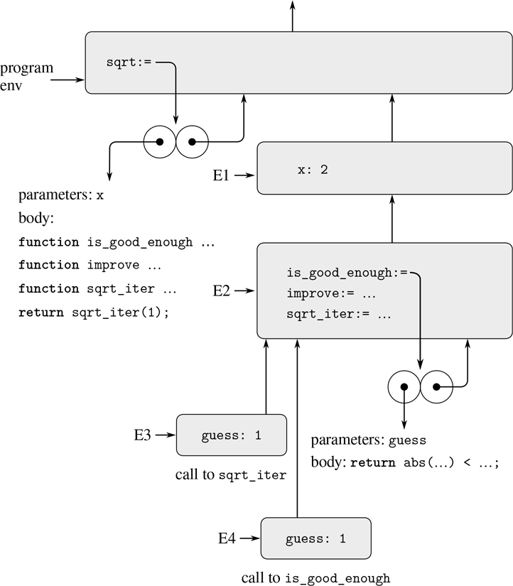

图 3.11：`sqrt`功能同内部声明。

观察环境的结构。名称`sqrt`在程序环境中被绑定到一个函数对象，该函数对象的关联环境是程序环境。当调用`sqrt`时，形成了一个新的环境，E1，从属于程序环境，其中参数`x`被绑定到 2。然后在 E1 对`sqrt`的车身进行了评估。该主体是一个具有局部函数声明的块，因此 E1 用这些声明的新框架进行了扩展，产生了新的环境 E2。然后在 E2 中评估块体。因为正文中的第一条语句是

```js
function is_good_enough(guess) {
    return abs(square(guess) - x) < 0.001;
}
```

评估这个声明在环境 E2 中创建了函数`is_good_enough`。更准确地说，E2 的第一帧中的名称`is_good_enough`被绑定到一个函数对象，该函数对象的关联环境是 E2。类似地，`improve`和`sqrt_iter`被定义为 E2 的函数。为简明起见，图 3.11：只显示了`is_good_enough`的功能对象。

在局部函数被定义之后，表达式`sqrt_iter(1)`被评估，仍然在环境 E2 中。于是 E2 里绑定到`sqrt_iter`的函数对象被调用，参数为 1。这创建了一个环境 E3，其中`sqrt_iter`的参数`guess`被绑定到 1。函数`sqrt_iter`依次调用`is_good_enough`，用`guess`(来自 E3)的值作为`is_good_ enough`的参数。这建立了另一个环境，E4，其中`guess`(`is_good_enough`的参数)被绑定到 1。虽然`sqrt_iter`和`is_good_enough`都有一个名为`guess`的参数，但这是位于不同帧中的两个不同的局部变量。同样，E3 和 E4 都有 E2 作为它们的封闭环境，因为`sqrt_iter`和`is_good_enough`函数都有 E2 作为它们的环境部分。这样做的一个结果是出现在`is_ good_enough`主体中的名字`x`将引用出现在 E1 的`x`的绑定，即调用原始`sqrt`函数的`x`的值。

因此，环境模型解释了使局部函数声明成为模块化程序的有用技术的两个关键属性:

*   局部函数的名称不会干扰封闭函数外部的名称，因为局部函数的名称将被绑定在块求值时创建的框架中，而不是被绑定在程序环境中。
*   局部函数可以访问封闭函数的参数，只需使用参数名作为自由名称。这是因为局部函数的主体是在从属于封闭函数的评估环境的环境中评估的。

##### 练习 3.11

在 3.2.3 节中，我们看到了环境模型如何描述具有本地状态的函数的行为。现在我们已经看到了内部声明是如何工作的。典型的消息传递函数包含这两个方面。考虑第 3.1.1 节的银行账户功能:

```js
function make_account(balance) {
    function withdraw(amount) {
        if (balance >= amount) {
            balance = balance - amount;
            return balance;
        } else {
            return "Insufficient funds";
        }
    }
    function deposit(amount) {
        balance = balance + amount;
        return balance;
    }
    function dispatch(m) {
        return m === "withdraw"
               ? withdraw
               : m === "deposit"
               ? deposit
               : "Unknown request: make_account";
    }
    return dispatch;
}
```

显示由交互序列产生的环境结构

```js
const acc = make_account(50);

acc("deposit")(40);
90

acc("withdraw")(60);
30
```

`acc`的本地状态保存在哪里？假设我们定义另一个帐户

```js
const acc2 = make_account(100);
```

两个帐户的本地状态如何保持不同？环境结构的哪些部分是`acc`和`acc2`共享的？

##### 关于块的更多信息

正如我们看到的，在`sqrt`中声明的名字的范围是`sqrt`的整体。这解释了为什么相互递归能够工作，就像用这种(相当浪费的)方式检查一个非负整数是否是偶数一样。

```js
function f(x) {
    function is_even(n) {
        return n === 0
               ? true
               : is_odd(n - 1);
    }
    function is_odd(n) {
        return n === 0
               ? false
               : is_even(n - 1);
    }
    return is_even(x);
}
```

在调用`f`的过程中，当`is_even`被调用时，环境图看起来类似于调用`sqrt_iter`时的图 3.11：中的环境图。函数`is_even`和`is_odd`在 E2 中被绑定到指向 E2 的函数对象，作为评估这些函数调用的环境。因此`is_even`体中的`is_odd`指的是正确的函数。虽然`is_odd`是在`is_even`之后定义的，但这与在`sqrt_iter`的主体中名称`improve`和名称`sqrt_iter`本身引用正确的函数没有什么不同。

有了处理块内声明的方法，我们可以在顶层重新访问名字的声明。在 3.2.1 节中，我们看到在顶层声明的名字被添加到程序框架中。更好的解释是，整个程序放在一个隐式块中，在全局环境中进行求值。然后，上面描述的对块的处理处理顶层:全局环境由一个框架扩展，该框架包含隐式块中声明的所有名称的绑定。该框架是程序框架，而产生的环境是程序环境。

我们说过，块的主体是在包含所有直接在块主体中声明的名称的环境中进行评估的。当进入块时，本地声明的名称被放入环境中，但没有关联的值。在评估程序块主体期间评估其声明，然后将评估表达式的结果分配给名称到`=`的右边，就好像该声明是一个赋值一样。由于将名字添加到环境中与对声明的求值是分开的，并且整个块都在名字的作用域内，所以一个错误的程序可能会试图在对其声明求值之前访问名字的值；对一个未赋值的名字的评估表明一个错误。 [^(18)](#c3-fn-0018)

## 3.3 可变数据建模

第 2 章讨论了复合数据作为一种方法，用于构造包含几个部分的计算对象，以便对包含几个方面的真实世界对象进行建模。在那一章中，我们介绍了数据抽象的原则，根据这一原则，数据结构是根据创建数据对象的构造器和访问复合数据对象的选择器来指定的。但是我们现在知道了第二章没有提到的数据的另一个方面。对由具有变化状态的对象组成的系统进行建模的愿望导致我们需要修改复合数据对象，以及从它们中进行构造和选择。为了对具有变化状态的复合对象建模，我们将设计数据抽象，除了选择器和构造器之外，还包括称为变异器的操作，它们修改数据对象。例如，建模一个银行系统需要我们改变账户余额。因此，用于表示银行账户的数据结构可能允许操作

```js
set_balance(account, new-value)
```

这将指定账户的余额更改为指定的新值。为其定义了赋值函数的数据对象被称为可变数据对象。

第 2 章介绍了偶对作为合成复合数据的通用“粘合剂”。我们从定义对的基本赋值器开始这一节，这样对就可以作为构建可变数据对象的构件。这些变异函数极大地增强了对的表示能力，使我们能够构建不同于 2.2 节中使用的序列和树的数据结构。我们也展示了一些模拟的例子，其中复杂系统被模拟为具有本地状态的对象的集合。

### 3.3.1 可变列表结构

对对的基本操作——`pair`、`head`、`tail`——可以用来构造链表结构和从链表结构中选择零件，但不能修改链表结构。我们到目前为止使用的列表操作也是如此，比如`append`和`list`，因为它们可以用`pair`、`head`和`tail`来定义。为了修改列表结构，我们需要新的操作。

成对的基本变异器是`set_head`和`set_tail`。函数`set_head`有两个参数，第一个必须是一对。它修改这一对，用指向第二个参数`set_head`的指针替换`head`指针。 [^(19)](#c3-fn-0019)

举个例子，假设`x`被绑定到`list(list("a", "b"), "c", "d")`，`y`被绑定到`list("e", "f")`，如图 3.12：所示。对表达式`set_head(x, y)`求值会修改`x`绑定到的对，用`y`的值替换它的`head`。操作结果如图 3.13：所示。结构`x`已经修改，现在等同于`list(list("e", "f"), "c", "d")`。由被替换的指针标识的代表列表`list("a", "b")`的对现在从原始结构中分离出来。 [^(20)](#c3-fn-0020)

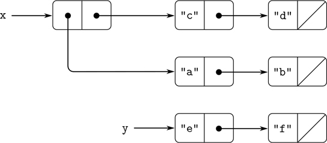

图 3.12：列出了`x`:`list(list("a", "b"), "c", "d")``y`:`list("e", "f")`。

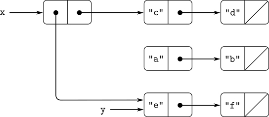

图 3.13：图 3.12 中`set_head(x, y)`对列表的影响。

将图 3.13：与图 3.14：进行比较，说明执行的结果

```js
const z = pair(y, tail(x));
```

将`x`和`y`绑定到图 3.12 的原列表中。名称`z`现在被绑定到由`pair`操作创建的新对；`x`绑定的列表不变。`set_tail`的操作与`set_head`类似。唯一不同的是，替换的是指针对的`tail`指针，而不是`head`指针。执行`set_tail(x, y)`对图 3.12：列表的影响如图 3.15：所示。这里`x`的`tail`指针已经被指向`list("e", "f")`的指针所取代。还有，曾经是`x`的`tail`的列表`list("c", "d")`，现在脱离了结构。

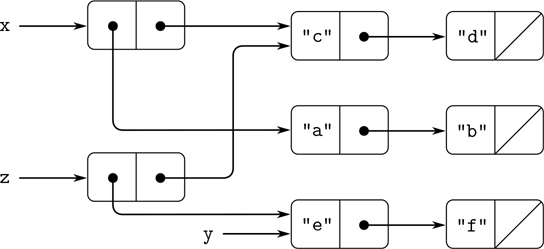

图 3.14：图 3.12 中`const z = pair(y, tail(x));`对列表的影响。

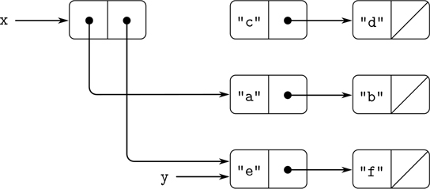

图 3.15：图 3.12 中`set_tail(x, y)`对列表的影响。

函数`pair`通过创建新的对来构建新的列表结构，而`set_ head`和`set_tail`修改现有的对。事实上，我们可以用两个变异函数和一个函数`get_new_pair`来实现`pair`，该函数返回一个不属于任何现有列表结构的新对。我们获得新对，设置其指向指定对象的`head`和`tail`指针，并返回新对作为`pair`的结果。 [^(21)](#c3-fn-0021)

```js
function pair(x, y) {
    const fresh = get_new_pair();
    set_head(fresh, x);
    set_tail(fresh, y);
    return fresh;
}
```

##### 练习 3.12

第 2.2.1 节介绍了用于追加列表的以下函数:

```js
function append(x, y) {
    return is_null(x)
           ? y
           : pair(head(x), append(tail(x), y));
}
```

函数`append`通过将`x`的元素连续邻接到`y`的前面来形成一个新的列表。函数`append_mutator`类似于`append`，但它是一个赋值函数而不是构造函数。它通过将列表拼接在一起来追加列表，修改最后一对`x`，使得它的`tail`现在是`y`。(空`x`调用`append_mutator`是错误的。)

```js
function append_mutator(x, y) {
    set_tail(last_pair(x), y);
    return x;
}
```

这里的`last_pair`是一个返回其参数中最后一对的函数:

```js
function last_pair(x) {
    return is_null(tail(x))
          ? x
          : last_pair(tail(x));
}
```

考虑互动

```js
const x = list("a", "b");

const y = list("c", "d");

const z = append(x, y);

z;
["a", ["b", ["c", ["d, null]]]]

tail(x);
response

const w = append_mutator(x, y);

w;
["a", ["b", ["c", ["d", null]]]]

tail(x);
response
```

有哪些遗漏的响应 s？画出方框图和指针图来解释你的答案。

##### 练习 3.13

考虑下面的`make_cycle`函数，它使用了练习 3.12 中定义的`last_pair`函数:

```js
function make_cycle(x) {
    set_tail(last_pair(x), x);
    return x;
}
```

画一个方框指针图，显示由

```js
const z = make_cycle(list("a", "b", "c"));
```

如果我们尝试计算`last_pair(z)`会发生什么？

##### 练习 3.14

下面的函数非常有用，尽管很难理解:

```js
function mystery(x) {
    function loop(x, y) {
        if (is_null(x)) {
            return y;
        } else {
            const temp = tail(x);
            set_tail(x, y);
            return loop(temp, x);
        }
    }
    return loop(x, null);
}
```

函数`loop`使用“临时”名称`temp`保存`x`的`tail`的旧值，因为下一行的`set_tail`破坏了`tail`。解释一下`mystery`一般是做什么的。假设`v`由下式定义

```js
const v = list("a", "b", "c", "d");
```

画出表示`v`所绑定列表的方框指针图。假设我们现在评估

```js
const w = mystery(v);
```

评估该程序后，绘制显示结构`v`和`w`的盒指针图。什么会被打印成`v`和`w`的值？

##### 分享和认同

我们在 3.1.3 节中提到了由赋值的引入引起的“相同”和“变化”的理论问题。在实践中，当单个数据对在不同的数据对象之间被共享时，这些问题就会出现。例如，考虑由以下各项构成的结构

```js
const x = list("a", "b");
const z1 = pair(x, x);
```

如图 3.16：所示，`z1`为一对，其`head`和`tail`均指向同一对`x`。由`z1`的`head`和`tail`共享`x`是`pair`实现的直接方式的结果。一般来说，使用`pair`来构建列表将会产生一个互连的对结构，其中许多单独的对被许多不同的结构共享。

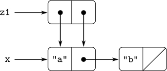

图 3.16：由`pair(x, x)`组成的列表`z1`。

与图 3.16：相比，图 3.17：显示了由创建的结构

```js
const z2 = pair(list("a", "b"), list("a", "b"));
```

在这个结构中，两个`list("a", "b")`列表中的对是不同的，尽管它们包含相同的字符串。 [^(22)](#c3-fn-0022)

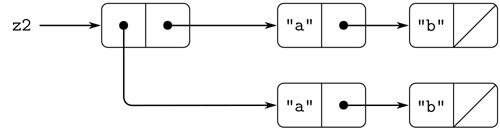

图 3.17：由`pair(list("a", "b"), list("a", "b"))`组成的列表`z2`。

当被认为是一个列表时，`z1`和`z2`都表示“同一个”列表:

```js
list(list("a", "b"), "a", "b")
```

一般来说，如果我们只使用`pair`、`head`和`tail`对列表进行操作，共享是完全检测不到的。然而，如果我们允许列表结构上的变异，共享就变得很重要。作为共享所能产生的差异的一个例子，考虑下面的函数，它修改了应用它的结构的`head`:

```js
function set_to_wow(x) {
    set_head(head(x), "wow");
    return x;
}
```

即使`z1`和`z2`是“相同”的结构，对它们应用`set_to_wow`会产生不同的结果。对于`z1`，改变`head`也会改变`tail`，因为在`z1`中`head`和`tail`是同一对。使用`z2`时，`head`和`tail`是不同的，所以`set_to_wow`只修改`head`:

```js
z1;
[["a", ["b", null]], ["a", ["b", null]]]

set_to_wow(z1);
[["wow", ["b", null]], ["wow", ["b", null]]]

z2;
[["a", ["b", null]], ["a", ["b", null]]]

set_to_wow(z2);
[["wow", ["b", null]], ["a", ["b", null]]]
```

检测列表结构中共享的一种方法是使用原始谓词`===`，我们在 1.1.6 节中引入它来测试两个数字是否相等，并在 2.3.1 节中扩展它来测试两个字符串是否相等。当应用于两个非本原值时，`x === y`测试`x`和`y`是否是同一个对象(即`x`和`y`作为指针是否相等)。因此，`z1`和`z2`如图 3.16 和 3.17 所示，`head(z1) === tail(z1)`为真，`head(z2) === tail(z2)`为假。

正如我们将在下面的章节中看到的，我们可以利用共享来极大地扩展可以用偶对表示的数据结构。另一方面，共享也可能是危险的，因为对结构的修改也会影响碰巧共享修改部分的其他结构。变异操作`set_head`和`set_tail`应该小心使用；除非我们很好地理解我们的数据对象是如何共享的，否则突变可能会产生意想不到的结果。 [^(23)](#c3-fn-0023)

##### 练习 3.15

画方框图和指针图来解释`set_to_wow`对上面`z1`和`z2`结构的影响。

##### 练习 3.16

Ben Bitdiddle 决定写一个函数来计算任何列表结构中的对数。“这很容易，”他解释道。“任何结构中的对数都是`head`中的数加上`tail`中的数再加一来计算当前对数。”所以本写了下面的函数

```js
function count_pairs(x) {
    return ! is_pair(x)
           ? 0
           : count_pairs(head(x)) +
             count_pairs(tail(x)) + 1;
}
```

说明这个函数不正确。特别是，画出表示列表结构的盒指针图，该列表结构正好由三对组成，Ben 的函数将返回 3；返回 4；return 7；再也不回来了。

##### 练习 3.17

设计练习 3.16 的`count_pairs`函数的正确版本，该函数返回任何结构中不同对的数量。(提示:遍历该结构，维护一个辅助数据结构，用于跟踪哪些对已经被计数。)

##### 练习 3.18

编写一个函数来检查一个列表，并确定它是否包含一个循环，也就是说，一个试图通过获取连续的`tail`来找到列表末尾的程序是否会进入一个无限循环。练习 3.13 构建了这样的列表。

##### 练习 3.19

使用只占用恒定空间的算法重做练习 3.18。(这需要非常巧妙的想法。)

##### 变异只是任务

当我们引入复合数据时，我们在第 2.1.3 节中观察到，配对可以纯粹用函数来表示:

```js
function pair(x, y) {
    function dispatch(m) {
    return m === "head"
           ? x
           : m === "tail"
           ? y
           : error(m, "undefined operation – pair");
    }
    return dispatch;
}
function head(z) { return z("head"); }
function tail(z) { return z("tail"); }
```

对于可变数据也是如此。我们可以使用赋值和局部状态将可变数据对象实现为函数。例如，我们可以扩展上面的 pair 实现来处理`set_head`和`set_tail`，方式类似于我们在 3.1.1 节中使用`make_account`实现银行账户的方式:

```js
function pair(x, y) {
    function set_x(v) { x = v; }
    function set_y(v) { y = v; }
    return m => m === "head"
                ? x
                : m === "tail"
                ? y
                : m === "set_head"
                ? set_x
                : m === "set_tail"
                ? set_y
                : error(m, "undefined operation – pair");
}
function head(z) { return z("head"); }
function tail(z) { return z("tail"); }
function set_head(z, new_value) {
    z("set_head")(new_value);
    return z;
}
function set_tail(z, new_value) {
    z("set_tail")(new_value);
    return z;
}
```

理论上，赋值是解释可变数据行为所需要的。一旦我们承认了语言的赋值，我们就提出了所有的问题，不仅仅是赋值，还有一般的可变数据。 [^(24)](#c3-fn-0024)

##### 练习 3.20

画出环境图来说明对语句序列的评估

```js
const x = pair(1, 2);
const z = pair(x, x);
set_head(tail(z), 17);

head(x);
17
```

使用上面给出的对的功能实现。(对比练习 3.11。)

### 3.3.2 代表队列

变异子`set_head`和`set_tail`使我们能够使用成对来构造数据结构，这些数据结构不能单独用`pair`、`head`和`tail`来构建。本节展示了如何使用对来表示一个称为队列的数据结构。3.3.3 节将展示如何表示称为表的数据结构。

队列是从一端(称为队列的后)插入项目，从另一端(队列的前)删除项目的序列。图 3.18：显示了一个最初为空的队列，其中插入了物品`a`和`b`。然后移除`a`，插入`c`和`d`，移除`b`。因为项目总是按照它们被插入的顺序被移除，所以队列有时被称为先进先出缓冲器。

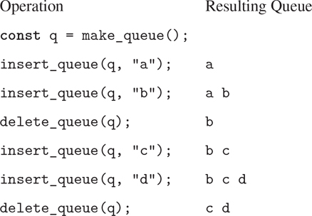

图 3.18：队列操作。

就数据抽象而言，我们可以将队列视为由以下一组操作定义的:

*   a constructor:

    `make_queue`()

    返回一个空队列(不包含任何项目的队列)。

*   a predicate:

    `is_empty_queue` ( 队列 )

    测试队列是否为空。

*   a selector:

    `front_queue` ( 队列 )

    返回队列前面的对象，如果队列为空，则发出出错信号。它不会修改队列。

*   two mutators:

    `insert_queue` ( 队列 ， 条目 )

    将该项插入队列的尾部，并将修改后的队列作为其值返回。

    `delete_queue` ( 队列 )

    移除队列前面的项，并将修改后的队列作为其值返回，如果队列在删除前为空，则发出出错信号。

因为队列是一个项目序列，我们当然可以把它表示为一个普通的列表；队列的前面是列表的`head`,在队列中插入一个条目相当于在列表的末尾添加一个新元素，从队列中删除一个条目只是取列表的`tail`。然而，这种表示是低效的，因为为了插入一个条目，我们必须扫描列表，直到到达末尾。因为我们扫描列表的唯一方法是通过连续的`tail`操作，所以这种扫描需要θ(n)步来扫描一个包含`n`个项目的列表。对列表表示的简单修改通过允许队列操作被实现为它们需要θ(1)步来克服这个缺点；也就是说，所需的步数与队列长度无关。

列表表示的困难在于需要扫描以找到列表的结尾。我们需要扫描的原因是，虽然将列表表示为一串对的标准方式很容易为我们提供指向列表开头的指针，但它没有提供指向列表结尾的容易访问的指针。避免这一缺点的修改是将队列表示为一个列表，以及一个指示列表中最后一对的附加指针。这样，当我们插入一个条目时，我们可以参考后面的指针，从而避免扫描列表。

然后，队列被表示为一对指针，`front_ptr`和`rear_ptr`，它们分别指示普通列表中的第一对和最后一对。因为我们希望队列是一个可识别的对象，所以我们可以使用`pair`来组合这两个指针。因此，队列本身将是两个指针的`pair`。图 3.19：说明了这种表示。

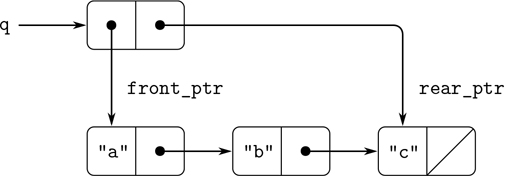

图 3.19：实现一个队列作为一个有前后指针的链表。

为了定义队列操作，我们使用以下函数，这些函数使我们能够选择和修改队列的前后指针:

```js
function front_ptr(queue) { return head(queue); }
function rear_ptr(queue) { return tail(queue); }
function set_front_ptr(queue, item) { set_head(queue, item); }
function set_rear_ptr(queue, item) { set_tail(queue, item); }
```

现在我们可以实现实际的队列操作了。如果一个队列的前端指针是空列表，我们就认为它是空的:

```js
function is_empty_queue(queue) { return is_null(front_ptr(queue)); }
```

`make_queue`构造函数返回一个初始为空的队列，其`head`和`tail`都是空列表:

```js
function make_queue() { return pair(null, null); }
```

为了选择队列前面的项目，我们返回由前面指针指示的对的`head`:

```js
function front_queue(queue) {
    return is_empty_queue(queue)
           ? error(queue, "front_queue called with an empty queue")
           : head(front_ptr(queue));
}
```

要在队列中插入一个项目，我们遵循图 3.20 中[所示的方法。我们首先创建一个新对，其`head`是要插入的条目，其`tail`是空列表。如果队列最初是空的，我们将队列的前后指针设置为这个新的指针对。否则，我们修改队列中的最后一对，使其指向新的一对，并且还将后端指针设置为指向新的一对。](#c3-fig-0020)

```js
function insert_queue(queue, item) {
    const new_pair = pair(item, null);
    if (is_empty_queue(queue)) {
        set_front_ptr(queue, new_pair);
        set_rear_ptr(queue, new_pair);
    } else {
        set_tail(rear_ptr(queue), new_pair);
        set_rear_ptr(queue, new_pair);
    }
    return queue;
}
```

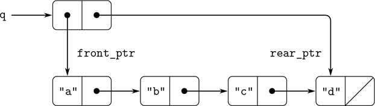

图 3.20：在图 3.19：的队列上使用`insert_queue(q, "d")`的结果。

要删除队列前面的项目，我们只需修改前面的指针，使其现在指向队列中的第二个项目，这可以通过跟随第一个项目的`tail`指针找到(参见图 3.21：):[^(25)](#c3-fn-0025)

```js
function delete_queue(queue) {
    if (is_empty_queue(queue)) {
        error(queue, "delete_queue called with an empty queue");
    } else {
        set_front_ptr(queue, tail(front_ptr(queue)));
        return queue;
    }
}
```

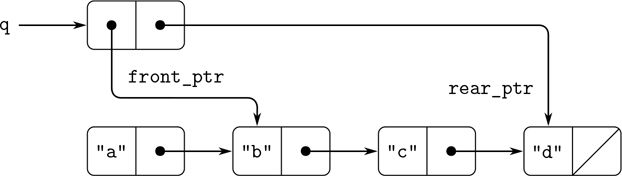

图 3.21：在图 3.20：的队列上使用`delete_queue(q)`的结果。

##### 练习 3.21

Ben Bitdiddle 决定测试上面描述的队列实现。他在 JavaScript 解释器中输入函数，然后开始尝试:

```js
const q1 = make_queue();

insert_queue(q1, "a");
[["a", null], ["a", null]]

insert_queue(q1, "b");
[["a", ["b", null]], ["b", null]]

delete_queue(q1);
[["b", null], ["b", null]]

delete_queue(q1);
[null, ["b", null]]
```

“都是错的！”他抱怨道。解释器的响应显示最后一项被插入队列两次。当我删除这两个条目时，第二个`b`仍然存在，所以队列不是空的，尽管它应该是空的。”伊娃·卢阿托尔暗示本误解了正在发生的事情。“这并不是说这些商品会两次进入队列，”她解释道。“只是标准的 JavaScript 打印机不知道如何理解队列表示。如果您想看到队列被正确打印，您必须为队列定义自己的打印函数。解释伊娃·卢在说什么。特别是，展示为什么本的例子产生了他们所做的打印结果。定义一个函数`print_queue`，它将一个队列作为输入，并打印队列中的项目序列。

##### 练习 3.22

我们可以将队列构建为具有本地状态的函数，而不是将队列表示为一对指针。本地状态将由指向普通列表开头和结尾的指针组成。因此，`make_queue`函数将具有以下形式

```js
function make_queue() {
    let front_ptr = . . .;
    let rear_ptr = . . .;
    〈declarations of internal functions〉
    function dispatch(m) {. . .}
    return dispatch;
}
```

完成`make_queue`的定义，并使用该表示提供队列操作的实现。

##### 练习 3.23

一个队列(“双端队列”)是一个序列，在该序列中，可以在前端或后端插入和删除项目。对 deques 的操作有构造函数`make_deque`、谓词`is_empty_deque`、选择器`front_deque`和`rear_deque`，以及变异函数`front_insert_deque`、`front_delete_deque`、`rear_insert_deque`和`rear_delete_ deque`。展示如何使用对来表示 deques，并给出操作的实现。 [^(26)](#c3-fn-0026) 所有操作都要在θ(1)步中完成。

### 3.3.3 代表表格

当我们在第 2 章中学习表示集合的各种方法时，我们在 2.3.3 节中提到了维护由标识键索引的记录表的任务。在 2.4.3 节的数据导向编程的实现中，我们广泛使用了二维表，其中的信息使用两个键来存储和检索。这里我们看到如何将表构建为可变列表结构。

我们首先考虑一个一维表，其中每个值都存储在一个键下。我们将该表实现为一个记录列表，每个记录都被实现为一个由一个键和相关值组成的对。这些记录成对粘在一起形成一个列表，其`head`指向连续的记录。这些胶合对被称为工作台的支柱。为了在向表中添加新记录时有一个可以改变的地方，我们将表构建为一个标题为的列表。有标题的列表在开头有一个特殊的主干对，它保存一个虚拟的“记录”——在这个例子中是任意选择的字符串`"*table*"`。图 3.22：显示了表格的盒指针图

```js
a: 1
b: 2
c: 3
```

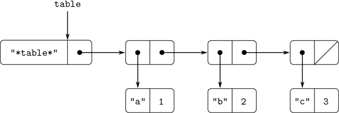

图 3.22：以表头列表表示的表格。

为了从表中提取信息，我们使用了`lookup`函数，该函数将一个键作为参数，并返回相关的值(如果该键下没有存储值，则返回`undefined`)。函数`lookup`是根据`assoc`操作定义的，它需要一个键和一列记录作为参数。注意`assoc`不会看到虚拟记录。函数`assoc`返回给定键作为其`head`的记录。 [^(27)](#c3-fn-0027) 然后函数`lookup`检查`assoc`返回的结果记录是否不是`undefined`，并返回该记录的值(T12)。

```js
function lookup(key, table) {
    const record = assoc(key, tail(table));
    return is_undefined(record)
           ? undefined
           : tail(record);
}
function assoc(key, records) {
    return is_null(records)
           ? undefined
           : equal(key, head(head(records)))
           ? head(records)
           : assoc(key, tail(records));
}
```

要在指定键下的表中插入一个值，我们首先使用`assoc`来查看表中是否已经有一个具有该键的记录。如果没有，我们通过`pair`将键与值进行运算来形成一个新记录，并将其插入到表的记录列表的开头，在虚拟记录之后。如果已经有一个带有这个键的记录，我们将这个记录的`tail`设置为指定的新值。表格的标题为我们提供了一个固定的修改位置，以便插入新的记录。 [^(28)](#c3-fn-0028)

```js
function insert(key, value, table) {
    const record = assoc(key, tail(table));
    if (is_undefined(record)) {
        set_tail(table,
                 pair(pair(key, value), tail(table)));
    } else {
        set_tail(record, value);
    }
    return "ok";
}
```

要构建一个新表，我们只需创建一个只包含字符串`"*table*"`的列表:

```js
function make_table() {
    return list("*table*");
}
```

##### 二维表格

在二维表中，每个值由两个键索引。我们可以将这样的表构造为一维表，其中每个键标识一个子表。图 3.23：显示了表格的盒指针图

```js
"math":
    "+": 43
    "-": 45
    "*": 42
"letters":
    "a": 97
    "b": 98
```

它有两个子表。(子表不需要特殊的头字符串，因为标识子表的键就是为了这个目的。)

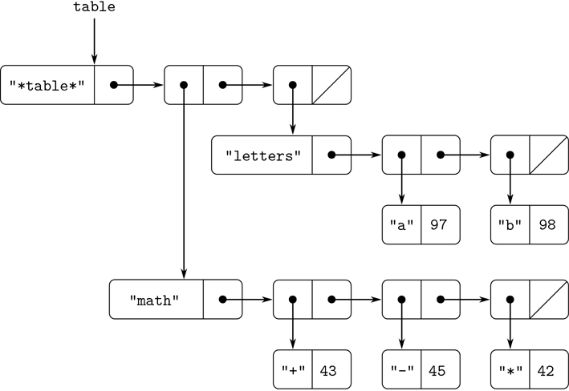

图 3.23：一个二维表格。

当我们查找一个条目时，我们使用第一个键来标识正确的子表。然后，我们使用第二个键来标识子表中的记录。

```js
function lookup(key_1, key_2, table) {
    const subtable = assoc(key_1, tail(table));
    if (is_undefined(subtable)) {
        return undefined;
    } else {
        const record = assoc(key_2, tail(subtable));
        return is_undefined(record)
               ? undefined
               : tail(record);
    }
}
```

为了在一对键下插入一个新条目，我们使用`assoc`来查看在第一个键下是否存储了一个子表。如果没有，我们构建一个包含单个记录(`key_2`、`value`)的新的子表，并将其插入到第一个键下的表中。如果 a

第一个键的子表已经存在，我们使用上述一维表的插入方法将新记录插入到这个子表中:

```js
function insert(key_1, key_2, value, table) {
    const subtable = assoc(key_1, tail(table));
    if (is_undefined(subtable)) {
        set_tail(table,
                 pair(list(key_1, pair(key_2, value)), tail(table)));
    } else {
        const record = assoc(key_2, tail(table));
        if (is_undefined(record)) {
            set_tail(subtable,
                     pair(pair(key_2, value), tail(subtable)));
        } else {
            set_tail(record, value);
        }
    }
    return "ok";
}
```

##### 创建本地表

上面定义的`lookup`和`insert`操作将表格作为参数。这使我们能够使用访问多个表的程序。处理多个表的另一种方法是为每个表设置单独的`lookup`和`insert`函数。我们可以通过将一个表程序化地表示为一个对象来做到这一点，该对象将一个内部表作为其本地状态的一部分来维护。当发送一个适当的消息时，这个“表对象”提供了对内部表进行操作的函数。以下是以这种方式表示的二维表格的生成器:

```js
function make_table() {
    const local_table = list("*table*");
    function lookup(key_1, key_2) {
        const subtable = assoc(key_1, tail(local_table));
        if (is_undefined(subtable)) {
            return undefined;
        } else {
            const record = assoc(key_2, tail(subtable));
            return is_undefined(record)
                   ? undefined
                   : tail(record);
        }
    }
    function insert(key_1, key_2, value) {
        const subtable = assoc(key_1, tail(local_table));
        if (is_undefined(subtable)) {
            set_tail(local_table,
                     pair(list(key_1, pair(key_2, value)),
                          tail(local_table)));
        } else {
            const record = assoc(key_2, tail(subtable));
            if (is_undefined(record)) {
                set_tail(subtable,
                         pair(pair(key_2, value), tail(subtable)));
            } else {
                set_tail(record, value);
            }
        }
    }
    function dispatch(m) {
        return m === "lookup"
               ? lookup
               : m === "insert"
               ? insert
               : error(m, "unknown operation – table");
    }
    return dispatch;
}
```

使用`make_table`，我们可以实现 2.4.3 节中用于数据导向编程的`get`和`put`操作，如下所示:

```js
const operation_table = make_table();
const get = operation_table("lookup");
const put = operation_table("insert");
```

函数`get`将两个键作为参数，`put`将两个键和一个值作为参数。两个操作都访问同一个本地表，该表封装在调用`make_table`所创建的对象中。

##### 练习 3.24

在上面的表实现中，使用`equal`(由`assoc`调用)测试键的相等性。这并不总是合适的测试。例如，我们可能有一个带有数字键的表，在这个表中，我们不需要与要查找的数字完全匹配，而只需要一个在一定容差范围内的数字。设计一个表构造函数`make_table`,它将一个`same_key`函数作为参数，这个函数将用于测试键的“相等性”。函数`make_table`应返回一个`dispatch`函数，该函数可用于访问本地表的适当的`lookup`和`insert`函数。

##### 练习 3.25

推广一维和二维表，展示如何实现一个表，其中的值存储在任意数量的键下，不同的值可以存储在不同数量的键下。`lookup`和`insert`函数应该将用于访问表的按键列表作为输入。

##### 练习 3.26

要像上面实现的那样搜索一个表，需要扫描记录列表。这基本上是 2.3.3 节的无序列表表示。对于大型表，以不同的方式构造表可能更有效。描述一个表实现，其中(键，值)记录使用二叉树来组织，假设键可以以某种方式排序(例如，数字或字母)。(比较第二章练习 2.66。)

##### 练习 3.27

记忆(也称为制表)是一种技术，它使函数能够在本地表中记录之前已经计算过的值。这种技术可以极大地提高程序的性能。一个记忆化的函数维护一个表，在这个表中使用产生这些值的参数作为关键字来存储以前调用的值。当要求 memoized 函数计算一个值时，它首先检查表以查看该值是否已经存在，如果存在，就返回该值。否则，它以普通方式计算新值，并将其存储在表中。作为记忆的一个例子，回想一下第 1.2.2 节中计算斐波那契数的指数过程:

```js
function fib(n) {
    return n === 0
           ? 0
           : n === 1
           ? 1
           : fib(n - 1) + fib(n - 2);
}
```

同一功能的记忆版本是

```js
const memo_fib = memoize(n => n === 0
                              ? 0
                              : n === 1
                              ? 1
                              : memo_fib(n - 1) +
                                memo_fib(n - 2)
                        );
```

其中记忆器定义为

```js
function memoize(f) {
    const table = make_table();
    return x => {
               const previously_computed_result =
                   lookup(x, table);
               if (is_undefined(previously_computed_result)) {
                   const result = f(x);
                   insert(x, result, table);
                   return result;
               } else {
                   return previously_computed_result;
               }
           };
}
```

画一个环境图来分析`memo_fib(3)`的计算。解释为什么`memo_fib`以与`n`成比例的步数计算第`n`个斐波那契数。如果我们简单地将`memo_fib`定义为`memoize(fib)`，这个方案还有效吗？

### 3.3.4 数字电路模拟器

设计复杂的数字系统，如计算机，是一项重要的工程活动。数字系统是由简单的元素互连而成的。虽然这些单个元素的行为很简单，但是它们的网络可以具有非常复杂的行为。提出的电路设计的计算机模拟是数字系统工程师使用的重要工具。在这一节中，我们设计一个执行数字逻辑模拟的系统。这个系统代表了一种叫做事件驱动模拟的程序，在这种程序中，动作(“事件”)触发以后发生的进一步事件，这些事件又触发更多的事件，等等。

我们的电路计算模型将由与构成电路的基本元件相对应的对象组成。有根导线，承载个数字信号。一个数字信号在任何时候都可能只有两个可能值 0 和 1 中的一个。还有各种类型的数字功能盒，将携带输入信号的导线连接到其他输出导线。这种盒产生从它们的输入信号计算的输出信号。输出信号延迟的时间取决于功能盒的类型。例如，反相器是反转其输入的原始功能盒。如果反相器的输入信号变为 0，那么一个反相器延迟之后，反相器会将其输出信号变为 1。如果反相器的输入信号变为 1，那么一个反相器延迟之后，反相器会将其输出信号变为 0。我们象征性地绘制一个逆变器，如图 3.24 中的[所示。一个与门，也如图](#c3-fig-0024)图 3.24：所示，是一个具有两个输入和一个输出的原始功能盒。它将其输出信号驱动到输入的逻辑与值。也就是说，如果它的两个输入信号都变为 1，那么一个与门延迟时间之后，与门将迫使它的输出信号为 1；否则输出将为 0。一个或门是一个类似的双输入原始功能盒，它驱动其输出信号为输入的逻辑或值。也就是说，如果至少一个输入信号为 1，则输出将变为 1；否则输出将变成 0。

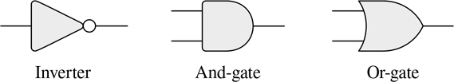

图 3.24：数字逻辑仿真器中的原始函数。

我们可以将原函数连接在一起，构造更复杂的函数。为此，我们将一些功能框的输出连接到其他功能框的输入。例如图 3.25：所示的半加法器电路由一个或门、两个与门和一个反相器组成。它有两个输入信号，`A`和 B ，有两个输出信号， S 和 C 。当`A`和`B`中恰好有一个为 1 时 S 变为 1，当`A`和`B`都为 1 时 C 变为 1。从图中可以看出，由于存在延迟，输出可能会在不同的时间生成。数字电路设计中的许多困难都源于这一事实。

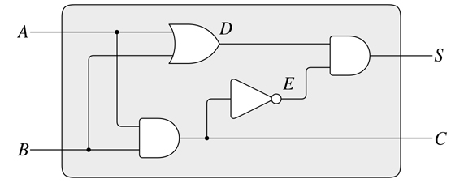

图 3.25：一种半加法器电路。

我们现在将构建一个程序来模拟我们想要研究的数字逻辑电路。该程序将构建模拟电线的计算对象，这些电线将“容纳”信号。功能盒将由在信号之间实施正确关系的功能来建模。

我们的模拟的一个基本元素将是一个函数`make_wire`，它构造连线。例如，我们可以如下构建六根线:

```js
const a = make_wire();
const b = make_wire();
const c = make_wire();
const d = make_wire();
const e = make_wire();
const s = make_wire();
```

我们通过调用一个构造这种盒子的函数，将一个功能盒子连接到一组连线上。构造函数的参数是连接到盒子上的电线。例如，假设我们可以构建与门、或门和反相器，我们可以将图 3.25 所示的半加法器连接在一起:

```js
or_gate(a, b, d);
"ok"

and_gate(a, b, c);
"ok"

inverter(c, e);
"ok"

and_gate(d, e, s);
"ok"
```

更好的是，我们可以通过定义一个构造这个电路的函数`half_ adder`来明确地命名这个操作，给定连接到半加法器的四条外部线:

```js
function half_adder(a, b, s, c) {
    const d = make_wire();
    const e = make_wire();
    or_gate(a, b, d);
    and_gate(a, b, c);
    inverter(c, e);
    and_gate(d, e, s);
    return "ok";
}
```

做出这个定义的好处是，我们可以使用`half_adder`本身作为构建更复杂电路的基础。[例如，图 3.26](#c3-fig-0026) 显示了一个由两个半加法器和一个或门组成的全加器。 [^(29)](#c3-fn-0029) 我们可以如下构造一个全加器:

```js
function full_adder(a, b, c_in, sum, c_out) {
    const s = make_wire();
    const c1 = make_wire();
    const c2 = make_wire();
    half_adder(b, c_in, s, c1);
    half_adder(a, s, sum, c2);
    or_gate(c1, c2, c_out);
    return "ok";
}
```

已经将`full_adder`定义为一个函数，我们现在可以使用它作为构建模块来创建更复杂的电路。(例如，参见练习 3.30。)

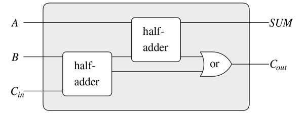

图 3.26：一种全加器电路。

本质上，我们的模拟器为我们提供了构建电路语言的工具。如果我们采用我们在 1.1 节中研究 JavaScript 时所用的语言的一般观点，我们可以说基本功能盒形成了语言的基本元素，连接盒一起提供了一种组合的方式，而将连接模式指定为功能作为一种抽象的方式。

##### 原始功能盒

基本功能盒实现了“力”,通过力，一根线上的信号变化影响其它线上的信号。为了构建功能盒，我们在连线上使用以下操作:

*   `get_signal(`wire`)`

    返回线路上信号的当前值。

*   `set_signal(`wire`,` new-value`)`:

    将电线上的信号值更改为新值。

*   `add_action(`wire`,` function-of -no-arguments`)`:

    断言当线路上的信号改变值时，应该运行指定的函数。这些功能是将线路上信号值的变化传递给其他线路的工具。

此外，我们将使用一个函数`after_delay`,它需要一个时间延迟和一个要运行的函数，并在给定的延迟后执行给定的函数。

使用这些函数，我们可以定义原始的数字逻辑函数。为了通过反相器将输入连接到输出，我们使用`add_action`将一个函数与输入线相关联，该函数将在输入线上的信号改变值时运行。该函数计算输入信号的`logical_not`，然后在一个`inverter_delay`之后，将输出信号设置为这个新值:

```js
function inverter(input, output) {
    function invert_input() {
        const new_value = logical_not(get_signal(input));
        after_delay(inverter_delay,
                    () => set_signal(output, new_value));
    }
    add_action(input, invert_input);
    return "ok";
}
function logical_not(s) {
    return s === 0
           ? 1
           : s === 1
           ? 0
           : error(s, "invalid signal");
}
```

与门稍微复杂一点。如果闸门的任一输入发生变化，则必须运行操作功能。它计算输入线上信号值的`logical_and`(使用类似于`logical_not`的函数),并在一次`and_gate_delay`后在输出线上设置新值的变化。

```js
function and_gate(a1, a2, output) {
    function and_action_function() {
        const new_value = logical_and(get_signal(a1),
                                      get_signal(a2));
        after_delay(and_gate_delay,
                    () => set_signal(output, new_value));
    }
    add_action(a1, and_action_function);
    add_action(a2, and_action_function);
    return "ok";
}
```

##### 练习 3.28

定义一个或门作为基本功能框。你的`or_gate`建造师应该和`and_gate`差不多。

##### 练习 3.29

另一种构造或门的方法是作为一种复合数字逻辑器件，由与门和反相器组成。定义一个函数`or_gate`来完成这个任务。就`and_gate_delay`和`inverter_delay`而言，or 门的延迟时间是多少？

##### 练习 3.30

图 3.27：显示了一个纹波进位加法器由`n`个全加法器串接而成。这是并行加法器的最简单形式，用于将两个`n`位二进制数相加。输入一一 [1] ，一一 [2] ，一一 [3] ，。。。、 A [n] 和 B [1、 B [2] 、 B [3] 、。。。、 B [n] 是要相加的两个二进制数(每个 A [k] 和 B [k] 是 0 或 1)。电路产生 S [1] ， S [2] ， S [3] ，。。。， S [n] ，nn 位的和，以及 C ，加法运算的进位。编写一个生成该电路的函数`ripple_carry_adder`。该函数应采用三个列表作为参数，每个列表包含三根`n`导线，即 A[k]、 B [k] 和 S[k]——以及另一根导线 C 。纹波进位加法器的主要缺点是需要等待进位信号传播。从一个`n`位纹波进位加法器获得完整输出所需的延迟是多少，用与门、或门和反相器的延迟表示？]

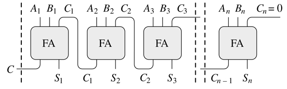

图 3.27：一个用于`n`位数的纹波进位加法器。

##### 代表电线

在我们的模拟中，一个连线将是一个具有两个本地状态变量的计算对象:一个`signal_value`(最初取为 0)和一个当信号改变值时运行的`action_functions`的集合。我们使用 messagepassing 风格来实现这个连接，作为一个本地函数和一个选择适当本地操作的`dispatch`函数的集合，就像我们在 3.1.1 节中对简单的 bankaccount 对象所做的那样:

```js
function make_wire() {
    let signal_value = 0;
    let action_functions = null;
    function set_my_signal(new_value) {
        if (signal_value !== new_value) {
            signal_value = new_value;
            return call_each(action_functions);
        } else {
            return "done";
        }
    }
    function accept_action_function(fun) {
        action_functions = pair(fun, action_functions);
        fun();
    }
    function dispatch(m) {
        return m === "get_signal"
               ? signal_value
               : m === "set_signal"
               ? set_my_signal
               : m === "add_action"
               ? accept_action_function
               : error(m, "unknown operation – wire");
    }
    return dispatch;
}
```

本地功能`set_my_signal`测试新信号值是否会改变线上的信号。如果是，它运行每个操作函数，使用下面的函数`call_each`，调用无参数函数列表中的每个项目:

```js
function call_each(functions) {
    if (is_null(functions)) {
        return "done";
    } else {
        head(functions)();
        return call_each(tail(functions));
    }
}
```

本地函数`accept_action_function`将给定函数添加到要运行的函数列表中，然后运行一次新函数。(见练习 3.31。)

按照规定设置本地`dispatch`功能后，我们可以提供以下功能来访问焊线的本地操作: [^(30)](#c3-fn-0030)

```js
function get_signal(wire) {
    return wire("get_signal");
}
function set_signal(wire, new_value) {
    return wire("set_signal")(new_value);
}
function add_action(wire, action_function) {
    return wire("add_action")(action_function);
}
```

电线具有随时间变化的信号，并且可以递增地连接到设备上，是典型的可变对象。我们将它们建模为具有局部状态变量的函数，这些变量通过赋值来修改。当一个新的连线被创建时，一组新的状态变量被分配(通过`make_wire`中的`**let**`语句),一个新的`dispatch`函数被构造并返回，用新的状态变量捕获环境。

这些电线由连接到它们的各种设备共享。因此，与一个设备交互所产生的变化会影响连接到该线上的所有其他设备。当连接建立时，通过调用提供给它的动作函数，连线将变化传递给它的邻居。

##### 议程

完成模拟器唯一需要的就是`after_delay`。这里的想法是，我们维护一个数据结构，称为议程，其中包含一个要做的事情的时间表。为议程定义了以下操作:

*   `make_agenda()`:

    返回一个新的空议程。

*   `is_empty_agenda(`agenda`)`

    如果指定的议程为空，则为 true。

*   `first_agenda_item(`agenda`)`

    返回议程上的第一项。

*   `remove_first_agenda_item(`agenda`)`

    通过删除第一项来修改议程。

*   `add_to_agenda(`time`,` action`,` agenda`)`

    通过添加要在指定时间运行的给定操作功能来修改议程。

*   `current_time(`agenda`)`

    返回当前模拟时间。

我们使用的特定议程由`the_agenda`表示。函数`after_delay`向`the_agenda`添加新元素:

```js
function after_delay(delay, action) {
    add_to_agenda(delay + current_time(the_agenda),
                  action,
                  the_agenda);
}
```

模拟由功能`propagate`驱动，依次执行`the_agenda`上的每个功能。一般来说，随着模拟的运行，新的项目将被添加到议程中，并且只要议程中有项目，`propagate`将继续模拟:

```js
function propagate() {
    if (is_empty_agenda(the_agenda)) {
        return "done";
    } else {
        const first_item = first_agenda_item(the_agenda);
        first_item();
        remove_first_agenda_item(the_agenda);
        return propagate();
    }
}
```

##### 模拟样本

下面的功能将一个“探针”放在电线上，显示了模拟器的运行。探头告诉电线，每当它的信号值改变时，它应该打印新的信号值，以及当前时间和识别电线的名称。

```js
function probe(name, wire) {
    add_action(wire,
               () => display(name + " " +
                             stringify(current_time(the_agenda)) +
                             ", new value = " +
                             stringify(get_signal(wire))));
}
```

我们首先初始化议程，并为基本功能框指定延迟:

```js
const the_agenda = make_agenda();
const inverter_delay = 2;
const and_gate_delay = 3;
const or_gate_delay = 5;
```

现在我们定义四条导线，在其中两条上放置探针:

```js
const input_1 = make_wire();
const input_2 = make_wire();
const sum = make_wire();
const carry = make_wire();

probe("sum", sum);
"sum 0, new value = 0"

probe("carry", carry);
"carry 0, new value = 0"
```

接下来，我们连接半加法器电路中的导线(如图 3.25： )，将`input_1`上的信号设置为 1，并运行模拟:

```js
half_adder(input_1, input_2, sum, carry);
"ok"

set_signal(input_1, 1);
"done"

propagate();
"sum 8, new value = 1"
"done"
```

`sum`信号在时间 8 变为 1。我们现在距离模拟开始还有八个时间单位。此时，我们可以将`input_2`上的信号设置为 1，并允许值传播:

```js
set_signal(input_2, 1);
"done"

propagate();
"carry 11, new value = 1"
"sum 16, new value = 0"
"done"
```

`carry`在时间 11 变为 1，而`sum`在时间 16 变为 0。

##### 练习 3.31

在`make_wire`中定义的内部函数`accept_action_function`指定当一个新的动作函数被添加到一条线上时，该函数立即运行。解释为什么这个初始化是必要的。特别是，追溯以上段落中的半加法器示例，并说明如果我们将`accept_action_function`定义为

```js
function accept_action_function(fun) {
    action_functions = pair(fun, action_functions);
}
```

##### 实施议程

最后，我们给出了日程数据结构的细节，它包含了为将来执行而安排的功能。

议程由个时间段组成。每个时间段是由一个数字(时间)和一个队列(见练习 3.32)组成的一对，队列中保存着计划在该时间段内运行的功能。

```js
function make_time_segment(time, queue) {
    return pair(time, queue);
}
function segment_time(s) { return head(s); }
function segment_queue(s) { return tail(s); }
```

我们将使用 3.3.2 节中描述的队列操作来操作时间段队列。

议程本身是一个一维的时间段表。它不同于第 3.3.3 节中所述的表格，因为分段将按照时间递增的顺序进行排序。此外，我们将当前时间(即处理的最后一个动作的时间)存储在议程的开头。新构建的议程没有时间段，当前时间为 0: [^(31)](#c3-fn-0031)

```js
function make_agenda() { return list(0); }
function current_time(agenda) { return head(agenda); }
function set_current_time(agenda, time) {
    set_head(agenda, time);
}
function segments(agenda) { return tail(agenda); }
function set_segments(agenda, segs) {
    set_tail(agenda, segs);
}
function first_segment(agenda) { return head(segments(agenda)); }
function rest_segments(agenda) { return tail(segments(agenda)); }
```

如果没有时间段，则议程为空:

```js
function is_empty_agenda(agenda) {
    return is_null(segments(agenda));
}
```

要向议程添加操作，我们首先检查议程是否为空。如果是这样，我们为该行动创建一个时间段，并将其放入日程中。否则，我们浏览议程，检查每个部分的时间。如果我们为我们的约定时间找到一个片段，我们就把这个动作添加到相关的队列中。如果我们到达的时间晚于我们被指定的时间，我们就在它之前插入一个新的时间段到议程中。如果我们到达议程的末尾，我们必须在末尾创建一个新的时间段。

```js
function add_to_agenda(time, action, agenda) {
    function belongs_before(segs) {
        return is_null(segs) || time < segment_time(head(segs));
    }
    function make_new_time_segment(time, action) {
        const q = make_queue();
        insert_queue(q, action);
        return make_time_segment(time, q);
    }
    function add_to_segments(segs) {
        if (segment_time(head(segs)) === time) {
            insert_queue(segment_queue(head(segs)), action);
        } else {
            const rest = tail(segs);
            if (belongs_before(rest)) {
                set_tail(segs, pair(make_new_time_segment(time, action),
                                    tail(segs)));
            } else {
                add_to_segments(rest);
            }
        }
    }
    const segs = segments(agenda);
    if (belongs_before(segs)) {
        set_segments(agenda,
                    pair(make_new_time_segment(time, action), segs));
    } else {
        add_to_segments(segs);
    }
}
```

从议程中删除第一个项目的函数删除第一个时间段中队列前面的项目。如果这种删除使时间段为空，我们将其从段列表中删除: [^(32)](#c3-fn-0032)

```js
function remove_first_agenda_item(agenda) {
    const q = segment_queue(first_segment(agenda));
    delete_queue(q);
    if (is_empty_queue(q)) {
        set_segments(agenda, rest_segments(agenda));
    } else {}
}
```

在第一时间段中，第一议程项目位于队列的最前面。每当我们提取一个项目时，我们也更新当前时间: [^(33)](#c3-fn-0033)

```js
function first_agenda_item(agenda) {
    if (is_empty_agenda(agenda)) {
        error("agenda is empty – first_agenda_item");
    } else {
        const first_seg = first_segment(agenda);
        set_current_time(agenda, segment_time(first_seg));
        return front_queue(segment_queue(first_seg));
    }
}
```

##### 练习 3.32

要在议程的每个时间段运行的功能保存在一个队列中。因此，每个片段的函数按照它们被添加到议程中的顺序被调用(先进先出)。解释为什么必须使用这个命令。特别是，跟踪一个与门的行为，其输入在同一段中从 0，1 变为 1，0，并说明如果我们将一个段的功能存储在一个普通的列表中，只在前面添加和删除功能(后进先出)，该行为会有什么不同。

### 3.3.5 约束的传播

计算机程序传统上被组织为单向计算，其对预先指定的参数执行操作以产生期望的输出。另一方面，我们经常根据数量之间的关系来为系统建模。例如，机械结构的数学模型可能包括这样的信息，即金属杆的挠度 d 与杆上的力 F ，杆的长度 L ，横截面积`A`和弹性模量 E 通过以下等式相关

```js
dAE = FL
```

这样的等式不是单向的。给定任何四个量，我们可以用它来计算第五个量。然而，将这个等式翻译成传统的计算机语言，将迫使我们从其他四个量中选择一个来计算。因此，用于计算面积`A`的函数不能用于计算挠度 d ，即使`A`和 d 的计算源自同一等式。 [^(34)](#c3-fn-0034)

在这一节中，我们概述了一种语言的设计，这种语言使我们能够根据关系本身来工作。该语言的基本元素是基本约束，它陈述了数量之间的特定关系。例如，`adder(a, b, c)`指定量`a`、`b`、`c`必须由等式 a+b=c，`multiplier(x, y, z)`表示约束 xy =`z`，`constant(3.14, x)`表示`x`的值必须为 3.14。

我们的语言提供了一种组合原始约束的方法，以便表达更复杂的关系。我们通过构建约束网络来组合约束，其中约束由连接器连接。连接器是“持有”一个值的对象，该值可以参与一个或多个约束。例如，我们知道华氏温度和摄氏温度之间的关系是

```js
9C = 5(F – 32)
```

这样的约束可以认为是一个由原语加法器、乘法器和常量约束组成的网络(图 3.28： )。在图中，我们看到左侧的乘法器盒有三个端子，分别标为 m1、m2 和 p 。这些将倍增器连接到网络的其余部分，如下所示: m [1] 端子连接到连接器 C ，该连接器将保持摄氏温度。 m [2] 端子连接到连接器 w ，该连接器也连接到一个容纳 9。乘法器盒约束为 m*[1]和 m*[2]的乘积的 p 端子连接到另一个乘法器盒的 p 端子，其 m [2] 连接到常数 5，其 m [1]**

**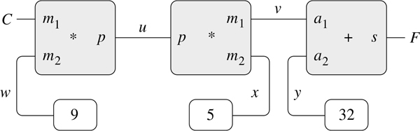

图 3.28：关系 9C = 5(F–32)表示为约束网络。

这种网络的计算过程如下:当连接器被赋予一个值(由用户或由它所链接的约束框赋予)时，它唤醒所有与其相关联的约束(除了刚刚唤醒它的约束)，以通知它们它具有一个值。每个被唤醒的约束框然后轮询其连接器，以查看是否有足够的信息来确定连接器的值。如果是这样，盒子设置连接器，然后唤醒所有相关的约束，依此类推。例如，在摄氏和华氏之间的转换中， w 、`x`和`y`立即被常量框分别设置为 9、5 和 32。连接器唤醒乘法器和加法器，它们确定没有足够的信息来继续。如果用户(或网络的其他部分)将 C 设置为一个值(比如 25)，最左边的乘法器将被唤醒，它将 u 设置为 25 ^ 9 = 225。然后 u 唤醒第二个乘法器，其将 v 设置为 45，并且 v 唤醒加法器，其将`F`设置为 77。

##### 使用约束系统

为了使用约束系统来执行上面概述的温度计算，我们首先调用构造函数`make_connector`来创建两个连接器`C`和`F`，然后将它们链接到适当的网络中:

```js
const C = make_connector();
const F = make_connector();
celsius_fahrenheit_converter(C, F);
"ok"
```

创建网络的函数定义如下:

```js
function celsius_fahrenheit_converter(c, f) {
    const u = make_connector();
    const v = make_connector();
    const w = make_connector();
    const x = make_connector();
    const y = make_connector();
    multiplier(c, w, u);
    multiplier(v, x, u);
    adder(v, y, f);
    constant(9, w);
    constant(5, x);
    constant(32, y);
    return "ok";
}
```

该函数创建内部连接器`u`、`v`、`w`、`x`和`y`，并使用原语约束构造函数`adder`、`multiplier`和`constant`将它们链接起来，如图 3.28：所示。正如 3.3.4 节中的数字电路模拟器一样，用函数来表达这些原始元素的组合自动为我们的语言提供了一种对复合对象进行抽象的方法。

为了观察运行中的网络，我们可以在连接器`C`和`F`上放置探针，使用类似于我们在第 3.3.4 节中用来监控电线的`probe`功能。在连接器上放置探针将导致每当连接器被赋予一个值时打印一条消息:

```js
probe("Celsius temp", C);
probe("Fahrenheit temp", F);
```

接下来我们将`C`的值设置为 25。`set_value`的第三个参数告诉`C`这个指令来自`user`。)

```js
set_value(C, 25, "user");
"Probe: Celsius temp = 25"
"Probe: Fahrenheit temp = 77"
"done"
```

`C`上的探头唤醒并报告数值。`C`也通过网络传播其值，如上所述。这将`F`设置为 77，由`F`上的探头报告。

现在我们可以尝试将`F`设置为一个新值，比如 212:

```js
set_value(F, 212, "user");
"Error! Contradiction: (77, 212)"
```

连接器抱怨说它感觉到了一个矛盾:它的值是 77，有人试图将其设置为 212。如果我们真的想用新的价值来重用网络，我们可以告诉`C`忘记它的旧价值:

```js
forget_value(C, "user");
"Probe: Celsius temp = ?"
"Probe: Fahrenheit temp = ?"
"done"
```

`C`发现最初设置其值的`"user"`现在撤回该值，因此`C`同意丢失其值，如探测器所示，并将这一事实通知网络的其余部分。这个信息最终传播到`F`，它现在发现自己没有理由继续相信自己的值是 77。因此，`F`也放弃了它的值，如探针所示。

既然`F`没有值，我们可以将其设置为 212:

```js
set_value(F, 212, "user");
"Probe: Fahrenheit temp = 212"
"Probe: Celsius temp = 100"
"done"?
```

这个新值，当通过网络传播时，迫使`C`具有值 100，并且这由`C`上的探头记录。请注意，给定`F`，计算`C`，给定`C`，计算`F`，使用的是同一个网络。这种计算的非方向性是基于约束的系统的显著特征。

##### 实现约束系统

约束系统通过具有本地状态的程序对象来实现，其方式非常类似于 3.3.4 节的数字电路模拟器。尽管约束系统的原始对象稍微复杂一些，但是整个系统更简单，因为不需要考虑议程和逻辑延迟。

连接器的基本操作如下:

*   `has_value(`connector`)`

    告知连接器是否有值。

*   `get_value(`connector`)`

    返回连接器的当前值。

*   `set_value(`connector`,` new-value`,` informant`)`

    表示通知者正在请求连接器将其值设置为新值。

*   `forget_value(`connector`,` retractor`)`

    告诉连接器卷收器要求它忘记它的值。

*   `connect(`connector`,` new-constraint`)`

    告诉连接器参与新的约束。

连接器通过函数`inform_ about_value`和`inform_about_no_value`与约束通信，函数`inform_ about_value`告诉给定的约束连接器有一个值，函数`inform_about_no_value`告诉约束连接器已经丢失了它的值。

`Adder`在被加数连接器`a1`和`a2`以及`sum`连接器之间构造一个加法器约束。加法器被实现为具有本地状态的函数(下面的函数`me`):

```js
function adder(a1, a2, sum) {
    function process_new_value() {
        if (has_value(a1) && has_value(a2)) {
            set_value(sum, get_value(a1) + get_value(a2), me);
        } else if (has_value(a1) && has_value(sum)) {
            set_value(a2, get_value(sum) - get_value(a1), me);
        } else if (has_value(a2) && has_value(sum)) {
            set_value(a1, get_value(sum) - get_value(a2), me);
        } else {}
    }
    function process_forget_value() {
        forget_value(sum, me);
        forget_value(a1, me);
        forget_value(a2, me);
        process_new_value();
    }
    function me(request) {
        if (request === "I have a value.") {
            process_new_value();
        } else if (request === "I lost my value.") {
            process_forget_value();
        } else {
            error(request, "unknown request – adder");
        }
    }
    connect(a1, me);
    connect(a2, me);
    connect(sum, me);
    return me;
}
```

函数`adder`将新的加法器连接到指定的连接器，并将其作为其值返回。代表加法器的函数`me`充当本地函数的调度程序。以下“语法接口”(见第 3.3.4 节脚注 30)与派单一起使用:

```js
function inform_about_value(constraint) {
    return constraint("I have a value.");
}
function inform_about_no_value(constraint) {
    return constraint("I lost my value.");
}
```

当加法器被告知它的一个连接器有值时，加法器的局部函数`process_new_value`被调用。加法器首先检查`a1`和`a2`是否都有值。如果是，它告诉`sum`将其值设置为两个加数之和。`set_value`的`informant`参数是`me`，它是加法器对象本身。如果`a1`和`a2`不都有值，那么加法器检查`a1`和`sum`是否都有值。如果是，则将`a2`设置为这两者的差值。最后，如果`a2`和`sum`有值，这给加法器足够的信息来设置`a1`。如果加法器被告知它的一个连接器丢失了一个值，它请求它的所有连接器现在都丢失它们的值。(实际上只有由该加法器设置的那些值会丢失。)然后它运行`process_new_value`。这最后一步的原因是一个或多个连接器可能仍然具有一个值(也就是说，一个连接器可能具有一个不是由加法器最初设置的值)，并且这些值可能需要通过加法器传播回来。

乘法器非常类似于加法器。如果其中一个因子为 0，即使另一个因子未知，它也会将其`product`设置为 0。

```js
function multiplier(m1, m2, product) {
    function process_new_value() {
        if ((has_value(m1) && get_value(m1) === 0)
         || (has_value(m2) && get_value(m2) === 0)) {
            set_value(product, 0, me);
        } else if (has_value(m1) && has_value(m2)) {
            set_value(product, get_value(m1) * get_value(m2), me);
        } else if (has_value(product) && has_value(m1)) {
            set_value(m2, get_value(product) / get_value(m1), me);
        } else if (has_value(product) && has_value(m2)) {
            set_value(m1, get_value(product) / get_value(m2), me);
        } else {}
    }
    function process_forget_value() {
        forget_value(product, me);
        forget_value(m1, me);
        forget_value(m2, me);
        process_new_value();
    }
    function me(request) {
        if (request === "I have a value.") {
            process_new_value();
        } else if (request === "I lost my value.") {
            process_forget_value();
        } else {
            error(request, "unknown request – multiplier");
        }
    }
    connect(m1, me);
    connect(m2, me);
    connect(product, me);
    return me;
}
```

一个`constant`构造器简单地设置指定连接器的值。任何发送到常量框的`"I have a value."`或`"I lost my value."`消息都会产生错误。

```js
function constant(value, connector) {
    function me(request) {
        error(request, "unknown request – constant");
    }
    connect(connector, me);
    set_value(connector, value, me);
    return me;
}
```

最后，探测器打印一条关于指定连接器的设置或取消设置的消息:

```js
function probe(name, connector) {
    function print_probe(value) {
        display("Probe: " + name + " = " + stringify(value));
    }
    function process_new_value() {
        print_probe(get_value(connector));
    }
    function process_forget_value() {
        print_probe("?");
    }
    function me(request) {
        return request === "I have a value."
               ? process_new_value()
               : request === "I lost my value."
               ? process_forget_value()
               : error(request, "unknown request – probe");
    }
    connect(connector, me);
    return me;
}
```

##### 表示连接器

一个连接器被表示为一个带有本地状态变量`value`的程序对象，即连接器的当前值；`informant`，设置连接器值的对象；以及`constraints`，连接器参与的约束列表。

```js
function make_connector() {
    let value = false;
    let informant = false;
    let constraints = null;
    function set_my_value(newval, setter) {
        if (!has_value(me)) {
            value = newval;
            informant = setter;
            return for_each_except(setter,
                                   inform_about_value,
                                   constraints);
        } else if (value !== newval) {
            error(list(value, newval), "contradiction");
        } else {
            return "ignored";
        }
    }
    function forget_my_value(retractor) {
        if (retractor === informant) {
            informant = false;
            return for_each_except(retractor,
                                   inform_about_no_value,
                                   constraints);
        } else {
            return "ignored";
        }
    }
    function connect(new_constraint) {
        if (is_null(member(new_constraint, constraints))) {
            constraints = pair(new_constraint, constraints);
        } else {}
        if (has_value(me)) {
            inform_about_value(new_constraint);
        } else {}
        return "done";
    }
    function me(request) {
        if (request === "has_value") {
            return informant !== false;
        } else if (request === "value") {
            return value;
        } else if (request === "set_value") {
            return set_my_value;
        } else if (request === "forget") {
            return forget_my_value;
        } else if (request === "connect") {
            return connect;
        } else {
            error(request, "unknown operation – connector");
        }
    }
    return me;
}
```

当请求设置连接器的值时，调用连接器的本地函数`set_my_value`。如果连接器当前没有值，它将设置其值，并将请求设置值的约束记为`informant`。 [^(35)](#c3-fn-0035) 然后，连接器将通知其所有参与的约束，请求设置值的约束除外。这是使用下面的迭代器完成的，它将指定的函数应用于列表中除给定项之外的所有项:

```js
function for_each_except(exception, fun, list) {
    function loop(items) {
        if (is_null(items)) {
            return "done";
        } else if (head(items) === exception) {
            return loop(tail(items));
        } else {
            fun(head(items));
            return loop(tail(items));
        }
    }
    return loop(list);
}
```

如果连接器被要求忘记它的值，它将运行`forget_my_value`，这是一个本地函数，首先检查以确保请求来自最初设置值的同一个对象。如果是这样，连接器会将值的丢失通知给相关的约束。

局部函数`connect`将指定的新约束添加到约束列表中，如果它不在该列表中的话。 [^(36)](#c3-fn-0036) 然后，如果连接符有一个值，它通知新的约束这个事实。

连接器的函数`me`充当对其他内部函数的分派，并且还将连接器表示为一个对象。以下函数为派单提供了语法界面:

```js
function has_value(connector) {
    return connector("has_value");
}
function get_value(connector) {
    return connector("value");
}
function set_value(connector, new_value, informant) {
    return connector("set_value")(new_value, informant);
}
function forget_value(connector, retractor) {
    return connector("forget")(retractor);
}
function connect(connector, new_constraint) {
   return connector("connect")(new_constraint);
}
```

##### 练习 3.33

使用原始乘法器、加法器和常数约束，定义一个函数平均器，该函数平均器将三个连接器`a`、`b`和`c`作为输入，并建立`c`的值是`a`和`b`的值的平均值的约束

##### 练习 3.34

Louis Reasoner 想要构建一个平方器，一个具有两个端子的约束设备，这样第二个端子上的连接器`b`的值将始终是第一个端子上的值`a`的平方。他建议用一个倍增器制成下面的简单装置:

```js
function squarer(a, b) {
    return multiplier(a, a, b);
}
```

这个想法有一个严重的缺陷。解释一下。

##### 练习 3.35

Ben Bitdiddle 告诉 Louis，避免练习 3.34 中问题的一个方法是定义一个平方器作为一个新的原始约束。在 Ben 的大纲中为实现这样一个约束的函数填充缺少的部分:

```js
function squarer(a, b) {
    function process_new_value() {
        if (has_value(b)) {
            if (get_value(b) < 0) {
                error(get_value(b), "square less than 0 – squarer");
            } else {
                alternative[1]
            }
        } else {
            alternative[2]
        }
    }
    function process_forget_value() {
        body[1]
    }
    function me(request) {
        body[2]
    }
    statements
    return me;
}
```

##### 练习 3.36

假设我们在程序环境中评估以下语句序列:

```js
const a = make_connector();
const b = make_connector();
set_value(a, 10, "user");
```

在`set_value`评估期间的某个时间，评估连接器本地函数的以下表达式:

```js
for_each_except(setter, inform_about_value, constraints);
```

画一个环境图，显示上面的表达式被评估的环境。

##### 练习 3.37

与更面向表达式的定义风格相比，`celsius_fahrenheit_converter`函数很麻烦，比如

```js
function celsius_fahrenheit_converter(x) {
   return cplus(cmul(cdiv(cv(9), cv(5)), x), cv(32));
}

const C = make_connector();
const F = celsius_fahrenheit_converter(C);
```

这里有`cplus`、`cmul`等。是算术运算的“约束”版本。例如，`cplus`将两个连接器作为参数，并返回一个通过加法器约束与它们相关的连接器:

```js
function cplus(x, y) {
    const z = make_connector();
    adder(x, y, z);
    return z;
}
```

定义类似的函数`cminus`、`cmul`、`cdiv`和`cv`(常量值)，使我们能够像上面的转换器例子一样定义复合约束。 [^(37)](#c3-fn-0037)**  **## 并发:时间是最重要的

我们已经看到了具有本地状态的计算对象作为建模工具的强大功能。然而，正如第 3.1.3 节所警告的那样，这种权力带来了代价:参照透明度的丧失，引发了一系列关于相同和变化的问题，以及放弃替代评估模型以支持更复杂的环境模型的需要。

隐藏在状态、相同和变化的复杂性之下的核心问题是，通过引入赋值，我们被迫将时间引入我们的计算模型。在我们引入赋值之前，我们所有的程序都是没有时间限制的，也就是说，任何有值的表达式总是有相同的值。相比之下，回想一下在第 3.1.1 节开始时介绍的对从银行账户提款建模并返回结果余额的示例:

```js
withdraw(25);
75

withdraw(25);
50
```

这里，相同表达式的连续求值产生不同的值。这种行为源于这样一个事实:赋值的执行(在本例中，是对变量`balance`的赋值)在值改变时描绘了时刻。对表达式求值的结果不仅取决于表达式本身，还取决于求值是发生在这些时刻之前还是之后。根据具有本地状态的计算对象构建模型迫使我们将时间视为编程中的一个基本概念。

我们可以进一步构建计算模型，以匹配我们对物理世界的感知。世界上的对象不会按顺序一次改变一个。更确切地说，我们认为它们是同时发生的。因此，将系统建模为并发执行的线程(计算步骤序列)的集合通常是很自然的。正如我们可以通过根据具有独立本地状态的对象来组织模型来使我们的程序模块化一样，将计算模型划分为独立和并发发展的部分通常是合适的。即使程序是在顺序计算机上执行的，编写程序时就好像它们是同时执行的，这种做法迫使程序员避免不必要的时间限制，从而使程序更加模块化。

除了使程序更加模块化之外，并发计算还提供了优于顺序计算的速度优势。顺序计算机一次只执行一项操作，因此执行一项任务所需的时间与执行的操作总数成正比。

不幸的是，在并发的情况下，赋值带来的复杂性变得更加棘手。并行执行的事实，或者是因为世界是并行运行的，或者是因为我们的计算机是并行运行的，增加了我们对时间理解的复杂性。

### 3.4.1 并发系统中时间的本质

表面上看，时间似乎很简单。这是强加于事件的一种秩序。 [^(40)](#c3-fn-0040) 对于任何事件`A`和 B ，要么`A`发生在`B`之前，要么`A`和`B`同时发生，要么`A`发生在`B`之后。例如，回到银行账户的例子，假设彼得从一个最初包含 100 美元的联名账户中提取了 10 美元，保罗提取了 25 美元，账户中剩下 65 美元。根据两次提款的顺序，账户余额的顺序是 100 美元 90 美元 65 美元或 100 美元 75 美元 65 美元。在银行系统的计算机实现中，这种变化的余额序列可以通过对变量`balance`的连续赋值来建模。

然而，在复杂的情况下，这种观点是有问题的。假设彼得和保罗以及其他人通过分布在世界各地的银行机器网络访问同一个银行账户。帐户中余额的实际顺序将主要取决于访问的详细时间和机器间通信的细节。

事件顺序的不确定性会给并发系统的设计带来严重的问题。例如，假设 Peter 和 Paul 的取款是作为共享一个公共变量`balance`的两个独立线程实现的，每个线程由 3.1.1 节中给出的函数指定:

```js
function withdraw(amount) {
    if (balance >= amount) {
        balance = balance - amount;
        return balance;
    } else {
        return "Insufficient funds";
    }
}
```

如果两个线程独立运行，那么 Peter 可能会测试余额并尝试提取合法的金额。然而，在彼得检查余额和彼得完成取款之间，保罗可能会提取一些资金，从而使彼得的测试无效。

事情可能会更糟。考虑以下陈述

```js
balance = balance - amount;
```

作为每次取款过程的一部分执行。这包括三个步骤:(1)访问`balance`变量的值；(2)计算新的余额；(3)将`balance`设置为这个新值。如果彼得和保罗的提取同时执行这个语句，那么这两个提取可能会交错访问`balance`的顺序，并将其设置为新值。

图 3.29：中的时序图描绘了一系列事件，其中`balance`从 100 开始，彼得退出 10，保罗退出 25，然而`balance`的最终值是 75。如图所示，出现这种异常的原因是，保罗将 75 分配给`balance`是在假设要递减的`balance`的值为 100 的情况下进行的。然而，当彼得把`balance`改成 90 时，这个假设就失效了。这对银行系统来说是一个灾难性的失败，因为系统中的货币总量没有得到保存。在交易之前，总金额为 100 美元。后来，彼得有 10 美元，保罗有 25 美元，银行有 75 美元。 [^(41)](#c3-fn-0041)

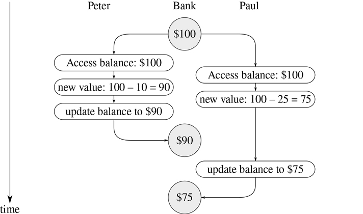

图 3.29：时序图显示了两次银行取款中事件顺序的交错如何导致不正确的最终余额。

这里说明的一般现象是几个线程可能共享一个公共状态变量。使这变得复杂的是，可能有多个线程同时试图操纵共享状态。以银行账户为例，在每笔交易中，每个客户都应该能够表现得好像其他客户不存在一样。当客户以依赖于余额的方式改变余额时，他们必须能够假设，就在改变的时刻之前，余额仍然是他们所认为的那样。

##### 并发程序的正确行为

上面的例子代表了潜移默化进入并发程序的细微错误。这种复杂性的根源在于不同线程之间共享的变量的赋值。我们已经知道，在编写使用赋值的程序时必须小心，因为计算的结果取决于赋值发生的顺序。对于并发线程，我们必须特别小心赋值，因为我们可能无法控制不同线程所做的赋值的顺序。如果几个这样的变化可能同时发生(比如两个储户访问一个联合账户)，我们需要一些方法来确保我们的系统行为正确。例如，在从联合银行账户提款的情况下，我们必须确保资金得到保存。为了让并发程序正确运行，我们可能需要对并发执行设置一些限制。

对并发性的一个可能的限制是规定不能同时发生两个改变任何共享状态变量的操作。这是一个极其严格的要求。对于分布式银行，它要求系统设计者确保一次只能进行一项交易。这既低效又过于保守。图 3.30：显示了彼得和保罗共享一个银行账户，而保罗也有一个私人账户。该图显示了从共享账户中的两次提款(一次由 Peter 提取，一次由 Paul 提取)以及向 Paul 的私人账户中的一次存款。 [^(43)](#c3-fn-0043) 从共享账户的两次提款必须不能并发(因为两者都访问和更新同一个账户)，保罗的存款和提款必须不能并发(因为两者都访问和更新保罗钱包中的金额)。但是，允许保罗向他的私人账户存款与彼得从共享账户提款同时进行应该没有问题。

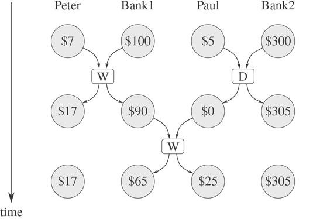

图 3.30：银行 1 的联名账户和银行 2 的私人账户同时存取款。

对并发性不太严格的限制将确保并发系统产生相同的结果，就好像线程以某种顺序连续运行一样。这一要求有两个重要方面。首先，它不要求线程实际上按顺序运行，而只是产生与它们按顺序运行的结果相同的结果。对于图 3.30：中的示例，银行账户系统的设计者可以安全地允许 Paul 的存款和 Peter 的取款同时发生，因为最终结果将与这两个操作顺序发生的结果相同。第二，一个并发程序可能产生不止一个可能的“正确”结果，因为我们只要求结果与某个顺序相同。例如，假设彼得和保罗的联名账户开始时有 100 美元，彼得存入 40 美元，而保罗同时取出账户中的一半资金。那么顺序执行可能导致账户余额为 70 美元或 90 美元(参见练习 3.38)。 [^(44)](#c3-fn-0044)

对于并发程序的正确执行，仍然有较弱的要求。一个模拟扩散(比如说，一个物体中的热流)的程序可能由大量的线程组成，每一个线程代表一个小的空间，它们同时更新它们的值。每个线程重复地将其值更改为其自身值和其邻居值的平均值。该算法收敛到正确的答案，而与运算的完成顺序无关；不需要对共享值的并发使用进行任何限制。

##### 练习 3.38

假设彼得、保罗和玛丽共享一个最初包含 100 美元的联合银行账户。同时，通过执行以下命令，Peter 存入 10 美元，Paul 取出 20 美元，Mary 取出帐户中一半的钱:

| 彼得: | `balance = balance + 10` |
| 保罗: | `balance = balance - 20` |
| 玛丽: | `balance = balance - (balance / 2)` |

1.  a. 在这三笔交易完成后，列出`balance`所有不同的可能值，假设银行系统强制三个线程以某种顺序依次运行。
2.  b. 如果系统允许线程交错，还会产生哪些其他值？绘制类似于图 3.29 中的时序图，解释这些值是如何产生的。

### 3.4.2 控制并发的机制

我们已经看到，处理并发线程的困难在于需要考虑不同线程中事件顺序的交错。例如，假设我们有两个线程，一个有三个有序事件(`a`、`b`、 c )，另一个有三个有序事件(`x`、`y`、 z )。如果两个线程并发运行，并且对它们如何交错执行没有限制，那么对于与两个线程的单独排序一致的事件，有 20 种不同的可能排序:

| (`a`、`b`、`c`、`x`、`y`、 z ) | (`a`、`x`、`b`、`y`、`c`、 z ) | (`x`，`a`，`b`，`c`，`y`， z ) | (`x`，`a`，`y`，`z`，`b`， c ) |
| (`a`，`b`，`x`，`c`，`y`， z ) | (`a`，`x`，`b`，`y`，`z`， c ) | (`x`，`a`，`b`，`y`，`c`， z ) | (`x`，`y`，`a`，`b`，`c`， z ) |
| (`a`、`b`、`x`、`y`、`c`、 z ) | (`a`、`x`、`y`、`b`、`c`、 z ) | (`x`，`a`，`b`，`y`，`z`， c ) | (`x`，`y`，`a`，`b`，`z`， c ) |
| (`a`、`b`、`x`、`y`、`z`、 c ) | (`a`、`x`、`y`、`b`、`z`、 c ) | (`x`，`a`，`y`，`b`，`c`， z ) | (`x`，`y`，`a`，`z`，`b`， c ) |
| (`a`，`x`，`b`，`c`，`y`， z ) | (`a`，`x`，`y`，`z`，`b`， c ) | (`x`，`a`，`y`，`b`，`z`， c ) | (`x`，`y`，`z`，`a`，`b`， c ) |

作为设计这个系统的程序员，我们必须考虑这 20 个排序中每一个的影响，并检查每个行为是否可以接受。随着线程和事件数量的增加，这种方法很快变得不实用。

设计并发系统的一个更实际的方法是设计一个通用的机制，允许我们约束并发线程的交错，这样我们就可以确定程序行为是正确的。为此已经开发了许多机制。在本节中，我们将描述其中的一个，即串行化器。

##### 序列化对共享状态的访问

序列化实现了以下思想:线程将并发执行，但是将有某些函数集合不能并发执行。更准确地说，串行化创建了不同的函数集合，使得每次只允许在每个串行化集合中执行一个函数。如果集合中的某个函数正在执行，那么试图执行集合中任何函数的线程将被迫等待，直到第一次执行完成。

我们可以使用序列化来控制对共享变量的访问。例如，如果我们想基于变量的前一个值更新一个共享变量，我们把对变量的前一个值的访问和新值的赋值放在同一个函数中。然后，我们通过用同一个序列化程序序列化所有这些函数，确保分配给该变量的其他函数不能与该函数并发运行。这保证了变量的值不会在访问和相应的赋值之间改变。

##### 序列化程序

为了使上述机制更加具体，假设我们已经扩展了 JavaScript 以包含一个名为`concurrent_execute`的函数:

```js
concurrent_execute(f[1], f[2], . . ., f[k])
```

每个`f`必须是一个没有参数的函数。函数`concurrent_execute`为应用`f`的每个 f、创建一个单独的线程(无参数)。这些线程都同时运行。 [^(45)](#c3-fn-0045)

作为如何使用它的一个例子，考虑

```js
let x = 10;
concurrent_execute(() => { x = x * x; },
                   () => { x = x + 1; });
```

这就创建了两个并发线程——T[1]，它将`x`设置为`x`倍`x`，以及 T [2] ，它递增`x`。执行完成后，`x`将保留五个可能值中的一个，这取决于 T1 和 T2 事件的交错:

| 101: | T [1] 将`x`设定为 100，然后 T [2] 将`x`递增至 101。 |
| 121: | T [2] 将`x`递增至 11，然后 TT[1]将`x`设定为`x`倍`x`。 |
| 110: | T [2] 在两次 T [1] 之间将`x`从 10 变为 11 |
|  | 在评估`x * x`期间访问`x`的值。 |
| 11: | T [2] 访问`x`，然后 T [1] 设置`x`为 100，然后 T [2] 设置`x`。 |
| 100: | T1 访问`x`(两次)，然后 T2 设置`x`到 11，然后 T1 设置`x`。 |

我们可以通过使用序列化函数来约束并发性，序列化函数是由序列化器创建的。序列化器由`make_serializer`构造，下面给出了它的实现。序列化程序将函数作为参数，并返回行为类似于原始函数的序列化函数。对给定序列化程序的所有调用都返回同一集合中的序列化函数。

因此，与上面的例子相反，执行

```js
let x = 10;
const s = make_serializer();
concurrent_execute(s(() => { x = x * x; }),
                   s(() => { x = x + 1; }));
```

对于`x`，只能产生两个可能的值，101 或 121。其他的可能性都被排除了，因为 T1 和 T2 的执行不能交错。

下面是第 3.1.1 节中的`make_account`函数的一个版本，其中存款和取款已经序列化:

```js
function make_account(balance) {
    function withdraw(amount) {
        if (balance > amount) {
            balance = balance - amount;
            return balance;
        } else {
            return "Insufficient funds";
        }
    }
    function deposit(amount) {
        balance = balance + amount;
        return balance;
    }
    const protect = make_serializer();
    function dispatch(m) {
        return m === "withdraw"
               ? protect(withdraw)
               : m === "deposit"
               ? protect(deposit)
               : m === "balance"
               ? balance
               : error(m, "unknown request – make_account");
    }
    return dispatch;
}
```

通过这种实现，两个线程不能同时从一个帐户中取款或向一个帐户中存款。这消除了图 3.29：中所示的错误来源，其中 Peter 在 Paul 访问余额以计算新值的时间和 Paul 实际执行分配的时间之间更改了账户余额。另一方面，每个帐户都有自己的序列化程序，因此不同帐户的存取可以同时进行。

##### 练习 3.39

如果我们改为按如下顺序执行，上面显示的并发执行的五种可能性中还有哪一种:

```js
let x = 10;
const s = make_serializer();
concurrent_execute( () => { x = s(() => x * x)(); },
                   s(() => { x = x + 1; }));
```

##### 练习 3.40

给出`x`的所有可能值

```js
let x = 10;
concurrent_execute(() => { x = x * x; },
                   () => { x = x * x * x; });
```

如果我们改为使用序列化函数，这些可能性中还有哪些:

```js
let x = 10;
const s = make_serializer(); concurrent_execute(s(() => { x = x * x; }),
                   s(() => { x = x * x * x; }));
```

##### 练习 3.41

Ben Bitdiddle 担心最好按如下方式实现银行帐户(注释行已被更改):

```js
function make_account(balance) {
    function withdraw(amount) {
        if (balance > amount) {
            balance = balance - amount;
            return balance;
        } else {
            return "Insufficient funds";
        }
    }
    function deposit(amount) {
        balance = balance + amount;
        return balance;
    }
    const protect = make_serializer();
    function dispatch(m) {
        return m === "withdraw"
               ? protect(withdraw)
               : m === "deposit"
               ? protect(deposit)
               : m === "balance"
               ? protect(() => balance)(undefined) // serialized
               : error(m, "unknown request – make_account");
    }
    return dispatch;
}
```

因为允许对银行余额的非序列化访问会导致异常行为。你同意吗？有什么场景可以证明本的担忧吗？

##### 练习 3.42

Ben Bitdiddle 认为创建一个新的序列化函数来响应每个`withdraw`和`deposit`消息是浪费时间。他说可以修改`make_account`，这样对`protect`的调用就可以在`dispatch`函数之外完成。也就是说，每次请求取款功能时，帐户都会返回相同的序列化功能(与帐户同时创建)。

```js
function make_account(balance) {
    function withdraw(amount) {
        if (balance > amount) {
            balance = balance - amount;
            return balance;
        } else {
            return "Insufficient funds";
        }
    }
    function deposit(amount) {
        balance = balance + amount;
        return balance;
    }
    const protect = make_serializer();
    const protect_withdraw = protect(withdraw);
    const protect_deposit = protect(deposit);
    function dispatch(m) {
        return m === "withdraw"
               ? protect_withdraw
               : m === "deposit"
               ? protect_deposit
               : m === "balance"
               ? balance
               : error(m, "unknown request – make_account");
    }
    return dispatch;
}
```

这种改变安全吗？特别是这两个版本的`make_account`允许什么并发有区别吗？

##### 使用多个共享资源的复杂性

序列化器提供了一个强大的抽象，帮助隔离并发程序的复杂性，这样就可以小心地(希望)正确地处理它们。然而，当只有一个共享资源(比如一个银行帐户)时，使用序列化程序相对简单，而当有多个共享资源时，并发编程可能非常困难。

为了说明可能出现的困难之一，假设我们希望交换两个银行账户中的余额。我们访问每个账户以找到余额，计算余额之间的差额，从一个账户提取差额，并将其存入另一个账户。我们可以这样实现: [^(46)](#c3-fn-0046)

```js
function exchange(account1, account2) {
    const difference = account1("balance") - account2("balance");
    account1("withdraw")(difference);
    account2("deposit")(difference);
}
```

当只有一个线程试图进行交换时，这个函数工作得很好。然而，假设彼得和保罗都有权访问账户 a [1] 、 a [2] 和 a [3] ，并且彼得交换 a [1] 和 a [2] ，而保罗同时交换 a [1] 即使账户的存款和取款是为个人账户序列化的(如本节上面的`make_account`函数所示)，`exchange`仍然会产生不正确的结果。例如，彼得可能会计算出 aa[1]和 aa[2]的余额差异，但是保罗可能会在彼得能够完成交换之前更改 aa[1]中的余额。 [^(47)](#c3-fn-0047) 为了确保正确的行为，我们必须安排`exchange`函数在整个交易期间锁定对账户的任何其他并发访问。

实现这一点的一种方法是使用两个帐户的序列化器来序列化整个`exchange`函数。为此，我们将安排对帐户序列化程序的访问。请注意，我们通过公开序列化程序，故意破坏了银行帐户对象的模块化。以下版本的`make_ account`与第 3.1.1 节中给出的原始版本相同，除了提供了一个序列化程序来保护平衡变量，并且序列化程序通过消息传递导出:

```js
function make_account_and_serializer(balance) {
    function withdraw(amount) {
        if (balance > amount) {
            balance = balance - amount;
            return balance;
        } else {
            return "Insufficient funds";
        }
    }
    function deposit(amount) {
        balance = balance + amount;
        return balance;
    }
    const balance_serializer = make_serializer();
    return m => m === "withdraw"
                ? withdraw
                : m === "deposit"
                ? deposit
                : m === "balance"
                ? balance
                : m === "serializer"
                ? balance_serializer
                : error(m, "unknown request – make_account");
}
```

我们可以用它来做连续的存款和取款。然而，与我们之前的序列化帐户不同，现在由银行帐户对象的每个用户负责显式管理序列化，例如: [^(48)](#c3-fn-0048)

```js
function deposit(account, amount) {
    const s = account("serializer");
    const d = account("deposit");
    s(d(amount));
}
```

以这种方式导出序列化程序为我们实现序列化交换程序提供了足够的灵活性。我们简单地用两个帐户的序列化器序列化原始的`exchange`函数:

```js
function serialized_exchange(account1, account2) {
    const serializer1 = account1("serializer");
    const serializer2 = account2("serializer");
    serializer1(serializer2(exchange))(account1, account2);
}
```

##### 练习 3.43

假设三个帐户中的余额开始时分别为 10 美元、20 美元和 30 美元，并且运行了多个线程，交换帐户中的余额。认为如果线程按顺序运行，在任意数量的并发交换之后，帐户余额应该按照一定的顺序是$10、$20 和$30。画一个类似于图 3.29 中的时序图，以显示如果使用本节中第一个版本的帐户交换程序实现交换，将如何违反该条件。另一方面，有人认为，即使有了这个`exchange`计划，账户余额的总和也将得到保留。画一个时序图来说明如果我们不序列化单个账户上的交易，即使是这个条件也会被违反。

##### 练习 3.44

考虑将一笔金额从一个帐户转移到另一个帐户的问题。Ben Bitdiddle 声称，这可以通过下面的函数来完成，即使有多人同时在多个帐户之间转移资金，使用任何序列化存款和取款交易的帐户机制，例如上面文本中的`make_account`版本。

```js
function transfer(from_account, to_account, amount) {
    from_account("withdraw")(amount);
    to_account("deposit")(amount);
}
```

Louis Reasoner 声称这里有一个问题，我们需要使用一个更复杂的方法，比如处理交换问题所需的方法。路易是对的吗？如果不是，那么转移问题和交换问题的本质区别是什么？(你应该假设`from_account`里的余额至少是`amount`。)

##### 练习 3.45

路易斯·雷森纳认为，既然存款和取款没有自动序列化，我们的银行账户系统就不必要地复杂且容易出错。他建议`make_ account_and_serializer`除了像`make_account`那样使用序列化器来序列化账户和存款之外，还应该导出序列化器(供`serialized_exchange`这样的函数使用)。他建议将账户重新定义如下:

```js
function make_account_and_serializer(balance) {
    function withdraw(amount) {
        if (balance > amount) {
            balance = balance - amount;
            return balance;
        } else {
            return "Insufficient funds";
        }
    }
    function deposit(amount) {
        balance = balance + amount;
        return balance;
    }
    const balance_serializer = make_serializer();
    return m => m === "withdraw"
                ? balance_serializer(withdraw)
                : m === "deposit"
                ? balance_serializer(deposit)
                : m === "balance"
                ? balance
                : m === "serializer"
                ? balance_serializer
                : error(m, "unknown request – make_account");
}
```

然后，存款按照原始 make_account 进行处理:

```js
function deposit(account, amount) {
    account("deposit")(amount);
}
```

解释一下路易的推理有什么问题。特别是，考虑当调用`serialized_exchange`时会发生什么。

##### 实现序列化程序

我们用一种更原始的同步机制来实现序列化器，这种机制叫做互斥。互斥体是支持两种操作的对象——互斥体可以获得，互斥体可以释放。一旦获取了一个互斥体，在该互斥体被释放之前，不能对该互斥体进行其他获取操作。在我们的实现中，每个串行器都有一个相关的互斥体。给定一个函数`f`，串行化器返回一个获取互斥体的函数，运行`f`，然后释放互斥体。这确保了一次只能运行序列化程序产生的一个函数，这正是我们需要保证的序列化属性。为了将序列化器应用于接受任意数量参数的函数，我们使用 JavaScript 的 rest 参数和 spread 语法。参数`args`前面的`…`将函数任何调用的其余(这里是全部)参数收集到一个向量数据结构中。应用程序`f(…args)`中`args`前面的`…`展开了`args`的元素，使它们成为`f`的单独参数。

```js
function make_serializer() {
    const mutex = make_mutex();
    return f => {
               function serialized_f(…args) {
                   mutex("acquire");
                   const val = f(…args);
                   mutex("release");
                   return val;
               }
               return serialized_f;
           };
}
```

互斥体是一个可变对象(这里我们将使用一个元素列表，我们称之为单元格)，它可以保存值 true 或 false。当该值为 false 时，可以获取互斥体。当值为 true 时，互斥体不可用，任何试图获取互斥体的线程都必须等待。

我们的互斥构造函数`make_mutex`从将单元格内容初始化为 false 开始。为了获得互斥体，我们测试单元。如果互斥体可用，我们将单元格内容设置为 true 并继续。否则，我们在循环中等待，试图一次又一次地获取，直到我们发现互斥体可用。 [^(50)](#c3-fn-0050) 为了释放互斥量，我们将单元格内容设置为 false。

```js
function make_mutex() {
    const cell = list(false);
    function the_mutex(m) {
    return m === "acquire"
           ? test_and_set(cell)
             ? the_mutex("acquire") // retry
             : true
           : m === "release"
           ? clear(cell)
           : error(m, "unknown request – mutex");
    }
    return the_mutex;
}
function clear(cell) {
    set_head(cell, false);
}
```

函数`test_and_set`测试单元格并返回测试结果。此外，如果测试为假，`test_and_set`在返回假之前将单元格内容设置为真。我们可以将这种行为表达为以下函数:

```js
function test_and_set(cell) {
    if (head(cell)) {
        return true;
    } else {
        set_head(cell, true);
        return false;
    }
}
```

然而，这种`test_and_set`的实现并不足够。这里有一个至关重要的微妙之处，这是并发控制进入系统的关键之处:必须自动执行`test_and_set`操作*。也就是说，我们必须保证，一旦一个线程测试了这个单元并发现它为假，这个单元的内容将在任何其他线程测试这个单元之前被设置为真。如果我们不保证这一点，那么互斥体可能会以类似于图 3.29 中银行账户失败的方式失败。(见练习 3.46。)*

 *`test_and_set`的实际实现取决于我们的系统如何运行并发线程的细节。例如，我们可能使用时间分片机制在顺序处理器上执行并发线程，该机制在线程间循环，允许每个线程在中断之前运行一小段时间，然后继续运行下一个线程。在这种情况下，`test_and_set`可以通过在测试和设置期间禁用时间片来工作。或者，多处理计算机直接在硬件中提供支持原子操作的指令。 [^(51)](#c3-fn-0051)*  *##### 练习 3.46

假设我们使用文本中所示的普通函数实现了`test_and_set`，而没有试图使操作原子化。画一个类似于图 3.29：中的时序图来演示互斥体的实现是如何因允许两个线程同时获取互斥体而失败的。

##### 练习 3.47

信号量(大小为 n )是互斥体的一般化。像互斥体一样，信号量支持获取和释放操作，但更一般的是，多达`n`个线程可以并发获取它。试图获取信号量的其他线程必须等待释放操作。给出信号量的实现

1.  a. 就互斥而言
2.  b. 就原子`test_and_set`操作而言。

##### 僵局

现在我们已经看到了如何实现序列化器，我们可以看到帐户交换仍然有一个问题，即使有上面的`serialized_exchange`函数。想象一下，彼得试图用*[2]交换 a [1] ，而保罗同时试图用 a [1] 交换 a [2] 。假设彼得的线程已经进入了保护*[1]的序列化函数，紧接着，保罗的线程进入了保护*[2]的序列化函数。现在 Peter 无法继续(进入保护 aa[2]的序列化函数)直到 Paul 退出保护 a2 的序列化函数。类似地，直到 Peter 退出保护 a1 的序列化函数，Paul 才能继续。每个线程都永远停止，等待另一个线程。这种情况被称为死锁。在提供对多个共享资源的并发访问的系统中，死锁总是一种危险。***

 ***在这种情况下，避免死锁的一种方法是给每个帐户一个唯一的标识号，并重写`serialized_exchange`，以便线程总是试图首先进入保护编号最小的帐户的函数。尽管这种方法对于交换问题很有效，但是还有其他需要更复杂的死锁避免技术的情况，或者根本无法避免死锁的情况。(参见练习 3.48 和 3.49。) [^(52)](#c3-fn-0052)***  ***##### 练习 3.48

详细解释为什么上面描述的死锁避免方法(即，对帐户进行编号，并且每个线程首先尝试获取编号较小的帐户)避免了交换问题中的死锁。重写`serialized_exchange`来包含这个想法。(您还需要修改`make_account`,以便为每个帐户创建一个号码，可以通过发送适当的消息来访问该号码。)

##### 练习 3.49

给出一个上述死锁避免机制不起作用的场景。(提示:在交换问题中，每个线程都预先知道它需要访问哪些帐户。考虑这样一种情况，一个线程必须先访问一些共享资源，然后才能知道它需要哪些额外的共享资源。)

##### 并发性、时间和通信

我们已经看到，当不同的线程访问共享状态时，编程并发系统需要控制事件的顺序，我们也看到了如何通过明智地使用序列化程序来实现这种控制。但是并发性的问题比这更深，因为从基本的观点来看，“共享状态”的含义并不总是很清楚。

像`test_and_set`这样的机制需要线程在任意时间检查一个全局共享标志。这在现代高速处理器中实现是有问题且低效的，在现代高速处理器中，由于诸如流水线和高速缓存存储器之类的优化技术，存储器的内容可能不会在每一时刻都处于一致的状态。因此，在一些多处理系统中，串行器范例正在被其他并发控制方法所取代。 [^(53)](#c3-fn-0053)

大型分布式系统中也会出现共享状态的问题。例如，设想一个分布式银行系统，其中各个分行维护银行余额的本地值，并定期将这些值与其他分行维护的值进行比较。在这样的系统中,“账户余额”的值将是不确定的，除非在同步之后。如果 Peter 将钱存入他与 Paul 共同持有的账户，我们应该在何时说账户余额已经改变——当本地分行的余额改变时，还是直到同步之后才改变？如果 Paul 从不同的分支机构访问该账户，那么对银行系统施加什么合理的约束以使该行为是“正确的”？对于正确性来说，唯一重要的是 Peter 和 Paul 各自观察到的行为以及同步后账户的“状态”。关于“真实”帐户余额或同步之间的事件顺序的问题可能是不相关的或无意义的。 [^(54)](#c3-fn-0054)

这里的基本现象是，同步不同的线程、建立共享状态或对事件施加顺序需要线程之间的通信。本质上，并发控制中的任何时间概念都必须与通信紧密联系在一起。有趣的是，时间和交流之间的类似联系也出现在相对论中，在相对论中，光速(可用于同步事件的最快信号)是一个与时间和空间相关的基本常数。我们在计算模型中处理时间和状态时遇到的复杂性，事实上可能反映了物理宇宙的基本复杂性。****  ***## 3.5 溪流

我们已经很好地理解了作为建模工具的赋值，以及赋值引发的复杂问题。现在是时候问一问我们是否能够以不同的方式处理事情，以避免其中一些问题。在这一节中，我们将探索一种基于称为流的数据结构的建模状态的替代方法。正如我们将看到的，流可以减轻建模状态的复杂性。

让我们后退一步，回顾一下这种复杂性来自哪里。为了对现实世界的现象进行建模，我们做出了一些明显合理的决定:我们通过具有局部变量的计算对象对具有局部状态的现实世界对象进行建模。我们将现实世界中的时间变化与计算机中的时间变化区分开来。我们在计算机中实现了模型对象状态的时变，并给模型对象分配了局部变量。

有其他方法吗？我们能避免将计算机中的时间与模型世界中的时间等同起来吗？为了在不断变化的世界中模拟现象，我们必须使模型随着时间而变化吗？从数学函数的角度考虑这个问题。我们可以将一个量`x`的时变行为描述为时间 x ( t )的函数。如果我们一分一秒地专注于 x，我们会认为它是一个变化的量。然而，如果我们把注意力集中在价值的整个时间历史上，我们就不会强调变化——函数本身不会变化。 [^(56)](#c3-fn-0056)

如果时间是以离散的步长来度量的，那么我们可以将时间函数建模为一个(可能是无限的)序列。在这一节中，我们将看到如何根据代表被建模系统的时间历史的序列来对变化建模。为了实现这一点，我们引入了称为流的新数据结构。从抽象的角度来看，流只是一个序列。然而，我们会发现，将流直接实现为列表(如第 2.2.1 节所示)并不能完全展示流处理的强大功能。作为替代，我们引入了延迟评估技术，这使我们能够将非常大(甚至无限)的序列表示为流。

流处理让我们不用赋值或可变数据就能对有状态的系统建模。这在理论和实践上都有重要的意义，因为我们可以建立模型来避免引入赋值所固有的缺点。另一方面，stream 框架提出了它自己的困难，并且哪种建模技术导致更模块化和更容易维护的系统的问题仍然是开放的。

### 3.5.1 流是延迟列表

正如我们在 2.2.3 节中看到的，序列可以作为组合程序模块的标准接口。我们为操作序列制定了强大的抽象，例如`map`、`filter`和`accumulate`，它们以简洁优雅的方式捕获了各种各样的操作。

不幸的是，如果我们将序列表示为列表，这种优雅是以计算所需的时间和空间的严重低效为代价的。当我们将序列上的操作表示为列表的转换时，我们的程序必须在过程的每一步构建和复制数据结构(这可能是巨大的)。

为了说明这一点，让我们比较两个计算区间内所有素数之和的程序。第一个程序是以标准的迭代风格编写的: [^(57)](#c3-fn-0057)

```js
function sum_primes(a, b) {
    function iter(count, accum) {
        return count > b
               ? accum
               : is_prime(count)
               ? iter(count + 1, count + accum)
               : iter(count + 1, accum);
    }
    return iter(a, 0);
}
```

第二个程序使用第 2.2.3 节的序列操作执行相同的计算:

```js
function sum_primes(a, b) {
    return accumulate((x, y) => x + y,
                      0,
                      filter(is_prime,
                             enumerate_interval(a, b)));
}
```

在执行计算时，第一个程序只需要存储累加的和。相反，第二个程序中的过滤器不能做任何测试，直到`enumerate_interval`已经构建了区间中的数字的完整列表。过滤器生成另一个列表，这个列表在折叠成一个和之前被传递给`accumulate`。第一个程序不需要这么大的中间存储器，我们可以把它想象成递增地枚举区间，把每个素数加到产生的和上。

如果我们使用序列范式通过计算表达式来计算 10，000 到 1，000，000 区间内的第二个素数，那么使用列表的低效性就会变得非常明显

```js
head(tail(filter(is_prime,
                 enumerate_interval(10000, 1000000))));
```

这个表达式确实找到了第二个素数，但是计算开销大得离谱。我们构造了一个几乎有一百万个整数的列表，通过测试每个元素的素性来过滤这个列表，然后忽略几乎所有的结果。在一种更传统的编程风格中，我们将交替进行枚举和过滤，并在到达第二个素数时停止。

流是一个聪明的想法，它允许使用序列操作，而不会产生将序列作为列表操作的成本。有了流，我们可以两全其美:我们可以优雅地将程序公式化为序列操作，同时获得增量计算的效率。基本思想是安排只部分地构造一个流，并将部分构造传递给使用该流的程序。如果消费者试图访问尚未构造的流的一部分，则该流将自动构造足够多的自身来产生所需的部分，从而保持整个流存在的假象。换句话说，虽然我们将编写程序，就像我们正在处理完整的序列一样，但是我们设计我们的流实现来自动和透明地交织流的构造和它的使用。

为了实现这一点，我们将使用对来构造流，流的第一项位于对的头部。然而，我们不会将流的其余部分的值放在该对的尾部，而是会在那里放置一个“承诺”,以便在需要时计算其余部分。如果我们有一个数据项`h`和一个流`t`，我们通过对`pair(h, () => t)`求值来构造一个头为`h`尾为`t`的流——一个流的尾`t`被“包装”在一个没有自变量的函数中，这样它的求值就会被延迟。空流是`null`，和空列表一样。

要访问非空流的第一个数据项，我们只需选择对中的`head`，就像使用列表一样。但是要访问流的尾部，我们需要计算延迟的表达式。为了方便起见，我们定义

```js
function stream_tail(stream) {
    return tail(stream)();
}
```

这将选择该对的尾部，并应用在那里找到的函数来获得流的下一对(或者如果流的尾部为空，则使用`null`)——实际上，迫使该对尾部的函数履行其承诺。

我们可以创建和使用流，就像我们可以创建和使用列表一样，来表示按顺序排列的聚合数据。特别是，我们可以从第 2 章开始构建列表操作的流模拟，例如`list_ref`、`map`和`for_each` : [^(58)](#c3-fn-0058)

```js
function stream_ref(s, n) {
    return n === 0
           ? head(s)
           : stream_ref(stream_tail(s), n - 1);
}
function stream_map(f, s) {
    return is_null(s)
           ? null
           : pair(f(head(s)),
                  () => stream_map(f, stream_tail(s)));
}
function stream_for_each(fun, s) {
    if (is_null(s)) {
        return true;
    } else {
        fun(head(s));
        return stream_for_each(fun, stream_tail(s));
    }
}
```

功能`stream_for_each`对于查看流非常有用:

```js
function display_stream(s) {
    return stream_for_each(display, s);
}
```

为了使流的实现自动透明地将流的构造和使用交织在一起，我们已经安排了流的尾部在被`stream_tail`函数访问时被评估，而不是在流被`pair`构造时被评估。这种实现选择让人想起我们在第 2.1.2 节中对有理数的讨论，在那里我们看到我们可以选择实现有理数，以便在构造时或选择时将分子和分母减少到最低项。这两个有理数实现产生相同的数据抽象，但是选择会影响效率。流和普通列表之间也有类似的关系。作为一种数据抽象，流和列表是一样的。不同之处在于元素被评估的时间。对于普通的列表，`head`和`tail`都在构建时被评估。对于 streams，`tail`是在选择时计算的。

##### 活动中的流

为了了解这种数据结构是如何表现的，让我们分析一下我们在上面看到的“离谱的”素数计算，用流来重新表述:

```js
head(stream_tail(stream_filter(
                     is_prime,
                     stream_enumerate_interval(10000, 1000000))));
```

我们将看到它确实有效地工作。

我们首先调用参数为 10，000 和 1，000，000 的`stream_enumerate_interval`。函数`stream_enumerate_interval`是`enumerate_interval`的流模拟(第 2.2.3 节):

```js
function stream_enumerate_interval(low, high) {
    return low > high
           ? null
           : pair(low,
                  () => stream_enumerate_interval(low + 1, high));
}
```

因而由`stream_enumerate_interval`返回的结果，由`pair`形成，就是 [^(59)](#c3-fn-0059)

```js
pair(10000, () => stream_enumerate_interval(10001, 1000000));
```

也就是说，`stream_enumerate_interval`返回一个表示为一对的流，其`head`为 10，000，其`tail`是一个承诺，如果请求的话，将枚举更多的间隔。现在使用`filter`功能的流模拟(第 2.2.3 节)对该流进行质数过滤:

```js
function stream_filter(pred, stream) {
    return is_null(stream)
           ? null
           : pred(head(stream))
           ? pair(head(stream),
                  () => stream_filter(pred, stream_tail(stream)))
           : stream_filter(pred, stream_tail(stream));
}
```

函数`stream_filter`测试流的`head`(10，000)。因为这不是素数，`stream_filter`检查其输入流的尾部。对`stream_tail`的调用强制对延迟的`stream_enumerate_interval`求值，现在返回

```js
pair(10001, () => stream_enumerate_interval(10002, 1000000));
```

函数`stream_filter`现在查看这个流的`head`10，001，发现这也不是质数，强制另一个`stream_tail`，等等，直到`stream_ enumerate_interval`产生质数 10，007，于是`stream_filter`根据其定义返回

```js
pair(head(stream),
     stream_filter(pred, stream_tail(stream)));
```

在这种情况下

```js
pair(10007,
     () => stream_filter(
              is_prime,
              pair(10008,
                   () => stream_enumerate_interval(10009, 1000000))));
```

这个结果现在用我们原来的表达式传递给`stream_tail`。这迫使被延迟的`stream_filter`，反过来继续迫使被延迟的`stream_ enumerate_interval`，直到它找到下一个质数，也就是 10009。最后，传递给`head`的结果在我们的原始表达式中是

```js
pair(10009,
     () => stream_filter(
              is_prime,
              pair(10010,
                   () => stream_enumerate_interval(10011, 1000000))));
```

函数`head`返回 10，009，计算完成。只有找到第二个素数所必需的整数才会被测试素性，并且区间的枚举也只是为了满足素数过滤器的需要。

一般来说，我们可以将延迟评估视为“需求驱动”编程，其中流程中的每个阶段仅被激活到足以满足下一个阶段。我们所做的是将计算中事件的实际顺序从函数的表面结构中分离出来。我们编写函数时，就好像流是“同时”存在的，而实际上，计算是增量执行的，就像在传统编程风格中一样。

##### 优化

当我们构造流对时，我们通过将这些表达式包装在一个函数中来延迟对它们的尾部表达式的求值。我们通过应用函数，在需要时强制对它们进行评估。

这种实现足以让流像宣传的那样工作，但是有一个重要的优化需要我们考虑。在许多应用程序中，我们最终会多次强制相同的延迟对象。这可能导致涉及流的递归程序效率严重低下。(见练习 3.57。)解决方案是构建延迟对象，以便在第一次强制它们时，它们存储计算的值。后续强制将简单地返回存储的值，而不重复计算。换句话说，我们将流对的构造实现为类似于练习 3.27 中描述的记忆函数。实现这一点的一种方法是使用下面的函数，它将一个函数(没有参数)作为参数，并返回该函数的记忆版本。第一次运行记忆函数时，它保存计算结果。在随后的评估中，它只是返回结果。 [^(60)](#c3-fn-0060)

```js
function memo(fun) {
    let already_run = false;
    let result = undefined;
    return () => {
               if (!already_run) {
                   result = fun();
                   already_run = true;
                   return result;
               } else {
                   return result;
               }
           };
}
```

每当我们构造一个流对时，我们都可以使用`memo`。例如，代替

```js
function stream_map(f, s) {
    return is_null(s)
           ? null
           : pair(f(head(s)),
                  () => stream_map(f, stream_tail(s)));
}
```

我们可以如下定义优化的函数 stream_map:

```js
function stream_map_optimized(f, s) {
    return is_null(s)
           ? null
           : pair(f(head(s)),
                  memo(() =>
                         stream_map_optimized(f, stream_tail(s))));
}
```

##### 练习 3.50

声明一个函数 stream_map_2，它采用一个二元函数和两个流作为参数，并返回一个流，其元素是将函数成对应用于参数流的相应元素的结果。

```js
function stream_map_2(f, s1, s2) {
    …
}
```

类似于`stream_map_optimized`，通过修改你的`stream_map_2`来声明一个函数`stream_map_2_optimized`，这样结果流就采用了记忆化。

##### 练习 3.51

注意，我们的原始函数`display`在显示它之后返回它的参数。解释器按照下列顺序对每条语句求值时会输出什么？ [^(61)](#c3-fn-0061)

```js
let x = stream_map(display, stream_enumerate_interval(0, 10));
stream_ref(x, 5);
stream_ref(x, 7);
```

如果用`stream_map_optimized`代替 stream_map，解释器打印什么？

```js
let x = stream_map_optimized(display, stream_enumerate_interval(0, 10));
stream_ref(x, 5);
stream_ref(x, 7);
```

##### 练习 3.52

考虑语句的顺序

```js
let sum = 0;
function accum(x) {
    sum = x + sum;
    return sum;
}
const seq = stream_map(accum, stream_enumerate_interval(1, 20));
const y = stream_filter(is_even, seq);
const z = stream_filter(x => x % 5 === 0, seq);
stream_ref(y, 7);
display_stream(z);
```

上面每条语句求值后，`sum`的值是多少？对评估`stream_ref`和`display_stream`表达式的书面回应是什么？如果我们像上面优化中建议的那样，在每个构造的流对的每个尾部应用函数`memo`，这些响应会不同吗？解释一下。

### 3.5.2 无限流

我们已经看到了如何支持将流作为完整实体来操作的假象，即使实际上，我们只计算我们需要访问的流。我们可以利用这种技术将序列有效地表示为流，即使序列非常长。更惊人的是，我们可以用流来表示无限长的序列。例如，考虑以下正整数流的定义:

```js
function integers_starting_from(n) {
    return pair(n, () => integers_starting_from(n + 1));
}
const integers = integers_starting_from(1);
```

这是有意义的，因为`integers`将是一个其`head`为 1 且其`tail`承诺产生从 2 开始的整数的对。这是一条无限长的河流，但在任何给定的时间里，我们只能考察它的有限部分。因此，我们的程序永远不会知道整个无限流不存在。

使用`integers`我们可以定义其他无限流，比如不能被 7 整除的整数流:

```js
function is_divisible(x, y) { return x % y === 0; }
const no_sevens = stream_filter(x => ! is_divisible(x, 7),
                                integers);
```

然后我们可以简单地通过访问这个流的元素找到不能被 7 整除的整数:

```js
stream_ref(no_sevens, 100);
117
```

与`integers`类似，我们可以定义无限的斐波那契数列流:

```js
function fibgen(a, b) {
    return pair(a, () => fibgen(b, a + b));
}
const fibs = fibgen(0, 1);
```

常数`fibs`是一对，其`head`为 0，其`tail`是一个对`fibgen(1, 1)`求值的承诺。当我们对这个延迟的`fibgen(1, 1)`求值时，会产生一个`head`为 1、`tail`为承诺求值`fibgen(1, 2)`的对，以此类推。

为了看一个更令人兴奋的无限流，我们可以推广`no_sevens`的例子来构造素数的无限流，使用一种被称为厄拉多塞的筛子的方法。 [^(62)](#c3-fn-0062) 我们从 2 开头的整数开始，2 是第一个素数。为了得到其余的素数，我们首先从其余的整数中过滤出 2 的倍数。这留下了一个以 3 开始的流，3 是下一个质数。现在我们从这个流的剩余部分中过滤出 3 的倍数。这留下了一个从 5 开始的流，5 是下一个素数，依此类推。换句话说，我们通过筛选过程来构造素数，描述如下:筛选流 S，形成这样一个流，其第一个元素是 S 的第一个元素，其余元素是通过从 S 的其余元素中过滤 S 的第一个元素的所有倍数并筛选结果而获得的。这个过程很容易用流操作来描述:

```js
function sieve(stream) {
    return pair(head(stream),
                () => sieve(stream_filter(
                                 x => ! is_divisible(x, head(stream)),
                                 stream_tail(stream))));
}
const primes = sieve(integers_starting_from(2));
```

现在要找到一个特定的质数，我们只需要问它:

```js
stream_ref(primes, 50);
233
```

思考由`sieve`建立的信号处理系统是很有趣的，如图 3.31：中的“亨德森图”所示。 [^(63)](#c3-fn-0063) 输入流输入到一个“un `pair` er”中，该“un`pair`er”将流的第一个元素与流的其余部分分开。第一个元素用于构建一个整除滤波器，其余的元素通过该滤波器，滤波器的输出被馈送到另一个筛箱。然后，原始的第一元件被连接到内部筛的输出，以形成输出流。因此，不仅流是无限的，信号处理器也是无限的，因为筛子中包含一个筛子。

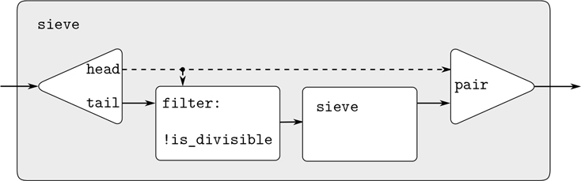

图 3.31：把素筛看成一个信号处理系统。每条实线代表一个正在传输的值流。从`head`到`pair`和`filter`的虚线表示这是单个值而不是流。

##### 隐式定义流

上面的`integers`和`fibs`流是通过指定“生成”函数来定义的，这些函数显式地逐个计算流元素。指定流的另一种方法是利用延迟求值来隐式定义流。例如，以下语句将流`ones`定义为一个无限的 1 流:

```js
const ones = pair(1, () => ones);
```

这很像递归函数的声明:`ones`是一个对，其`head`为 1，其`tail`是对`ones`求值的承诺。评估`tail`再次给我们一个 1 和一个评估`ones`的承诺，等等。

我们可以通过像`add_streams`这样的操作来操作流，从而产生两个给定流的元素和: [^(64)](#c3-fn-0064)

```js
function add_streams(s1, s2) {
    return stream_map_2((x1, x2) => x1 + x2, s1, s2);
}
```

现在我们可以将整数定义如下:

```js
const integers = pair(1, () => add_streams(ones, integers));
```

这将`integers`定义为第一个元素为 1 的流，其余元素为`ones`和`integers`的和。因此，`integers`的第二个元素是 1 加上`integers`的第一个元素，即 2；`integers`的第三个元素是 1 加上`integers`的第二个元素，或者说是 3；诸如此类。这个定义是可行的，因为在任何时候，已经生成了足够多的`integers`流，因此我们可以将它反馈到定义中，以生成下一个整数。

我们可以用同样的方式定义斐波那契数列:

```js
const fibs = pair(0,
                  () => pair(1,
                             () => add_streams(stream_tail(fibs),
                                               fibs)));
```

这个定义表明`fibs`是一个以 0 和 1 开始的流，因此流的其余部分可以通过将`fibs`加到自身上移位一个位置来生成:

|  |  | 1 | 1 | 2 | 3 | 5 | 8 | 13 | 21 | `. . .` | = | `stream_tail(fibs)` |
|  |  | 0 | 1 | 1 | 2 | 3 | 5 | 8 | 13 | `. . .` | = | `fibs` |
| 0 | 1 | 1 | 2 | 3 | 5 | 8 | 13 | 21 | 34 | `. . .` | = | `fibs` |

函数`scale_stream`在公式化这样的流定义中也是有用的。这将流中的每个项目乘以一个给定的常数:

```js
function scale_stream(stream, factor) {
    return stream_map(x => x * factor,
                      stream);
}
```

举个例子，

```js
const double = pair(1, () => scale_stream(double, 2));
```

产生 2: 1，2，4，8，16，32，.。。。

素数流的另一种定义可以从整数开始，通过测试素数来过滤它们。我们需要第一个素数 2 来开始:

```js
const primes = pair(2,
                    () => stream_filter(is_prime,
                                        integers_starting_from(3)));
```

这个定义并不像看起来那么简单，因为我们将通过检查`n`是否能被小于或等于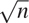的素数整除来测试一个数`n`是否是素数:

```js
function is_prime(n) {
    function iter(ps) {
        return square(head(ps)) > n
               ? true
               : is_divisible(n, head(ps))
               ? false
               : iter(stream_tail(ps));
    }
    return iter(primes);
}
```

这是一个递归定义，因为`primes`是根据`is_prime`谓词定义的，谓词本身使用`primes`流。这个函数起作用的原因是，在任何时候，已经生成了足够多的`primes`流来测试我们接下来需要检查的数字的素性。也就是说，对于我们测试的每一个 n ，要么`n`不是素数(在这种情况下，已经生成了一个素数将其除)，要么`n`是素数(在这种情况下，已经生成了一个素数——即，小于`n`的素数——大于)。 [^(65)](#c3-fn-0065) 

##### 练习 3.53

在不运行程序的情况下，描述由

```js
const s = pair(1, () => add_streams(s, s));
```

##### 练习 3.54

定义一个类似于`add_streams`的函数`mul_streams`，它产生两个输入流的元素乘积。与`integers`的流一起使用，完成流的以下定义，该流的第`n`个元素(从 0 开始计数)是 n + 1 阶乘:

```js
const factorials = pair(1, () => mul_streams(〈??〉, 〈??〉));
```

##### 练习 3.55

定义一个函数`partial_sums`，该函数将流 S 作为参数，返回元素为 SS[0]，S0+S[1]，S[0]+S1+S 的流。。。例如，`partial_sums(integers)`应该是流 1，3，6，10，15，。。。。

##### 练习 3.56

一个著名的问题，首先由 R. Hamming 提出，就是以升序无重复地枚举所有除了 2、3 或 5 以外没有质因数的正整数。一个显而易见的方法是简单地依次测试每个整数，看看它是否有 2、3 和 5 以外的因子。但是这是非常低效的，因为随着整数变大，越来越少的整数符合要求。或者，让我们调用所需的数字流`S`，并注意关于它的以下事实。

*   `S`以 1 开头。
*   `scale_stream(S, 2)`的元素也是`S`的元素。
*   对于`scale_stream(S, 3)`和`scale_stream(S, 5)`也是如此。
*   这些都是`S`的元素。

现在我们要做的就是结合这些来源的元素。为此，我们定义了一个函数`merge`，它将两个有序流合并成一个有序结果流，消除了重复:

```js
function merge(s1, s2) {
    if (is_null(s1)) {
        return s2;
    } else if (is_null(s2)) {
        return s1;
    } else {
        const s1head = head(s1);
        const s2head = head(s2);
        return s1head < s2head
               ? pair(s1head, () => merge(stream_tail(s1), s2))
               : s1head > s2head
               ? pair(s2head, () => merge(s1, stream_tail(s2)))
               : pair(s1head, () => merge(stream_tail(s1), stream_tail(s2)));
    }
}
```

然后可以用`merge`构造所需的流，如下所示:

```js
const S = pair(1, () => merge((??), (??)));
```

在标有 ( )的地方填上所缺的表达？？ ) 以上。

##### 练习 3.57

当我们使用基于`add_streams`函数的 fib 声明来计算第`n`个 Fibonacci 数时，执行了多少次加法？显示如果`add_streams`使用了练习 3.50 中描述的函数`stream_map_2_optimized`，这个数字会以指数方式大于执行加法的次数。 [^(66)](#c3-fn-0066)

##### 练习 3.58

解释由函数计算的流

```js
function expand(num, den, radix) {
    return pair(math_trunc((num * radix) / den),
                () => expand((num * radix) % den, den, radix));
}
```

其中`math_trunc`丢弃其参数的小数部分，这里是除法的余数。`expand(1, 7, 10)`产生的连续元素有哪些？`expand(3, 8, 10)`生产的是什么？

##### 练习 3.59

在 2.5.3 节中，我们看到了如何实现一个多项式算术系统，将多项式表示为一列项。用类似的方法，我们可以用幂级数来表示，比如

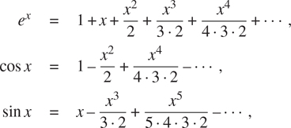

表示为无限的流。我们将序列 a[0]+a[1]x+a+[2]x²+a[3]x³+表示为其元素为系数的流。。。

1.  a. The integral of the series a[0] + a[1]x + a[2]x² + a[3]x³ +...is the series

    ```js
    c + a0x + a1x2 + a2x3 + a3x4 + ...
    ```

    其中`c`是任意常数。定义一个函数`integrate_series`，它将流 a [0] ， a [1] ， a [2] ，作为输入。。。代表一个幂级数和返回流一个一个 [0] ，一个， [1] ，，一个， [2] ，。。。级数的积分的非常数项的系数。(由于结果没有常数项，所以不代表一个幂级数；当我们使用`integrate_series`时，我们将使用`pair`将适当的常量连接到流的开头。)

2.  b. The function x  e^x is its own derivative. This implies that e^x and the integral of e^x are the same series, except for the constant term, which is e⁰ = 1\. Accordingly, we can generate the series for e^x as

    ```js
    const exp_series = pair(1, () => integrate_series(exp_series));
    ```

    展示如何生成正弦和余弦序列，从正弦的导数是余弦，余弦的导数是正弦的负值这一事实出发:

    ```js
    const cosine_series = pair(1, 〈??〉);
    const sine_series = pair(0, 〈??〉);
    ```

##### 练习 3.60

在练习 3.59 中，幂级数表示为系数流，加法级数由`add-streams`实现。完成以下乘法级数函数的声明:

```js
function mul_series(s1, s2) {
    pair(〈??〉, () => add_streams(〈??〉, 〈??〉));
}
```

你可以通过验证 sin²x+cos²x= 1 来测试你的函数，使用练习 3.59 中的数列。

##### 练习 3.61

设 S 是一个常数项为 1 的幂级数(习题 3.59)。假设我们要求幂级数 1/ S ，即级数`X`使得 S X = 1。写出 S= 1+S[R]其中 S[R]是 S 在常数项之后的部分。然后我们可以求解`X`如下:

| SX | = | 1 |
| (1+S[R])X | = | 1 |
| X+S[R]X | = | 1 |
| X | = | 1—S[R]X |

换句话说，`X`是常数项为 1，高阶项由 S[R]乘以`X`的负数给出的幂级数。用这个想法写一个函数`invert_ unit_series`，为一个含有常数项 1 的幂级数 S 计算 1/ S 。你需要使用练习 3.60 中的`mul_series`。

##### 练习 3.62

利用练习 3.60 和 3.61 的结果定义一个函数`div_series`，它将两个幂级数相除。函数`div_series`应该适用于任何两个数列，只要分母数列以非零常数项开始。(如果分母有一个零常数项，那么`div_series`应该发出错误信号。)展示如何使用`div_series`和练习 3.59 的结果来生成正切的幂级数。

### 3.5.3 利用流范例

具有延迟求值的流可以是一个强大的建模工具，提供了本地状态和赋值的许多好处。此外，它们避免了将赋值引入编程语言所带来的一些理论上的混乱。

流方法可能是有启发性的，因为它允许我们构建具有不同模块边界的系统，而不是围绕状态变量赋值组织的系统。例如，我们可以将整个时间序列(或信号)视为感兴趣的焦点，而不是单个时刻的状态变量的值。这便于组合和比较不同时刻的状态分量。

##### 将迭代公式化为流过程

在 1.2.1 节中，我们介绍了迭代过程，它通过更新状态变量来进行。我们现在知道，我们可以将状态表示为一个“永恒的”值流，而不是一组需要更新的变量。让我们从这个角度来回顾 1.1.7 节中的平方根函数。回想一下，这个想法是通过一次又一次地应用改进猜测的函数来为`x`的平方根生成一系列越来越好的猜测:

```js
function sqrt_improve(guess, x) {
    return average(guess, x / guess);
}
```

在我们最初的`sqrt`函数中，我们让这些猜测成为一个状态变量的连续值。相反，我们可以生成无限的猜测流，从 1:

```js
function sqrt_stream(x) {
    return pair(1, () => stream_map(guess => sqrt_improve(guess, x),
                                    sqrt_stream(x)));
}

display_stream(sqrt_stream(2));
1
1.5
1.4166666666666665
1.4142156862745097
1.4142135623746899
…
```

我们可以生成越来越多的流项，以获得越来越好的猜测。如果我们愿意，我们可以写一个函数，不断生成项，直到答案足够好。(见练习 3.64。)

我们可以用同样的方式处理的另一个迭代是基于我们在第 1.3.1 节中看到的交替序列生成对 π 的近似:

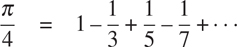

我们首先生成级数的被加数流(奇数整数的倒数，符号交替)。然后我们取越来越多的项的和的流(使用练习 3.55 的`partial_sums`函数)并将结果缩放 4:

```js
function pi_summands(n) {
    return pair(1 / n, () => stream_map(x => - x, pi_summands(n + 2)));
}
const pi_stream = scale_stream(partial_sums(pi_summands(1)), 4);

display_stream(pi_stream);
4
2.666666666666667
3.466666666666667
2.8952380952380956
3.3396825396825403
2.9760461760461765
3.2837384837384844
3.017071817071818
…
```

这给了我们一系列对 π 越来越好的近似，尽管这些近似收敛得相当慢。该序列的八项将 π 的值限制在 3.284 和 3.017 之间。

到目前为止，我们对状态流方法的使用与更新状态变量没有太大的不同。但是溪流给了我们一个做一些有趣的把戏的机会。例如，我们可以用一个序列加速器转换一个流，它将一个近似序列转换成一个新序列，这个新序列收敛到与原始序列相同的值，只是更快。

18 世纪瑞士数学家莱昂哈德·欧拉发明了这样一种加速器，它能很好地处理交替数列(具有交替符号的项的数列)的部分和。在欧拉的技巧中，如果 S[n]是原和序列的第`n`项，那么加速序列有项

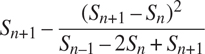

因此，如果原始序列被表示为值流，则变换后的序列由下式给出

```js
function euler_transform(s) {
    const s0 = stream_ref(s, 0);     // S[n][–1]
    const s1 = stream_ref(s, 1);     // S[n]
    const s2 = stream_ref(s, 2);     // S[n][+1]
    return pair(s2 - square(s2 - s1) / (s0 + (-2) * s1 + s2),
                memo(() => euler_transform(stream_tail(s))));
}
```

注意，我们利用了 3.5.1 节的记忆优化，因为在下文中，我们将依赖于结果流的重复评估。

我们可以用对 π 的一系列近似来证明欧拉加速度:

```js
display_stream(euler_transform(pi_stream));
3.166666666666667
3.1333333333333337
3.1452380952380956
3.13968253968254
3.1427128427128435
3.1408813408813416
3.142071817071818
3.1412548236077655
…
```

更好的是，我们可以加速加速序列，并递归地加速它，等等。也就是说，我们创建一个流的流(我们称之为 tableau 的结构)，其中每个流都是前一个流的转换:

```js
function make_tableau(transform, s) {
    return pair(s, () => make_tableau(transform, transform(s)));
}
```

画面的形式如下

| 年代 T21【00】年代 | s01 | s02 | s03 | s04 | . . . |
|  | s10 | ss[11] | s12 | s13 | . . . |
|  |  | s20 | s21 | s22 | . . . |
|  |  |  |  | . . . |  |

最后，我们通过取表格中每行的第一项来形成一个序列:

```js
function accelerated_sequence(transform, s) {
    return stream_map(head, make_tableau(transform, s));
}
```

我们可以演示这种 π 序列的“超加速”:

```js
display_stream(accelerated_sequence(euler_transform, pi_stream));
4
3.166666666666667
3.142105263157895
3.141599357319005
3.1415927140337785
3.1415926539752927
3.1415926535911765
3.141592653589778
…
```

结果令人印象深刻。取该序列的八项得到正确的值 π 到 14 位小数。如果我们只使用原始的 π 序列，我们将需要计算 10 个 ^(13 个)项的数量级(也就是说，将序列扩展到足够远，使单个项少于 10 个^(–13 个))才能获得那么高的精度！

我们可以在不使用流的情况下实现这些加速技术。但是流公式特别优雅和方便，因为整个状态序列对我们来说是一个数据结构，可以用一组统一的操作来操作。

##### 练习 3.63

Louis Reasoner 对由`sqrt_ stream`函数产生的流的性能不满意，并试图使用记忆化对其进行优化:

```js
function sqrt_stream_optimized(x) {
    return pair(1,
                memo(() => stream_map(guess =>
                                        sqrt_improve(guess, x),
                                      sqrt_stream_optimized(x))));
}
```

艾丽莎·P·哈克提出

```js
function sqrt_stream_optimized_2(x) {
    const guesses = pair(1,
                         memo(() => stream_map(guess =>
                                                 sqrt_improve(guess, x),
                                               guesses)));
    return guesses;
}
```

并声称路易斯的版本比她的效率低得多，因为它执行了多余的计算。解释一下艾丽莎的回答。没有记忆的 Alyssa 的方法会比最初的`sqrt_stream`更有效吗？

##### 练习 3.64

写一个函数`stream_limit`，它接受一个流和一个数字(公差)作为参数。它应该检查流，直到找到绝对值相差小于容差的两个连续元素，并返回两个元素中的第二个。利用这一点，我们可以通过下式计算给定容差范围内的平方根

```js
function sqrt(x, tolerance) {
    return stream_limit(sqrt_stream(x), tolerance);
}
```

##### 练习 3.65

使用该系列

计算 2 的自然对数的三个近似序列，与上面我们对 π 所做的一样。这些序列收敛的速度有多快？

##### 无限对流

在第 2.2.3 节中，我们看到了序列范式如何将传统的嵌套循环处理为在序列对上定义的过程。如果我们将这种技术推广到无限流，那么我们可以编写不容易表示为循环的程序，因为“循环”必须覆盖无限集合。

例如，假设我们想推广 2.2.3 节的`prime_sum_pairs`函数，以产生所有整数对( i ， j )与 i ≤ j 的流，使得 i + j 是素数。如果`int_pairs`是所有整数对( i ， j )与 i ≤ j 的序列，那么我们需要的流就是简单的 [^(67)](#c3-fn-0067)

```js
stream_filter(pair => is_prime(head(pair) + head(tail(pair))),
              int_pairs);
```

那么，我们的问题是产生流`int_pairs`。更一般的，假设我们有两个流 S=(S[I])和 T=(T[j])，想象一下无限矩形数组

| (S0，T0) | (S0，T1) | (S0，T2) | 。。。 |
| (S1，T0) | ( S [1] ， T [1] ) | (S1，T2) | 。。。 |
| (S2，T0) | (S2，T1) | (S2，T2) | 。。。 |
| 。。。 |  |  |  |

我们希望生成一个包含数组中位于对角线上或对角线上方的所有对的流，即

| (S0，T0) | (S0，T1) | (S0，T2) | 。。。 |
|  | (S1，T1) | (S1，T2) | 。。。 |
|  |  | (S2，T2) | 。。。 |
|  |  |  | 。。。 |

(如果我们将 S 和 T 都作为整数流，那么这将是我们想要的流`int_pairs`。)

称一般的偶对流为`pairs(S, T)`，认为它由三部分组成:pair ( S [0] ， T [0] )，第一排的其余 pairs，其余 pairs: [^(68)](#c3-fn-0068)

| (S0，T0) | (S0，T1) | (S0，T2) | 。。。 |
|  | ( S [1] ， T [1] ) | (S1，T2) | 。。。 |
|  |  | (S2，T2) | 。。。 |
|  |  |  | 。。。 |

注意这个分解中的第三部分(不在第一行的对)是(递归地)由`stream_tail(S)`和`stream_tail(T)`组成的对。还要注意，第二部分(第一行的其余部分)是

```js
stream_map(x => list(head(s), x),
stream_tail(t));
```

因此，我们可以如下形成我们的对流:

```js
function pairs(s, t) {
    return pair(list(head(s), head(t)),
                () => combine-in-some-way(
                          stream_map(x => list(head(s), x),
                                     stream_tail(t)),
                          pairs(stream_tail(s), stream_tail(t))));
}
```

为了完成这个功能，我们必须选择某种方式来合并这两个内部流。一种想法是使用第 2.2.1 节中的`append`函数的流模拟:

```js
function stream_append(s1, s2) {
    return is_null(s1)
           ? s2
           : pair(head(s1),
                  () => stream_append(stream_tail(s1), s2));
}
```

但是，这不适合无限流，因为在合并第二流之前，它会从第一流中取出所有元素。特别是，如果我们试图使用

```js
pairs(integers, integers);
```

我们的结果流将首先尝试遍历第一个整数等于 1 的所有对，因此永远不会产生第一个整数具有任何其他值的对。

为了处理无限的流，我们需要设计一个组合顺序，确保如果我们让程序运行足够长的时间，最终会到达每个元素。一种优雅的方式是使用下面的`interleave`函数: [^(69)](#c3-fn-0069)

```js
function interleave(s1, s2) {
    return is_null(s1)
           ? s2
           : pair(head(s1),
                  () => interleave(s2, stream_tail(s1)));
}
```

由于`interleave`交替地从两个流中获取元素，第二个流的每个元素最终都会找到进入交错流的路径，即使第一个流是无限的。

因此，我们可以生成所需的线对流，如下所示

```js
function pairs(s, t) {
    return pair(list(head(s), head(t)),
                () => interleave(stream_map(x => list(head(s), x),
                                            stream_tail(t)),
                                 pairs(stream_tail(s),
                                       stream_tail(t))));
}
```

##### 练习 3.66

检查流`pairs(integers, integers)`。你能对线对放入流中的顺序作出一般的评论吗？例如，大约有多少对在该对之前(1，100)？一对(99，100)？一对(100，100)？(如果你能在这里做出精确的数学陈述，那就更好了。但是如果你发现自己陷入了困境，请随意给出更多定性的答案。)

##### 练习 3.67

修改`pairs`函数，使`pairs(integers, integers)`产生所有对整数( i ， j )的流(没有条件 i ≤ j )。提示:你将需要混合在一个额外的流。

##### 练习 3.68

Louis Reasoner 认为从三个部分构建一个对子流是不必要的复杂。他没有将该对( S [0] ， T [0] )从第一行的其余对中分离出来，而是建议使用整个第一行，如下所示:

```js
function pairs(s, t) {
    return interleave(stream_map(x => list(head(s), x),
                                 t),
                      pair(stream_tail(s), stream_tail(t)));
}
```

这有用吗？考虑一下，如果我们用路易斯对`pairs`的定义来评估`pairs(integers, integers)`，会发生什么。

##### 练习 3.69

写一个函数`triples`，取三个无限流， S 、 T 和 U ，产生三元流( S [i] 、 T [j] 、 U [k] )，使得 i ≤ j ≤`k`用`triples`生成正整数的所有勾股三元组的流，即三元组( i ， j ， k )使得 i ≤ j 和 I²+j²=k

##### 练习 3.70

如果能够生成这样的流，其中的对以某种有用的顺序出现，而不是以从特别的交错过程中产生的顺序出现，那就太好了。我们可以使用类似于练习 3.56 的`merge`函数的技术，如果我们定义一种方式来说明一对整数“小于”另一对。一种方法是定义一个“加权函数” W ( i ， j )并规定( i [1] ， j [1] )小于( i [2] ， j )编写一个类似于`merge`的函数`merge_weighted`，除了`merge_weighted`采用了一个额外的参数`weight`，这是一个计算一个对的权重的函数，用于确定元素在结果合并流中出现的顺序。 [^(70)](#c3-fn-0070) 利用这一点，将`pairs`推广为一个函数`weighted_pairs`，该函数接受两个流以及一个计算加权函数的函数，并生成根据权重排序的对流。使用您的函数生成

1.  a. 所有正整数对( i ， j )与 i ≤ j 的流按总和 i + j 排序
2.  b. 所有正整数对( i ， j )与 i ≤ j 的流，其中 i 和 j 都不能被 2、3 或 5 整除，这些对按和 2 i 排序

##### 练习 3.71

可以用多种方式表示为两个立方之和的数字有时被称为拉马努金数，以纪念数学家斯里尼瓦瑟·拉马努金。 [^(71)](#c3-fn-0071) 有序的对流为计算这些数字的问题提供了一个优雅的解决方案。要找到一个可以用两种不同方式写成两个立方之和的数，我们只需要生成根据总和 I³+j³加权的整数对( i ， j )的流(见练习 3.70)，然后在流中搜索两个连续的具有相同权重的对。编写一个函数来生成 Ramanujan 数。第一个数字是 1729。接下来的五个是什么？

##### 练习 3.72

以类似于练习 3.71 的方式生成一个所有数字的流，这些数字可以用三种不同的方式写成两个平方的和(展示它们是如何写成的)。

##### 作为信号的流

我们开始讨论流时，将它们描述为信号处理系统中“信号”的计算模拟。事实上，我们可以使用流以非常直接的方式来模拟信号处理系统，将连续时间间隔内的信号值表示为流的连续元素。例如，我们可以实现一个积分器或加法器，对于一个输入流 x=(x[I])、一个初始值 C 和一个小增量 dt ，累加总和

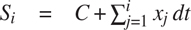

并返回值流 S=(S[I])。下面的`integral`函数让人想起整数流的“隐式风格”定义(第 3.5.2 节):

```js
function integral(integrand, initial_value, dt) {
    const integ = pair(initial_value,
                       () => add_streams(scale_stream(integrand, dt),
                                         integ));
    return integ;
}
```

图 3.32：是对应于`integral`功能的信号处理系统图。输入流由 dt 缩放并通过加法器，加法器的输出通过相同的加法器返回。`integ`定义中的自参考通过反馈回路反映在图中，反馈回路将加法器的输出连接到其中一个输入。

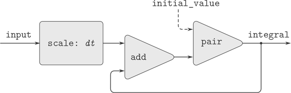

图 3.32：`integral`功能视为信号处理系统。

##### 练习 3.73

我们可以使用流来模拟电路，以表示一系列时间内的电流或电压值。例如，假设我们有一个由电阻 R 的电阻器和电容 C 的电容器串联而成的 RC 电路。电路对注入电流 i 的电压响应 v 由图 3.33：中的公式确定，其结构如随附的信号流程图所示。

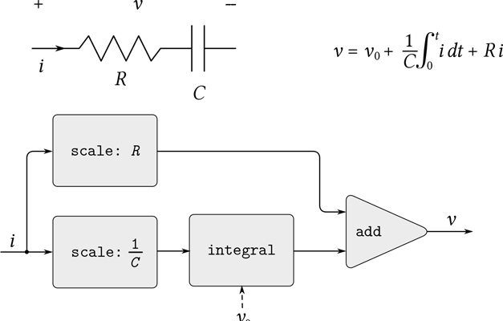

图 3.33：一个 RC 电路和相关的信号流程图。

写一个函数`RC`来模拟这个电路。`RC`应将 R 、 C 和 dt 的值作为输入，并应返回一个函数，该函数将代表电流 i 的流和电容器电压 v0 的初始值作为输入，并产生电压流 v 作为输出。例如，您应该能够使用`RC`来模拟一个 RC 电路，其中 R = 5 欧姆， C = 1 法拉，并且通过评估`const RC1 = RC(5, 1, 0.5)`获得 0.5 秒的时间步长。这将`RC1`定义为一个函数，该函数采用代表电流时序的流和初始电容器电压，并产生电压输出流。

##### 练习 3.74

Alyssa P. Hacker 正在设计一个系统来处理来自物理传感器的信号。她希望产生的一个重要特征是描述输入信号的过零点的信号。也就是说，每当输入信号从负变为正时，结果信号应为+1；每当输入信号从正变为负时，结果信号应为–1；否则，结果信号应为 0。(假设 0 输入的符号为正。)例如，典型的输入信号及其相关的过零信号为

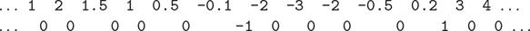

在 Alyssa 的系统中，来自传感器的信号被表示为流`sense_data`并且流`zero_crossings`是相应的过零流。Alyssa 首先编写一个函数`sign_change_detector`,它将两个值作为参数，并比较这些值的符号以产生一个合适的 0、1 或–1。然后，她按如下方式构建零交叉流:

```js
function make_zero_crossings(input_stream, last_value) {
    return pair(sign_change_detector(head(input_stream), last_value),
                () => make_zero_crossings(stream_tail(input_stream),
                                          head(input_stream)));
}
const zero_crossings = make_zero_crossings(sense_data, 0);
```

Alyssa 的老板 EvaLuAtor 走过并建议该程序大致相当于下面的程序，该程序使用了练习 3.50 中的函数`stream_map_2`:

```js
const zero_crossings = stream_map_2(sign_change_detector,
                                    sense_data,
                                    expression);
```

通过提供指示的表达式完成程序。

##### 练习 3.75

不幸的是，练习 3.74 中 Alyssa 的过零检测器被证明是不够的，因为来自传感器的噪声信号会导致伪过零。硬件专家 Lem E. Tweakit 建议 Alyssa 在提取过零点之前对信号进行平滑处理，以滤除噪声。Alyssa 采纳了他的建议，决定从信号中提取过零点，该信号是通过将检测数据的每个值与前一个值进行平均而构建的。她向她的助手路易斯·雷森纳解释了这个问题，助手试图实现这个想法，将艾丽莎的程序修改如下:

```js
function make_zero_crossings(input_stream, last_value) {
    const avpt = (head(input_stream) + last_value) / 2;
    return pair(sign_change_detector(avpt, last_value),
                () => make_zero_crossings(stream_tail(input_stream),
                                          avpt));
}
```

这没有正确地实施艾丽莎的计划。找到 Louis 已经安装的 bug，在不改变程序结构的情况下修复它。(提示:您需要将参数的数量增加到`make_zero_crossings`。)

##### 练习 3.76

伊娃·卢·阿托尔对路易斯在练习 3.75 中的方法提出了批评。他写的程序不是模块化的，因为它混合了平滑和过零提取的操作。例如，如果 Alyssa 找到了更好的方法来调节她的输入信号，提取器就不必改变。通过编写一个函数`smooth`来帮助 Louis，该函数将一个流作为输入，并产生一个流，其中每个元素都是两个连续输入流元素的平均值。然后使用`smooth`作为组件，以更加模块化的方式实现过零检测器。

### 3.5.4 流和延迟评估

上一节末尾的`integral`函数展示了我们如何使用流来建模包含反馈回路的信号处理系统。图 3.32 中[所示加法器的反馈回路是由`integral`的内部流`integ`本身定义的:](#c3-fig-0036)

```js
const integ = pair(initial_value,
                   () => add_streams(scale_stream(integrand, dt),
                                     integ));
```

解释器处理这种隐式定义的能力取决于在 Lambda  表达式中包装对`add_streams`的调用所导致的延迟。如果没有这个延迟，解释器就不能在评估对`add_streams`的调用之前构造`integ`，这需要已经定义了`integ`。一般来说，这样的延迟对于使用流来模拟包含循环的信号处理系统是至关重要的。没有延迟，我们的模型将不得不公式化，以便任何信号处理组件的输入都将在产生输出之前得到充分评估。这将禁止循环。

不幸的是，具有循环的系统的流模型可能需要使用超过目前所见的流编程模式的延迟。例如，图 3.34：所示为求解微分方程`dy/dt=f(y)`的信号处理系统，其中`f`为给定函数。该图示出了将`f`应用于其输入信号的映射部件，该映射部件在反馈回路中以非常类似于模拟计算机电路的方式链接到积分器，该模拟计算机电路实际上用于求解这种方程。

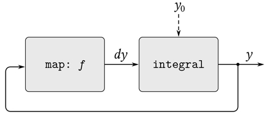

图 3.34：一个求解方程`dy/dt=f(y)`的“模拟计算机电路”。

假设给我们一个初始值`y0`用于`y`，我们可以尝试使用函数来建模这个系统

```js
function solve(f, y0, dt) {
    const y = integral(dy, y0, dt);
    const dy = stream_map(f, y);
    return y;
}
```

该功能不起作用，因为在`solve`的第一行中，对`integral`的调用需要定义输入`dy`，直到`solve`的第二行才会发生。

另一方面，我们定义的意图是有意义的，因为原则上我们可以在不知道`dy`的情况下开始生成`y`流。的确，`integral`和许多其他流操作可以在只给出关于论点的部分信息的情况下生成部分答案。对于`integral`，输出流的第一个元素是指定的`initial_value`。因此，我们可以生成输出流的第一个元素，而无需计算被积函数`dy`。一旦我们知道了`y`的第一个元素，那么`solve`第二行的`stream_map`就可以开始工作，生成`dy`的第一个元素，这样就会产生`y`的下一个元素，以此类推。

为了利用这个想法，我们将重新定义`integral`来期望被积函数流是一个延迟自变量。函数`integral`将强制被积函数仅在需要生成输出流的第一个元素之外的元素时进行计算:

```js
function integral(delayed_integrand, initial_value, dt) {
    const integ =
        pair(initial_value, 
             () => {
                 const integrand = delayed_integrand();
                 return add_streams(scale_stream(integrand, dt),
                                    integ);
             });
    return integ;
}
```

现在我们可以通过在`y`的声明中延迟`dy`的求值来实现我们的`solve`函数:

```js
function solve(f, y0, dt) {
    const y = integral(() => dy, y0, dt);
    const dy = stream_map(f, y);
    return y;
}
```

一般来说，`integral`的每个调用者现在必须延迟被积函数的自变量。我们可以通过计算微分方程`dy/dt=y`、初始条件`y(0)= 1`[^(72)](#c3-fn-0072)的解在`y = 1`时的值来证明`solve`函数的工作原理

```js
stream_ref(solve(y => y, 1, 0.001), 1000);
2.716923932235896
```

##### 练习 3.77

上面使用的`integral`函数类似于 3.5.2 节中无限整数流的“隐式”定义。或者，我们可以给`integral`一个更像`integers-starting-from`的定义(也在第 3.5.2 节):

```js
function integral(integrand, initial_value, dt) {
    return pair(initial_value,
                is_null(integrand)
                ? null
                : integral(stream_tail(integrand),
                           dt * head(integrand) + initial_value,
                           dt));
}
```

当在有循环的系统中使用时，这个函数和我们最初版本的`integral`有同样的问题。修改该函数，使其将`integrand`作为一个延迟参数，从而可以在上面显示的`solve`函数中使用。

##### 练习 3.78

考虑设计一个信号处理系统来研究齐次二阶线性微分方程的问题

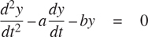

建模为`y`的输出流由包含环路的网络生成。这是因为 d²y/dt²的值取决于`y`和 dy / dt 的值，而这两者都是通过对 d²y/dt^(2^(的积分来确定的我们要编码的图表如图 3.35：所示。编写一个函数`solve_2nd`，该函数将常量`a`、`b`和 dt 以及初始值 y [0] 和 dy [0] 作为参数，并生成连续值 y))

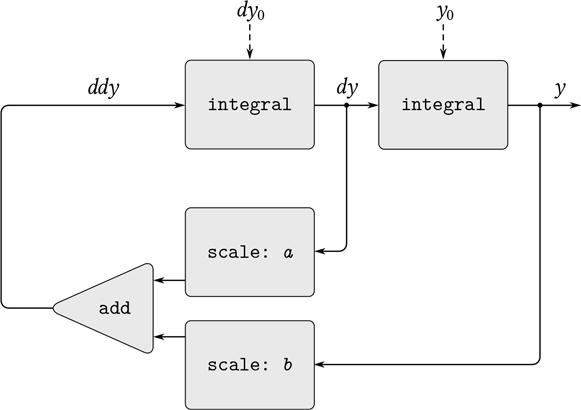

图 3.35：二阶线性微分方程解的信号流图。

##### 练习 3.79

将习题 3.78 的`solve_2nd`函数进行推广，使其可以用于求解一般二阶微分方程 d²y/dt²=f(dy/dt， y )。

##### 练习 3.80

串联 RLC 电路由一个电阻、一个电容和一个电感串联而成，如图 3.36：所示。如果`R`、`L`和`C`是电阻、电感和电容，那么这三个元件的电压(`v`)和电流(`i`)之间的关系由以下等式描述

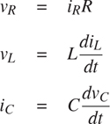

并且电路连接规定了关系

```js
iR = iL = –iC
vC = vL + vR
```

结合这些等式可以看出，电路的状态(由电容器两端的电压`v[C]`和电感器中的电流`I[L]`概括)由一对微分方程描述


代表该微分方程系统的信号流图如图 3.37 所示。

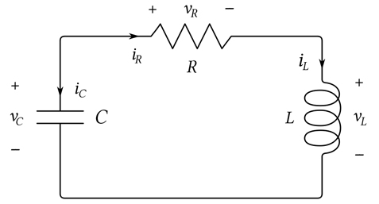

图 3.36：一系列 RLC 电路。

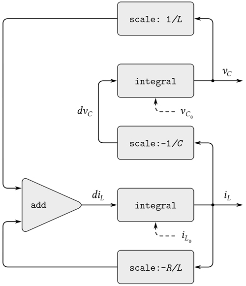

图 3.37：串联 RLC 电路解决方案的信号流图。

编写一个函数`RLC`，将电路的参数`R`、`L`和`C`以及时间增量`dt`作为参数。以类似于练习 3.73 的`RC`函数的方式，`RLC`应该产生一个函数，该函数取状态变量`v[C0]`和`i[L0]`的初始值，并产生一对(使用`pair`)状态流`v[C]`和`i[L]`。使用`RLC`，生成模拟串联 RLC 电路行为的一对流，其中`R = 1`欧姆，`C = 0.2`法拉，`L = 1`亨利，`dt = 0.1`秒，初始值`i[L0] = 0`安培，`v[C0] = 10`伏。

##### 正常顺序评估

本节中的例子说明了延迟求值如何提供了很大的编程灵活性，但同样的例子也说明了这会如何使我们的程序变得更加复杂。例如，我们新的`integral`函数给了我们用循环建模系统的能力，但是我们现在必须记住`integral`应该用一个延迟的被积函数来调用，每个使用`integral`的函数都必须意识到这一点。实际上，我们已经创建了两类函数:普通函数和接受延迟参数的函数。一般来说，创建独立的函数类也迫使我们创建独立的高阶函数类。 [^(73)](#c3-fn-0073)

避免需要两个不同类的函数的一种方法是让所有函数都接受延迟参数。我们可以采用一种评估模型，在这种模型中，函数的所有参数都被自动延迟，只有在实际需要时才强制使用参数(例如，当一个基本操作需要它们时)。这将把我们的语言转换成使用正常顺序求值，这是我们在 1.1.5 节介绍求值的替换模型时首次描述的。转换为正常顺序求值提供了一种统一而优雅的方式来简化延迟求值的使用，如果我们只关心流处理，这将是一种自然的策略。在 4.2 节中，在我们学习了赋值器之后，我们将看到如何以这种方式转换我们的语言。不幸的是，函数调用中的延迟严重影响了我们设计依赖于事件顺序的程序的能力，例如使用赋值、改变数据或执行输入或输出的程序。正如练习 3.51 和 3.52 所示，即使是一对尾部中的一个延迟也会造成巨大的混乱。众所周知，可变性和延迟求值在编程语言中不能很好地混合。

### 3.5.5 功能程序的模块化和对象的模块化

正如我们在 3.1.2 节中看到的，引入赋值的主要好处之一是，我们可以通过在局部变量中封装或“隐藏”大系统的部分状态来增加系统的模块化。流模型可以在不使用赋值的情况下提供等效的模块性。作为一个例子，我们可以从流处理的角度重新实现 π 的蒙特卡罗估计，我们在第 3.1.2 节中对此进行了研究。

关键的模块化问题是，我们希望对使用随机数的程序隐藏随机数生成器的内部状态。我们从一个函数`rand_update`开始，它的连续值为我们提供了随机数，并用它来产生一个随机数生成器:

```js
function make_rand() {
    let x = random_init;
    return () => {
               x = rand_update(x);
               return x;
           };
}
const rand = make_rand();
```

在流公式中，没有随机数生成器本身，只有连续调用`rand_update`产生的随机数流:

```js
const random_numbers =
    pair(random_init,
         () => stream_map(rand_update, random_numbers));
```

我们用它来构建在`random_numbers`流中的连续对上进行的塞萨罗实验的结果流:

```js
function map_successive_pairs(f, s) {
    return pair(f(head(s), head(stream_tail(s))),
                () => map_successive_pairs(
                          f,
                          stream_tail(stream_tail(s))));
}
const dirichlet_stream =
    map_successive_pairs((r1, r2) => gcd(r1, r2) === 1,
                         random_numbers);
```

`dirichlet_stream`现在被输入到一个`monte_carlo`函数中，这个函数产生一系列概率估计。结果然后被转换成一串估计值 π 。这个版本的程序不需要一个参数来告诉要进行多少次试验。对 π (通过执行更多的实验)的更好估计是通过更深入地观察`pi`流获得的:

```js
function monte_carlo(experiment_stream, passed, failed) {
    function next(passed, failed) {
        return pair(passed / (passed + failed),
                    () => monte_carlo(stream_tail(experiment_stream),
                                      passed, failed));
    }
    return head(experiment_stream)
           ? next(passed + 1, failed)
           : next(passed, failed + 1);
}
const pi = stream_map(p => math_sqrt(6 / p),
                      monte_carlo(dirichlet_stream, 0, 0));
```

这种方法有相当大的模块化，因为我们仍然可以制定一个通用的`monte_carlo`函数来处理任意的实验。然而没有分配或本地状态。

##### 练习 3.81

练习 3.6 讨论了推广随机数发生器，允许重置随机数序列，从而产生可重复的“随机”数序列。产生该相同生成器的流公式，该生成器对请求的输入流进行操作以`"generate"`新的随机数或将序列`"reset"`为指定值，并产生期望的随机数流。不要在你的解决方案中使用赋值。

##### 练习 3.82

重做练习 3.5 关于蒙特卡罗流积分。`estimate_integral`的流版本将不会有一个参数来告诉执行多少次试验。取而代之的是，它将会产生一系列基于更多试验的评估。

##### 函数式编程的时间观

现在让我们回到本章开始时提出的对象和状态的问题，并从一个新的角度来研究它们。我们引入了赋值和可变对象，为用状态建模系统的程序的模块化构造提供了一种机制。我们用局部状态变量构造计算对象，并用赋值来修改这些变量。我们通过相应计算对象的时间行为来模拟世界中对象的时间行为。

现在我们已经看到，流提供了一种用本地状态建模对象的替代方法。我们可以用一个代表连续状态时间历程的流来模拟一个变化的量，比如某个物体的局部状态。本质上，我们使用流显式地表示时间，以便我们将模拟世界中的时间与评估过程中发生的事件序列分离。事实上，由于延迟评估的存在，模型中的模拟时间和评估过程中的事件顺序之间可能没有什么关系。

为了对比这两种建模方法，让我们重新考虑监控银行账户余额的“取款处理器”的实现。在 3.1.3 节中，我们实现了这种处理器的简化版本:

```js
function make_simplified_withdraw(balance) {
    return amount => {
               balance = balance - amount;
               return balance;
           };
}
```

对`make_simplified_withdraw`的调用产生计算对象，每个对象都有一个本地状态变量`balance`,该变量随着对该对象的连续调用而递减。该对象接受一个`amount`作为参数，并返回新的余额。我们可以想象一个银行帐户的用户向这样一个对象输入一系列的输入，并观察显示屏上显示的一系列返回值。

或者，我们可以将取款处理器建模为一个函数，该函数将余额和要取款的金额流作为输入，并生成帐户中连续的余额流:

```js
function stream_withdraw(balance, amount_stream) {
    return pair(balance,
                () => stream_withdraw(balance - head(amount_stream),
                                      stream_tail(amount_stream)));
}
```

函数`stream_withdraw`实现了一个定义明确的数学函数，其输出完全由其输入决定。然而，假设输入`amount_stream`是用户输入的连续值流，并且显示结果余额流。然后，从正在键入值和观看结果的用户的角度来看，流过程具有与由`make_simplified_withdraw`创建的对象相同的行为。然而，在流版本中，没有赋值，没有局部状态变量，因此没有我们在 3.1.3 节中遇到的理论上的困难。然而系统有状态！

这真是了不起。尽管`stream_withdraw`实现了一个行为不变的明确定义的数学函数，但用户的感觉是在与一个状态不断变化的系统进行交互。解决这个矛盾的一个方法是意识到是用户的暂时存在将状态强加给了系统。如果用户可以从交互中退一步，从余额流而不是单个交易的角度来考虑问题，那么系统就会显得无状态。 [^(74)](#c3-fn-0074)

从一个复杂过程的一部分的角度来看，其他部分似乎随着时间而变化。它们隐藏了时变局部状态。如果我们希望用计算机中的结构编写程序来模拟我们世界中的这种自然分解(从我们的角度来看，它是那个世界的一部分)，我们就会制造出没有功能的计算对象——它们必须随时间而变化。我们用局部状态变量来模拟状态，我们用对这些变量的赋值来模拟状态的变化。通过这样做，我们使计算模型的执行时间成为我们所在的世界的时间，因此我们在我们的计算机中得到“对象”。

用对象建模是强大而直观的，很大程度上是因为这符合与我们所在的世界互动的感觉。然而，正如我们在本章中反复看到的，这些模型提出了约束事件顺序和同步多个过程的棘手问题。避免这些问题的可能性刺激了函数式编程语言的发展，它不包括任何赋值或可变数据的规定。在这种语言中，所有函数都实现了其参数的明确定义的数学函数，其行为不会改变。函数方法对于处理并发系统非常有吸引力。 [^(75)](#c3-fn-0075)

另一方面，如果我们仔细观察，我们可以看到与时间相关的问题也悄悄进入功能模型。当我们希望设计交互系统时，尤其是对独立实体之间的交互进行建模时，会出现一个特别麻烦的领域。例如，再次考虑允许联合银行账户的银行系统的实现。在使用赋值和对象的传统系统中，我们将通过让 Peter 和 Paul 向同一个银行帐户对象发送他们的交易请求来模拟 Peter 和 Paul 共享一个帐户的事实，正如我们在 3.1.3 节中看到的。从流的角度来看，这里没有“对象”本身，我们已经指出，银行帐户可以被建模为一个流程，该流程对一个事务请求流进行操作以产生一个响应流。因此，我们可以通过将彼得的交易请求流与保罗的请求流合并，并将结果提供给银行账户流流程，来模拟彼得和保罗拥有联合银行账户的事实，如图 3.38：所示。

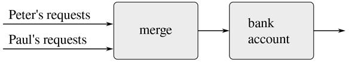

图 3.38：一个联名银行账户，通过合并两个交易请求流来建模。

这个公式的问题在于合并的概念。通过简单地交替接受彼得的一个请求和保罗的一个请求来合并这两个流是不行的。假设 Paul 很少访问该帐户。我们很难强迫 Peter 在 Paul 发出第二笔交易之前等待 Paul 访问帐户。然而，这样的合并被实现时，它必须以某种方式交错两个事务流，这种方式受到 Peter 和 Paul 所理解的“实时”的约束，也就是说，如果 Peter 和 Paul 相遇，他们可以同意某些事务在会议之前被处理，而其他事务在会议之后被处理。 [^(76)](#c3-fn-0076) 这正是我们在第 3.4.1 节中必须处理的约束，我们发现需要引入显式同步，以确保在带状态的对象的并发处理中事件的“正确”顺序。因此，在试图支持函数式风格时，合并来自不同代理的输入的需要再次引入了函数式风格想要消除的相同问题。

我们开始这一章的目标是建立计算模型，其结构与我们对我们试图建模的真实世界的感知相匹配。我们可以将世界建模为一个独立的、有时间限制的、有状态的相互作用的物体的集合，或者我们可以将世界建模为一个单一的、永恒的、无状态的统一体。每种观点都有强大的优势，但没有一种观点是完全令人满意的。大统一尚未出现。 [^(77)](#c3-fn-0077)*****  ***[1](#c3-fn-0001a) 其实这也不尽然。一个例外是第 1.2.6 节中的随机数生成器。另一个例外涉及到我们在 2.4.3 节中介绍的操作/类型表，其中对具有相同参数的`get`的两个调用的值取决于对`put`的中间调用。另一方面，在我们引入赋值之前，我们没有办法自己创建这样的函数。

[2](#c3-fn-0002a) 赋值的值就是赋予名称的值。赋值表达式语句看起来类似于并且不应该与形式为
constname=value的常量和变量声明相混淆；

**设** 名 = 值；
其中新声明的名与一个值相关联。赋值表达式看起来类似于且不应与形式为
表达式[1]= =表达式 [2]
的表达式混淆，如果表达式 [1] 的值与表达式 [2 的值相同]

我们已经在程序中隐式地使用了序列，因为在 JavaScript 中，函数的体块可以包含一系列的函数声明，后跟一个返回语句，而不仅仅是一个返回语句，如 1.1.8 节所讨论的。

第 2.2.4 节介绍了作为 Lambda  表达式主体的 4 个块。

在编程语言行话中，变量`balance`被称为封装在`new_withdraw`函数中的。封装反映了被称为隐藏原则的一般系统设计原则:通过保护系统的各个部分相互独立，可以使系统更加模块化和健壮；也就是说，只向系统中那些“需要知道”的部分提供信息访问

[6](#c3-fn-0006a) 与上面的`make_withdraw_balance_100`相反，我们不必使用`**let**`来使`balance`成为局部变量，因为参数已经是局部的了。在第 3.2 节讨论了评估的环境模型后，这一点将会更加清楚。(另见练习 3.10。)

[7](#c3-fn-0007a) 实现`rand_update`的一种常见方式是使用`x`更新为`ax + b mod m`的规则，其中`a`、`b`、`m`为适当选取的整数。Knuth 1997b 的第 3 章包括对产生随机数序列和建立它们的统计特性的技术的广泛讨论。注意，`rand_update`函数计算一个数学函数:给定相同的输入两次，它产生相同的输出。因此，`rand_update`产生的数字序列肯定不是“随机的”，如果我们坚持认为序列中的每个数字都与前面的数字无关。“真正的随机性”和所谓的伪随机序列之间的关系是一个复杂的问题，涉及数学和哲学中的难题，而所谓的伪随机序列是由充分确定的计算产生的，并且具有适当的统计特性。Kolmogorov、Solomonoff 和 Chaitin 在澄清这些问题方面取得了很大进展；Chaitin 1975 年发表了一篇讨论文章。

[8](#c3-fn-0008a) 这个定理是由于勒尤尼的狄利克雷。参见 Knuth 1997b 第 4.5.2 节的讨论和证明。

我们不替换赋值中出现的`balance`,因为赋值中的名字没有被赋值。如果我们真的替换它，我们会得到`25 = 25 - amount;`，这毫无意义。

[10](#c3-fn-0010a) 单个计算对象被多个名字访问的现象称为别名。联合银行账户的情况说明了别名的一个非常简单的例子。在 3.3 节中，我们将看到更复杂的例子，比如共享部分的“不同的”复合数据结构。如果我们忘记了作为一种“副作用”，对一个对象的改变也可能改变一个“不同的”对象，因为这两个“不同的”对象实际上是以不同别名出现的单个对象，那么程序中就会出现错误。这些所谓的副作用错误是如此难以定位和分析，以至于一些人已经提出编程语言的设计应该不允许副作用或混淆(兰普森等人 1981；莫里斯、施密特和瓦德勒 1980)。

有鉴于此，具有讽刺意味的是，入门编程通常是以一种高度命令式的风格教授的。这可能是 20 世纪 60 年代和 70 年代普遍存在的一种信念的残余，即调用函数的程序必然比执行赋值的程序效率低。(斯蒂尔(1977)驳斥了这一论点。)或者，它可能反映了一种观点，即对于初学者来说，逐步赋值比函数调用更容易可视化。不管是什么原因，它经常让程序员开始担心“我应该在那个变量之前还是之后设置这个变量”，这可能会使编程变得复杂，并模糊重要的思想。

[12](#c3-fn-0012a) 赋值为评估规则的步骤 1 引入了微妙之处。如练习 3.8 所示，赋值的存在使我们可以根据组合中子表达式的求值顺序来编写产生不同值的表达式。为了消除这种歧义，JavaScript 规定了组合的子表达式和应用程序的参数表达式的从左到右求值。

[13](#c3-fn-0013a) 第一章的脚注 54 提到了两者在全 JavaScript 中的细微差别，这一点我们在本书中会忽略。

我们在第一章的脚注 54 中提到过，完整的 JavaScript 语言允许给用函数声明声明的名字赋值。

[15](#c3-fn-0015a) 这个例子没有利用参数`x`是一个变量的事实，但是回忆一下 3.1.1 节中的函数`make_withdraw`，它依赖于它的参数是一个变量。

环境模型不会澄清我们在 1.2.1 节中的声明，即解释器可以使用尾递归在一个恒定的空间量中执行一个函数，例如`fact_iter`。我们将在 5.4 节讨论解释器的控制结构时讨论尾部递归。

[17](#c3-fn-0017a)`W1`和`W2`是否共享存储在计算机中的同一个物理代码，或者是否各自保留代码的副本，都是实现的细节。对于我们在第 4 章中实现的解释器，代码实际上是共享的。

这解释了第一章脚注 56 中的程序出错的原因。创建名称绑定和评估名称声明之间的时间称为时间死区 (TDZ)。

[19](#c3-fn-0019a) 函数`set_head`和`set_tail`返回值`undefined`。它们应该仅仅为了它们的效果而被使用。

从这里我们可以看出，列表上的变异操作会产生“垃圾”,它不属于任何可访问的结构。我们将在 5.3.2 节中看到 JavaScript 内存管理系统包括一个垃圾收集器，它识别并回收不需要的内存对所使用的内存空间。

第 5.3.1 节将展示内存管理系统如何实现`get_new_pair`。

这两对是不同的，因为每次调用`pair`都会返回一个新的对。字符串是“相同的”,因为它们是由相同顺序的相同字符组成的原始数据(就像数字一样)。因为 JavaScript 没有提供改变字符串的方法，所以 JavaScript 解释器的设计者可能决定为字符串实现的任何共享都是不可检测的。我们认为原始数据如数字、布尔和字符串是相同的，当且仅当它们是不可区分的。

[23](#c3-fn-0023a) 处理可变数据对象共享的微妙之处反映了 3.1.3 节中提出的“相同”和“变化”的潜在问题。我们在那里提到，承认我们的语言的变化需要一个复合对象必须有一个“身份”,不同于组成它的片段。在 JavaScript 中，我们认为这个“身份”是由`===`测试的质量，也就是指针的相等性。由于在大多数 JavaScript 实现中，指针本质上是一个内存地址，我们通过规定数据对象“本身”是存储在计算机中某个特定内存位置集合中的信息来“解决”定义对象标识的问题。这对于简单的 JavaScript 程序来说已经足够了，但是对于解决计算模型中的“相同性”问题来说，这并不是一个通用的方法。

[24](#c3-fn-0024a) 另一方面，从实现的角度来看，赋值需要我们修改环境，这本身就是一个可变的数据结构。因此，赋值和变异是等价的:每一个都可以根据另一个来实现。

[25](#c3-fn-0025a) 如果第一项是队列中的最后一项，那么前面的指针就是删除后的空列表，会将队列标记为空；我们不用担心更新后面的指针，它还是会指向被删除的条目，因为`is_empty_queue`只看前面的指针。

注意不要让解释器试图打印包含循环的结构。(参见练习 3.13。)

[27](#c3-fn-0027a) 因为`assoc`用的是`equal`，所以它可以识别字符串、数字或者列表结构的按键。

因此，第一个主干对是代表表格“本身”的对象；也就是说，指向表的指针就是指向这一对的指针。这个骨干对总是从桌子开始。如果我们没有以这种方式安排事情，那么当添加一条新记录时，`insert`将不得不返回一个新的值作为表的开始。

全加器是将两个二进制数相加的基本电路元件。这里`A`和`B`是两个数相加后对应位置的位，`C`是相加后向右一位的进位。该电路产生`SUM`，它是相应位置的`SUM`位，以及`C[out]`，它是要向左传播的进位位。

这些函数只是简单的语法糖，允许我们使用普通的函数语法来访问对象的局部函数。令人惊讶的是，我们可以以如此简单的方式互换“功能”和“数据”的角色。例如，如果我们写`wire("get_signal")`，我们认为`wire`是一个函数，它以消息`"get_signal"`作为输入被调用。或者，编写`get_signal(wire)`鼓励我们将`wire`视为一个数据对象，它是函数`get_signal`的输入。事实是，在一种我们可以将函数作为对象处理的语言中，“函数”和“数据”之间没有根本的区别，我们可以选择我们的语法糖，允许我们以我们选择的任何风格编程。

议程是一个标题列表，就像第 3.3.3 节中的表格一样，但是由于列表是以时间为标题的，所以我们不需要额外的虚拟标题(例如与表格一起使用的`"*table*"`字符串)。

注意到这个函数中的条件语句有一个空块作为它的替代语句。这种“单臂条件语句”用于决定是否做某事，而不是在两个语句之间进行选择。

这样，当前时间将始终是最近处理动作的时间。将该时间存储在议程的开头确保了即使相关联的时间段已经被删除，该时间仍然是可用的。

[34](#c3-fn-0034a) 约束传播首先出现在伊凡·苏泽兰令人难以置信的前瞻性画板系统中(1963)。Alan Borning (1977)在施乐帕洛阿尔托研究中心开发了一个基于 Smalltalk 语言的漂亮的约束传播系统。萨斯曼、斯托尔曼和斯蒂尔将约束传播应用于电路分析(萨斯曼和斯托尔曼 1975；苏斯曼和斯蒂尔 1980)。TK！Solver (Konopasek 和 Jayaraman 1984)是一个基于约束的广泛的建模环境。

[35](#c3-fn-0035a)`setter`可能不是约束。在我们的温度示例中，我们使用`"user"`作为`setter`。

[36](#c3-fn-0036a) 我们可以使用 2.3.1 节中的函数`member`来测试`new_constraint`是否已经在`constraints`中，尽管`member`被介绍为限于数字和字符串，因为我们在 3.3.1 节中将`===`扩展为指针相等。

面向表达式的格式很方便，因为它避免了在计算中命名中间表达式的需要。我们最初对约束语言的表述很麻烦，就像许多语言在处理复合数据上的操作时很麻烦一样。例如，如果我们想要计算乘积(a+b)(c+d)，其中变量表示向量，我们可以以“命令式”方式工作，使用函数设置指定向量参数的值，但它们本身不返回向量值:
v_sum("a "，" b "，temp 1)；
v_sum("c "，" d "，temp 2)；
v_prod(temp1，temp2，答案)；
或者，我们可以使用返回向量作为值的函数来处理表达式，从而避免显式提及`temp1`和`temp2`:
constanswer = v _ prod(v _ sum(" a "，" b ")，v_sum("c "，" d "))；由于 JavaScript 允许我们将复合对象作为函数值返回，我们可以将命令式约束语言转换成面向表达式的风格，如本练习所示。考虑到面向表达式格式的优势，有人可能会问，是否有理由像我们在本节中所做的那样，以命令式的方式实现系统。一个原因是非面向表达式的约束语言提供了约束对象(例如，`adder`函数的值)以及连接器对象的句柄。如果我们希望用直接与约束通信的新操作来扩展系统，而不仅仅是通过连接器上的操作间接通信，这是很有用的。虽然在命令式实现方面实现面向表达式的风格很容易，但是反过来就很难了。

这种连续的线程在整本书中都被称为“进程”，但是在这一节我们使用“线程”这个术语来强调它们对共享内存的访问。

大多数真正的处理器实际上都是一次执行几个操作，遵循一种叫做流水线的策略。尽管这种技术极大地提高了硬件的有效利用率，但它仅用于加速顺序指令流的执行，同时保持顺序程序的行为。

引用一些在马萨诸塞州剑桥的建筑墙上看到的涂鸦:“时间是一种装置，被发明出来是为了防止所有事情同时发生。”

如果这两个赋值试图同时改变平衡，这个系统可能会出现更糟糕的故障，在这种情况下，内存中出现的实际数据可能是两个线程写入的信息的随机组合。大多数计算机在原始的内存写操作上都有联锁，以防止这种同时访问。然而，即使这种看似简单的保护也在多处理计算机的设计中提出了实施挑战，其中需要精心设计的高速缓存一致性协议来确保各种处理器将保持对存储器内容的一致看法，尽管事实上数据可以在不同的处理器之间复制(“高速缓存”)以提高存储器访问的速度。

[42](#c3-fn-0042a) 第 3.1.3 节中的阶乘程序针对单个顺序线程说明了这一点。

[43](#c3-fn-0043a) 这些列显示了每次取款(`W`)和存款(`D`)之前和之后，彼得的钱包、联名账户(在银行 1 中)、保罗的钱包和保罗的私人账户(在银行 2 中)的内容。彼得从银行 1 取了 10 美元；保罗在银行 2 存了 5 美元，然后从银行 1 取了 25 美元。

表达这种想法的更正式的方式是说并发程序本质上是不确定的。也就是说，它们不是由单值函数描述的，而是由结果是可能值的集合的函数描述的。在 4.3 节中，我们将研究一种表达非确定性计算的语言。

[45](#c3-fn-0045a) 函数`concurrent_execute`不是 JavaScript 标准的一部分，但是本节中的例子可以在 ECMAScript 2020 中实现。

利用我们的`deposit`消息接受负数的事实，我们简化了`exchange`。(这是我们银行系统的严重 bug！)

如果账户余额开始是 10 美元、20 美元和 30 美元，那么在任意次数的同时兑换之后，余额仍然应该是 10 美元、20 美元和 30 美元。将存款连续存入个人账户不足以保证这一点。参见练习 3.43。

[48](#c3-fn-0048a) 练习 3.45 调查为什么存款和取款不再按账户自动序列化。

术语“互斥”是互斥的缩写。安排允许并发线程安全共享资源的机制的一般问题被称为互斥问题。我们的互斥体是信号量机制的简单变体(见练习 3.47)，它是在埃因霍温理工大学开发的“the”多道程序系统中引入的，并以该大学的荷兰语首字母命名(Dijkstra 1968a)。获取和释放操作最初被称为 P 和 V，来自荷兰语 passeren (传递)和 vrijgeven (释放)，指的是铁路系统上使用的信号量。Dijkstra 的经典论述(1968b)是最早明确提出并发控制问题的文章之一，并展示了如何使用信号量来处理各种并发问题。

在大多数分时操作系统中，被互斥锁阻塞的线程不会像上面那样浪费时间“忙着等待”。相反，当第一个线程等待时，系统调度另一个线程运行，当互斥变得可用时，被阻塞的线程被唤醒。

[51](#c3-fn-0051a) 此类指令有许多变体，包括测试-设置、测试-清除、交换、比较-交换、加载-保留和条件存储，其设计必须与机器的处理器-内存接口仔细匹配。这里出现的一个问题是，如果两个线程试图通过使用这样的指令在完全相同的时间获取相同的资源，将会发生什么。这需要某种机制来决定哪个线程获得控制权。这种机制被称为仲裁器。仲裁器通常归结为某种硬件设备。不幸的是，除非给仲裁人一段任意长的时间来做决定，否则很有可能证明一个人无法在物理上构建一个 100%时间都工作的公平仲裁人。这个基本现象最初是由 14 世纪的法国哲学家约翰·布里丹在他对亚里斯多德的注释中观察到的。布里丹认为，一只完全理性的狗被放在两个同样有吸引力的食物来源之间，会饿死，因为它无法决定先吃哪一个。

通过对共享资源进行编号并按顺序获取它们来避免死锁的一般技术源于 Havender (1968)。无法避免死锁的情况需要死锁恢复方法，这需要让线程“退出”死锁状态并重试。死锁恢复机制广泛应用于数据库管理系统中，这是 Gray 和 Reuter 1993 年详细讨论的一个主题。

[53](#c3-fn-0053a) 序列化的一种替代方案叫做屏障同步。程序员允许并发线程随心所欲地执行，但是建立某些同步点(“障碍”)，在所有线程到达障碍之前，任何线程都不能通过这些同步点。一些处理器提供机器指令，允许程序员在需要一致性的地方建立同步点。例如，PowerPC™ 为此包括两个指令，称为同步和 EIEIO(强制按顺序执行输入/输出)。

这似乎是一个奇怪的观点，但是有些系统就是这样工作的。例如，信用卡账户的国际收费通常是按国家结算的，不同国家的收费会定期核对。因此，不同国家的账户余额可能不同。

对于分布式系统，Lamport (1978)追求这种观点，他展示了如何使用通信来建立“全局时钟”,这些时钟可用于建立分布式系统中事件的排序。

物理学家有时采用这种观点，引入粒子的“世界线”作为运动推理的工具。我们也已经提到过(2.2.3 节),这是思考信号处理系统的自然方式。我们将在 3.5.3 节探讨流在信号处理中的应用。

[57](#c3-fn-0057a) 假设我们有一个测试素性的谓词`is_prime`(如 1.2.6 节所示)。

这应该会困扰你。我们为流和列表定义了如此相似的函数，这表明我们遗漏了一些底层的抽象。不幸的是，为了利用这种抽象，我们需要对评估过程进行比目前更精细的控制。我们将在 3.5.4 节的末尾进一步讨论这一点。在 4.2 节，我们将开发一个统一列表和流的框架。

这里显示的数字并没有真正出现在延迟表达式中。在变量被绑定到适当数字的环境中，实际出现的是原始表达式。例如，`low`绑定到 10000 的`low + 1`实际上出现在显示`10001`的地方。

除了本节所描述的，还有许多可能的流实现。延迟求值是使流实用化的关键，它是 Algol 60 的按名称调用参数传递方法所固有的。Landin (1965)首先描述了使用这种机制来实现流。Friedman 和 Wise (1976)将流的延迟求值引入 Lisp。在它们的实现中，`cons`(我们的`pair`函数的 Lisp 等价物)总是延迟评估它的参数，所以列表自动表现为流。记忆优化也被称为按需调用。Algol 社区将我们最初的延迟对象称为按名称调用的 thunks ，将优化版本称为按需调用的 thunks 。

[61](#c3-fn-0061a) 练习 3.51 和 3.52 对于测试我们对延迟评估工作原理的理解很有价值。另一方面，将延迟评估与打印混合在一起——更糟糕的是，与作业混合在一起——非常令人困惑，计算机语言课程的教师传统上用类似本节中的考试问题来折磨他们的学生。不用说，编写依赖于这种微妙之处的程序是令人厌恶的编程风格。流处理的部分功能是让我们忽略程序中事件实际发生的顺序。不幸的是，这正是我们在分配面前不能做的事情，这迫使我们关注时间和变化。

厄拉多塞，公元前三世纪亚历山大里亚的希腊哲学家，因首次精确估计出地球的周长而闻名，他是通过观察夏至这一天中午投射的阴影计算出地球的周长的。厄拉多塞的筛法虽然古老，但它已经成为专用硬件“筛子”的基础，直到 20 世纪 70 年代，它还是现存的定位大素数的最强大的工具。然而，从那时起，这些方法已经被 1.2.6 节中讨论的概率技术的副产品所取代。

我们以 Peter Henderson 的名字给这些图命名，他是第一个向我们展示这种图来思考流处理的人。

这使用了练习 3.50 中的函数`stream_map_2`。

[65](#c3-fn-0065a) 最后这一点非常微妙，依赖于 p[n][+1]≤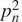。(这里，p[k]表示第`k`个素数。诸如此类的估计很难确定。欧几里德关于素数有无穷多个的古老证明表明，p[n][+1]≤p[1]p[2]p[n]+1，直到 1851 年俄罗斯数学家 P. L .切比雪夫建立了这个结果最初是在 1845 年推测出来的，被称为伯特兰假说。一个证明可以在 Hardy 和 Wright 1960 年的第 22.3 节中找到。

这个练习展示了按需呼叫是如何与练习 3.27 中描述的普通记忆紧密相关的。在那个练习中，我们使用赋值来显式地构造一个本地表。我们的按需调用流优化有效地自动构建了这样一个表，将值存储在流的先前强制部分中。

和 2.2.3 节一样，我们把一对整数表示成一个列表，而不是一对。

参见练习 3.68，了解我们为什么选择这种分解。

[69](#c3-fn-0069a) 关于组合顺序所需属性的精确陈述如下:应该有两个自变量的函数 f ，使得对应于第一流的元素 i 和第二流的元素 j 的对将作为输出流的元素号 f ( i ， j )出现。大卫·特纳向我们展示了使用`interleave`来实现这一点的技巧，他在《KRC》一书中使用了这个技巧(特纳 1981)。

我们将要求加权函数是这样的，当我们沿着线对阵列的一行移动或沿着一列移动时，线对的权重增加。

引用 G. H .哈代的《拉马努金的讣告》(哈代 1921 年)中的话:“利特伍德先生(我相信)说过‘每个正整数都是他的一个朋友’我记得有一次他生病躺在普特尼时我去看他。我坐的是 1729 号出租车，我说这个数字对我来说似乎是一个相当枯燥的数字，我希望这不是一个不好的预兆。“不，”他回答，“这是一个非常有趣的数字；它是可以用两种不同方式表示为两个立方之和的最小数字。“Charles Leiserson 向我们展示了使用加权对生成 Ramanujan 数的技巧。

[72](#c3-fn-0072a) 为了在合理的时间内完成，该计算需要使用`integral`中第 3.5.1 节的记忆优化和`integral`中使用的函数`add_streams`(使用练习 3.57 中建议的函数`stream_map_2_optimized`)。

在 JavaScript 中，这是早期静态类型语言如 Pascal 在处理高阶函数时遇到的困难的一个小小的反映。在这些语言中，程序员必须指定每个函数的参数和结果的数据类型:数字、逻辑值、序列等等。因此，我们不能用一个更高阶的函数，比如`stream_map`，来表达一个抽象，比如“在一个序列中的所有元素上映射一个给定的函数`fun`”。相反，对于可能为`fun`指定的参数和结果数据类型的不同组合，我们需要不同的映射函数。在存在高阶函数的情况下维护“数据类型”的实际概念会引发许多困难的问题。语言 ML (Gordon，Milner 和 Wadsworth 1979)说明了处理这个问题的一种方法，它的“参数多态数据类型”包括数据类型之间高阶转换的模板。此外，ML 中大多数函数的数据类型从来没有被程序员明确声明过。相反，ML 包含一个类型推断机制，它使用环境中的信息来推断新定义函数的数据类型。今天，静态类型编程语言已经发展到通常支持某种形式的类型推断和参数多态性，并具有不同程度的功能。Haskell 将一个有表现力的类型系统与强大的类型推理结合起来。

[74](#c3-fn-0074a) 同样在物理学中，当我们观察一个运动的质点时，我们说质点的位置(状态)在变化。然而，从粒子在时空中的世界线的角度来看，没有任何变化。

Fortran 的发明者约翰·巴科斯在 1978 年被授予 ACM 图灵奖时，给予了函数式编程很高的知名度。他的获奖感言(Backus 1978)强烈提倡功能教学法。在 Henderson 1980 和 Darlington，Henderson 和 Turner 1982 中给出了函数式编程的一个很好的概述。

观察到，对于任何两个流，通常有不止一个可接受的交错顺序。因此，从技术上来说，“合并”是一个关系而不是一个函数——答案不是输入的确定性函数。我们已经提到过(脚注 44 ),在处理并发性时，非确定性是必不可少的。从功能的角度来看，合并关系说明了相同的本质不确定性。在 4.3 节，我们将从另一个角度来看非决定论。

[77](#c3-fn-0077a) 对象模型通过将世界分成独立的部分来近似世界。功能模型没有沿着对象边界模块化。当“对象”的非共享状态远大于它们共享的状态时，对象模型是有用的。对象观点失败的一个例子是量子力学，在量子力学中，将事物视为单个粒子会导致悖论和混乱。将对象视图与函数视图统一起来可能与编程无关，而是与基本的认识论问题有关。***