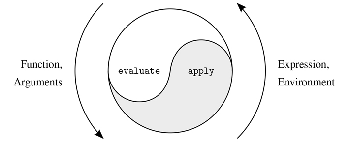
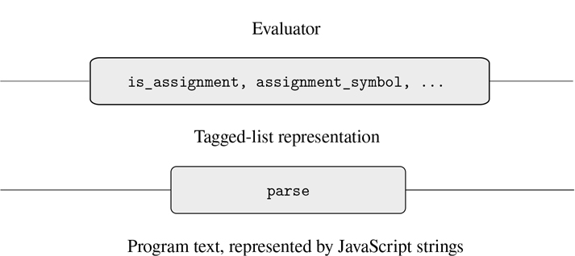
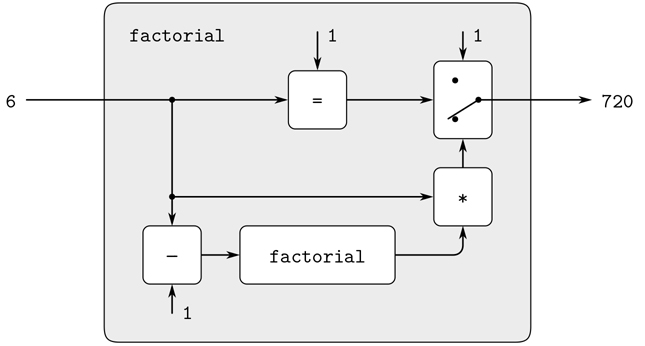
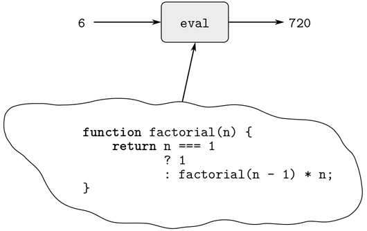
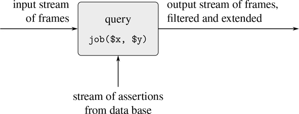
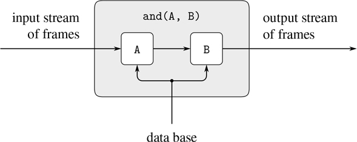
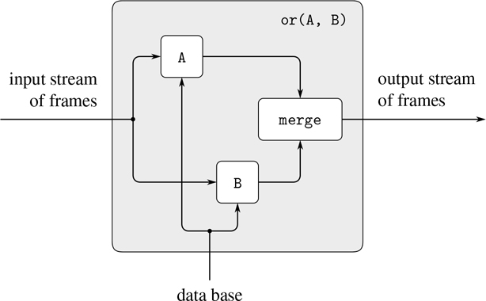
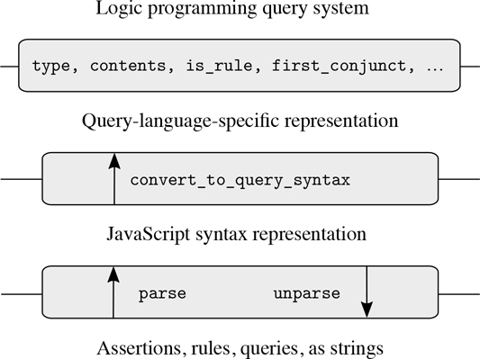

# 4
元语言抽象

> 。。。神奇之处在于文字——咒语、芝麻开门等等——但是一个故事中的神奇文字在下一个故事中并不神奇。真正的魔法是理解哪些词起作用，什么时候起作用，为了什么；诀窍是学会诀窍。
> 
> 。。。这些单词是由字母表中的字母组成的:我们可以用笔画出几十条曲线。这是关键！还有宝藏，如果我们能拿到的话！就好像——就好像宝藏的钥匙就是宝藏！
> 
> ——约翰·巴斯，奇美拉

在我们对程序设计的研究中，我们已经看到专业程序员用所有复杂系统的设计者所用的相同的通用技术来控制他们设计的复杂性。它们组合原始元素以形成复合对象，它们抽象复合对象以形成更高层次的构建块，并且它们通过采用适当的大规模系统结构视图来保持模块化。在说明这些技术时，我们使用 JavaScript 作为描述过程和构建计算数据对象和过程的语言，以模拟现实世界中的复杂现象。然而，当我们面对越来越复杂的问题时，我们会发现 JavaScript 或者任何固定的编程语言都不足以满足我们的需求。为了更有效地表达我们的想法，我们必须不断地求助于新的语言。建立新的语言是控制工程设计复杂性的有力策略；我们通常可以通过采用一种新的语言来提高我们处理复杂问题的能力，这种语言使我们能够以不同的方式描述(从而思考)问题，使用特别适合于手头问题的原语、组合方法和抽象方法。 [¹](#c4-fn-0001)

编程被赋予了多种语言。有物理语言，如特定计算机的机器语言。这些语言关注的是数据的表示，并根据存储的单个位和原始的机器指令进行控制。机器语言程序员关心的是使用给定的硬件来建立系统和实用程序，以便有效地实现资源有限的计算。建立在机器语言基础上的高级语言隐藏了将数据表示为比特集合和将程序表示为原始指令序列的顾虑。这些语言具有组合和抽象的手段，例如函数声明，适合于大规模的系统组织。

元语言抽象(建立新的语言)在工程设计的所有分支中都扮演着重要的角色。这对计算机编程尤其重要，因为在编程中，我们不仅可以用公式表达新的语言，还可以通过构造评估器来实现这些语言。用于编程语言的评估器(或解释器)是一个函数，当应用于该语言的语句或表达式时，执行评估该语句或表达式所需的动作。毫不夸张地说，这是编程中最基本的思想:

> 求值器决定了编程语言中语句和表达式的含义，它只是另一个程序。

理解这一点就是改变我们作为程序员的形象。我们开始把自己视为语言的设计者，而不仅仅是别人设计的语言的使用者。

事实上，我们几乎可以将任何程序视为某种语言的评估者。例如，2.5.3 节的多项式操作系统体现了多项式算术的规则，并根据对列表结构数据的操作来实现它们。如果我们用读取和打印多项式的函数来扩充这个系统，我们就有了处理符号数学问题的专用语言的核心。3.3.4 节中的数字逻辑模拟器和 3.3.5 节中的约束传播器本身就是合法的语言，每一种都有自己的原语、组合方式和抽象方式。从这个角度来看，处理大规模计算机系统的技术与构建新的计算机语言的技术融合在一起，计算机科学本身就变成了构建适当的描述性语言的学科。

我们现在开始一次技术之旅，通过这种技术，语言是根据其他语言建立起来的。在本章中，我们将使用 JavaScript 作为基础，将赋值器实现为 JavaScript 函数。我们将通过为 JavaScript 本身构建一个评估器来迈出理解语言是如何实现的第一步。我们的评估者实现的语言将是 JavaScript 的一个子集。尽管本章中描述的评估器是为 JavaScript 的特定子集编写的，但它包含了为时序机编写程序而设计的任何语言的评估器的基本结构。(事实上，大多数语言处理器内部都有一个小小的评估器。)为了说明和讨论的目的，已经对评估器进行了简化，并且省略了一些对于包含在生产质量的 JavaScript 系统中很重要的特性。然而，这个简单的评估器足以执行本书中的大多数程序。 [²](#c4-fn-0002)

将评估器作为 JavaScript 程序进行访问的一个重要优势是，我们可以通过将这些描述为对评估器程序的修改来实现替代的评估规则。我们可以有效利用这种能力的一个地方是获得对计算模型体现时间概念的方式的额外控制，这是第三章讨论的核心。在那里，我们通过使用流将世界中的时间表示与计算机中的时间分离，减轻了状态和赋值的一些复杂性。然而，我们的流程序有时很麻烦，因为它们受到 JavaScript 应用顺序计算的限制。在第 4.2 节中，我们将通过修改求值器来提供正常顺序求值，从而改变底层语言以提供更优雅的方法。

第 4.3 节实现了一个更加雄心勃勃的语言变化，语句和表达式有许多值，而不仅仅是一个值。在这种非确定性计算的语言中，很自然地表达为语句和表达式生成所有可能值的过程，然后搜索那些满足特定约束的值。就计算和时间的模型而言，这就像让时间分支成一组“可能的未来”，然后搜索适当的时间线。使用我们的非确定性赋值器，跟踪多个值和执行搜索是由语言的底层机制自动处理的。

在第 4.4 节中，我们实现了一种逻辑编程语言，其中知识是根据关系来表达的，而不是根据输入和输出的计算。尽管这使得该语言与 JavaScript，或者实际上与任何传统语言都有很大的不同，但是我们将会看到逻辑编程求值器与 JavaScript 求值器有着相同的基本结构。

## 4.1 元循环评估器

我们的 JavaScript 评估器将作为一个 JavaScript 程序来实现。考虑使用一个本身用 JavaScript 实现的评估器来评估 JavaScript 程序，这看起来似乎有些循环。但是，评估是一个过程，所以用 JavaScript 来描述评估过程是合适的，毕竟 JavaScript 是我们描述过程的工具。 [³](#c4-fn-0003) 一个用与它所求值的语言相同的语言编写的求值器被称为元循环。

元循环求值器本质上是 3.2 节中描述的环境求值模型的 JavaScript 公式。回想一下，该模型在两个基本步骤中指定了函数应用的评估:

1.  1。若要评估函数应用程序，请评估子表达式，然后将函数子表达式的值应用于参数子表达式的值。
2.  2。要将复合函数应用于一组参数，请在新环境中评估函数体。要构建这个环境，请将函数对象的环境部分扩展一个框架，在该框架中，函数的参数被绑定到该函数所应用到的参数。

这两个规则描述了评估过程的本质，一个基本循环，在这个循环中，要在环境中评估的语句和表达式被简化为要应用于参数的函数，这些函数又被简化为要在新环境中评估的新语句和表达式，以此类推，直到我们深入到名称(其值在环境中被查找)以及直接应用的运算符和原始函数(参见图 4.1： )。 [⁴](#c4-fn-0004) 这个评估周期将通过评估器中两个关键函数`evaluate`和`apply`的相互作用来体现，这在 4.1.1 节中有描述(参见图 4.1： )。



图 4.1：`evaluate`—`apply`循环暴露了一种计算机语言的本质。

评估器的实现将取决于定义要评估的语句和表达式的语法的函数。我们将使用数据抽象来使评估器独立于语言的表示。例如，我们使用抽象谓词`is_assignment`来测试赋值，并使用抽象选择器`assignment_symbol`和`assignment_value_expression`来访问赋值的各个部分，而不是选择用一个以名字开头后跟`=`的字符串来表示赋值。第 4.1.2 节中介绍的数据抽象层将允许评估者保持独立于具体的语法问题，例如解释语言的关键字，以及表示程序组件的数据结构的选择。第 4.1.3 节中还描述了一些操作，这些操作指定了功能和环境的表示。例如，`make_function`构造复合函数，`lookup_symbol_value`访问名称的值，`apply_primitive_function`将一个原始函数应用于给定的参数列表。

### 4.1.1 评价者的核心

评估过程可以描述为两个功能之间的相互作用:`evaluate`和`apply`。

##### 该功能`evaluate`

函数`evaluate`将程序组件—语句或表达式[⁵](#c4-fn-0005)—和环境作为参数。它对组件进行分类并指导其评估。函数`evaluate`被构造为待评估组件的语法类型的案例分析。为了保持功能的通用性，我们抽象地表达了组件类型的确定，不承诺对各种类型的组件有任何特定的表示。每种类型的组件都有一个测试它的语法谓词和一个选择组件的抽象方法。这个抽象语法让我们很容易看到如何通过使用相同的求值器，但是使用不同的语法函数集合来改变语言的语法。

###### 原始表达式

*   对于文字表达式，如数字，`evaluate`返回它们的值。
*   函数`evaluate`必须在环境中查找名字以找到它们的值。

###### 组合

*   对于一个函数应用，`evaluate`必须递归地评估应用的函数表达式和自变量表达式。得到的函数和参数被传递给`apply`，它处理实际的函数应用。
*   一个运算符组合被转换成一个函数应用程序，然后进行求值。

###### 句法形式

*   条件表达式或语句需要对其部分进行特殊处理，以便在谓词为真时评估结果，否则评估替代结果。
*   Lambda  表达式必须通过将 Lambda  表达式指定的参数和主体与评估环境打包在一起，转换为适用的函数。
*   一个语句序列需要按照出现的顺序评估其组成部分。
*   一个块需要在一个新的环境中评估它的主体，这个环境反映了块中声明的所有名字。
*   return 语句必须产生一个值，该值成为导致 return 语句求值的函数调用的结果。
*   函数声明被转换成常量声明，然后进行求值。
*   常量或变量声明或赋值必须递归调用`evaluate`来计算与被声明或赋值的名字相关联的新值。必须修改环境以反映名称的新值。

以下是`evaluate`的声明:

```js
function evaluate(component, env) {
    return is_literal(component)
           ? literal_value(component)
           : is_name(component)
           ? lookup_symbol_value(symbol_of_name(component), env)
           : is_application(component)
           ? apply(evaluate(function_expression(component), env),
                   list_of_values(arg_expressions(component), env))
           : is_operator_combination(component)
           ? evaluate(operator_combination_to_application(component), env)
           : is_conditional(component)
           ? eval_conditional(component, env)
           : is_lambda_expression(component)
           ? make_function(lambda_parameter_symbols(component),
                           lambda_body(component), env)
           : is_sequence(component)
           ? eval_sequence(sequence_statements(component), env)
           : is_block(component)
           ? eval_block(component, env)
           : is_return_statement(component)
           ? eval_return_statement(component, env)
           : is_function_declaration(component)
           ? evaluate(function_decl_to_constant_decl(component), env)
           : is_declaration(component)
           ? eval_declaration(component, env)
           : is_assignment(component)
           ? eval_assignment(component, env)
           : error(component, "unknown syntax – evaluate");
}
```

为了清楚起见，`evaluate`已经被实现为使用条件表达式的案例分析。这样做的缺点是，我们的函数只处理几种不同类型的语句和表达式，如果不编辑`evaluate`的声明，就不能定义新的语句和表达式。在大多数解释器实现中，对组件类型的分派是以数据导向的方式完成的。这允许用户添加`evaluate`可以区分的新类型的组件，而无需修改`evaluate`本身的声明。(参见练习 4.3。)

名称的表示由语法抽象来处理。在内部，评估器使用字符串来表示名称，我们将这样的字符串称为符号。在`evaluate`中使用的函数`symbol_of_name`从一个名称中提取代表该名称的符号。

##### 应用

函数`apply`有两个参数，一个函数和一个函数应该应用的参数列表。函数`apply`将函数分为两种:调用`apply_primitive_function`应用原语；它通过评估组成函数体的块来应用复合函数。通过扩展由函数携带的基础环境来包括将函数的参数绑定到函数要应用的自变量的框架，来构建用于评估复合函数体的环境。下面是`apply`的声明:

```js
function apply(fun, args) {
    if (is_primitive_function(fun)) {
        return apply_primitive_function(fun, args);
    } else if (is_compound_function(fun)) {
        const result = evaluate(function_body(fun),
                               extend_environment(
                                   function_parameters(fun),
                                   args,
                                   function_environment(fun)));
        return is_return_value(result)
               ? return_value_content(result)
               : undefined;
    } else {
        error(fun, "unknown function type – apply");
    }
}
```

为了返回值，JavaScript 函数需要对 return 语句求值。如果函数在没有计算 return 语句的情况下终止，则返回值`undefined`。为了区分这两种情况，return 语句的评估将把评估其返回表达式的结果包装到一个返回值中。如果函数体的求值产生这样的返回值，则检索返回值的内容；否则返回值`undefined`。 [⁶](#c4-fn-0006)

##### 函数参数

当`evaluate`处理一个函数应用程序时，它使用`list_of_values`来产生函数要应用到的参数列表。函数`list_of_values`将应用程序的参数表达式作为参数。它评估每个参数表达式并返回相应值的列表: [⁷](#c4-fn-0007)

```js
function list_of_values(exps, env) {
    return map(arg => evaluate(arg, env), exps);
}
```

##### 条件式

函数`eval_conditional`评估给定环境中条件组件的谓词部分。如果结果为真，则评估结果，否则评估替代结果:

```js
function eval_conditional(component, env) {
    return is_truthy(evaluate(conditional_predicate(component), env))
           ? evaluate(conditional_consequent(component), env)
           : evaluate(conditional_alternative(component), env);
}
```

注意，求值器不需要区分条件表达式和条件语句。

`eval_conditional`中`is_truthy`的使用突出了一个实现语言和一个实现语言之间的联系问题。在被实现的语言中对`conditional_predicate`进行评估，从而产生该语言中的值。解释器谓词`is_truthy`将该值翻译成可由实现语言中的条件表达式测试的值:事实的元循环表示可能与底层 JavaScript 不同。 [⁸](#c4-fn-0008)

##### 顺序

函数`eval_sequence`由`evaluate`用于评估顶层或块中的一系列语句。它将一系列语句和一个环境作为参数，并按照语句出现的顺序对其求值。返回值是最后一条语句的值，但如果序列中任何语句的计算产生返回值，则返回该值并忽略后续语句。 [⁹](#c4-fn-0009)

```js
function eval_sequence(stmts, env) {
    if (is_empty_sequence(stmts)) {
        return undefined;
    } else if (is_last_statement(stmts)) {
        return evaluate(first_statement(stmts), env);
    } else {
        const first_stmt_value =
            evaluate(first_statement(stmts), env);
        if (is_return_value(first_stmt_value)) {
            return first_stmt_value;
        } else {
            return eval_sequence(rest_statements(stmts), env);
        }
    }
}
```

##### 阻碍

函数`eval_block`处理块。块中声明的变量和常量(包括函数)的作用域是整个块，因此在计算块的主体之前被“扫描”出来。块的主体相对于一个环境进行评估，该环境通过一个将每个本地名称绑定到一个特殊值`"*unassigned*"`的框架来扩展当前环境。在对声明求值并为名称分配适当的值之前，该字符串充当占位符。如第 1 章脚注 56 所述，试图在评估名称声明之前访问其值会导致运行时出错(参见练习 4.12)。

```js
function eval_block(component, env) {
    const body = block_body(component);
    const locals = scan_out_declarations(body);
    const unassigneds = list_of_unassigned(locals);
    return evaluate(body, extend_environment(locals,
                                             unassigneds,
                                             env));
}
function list_of_unassigned(symbols) {
    return map(symbol => "*unassigned*", symbols);
}
```

函数`scan_out_declarations`收集所有代表主体中声明的名字的符号的列表。它使用`declaration_symbol`从找到的声明语句中检索代表名称的符号。

```js
function scan_out_declarations(component) {
    return is_sequence(component)
           ? accumulate(append,
                        null,
                        map(scan_out_declarations,
                            sequence_statements(component)))
           : is_declaration(component)
           ? list(declaration_symbol(component))
           : null;
}
```

我们忽略嵌套在另一个块中的声明，因为对那个块的评估会处理它们。函数`scan_out_declarations`只在序列中寻找声明，因为条件语句、函数声明和 Lambda  表达式中的声明总是在嵌套块中。

##### 退货单

函数`eval_return_statement`用于评估 return 语句。如`apply`和序列评估所示，返回语句的评估结果需要可识别，以便函数体的评估可以立即返回，即使在返回语句之后还有语句。为此，return 语句的计算将返回表达式的计算结果包装在返回值对象中。 [^(10)](#c4-fn-0010)

```js
function eval_return_statement(component, env) {
    return make_return_value(evaluate(return_expression(component),
                                      env));
}
```

##### 转让和声明

函数`eval_assignment`处理名字的赋值。(为了简化我们的赋值器，我们不仅允许给变量赋值，也允许错误地给常量赋值。练习 4.11 解释了如何区分常量和变量，并防止给常量赋值。)函数`eval_assignment`调用值表达式上的`evaluate`来查找要赋值的值，并调用`assignment_symbol`从赋值中检索代表名称的符号。功能`eval_assignment`将符号和值传送到`assign_symbol_value`以安装在指定的环境中。赋值的计算返回被赋值的值。

```js
function eval_assignment(component, env) {
    const value = evaluate(assignment_value_expression(component),
                           env);
    assign_symbol_value(assignment_symbol(component), value, env);
    return value;
}
```

常量和变量声明都由`is_declaration`语法谓词识别。它们的处理方式类似于赋值，因为在当前环境中`eval_block`已经将它们的符号绑定到了`"*unassigned*"`。他们的评估用评估值表达式的结果替换`"*unassigned*"`。

```js
function eval_declaration(component, env) {
    assign_symbol_value(
        declaration_symbol(component),
        evaluate(declaration_value_expression(component), env), env);
    return undefined;
}
```

评估函数体的结果是由 return 语句决定的，因此`eval_declaration`中的返回值`undefined`只在声明出现在顶级时才起作用，不在任何函数体中。这里我们使用返回值`undefined`来简化表示；练习 4.8 描述了在 JavaScript 中评估顶级组件的真实结果。

##### 练习 4.1

请注意，我们无法判断元循环求值程序是从左到右还是从右到左对参数表达式求值。它的求值顺序是从底层 JavaScript 继承的:如果`map`中的`pair`的参数从左到右求值，那么`list_of_values`将从左到右求值参数表达式；如果`pair`的参数从右向左计算，那么`list_of_values`将从右向左计算参数表达式。

编写一个从左到右计算参数表达式的版本`list_of_values`,而不考虑底层 JavaScript 中的计算顺序。还要编写一个从右向左计算参数表达式的版本`list_of_values`。

### 4.1.2 代表组件

程序员将程序写成文本，即输入到编程环境或文本编辑器中的字符序列。为了运行我们的评估器，我们需要首先将这个程序文本表示为一个 JavaScript 值。在 2.3.1 节中，我们引入了字符串来表示文本。我们想对第 1.1.2 节中的`"const size = 2; 5 * size;"`等项目进行评估。不幸的是，这样的程序文本没有为评估者提供足够的结构。在这个例子中，程序部分`"size = 2"`和`"5 * size"`看起来很相似，但是却有着非常不同的含义。通过检查程序文本，像`declaration_value_expression`这样的抽象语法函数很难实现，而且容易出错。因此，在本节中，我们引入了一个函数`parse`，它将程序文本翻译成一个标记列表表示，让人想起 2.4.2 节中的标记数据。例如，将`parse`应用于上面的程序字符串会产生一个反映程序结构的数据结构:一个由将名称`size`与值 2 相关联的常量声明和一个乘法运算组成的序列。

```js
parse("const size = 2; 5 * size;");
list("sequence",
     list(list("constant_declaration",
               list("name", "size"), list("literal", 2)),
          list("binary_operator_combination", "*",
               list("literal", 5), list("name", "size"))))
```

评估器使用的语法函数访问由`parse`产生的标记列表表示。

评估员让人想起第 2.3.2 节中讨论的符号微分程序。两个程序都处理符号数据。在这两个程序中，对对象进行操作的结果是通过对对象的各个部分进行递归操作并根据对象的类型组合结果来确定的。在这两个程序中，我们都使用了数据抽象来将操作的一般规则与对象如何表示的细节分离开来。在微分程序中，这意味着同一个微分函数可以处理前缀形式、中缀形式或其他形式的代数表达式。对于评估者来说，这意味着被评估语言的语法完全由`parse`和对`parse`产生的标记列表进行分类和提取的函数决定。

图 4.2：描绘了由语法谓词和选择器形成的抽象屏障，它们将评估器与程序的标记列表表示连接起来，而标记列表表示又通过`parse`与字符串表示分离。下面我们描述程序组件的解析，并列出相应的语法谓词和选择器，以及构造函数(如果需要的话)。



图 4.2：评估器中的语法抽象。

##### 文字表达

文字表达式被解析成带有标签`"literal"`和实际值的标签列表。

```js
《literal-expression 》 = list("literal", value)
```

其中值是由文字 - 表达式字符串表示的 JavaScript 值。这里的文字 - 表达式表示解析字符串文字 - 表达式的结果。

```js
parse("1;");
list("literal", 1)

parse("'hello world';");
list("literal", "hello world")

parse("null;");
list("literal", null)
```

文字表达式的语法谓词是`is_literal`。

```js
function is_literal(component) {
   return is_tagged_list(component, "literal");
}
```

它是根据函数`is_tagged_list`定义的，该函数标识以指定字符串开头的列表:

```js
function is_tagged_list(component, the_tag) {
   return is_pair(component) && head(component) === the_tag;
}
```

解析文字表达式得到的列表的第二个元素是它的实际 JavaScript 值。用于检索值的选择器是`literal_value`。

```js
function literal_value(component) {
   return head(tail(component));
}

literal_value(parse("null;"));
null
```

在本节的其余部分，我们只列出语法谓词和选择器，如果它们只是访问显而易见的列表元素，就省略它们的声明。

我们为文字提供了一个构造函数，这将派上用场:

```js
function make_literal(value) {
   return list("literal", value);
}
```

##### 名称

名称的标记列表表示包括标记`"name"`作为第一个元素，以及表示名称的字符串作为第二个元素。

```js
《 name 》 = list("name", symbol)
```

其中符号是一个字符串，包含组成程序中编写的名称的字符。名称的语法谓词是`is_name`。使用选择器`symbol_of_name`访问该符号。我们为名称提供了一个构造函数，供`operator_combination_to_application`使用:

```js
function make_name(symbol) {
   return list("name", symbol);
}
```

##### 表达式语句

我们不需要区分表达式和表达式语句。因此，`parse`可以忽略这两种成分的区别:

```js
《 expression; 》 = 《 expression 》
```

##### 功能应用

函数应用程序解析如下:

```js
《 fun-expr(arg-expr[1], . . ., arg-expr[n]) 》=
     list("application",
          《 fun-expr 》,
          list(《 arg-expr[1] 》, . . ., 《 arg-expr[n] 》))
```

我们将`is_application`声明为语法谓词，将`function_expression`和`arg_expressions`声明为选择器。我们为函数应用程序添加一个构造函数，供`operator_combination_to_application`使用:

```js
function make_application(function_expression, argument_expressions) {
    return list("application",
                function_expression, argument_expressions);
}
```

##### 条件式

条件表达式解析如下:

```js
《 predicate ? consequent-expression : alternative-expression 》=
         list("conditional_expression",
              《 predicate 》,
              《 consequent-expression 》,
              《 alternative-expression 》)
```

类似地，条件语句解析如下:

```js
《 if (predicate) consequent-block else alternative-block 》=
         list("conditional_statement",
              《 predicate 》,
              《 consequent-block 》,
              《 alternative-block 》)
```

语法谓词`is_conditional`对两种条件都返回 true，选择器`conditional_predicate`、`conditional_consequent`和`conditional_alternative`可以应用于这两种条件。

##### λ表达式

主体是表达式的 Lambda  表达式被解析为主体由包含单个返回语句的块组成，该语句的返回表达式是 Lambda  表达式的主体。

```js
《 (name[1], . . ., name[n]) => expression 》 =
    《 (name[1], . . ., name[n]) => { return expression ; } 》
```

主体为块的 Lambda  表达式解析如下:

```js
《 (name[1], . . ., name[n]) => block 》=
    list("lambda_expression",
     list(《 name[1] 》, . . ., 《 name[n] 》),
     《 block 》)
```

语法谓词是`is_lambda_expression`，Lambda  表达式主体的选择器是`lambda_body`。名为`lambda_parameter_symbols`的参数选择器还从名称中提取符号。

```js
function lambda_parameter_symbols(component) {
    return map(symbol_of_name, head(tail(component)));
}
```

函数`function_decl_to_constant_decl`需要 Lambda  表达式的构造函数:

```js
function make_lambda_expression(parameters, body) {
    return list("lambda_expression", parameters, body);
}
```

##### 顺序

sequence 语句将一系列语句打包成一条语句。语句序列解析如下:

```js
《 statement[1] ... statement[n] 》 =
      list("sequence", list(《 statement[1] 》, . . ., 《 statement[n] 》))
```

语法谓词是`is_sequence`，选择器是`sequence_statements`。我们使用`first_statement`检索语句列表中的第一条语句，使用`rest_statements`检索剩余的语句。我们使用谓词`is_empty_sequence`测试列表是否为空，使用谓词`is_last_statement`测试列表是否只包含一个元素。 [^(11)](#c4-fn-0011)

```js
function first_statement(stmts) { return head(stmts); }
function rest_statements(stmts) { return tail(stmts); }
function is_empty_sequence(stmts) { return is_null(stmts); }
function is_last_statement(stmts) { return is_null(tail(stmts)); }
```

##### 阻碍

块解析如下: [^(12)](#c4-fn-0012)

```js
《 { statements } 》 = list("block", 《 statements 》 )
```

这里的语句指的是一系列的语句，如上图。语法谓词是`is_block`，选择器是`block_body`。

##### 退货单

Return 语句解析如下:

```js
《 return expression; 》 = list("return_statement", 《 expression 》 )
```

语法谓词和选择器分别是`is_return_statement`和`return_expression`。

##### 分配

分配解析如下:

```js
《 name = expression 》 = list("assignment", 《 name 》 , 《 expression 》 )
```

语法谓词是`is_assignment`，选择器是`assignment_symbol`和`assignment_value_expression`。符号被包装在代表名称的标签列表中，因此`assignment_symbol`需要解开它。

```js
function assignment_symbol(component) {
    return symbol_of_name(head(tail(component))));
}
```

##### 常量、变量和函数声明

常量和变量声明解析如下:

```js
《 const name = expression; 》 =
    list("constant_declaration", 《 name 》, 《 expression 》)
《 let name = expression; 》 =
    list("variable_declaration", 《 name 》, 《 expression 》)
```

选择器`declaration_symbol`和`declaration_value_expression`适用于两种类型。

```js
function declaration_symbol(component) {
    return symbol_of_name(head(tail(component)));
}
function declaration_value_expression(component) {
    return head(tail(tail(component)));
}
```

函数`function_decl_to_constant_decl`需要一个常量声明的构造函数:

```js
function make_constant_declaration(name, value_expression) {
    return list("constant_declaration", name, value_expression);
}
```

函数声明解析如下:

```js
function name(name[1], . . . name[n]) block 》=
    list("function_declaration",
     《 name 》,
     list(《 name[1] 》, . . ., 《 name[n] 》),
     《 block 》)
```

语法谓词`is_function_declaration`识别这些。选择器是`function_declaration_name`、`function_declaration_parameters`和`function_declaration_body`。

语法谓词`is_declaration`对所有三种声明都返回 true。

```js
function is_declaration(component) {
    return is_tagged_list(component, "constant_declaration") ||
           is_tagged_list(component, "variable_declaration") ||
           is_tagged_list(component, "function_declaration");
}
```

##### 衍生组件

我们语言中的一些句法形式可以用涉及其他句法形式的组件来定义，而不是直接实现。一个例子是函数声明，函数声明`evaluate`转换成常量声明，常量声明的值表达式是 Lambda  表达式。 [^(13)](#c4-fn-0013)

```js
function function_decl_to_constant_decl(component) {
    return make_constant_declaration(
               function_declaration_name(component),
               make_lambda_expression(
                   function_declaration_parameters(component),
                   function_declaration_body(component)));
}
```

以这种方式实现函数声明的求值简化了求值程序，因为它减少了必须显式指定求值过程的语法形式的数量。

同样，我们根据函数应用来定义运算符组合。运算符组合是一元或二元的，并携带其运算符符号作为标记列表表示中的第二个元素:

```js
《 unary-operator expression 》=
    list("unary_operator_combination",
         "unary-operator",
         list(《 expression 》))
```

其中一元 - 运算符为`!`(逻辑否定)或`-unary`(数值否定)，并且

```js
《 expression[1] binary-operator expression[2] 》=
    list("binary_operator_combination",
         "binary-operator",
         list(《 expression[1] 》, 《 expression[2] 》))
```

其中二元 - 运算符为`+`、`-`、`*`、`/`、`%`、`===`、`!==`、`>`、`<`、`>=`或`<=`。语法谓词是`is_operator_combination`、`is_unary_operator_combination`和`is_binary_operator_combination`，选择器是`operator_symbol`、`first_operand`和`second_operand`。

求值器使用`operator_combination_to_application`将一个运算符组合转换成一个函数应用，其函数表达式是该运算符的名称；

```js
function operator_combination_to_application(component) {
    const operator = operator_symbol(component);
    return is_unary_operator_combination(component)
           ? make_application(make_name(operator),
                              list(first_operand(component)))
           : make_application(make_name(operator),
                              list(first_operand(component),
                                   second_operand(component)));
}
```

我们选择实现为语法转换的组件(比如函数声明和操作符组合)被称为派生组件。逻辑组合操作也是派生组件(参见练习 4.4)。

##### 练习 4.2

`parse`的逆称为`unparse`。它将一个由`parse`生成的标记列表作为参数，并返回一个遵循 JavaScript 符号的字符串。

1.  a. 按照`evaluate`的结构(没有环境参数)写一个函数`unparse`，但是产生一个表示给定组件的字符串，而不是对其求值。回想一下第 3.3.4 节，操作符`+`可以应用于两个字符串来连接它们，并且原语函数`stringify`将值 1.5、true、`null`和`undefined`转换为字符串。注意尊重操作符的优先顺序，用圆括号(总是或在任何必要的时候)将解对操作符组合产生的字符串括起来。
2.  b. 你的`unparse`函数在解决本节后面的练习时会派上用场。通过向结果字符串添加`" "`(空格)和`"\n"`(换行符)来改进`unparse`，以遵循本书 JavaScript 程序中使用的缩进样式。在程序文本中添加(或删除)这样的空白字符以使文本更容易阅读被称为美化。

##### 练习 4.3

重写`evaluate`以便以数据导向的方式完成调度。将此与练习 2.73 的数据导向微分函数进行比较。(您可以使用标记列表表示的标记作为组件的类型。)

##### 练习 4.4

回想一下 1.1.6 节，逻辑组合运算`&&`和`||`是条件表达式的语法糖:逻辑合取表达式 [1] `&&` 表达式 [2] 是表达式 [1] `?` 表达式 [2] : `**false**`和逻辑析取表达式 [1 它们解析如下:]

```js
《 expression[1] logical-operation expression[2] 》=
    list("logical_composition",
         "logical-operation",
         list(《 expression[1]  》, 《 expression[2]  》))
```

其中逻辑 - 运算为`&&`或`||`。通过声明适当的语法函数和评估函数`eval_and`和`eval_or`，为评估器安装`&&`和`||`作为新的语法形式。或者，展示如何将`&&`和`||`实现为派生组件。

##### 练习 4.5

1.  a. In JavaScript, lambda expressions must not have duplicate parameters. The evaluator in section 4.1.1 does not check for this.
    *   修改赋值器，以便任何使用重复参数应用函数的尝试都会发出错误信号。
    *   实现一个`verify`函数，检查给定程序中的任何 Lambda  表达式是否包含重复的参数。有了这样一个函数，我们可以在将程序传递给`evaluate`之前检查整个程序。

    为了在 JavaScript 的评估器中实现这种检查，您更喜欢这两种方法中的哪一种？为什么？

2.  b. 在 JavaScript 中，Lambda  表达式的参数必须不同于在 Lambda  表达式的主体块中直接声明的名称*(相对于在内部块中)。使用上面您首选的方法来检查这一点。*

 *##### 练习 4.6

语言方案包括一个名为`**let***`的`**let**`变体。我们可以通过规定一个`**let***`声明隐式引入一个新块来近似 JavaScript 中的`**let***`的行为，这个新块的主体包括声明和声明所在的语句序列的所有后续语句。例如，程序

```js
let* x = 3;
let* y = x + 2;
let* z = x + y + 5;
display(x * z);
```

显示 39，可以看作是

```js
{
  let x = 3;
  {
    let y = x + 2;
    {
      let z = x + y + 5;
      display(x * z);
    }
  }
}
```

1.  a. 用这样一种扩展的 JavaScript 语言写一个程序，当关键字`**let**`的一些出现被替换为`**let***`时，它的行为会有所不同。
2.  b. 通过设计合适的标记列表表示和编写解析规则，引入了`**let***`作为新的语法形式。为标记列表表示声明一个语法谓词和选择器。
3.  c. 假设`parse`实现了您的新规则，编写一个`let_star_to_nested_let`函数，如上所述转换给定程序中`**let***`的任何出现。然后，我们可以通过运行`evaluate(let_star_to_nested_let(p))`来评估扩展语言中的程序`p`。
4.  d. 作为替代，考虑通过向`evaluate`添加一个识别新语法形式并调用函数`eval_let_star_declaration`的子句来实现`**let***`。为什么这种方法行不通？

##### 练习 4.7

JavaScript 支持重复执行给定语句的 while 循环。具体来说，

```js
while (predicate) { body }
```

评估谓词，如果结果为真，评估主体，然后再次评估整个 while 循环。一旦谓词评估为假，while 循环终止。

例如，回想一下 3.1.3 节中迭代阶乘函数的命令式版本:

```js
function factorial(n) {
    let product = 1;
    let counter = 1;
    function iter() {
        if (counter > n) {
            return product;
        } else {
            product = counter * product;
            counter = counter + 1;
            return iter();
        }
    }
    return iter();
}
```

我们可以使用 while 循环来制定相同的算法，如下所示:

```js
function factorial(n) {
    let product = 1;
    let counter = 1;
    while (counter <= n) {
        product = counter * product;
        counter = counter + 1;
    }
    return product;
}
```

While 循环解析如下:

```js
《 while (predicate) block 》 =
        list("while_loop", 《 predicate 》, 《 block 》)
```

1.  a. 声明一个语法谓词和选择器来处理 while 循环。
2.  b. Declare a function `while_loop` that takes as arguments a predicate and a body—each represented by a function of no arguments—and simulates the behavior of the while loop. The `factorial` function would then look as follows:

    ```js
    function factorial(n) {
        let product = 1;
        let counter = 1;
        while_loop(() => counter <= n,
                   () => {
                       product = counter * product;
                       counter = counter + 1;
                   });
        return product;
    }
    ```

    您的函数`while_loop`应该生成一个迭代过程(见 1.2.1 节)。

3.  c .c .通过定义一个利用你的函数`while_loop`的转换函数`while_to_application`来安装 while 循环作为一个派生组件。
4.  d. 当程序员在循环体中决定从包含循环的函数返回时，这种实现 while 循环的方法会出现什么问题？
5.  改变你解决问题的方法。使用函数`eval_while`直接为求值器安装 while 循环怎么样？
6.  遵循这种直接方法，实现一个`**break**;`语句，立即终止被求值的循环。
7.  g. 实现一个`**continue**;`语句，该语句只终止被评估的循环迭代，并继续评估 while 循环谓词。

##### 练习 4.8

评估函数体的结果是由其返回语句决定的。作为脚注 9 和第 4.1.1 节中声明评估的后续，本练习解决了这样一个问题，即评估一个 JavaScript 程序的结果应该是什么，该程序包含一系列语句(声明、块、表达式语句和条件语句)在任何函数体之外。

对于这样的程序，JavaScript 静态地区分产生值的和不产生值的语句。(这里的“静态”意味着我们可以通过检查程序而不是运行它来进行区分。)所有声明都是不产生值的，所有表达式语句和条件语句都是产生值的。表达式语句的值就是表达式的值。条件语句的值是被执行的分支的值，或者如果该分支不产生值，则是值`undefined`。如果一个块的主体(语句序列)是产生价值的，那么它的价值就是其主体的价值。如果一个序列的任何组成语句是产生值的，那么它的值就是它的最后一个产生值的组成语句的值。最后，如果整个程序不产生价值，那么它的价值就是价值`undefined`。

1.  a. 根据本规范，以下四个程序的值分别是多少？

    ```js
    1; 2; 3;   1; { if (true) {} else { 2; } }   1; const x = 2;   1; { let x = 2; { x = x + 3; } }
    ```

2.  b. 修改评估员以符合本规范。*  *### 4.1.3 评估者数据结构

除了定义组件的表示，评估器实现还必须定义评估器在内部操作的数据结构，作为程序执行的一部分，例如函数和环境的表示以及真和假的表示。

##### 谓词测试

为了像我们在本书中所做的那样将条件的谓词表达式限制为适当的谓词(计算为布尔值的表达式)，我们在这里坚持认为函数`is_truthy`只应用于布尔值，并且我们只接受布尔值`**true**`为真。`is_truthy`的反义词叫`is_falsy`。 [^(14)](#c4-fn-0014)

```js
function is_truthy(x) {
    return is_boolean(x)
           ? x
           : error(x, "boolean expected, received");
}
function is_falsy(x) { return ! is_truthy(x); }
```

##### 表示函数

为了处理原语，我们假设我们有以下可用的函数:

*   `apply_primitive_function(`fun`,` args`)`

    将给定的原始函数应用于列表 args 中的参数值，并返回应用结果。

*   `is_primitive_function(`fun`)`

    测试 fun 是否为原函数。

这些处理原语的机制将在 4.1.4 节中进一步描述。

使用构造函数`make_function`从参数、函数体和环境中构造复合函数:

```js
function make_function(parameters, body, env) {
    return list("compound_function", parameters, body, env);
}
function is_compound_function(f) {
    return is_tagged_list(f, "compound_function");
}
function function_parameters(f) { return list_ref(f, 1); }
function function_body(f) { return list_ref(f, 2); }
function function_environment(f) { return list_ref(f, 3); }
```

##### 表示返回值

我们在 4.1.1 节看到，序列的求值在遇到 return 语句时终止，如果函数体的求值没有遇到 return 语句，函数应用的求值需要返回值`undefined`。为了识别返回语句产生的值，我们引入了返回值作为求值器数据结构。

```js
function make_return_value(content) {
    return list("return_value", content);
}
function is_return_value(value) {
    return is_tagged_list(value, "return_value");
}
function return_value_content(value) {
    return head(tail(value));
}
```

##### 环境操作

评估者需要操纵环境的操作。如 3.2 节所述，环境是一系列帧，其中每一帧都是将符号与其对应值相关联的绑定表。我们使用以下操作来操纵环境:

*   `lookup_symbol_value(`symbol`,` env`)`

    返回绑定到环境 env 中的符号的值，如果符号未绑定，则发出错误信号。

*   `extend_environment(`symbols`,` values`,` base-env`)`

    返回一个新的环境，由一个新的框架组成，在该框架中，列表符号中的符号被绑定到列表值中的相应元素，其中封闭环境是环境 base - env 。

*   `assign_symbol_value(`symbol`,` value`,` env`)`

    找到 env 中绑定了符号的最里面的帧，并更改该帧，使符号现在绑定到值，如果符号未绑定，则发出错误信号。

为了实现这些操作，我们将环境表示为一系列帧。环境的封闭环境是列表的`tail`。空环境就是空列表。

```js
function enclosing_environment(env) { return tail(env); }
function first_frame(env) { return head(env); }
const the_empty_environment = null;
```

环境的每个框架都表示为一对列表:绑定在该框架中的名称列表和相关值列表。 [^(15)](#c4-fn-0015)

```js
function make_frame(symbols, values) { return pair(symbols, values); }
function frame_symbols(frame) { return head(frame); }
function frame_values(frame) { return tail(frame); }
```

为了通过将符号与值相关联的新框架来扩展环境，我们制作了一个由符号列表和值列表组成的框架，并将它连接到环境。如果符号的数量与值的数量不匹配，我们就发出错误信号。

```js
function extend_environment(symbols, vals, base_env) {
    return length(symbols) === length(vals)
           ? pair(make_frame(symbols, vals), base_env)
           : error(pair(symbols, vals),
                   length(symbols) < length(vals)
                   ? "too many arguments supplied"
                   : "too few arguments supplied");
}
```

第 4.1.1 节中的`apply`使用它来将函数的参数绑定到它的自变量。

为了在环境中查找符号，我们扫描第一帧中的符号列表。如果我们找到了想要的符号，我们返回值列表中相应的元素。如果我们在当前帧中没有找到该符号，我们搜索周围的环境，等等。如果我们到达空环境，我们发出一个`"unbound name"`错误信号。

```js
function lookup_symbol_value(symbol, env) {
    function env_loop(env) {
        function scan(symbols, vals) {
            return is_null(symbols)
                   ? env_loop(enclosing_environment(env))
                   : symbol === head(symbols)
                   ? head(vals)
                   : scan(tail(symbols), tail(vals));
        }
        if (env === the_empty_environment) {
            error(symbol, "unbound name");
        } else {
            const frame = first_frame(env);
            return scan(frame_symbols(frame), frame_values(frame));
        }
    }
    return env_loop(env);
}
```

为了在特定环境中给一个符号赋予一个新的值，我们扫描这个符号，就像在`lookup_symbol_value`中一样，当我们找到它时，改变相应的值。

```js
function assign_symbol_value(symbol, val, env) {
    function env_loop(env) {
        function scan(symbols, vals) {
            return is_null(symbols)
                   ? env_loop(enclosing_environment(env))
                   : symbol === head(symbols)
                   ? set_head(vals, val)
                   : scan(tail(symbols), tail(vals));
        }
        if (env === the_empty_environment) {
            error(symbol, "unbound name – assignment");
        } else {
            const frame = first_frame(env);
            return scan(frame_symbols(frame), frame_values(frame));
        }
    }
    return env_loop(env);
}
```

这里描述的方法仅仅是表示环境的许多合理方法中的一种。因为我们使用了数据抽象将评估器的其余部分与表示的详细选择隔离开来，所以如果我们愿意，我们可以更改环境表示。(参见练习 4.9。)在生产质量的 JavaScript 系统中，评估器环境操作的速度——尤其是符号查找的速度——对系统的性能有着重大影响。这里描述的表示虽然在概念上很简单，但效率不高，通常不会在生产系统中使用。 [^(16)](#c4-fn-0016)

##### 练习 4.9

我们可以将帧表示为绑定列表，而不是将帧表示为一对列表，其中每个绑定是一个符号-值对。重写环境操作以使用这种替代表示。

##### 练习 4.10

函数`lookup_symbol_value`和`assign_symbol_value`可以用遍历环境结构的更抽象的函数来表示。定义一个捕获公共模式的抽象，并根据这个抽象重新定义这两个功能。

##### 练习 4.11

我们的语言通过使用不同的关键字`**const**`和`**let**`来区分常量和变量，并防止给常量赋值。然而，我们的解释者没有利用这种区别；函数`assign_symbol_value`会很乐意给一个给定的符号赋一个新值，不管它被声明为常量还是变量。每当试图在赋值的左侧使用常量时，通过调用函数`error`来纠正这个缺陷。您可以按如下方式进行操作:

*   引入谓词`is_constant_declaration`和`is_variable_declaration`来区分这两种类型。如 4.1.2 节所示，`parse`使用标签`"constant_declaration"`和`"variable_declaration"`来区分它们。
*   更改`scan_out_declarations`和(如有必要)`extend_environment`，使常量与它们所绑定的框架中的变量相区别。
*   更改`assign_symbol_value`,使其检查给定符号是被声明为变量还是常量，在后一种情况下，发出错误信号，说明常量上不允许赋值操作。
*   更改`eval_declaration`，当它遇到一个常量声明时，它调用一个新的函数`assign_constant_value`，这个函数不执行您在`assign_symbol_value`中介绍的检查。
*   如有必要，更改`apply`以确保功能参数的分配仍然可行。

##### 练习 4.12

1.  a. JavaScript 的规范要求实现在评估名称声明之前，在试图访问名称值时发出运行时错误信号(参见 3.2.4 节的结尾)。为了在评估器中实现这种行为，如果它找到的值是`"*unassigned*"`，改变`lookup_symbol_value`以发出错误信号。
2.  b. 类似地，如果我们还没有评估一个变量的`**let**`声明，我们就不能给它赋值。改变赋值的求值方式，在这种情况下，对用`**let**`声明的变量赋值会发出错误信号。

##### 练习 4.13

在我们在本书中使用的 ECMAScript 2015 的严格模式之前，JavaScript 变量与 Scheme 变量的工作方式非常不同，这使得 JavaScript 的这种适应变得相当不引人注目。

1.  a. 在 ECMAScript 2015 之前，JavaScript 中声明局部变量的唯一方式是使用关键字`**var**`而不是关键字`**let**`。用`**var**`声明的变量的范围是直接围绕的函数声明或 Lambda  表达式的整个主体，而不仅仅是直接封闭的块。修改`scan_out_declarations`和`eval_block`，使得用`**const**`和`**let**`声明的名字遵循`**var**`的作用域规则。
2.  b. 当不在严格模式下时，JavaScript 允许未声明的名字出现在赋值语句中`=`的左边。这种分配将新的绑定添加到全局环境中。修改函数`assign_symbol_value`使赋值以这种方式进行。为了使程序更加安全，JavaScript 中引入了禁止这种赋值的严格模式。通过阻止赋值将绑定添加到全局环境中，可以解决什么安全问题？

### 4.1.4 作为程序运行评估器

给定赋值器，我们就有了对 JavaScript 语句和表达式求值的过程的描述(用 JavaScript 表示)。将评估器表示为程序的一个好处是我们可以运行程序。这给了我们一个运行在 JavaScript 中的工作模型，它展示了 JavaScript 本身是如何计算表达式的。这可以作为实验评估规则的框架，就像我们在本章后面要做的那样。

我们的求值程序最终将表达式简化为原函数的应用。因此，我们运行评估器所需要的就是创建一个调用底层 JavaScript 系统的机制，以对原语函数的应用进行建模。

每个原语函数名和操作符都要有一个绑定，这样当`evaluate`对一个原语的某个应用的函数表达式求值时，就会找到一个对象传递给`apply`。因此，我们建立了一个全局环境，将唯一的对象与原语函数和操作符的名称关联起来，这些原语函数和操作符会出现在我们将要计算的表达式中。全局环境还包括对`undefined`和其他名字的绑定，这样它们就可以在要计算的表达式中作为常量使用。

```js
function setup_environment() {
    return extend_environment(append(primitive_function_symbols,
                                     primitive_constant_symbols),
                              append(primitive_function_objects,
                                     primitive_constant_values),
                              the_empty_environment);
}
const the_global_environment = setup_environment();
```

我们如何表示原始函数对象并不重要，只要`apply`能够使用函数`is_primitive_function`和`apply_primitive_function`识别并应用它们。我们选择将一个原语函数表示为一个列表，以字符串`"primitive"`开始，并包含底层 JavaScript 中实现该原语的函数。

```js
function is_primitive_function(fun) {
    return is_tagged_list(fun, "primitive");
}
function primitive_implementation(fun) { return head(tail(fun)); }
```

函数`setup_environment`将从列表中获取原语名称和实现函数: [^(17)](#c4-fn-0017)

```js
const primitive_functions = list(list("head", head ),
                                 list("tail", tail ),
                                 list("pair", pair ),
                                 list("is_null", is_null ),
                                 list("+", (x, y) => x + y ),
                                 〈more primitive functions〉
                                );
const primitive_function_symbols =
    map(f => head(f), primitive_functions);
const primitive_function_objects =
    map(f => list("primitive", head(tail(f))),
        primitive_functions);
```

类似于原始函数，我们通过函数`setup_environment`定义了安装在全局环境中的其他原始常量。

```js
const primitive_constants = list(list("undefined", undefined),
                                 list("math_PI", math_PI)
                                 〈more primitive constants〉
                                );
const primitive_constant_symbols =
    map(c => head(c), primitive_constants);
const primitive_constant_values =
    map(c => head(tail(c)), primitive_constants);
```

要应用一个原语函数，我们只需将实现函数应用于参数，使用底层的 JavaScript 系统: [^(18)](#c4-fn-0018)

```js
function apply_primitive_function(fun, arglist) {
    return apply_in_underlying_javascript(
               primitive_implementation(fun), arglist);
}
```

为了方便运行元循环求值器，我们提供了一个驱动循环，它模拟了底层 JavaScript 系统的读取-求值-打印循环。它打印一个提示并以字符串形式读取一个输入程序。它将程序字符串转换成 4.1.2 节中描述的语句的标记列表表示——这个过程称为解析，由原语函数`parse`完成。我们在每个打印结果之前加上一个输出提示，以便将程序的值与其他可能打印的输出区分开来。驱动程序循环获取前一个程序的程序环境作为参数。如 3.2.4 节末尾所述，驱动程序循环将程序视为在一个块中:它扫描出声明，通过包含每个名称到`"*unassigned*"`的绑定的框架来扩展给定的环境，并根据扩展的环境评估程序，然后将其作为参数传递给驱动程序循环的下一次迭代。

```js
const input_prompt = "M-evaluate input: ";
const output_prompt = "M-evaluate value: ";
function driver_loop(env) {
    const input = user_read(input_prompt);
    if (is_null(input)) {
       display("evaluator terminated");
    } else {
       const program = parse(input);
       const locals = scan_out_declarations(program);
       const unassigneds = list_of_unassigned(locals);
       const program_env = extend_environment(locals, unassigneds, env);
       const output = evaluate(program, program_env);
       user_print(output_prompt, output);
       return driver_loop(program_env);
    }
}
```

我们使用 JavaScript 的`prompt`函数请求并读取用户输入的字符串:

```js
function user_read(prompt_string) {
    return prompt(prompt_string);
}
```

当用户取消输入时，函数`prompt`返回`null`。我们使用一个特殊的打印函数`user_print`，以避免打印复合函数的环境部分，这可能是一个很长的列表(甚至可能包含循环)。

```js
function user_print(string, object) {
    function prepare(object) {
        return is_compound_function(object)
               ? "< compound-function >"
               : is_primitive_function(object)
               ? "< primitive-function >"
               : is_pair(object)
               ? pair(prepare(head(object)),
                      prepare(tail(object)))
               : object;
    }
    display(string + " " + stringify(prepare(object)));
}
```

现在我们需要做的就是初始化全局环境并启动驱动程序循环。下面是一个交互示例:

```js
const the_global_environment = setup_environment();
driver_loop(the_global_environment);
```

M-评估输入:

```js
function append(xs, ys) {
    return is_null(xs)
           ? ys
           : pair(head(xs), append(tail(xs), ys));
}
```

M-评估值:

```js
undefined
```

M-评估输入:

```js
append(list("a", "b", "c"), list("d", "e", "f"));
```

M-评估值:

```js
["a", ["b", ["c", ["d", ["e", ["f", null]]]]]]
```

##### 练习 4.14

Eva Lu Ator 和 Louis Reasoner 都在试验元循环评估器。Eva 键入`map`的定义，运行一些使用它的测试程序。它们工作正常。相反，Louis 安装了系统版本的`map`作为元循环求值器的原语。当他尝试的时候，事情变得非常糟糕。解释为什么路易的`map`即使伊娃的作品也失败。

### 4.1.5 数据作为程序

在考虑评估 JavaScript 语句和表达式的 JavaScript 程序时，打个比方可能会有所帮助。对程序意义的一种操作观点是，程序是一个抽象的(也许是无限大的)机器的描述。例如，考虑计算阶乘的常见程序:

```js
function factorial(n) {
    return n === 1
           ? 1
           : factorial(n - 1) * n;
}
```

我们可以把这个程序看作是对一台机器的描述，这台机器包含递减、相乘和相等测试的部件，还有一个两位开关和另一台阶乘机器。(阶乘机器是无限的，因为它包含另一个阶乘机器。)图 4.3：是阶乘机器的流程图，显示了各部分是如何连接在一起的。



图 4.3：阶乘程序，被视为抽象机器。

同样，我们可以把评价者看作一台非常特殊的机器，它接受对机器的描述作为输入。给定该输入，评估器对自身进行配置以仿真所描述的机器。例如，如果我们将`factorial`的定义提供给评估者，如图图 4.4：所示，评估者将能够计算阶乘。



图 4.4：仿真阶乘机的评估器。

从这个角度来看，我们的评估者被看作是一台通用机器。当这些被描述为 JavaScript 程序时，它模仿其他机器。 [^(19)](#c4-fn-0019) 这是惊人的。试着想象一个用于电路的模拟评估器。这将是一个电路，它将一个编码计划的信号作为输入，用于其他电路，如滤波器。给定该输入，电路评估器将表现得像具有相同描述的滤波器。这样一个通用电路复杂得几乎无法想象。值得注意的是，程序评估器是一个相当简单的程序。 [^(20)](#c4-fn-0020)

评估器的另一个引人注目的方面是，它充当由我们的编程语言操纵的数据对象和编程语言本身之间的桥梁。假设评估程序(用 JavaScript 实现)正在运行，用户正在向评估程序输入程序并观察结果。从用户的角度来看，像`x * x;`这样的输入程序是编程语言中的程序，评估者应该执行该程序。然而，从评估者的角度来看，程序只是一个字符串，或者在解析之后，是一个标记列表表示，它将根据一组定义良好的规则进行操作。

用户的程序就是评估者的数据，这不一定会引起混淆。事实上，有时忽略这种区别是很方便的，让用户能够使用 JavaScript 的原始函数`eval`将字符串作为参数，显式地将字符串作为 JavaScript 语句进行求值。它解析字符串——假设它语法正确——在应用`eval`的环境中评估结果表示。因此，

```js
eval("5 * 5;");
```

和

```js
evaluate(parse("5 * 5;"), the_global_environment);
```

都将返回 25。 [^(21)](#c4-fn-0021)

##### 练习 4.15

给定一个单参数函数`f`和一个对象`a`，如果对表达式`f(a)`求值返回一个值，那么`f`在`a`被称为“暂停”(与以错误消息终止或永远运行相反)。说明不可能为任何函数`f`和对象`a`编写一个函数`halts`来正确确定`f`是否在`a`处停止。使用下面的推理:如果你有这样一个函数`halts`，你可以实现下面的程序:

```js
function run_forever() { return run_forever(); }
function strange(f) {
    return halts(f, f)
           ? run_forever();
           : "halted";
}
```

现在考虑评估表达式`strange(strange)`，并显示任何可能的结果(暂停或永远运行)都违反了`halts`的预期行为。 [^(22)](#c4-fn-0022)

### 4.1.6 内部声明

在 JavaScript 中，声明的范围是直接围绕声明的整个块，而不仅仅是从声明出现的地方开始的那部分块。本节将详细介绍这种设计选择。

让我们重温 3.2.4 节中的一对相互递归的函数`is_even`和`is_odd`，它们在函数`f`的主体中局部声明。

```js
function f(x) {
    function is_even(n) {
        return n === 0
               ? true
               : is_odd(n - 1);
    }
    function is_odd(n) {
        return n === 0
               ? false
               : is_even(n - 1);
    }
    return is_even(x);
}
```

我们在这里的意图是，函数`is_even`主体中的名字`is_odd`应该引用在`is_even`之后声明的函数`is_odd`。名字`is_odd`的范围是`f`的整个主体块，而不仅仅是从`is_odd`声明出现的地方开始的`f`主体部分。事实上，当我们考虑到`is_odd`本身是根据`is_even`定义的——因此`is_even`和`is_odd`是相互递归的函数——我们看到对这两个声明唯一令人满意的解释是把它们看作名字`is_even`和`is_odd`同时被添加到环境中。更一般地说，在块结构中，局部名的作用域是评估声明的整个块。

4.1.1 节的元循环求值器中的块求值通过扫描出块中的声明并在求值声明之前用包含所有声明名称的绑定的框架扩展当前环境，实现了这样一个局部名称的同时作用域。因此，评估块主体的新环境已经包含了对`is_even`和`is_odd`的绑定，并且这些名称中的任何一个出现都会引用正确的绑定。一旦评估了它们的声明，这些名称就被绑定到它们声明的值上，也就是将扩展环境作为其环境部分的函数对象。因此，举例来说，当`is_even`被应用到`f`的主体中时，它的环境已经包含了符号`is_odd`的正确绑定，并且对`is_even`主体中的名称`is_odd`的评估检索到了正确的值。

##### 练习 4.16

考虑第 1.3.2 节的功能`f_3`:

```js
function f_3(x, y) {
    const a = 1 + x * y;
    const b = 1 - y;
    return x * square(a) + y * b + a * b;
}
```

1.  a. 在对`f_3`的返回表达式求值期间，画出一幅有效的环境图。
2.  b. 当评估一个函数应用程序时，评估器创建两个框架:一个用于参数，一个用于在函数体块中直接声明的名称*，而不是在内部块中。由于所有这些名称都具有相同的作用域，因此实现可以将这两个框架结合起来。更改求值器，以便对主体块的求值不会创建新的帧。您可能认为这不会导致框架中出现重复的名称(练习 4.5 证明了这一点)。*

 *##### 练习 4.17

Eva Lu Ator 正在编写函数声明和其他语句交错的程序。她需要确保在应用函数之前对声明进行评估。她抱怨道:“为什么求值程序不能处理这些杂务，将所有的函数声明提升到它们出现的块的开头呢？块外的函数声明应该被提升到程序的开头。

1.  a. 根据伊娃的建议修改评估员。
2.  b .JavaScript 的设计者决定效仿 Eva 的方法。讨论这个决定。
3.  此外，JavaScript 的设计者决定允许使用赋值来重新分配函数声明的名字。相应地修改您的解决方案，并讨论这个决定。

##### 练习 4.18

递归函数在我们的解释器中是以迂回的方式获得的:首先声明将引用递归函数的名称，并给它分配特殊值`"*unassigned*"`；然后在那个名字的范围内定义递归函数；最后将定义的函数赋给名字。当递归函数被应用时，函数体中出现的任何名字都正确地引用了递归函数。令人惊讶的是，不使用声明或赋值就可以指定递归函数。以下程序通过应用递归阶乘函数来计算 10 阶乘: [^(23)](#c4-fn-0023)

```js
(n => (fact => fact(fact, n))
      ((ft, k) => k === 1
                  ? 1
                  : k * ft(ft, k - 1)))(10);
```

1.  a. 检查(通过评估表达式)这是否真的计算阶乘。设计一个类似的表达式来计算斐波那契数。
2.  b. Consider the function `f` given above:

    ```js
    function f(x) {
        function is_even(n) {
            return n === 0
                   ? true
                   : is_odd(n - 1);
        }
        function is_odd(n) {
            return n === 0
                   ? false
                   : is_even(n - 1);
        }
        return is_even(x);
    }
    ```

    填写缺少的表达式，以完成`f`的替代声明，该声明没有内部函数声明:

    ```js
    function f(x) {
        return ((is_even, is_odd) => is_even(is_even, is_odd, x))
               ((is_ev, is_od, n) => n === 0 ? true : is_od(〈??〉, 〈??〉, 〈??〉),
                (is_ev, is_od, n) => n === 0 ? false : is_ev( 〈??〉, 〈??〉, 〈??〉));
    }
    ```

##### 顺序申报处理

我们的 4.1.1 节的求值器的设计给块的求值带来了运行时负担:它需要扫描块的主体以查找本地声明的名称，用绑定这些名称的新框架扩展当前环境，并在这个扩展的环境中求值块主体。或者，块的评估可以用空框架扩展当前环境。然后，对块主体中每个声明的评估会给该框架添加一个新的绑定。为了实现这个设计，我们首先简化`eval_block`:

```js
function eval_block(component, env) {
    const body = block_body(component);
    return evaluate(body, extend_environment(null, null, env);
}
```

函数`eval_declaration`不再假设环境已经有一个名称绑定。它没有使用`assign_symbol_value`来改变一个现有的绑定，而是调用一个新的函数`add_binding_to_frame`，向环境的第一帧添加一个名称到值表达式的值的绑定。

```js
function eval_declaration(component, env) {
    add_binding_to_frame(
        declaration_symbol(component),
        evaluate(declaration_value_expression(component), env),
        first_frame(env));
    return undefined;
}
function add_binding_to_frame(symbol, value, frame) {
    set_head(frame, pair(symbol, head(frame)));
    set_tail(frame, pair(value, tail(frame)));
}
```

使用顺序声明处理，声明的范围不再是直接围绕声明的整个块，而是从声明出现的位置开始的那部分块。尽管我们不再有同步作用域，顺序声明处理将正确地评估对本节开始处的函数`f`的调用，但是出于一个“偶然的”原因:因为内部函数的声明排在第一位，所以在所有函数都被声明之前，不会评估对这些函数的调用。因此，`is_odd`将在`is_even`被执行时被声明。事实上，对于任何函数，顺序声明处理将给出与我们在 4.1.1 节中的扫描输出名称赋值器相同的结果，其中内部声明首先出现在主体中，并且对声明名称的值表达式的求值实际上不使用任何声明的名称。练习 4.19 展示了一个不遵守这些限制的函数的例子，因此备选赋值器不等同于我们的扫描出名字赋值器。

顺序声明处理比扫描出名字更有效，也更容易实现。但是，对于顺序处理，名称所引用的声明可能取决于块中语句的求值顺序。在练习 4.19 中，我们看到关于这是否可取的观点可能不同。

##### 练习 4.19

本·比特德尔、艾丽莎·P·哈克和伊娃·卢阿托尔正在争论评估程序的预期结果

```js
const a = 1;
function f(x) {
    const b = a + x;
    const a = 5;
    return a + b;
}
f(10);
```

Ben 断言应该使用声明的顺序处理来获得结果:`b`被声明为 11，然后`a`被声明为 5，所以结果是 16。Alyssa 反对相互递归需要内部函数声明的同时作用域规则，并且反对将函数名与其他名称区别对待是不合理的。因此，她支持第 4.1.1 节中实施的机制。这将导致在计算`b`的值时`a`未被赋值。因此，在 Alyssa 看来，函数应该产生一个错误。伊娃有第三种意见。她说如果`a`和`b`的声明真的是同时的，那么`a`的值 5 应该被用于评估`b`。因此，在伊娃看来，`a`应该是 5，`b`应该是 15，结果应该是 20。你支持这些观点中的哪一个(如果有的话)？你能设计出一种方法来实现内部声明，使它们像 Eva 喜欢的那样运行吗？ [^(24)](#c4-fn-0024)*  *### 4.1.7 将语法分析与执行分离

上面实现的评估器很简单，但是效率非常低，因为组件的语法分析与它们的执行是交错的。因此，如果一个程序被多次执行，它的语法就会被多次分析。例如，考虑使用下面的`factorial`定义来评估`factorial(4)`:

```js
function factorial(n) {
    return n === 1
           ? 1
           : factorial(n - 1) * n;
}
```

每次调用`factorial`时，求值器必须确定主体是条件表达式，并提取谓词。只有这样，它才能计算谓词并根据其值进行调度。每次评估表达式`factorial(n - 1) * n`或子表达式`factorial(n - 1)`和`n - 1`时，评估器必须执行`evaluate`中的案例分析，以确定该表达式是应用程序，并且必须提取其函数表达式和参数表达式。这种分析是昂贵的。重复执行是一种浪费。

我们可以通过安排事情使语法分析只执行一次来使评估器变得更有效。 [^(25)](#c4-fn-0025) 我们把`evaluate`拆成两部分，它取一个组件和一个环境。函数`analyze`只接受组件。它执行语法分析并返回一个新函数，即执行函数，该函数封装了在执行被分析组件时要完成的工作。执行函数将环境作为其参数，并完成评估。这样可以节省工作，因为`analyze`在一个组件上只会被调用一次，而执行函数可能会被调用多次。

随着分析和执行的分离，`evaluate`现在变成了

```js
function evaluate(component, env) {
    return analyze(component)(env);
}
```

调用`analyze`的结果是应用于环境的执行函数。`analyze`功能与第 4.1.1 节的原始`evaluate`所执行的案例分析相同，除了我们分派的功能仅执行分析，而非全面评估:

```js
function analyze(component) {
    return is_literal(component)
           ? analyze_literal(component)
           : is_name(component)
           ? analyze_name(component)
           : is_application(component)
           ? analyze_application(component)
           : is_operator_combination(component)
           ? analyze(operator_combination_to_application(component))
           : is_conditional(component)
           ? analyze_conditional(component)
           : is_lambda_expression(component)
           ? analyze_lambda_expression(component)
           : is_sequence(component)
           ? analyze_sequence(sequence_statements(component))
           : is_block(component)
           ? analyze_block(component)
           : is_return_statement(component)
           ? analyze_return_statement(component)
           : is_function_declaration(component)
           ? analyze(function_decl_to_constant_decl(component))
           : is_declaration(component)
           ? analyze_declaration(component)
           : is_assignment(component)
           ? analyze_assignment(component)
           : error(component, "unknown syntax – analyze");
}
```

下面是最简单的语法分析函数，它处理文字表达式。它返回一个执行函数，该函数忽略其环境参数，只返回文字的值:

```js
function analyze_literal(component) {
    return env => literal_value(component);
}
```

在执行阶段仍然必须查找名称的值，因为这取决于对环境的了解。 [^(26)](#c4-fn-0026)

```js
function analyze_name(component) {
    return env => lookup_symbol_value(symbol_of_name(component), env);
}
```

为了分析应用程序，我们分析函数表达式和参数表达式，并构造一个执行函数，该执行函数调用函数表达式的执行函数(以获得要应用的实际函数)和参数表达式执行函数(以获得实际参数)。然后我们将这些传递给`execute_application`，它是第 4.1.1 节中`apply`的模拟。函数`execute_application`与`apply`的不同之处在于复合函数的函数体已经分析过了，所以不需要做进一步的分析。相反，我们只是在扩展环境上调用主体的执行函数。

```js
function analyze_application(component) {
    const ffun = analyze(function_expression(component));
    const afuns = map(analyze, arg_expressions(component));
    return env => execute_application(ffun(env),
                                      map(afun => afun(env), afuns));
}
function execute_application(fun, args) {
    if (is_primitive_function(fun)) {
        return apply_primitive_function(fun, args);
    } else if (is_compound_function(fun)) {
        const result = function_body(fun)
                       (extend_environment(function_parameters(fun),
                                           args,
                                           function_environment(fun)));
        return is_return_value(result)
               ? return_value_content(result)
               : undefined;
    } else {
        error(fun, "unknown function type – execute_application");
    }
}
```

对于条件句，我们在分析时提取并分析谓词、结果和选择。

```js
function analyze_conditional(component) {
    const pfun = analyze(conditional_predicate(component));
    const cfun = analyze(conditional_consequent(component));
    const afun = analyze(conditional_alternative(component));
    return env => is_truthy(pfun(env)) ? cfun(env) : afun(env);
}
```

分析 Lambda  表达式在效率上也有很大的提高:我们只分析 Lambda  主体一次，尽管 Lambda  表达式的函数可能会应用多次。

```js
function analyze_lambda_expression(component) {
    const params = lambda_parameter_symbols(component);
    const bfun = analyze(lambda_body(component));
    return env => make_function(params, bfun, env);
}
```

对一系列语句的分析更加复杂。对序列中的每条语句进行分析，产生一个执行函数。这些执行函数被组合以产生一个执行函数，该执行函数以一个环境作为参数，并以该环境作为参数顺序地调用每个单独的执行函数。

```js
function analyze_sequence(stmts) {
    function sequentially(fun1, fun2) {
        return env => {
                   const fun1_val = fun1(env);
                   return is_return_value(fun1_val)
                          ? fun1_val
                          : fun2(env);
               };
    }
    function loop(first_fun, rest_funs) {
        return is_null(rest_funs)
               ? first_fun
               : loop(sequentially(first_fun, head(rest_funs)),
                      tail(rest_funs));
    }
    const funs = map(analyze, stmts);
    return is_null(funs)
           ? env => undefined
           : loop(head(funs), tail(funs));
}
```

对于局部声明，块的主体只被扫描一次。当调用块的执行函数时，绑定被安装在环境中。

```js
function analyze_block(component) {
    const body = block_body(component);
    const bfun = analyze(body);
    const locals = scan_out_declarations(body);
    const unassigneds = list_of_unassigned(locals);
    return env => bfun(extend_environment(locals, unassigneds, env));
}
```

对于返回语句，我们分析返回表达式。return 语句的执行函数只是调用返回表达式的执行函数，并将结果包装在返回值中。

```js
function analyze_return_statement(component) {
    const rfun = analyze(return_expression(component));
    return env => make_return_value(rfun(env));
}
```

函数`analyze_assignment`必须将变量的实际设置推迟到环境被提供后执行。然而，在分析过程中可以(递归地)分析赋值表达式这一事实是效率上的一个重大提高，因为赋值表达式现在将只被分析一次。这同样适用于常量和变量声明。

```js
function analyze_assignment(component) {
    const symbol = assignment_symbol(component);
    const vfun = analyze(assignment_value_expression(component));
    return env => {
               const value = vfun(env);
               assign_symbol_value(symbol, value, env);
               return value;
           };
}
function analyze_declaration(component) {
    const symbol = declaration_symbol(component);
    const vfun = analyze(declaration_value_expression(component));
    return env => {
               assign_symbol_value(symbol, vfun(env), env);
               return undefined;
           };
}
```

我们的新评估器使用与 4.1.2、4.1.3 和 4.1.4 节相同的数据结构、语法函数和运行时支持函数。

##### 练习 4.20

扩展本节中的计算器以支持 while 循环。(参见练习 4.7。)

##### 练习 4.21

Alyssa P. Hacker 不明白为什么`analyze_sequence`需要这么复杂。所有其他分析函数都是第 4.1.1 节中相应评估函数(或`evaluate`条款)的直接转换。她期望`analyze_sequence`是这样的:

```js
function analyze_sequence(stmts) {
    function execute_sequence(funs, env) {
        if (is_null(funs)) {
            return undefined;
        } else if (is_null(tail(funs))) {
            return head(funs)(env);
        } else {
            const head_val = head(funs)(env);
            return is_return_value(head_val)
                   ? head_val
                   : execute_sequence(tail(funs), env);
        }
    }
    const funs = map(analyze, stmts);
    return env => execute_sequence(funs, env);
}
```

Eva Lu Ator 向 Alyssa 解释说，文本中的版本在分析时做了更多评估序列的工作。Alyssa 的序列执行函数并没有内置对单个执行函数的调用，而是遍历这些函数来调用它们:实际上，虽然序列中的单个语句已经被分析，但是序列本身还没有被分析。

比较两个版本的`analyze_sequence`。例如，考虑常见的情况(典型的函数体),其中序列只有一个语句。Alyssa 的程序产生的执行函数会做什么工作？上面文字中程序产生的执行函数呢？对于有两个表达式的序列，两个版本如何比较？

##### 练习 4.22

设计并执行一些实验来比较原始元循环求值器与本节中的版本的速度。使用您的结果来估计各种函数在分析和执行上花费的时间。**  **## 4.2 懒评

现在我们有了一个表示为 JavaScript 程序的评估器，我们可以简单地通过修改评估器来试验语言设计中的替代选择。事实上，新语言通常是通过首先编写一个评估器来发明的，该评估器将新语言嵌入到现有的高级语言中。例如，如果我们希望与 JavaScript 社区的另一个成员讨论提议的 JavaScript 修改的某个方面，我们可以提供一个体现该更改的评估器。然后，接收者可以试验新的评估者，并发回评论作为进一步的修改。不仅高级实现基础使测试和调试评估器变得更加容易；此外，嵌入使设计人员能够从底层语言中提取特征，就像我们的嵌入式 JavaScript 评估器使用底层 JavaScript 中的原语和控制结构一样。只有在以后(如果有的话)，设计者才需要费心用低级语言或硬件来构建一个完整的实现。在这一节和下一节中，我们将探索 JavaScript 的一些变体，它们提供了显著的额外表达能力。

### 4.2.1 正常顺序和适用顺序

在 1.1 节中，我们开始讨论评估模型，我们注意到 JavaScript 是一种应用顺序语言，也就是说，JavaScript 函数的所有参数在函数被应用时都会被评估。相比之下， normalorder 语言延迟函数参数的求值，直到需要实际的参数值。将函数参数的评估延迟到最后可能的时刻(例如，直到原始操作需要它们)被称为惰性评估。 [^(29)](#c4-fn-0029) 考虑功能

```js
function try_me(a, b) {
    return a === 0 ? 1 : b;
}
```

评估`try_me(0, head(null));`表示 JavaScript 中有错误。有了懒求值，就不会有错误了。评估该语句将返回 1，因为参数`head(null)`永远不会被评估。

利用懒惰求值的一个例子是函数的声明`unless`

```js
function unless(condition, usual_value, exceptional_value) {
    return condition ? exceptional_value : usual_value;
}
```

可以用在如下语句中

```js
unless(is_null(xs), head(xs), display("error: xs should not be null"));
```

这在应用顺序语言中不起作用，因为通常值和异常值都将在调用`unless`之前计算(比较练习 1.6)。惰性求值的一个优点是一些函数，比如`unless`，可以进行有用的计算，即使对它们的一些参数求值会产生错误或者不会终止。

如果一个函数的主体是在一个参数被求值之前进入的，我们说这个函数在这个参数中是非严格的。如果参数在函数体被输入之前被赋值，我们说函数在参数中是严格的。 [^(30)](#c4-fn-0030) 在纯应用顺序语言中，所有函数在每个自变量中都是严格的。在纯正规序语言中，所有复合函数在每个参数中都是非严格的，而原函数可能是严格的，也可能是非严格的。也有一些语言(见练习 4.29)让程序员可以详细控制他们定义的函数的严格性。

一个可以有效地变得非严格的函数的显著例子是`pair`(或者，一般来说，几乎任何数据结构的构造函数)。即使不知道元素的值，也可以进行有用的计算，组合元素以形成数据结构，并对结果数据结构进行操作。例如，在不知道列表中各个元素的值的情况下计算列表的长度是很有意义的。我们将在 4.2.3 节中利用这一思想来实现第 3 章的流，作为由非严格对构成的列表。

##### 练习 4.23

假设(在普通的应用顺序 JavaScript 中)我们如上所示定义`unless`，然后根据`unless`定义`factorial`为

```js
function factorial(n) {
    return unless(n === 1,
                  n * factorial(n - 1),
                  1);
}
```

如果我们试图评估`factorial(5)`会发生什么？我们的函数能在正常顺序语言中工作吗？

##### 练习 4.24

Ben Bitdiddle 和 Alyssa P. Hacker 不同意懒惰评估对于实现`unless`这样的东西的重要性。Ben 指出，按照应用顺序实现`unless`作为一种语法形式是可能的。Alyssa 反驳说，如果这样做的话，`unless`将仅仅是一个语法，而不是一个可以与高阶函数一起使用的函数。填写争论双方的细节。展示如何通过捕捉函数表达式名为`unless`的`evaluate`应用程序，将`unless`实现为派生组件(如运算符组合)。举一个例子，说明将`unless`作为一个函数而不是一种语法形式可能是有用的。

### 4.2.2 懒惰评估的解释器

在这一节中，我们将实现一种正常顺序的语言，除了复合函数在每个参数中不严格之外，它与 JavaScript 相同。原始函数仍然是严格的。修改 4.1.1 节的赋值器并不困难，这样它解释的语言就能这样工作。几乎所有需要的改变都围绕着函数应用。

基本思想是，当应用一个函数时，解释器必须确定哪些参数要被求值，哪些要被延迟。不计算延迟的参数；相反，它们被转换为名为 thunks .[^(31)](#c4-fn-0031)的对象。thunk 必须包含在需要时生成参数值所需的信息，就像在应用时已经对其进行了评估一样。因此，thunk 必须包含参数表达式和评估函数应用程序的环境。

在 thunk 中评估表达式的过程称为强制。 [^(32)](#c4-fn-0032) 一般来说，一个 thunk 只有在需要它的值的时候才会被强制:当它被传递给一个会使用 thunk 的值的原函数的时候；当它是一个条件谓词的值时；而当它是即将作为函数应用的函数表达式的值时。我们可用的一个设计选择是是否记忆 thunks，类似于 3.5.1 节中的流优化。使用记忆化，第一次强制执行 thunk 时，它存储计算的值。后续强制只是返回存储的值，而不重复计算。我们将使我们的解释器记忆化，因为这对许多应用程序来说更有效。然而，这里有一些微妙的考虑。 [^(33)](#c4-fn-0033)

##### 修改评估器

惰性求值器与第 4.1 节中的主要区别在于`evaluate`和`apply`中函数应用的处理。

`evaluate`的`is_application`条款成为

```js
: is_application(component)
? apply(actual_value(function_expression(component), env),
        arg_expressions(component), env)
```

这与 4.1.1 节中`evaluate`的`is_application`条款几乎相同。然而，对于惰性求值，我们用参数表达式调用`apply`，而不是通过求值产生的参数。因为如果参数被延迟，我们将需要环境来构造 thunks，所以我们也必须传递它。我们仍然评估函数表达式，因为`apply`需要应用实际的函数，以便调度它的类型(原语对复合)并应用它。

每当我们需要表达式的实际值时，我们使用

```js
function actual_value(exp, env) {
   return force_it(evaluate(exp, env));
}
```

而不仅仅是`evaluate`，这样如果表达式的值是一个 thunk，就会被强制。

我们的新版本`apply`也和 4.1.1 节的版本几乎一样。不同的是`evaluate`传入了未赋值的实参表达式:对于原语函数(比较严格)，我们在应用原语之前对所有实参求值；对于复合函数(非严格的),我们在应用函数之前延迟所有的参数。

```js
function apply(fun, args, env) {
    if (is_primitive_function(fun)) {
        return apply_primitive_function(
                   fun,
                   list_of_arg_values(args, env));              // changed
    } else if (is_compound_function(fun)) {
        const result = evaluate(
                           function_body(fun),
                           extend_environment(
                               function_parameters(fun),
                               list_of_delayed_args(args, env), // changed
                               function_environment(fun)));
        return is_return_value(result)
               ? return_value_content(result)
               : undefined;
    } else {
        error(fun, "unknown function type – apply");
    }
}
```

处理参数的函数就像 4.1.1 节中的`list_of_values`，除了`list_of_delayed_args`延迟参数而不是评估参数，`list_of_arg_values`使用`actual_value`而不是`evaluate`:

```js
function list_of_arg_values(exps, env) {
    return map(exp => actual_value(exp, env), exps);
}
function list_of_delayed_args(exps, env) {
    return map(exp => delay_it(exp, env), exps);
}
```

我们必须更改评估器的另一个地方是在处理条件时，在测试谓词表达式的值是真还是假之前，我们必须使用`actual_value`而不是`evaluate`来获取它的值:

```js
function eval_conditional(component, env) {
    return is_truthy(actual_value(conditional_predicate(component), env))
           ? evaluate(conditional_consequent(component), env)
           : evaluate(conditional_alternative(component), env);
}
```

最后，我们必须更改`driver_loop`函数(来自第 4.1.4 节)以使用`actual_value`而不是`evaluate`，这样，如果一个延迟值被传播回读取-评估-打印循环，它将在被打印之前被强制执行。我们还更改了提示，以表明这是懒惰的评估者:

```js
const input_prompt = "L-evaluate input: ";
const output_prompt = "L-evaluate value: ";

function driver_loop(env) {
    const input = user_read(input_prompt);
    if (is_null(input)) {
        display("evaluator terminated");
    } else {
        const program = parse(input);
        const locals = scan_out_declarations(program);
        const unassigneds = list_of_unassigned(locals);
        const program_env = extend_environment(locals, unassigneds, env);
        const output = actual_value(program, program_env);
        user_print(output_prompt, output);
        return driver_loop(program_env);
    }
}
```

完成这些更改后，我们可以启动评估器并对其进行测试。第 4.2.1 节中讨论的`try_me`表达式的成功求值表明解释器正在执行惰性求值:

```js
const the_global_environment = setup_environment(); driver_loop(the_global_environment);
```

L-评估输入:

```js
function try_me(a, b) {
    return a === 0 ? 1 : b;
}
```

L-评估值:

```js
undefined
```

L-评估输入:

```js
try_me(0, head(null));
```

L-评估值:

```js
1
```

##### 代表 thunks

我们的求值程序必须安排在函数应用于参数时创建 thunk，并在以后强制执行这些 thunk。thunk 必须将表达式与环境打包在一起，以便稍后可以生成参数。为了强制执行 thunk，我们只需从 thunk 中提取表达式和环境，并在环境中计算表达式。我们使用`actual_value`而不是`evaluate`，以便在表达式的值本身是一个 thunk 的情况下，我们将强制这样做，以此类推，直到我们得到一个不是 thunk 的值:

```js
function force_it(obj) {
    return is_thunk(obj)
           ? actual_value(thunk_exp(obj), thunk_env(obj))
           : obj;
}
```

将表达式与环境打包的一个简单方法是制作一个包含表达式和环境的列表。因此，我们创建如下的 thunk:

```js
function delay_it(exp, env) {
    return list("thunk", exp, env);
}
function is_thunk(obj) {
    return is_tagged_list(obj, "thunk");
}
function thunk_exp(thunk) { return head(tail(thunk)); }
function thunk_env(thunk) { return head(tail(tail(thunk))); }
```

事实上，我们对译员的要求并不完全是这样，而是已经被记忆的思维。当一个 thunk 被强制执行时，我们将通过用它的值替换存储的表达式并更改`thunk`标签，使它被识别为已经被求值，从而将它转换成一个已求值的 thunk。 [^(34)](#c4-fn-0034)

```js
function is_evaluated_thunk(obj) {
    return is_tagged_list(obj, "evaluated_thunk");
}
function thunk_value(evaluated_thunk) {
    return head(tail(evaluated_thunk));
}
function force_it(obj) {
    if (is_thunk(obj)) {
        const result = actual_value(thunk_exp(obj), thunk_env(obj));
        set_head(obj, "evaluated_thunk");
        set_head(tail(obj), result); // replace exp with its value
        set_tail(tail(obj), null); // forget unneeded env
        return result;
    } else if (is_evaluated_thunk(obj)) {
        return thunk_value(obj);
    } else {
        return obj;
    }
}
```

注意，同样的`delay_it`函数在有记忆和没有记忆的情况下都有效。

##### 练习 4.25

假设我们向惰性赋值器输入以下声明:

```js
let count = 0;
function id(x) {
    count = count + 1;
    return x;
}
```

给出下列交互序列中缺失的值，并解释你的答案。 [^(35)](#c4-fn-0035)

```js
const w = id(id(10));
```

L-评估输入:

```js
count;
```

L-评估值:

```js
〈response〉
```

L-评估输入:

```js
w;
```

L-评估值:

```js
〈response〉
```

L-评估输入:

```js
count;
```

L-评估值:

```js
〈response〉
```

##### 练习 4.26

函数`evaluate`在将函数表达式传递给`apply`之前，使用`actual_value`而不是`evaluate`对其求值，以强制函数表达式的值。举一个例子来说明这种强制的必要性。

##### 练习 4.27

展示一个程序，在没有记忆的情况下，它的运行速度会比有记忆的情况下慢得多。此外，考虑以下交互，其中`id`函数如练习 4.25 中所定义，并且`count`从 0 开始:

```js
function square(x) {
    return x * x;
}
```

L-评估输入:

```js
square(id(10));
```

L-评估值:

```js
〈response〉
```

L-评估输入:

```js
count;
```

L-评估值:

```js
〈response〉
```

给出评价者记忆时和不记忆时的回答。

##### 练习 4.28

Cy D. Fect，一个改过自新的 C 程序员，担心一些副作用可能永远不会发生，因为懒惰的求值程序不会强制语句按顺序执行。由于序列中的语句的值可能不被使用(该语句可能只是为了它的效果而存在，例如赋给变量或打印)，因此可能没有将导致它被强制的该值的后续使用(例如，作为原始函数的参数)。Cy 由此认为，在对序列求值时，必须强制序列中的所有语句。他建议修改第 4.1.1 节中的`evaluate_sequence`，使用`actual_value`而不是`evaluate`:

```js
function eval_sequence(stmts, env) {
    if (is_empty_sequence(stmts)) {
        return undefined;
    } else if (is_last_statement(stmts)) {
        return actual_value(first_statement(stmts), env);
    } else {
        const first_stmt_value =
            actual_value(first_statement(stmts), env);
        if (is_return_value(first_stmt_value)) {
            return first_stmt_value;
        } else {
            return eval_sequence(rest_statements(stmts), env);
        }
    }
}
```

1.  a. Ben Bitdiddle thinks Cy is wrong. He shows Cy the `for_each` function described in exercise 2.23, which gives an important example of a sequence with side effects:

    ```js
    function for_each(fun, items) {
        if (is_null(items)){
            return "done";
        } else {
            fun(head(items));
            for_each(fun, tail(items));
        }
    }
    ```

    他声称文中的评估者(原文为`eval_sequence`)正确地处理了这一点:

    ```js
    L-evaluate input:
    for_each(display, list(57, 321, 88));

    57
    321
    88
    L-evaluate value:
    "done"
    ```

    解释为什么本对`for_each`的行为是正确的。

2.  b. Cy agrees that Ben is right about the `for_each` example, but says that that's not the kind of program he was thinking about when he proposed his change to `eval_sequence`. He declares the following two functions in the lazy evaluator:

    ```js
    function f1(x) {
        x = pair(x, list(2));
        return x;
    }
    function f2(x) {
        function f(e) { 
            e;
            return x;
        }
        return f(x = pair(x, list(2)));
    }
    ```

    `f1(1)`和`f2(1)`与原`eval_sequence`的值分别是多少？Cy 提议对`eval_sequence`进行的更改的价值是什么？

3.  c. Cy 还指出，按照他的建议更改`eval_sequence`并不会影响 a 部分中示例的行为。解释为什么这是真的。
4.  d. 你认为在懒惰求值器中应该如何处理序列？你喜欢 Cy 的方法，课文中的方法，还是其他什么方法？

##### 练习 4.29

本节采用的方法有些令人不快，因为它对 JavaScript 进行了不兼容的更改。将惰性求值实现为一个向上兼容的扩展可能会更好，也就是说，这样普通的 JavaScript 程序将像以前一样工作。我们可以通过在函数声明中引入可选的参数声明作为新的语法形式，让用户控制参数是否被延迟。当我们这样做的时候，我们也可以让用户在有记忆和没有记忆的情况下选择延迟。例如，《宣言》

```js
function f(a, b, c, d) {
    parameters("strict", "lazy", "strict", "lazy_memo");
    . . .
}
```

将`f`定义为四个参数的函数，其中第一个和第三个参数在函数被调用时被计算，第二个参数被延迟，第四个参数被延迟并被记忆。可以假设参数声明总是函数声明体中的第一条语句，如果省略，所有参数都是严格的。因此，普通的函数声明将产生与普通 JavaScript 相同的行为，而将`"lazy_memo"`声明添加到每个复合函数的每个参数将产生本节中定义的惰性赋值器的行为。设计并实现产生这种 JavaScript 扩展所需的更改。`parse`函数将参数声明视为函数应用，因此您需要修改`apply`以分派到新语法形式的实现中。您还必须安排`evaluate`或`apply`来决定何时延迟争论，并相应地强制或延迟争论，您还必须根据情况安排强制或不强制记忆。

### 4.2.3 流作为惰性列表

在 3.5.1 节中，我们展示了如何将流实现为延迟列表。我们使用 Lambda  表达式来构造一个“承诺”来计算流的尾部，直到后来才真正实现这个承诺。我们被迫创建流作为一种新的数据对象，它与列表相似但不完全相同，这要求我们重新实现许多普通的列表操作(`map`、`append`等等)来使用流。

使用惰性求值，流和列表可以是相同的，因此不需要单独的列表和流操作。我们需要做的就是安排事情，这样`pair`就不严格了。实现这一点的一种方法是扩展惰性求值器以允许非严格原语，并实现`pair`作为其中之一。一个更简单的方法是回忆(2.1.3 节)根本没有必要将`pair`实现为原语。相反，我们可以将对表示为函数: [^(36)](#c4-fn-0036)

```js
function pair(x, y) {
    return m => m(x, y);
}
function head(z) {
    return z((p, q) => p);
}
function tail(z) {
    return z((p, q) => q);
}
```

根据这些基本操作，列表操作的标准定义将适用于无限列表(流)以及有限列表，并且流操作可以作为列表操作来实现。以下是一些例子:

```js
function list_ref(items, n) {
    return n === 0
           ? head(items)
           : list_ref(tail(items), n - 1);
}
function map(fun, items) {
    return is_null(items)
           ? null
           : pair(fun(head(items)),
                  map(fun, tail(items)));
}
function scale_list(items, factor) {
    return map(x => x * factor, items);
}
function add_lists(list1, list2) {
    return is_null(list1)
           ? list2
           : is_null(list2)
           ? list1
           : pair(head(list1) + head(list2),
                  add_lists(tail(list1), tail(list2)));
}
const ones = pair(1, ones);
const integers = pair(1, add_lists(ones, integers));
```

L-评估输入:

```js
list_ref(integers, 17);
```

L-评估值:

```js
18
```

注意，这些懒惰列表甚至比第三章的流还要懒惰:列表的头部和尾部都被延迟了。 [^(37)](#c4-fn-0037) 事实上，即使访问一个懒人对的`head`或`tail`也不需要强制一个列表元素的值。只有在真正需要时，才会强制使用该值，例如，用作原语的参数，或者打印为答案。

惰性对也有助于解决 3.5.4 节中出现的流问题，在那里我们发现用循环系统的流模型公式化可能需要我们在程序中加入额外的 Lambda  表达式来延迟，这超出了构造流对所需的。使用惰性求值，函数的所有参数都被统一延迟。例如，我们可以实现函数来整合列表和求解微分方程，正如我们在 3.5.4 节中最初打算的那样:

```js
function integral(integrand, initial_value, dt) {
    const int = pair(initial_value,
                     add_lists(scale_list(integrand, dt),
                               int));
    return int;
}
function solve(f, y0, dt) {
    const y = integral(dy, y0, dt);
    const dy = map(f, y);
    return y;
}
```

L-评估输入:

```js
list_ref(solve(x => x, 1, 0.001), 1000);
```

L-评估值:

```js
2.716924
```

##### 练习 4.30

举一些例子来说明第三章的流和本节描述的“懒惰者”懒惰列表之间的区别。你如何利用这种额外的懒惰呢？

##### 练习 4.31

Ben Bitdiddle 通过计算表达式来测试上面给出的懒惰列表实现

```js
head(list("a", "b", "c"));
```

令他惊讶的是，这产生了一个错误。经过一番思考，他意识到从原始的`list`函数获得的“列表”不同于由新定义的`pair`、`head`和`tail`操作的列表。修改求值器，使得在驱动程序循环中输入的原语`list`函数的应用程序将产生真正的懒惰列表。

##### 练习 4.32

修改求值器的驱动程序循环，以便惰性对和列表以某种合理的方式打印。(关于无限列表你打算怎么办？)您可能还需要修改惰性对的表示，以便评估器可以识别它们，以便打印它们。

## 4.3 不确定性计算

在这一节中，我们通过在评估器中构建一个支持自动搜索的工具来扩展 JavaScript 评估器，以支持一种被称为非确定性计算的编程范式。这是一个比 4.2 节中引入的懒惰求值更深刻的语言变化。

与流处理一样，非确定性计算对于“生成和测试”应用程序非常有用。考虑这样一个任务，从两个正整数列表开始，找到一对整数——一个来自第一个列表，一个来自第二个列表——它们的和是质数。我们在第 2.2.3 节看到了如何用有限序列操作来处理这个问题，在第 3.5.3 节看到了如何用无限流来处理这个问题。我们的方法是生成所有可能对的序列，并过滤这些序列以选择和为素数的对。无论我们实际上是像第 2 章那样首先生成整个序列对，还是像第 3 章那样交错生成和过滤，对于计算是如何组织的基本图像来说都是无关紧要的。

不确定的方法唤起了不同的形象。简单地想象一下，我们(以某种方式)从第一个列表中选择一个数，从第二个列表中选择一个数，并要求(使用某种机制)它们的和是质数。这由以下函数表示:

```js
function prime_sum_pair(list1, list2) {
    const a = an_element_of(list1);
    const b = an_element_of(list2);
    require(is_prime(a + b));
    return list(a, b);
}
```

看起来这个函数仅仅是重述了问题，而不是指定解决问题的方法。然而，这是一个合法的非确定性程序。 [^(38)](#c4-fn-0038)

这里的关键思想是，不确定性语言中的组件可以有多个可能的值。例如，`an_element_of`可能会返回给定列表中的任何元素。我们的非确定性程序评估器将通过自动选择一个可能的值并跟踪选择来工作。如果后续的需求没有被满足，评估者将尝试不同的选择，它将继续尝试新的选择，直到评估成功，或者直到我们用完了所有的选择。正如懒惰的求值器将程序员从如何延迟和强制赋值的细节中解放出来一样，非确定性的程序求值器将程序员从如何做出选择的细节中解放出来。

对比由非确定性评估和流处理引起的不同时间图像是有益的。流处理使用惰性评估来分离可能答案的流被组装的时间和实际的流元素被产生的时间。评估者支持这样一种错觉，即所有可能的答案都以一种永恒的顺序摆在我们面前。使用非确定性评估，一个组件代表一组可能世界的探索，每个世界由一组选择决定。一些可能的世界通向死胡同，而另一些则有有用的价值。非确定性程序评估器支持时间分支的假象，以及我们的程序具有不同的可能执行历史。当我们到达一个死胡同时，我们可以重新访问先前的选择点，并沿着不同的分支前进。

下面实现的非确定性程序评估器被称为`amb`评估器，因为它是基于一种叫做`amb`的新语法形式。我们可以在`amb`求值器驱动程序循环中键入上述`prime_sum_pair`的声明(以及`is_prime`、`an_element_of`和`require`的声明)，并运行如下函数:

AMB-评估输入:

```js
prime_sum_pair(list(1, 3, 5, 8), list(20, 35, 110));
```

开始一个新问题

AMB-评估值:

【3，[20，空]】

返回值是在评估者从每个列表中反复选择元素，直到成功选择之后获得的。

第 4.3.1 节介绍了`amb`，并解释了它如何通过评估器的自动搜索机制支持非确定性。4.3.2 节给出了非确定性程序的例子，4.3.3 节给出了如何通过修改普通的 JavaScript 求值器来实现`amb`求值器的细节。

### 4.3.1 搜索和`amb`

为了扩展 JavaScript 以支持非确定性，我们引入了一种新的语法形式，称为`amb`。 [^(39)](#c4-fn-0039) 表达式`amb(` e [1] ， e [2] ，`. . .`， e [n] `)`返回其中一个 n 表达式 e [i] 的值例如，表达式

```js
list(amb(1, 2, 3), amb("a", "b"));
```

可以有六个可能的值:

```js
list(1, "a") list(1, "b") list(2, "a")
list(2, "b") list(3, "a") list(3, "b")
```

带有单个选择的`amb`表达式产生一个普通(单个)值。

没有选择的`amb`表达式——表达式`amb()`—是没有可接受值的表达式。从操作上来说，我们可以把`amb()`看作一个表达式，当它被求值时会导致计算“失败”:计算中止，并且不产生任何值。使用这个想法，我们可以如下表达特定谓词表达式`p`必须为真的要求:

```js
function require(p) {
    if (! p) {
        amb();
    } else {}
}
```

通过`amb`和`require`，我们可以实现上面使用的`an_element_of`功能:

```js
function an_element_of(items) {
    require(! is_null(items));
    return amb(head(items), an_element_of(tail(items)));
}
```

如果列表为空，则`an_element_of`的应用失败。否则，它会含糊地返回列表的第一个元素或从列表的其余部分中选择的一个元素。

我们也可以表达无限的选择范围。以下函数可能会返回任何大于或等于某个给定的 n 的整数:

```js
function an_integer_starting_from(n) {
    return amb(n, an_integer_starting_from(n + 1));
}
```

这类似于 3.5.2 节中描述的流函数`integers_starting_from`，但是有一个重要的区别:流函数返回一个对象，该对象表示以 n 开始的所有整数的序列，而`amb`函数返回单个整数。 [^(40)](#c4-fn-0040)

抽象地说，我们可以想象对一个`amb`表达式求值会导致时间分成几个分支，在每个分支上用表达式的一个可能值继续计算。我们说`amb`代表一个非确定性选择点。如果我们有一台机器，它有足够数量的可以动态分配的处理器，我们就可以用一种简单的方式实现搜索。执行将像在顺序机器中一样进行，直到遇到一个`amb`表达式。在这一点上，更多的处理器将被分配和初始化，以继续该选择所暗示的所有并行执行。每个处理器将按顺序进行，就好像它是唯一的选择一样，直到它或者因遇到故障而终止，或者进一步细分，或者结束。 [^(41)](#c4-fn-0041)

另一方面，如果我们有一台只能执行一个进程(或几个并发进程)的机器，我们必须依次考虑替代方案。人们可以想象修改一个赋值器，每当它遇到一个选择点时，随机选择一个分支。然而，随机选择很容易导致失败的价值观。我们可以尝试一遍又一遍地运行评估器，随机选择并希望找到一个非失败的值，但是最好是系统地搜索所有可能的执行路径。我们将在本节中开发和使用的`amb`评估器实现了如下系统搜索:当评估器遇到`amb`的应用时，它首先选择第一个备选项。这种选择本身可能导致进一步的选择。在每个选择点，评估者总是首先选择第一个选项。如果一个选择导致失败，那么评估器自动地 [^(42)](#c4-fn-0042) 回溯到最近的选择点并尝试下一个选择。如果它在任一选择点用完了选项，评估器将返回到上一个选择点并从那里继续。这个过程导致了一种被称为深度优先搜索或时间回溯的搜索策略。 [^(43)](#c4-fn-0043)

##### 驱动器环路

`amb`赋值器的驱动程序循环有一些不寻常的属性。它读取一个程序并打印第一次非失败执行的值，如上面的`prime_sum_pair`示例所示。如果我们想看到下一次成功执行的值，我们可以要求解释器回溯并尝试生成第二次非失败执行。这是通过输入`retry`发出的信号。如果给出了除`retry`之外的任何其他输入，解释器将开始一个新的问题，丢弃前一个问题中未探索的备选方案。下面是一个交互示例:

AMB-评估输入:

```js
prime_sum_pair(list(1, 3, 5, 8), list(20, 35, 110));
```

开始一个新问题

AMB-评估值:

[3，[20，null]]

AMB-评估输入:

```js
retry
```

AMB-评估值:

【3，[110，null]】

AMB-评估输入:

```js
retry
```

AMB-评估值:

[8，[35，null]]

AMB-评估输入:

```js
retry
```

不再有的值

prime_sum_pair([1，[3，[5，[8，null]]]，[20，[35，[110，null]])

AMB-评估输入:

```js
prime_sum_pair(list(19, 27, 30), list(11, 36, 58));
```

开始一个新问题

AMB-评估值:

【30，[11，null]】

##### 练习 4.33

编写一个函数`an_integer_between`，返回两个给定边界之间的整数。这可用于实现查找勾股三元组的函数，即给定界限之间的整数三元组( i 、 j 、 k )，使得 i ≤ j 和 i 、2+j+²=k²

```js
function a_pythogorean_triple_between(low, high) {
    const i = an_integer_between(low, high);
    const j = an_integer_between(i, high);
    const k = an_integer_between(j, high);
    require(i * i + j * j === k * k);
    return list(i, j, k);
}
```

##### 练习 4.34

练习 3.69 讨论了如何生成所有毕达哥拉斯三元组的流，对要搜索的整数的大小没有上限。解释为什么在练习 4.33 的函数中简单地用`an_integer_starting_from`代替`an_integer_between`不是生成任意毕达哥拉斯三元组的适当方法。写一个函数来完成这个任务。(也就是说，编写一个函数，重复输入`retry`原则上最终会生成所有的毕达哥拉斯三元组。)

##### 练习 4.35

Ben Bitdiddle 声称，以下生成毕达哥拉斯三元组的方法比练习 4.33 中的方法更有效。他是正确的吗？(提示:考虑必须探索的可能性的数量。)

```js
function a_pythagorean_triple_between(low, high) {
    const i = an_integer_between(low, high);
    const hsq = high * high;
    const j = an_integer_between(i, high);
    const ksq = i * i + j * j;
    require(hsq >= ksq);
    const k = math_sqrt(ksq);
    require(is_integer(k));
    return list(i, j, k);
}
```

### 4.3.2 不确定程序的例子

第 4.3.3 节描述了`amb`评估器的实现。然而，首先，我们给出一些如何使用它的例子。非确定性编程的优点是，我们可以隐藏搜索是如何执行的细节，从而在更高的抽象层次上表达我们的程序。

##### 逻辑谜题

以下谜题(改编自 Dinesman 1968)是一大类简单逻辑谜题的典型:

> 软件公司漱口正在扩大，艾丽莎、本、赛、莱姆和路易斯搬进了一栋新大楼里的一排五间私人办公室。艾丽莎没有搬进最后一间办公室。本没有搬进第一间办公室。Cy 既不占据第一个也不占据最后一个办公室。Lem 在 Ben 的办公室后搬进了一间办公室。路易斯的办公室不在赛的隔壁。赛的办公室不在本的隔壁。谁搬进哪个办公室？

我们可以通过列举所有的可能性并施加给定的限制，以一种简单明了的方式确定谁搬进哪个办公室: [^(44)](#c4-fn-0044)

```js
function office_move() {
    const alyssa = amb(1, 2, 3, 4, 5);
    const ben = amb(1, 2, 3, 4, 5);
    const cy = amb(1, 2, 3, 4, 5);
    const lem = amb(1, 2, 3, 4, 5);
    const louis = amb(1, 2, 3, 4, 5);
    require(distinct(list(alyssa, ben, cy, lem, louis)));
    require(alyssa !== 5);
    require(ben !== 1);
    require(cy !== 5);
    require(cy !== 1);
    require(lem > ben);
    require(math_abs(louis - cy) !== 1);
    require(math_abs(cy - ben) !== 1);
    return list(list("alyssa", alyssa),
                list("ben", ben),
                list("cy", cy),
                list("lem", lem),
                list("louis", louis));
}
```

对表达式`office_move()`求值会产生结果

```js
list(list("alyssa", 3), list("ben", 2), list("cy", 4),
     list("lem", 5), list("louis", 1))
```

虽然这个简单的函数可以工作，但是它非常慢。练习 4.37 和 4.38 讨论了一些可能的改进。

##### 练习 4.36

修改 office-move 函数，省略 Louis 的办公室不在 Cy 旁边的要求。这个修改过的谜题有多少种解法？

##### 练习 4.37

office-move 函数中限制的顺序会影响答案吗？对找答案的时间有影响吗？如果你认为这很重要，通过重新排列限制，演示一个从给定程序中获得的更快的程序。如果你认为这无关紧要，那就提出你的理由。

##### 练习 4.38

在办公室搬迁问题中，在要求办公室分配不同之前和之后，人们对办公室有多少组分配？生成所有可能的办公室人员分配，然后让它回溯以消除它们，这是非常低效的。例如，大多数限制仅取决于一个或两个人-办公室名称，因此可以在为所有人选择办公室之前施加。编写并演示一个更有效的非确定性函数，它基于只生成那些没有被先前的限制排除的可能性来解决这个问题。

##### 练习 4.39

写一个普通的 JavaScript 程序，解决办公室搬家难题。

##### 练习 4.40

解决以下“说谎者”谜题(改编自菲利普斯 1934):

> 艾丽莎、赛、伊娃、莱姆和路易斯在索索服务公司共进商务午餐。他们的餐点一个接一个地送来，在他们点餐后已经过了很长时间。为了取悦本，他希望他们回到办公室开会，他们决定每个人对他们的订单做一个正确的陈述和一个错误的陈述:
> 
> *   艾丽莎:“莱姆的饭菜第二个到达。我的第三。”
> *   Cy:“我的先到了。伊娃第二个到达。”
> *   伊娃:“我的是第三名，可怜的赛是最后一名。”
> *   莱姆:“我的是第二名。路易斯第四名。”
> *   路易斯:“我的是第四名。艾丽莎的饭先到了。”
> 
> 这五位用餐者用餐的真正顺序是什么？

##### 练习 4.41

使用`amb`评估器解决以下难题(改编自 Phillips 1961):

> 艾丽莎、本、赛、伊娃和路易斯每人选择《SICP 作业》中不同的一章，并解答该章中的所有练习。Louis 解答了“函数”一章中的练习，Alyssa 解答了“数据”一章中的练习，Cy 解答了“状态”一章中的练习。他们决定检查彼此的工作，Alyssa 自愿检查“元”章节中的练习。“登记机器”一章中的练习由 Ben 解答，由 Louis 检查。检查“函数”一章中的练习的人解决由 Eva 检查的练习。谁检查“数据”章节中的练习？

试着编写程序，使其高效运行(见练习 4.38)。如果我们没有被告知 Alyssa 检查“元”一章中的练习，还要确定有多少解。

##### 练习 4.42

练习 2.42 描述了“八皇后难题”，即将皇后放在棋盘上，这样就不会有两个皇后互相攻击。写一个不确定的程序来解决这个难题。

##### 解析自然语言

被设计成接受自然语言作为输入的程序通常从尝试解析输入开始，也就是说，将输入与一些语法结构进行匹配。例如，我们可能试图识别由一个冠词、一个名词和一个动词组成的简单句子，比如“猫吃东西”为了完成这样的分析，我们必须能够识别单个单词的词性。我们可以从分类不同单词的列表开始: [^(45)](#c4-fn-0045)

```js
const nouns = list("noun", "student", "professor", "cat", "class");

const verbs = list("verb", "studies", "lectures", "eats", "sleeps");

const articles = list("article", "the", "a");
```

我们还需要一个语法，也就是一套描述语法元素如何由更简单的元素组成的规则。一个非常简单的语法可能会规定一个句子总是由两部分组成——一个名词短语后跟一个动词——而一个名词短语由一个冠词后跟一个名词组成。用这个语法，句子“猫吃了”解析如下:

```js
list("sentence",
     list("noun-phrase", list("article", "the"), list("noun", "cat"),
     list("verb", "eats"))
```

我们可以用一个简单的程序来生成这样的解析，这个程序对每一个语法规则都有独立的功能。为了解析一个句子，我们识别它的两个组成部分，并返回这两个元素的列表，用符号`sentence`标记:

```js
function parse_sentence() {
    return list("sentence",
                parse_noun_phrase(),
                parse_word(verbs));
}
```

类似地，名词短语的解析是通过查找后面跟有名词的冠词:

```js
function parse_noun_phrase() {
    return list("noun-phrase",
                parse_word(articles),
                parse_word(nouns));
}
```

在最底层，解析归结为反复检查下一个尚未解析的单词是否是所需词性的单词列表中的成员。为了实现这一点，我们维护了一个全局变量`not_yet_parsed`，它是尚未被解析的输入。每次我们检查一个单词时，我们要求`not_yet_parsed`必须是非空的，并且它应该以指定列表中的一个单词开始。如果是这样，我们从`not_yet_parsed`中删除该单词，并返回该单词及其词性(位于列表的最前面): [^(46)](#c4-fn-0046)

```js
function parse_word(word_list) {
    require(! is_null(not_yet_parsed));
    require(! is_null(member(head(not_yet_parsed), tail(word_list))));
    const found_word = head(not_yet_parsed);
    not_yet_parsed = tail(not_yet_parsed);
    return list(head(word_list), found_word);
}
```

要开始解析，我们需要做的就是将`not_yet_parsed`设置为整个输入，尝试解析一个句子，并检查没有留下任何内容:

```js
let not_yet_parsed = null;

function parse_input(input) {
    not_yet_parsed = input;
    const sent = parse_sentence();
    require(is_null(not_yet_parsed));
    return sent;
}
```

我们现在可以尝试这个解析器，并验证它是否适用于我们的简单测试句子:

AMB-评估输入:

```js
parse_input(list("the",  "cat",  "eats"));
```

开始新的问题

AMB-评估值:

```js
list("sentence",
      list("noun-phrase", list("article", "the"), list("noun", "cat")),
      list("verb", "eats"))
```

`amb`评估器在这里很有用，因为借助`require`可以方便地表达解析约束。然而，当我们考虑更复杂的语法，可以选择如何分解单元时，自动搜索和回溯真的很有用。

让我们给我们的语法增加一个介词列表:

```js
const prepositions = list("prep", "for", "to", "in", "by", "with");
```

并将介词短语(例如，“for the cat”)定义为后跟名词短语的介词:

```js
function parse_prepositional_phrase() {
    return list("prep-phrase",
                parse_word(prepositions),
                parse_noun_phrase());
}
```

现在我们可以将一个句子定义为一个名词短语后跟一个动词短语，其中动词短语可以是动词，也可以是由介词短语扩展的动词短语: [^(47)](#c4-fn-0047)

```js
function parse_sentence() {
    return list("sentence",
                parse_noun_phrase(),
                parse_verb_phrase());
}
function parse_verb_phrase() {
    function maybe_extend(verb_phrase) {
        return amb(verb_phrase,
                   maybe_extend(list("verb-phrase",
                                     verb_phrase,
                                     parse_prepositional_phrase())));
    }
    return maybe_extend(parse_word(verbs));
}
```

当我们这样做的时候，我们还可以细化名词短语的定义，以允许诸如“班里的一只猫”这样的事情。我们过去称之为名词短语，现在我们称之为简单名词短语，名词短语现在要么是简单名词短语，要么是由介词短语扩展的名词短语:

```js
function parse_simple_noun_phrase() {
    return list("simple-noun-phrase",
                parse_word(articles),
                parse_word(nouns));
}
function parse_noun_phrase() {
    function maybe_extend(noun_phrase) {
        return amb(noun_phrase,
                   maybe_extend(list("noun-phrase",
                                     noun_phrase,
                                     parse_prepositional_phrase())));
    }
    return maybe_extend(parse_simple_noun_phrase());
}
```

我们的新语法让我们能够分析更复杂的句子。例如

```js
parse_input(list("the", "student", "with", "the", "cat",
                 "sleeps", "in", "the", "class"));
```

生产

```js
list("sentence",
     list("noun-phrase",
          list("simple-noun-phrase",
               list("article", "the"), list("noun", "student")),
          list("prep-phrase", list("prep", "with"),
               list("simple-noun-phrase",
                    list("article", "the"),
                    list("noun", "cat")))),
     list("verb-phrase",
          list("verb", "sleeps"),
          list("prep-phrase", list("prep", "in"),
               list("simple-noun-phrase",
                    list("article", "the"),
                    list("noun", "class")))))
```

注意到给定的输入可能有不止一个合法的解析。在“教授带着猫给学生讲课”这句话中，可能是教授带着猫讲课，也可能是学生带着猫。我们的非确定性程序发现了两种可能性:

```js
parse_input(list("the", "professor", "lectures",
                 "to", "the", "student", "with", "the", "cat"));
```

生产

```js
list("sentence",
     list("simple-noun-phrase",
          list("article", "the"), list("noun", "professor")),
     list("verb-phrase",
          list("verb-phrase",
               list("verb", "lectures"),
               list("prep-phrase", list("prep", "to"),
                    list("simple-noun-phrase",
                    list("article", "the"),
                    list("noun", "student")))),
          list("prep-phrase", list("prep", "with"),
               list("simple-noun-phrase",
                    list("article", "the"),
                    list("noun", "cat")))))
```

要求评估者重试产量

```js
list("sentence",
     list("simple-noun-phrase",
          list("article", "the"), list("noun", "professor")),
     list("verb-phrase",
          list("verb", "lectures"),
          list("prep-phrase", list("prep", "to"),
               list("noun-phrase",
                    list("simple-noun-phrase",
                         list("article", "the"),
                         list("noun", "student")),
                    list("prep-phrase", list("prep", "with"),
                         list("simple-noun-phrase",
                         list("article", "the"),
                         list("noun", "cat")))))))
```

##### 练习 4.43

根据上面给出的语法，下面的句子可以用五种不同的方式来解析:“教授在课堂上和猫一起给学生讲课。”给出五个语法分析，并解释它们在意思上的不同。

##### 练习 4.44

4.1 节和 4.2 节中的赋值器不确定参数表达式的求值顺序。我们将看到`amb`评估器从左到右评估它们。解释为什么我们的解析程序不能工作，如果参数表达式以其他顺序计算的话。

##### 练习 4.45

Louis Reasoner 认为，由于动词短语要么是动词，要么是动词短语后跟介词短语，因此将函数`parse_verb_phrase`声明如下会简单得多(名词短语也是如此):

```js
function parse_verb_phrase() {
    return amb(parse_word(verbs),
               list("verb-phrase",
                   parse_verb_phrase(),
                   parse_prepositional_phrase()));
}
```

这有用吗？如果我们交换`amb`中表达式的顺序，程序的行为会改变吗？

##### 练习 4.46

扩展上面给出的语法来处理更复杂的句子。例如，您可以扩展名词短语和动词短语以包括形容词和副词，或者您可以处理复合句。 [^(48)](#c4-fn-0048)

##### 练习 4.47

Alyssa P. Hacker 更感兴趣的是生成有趣的句子，而不是解析它们。她推论说，只要简单地改变函数`parse_word`，使其忽略“输入句子”并总是成功地生成一个适当的单词，我们就可以使用我们为解析而构建的程序来进行生成。实现 Alyssa 的想法，并展示生成的前六个句子。 [^(49)](#c4-fn-0049)

### 4.3.3 实施`amb`评估器

普通 JavaScript 程序的求值可能会返回值，可能永远不会终止，也可能发出错误信号。在不确定的 JavaScript 中，程序的求值可能会导致发现一个死胡同，在这种情况下，求值必须回溯到前一个选择点。这个额外的例子使得对非确定性 JavaScript 的解释变得复杂。

我们将通过修改 4.1.7 节的分析赋值器来为非确定性 JavaScript 构建`amb`赋值器。 [^(50)](#c4-fn-0050) 在分析评估器中，组件的评估是通过调用组件分析产生的执行函数来完成的。普通 JavaScript 的解释和非确定性 JavaScript 的解释之间的区别将完全在于执行函数。

##### 执行函数和延续

回想一下，普通求值器的执行函数有一个参数:执行环境。相比之下，`amb`评估器中的执行函数有三个参数:环境和两个称为延续函数的函数。组件的评估将通过调用这两个延续中的一个来结束:如果评估产生一个值，则使用该值调用成功延续；如果评估结果发现了一个死胡同，则调用故障延续。构造和调用适当的延续是非确定性求值器实现回溯的机制。

成功延续的工作是接收一个值并继续计算。与该值一起，成功延续被传递给另一个失败延续，如果该值的使用导致了一个死胡同，则随后将调用该失败延续。

失败延续的工作是尝试非确定性过程的另一个分支。非确定性语言的本质在于，组件可能代表备选方案中的选择。即使事先不知道哪个选择会导致可接受的结果，对这样一个组件的评估也必须从指定的备选方案中进行。为了处理这个问题，评估者选择其中一个选项，并将这个值传递给 success continuation。与这个值一起，求值器构造并传递一个失败延续，稍后可以调用它来选择不同的替代项。

当用户程序明确拒绝当前攻击线(例如，调用`require`可能导致执行`amb()`，这是一个总是失败的表达式—参见第 4.3.1 节)时，在评估期间触发失败(即调用失败延续)。此时手头的故障延续将导致最近的选择点选择另一个备选方案。如果在那个选择点上没有更多的选择要考虑，那么在更早的选择点上的失败被触发，等等。响应一个`retry`请求，失败延续也被驱动程序循环调用，以找到程序的另一个值。

此外，如果一个副作用操作(比如给一个变量赋值)发生在由一个选择产生的流程的一个分支上，当流程发现一个死胡同时，在做出新的选择之前，可能需要撤销副作用。这是通过让副作用操作产生故障延续来实现的，该故障延续撤销副作用并传播故障。

总之，故障延续是由以下因素构成的

*   `amb`表达式——如果`amb`表达式做出的当前选择走进死胡同，则提供一种做出替代选择的机制；
*   顶层驱动程序——提供一种在选择用尽时报告失败的机制；
*   分配—在回溯过程中拦截失败并撤消分配。

只有当遇到死胡同时，才会出现故障。出现这种情况

*   如果用户程序执行`amb()`；
*   如果用户在顶层驱动输入`retry`。

在故障处理过程中也会调用故障延续:

*   当由赋值创建的失败延续完成撤销副作用时，它调用它截获的失败延续，以便将失败传播回导致该赋值的选择点或顶层。
*   当`amb`的故障延续用完选择时，它调用最初给予`amb`的故障延续，以便将故障传播回先前的选择点或顶层。

##### 评估者的结构

`amb`评估器的语法和数据表示函数以及基本的`analyze`函数与第 4.1.7 节评估器中的相同，除了我们需要额外的语法函数来识别`amb`语法形式:

```js
function is_amb(component) {
    return is_tagged_list(component, "application") &&
           is_name(function_expression(component)) &&
           symbol_of_name(function_expression(component)) === "amb";
}
function amb_choices(component) {
    return arg_expressions(component);
}
```

我们继续使用 4.1.2 节的 parse 函数，它不支持将`amb`作为语法形式，而是将`amb(` `. . .` `)`作为函数应用。函数`is_amb`确保无论何时名称`amb`作为应用程序的函数表达式出现，评估者都将“应用程序”视为不确定的选择点。 [^(51)](#c4-fn-0051)

我们还必须在`analyze`的调度中添加一个子句，该子句将识别这样的表达式并生成一个适当的执行函数:

```js
. . .
: is_amb(component)
? analyze_amb(component)
: is_application(component)
. . .
```

顶层函数`ambeval`(类似于第 4.1.7 节给出的`evaluate`版本)分析给定的组件，并将结果执行函数应用于给定的环境，以及两个给定的延续:

```js
function ambeval(component, env, succeed, fail) {
    return analyze(component)(env, succeed, fail);
}
```

成功延续是两个参数的函数:刚刚获得的值和如果该值导致后续失败时使用的另一个失败延续。失败延续是没有参数的函数。所以执行函数的一般形式是

```js
(env, succeed, fail) => {
    // succeed is (value, fail) => . . .
    // fail is () => . . .
    . . .
}
```

例如，执行

```js
ambeval(component,
        the_global_environment,
        (value, fail) => value,
        () => "failed");
```

将尝试评估给定的组件，并将返回组件的值(如果评估成功)或字符串`"failed"`(如果评估失败)。下面显示的驱动程序循环中对`ambeval`的调用使用了更复杂的延续函数，它延续循环并支持`retry`请求。

`amb`评估器的大部分复杂性源于执行函数相互调用时传递延续的机制。在浏览下面的代码时，您应该将每个执行函数与第 4.1.7 节中给出的普通求值器的相应函数进行比较。

##### 简单的表达

除了需要管理延续之外，最简单类型的表达式的执行函数与普通求值器的执行函数基本相同。执行函数只是利用表达式的值成功，传递传递给它们的失败延续。

```js
function analyze_literal(component) {
    return (env, succeed, fail) =>
             succeed(literal_value(component), fail);
}

function analyze_name(component) {
    return (env, succeed, fail) =>
             succeed(lookup_symbol_value(symbol_of_name(component),
                                         env),
                    fail);
}

function analyze_lambda_expression(component) {
    const params = lambda_parameter_symbols(component);
    const bfun = analyze(lambda_body(component));
    return (env, succeed, fail) =>
             succeed(make_function(params, bfun, env),
                     fail);
}
```

请注意，查找姓名总是“成功”如果`lookup_symbol_value`找不到名字，它会像往常一样发出出错信号。这种“失败”表示程序错误——对未绑定名称的引用；这并不意味着我们应该尝试另一种不确定的选择，而不是目前正在尝试的选择。

##### 条件句和序列

条件语句的处理方式与普通求值程序类似。由`analyze_conditional`生成的执行函数调用谓词执行函数 pfun，成功继续检查谓词值是否为真，并继续执行结果或替代。如果 pfun 执行失败，则调用条件表达式的原始失败延续。

```js
function analyze_conditional(component) {
    const pfun = analyze(conditional_predicate(component));
    const cfun = analyze(conditional_consequent(component));
    const afun = analyze(conditional_alternative(component));
    return (env, succeed, fail) =>
             pfun(env,
                  // success continuation for evaluating the predicate
                  // to obtain pred_value (pred_value, fail2) =>
                    is_truthy(pred_value)
                    ? cfun(env, succeed, fail2)
                    : afun(env, succeed, fail2),
                  // failure continuation for evaluating the predicate
                  fail);
}
```

除了传递延续所需的子函数`sequentially`中的机制之外，序列的处理方式与前面的求值器相同。也就是说，为了依次执行`a`和`b`，我们用调用`b`的成功延续来调用`a`。

```js
function analyze_sequence(stmts) {
    function sequentially(a, b) {
        return (env, succeed, fail) =>
                 a(env,
                   // success continuation for calling a
                   (a_value, fail2) =>
                     is_return_value(a_value)
                     ? succeed(a_value, fail2)
                     : b(env, succeed, fail2),
                   // failure continuation for calling
                   a fail);
    }
    function loop(first_fun, rest_funs) {
        return is_null(rest_funs)
               ? first_fun
               : loop(sequentially(first_fun, head(rest_funs)),
                      tail(rest_funs));
    }
    const funs = map(analyze, stmts);
    return is_null(funs)
           ? env => undefined
           : loop(head(funs), tail(funs));
}
```

##### 声明和转让

声明是另一种情况，在这种情况下，我们必须费点劲来管理延续，因为在实际声明新名称之前，有必要评估声明值表达式。为了实现这一点，使用环境、成功延续和失败延续来调用声明值执行函数`vfun`。如果`vfun`的执行成功，则为声明的名称获得值`val`，该名称被声明并且成功被传播:

```js
function analyze_declaration(component) {
    const symbol = declaration_symbol(component);
    const vfun = analyze(declaration_value_expression(component));
    return (env, succeed, fail) =>
             vfun(env,
                  (val, fail2) => {
                      assign_symbol_value(symbol, val, env);
                      return succeed(undefined, fail2);
                  },
                  fail);
}
```

作业更有趣。这是我们真正使用延续的第一个地方，而不仅仅是传递它们。赋值的执行函数和声明的执行函数一样。它首先尝试获取要分配给名称的新值。如果`vfun`的评估失败，则赋值失败。

然而，如果`vfun`成功了，我们继续进行赋值，我们必须考虑这种计算分支可能会失败的可能性，这将要求我们返回赋值。因此，我们必须安排撤消分配，作为回溯过程的一部分。 [^(52)](#c4-fn-0052)

这是通过给`vfun`一个成功延续(下面用注释“*1*”标记)来完成的，在给变量赋值新值之前保存变量的旧值，然后继续赋值。与赋值一起传递的失败延续(下面用注释“*2*”标记)在继续失败之前恢复变量的旧值。也就是说，成功的赋值提供了一个失败延续，它将拦截随后的失败；无论失败与否，只要调用`fail2`就会调用这个函数，在实际调用`fail2`之前撤销赋值。

```js
function analyze_assignment(component) {
    const symbol = assignment_symbol(component);
    const vfun = analyze(assignment_value_expression(component));
    return (env, succeed, fail) =>
             vfun(env,
                  (val, fail2) => { // *1*
                      const old_value = lookup_symbol_value(symbol,
                                                            env);
                      assign_symbol_value(symbol, val, env);
                      return succeed(val,
                                     () => { // *2*
                                         assign_symbol_value(symbol,
                                                             old_value,
                                                             env);
                                         return fail2();
                                     });
                  },
                  fail);
}
```

##### Return 语句和块

分析 return 语句非常简单。分析返回表达式以产生执行函数。return 语句的执行函数调用带有成功延续的执行函数，该成功延续将返回值包装在返回值对象中，并将其传递给最初的成功延续。

```js
function analyze_return_statement(component) {
    const rfun = analyze(return_expression(component));
    return (env, succeed, fail) =>
             rfun(env,
                  (val, fail2) =>
                    succeed(make_return_value(val), fail2),
                  fail);
}
```

块的执行函数调用扩展环境中主体的执行函数，不改变成功或失败的延续。

```js
function analyze_block(component) {
    const body = block_body(component);
    const locals = scan_out_declarations(body);
    const unassigneds = list_of_unassigned(locals);
    const bfun = analyze(body);
    return (env, succeed, fail) =>
             bfun(extend_environment(locals, unassigneds, env),
                  succeed,
                  fail);
}
```

##### 功能应用

除了管理延续的技术复杂性之外，应用程序的执行功能不包含任何新的想法。这种复杂性出现在`analyze_ application`中，因为当我们评估论点表达式时，需要跟踪成功和失败的延续。我们使用函数`get_args`来评估参数表达式列表，而不是像普通评估器那样使用简单的`map`。

```js
function analyze_application(component) {
    const ffun = analyze(function_expression(component));
    const afuns = map(analyze, arg_expressions(component));
    return (env, succeed, fail) =>
             ffun(env,
                  (fun, fail2) =>
                    get_args(afuns,
                             env,
                             (args, fail3) =>
                               execute_application(fun,
                                                   args,
                                                   succeed,
                                                   fail3),
                             fail2),
                  fail);
}
```

在`get_args`中，注意如何通过递归调用`get_args`的成功延续调用列表中的每个`afun`来完成对`afun`执行函数列表的遍历并构建`args`的结果列表。这些对`get_args`的递归调用中的每一个都有一个成功延续，其值是通过使用`pair`将新获得的自变量邻接到累积自变量列表而得到的新列表:

```js
function get_args(afuns, env, succeed, fail) {
    return is_null(afuns)
           ? succeed(null, fail)
           : head(afuns)(env,
                         // success continuation for this afun
                         (arg, fail2) =>
                           get_args(tail(afuns),
                                    env,
                                    // success continuation for
                                    // recursive call to get_args
                                    (args, fail3) =>
                                      succeed(pair(arg, args),
                                              fail3),
                                    fail2),
                         fail);
}
```

由`execute_application`执行的实际函数应用，除了需要管理延续之外，以与普通评估器相同的方式完成。

```js
function execute_application(fun, args, succeed, fail) {
    return is_primitive_function(fun)
           ? succeed(apply_primitive_function(fun, args),
                     fail)
           : is_compound_function(fun)
           ? function_body(fun)(
                 extend_environment(function_parameters(fun),
                                    args,
                                    function_environment(fun)),
                 (body_result, fail2) =>
                   succeed(is_return_value(body_result)
                           ? return_value_content(body_result)
                           : undefined,
                           fail2),
                 fail)
           : error(fun, "unknown function type - execute_application");
}
```

##### 评估`**amb**`表达式

`amb`句法形式是非确定性语言中的关键要素。在这里，我们看到了解释过程的本质和跟踪延续的原因。`amb`的执行函数定义了一个循环`try_next`，该循环遍历`amb`表达式所有可能值的执行函数。每个执行函数被调用时都有一个失败延续，它将尝试下一个函数。当没有其他选择时，整个`amb`表达式失败。

```js
function analyze_amb(component) {
    const cfuns = map(analyze, amb_choices(component));
    return (env, succeed, fail) => {
               function try_next(choices) {
                   return is_null(choices)
                          ? fail()
                          : head(choices)(env,
                                          succeed,
                                          () =>
                                            try_next(tail(choices)));
               }
               return try_next(cfuns);
           };
}
```

##### 驱动器环路

由于允许用户在评估程序时重试的机制，`amb`评估器的驱动程序循环很复杂。驱动程序使用一个名为`internal_loop`的函数，它将函数`retry`作为参数。目的是调用`retry`应该继续到不确定性评估中的下一个未尝试的替代。函数`internal_loop`要么调用`retry`以响应用户在驱动循环中键入`retry`，要么通过调用`ambeval`开始新的评估。

对`ambeval`调用的失败继续通知用户没有更多的值，并重新调用驱动程序循环。

对`ambeval`的调用的成功延续更加微妙。我们打印获得的值，然后用一个`retry`函数重新调用内部循环，这个函数将能够尝试下一个选项。这个`next_alternative`函数是传递给 success continuation 的第二个参数。通常，我们认为第二个参数是失败的延续，如果当前的求值分支后来失败了，就使用它。然而，在这种情况下，我们已经完成了一个成功的评估，因此我们可以调用“失败”替代分支来搜索其他成功的评估。

```js
const input_prompt = "amb-evaluate input:";
const output_prompt = "amb-evaluate value:";

function driver_loop(env) {
    function internal_loop(retry) {
        const input = user_read(input_prompt);
        if (is_null(input)) {
            display("evaluator terminated");
        } else if (input === "retry") {
            return retry();
        } else {
            display("Starting a new problem");
            const program = parse(input);
            const locals = scan_out_declarations(program);
            const unassigneds = list_of_unassigned(locals);
            const program_env = extend_environment(
                                     locals, unassigneds, env);
            return ambeval(
                       program,
                       program_env,
                       // ambeval success
                       (val, next_alternative) => {
                           user_print(output_prompt, val);
                           return internal_loop(next_alternative);
                       },
                       // ambeval failure
                       () => {
                           display("There are no more values of");
                           display(input);
                           return driver_loop(program_env);
                       });
        }
    }
    return internal_loop(() => {
                             display("There is no current problem");
                             return driver_loop(env);
                         });
}
```

对`internal_loop`的初始调用使用了一个`retry`函数，该函数抱怨当前没有问题，并重启驱动程序循环。如果没有正在进行的评估，用户键入`retry`，就会出现这种情况。

我们像往常一样开始驱动程序循环，通过设置全局环境并传递它作为`driver_loop`的第一次迭代的封闭环境。

```js
const the_global_environment = setup_environment();
driver_loop(the_global_environment);
```

##### 练习 4.48

实现一个新的语法形式`ramb`,它类似于`amb`,除了它以随机的顺序搜索替代项，而不是从左到右。展示这如何帮助解决练习 4.47 中的 Alyssa 问题。

##### 练习 4.49

更改赋值的实现，以便在失败时不会撤消。例如，我们可以从列表中选择两个不同的元素，并计算成功选择所需的试验次数，如下所示:

```js
let count = 0;

let x = an_element_of("a", "b", "c");
let y = an_element_of("a", "b", "c"); count = count + 1;
require(x !== y); list(x, y, count);
Starting a new problem
amb-evaluate value:
["a", ["b", [2, null]]]
```

AMB-评估输入:

```js
retry
```

AMB-评估值:

```js
["a", ["c", [3, null]]]
```

如果我们使用赋值的原始含义而不是永久赋值，会显示什么值？

##### 练习 4.50

通过实现以下形式的构造，我们将可怕地滥用条件语句的语法:

```js
if (evaluation_succeeds_take) { statement } else { alternative }
```

该构造允许用户捕捉语句的失败。它照常计算语句，如果计算成功，则照常返回。但是，如果评估失败，则会评估给定的替代语句，如下例所示:

AMB-评估输入:

```js
if (evaluation_succeeds_take) {
    const x = an_element_of(list(1, 3, 5));
    require(is_even(x));
    x;
} else {
    "all odd";
}
```

开始一个新问题

AMB-评估值:

```js
"all odd"
```

AMB-评估输入:

```js
if (evaluation_succeeds_take) {
    const x = an_element_of(list(1, 3, 5, 8));
    require(is_even(x));
    x;
} else {
    "all odd";
}
```

开始一个新问题

AMB-评估值:

```js
8
```

通过扩展`amb`评估器来实现这个构造。提示:函数`is_amb`展示了如何滥用现有的 JavaScript 语法来实现新的语法形式。

##### 练习 4.51

使用练习 4.49 中描述的新类型的赋值和构造

```js
if (evaluation_succeeds_take) { . . . } else { . . . }
```

如练习 4.50，评估的结果是什么

```js
let pairs = null;
if (evaluation_succeeds_take) {
    const p = prime_sum_pair(list(1, 3, 5, 8), list(20, 35, 110));
    pairs = pair(p, pairs); // using permanent assignment
    amb();
} else {
    pairs;
}
```

##### 练习 4.52

如果我们没有意识到`require`可以被实现为一个使用`amb`的普通函数，由用户定义为非确定性程序的一部分，我们将不得不把它实现为一种语法形式。这将需要语法功能

```js
function is_require(component) {
    return is_tagged_list(component, "require");
}
function require_predicate(component) { return head(tail(component)); }
```

在`analyze`的电讯中有一个新条款

```js
: is_require(component)
? analyze_require(component)
```

以及处理`require`表达式的函数`analyze_require`。完成下面`analyze_require`的定义。

```js
function analyze_require(component) {
    const pfun = analyze(require_predicate(component));
    return (env, succeed, fail) =>
            pfun(env,
                 (pred_value, fail2) =>
                   〈??〉
                   ? 〈??〉
                   : succeed("ok", fail2),
                 fail);
}
```

## 4.4 逻辑编程

在第一章中，我们强调了计算机科学处理命令式(如何)知识，而数学处理陈述式(是什么)知识。事实上，编程语言要求程序员以一种指示解决特定问题的逐步方法的形式来表达知识。另一方面，作为语言实现的一部分，高级语言提供了大量的方法知识，使用户不必担心特定计算将如何进行的众多细节。

大多数编程语言，包括 JavaScript，都是围绕计算数学函数的值来组织的。面向表达式的语言(如 Lisp、C、Python 和 JavaScript)利用了“双关语”,即描述函数值的表达式也可以被解释为计算该值的一种方法。正因为如此，大多数编程语言都强烈倾向于单向计算(具有明确定义的输入和输出的计算)。然而，有一些完全不同的编程语言放松了这种偏见。我们在 3.3.5 节看到了一个这样的例子，其中计算的对象是算术约束。在约束系统中，计算的方向和顺序不是很明确；因此，在执行计算时，系统必须提供比普通算术计算更详细的“如何”知识。然而，这并不意味着用户可以完全免除提供必要知识的责任。有许多约束网络实现相同的约束集，并且用户必须从数学上等价的网络集中选择合适的网络来指定特定的计算。

第 4.3 节的非确定性程序评估器也远离了编程是关于构造计算单向函数的算法的观点。在非确定性语言中，表达式可以有多个值，因此，计算处理的是关系而不是单值函数。逻辑编程通过将编程的关系愿景与一种称为统一的强大的符号模式匹配相结合，扩展了这一思想。 [^(53)](#c4-fn-0053)

当这种方法有效时，它可能是编写程序的一种非常强大的方法。这种力量的一部分来自于这样一个事实，即一个“是什么”的事实可以用来解决许多不同的问题，而这些问题又有不同的“如何做”的成分。作为一个例子，考虑一下`append`操作，它将两个列表作为参数，并将它们的元素组合成一个列表。在 JavaScript 这样的过程语言中，我们可以根据基本的列表构造函数`pair`来定义`append`，就像我们在 2.2.1 节中所做的那样:

```js
function append(x, y) {
    return is_null(x)
           ? y
           : pair(head(x), append(tail(x), y));
}
```

该函数可以被视为将以下两条规则翻译成 JavaScript，第一条规则涵盖第一个列表为空的情况，第二条规则处理非空列表的情况，这是由两部分组成的`pair`:

*   对于任何列表`y`，空列表和`y append`组成`y`。
*   对于任一`u`、`v`、`y`、`z`、`pair(u, v)`和`y append`组成`pair(u, z)`如果`v`和`y append`组成`z`。 [^(54)](#c4-fn-0054)

使用`append`功能，我们可以回答如下问题

找到`list("a", "b")`和`list("c", "d")`中的`append`。

但是同样的两个规则也足以回答函数无法回答的下列问题:

找到`append`和`list("a", "b")`要生成的列表`y`

```js
    list("a", "b", "c", "d").
```

找到所有的`x`和`y`组成`list("a", "b", "c", "d")`。

在逻辑编程语言中，程序员通过陈述上面给出的关于`append`的两条规则来编写一个`append`函数。“如何”知识由解释器自动提供，以允许使用这一对规则来回答关于`append`的所有三种类型的问题。 [^(55)](#c4-fn-0055)

当代的逻辑编程语言(包括我们在这里实现的语言)有很大的缺陷，因为它们一般的“如何”方法会导致它们进入虚假的无限循环或其他不良行为。逻辑程序设计是计算机科学中一个活跃的研究领域。[56](#c4-fn-0056)

在本章的前面，我们探讨了实现解释器的技术，并描述了对于类 JavaScript 语言的解释器(实际上，对于任何传统语言的解释器)来说必不可少的元素。现在我们将应用这些思想来讨论逻辑编程语言的解释器。我们称这种语言为查询语言，因为它对于通过用这种语言表达的查询或问题从数据库中检索信息非常有用。尽管查询语言与 JavaScript 非常不同，但我们会发现用我们一直使用的通用框架来描述该语言很方便:作为原始元素的集合，以及使我们能够组合简单元素以创建更复杂元素的组合方式，以及使我们能够将复杂元素视为单个概念单元的抽象方式。逻辑编程语言的解释器比 JavaScript 等语言的解释器复杂得多。然而，我们将会看到我们的查询语言解释器包含了许多与 4.1 节中的解释器相同的元素。特别是，将有一个“评估”部分根据类型对表达式进行分类，还有一个“应用”部分实现语言的抽象机制(JavaScript 的函数，逻辑编程的规则)。此外，帧数据结构在实现中起着核心作用，它决定了符号及其相关值之间的对应关系。我们的查询语言实现的另一个有趣的方面是我们大量使用了流，这在第 3 章中已经介绍过了。

### 4.4.1 演绎信息检索

逻辑编程擅长为信息检索提供数据库接口。我们将在本章中实现的查询语言就是为这种方式而设计的。

为了说明查询系统的作用，我们将展示如何使用它来管理漱口(一家在波士顿地区蓬勃发展的高科技公司)的人事记录数据库。该语言提供了对人员信息的面向模式的访问，还可以利用一般规则进行逻辑推理。

##### 样本数据库

漱口液的人员数据库包含关于公司人员的断言。以下是关于常驻计算机向导本·比特德尔的信息:

```js
address(list("Bitdiddle", "Ben"),
        list("Slumerville", list("Ridge", "Road"), 10))
job(list("Bitdiddle", "Ben"), list("computer", "wizard"))
salary(list("Bitdiddle", "Ben"), 122000)
```

断言看起来就像 JavaScript 中的函数应用程序，但它们实际上表示数据库中的信息。第一个符号——这里是`address`、`job`和`salary`——描述包含在各自断言中的类型的信息,“参数”是列表或原始值，如字符串和数字。不需要像 JavaScript 中的常量或变量那样声明第一个符号；它们的范围是全球性的。

作为常驻向导，本负责公司的计算机部门，并监督两名程序员和一名技术员。以下是关于他们的信息:

```js
address(list("Hacker", "Alyssa", "P"),
        list("Cambridge", list("Mass", "Ave"), 78))
job(list("Hacker", "Alyssa", "P"), list("computer", "programmer"))
salary(list("Hacker", "Alyssa", "P"), 81000)
supervisor(list("Hacker", "Alyssa", "P"), list("Bitdiddle", "Ben"))

address(list("Fect", "Cy", "D"),
        list("Cambridge", list("Ames", "Street"), 3))
job(list("Fect", "Cy", "D"), list("computer", "programmer"))
salary(list("Fect", "Cy", "D"), 70000)
supervisor(list("Fect", "Cy", "D"), list("Bitdiddle", "Ben"))

address(list("Tweakit", "Lem", "E"),
        list("Boston", list("Bay", "State", "Road"), 22))
job(list("Tweakit", "Lem", "E"), list("computer", "technician"))
salary(list("Tweakit", "Lem", "E"), 51000)
supervisor(list("Tweakit", "Lem", "E"), list("Bitdiddle", "Ben"))
```

还有一名程序员培训生，由 Alyssa 监督:

```js
address(list("Reasoner", "Louis"),
        list("Slumerville", list("Pine", "Tree", "Road"), 80))
job(list("Reasoner", "Louis"),
        list("computer", "programmer", "trainee"))
salary(list("Reasoner", "Louis"), 62000)
supervisor(list("Reasoner", "Louis"), list("Hacker", "Alyssa", "P"))
```

所有这些人都在计算机部门，正如在他们的工作描述中第一项所显示的那样。

本是一名高级雇员。他的主管本身就是公司的大人物:

```js
supervisor(list("Bitdiddle", "Ben"), list("Warbucks", "Oliver"))

address(list("Warbucks", "Oliver"),
        list("Swellesley", list("Top", "Heap", "Road")))
job(list("Warbucks", "Oliver"), list("administration", "big", "wheel"))
salary(list("Warbucks", "Oliver"), 314159)
```

除了由 Ben 管理的计算机部门之外，该公司还有一个会计部门，由一名总会计师及其助理组成:

```js
address(list("Scrooge", "Eben"),
        list("Weston", list("Shady", "Lane"), 10))
job(list("Scrooge", "Eben"), list("accounting", "chief", "accountant"))
salary(list("Scrooge", "Eben"), 141421)
supervisor(list("Scrooge", "Eben"), list("Warbucks", "Oliver"))

address(list("Cratchit", "Robert"),
        list("Allston", list("N", "Harvard", "Street"), 16))
job(list("Cratchit", "Robert"), list("accounting", "scrivener"))
salary(list("Cratchit", "Robert"), 26100)
supervisor(list("Cratchit", "Robert"), list("Scrooge", "Eben"))
```

大转轮还有一个行政助理:

```js
address(list("Aull", "DeWitt"),
        list("Slumerville", list("Onion", "Square"), 5))
job(list("Aull", "DeWitt"), list("administration", "assistant"))
salary(list("Aull", "DeWitt"), 42195)
supervisor(list("Aull", "DeWitt"), list("Warbucks", "Oliver"))
```

数据库还包含关于从事其他工作的人可以做哪些工作的断言。例如，计算机向导既可以做计算机程序员的工作，也可以做计算机技术员的工作:

```js
can_do_job(list("computer", "wizard"),
           list("computer", "programmer"))
can_do_job(list("computer", "wizard"),
           list("computer", "technician"))
```

计算机程序员可以代替实习生:

```js
can_do_job(list("computer", "programmer"),
           list("computer", "programmer", "trainee"))
```

同样，众所周知，

```js
can_do_job(list("administration", "assistant"),
           list("administration", "big", "wheel"))
```

##### 简单的查询

查询语言允许用户根据系统的提示提出查询，从数据库中检索信息。例如，要查找所有计算机程序员，可以说

查询输入:

```js
job($x, list("computer", "programmer"))
```

系统将响应以下项目:

查询结果:

job(list("黑客"、"艾丽莎"、" P ")、list("计算机"、"程序员"))

job(list("Fect "，" Cy "，" D ")，list("computer "，" programmer"))

输入查询指定我们在数据库中寻找匹配某个模式的条目。在这个例子中，模式指定`job`作为我们正在寻找的信息种类。第一项可以是任何东西，第二项是文字列表`list("computer", "programmer")`。可以作为匹配断言中第一项的“任何东西”由一个模式变量、`$x`指定。作为模式变量，我们使用以美元符号开头的 JavaScript 名称。我们将在下面看到为什么为模式变量指定名称是有用的，而不是仅仅在模式中放入一个符号如`$`来表示“任何东西”系统通过显示数据库中与指定模式匹配的所有条目来响应简单的查询。

一个模式可以有多个变量。例如，查询

```js
address($x, $y)
```

会列出所有员工的地址。

模式可以没有变量，在这种情况下，查询只需确定该模式是否是数据库中的一个条目。如果有，就有一个匹配；否则，将没有匹配。

同一个模式变量可以在一个查询中出现多次，指定每个位置必须出现相同的“任何东西”。这就是变量有名字的原因。举个例子，

```js
supervisor($x, $x)
```

查找所有监督自己的人(尽管在我们的示例数据库中没有这样的断言)。

该查询

```js
job($x, list("computer", $type))
```

匹配第二项为双元素列表且第一项为`"computer"`的所有作业条目:

```js
job(list("Bitdiddle", "Ben"), list("computer", "wizard"))
job(list("Hacker", "Alyssa", "P"), list("computer", "programmer"))
job(list("Fect", "Cy", "D"), list("computer", "programmer"))
job(list("Tweakit", "Lem", "E"), list("computer", "technician"))
```

同样的图案与和不匹配

```js
job(list("Reasoner", "Louis"),
    list("computer", "programmer", "trainee"))
```

因为断言中的第二项是三个元素的列表，模式的第二项指定应该有两个元素。如果我们想改变模式，使第二项可以是任何以`"computer"`开头的列表，我们可以指定

```js
job($x, pair("computer", $type))
```

举个例子，

```js
pair("computer", $type)
```

符合数据

```js
list("computer", "programmer", "trainee")
```

以`$type`为`list("programmer", "trainee")`。它也符合数据

```js
list("computer", "programmer")
```

用`$type`作为`list("programmer")`，并匹配数据

```js
list("computer")
```

以`$type`为空单，`null`。

我们可以将查询语言对简单查询的处理描述如下:

*   系统在查询模式中找到所有满足模式的变量赋值，即变量的所有值集，这样，如果模式变量用值的实例化，结果就在数据库中。
*   系统通过列出查询模式的所有实例以及满足它的变量赋值来响应查询。

注意，如果模式没有变量，则查询简化为确定该模式是否在数据库中。如果是这样，空赋值(没有给变量赋值)就满足了该数据库的模式。

##### 练习 4.53

给出从数据库中检索以下信息的简单查询:

1.  a. 本·比特德尔监督的所有人；
2.  b. 会计部所有人员的姓名和职务；
3.  所有住在贫民窟的人的名字和地址。

##### 复合查询

简单查询构成了查询语言的基本操作。为了形成复合操作，查询语言提供了组合的手段。使查询语言成为逻辑编程语言的一个原因是，组合的方式反映了在形成逻辑表达式时使用的组合方式:`and`、`or`和`not`。

我们可以使用下面的`and`来查找所有计算机程序员的地址:

```js
and(job($person, list("computer", "programmer")),
    address($person, $where))
```

产生的输出是

```js
and(job(list("Hacker", "Alyssa", "P"), list("computer", "programmer")),
    address(list("Hacker", "Alyssa", "P"),
            list("Cambridge", list("Mass", "Ave"), 78)))
and(job(list("Fect", "Cy", "D"), list("computer", "programmer")),
    address(list("Fect", "Cy", "D"),
            list("Cambridge", list("Ames", "Street"), 3)))
```

总的来说，

```js
and(query[1], query[2], . . ., query[n])
```

由同时满足查询 [1] 、`. . .`、查询 [n] 的模式变量值的所有集合满足。

对于简单查询，系统通过查找满足查询的模式变量的所有赋值来处理复合查询，然后显示具有这些值的查询的实例。

构建复合查询的另一种方法是通过`or`。举个例子，

```js
or(supervisor($x, list("Bitdiddle", "Ben")),
   supervisor($x, list("Hacker", "Alyssa", "P")))
```

将找到所有由本·比特德尔或艾丽莎·p·哈克管理的员工:

```js
or(supervisor(list("Hacker", "Alyssa", "P"),
              list("Bitdiddle", "Ben")),
   supervisor(list("Hacker", "Alyssa", "P"),
              list("Hacker", "Alyssa", "P")))

or(supervisor(list("Fect", "Cy", "D"),
              list("Bitdiddle", "Ben")),
   supervisor(list("Fect", "Cy", "D"),
              list("Hacker", "Alyssa", "P")))

or(supervisor(list("Tweakit", "Lem", "E"),
              list("Bitdiddle", "Ben")),
   supervisor(list("Tweakit", "Lem", "E"),
              list("Hacker", "Alyssa", "P")))

or(supervisor(list("Reasoner", "Louis"),
              list("Bitdiddle", "Ben")),
   supervisor(list("Reasoner", "Louis"),
              list("Hacker", "Alyssa", "P")))
```

总的来说，

```js
or(query[1], query[2], . . ., query[n])
```

由满足至少一个查询 [1] `. . .` 查询 [n] 的模式变量的所有组值满足。

也可以用`not`组成复合查询。举个例子，

```js
and(supervisor($x, list("Bitdiddle", "Ben")),
    not(job($x, list("computer", "programmer"))))
```

查找由 Ben Bitdiddle 管理的所有非计算机程序员。总的来说，

```js
not(query[1])
```

由不满足查询 [1] 的模式变量的所有赋值来满足。 [^(57)](#c4-fn-0057)

最终的组合形式以`javascript_predicate`开始，包含一个 JavaScript 谓词。总的来说，

```js
javascript_predicate(predicate)
```

将通过对实例化的谓词为真的谓词中的模式变量赋值来满足。例如，要查找所有工资高于 50，000 美元的人，我们可以编写 [^(58)](#c4-fn-0058)

```js
and(salary($person, $amount), javascript_predicate($amount > 50000))
```

##### 练习 4.54

制定检索以下信息的复合查询:

1.  本·比特德尔管理的所有人员的姓名及其地址；
2.  b. 工资低于本·比特德尔的所有人，连同他们的工资和本·比特德尔的工资；
3.  c. 由不在计算机部门的人管理的所有人员，连同主管的姓名和工作。

##### 规则

除了基本查询和复合查询，查询语言还提供了抽象查询的方法。这些都是由规则给出的。规则

```js
rule(lives_near($person_1, $person_2),
    and(address($person_1, pair($town, $rest_1)),
        address($person_2, pair($town, $rest_2)),
        not(same($person_1, $person_2))))
```

指定住在同一城镇的两个人住得很近。最后的`not`条款阻止了规则说所有人都住在自己附近。`same`关系由一个非常简单的规则定义: [^(59)](#c4-fn-0059)

```js
rule(same($x, $x))
```

下面的规则表明，如果一个人管理一个人，而这个人又是一个主管，那么这个人就是一个组织中的“轮子”:

```js
rule(wheel($person),
     and(supervisor($middle_manager, $person),
         supervisor($x, $middle_manager)))
```

规则的一般形式是

```js
rule(conclusion, body)
```

其中结论是一个模式，主体是任何查询。我们可以把一个规则想象成一个大的(甚至是无限的)断言集，即规则结论的所有实例，这些实例带有满足规则体的变量赋值。当我们描述简单的查询(模式)时，我们说如果实例化的模式在数据库中，那么对变量的赋值满足一个模式。但是模式不必作为断言显式地存在于数据库中。它可以是规则隐含的隐含断言。例如，查询

```js
lives_near($x, list("Bitdiddle", "Ben"))
```

结果是

lives_near(list("Reasoner "，" Louis ")，list("Bitdiddle "，" Ben"))

lives_near(list("Aull "，" DeWitt ")，list("Bitdiddle "，" Ben"))

要找到住在 Ben Bitdiddle 附近的所有计算机程序员，我们可以问

```js
and(job($x, list("computer", "programmer")),
    lives_near($x, list("Bitdiddle", "Ben")))
```

在复合函数的情况下，规则可以作为其他规则的一部分使用(正如我们在上面的`lives_near`规则中看到的),甚至可以递归定义。例如，规则

```js
rule(outranked_by($staff_person, $boss),
     or(supervisor($staff_person, $boss),
        and(supervisor($staff_person, $middle_manager),
            outranked_by($middle_manager, $boss))))
```

如果老板是员工的主管，或者(递归地)如果老板的级别高于员工的主管，则员工的级别高于老板。

##### 练习 4.55

定义一条规则，说明如果人员 1 与人员 2 做相同的工作，或者做人员 1 的工作的人也可以做人员 2 的工作，并且人员 1 和人员 2 不是同一个人，则人员 1 可以替换人员 2。使用您的规则，给出找到以下内容的查询:

1.  a. 所有能代替 Cy D. Fect 的人；
2.  b. 所有能代替某个报酬比自己高的人的人，连同这两份薪水。

##### 练习 4.56

定义一个规则，如果一个人在一个部门工作，但是没有一个主管在这个部门工作，那么这个人就是这个部门的“大人物”。

##### 练习 4.57

本·比特德尔已经错过太多会议了。担心他忘记会议的习惯会让他丢掉工作，本决定对此做点什么。他通过断言以下内容将公司的所有每周会议添加到漱口数据库中:

```js
meeting("accounting", list("Monday", "9am"))
meeting("administration", list("Monday", "10am"))
meeting("computer", list("Wednesday", "3pm"))
meeting("administration", list("Friday", "1pm"))
```

上述每个断言都是针对整个部门的会议。Ben 还为跨所有部门的全公司会议添加了一个条目。公司的所有员工都参加了这次会议。

```js
meeting("whole-company", list("Wednesday", "4pm"))
```

1.  星期五早上，Ben 想要查询数据库中当天发生的所有会议。他应该使用什么查询？
2.  艾丽莎·P·哈克不为所动。她认为能够通过指定她的名字来请求她的会议会有用得多。所以她设计了一个规则，说一个人的会议包括所有的`"whole-company"`会议加上那个人所在部门的所有会议。填写 Alyssa 规则的正文。

    ```js
    rule(meeting_time($person, $day_and_time),      rule-body)
    ```

3.  星期三早上，艾丽莎来到公司，她想知道那天她要参加哪些会议。定义了上面的规则后，她应该做什么样的查询来找出答案呢？

##### 练习 4.58

通过给出查询

```js
lives_near($person, list("Hacker", "Alyssa", "P"))
```

Alyssa P. Hacker 能够找到住在她附近的人，与他们一起骑车去上班。另一方面，当她试图通过查询找到所有住在附近的人时

```js
lives_near($person_1, $person_2)
```

她注意到每一对住得很近的人都被列了两次；举个例子，

```js
lives_near(list("Hacker", "Alyssa", "P"), list("Fect", "Cy", "D"))
lives_near(list("Fect", "Cy", "D"), list("Hacker", "Alyssa", "P"))
```

为什么会这样？有没有一种方法可以找到居住在彼此附近的人的列表，其中每一对只出现一次？解释一下。

##### 逻辑作为程序

我们可以把规则看作一种逻辑蕴涵:如果模式变量的赋值满足主体，那么它满足结论。因此，我们可以认为查询语言能够根据规则执行逻辑推理。例如，考虑第 4.4 节开头描述的`append`操作。我们说过，`append`可以用以下两个规则来表征:

*   对于任何列表`y`，空列表和`y append`组成`y`。
*   对于任何`u`、`v`、`y`、`z`、`pair(u, v)`和`y append`组成`pair(u, z)`如果`v`和`y append`组成`z`。

为了在我们的查询语言中表达这一点，我们为一个关系定义了两个规则

```js
append_to_form(x, y, z)
```

我们可以理解为“`x`和`y append`组成`z`”:

```js
rule(append_to_form(null, $y, $y))

rule(append_to_form(pair($u, $v), $y, pair($u, $z)),
     append_to_form($v, $y, $z))
```

第一个规则没有主体，这意味着结论对任何值`$y`都成立。注意第二条规则是如何利用`pair`来命名列表的头部和尾部的。

给定这两条规则，我们可以制定计算两个列表的`append`的查询:

查询输入:

```js
append_to_form(list("a", "b"), list("c", "d"), $z)
```

查询结果:

append_to_form(list("a "，" b ")，list("c "，" d ")，list("a "，" b "，" c "，" d"))

更惊人的是，我们可以使用相同的规则来问这个问题“当`append` ed 到`list("a", "b")`时，哪个列表产生`list("a", "b", "c", "d")`？”这是按如下方式完成的:

查询输入:

```js
append_to_form(list("a", "b"), $y, list("a", "b", "c", "d"))
```

查询结果:

append_to_form(list("a "，" b ")，list("c "，" d ")，list("a "，" b "，" c "，" d"))

我们可以要求`append`组成`list("a", "b", "c", "d")`的所有列表对:

查询输入:

```js
append_to_form($x, $y, list("a", "b", "c", "d"))
```

查询结果:

append_to_form(null，list("a "，" b "，" c "，" d ")，list("a "，" b "，" c "，" d"))

append_to_form(list("a ")，list("b "，" c "，" d ")，list("a "，" b "，" c "，" d"))

append_to_form(list("a "，" b ")，list("c "，" d ")，list("a "，" b "，" c "，" d"))

append_to_form(list("a "，" b "，" c ")，list("d ")，list("a "，" b "，" c "，" d"))

append_to_form(list("a "，" b "，" c "，" d ")，null，list("a "，" b "，" c "，" d"))

查询系统在使用规则来推断上述查询的答案时，似乎表现出相当的智能。实际上，正如我们将在下一节看到的，系统在解开规则时遵循一个确定的算法。不幸的是，尽管该系统在`append`的情况下令人印象深刻，但通用方法在更复杂的情况下可能会失效，我们将在 4.4.3 节中看到。

##### 练习 4.59

以下规则实现了一个`next_to_in`关系，用于查找列表中的相邻元素:

```js
rule(next_to_in($x, $y, pair($x, pair($y, $u))))

rule(next_to_in($x, $y, pair($v, $z)),
     next_to_in($x, $y, $z))
```

对以下问题的回应是什么？

```js
next_to_in($x, $y, list(1, list(2, 3), 4))
next_to_in($x, 1, list(2, 1, 3, 1))
```

##### 练习 4.60

定义规则来实现练习 2.17 的`last_pair`操作，该操作返回一个包含非空列表最后一个元素的列表。检查以下查询的规则:

*   last_pair(列表(3)，$x)
*   last_pair(list(1，2，3)，$x)
*   last_pair(list(2，$x)，list(3))

你的规则能正确处理像`last_pair($x, list(3))`这样的查询吗？

##### 练习 4.61

下面的数据库(见《创世纪》第 4 章)追溯了阿达的后裔的家谱，通过该隐追溯到亚当:

```js
son("Adam", "Cain")
son("Cain", "Enoch")
son("Enoch", "Irad")
son("Irad", "Mehujael") son("Mehujael", "Methushael") son("Methushael", "Lamech") wife("Lamech", "Ada")
son("Ada", "Jabal")
son("Ada", "Jubal")
```

制定诸如“如果 S 是 F 的儿子， F 是 G 的儿子，那么 S 是 G 的孙子”以及“如果 W 是 M 的妻子， S 是 W 的儿子，那么【T24 拉麦的儿子；玛图沙尔的孙子们。(推导更复杂关系的一些规则见练习 4.67。)

### 4.4.2 查询系统如何工作

在 4.4.4 节中，我们将把查询解释器的实现作为函数的集合。在这一节中，我们给出了一个概述，它解释了独立于底层实现细节的系统的一般结构。在描述了解释器的实现之后，我们将能够理解它的一些局限性，以及查询语言的逻辑运算与数理逻辑运算的一些微妙区别。

显然，查询评估器必须执行某种搜索，以便将查询与数据库中的事实和规则进行匹配。一种方法是使用 4.3 节的`amb`评估器，将查询系统实现为非确定性程序(见练习 4.75)。另一种可能性是借助流来管理搜索。我们的实现遵循第二种方法。

查询系统是围绕两个中心操作组织的，称为模式匹配和统一。我们首先描述模式匹配，并解释这种操作如何与帧流的信息组织一起，使我们能够实现简单和复合查询。我们接下来讨论统一，这是实现规则所需的模式匹配的推广。最后，我们展示了整个查询解释器如何通过一个函数组合在一起，该函数以类似于 4.1 节中描述的`evaluate`为解释器分类表达式的方式对查询进行分类。

##### 模式匹配

模式匹配器是一个测试一些数据是否符合特定模式的程序。例如，数据`list(list("a", "b"), "c", list("a", "b"))`匹配模式`list($x, "c", $x)`，模式变量`$x`绑定到`list("a", "b")`。相同的数据列表匹配模式`list($x, $y, $z)`，其中`$x`和`$z`都绑定到`list("a", "b")`并且`$y`绑定到`"c"`。它还将模式`list(list($x, $y), "c", list($x, $y))`与绑定到`"a"`的`$x`和绑定到`"b"`的`$y`相匹配。然而，它与模式`list($x, "a", $y)`不匹配，因为该模式指定了一个列表，其第二个元素是字符串`"a"`。

查询系统使用的模式匹配器将一个模式、一个数据和一个为各种模式变量指定绑定的帧作为输入。它检查数据是否以与帧中已有的绑定一致的方式匹配模式。如果是，它将返回由匹配所确定的任何绑定所扩充的给定帧。否则，表示匹配失败。

例如，在给定一个空帧的情况下，使用模式`list($x, $y, $x)`来匹配`list("a", "b", "a")`，将返回一个帧，指定`$x`绑定到`"a"`，而`$y`绑定到`"b"`。尝试使用相同的模式、相同的数据以及指定`$y`绑定到`"a"`的帧进行匹配将会失败。尝试使用相同的模式、相同的数据和一个其中`$y`绑定到`"b"`而`$x`未绑定的帧进行匹配，将返回通过绑定`$x`到`"a"`而增加的给定帧。

模式匹配器是处理不涉及规则的简单查询所需的所有机制。例如，为了处理查询

```js
job($x, list("computer", "programmer"))
```

我们扫描数据库中的所有断言，并选择那些与关于初始空框架的模式相匹配的断言。对于我们找到的每一个匹配，我们使用匹配返回的帧来实例化带有值`$x`的模式。

##### 帧流

通过使用流来组织针对帧的模式测试。给定一个帧，匹配过程逐个通过数据库条目。对于每一个数据库条目，匹配器产生一个特殊的符号表示匹配失败，或者产生一个帧的扩展。所有数据库条目的结果被收集到一个流中，该流通过一个过滤器来剔除失败。结果是通过匹配数据库中的某个断言来扩展给定帧的所有帧的流。 [^(61)](#c4-fn-0061)

在我们的系统中，一个查询获取一个输入帧流，并对该流中的每一帧执行上述匹配操作，如图图 4.5：所示。也就是说，对于输入流中的每个帧，查询通过匹配数据库中的断言来生成一个新的流，该流由该帧的所有扩展组成。所有这些流然后被组合成一个巨大的流，它包含输入流中每个帧的所有可能的扩展。这个流是查询的输出。



图 4.5：一个查询处理一个帧流。

为了回答一个简单的查询，我们使用包含单个空帧的输入流的查询。产生的输出流包含对空框架的所有扩展(即我们的查询的所有答案)。然后，这个帧流用于生成原始查询模式的副本流，其中变量由每个帧中的值实例化，这就是最终打印的流。

##### 复合查询

当我们处理复合查询时，帧流实现的真正优雅是显而易见的。复合查询的处理利用了我们的匹配器要求匹配与指定帧一致的能力。例如，处理两个查询的`and`，例如

```js
and(can_do_job($x, list("computer", "programmer", "trainee")),
    job($person, $x))
```

(非正式地，“找到所有能做计算机程序员培训生工作的人”)，我们首先找到所有匹配模式的条目

```js
can_do_job($x, list("computer", "programmer", "trainee"))
```

这产生了一个帧流，每个帧包含一个对`$x`的绑定。然后，对于流中的每一帧，我们找到所有匹配的条目

```js
job($person, $x)
```

以与给定的`$x`绑定一致的方式。每个这样的匹配将产生一个包含`$x`和`$person`绑定的帧。两个查询的`and`可以看作是两个分量查询的串联组合，如图图 4.6：所示。通过第一个查询过滤器的帧被第二个查询过滤并进一步扩展。



图 4.6：两个查询的`and`组合是通过对连续的帧流进行操作产生的。

图 4.7：显示了计算两个查询的`or`的类似方法，作为两个组件查询的并行组合。每个查询分别扩展输入的帧流。这两个结果流然后被合并以产生最终的输出流。



图 4.7：两个查询的`or`组合是通过对帧流并行操作并合并结果产生的。

即使从这个高层次的描述来看，复合查询的处理也很慢。例如，由于一个查询可能为每个输入帧产生一个以上的输出帧，并且`and`中的每个查询都从上一个查询中获得其输入帧，在最坏的情况下，`and`查询可能不得不执行与查询数量成指数关系的匹配(参见练习 4.73)。虽然只处理简单查询的系统非常实用，但处理复杂查询却非常困难。 [^(63)](#c4-fn-0063)

从帧流的角度来看，某个查询的`not`就像一个过滤器，移除所有满足查询的帧。例如，给定模式

```js
not(job($x, list("computer", "programmer")))
```

我们试图为输入流中的每一帧产生满足`job($x, list("computer", "programmer"))`的扩展帧。我们从输入流中移除存在这种扩展的所有帧。结果是一个仅由那些`$x`的绑定不满足`job($x, list("computer", "programmer"))`的帧组成的流。例如，在处理查询时

```js
and(supervisor($x, $y),
    not(job($x, list("computer", "programmer"))))
```

第一个子句将生成绑定了`$x`和`$y`的帧。然后，`not`子句将通过移除所有帧来过滤这些帧，在这些帧中，`$x`的绑定满足`$x`是计算机程序员的限制。 [^(64)](#c4-fn-0064)

`javascript_predicate`语法形式被实现为帧流上的类似过滤器。我们使用流中的每一帧来实例化模式中的任何变量，然后应用 JavaScript 谓词。我们从输入流中移除谓词失败的所有帧。

##### 一致

为了处理查询语言中的规则，我们必须能够找到其结论与给定查询模式相匹配的规则。规则结论就像断言一样，只是它们可以包含变量，所以我们需要模式匹配的一般化——称为统一—“模式”和“数据”都可以包含变量。

一个 unifier 接受两个模式，每个模式包含常量和变量，并确定是否有可能为变量赋值，使两个模式相等。如果是，它将返回包含这些绑定的帧。例如，统一`list($x, "a", $y)`和`list($y, $z, "a")`将指定一个框架，其中`$x`、`$y`和`$z`都必须绑定到`"a"`。另一方面，统一`list($x, $y, "a")`和`list($x, "b", $y)`会失败，因为没有能够使两个模式相等的`$y`的值。(为了使模式的第二个元素相等，`$y`必须是`"b"`；然而，为了使第三个元素相等，`$y`必须是`"a"`。)查询系统中使用的统一器，像模式匹配器一样，将一个帧作为输入，并执行与该帧一致的统一。

统一算法是查询系统中技术难度最大的部分。对于复杂的模式，执行统一似乎需要演绎。统一

```js
list($x, $x) 
```

和

```js
list(list("a", $y, "c"), list("a", "b", $z))
```

比如算法必须推断出`$x`应该是`list("a", "b", "c")`，`$y`应该是`"b"`，`$z`应该是`"c"`。我们可以把这个过程看作是求解模式组件之间的一组方程。一般来说，这些是联立方程，可能需要大量的操作来求解。 [^(65)](#c4-fn-0065) 例如，统一`list($x, $x)`和`list(list("a", $y, "c"), list("a", "b", $z))`可以被认为是指定联立方程

```js
$x = list("a", $y, "c")
$x = list("a", "b", $z)
```

这些等式意味着

```js
list("a", $y, "c") = list("a", "b", $z)
```

这反过来意味着

```js
"a" = "a", $y = "b", "c" = $z
```

因此

```js
$x = list("a", "b", "c")
```

在成功的模式匹配中，所有的模式变量都被绑定，它们所绑定的值只包含常量。到目前为止我们看到的所有统一的例子也是如此。然而，一般来说，成功的统一可能不会完全确定变量值；一些变量可能保持未绑定，而其他变量可能绑定到包含变量的值。

考虑一下`list($x, "a")`和`list(list("b", $y), $z)`的统一。我们可以推导出`$x` = `list("b", $y)`和`"a"` = `$z`，但无法进一步求解出`$x`或`$y`。统一不会失败，因为通过给`$x`和`$y`赋值肯定可以使两个模式相等。因为这种匹配不会限制`$y`可以采用的值，所以`$y`的绑定不会放入结果帧。然而，该匹配确实限制了`$x`的值。无论`$y`有什么值，`$x`都必须是`list("b", $y)`。因此，将`$x`绑定到图案`list("b", $y)`被放入帧中。如果`$y`的值随后被确定并添加到帧中(通过需要与该帧一致的模式匹配或统一)，先前绑定的`$x`将引用该值。 [^(66)](#c4-fn-0066)

##### 应用规则

统一是查询系统中根据规则进行推理的组件的关键。要了解这是如何实现的，请考虑处理一个涉及应用规则的查询，例如

```js
lives_near($x, list("Hacker", "Alyssa", "P"))
```

为了处理这个查询，我们首先使用上面描述的普通模式匹配函数来查看数据库中是否有任何符合这个模式的断言。(在这种情况下不会有，因为我们的数据库不包括关于谁住在谁附近的直接断言。)下一步是尝试将查询模式与每个规则的结论统一起来。我们发现这种模式与规则的结论是一致的

```js
rule(lives_near($person_1, $person_2),
     and(address($person_1, pair($town, $rest_1)),
         address($person_2, list($town, $rest_2)),
         not(same($person_1, $person_2))))
```

导致指定`$x`应该被绑定到`$person_1`(具有相同的值)并且`$person_2`被绑定到`list("Hacker", "Alyssa", "P")`的帧。现在，相对于这个框架，我们评估由规则体给出的复合查询。成功的匹配将通过为`$person_1`提供一个绑定来扩展这个框架，从而为`$x`提供一个值，我们可以用它来实例化原始的查询模式。

一般而言，当试图在为某些模式变量指定绑定的帧中建立查询模式时，查询评估器使用以下方法来应用规则:

*   将查询与规则的结论统一起来，如果成功，则形成原始框架的扩展。
*   相对于扩展框架，评估由规则主体形成的查询。

请注意，这与在用于 JavaScript 的`evaluate` / `apply`计算器中应用函数的方法非常相似:

*   将函数的参数绑定到它的实参，以形成一个扩展原始函数环境的框架。
*   相对于扩展环境，评估由函数体形成的表达式。

两位评估者之间的相似之处不足为奇。正如函数定义是 JavaScript 中的抽象手段一样，规则定义是查询语言中的抽象手段。在每种情况下，我们通过创建适当的绑定并评估与这些绑定相关的规则或函数体来展开抽象。

##### 简单的查询

我们在本节前面看到了如何在没有规则的情况下计算简单的查询。现在我们已经看到了如何应用规则，我们可以描述如何通过使用规则和断言来评估简单的查询。

给定查询模式和帧流，我们为输入流中的每个帧生成两个流:

*   通过将模式与数据库中的所有断言进行匹配(使用模式匹配器)获得的扩展帧流，以及
*   通过应用所有可能的规则(使用 unifier)获得的扩展帧流。 [^(67)](#c4-fn-0067)

附加这两个流会产生一个流，该流由给定模式能够满足与原始帧一致的所有方式组成。这些流(输入流中的每个帧一个)现在都被组合成一个大的流，因此它包括原始输入流中的任何帧可以被扩展以产生与给定模式的匹配的所有方式。

##### 查询计算器和驱动程序循环

尽管潜在的匹配操作很复杂，但系统的组织很像任何语言的评估器。协调匹配操作的函数称为`evaluate_query`，它的作用类似于 JavaScript 的`evaluate`函数。函数`evaluate_query`将一个查询和一个帧流作为输入。它的输出是一个帧流，对应于查询模式的成功匹配，扩展了输入流中的一些帧，如图图 4.5：所示。和`evaluate`一样，`evaluate_query`对不同类型的表达式(查询)进行分类，并为每种类型分配适当的函数。每个语法形式(`and`、`or`、`not`和`javascript_predicate`)都有一个函数，一个函数用于简单查询。

驱动程序循环类似于本章中其他赋值器的`driver_loop`函数，读取用户输入的查询。对于每个查询，它使用查询和由单个空帧组成的流调用`evaluate_query`。这将产生所有可能匹配的流(空框架的所有可能扩展)。对于结果流中的每个帧，它使用在帧中找到的变量值实例化原始查询。然后打印这个实例化的查询流。 [^(68)](#c4-fn-0068)

驱动程序还检查特殊命令`assert`，该命令表示输入不是查询，而是要添加到数据库的断言或规则。举个例子，

```js
assert(job(list("Bitdiddle", "Ben"), list("computer", "wizard")))

assert(rule(wheel($person),
            and(supervisor($middle_manager, $person),
                supervisor($x, $middle_manager))))
```

### 4.4.3 逻辑编程是数理逻辑吗？

查询语言中使用的组合方式可能初看起来与数理逻辑的运算`and`、`or`和`not`相同，而查询语言规则的应用实际上是通过合法的推理方法完成的。 [^(69)](#c4-fn-0069) 这种用数理逻辑来标识查询语言的方法并不真正有效，因为查询语言提供了一种控制结构，它按程序解释逻辑语句。我们可以经常利用这种控制结构。例如，要找到程序员的所有主管，我们可以用两种逻辑上等价的形式之一来表达查询:

```js
and(job($x, list("computer", "programmer")),
    supervisor($x, $y))
```

或者

```js
and(supervisor($x, $y),
    job($x, list("computer", "programmer")))
```

如果一个公司的主管比程序员多得多，那么最好使用第一种形式，而不是第二种，因为必须对数据库进行扫描，以获得由`and`的第一个子句产生的每个中间结果(帧)。

逻辑编程的目的是为程序员提供将一个计算问题分解成两个独立问题的技术:计算“什么”和“如何”计算。这是通过选择数学逻辑语句的子集来实现的，这些语句足够强大，能够描述人们可能想要计算的任何东西，但又足够弱，能够有可控的过程解释。这里的意图是，一方面，用逻辑编程语言指定的程序应该是可以由计算机执行的有效程序。控制(“如何”计算)通过使用语言的求值顺序来实现。我们应该能够安排子句的顺序和每个子句中子目标的顺序，以便按照被认为有效和高效的顺序进行计算。同时，我们应该能够将计算的结果(“计算什么”)视为逻辑法则的简单结果。

我们的查询语言可以被看作是数学逻辑的一个程序上可解释的子集。一个断言代表一个简单的事实(一个原子命题)。规则表示规则结论对于规则体成立的那些情况成立的含义。一个规则有一个自然的程序解释:建立规则的结论，建立规则的主体。因此，规则规定了计算。然而，因为规则也可以被视为数理逻辑的陈述，我们可以通过断言完全在数理逻辑内工作可以获得相同的结果来证明由逻辑程序完成的任何“推理”。 [^(70)](#c4-fn-0070)

##### 无限循环

逻辑程序的过程化解释的一个结果是，有可能构造出毫无希望的低效程序来解决某些问题。当系统在进行演绎时陷入无限循环时，就会出现效率低下的极端情况。举个简单的例子，假设我们正在建立一个著名婚姻的数据库，包括

```js
assert(married("Minnie", "Mickey"))
```

如果我们现在问

```js
married("Mickey", $who)
```

我们将得不到响应，因为系统不知道如果 A 与 B 结婚，那么 B 与 A 结婚。所以我们坚持这条规则

```js
assert(rule(married($x, $y),
            married($y, $x)))
```

并再次查询

```js
married("Mickey", $who)
```

不幸的是，这将使系统陷入无限循环，如下所示:

*   系统发现`married`规则适用；也就是说，规则结论`married($x, $y)`与查询模式`married("Mickey", $who)`相结合，产生一个框架，其中`$x`被绑定到`"Mickey"`，而`$y`被绑定到`$who`。所以解释器继续评估这个框架中的规则体`married($y, $x)`——实际上是处理查询`married($who, "Mickey")`。
*   一个答案`married("Minnie", "Mickey")`，直接作为一个断言出现在数据库中。
*   `married`规则也适用，所以解释器再次评估规则体，这一次相当于`married("Mickey", $who)`。

该系统现在处于无限循环中。实际上，系统在进入循环之前是否会找到简单的答案`married("Minnie", "Mickey")`取决于与系统检查数据库中的项目的顺序有关的实施细节。这是一个非常简单的循环例子。相互关联的规则集合会导致更难预测的循环，循环的出现可能取决于`and`(见练习 4.62)中子句的顺序，或者与系统处理查询的顺序有关的底层细节。 [^(71)](#c4-fn-0071)

##### `**not**`的问题

查询系统的另一个奇怪之处与`not`有关。给定第 4.4.1 节的数据库，考虑以下两个查询:

```js
and(supervisor($x, $y),
    not(job($x, list("computer", "programmer"))))

and(not(job($x, list("computer", "programmer"))),
    supervisor($x, $y))
```

这两个查询不会产生相同的结果。第一个查询从查找数据库中所有匹配`supervisor($x, $y)`的条目开始，然后通过删除`$x`的值满足`job($x, list("computer", "programmer"))`的帧来过滤结果帧。第二个查询从过滤传入的帧开始，删除那些满足`job($x, list("computer", "programmer"))`的帧。由于唯一的输入帧是空的，它检查数据库中满足`job($x, list("computer", "programmer"))`的模式。因为通常有这种形式的条目，所以`not`子句过滤掉空帧并返回一个空帧流。因此，整个复合查询返回一个空流。

问题是我们的`not`实现实际上是用来过滤变量值的。如果用一个框架处理一个`not`子句，其中一些变量保持未绑定(如上例中的`$x`)，系统将产生意外的结果。使用`javascript_predicate`也会出现类似的问题——如果 JavaScript 谓词的一些变量是未绑定的，那么它就无法工作。参见练习 4.74。

查询语言的`not`与数理逻辑的`not`还有一种更为严重的不同。在逻辑上，我们将语句“not P 解释为 P 不成立。然而，在查询系统中，“not P 意味着 P 不能从数据库中的知识推导出来。例如，给定第 4.4.1 节的人员数据库，系统将愉快地推导出各种`not`陈述，例如本·比特德尔不是棒球迷，外面没有下雨，以及 2 + 2 不是 4。 [^(72)](#c4-fn-0072) 换句话说，逻辑编程语言的`not`反映了所谓的封闭世界假设所有相关信息都已经包含在数据库中。 [^(73)](#c4-fn-0073)

##### 练习 4.62

Louis Reasoner 错误地从数据库中删除了`outranked_by`规则(第 4.4.1 节)。当他意识到这一点，他很快重新安装。不幸的是，他对规则做了一点小小的改动，将其输入为

```js
rule(outranked_by($staff_person, $boss),
     or(supervisor($staff_person, $boss),
        and(outranked_by($middle_manager, $boss),
            supervisor($staff_person, $middle_manager))))
```

就在路易斯将这些信息输入系统后，德威特·奥尔过来询问谁的级别高于本·比特德尔。他发出查询

```js
outanked_by(list("Bitdiddle", "Ben"), $who)
```

回答后，系统进入无限循环。解释原因。

##### 练习 4.63

Cy D. Fect 期待着有一天他会在组织中上升，他提出了一个查询来找到所有的轮子(使用第 4.4.1 节的`wheel`规则):

```js
wheel($who)
```

令他惊讶的是，系统回应道

查询结果:

轮(列表(“沃巴克”、“奥利弗”)

转轮(列表(" Bitdiddle "，" Ben"))

轮(列表(“沃巴克”、“奥利弗”)

轮(列表(“沃巴克”、“奥利弗”)

轮(列表(“沃巴克”、“奥利弗”)

为什么奥利弗·沃巴克斯被列了四次？

##### 练习 4.64

Ben 一直在推广查询系统，以提供关于公司的统计数据。例如，要找出所有计算机程序员的总工资，人们可以说

```js
sum($amount,
    and(job($x, list("computer", "programmer")),
        salary($x, $amount)))
```

一般来说，本的新系统允许表达的形式

```js
accumulation_function(variable,
                      query-pattern)
```

其中`accumulation_function`可以是像`sum`、`average`或`maximum`这样的东西。Ben 认为实现这一点应该是轻而易举。他会简单地将查询模式提供给`evaluate_query`。这将产生一个帧流。然后，他将通过映射函数传递该流，该函数从该流中的每一帧提取指定变量的值，并将结果值流提供给累加函数。就在 Ben 完成实现并准备尝试的时候，Cy 走过，还在苦思练习 4.63 中的`wheel`查询结果。当 Cy 向 Ben 展示系统的反应时，Ben 呻吟道:“哦，不，我的简单积累方案行不通！”

本刚刚意识到了什么？概述一个他可以用来挽救局面的方法。

##### 练习 4.65

设计一种方法在查询系统中安装一个循环检测器，以避免课文和练习 4.62 中描述的简单循环。总的想法是，系统应该维护其当前推理链的某种历史，而不应该开始处理已经在处理的查询。描述历史记录中包含何种信息(模式和框架)，以及如何进行检查。(在您研究了 4.4.4 节中的查询系统实现的细节之后，您可能想要修改该系统以包括您的循环检测器。)

##### 练习 4.66

定义规则来实现练习 2.18 的`reverse`操作，该操作返回一个列表，该列表以相反的顺序包含与给定列表相同的元素。(提示:使用`append_to_form`。)你的规则能同时回答查询`reverse(list(1, 2, 3), $x)`和查询`reverse($x, list(1, 2, 3))`吗？

##### 练习 4.67

让我们修改数据库和练习 4.61 的规则，为孙子关系添加“很好”。这应该使系统能够推断出伊拉德是亚当的曾孙，或者贾巴尔和犹八是亚当的曾曾曾曾曾孙。

1.  a. Change the assertions in the data base such that there is only one kind of relationship information, namely `related`. The first item then describes the relationship. Thus, instead of `son("Adam", "Cain")`, you would write `related("son", "Adam", "Cain")`. Represent the fact about Irad, for example, as

    相关(列表(“伟大”、“孙子”)、“亚当”、“伊拉克”)

2.  b. 编写规则，确定一个列表是否以单词`"grandson"`结尾。
3.  c. Use this to express a rule that allows one to derive the relationship

    list(pair("great "，$rel)，$x，$y)

    其中`$rel`是以`"grandson"`结尾的列表。

4.  d. 检查查询`related(list("great", "grandson"), $g, $ggs)`和`related($relationship, "Adam", "Irad")`的规则。

### 4.4.4 实现查询系统

第 4.4.2 节描述了查询系统如何工作。现在，我们通过展示系统的完整实现来补充细节。

#### 4.4.4.1驱动程序循环

查询系统的驱动程序循环反复读取输入表达式。如果表达式是要添加到数据库的规则或断言，则添加信息。否则，该表达式被认为是一个查询。驱动程序将这个查询连同由单个空帧组成的初始帧流一起传递给`evaluate_query`。评估的结果是通过用在数据库中找到的变量值满足查询而生成的帧流。这些帧用于形成由原始查询的副本组成的新流，其中变量用帧流提供的值进行实例化，最终的流显示如下:

```js
const input_prompt = "Query input:";
const output_prompt = "Query results:";

function query_driver_loop() {
    const input = user_read(input_prompt) + ";";
    if (is_null(input)) {
        display("evaluator terminated");
    } else {
        const expression = parse(input);
        const query = convert_to_query_syntax(expression);
        if (is_assertion(query)) {
            add_rule_or_assertion(assertion_body(query));
            display("Assertion added to data base.");
        } else {
            display(output_prompt);
            display_stream(
              stream_map(
                 frame =>
                   unparse(instantiate_expression(expression, frame)),
                 evaluate_query(query, singleton_stream(null))));
        }
        return query_driver_loop();
    }
}
```

在这里，就像在本章的其他赋值器中一样，我们使用`parse`将字符串形式的查询语言转换成 JavaScript 语法表示。(我们在输入表达式字符串后面附加一个分号，因为`parse`需要一个语句。)然后，我们使用`convert_to_query_syntax`将语法表示进一步转换为适合查询系统的概念级别，这是在 4.4.4.7 部分与谓词`is_assertion`和选择器`assertion_body`一起声明的。函数`add_rule_or_assertion`在 4.4.4.5 部分声明。由查询评估产生的帧用于实例化语法表示，并且结果被解析成用于显示的字符串。功能`instantiate_expression`和`unparse`在 4.4.4.7 部分声明。

#### 4.4.4.2评价者

由`query_driver_loop`调用的`evaluate_query`函数是查询系统的基本赋值器。它接受一个查询和一个帧流作为输入，并返回一个扩展帧流。它通过使用`get`和`put`的数据导向调度来识别语法形式，就像我们在第二章中实现通用操作一样。任何未被识别为语法形式的查询都被假定为简单查询，由`simple_query`处理。

```js
function evaluate_query(query, frame_stream) {
    const qfun = get(type(query), "evaluate_query");
    return is_undefined(qfun)
           ? simple_query(query, frame_stream)
           : qfun(contents(query), frame_stream);
}
```

在 4.4.4.7 章节中定义的函数`type`和`contents`实现了语法形式的抽象语法。

##### 简单的查询

`simple_query`函数处理简单的查询。它将一个简单的查询(一个模式)和一个帧流作为参数，并返回由查询的所有数据库匹配扩展每个帧形成的流。

```js
function simple_query(query_pattern, frame_stream) {
    return stream_flatmap(
               frame =>
                 stream_append_delayed(
                     find_assertions(query_pattern, frame),
                     () => apply_rules(query_pattern, frame)),
               frame_stream);
}
```

对于输入流中的每个帧，我们使用`find_assertions`(4.4.4.3 部分)将模式与数据库中的所有断言进行匹配，产生一个扩展帧流，我们使用`apply_rules`(4.4.4.4 部分)应用所有可能的规则，产生另一个扩展帧流。这两个流被组合(使用`stream_append_delayed`，4.4.4.6 部分)以产生一个给定模式可以满足的所有方式的流，与原始帧一致(见练习 4.68)。使用`stream_flatmap`(4.4.4.6 部分)将单个输入帧的流组合起来，形成一个大的流，其中包含原始输入流中的任何帧可以扩展以产生与给定模式匹配的所有方式。

##### 复合查询

我们使用`conjoin`函数处理`and`查询，如图 4.6[所示，该函数将合取和帧流作为输入，并返回扩展帧流。首先，`conjoin`处理帧流，以找到满足合取中第一个查询的所有可能的帧扩展的流。然后，使用它作为新的帧流，它递归地将`conjoin`应用于其余的查询。](#c4-fig-0006)

```js
function conjoin(conjuncts, frame_stream) {
    return is_empty_conjunction(conjuncts)
           ? frame_stream
           : conjoin(rest_conjuncts(conjuncts),
                     evaluate_query(first_conjunct(conjuncts),
                                    frame_stream));
}
```

该声明

```js
put("and", "evaluate_query", conjoin);
```

设置`evaluate_query`在遇到`and`时分派给`conjoin`。

我们类似地处理`or`查询，如图图 4.7：所示。使用 4.4.4.6 部分的`interleave_delayed`函数分别计算并合并`or`的各种析取项的输出流。(参见练习 4.68 和 4.69。)

```js
function disjoin(disjuncts, frame_stream) {
    return is_empty_disjunction(disjuncts)
           ? null
           : interleave_delayed(
                evaluate_query(first_disjunct(disjuncts), frame_stream),
                () => disjoin(rest_disjuncts(disjuncts), frame_stream));
}
put("or", "evaluate_query", disjoin);
```

用于表示合取和析取的谓词和选择符在 4.4.4.7 一节中给出。

##### 过滤

`not`语法形式由第 4.4.2 节概述的方法处理。我们试图扩展输入流中的每个帧，以满足被否定的查询，并且只有当给定的帧不能被扩展时，我们才在输出流中包含它。

```js
function negate(exps, frame_stream) {
    return stream_flatmap(
               frame =>
                 is_null(evaluate_query(negated_query(exps),
                                        singleton_stream(frame)))
                 ? singleton_stream(frame)
                 : null, frame_stream);
}
put("not", "evaluate_query", negate);
```

`javascript_predicate`的语法形式是一个类似于`not`的过滤器。流中的每个帧用于实例化谓词中的变量，对实例化的谓词进行评估，并且从输入流中过滤掉谓词评估为假的帧。使用 4.1 节中的`evaluate`和`the_global_environment`对实例化的谓词进行求值，因此可以处理任何 JavaScript 表达式，只要所有模式变量在求值之前都被实例化。

```js
function javascript_predicate(exps, frame_stream) {
    return stream_flatmap(
               frame =>
                 evaluate(instantiate_expression(
                              javascript_predicate_expression(exps),
                              frame),
                          the_global_environment)
                 ? singleton_stream(frame)
                 : null,
               frame_stream);
}
put("javascript_predicate", "evaluate_query", javascript_predicate);
```

`always_true`语法形式提供了一个总是被满足的查询。它忽略它的内容(通常是空的),并简单地通过输入流中的所有帧。`rule_body`选择器(4.4.4.7 部分)使用`always_true`为没有主体定义的规则提供主体(即，其主体总是被满足的规则)。

```js
function always_true(ignore, frame_stream) {
    return frame_stream;
}
put("always_true", "evaluate_query", always_true);
```

定义`not`和`javascript_predicate`语法的选择器在 4.4.4.7 章节中给出。

#### 4.4.4.3通过模式匹配发现断言

由`simple_query`(第 4.4.4.2 节)调用的函数`find_assertions`将一个图形和一个帧作为输入。它返回一个帧流，每个帧通过给定模式的数据库匹配来扩展给定的帧。它使用`fetch_assertions`(4.4.4.5 部分)来获得数据库中所有断言的流，应该检查这些断言是否与模式和框架匹配。这里使用`fetch_ assertions`的原因是，我们可以经常应用简单的测试，从成功匹配的候选人中删除数据库中的许多条目。如果我们去掉`fetch_assertions`并简单地检查数据库中所有断言的流，系统仍然可以工作，但是计算效率会降低，因为我们需要对匹配器进行更多的调用。

```js
function find_assertions(pattern, frame) {
    return stream_flatmap(
                datum => check_an_assertion(datum, pattern, frame),
                fetch_assertions(pattern, frame));
}
```

函数`check_an_assertion`将数据对象(断言)、模式和帧作为参数，如果匹配失败，则返回包含扩展帧的单元素流或`null`。

```js
function check_an_assertion(assertion, query_pat, query_frame) {
    const match_result = pattern_match(query_pat, assertion,
                                       query_frame);
    return match_result === "failed"
           ? null
           : singleton_stream(match_result);
}
```

基本模式匹配器返回字符串`"failed"`或给定帧的扩展。匹配器的基本思想是对照数据检查模式，一个元素接一个元素，积累模式变量的绑定。如果模式和数据对象相同，匹配成功，我们返回到目前为止累积的绑定帧。否则，如果模式是一个变量(由 4.4.4.7 节中声明的函数`is_variable`检查)，我们通过将变量绑定到数据来扩展当前帧，只要这与帧中已经存在的绑定一致。如果模式和数据都是成对的，我们(递归地)将模式的头部与数据的头部进行匹配以产生一个帧；在这一帧中，我们将模式的尾部与数据的尾部进行匹配。如果这些情况都不适用，匹配失败，我们返回字符串`"failed"`。

```js
function pattern_match(pattern, data, frame) {
    return frame === "failed"
           ? "failed"
           : equal(pattern, data)
           ? frame
           : is_variable(pattern)
           ? extend_if_consistent(pattern, data, frame)
           : is_pair(pattern) && is_pair(data)
           ? pattern_match(tail(pattern),
                           tail(data),
                           pattern_match(head(pattern),
                                         head(data),
                                         frame))
           : "failed";
}
```

下面是通过添加新绑定来扩展框架的函数，前提是这与框架中已有的绑定一致:

```js
function extend_if_consistent(variable, data, frame) {
    const binding = binding_in_frame(variable, frame);
    return is_undefined(binding)
           ? extend(variable, data, frame)
           : pattern_match(binding_value(binding), data, frame);
}
```

如果框架中没有变量的绑定，我们只需将变量的绑定添加到数据中。否则，我们将帧中的数据与帧中变量的值进行匹配。如果存储的值只包含常量，如果它是由`extend_if_consistent`在模式匹配期间存储的，那么匹配只是测试存储值和新值是否相同。如果是，它返回未修改的帧；如果不是，它返回一个失败指示。但是，如果存储值是在统一过程中存储的，则可能包含模式变量(参见第 4.4.4.4 节)。存储模式与新数据的递归匹配将添加或检查该模式中变量的绑定。例如，假设我们有一个框架，其中`$x`被绑定到`list("f", $y)`，而`$y`未被绑定，我们希望通过将`$x`绑定到`list("f", "b")`来扩充这个框架。我们查找`$x`，发现它被绑定到`list("f", $y)`。这导致我们在同一帧中将`list("f", $y)`与建议的新值`list("f", "b")`进行匹配。最终，这个匹配通过添加一个绑定`$y`到`"b"`来扩展框架。变量`$x`仍然绑定到`list("f", $y)`。我们从不修改已存储的绑定，也从不为一个给定的变量存储多个绑定。

`extend_if_consistent`用来操作绑定的函数在 4.4.4.8 章节中定义。

#### 4.4.4.4规则与统一

功能`apply_rules`是`find_assertions`的规则模拟(第 4.4.4.3 节)。它接受一个模式和一个帧作为输入，并通过应用数据库中的规则形成一个扩展帧流。功能`stream_flatmap`将`apply_a_ rule`映射到可能适用的规则流(由`fetch_rules`选择，4.4.4.5 部分)并组合结果帧流。

```js
function apply_rules(pattern, frame) {
    return stream_flatmap(rule => apply_a_rule(rule, pattern, frame),
                          fetch_rules(pattern, frame));
}
```

函数`apply_a_rule`使用第 4.4.2 节中概述的方法应用规则。它首先通过将规则结论与给定框架中的模式统一来扩充其参数框架。如果成功，它将评估这个新框架中的规则体。

然而，在这一切发生之前，程序用唯一的新名称重命名规则中的所有变量。这样做的原因是为了防止不同规则应用程序的变量相互混淆。例如，如果两个规则都使用一个名为`$x`的变量，那么当应用它时，每个规则都可以为`$x`添加一个绑定。这两个`$x`没有任何关系，我们不应该被愚弄，认为这两个绑定必须一致。我们可以设计一个更聪明的环境结构，而不是重命名变量；然而，我们在这里选择的重命名方法是最直接的，即使不是最有效的。(见练习 4.76。)下面是`apply_a_rule`函数:

```js
function apply_a_rule(rule, query_pattern, query_frame) {
    const clean_rule = rename_variables_in(rule);
    const unify_result = unify_match(query_pattern,
                                     conclusion(clean_rule),
                                     query_frame);
    return unify_result === "failed"
           ? null
           : evaluate_query(rule_body(clean_rule),
                            singleton_stream(unify_result));
}
```

提取部分规则的选择器`rule_body`和`conclusion`在 4.4.4.7 部分定义。

我们通过将唯一标识符(比如一个数字)与每个规则应用程序相关联，并将该标识符与原始变量名相结合，来生成唯一的变量名。例如，如果规则应用标识符是 7，我们可以将规则中的每个`$x`改为`$x_7`，将规则中的每个`$y`改为`$y_7`。(功能`make_new_variable`和`new_rule_application_id`包含在 4.4.4.7 章节的语法功能中。)

```js
function rename_variables_in(rule) {
    const rule_application_id = new_rule_application_id();
    function tree_walk(exp) {
        return is_variable(exp)
               ? make_new_variable(exp, rule_application_id)
               : is_pair(exp)
               ? pair(tree_walk(head(exp)),
                      tree_walk(tail(exp)))
               : exp;
    }
    return tree_walk(rule);
}
```

统一算法被实现为一个函数，该函数将两个模式和一个帧作为输入，并返回扩展帧或字符串`"failed"`。unifier 类似于模式匹配器，只是它是对称的——匹配的两边都允许有变量。函数`unify_match`和`pattern_match`基本相同，只是多了一个子句(下面标“***”)来处理匹配右边的对象是变量的情况。

```js
function unify_match(p1, p2, frame) {
    return frame === "failed"
           ? "failed"
           : equal(p1, p2)
           ? frame
           : is_variable(p1)
           ? extend_if_possible(p1, p2, frame)
           : is_variable(p2) // ***
           ? extend_if_possible(p2, p1, frame) // ***
           : is_pair(p1) && is_pair(p2)
           ? unify_match(tail(p1),
                         tail(p2),
                         unify_match(head(p1),
                                     head(p2),
                                     frame))
           : "failed";
}
```

在统一中，就像在单边模式匹配中一样，只有当框架的扩展与现有绑定一致时，我们才希望接受它。除了下面程序中标有“***”的两个特殊检查外，统一中使用的函数`extend_if_possible`与模式匹配中使用的函数`extend_if_consistent`相同。在第一种情况下，如果我们试图匹配的变量没有绑定，但我们试图与之匹配的值本身是一个(不同的)变量，则有必要检查该值是否绑定，如果绑定，则匹配其值。如果比赛的双方都没有约束，我们可以约束其中一方。

第二项检查处理将变量绑定到包含该变量的模式的尝试。每当一个变量在两种模式中重复出现时，就会出现这种情况。例如，考虑将涉及 `$y )`的两个模式`list($x, $x)`和`list($y,` 表达式统一在一个框架中，其中`$x`和`$y`都是未绑定的。首先将`$x`与`$y`配对，使`$x`与`$y`绑定。接下来，将同一个`$x`与涉及`$y`的给定表达式进行匹配。由于`$x`已经被绑定到`$y`，这将导致`$y`与表达式匹配。如果我们认为 unifier 是为模式变量寻找一组使模式相同的值，那么这些模式意味着寻找一个`$y`的指令，使得`$y`等于包含`$y`的表达式。我们拒绝这种约束；这些情况由谓词`depends_on`识别。另一方面，我们不想拒绝将变量绑定到自身的尝试。比如考虑统一`list($x, $x)`和`list($y, $y)`。将`$x`绑定到`$y`的第二次尝试将`$y`(`$x`的存储值)与`$y`(`$x`的新值)进行匹配。这由`unify_match`的`equal`条款负责。

```js
function extend_if_possible(variable, value, frame) {
    const binding = binding_in_frame(variable, frame);
    if (! is_undefined(binding)) {
        return unify_match(binding_value(binding),
                            value, frame);
    } else if (is_variable(value)) { // ***
         const binding = binding_in_frame(value, frame);
        return ! is_undefined(binding)
               ? unify_match(variable,
                             binding_value(binding),
                             frame)
               : extend(variable, value, frame);
    } else if (depends_on(value, variable, frame)) { // ***
        return "failed";
    } else {
        return extend(variable, value, frame);
    }
}
```

函数`depends_on`是一个谓词，用于测试被提议为模式变量的值的表达式是否依赖于该变量。这必须相对于当前帧来完成，因为表达式可能包含已经具有依赖于我们的测试变量的值的变量的出现。`depends_on`的结构是一个简单的递归树遍历，在这个树遍历中，我们可以在任何需要的时候替换变量的值。

```js
function depends_on(expression, variable, frame) {
    function tree_walk(e) {
        if (is_variable(e)) {
            if (equal(variable, e)) {
                return true;
            } else {
                const b = binding_in_frame(e, frame);
                return is_undefined(b)
                       ? false
                       : tree_walk(binding_value(b));
            }
        } else {
            return is_pair(e)
                   ? tree_walk(head(e)) || tree_walk(tail(e))
                   : false;
        }
    }
    return tree_walk(expression);
}
```

#### 4.4.4.5维护数据库

设计逻辑编程语言的一个重要问题是如何安排事情，使得在检查给定模式时，尽可能少地检查不相关的数据库条目。为此，我们将断言表示为一个列表，列表的头是一个字符串，表示断言的信息种类。我们将断言存储在单独的流中，每种类型的信息一个流，存储在一个按类型索引的表中。为了获取可能与模式匹配的断言，我们返回(使用匹配器进行测试)所有存储的具有相同标题(相同类型的信息)的断言。更聪明的方法也可以利用框架中的信息。我们避免建立索引到程序中的标准；相反，我们调用体现我们标准的谓词和选择器。

```js
function fetch_assertions(pattern, frame) {
    return get_indexed_assertions(pattern);
}
function get_indexed_assertions(pattern) {
    return get_stream(index_key_of(pattern), "assertion-stream");
}
```

函数`get_stream`在表中查找一个流，如果没有存储任何内容，则返回一个空流。

```js
function get_stream(key1, key2) {
    const s = get(key1, key2);
    return is_undefined(s) ? null : s;
}
```

规则以类似的方式存储，使用规则结论的头部。一个模式可以匹配其结论具有相同标题的规则。因此，当获取可能与模式匹配的规则时，我们获取其结论与模式具有相同标题的所有规则。

```js
function fetch_rules(pattern, frame) {
    return get_indexed_rules(pattern);
}
function get_indexed_rules(pattern) {
    return get_stream(index_key_of(pattern), "rule-stream");
}
```

函数`add_rule_or_assertion`被`query_driver_loop`用来向数据库添加断言和规则。每个项目都存储在索引中。

```js
function add_rule_or_assertion(assertion) {
    return is_rule(assertion)
           ? add_rule(assertion)
           : add_assertion(assertion);
}
function add_assertion(assertion) {
    store_assertion_in_index(assertion);
    return "ok";
}
function add_rule(rule) {
    store_rule_in_index(rule);
    return "ok";
}
```

为了实际存储断言或规则，我们将它存储在适当的流中。

```js
function store_assertion_in_index(assertion) {
    const key = index_key_of(assertion);
    const current_assertion_stream =
                get_stream(key, "assertion-stream");
    put(key, "assertion-stream",
        pair(assertion, () => current_assertion_stream));
}
function store_rule_in_index(rule) {
    const pattern = conclusion(rule);
    const key = index_key_of(pattern);
    const current_rule_stream =
                get_stream(key, "rule-stream");
    put(key, "rule-stream",
        pair(rule, () => current_rule_stream));
}
```

模式(断言或规则结论)存储在表中的关键字是它开始的字符串。

```js
function index_key_of(pattern) { return head(pattern); }
```

#### 4.4.4.6流操作

查询系统使用了一些第 3 章中没有提到的流操作。函数`stream_append_delayed`和`interleave_delayed`就像`stream_append`和`interleave`(3 . 5 . 3 节)，除了它们采用一个延迟的自变量(像 3.5.4 节中的`integral`函数)。这在某些情况下会推迟循环(见练习 4.68)。

```js
function stream_append_delayed(s1, delayed_s2) {
    return is_null(s1)
           ? delayed_s2()
           : pair(head(s1),
                  () => stream_append_delayed(stream_tail(s1),
                                              delayed_s2));
}
function interleave_delayed(s1, delayed_s2) {
    return is_null(s1)
           ? delayed_s2()
           : pair(head(s1),
                  () => interleave_delayed(delayed_s2(),
                                           () => stream_tail(s1)));
}
```

函数`stream_flatmap`在整个查询评估器中用于将函数映射到一个帧流，并组合得到的帧流，它是 2.2.3 节中为普通列表引入的`flatmap`函数的流模拟。然而，与普通的`flatmap`不同，我们通过一个交错过程来累加数据流，而不是简单地将它们相加(参见练习 4.69 和 4.70)。

```js
function stream_flatmap(fun, s) {
    return flatten_stream(stream_map(fun, s));
}
function flatten_stream(stream) {
    return is_null(stream)
           ? null
           : interleave_delayed(
                  head(stream),
                  () => flatten_stream(stream_tail(stream)));
}
```

评估器还使用以下简单函数来生成由单个元素组成的流:

```js
function singleton_stream(x) {
    return pair(x, () => null);
}
```

#### 4.4.4.7查询语法功能及实例化

我们在 4.4.4.1 章节中看到，驱动程序循环首先将输入字符串转换成 JavaScript 语法表示。输入被设计成看起来像一个 JavaScript 表达式，这样我们就可以使用 4.1.2 节中的`parse`函数，并支持`javascript_predicate`中的 JavaScript 符号。举个例子，

```js
parse('job($x, list("computer", "wizard"));');
```

生产

```js
list("application",
     list("name", "job"),
     list(list("name", "$x"),
          list("application",
               list("name", "list"),
               list(list("literal", "computer"),
                    list("literal", "wizard")))))
```

标签`"application"`表示在语法上，这个查询将被视为 JavaScipt 中的一个函数应用程序。函数`unparse`将语法转换回字符串:

```js
unparse(parse('job($x, list("computer", "wizard"));'));
'job($x, list("computer", "wizard"))'
```

在查询处理器中，我们假设了特定于查询语言的断言、规则和查询的表示。函数`convert_to_query_syntax`将语法表示转换成那个表示。使用相同的例子，

```js
convert_to_query_syntax(parse('job($x, list("computer", "wizard"));'));
```

生产

list("job "，list("name "，" $x ")，list("computer "，" wizard"))

查询系统函数，比如 4.4.4.5 部分的`add_rule_or_assertion`和 4.4.4.2 部分的`evaluate_query`，使用选择器和谓词，比如下面声明的`type`、`contents`、`is_rule`和`first_conjunct`，对特定于查询语言的表示进行操作。图 4.8：描述了查询系统使用的三个抽象障碍，以及转换函数`parse`、`unparse`和`convert_to_query_syntax`如何桥接它们。



图 4.8：查询系统中的语法抽象。

##### 处理模式变量

谓词`is_variable`在查询处理期间用于特定于查询语言的表示，在实例化期间用于 JavaScript 语法表示，以标识以美元符号开头的名称。我们假设有一个函数`char_at`返回一个字符串，该字符串只包含给定位置的给定字符串的字符。 [^(75)](#c4-fn-0075)

```js
function is_variable(exp) {
    return is_name(exp) && char_at(symbol_of_name(exp), 0) === "$";
}
```

唯一变量在规则应用期间(在 4.4.4.4 区段)通过以下函数构建。规则应用程序的唯一标识符是一个数字，它在每次应用规则时递增。 [^(76)](#c4-fn-0076)

```js
let rule_counter = 0;

function new_rule_application_id() { 
    rule_counter = rule_counter + 1;
    return rule_counter;
}
function make_new_variable(variable, rule_application_id) {
    return make_name(symbol_of_name(variable) + "_" +
                     stringify(rule_application_id));
}
```

##### 该功能`**convert_to_query_syntax**`

函数`convert_to_query_syntax`通过简化断言、规则和查询，将 JavaScript 语法表示递归地转换为特定于查询语言的表示，使得应用程序的函数表达式中的名称符号成为标签，除非该符号是`"pair"`或`"list"`，否则将构建(未加标签的)JavaScript 对或列表。这意味着`convert_to_ query_syntax`在转换过程中解释构造函数`pair`和`list`的应用，处理函数如 4.4.4.3 部分的`pattern_match`和 4.4.4.4 部分的`unify_match`可以直接对预期的对和列表进行操作，而不是对解析器生成的语法表示进行操作。`javascript_predicate`的(单元素)“参数”列表保持未处理，如下所述。变量保持不变，文字被简化为它所包含的原始值。

```js
function convert_to_query_syntax(exp) {
   if (is_application(exp)) {
     const function_symbol = symbol_of_name(function_expression(exp));
     if (function_symbol === "javascript_predicate") {
       return pair(function_symbol, arg_expressions(exp));
     } else {
       const processed_args = map(convert_to_query_syntax,
                                  arg_expressions(exp));
       return function_symbol === "pair"
              ? pair(head(processed_args), head(tail(processed_args)))
              : function_symbol === "list"
              ? processed_args
              : pair(function_symbol, processed_args);
     }
   } else if (is_variable(exp)) {
     return exp;
   } else { // exp is literal
     return literal_value(exp);
   }
}
```

此处理的一个例外是`javascript_predicate`。因为其谓词表达式的实例化 JavaScript 语法表示被传递给 4.1.1 节的`evaluate`，所以来自`parse`的原始语法表示需要在表达式的特定于查询语言的表示中保持不变。在第 4.4.1 节的示例中

```js
and(salary($person, $amount), javascript_predicate($amount > 50000))
```

`convert_to_query_syntax`产生一种数据结构，其中 JavaScript 语法表示嵌入在特定于查询语言的表示中:

```js
list("and",
     list("salary", list("name", "$person"), list("name", "$amount")),
     list("javascript_predicate",
          list("binary_operator_combination",
               ">",
               list("name", "$amount"),
               list("literal", 50000))))
```

为了评估已处理查询的`javascript_predicate`子表达式，4.4.4.2 部分中的函数`javascript_predicate`调用嵌入 JavaScript 语法表示`$amount > 50000`上的函数`instantiate_expression`(如下)来用文字(例如`list("literal", 70000)`)替换变量`list("name", "$amount")`，该文字表示`$amount`绑定到的原始值，这里是 70000。JavaScript 评估器可以评估实例化的谓词，它现在表示`70000 > 50000`。

##### 实例化表达式

4.4.4.2 部分的函数`javascript_predicate`和 4.4.4.1 部分的驱动程序循环在一个表达式上调用`instantiate_expression`以获得一个副本，其中表达式中的任何变量都被其在给定帧中的值替换。输入和结果表达式使用 JavaScript 语法表示，因此实例化变量产生的任何值都需要从绑定中的形式转换为 JavaScript 语法表示。

```js
function instantiate_expression(expression, frame) {
   return is_variable(expression)
          ? convert(instantiate_term(expression, frame))
          : is_pair(expression)
          ? pair(instantiate_expression(head(expression), frame),
                 instantiate_expression(tail(expression), frame))
          : expression;
}
```

函数`instantiate_term`将一个变量、变量对或原始值作为第一个参数，将一个帧作为第二个参数，并递归地将第一个参数中的变量替换为它们在帧中的值，直到达到原始值或未绑定的变量。当流程遇到一个对时，将构建一个新的对，其部分是原始部分的实例化版本。例如，如果作为合并的结果，`$x`被绑定到帧 f 中的对[ 【T12，5】，而`$y`又被绑定到 3，那么将`instantiate_term`应用到`list("name", "$x")`和 f 的结果就是对[3，5]。

```js
function instantiate_term(term, frame) {
    if (is_variable(term)) {
        const binding = binding_in_frame(term, frame);
        return is_undefined(binding)
              ? term // leave unbound variable as is
           : instantiate_term(binding_value(binding), frame);
    } else if (is_pair(term)) {
        return pair(instantiate_term(head(term), frame),
                    instantiate_term(tail(term), frame));
    } else { // term is a primitive value
        return term;
    }
}
```

函数`convert`为由`instantiate_term`返回的变量、对或原始值构造一个 JavaScript 语法表示。原始值中的 pair 变成了 JavaScript 的 pair 构造函数的应用程序，而原始值变成了文字。

```js
function convert(term) {
    return is_variable(term)
           ? term
           : is_pair(term)
           ? make_application(make_name("pair"),
                              list(convert(head(term)),
                                   convert(tail(term))))
           : // term is a primitive value
             make_literal(term);
}
```

为了说明这三个函数，考虑当查询

```js
job($x, list("computer", "wizard"))
```

其 JavaScript 语法表示在 4.4.4.7 部分的开头给出，由驱动程序循环处理。假设结果流的一个帧 g 将变量`$x`绑定到对[ `"Bitdiddle"`、`$y` ]，将变量`$y`绑定到对[ `"Ben"`、`null` ]。然后

```js
instantiate_term(list("name", "$x"), g)
```

返回列表

```js
list("Bitdiddle", "Ben")
```

其中`convert`转化为

```js
list("application",
     list("name", "pair"),
     list(list("literal", "Bitdiddle"),
          list("application",
               list("name", "pair"),
               list(list("literal", "Ben"),
                    list("literal", null)))))
```

instantiate_expression 应用于查询和框架 g 的 JavaScript 语法表示的结果是:

```js
list("application",
     list("name", "job"),
     list(list("application",
               list("name", "pair"),
               list(list("literal", "Bitdiddle"),
                    list("application",
                         list("name", "pair"),
                         list(list("literal", "Ben"),
                              list("literal", null))))),
          list("application",
               list("name", "list"),
               list(list("literal", "computer"),
                    list("literal", "wizard")))))
```

驱动程序循环将此表示解解析，并显示为:

‘job’(list(" Bitdiddle "，" Ben ")，list("computer "，" wizard ")’

##### 该功能`**unparse**`

函数 unparse 通过应用 4.1.2 节的语法规则，将 JavaScript 语法表示中给定的组件转换为字符串。我们只对 4.4.1 节的例子中出现的那些种类的表达式描述`unparse`，剩下的语句和其余种类的表达式作为练习 4.2。字面量通过`stringifying`它的值转换，名字转换成它的符号。通过对函数表达式进行解解析来格式化应用程序，我们可以假设函数表达式在这里是一个名称，后面是用圆括号括起来的逗号分隔的参数表达式字符串。二元运算符组合使用中缀符号进行格式化。

```js
function unparse(exp) {
    return is_literal(exp)
           ? stringify(literal_value(exp))
           : is_name(exp)
           ? symbol_of_name(exp)
           : is_list_construction(exp)
           ? unparse(make_application(make_name("list"),
                                      element_expressions(exp)))
           : is_application(exp) && is_name(function_expression(exp))
           ? symbol_of_name(function_expression(exp)) +
                 "(" +
                 comma_separated(map(unparse, arg_expressions(exp))) +
                 ")"
           : is_binary_operator_combination(exp)
           ? "(" + unparse(first_operand(exp)) +
             " " + operator_symbol(exp) +
             " " + unparse(second_operand(exp)) +
             ")"
           〈unparsing other kinds of JavaScript components〉
           : error(exp, "unknown syntax – unparse");
}
function comma_separated(strings) {
    return accumulate((s, acc) => s + (acc === "" ? "" : ", " + acc),
                      "",
                      strings);
}
```

没有子句，函数`unparse`也能正常工作

```js
: is_list_construction(exp)
? unparse(make_application(make_name("list"),
                           element_expressions(exp)))
```

但是在模式变量由列表实例化的情况下，输出字符串会不必要地冗长。在上面的例子中，处理查询

```js
job($x, list("computer", "wizard"))
```

生成一个将`$x`绑定到[ `"Bitdiddle"`，[ `"Ben"`，`null` ]]，`unparse`的帧，生成

'job(list("Bitdiddle "，" Ben ")，list("computer "，" wizard ")'

但是，如果没有该子句，它将产生

'job(pair("Bitdiddle "，pair("Ben "，null))，list("computer "，" wizard ")'

它显式地构造了构成第一个列表的两对。为了实现 4.4.1 节中使用的更简洁的格式，我们插入了子句来检查表达式是否构造了一个列表，在这种情况下，我们将其格式化为从表达式中提取的元素表达式列表的一个单独的应用程序`list`。列表结构是字面上的`null`或者是`pair`的应用，它的第二个参数本身就是列表结构。

```js
function is_list_construction(exp) {
    return (is_literal(exp) && is_null(literal_value(exp))) ||
           (is_application(exp) && is_name(function_expression(exp)) &&
            symbol_of_name(function_expression(exp)) === "pair" &&
            is_list_construction(head(tail(arg_expressions(exp)))));
}
```

从给定的列表构造中提取元素表达式相当于收集应用程序的第一个参数`pair`，直到到达文字`null`。

```js
function element_expressions(list_constr) {
    return is_literal(list_constr)
           ? null // list_constr is literal null
           :      // list_constr is application of pair
             pair(head(arg_expressions(list_constr)),
                  element_expressions(
                      head(tail(arg_expressions(list_constr)))));
}
```

##### 特定于查询语言的表示的谓词和选择器

由`evaluate_query`(第 4.4.4.2 节)使用的函数`type`和`contents`指定特定于查询语言的表示的语法形式由其头部的字符串来标识。除错误消息外，它们与第 2.4.2 节中的`type_tag`和`contents`功能相同。

```js
function type(exp) {
    return is_pair(exp)
           ? head(exp)
           : error(exp, "unknown expression type");
}
function contents(exp) {
    return is_pair(exp)
           ? tail(exp)
           : error(exp, "unknown expression contents");
}
```

由`query_driver_loop`(在 4.4.4.1 节中)使用的以下函数指定通过`assert`命令将规则和断言添加到数据库中，函数`convert_to_query_syntax`将其转换成一对形式为`["assert",` 规则 - 或 - 断言 `]`的规则:

```js
function is_assertion(exp) {
    return type(exp) === "assert";
}
function assertion_body(exp) { return head(contents(exp)); }
```

下面是对`and`、`or`、`not`和`javascript_predicate`语法形式的谓词和选择器的声明(4.4.4.2 节):

```js
function is_empty_conjunction(exps) { return is_null(exps); }
function first_conjunct(exps) { return head(exps); }
function rest_conjuncts(exps) { return tail(exps); }

function is_empty_disjunction(exps) { return is_null(exps); }
function first_disjunct(exps) { return head(exps); }
function rest_disjuncts(exps) { return tail(exps); }

function negated_query(exps) { return head(exps); }

function javascript_predicate_expression(exps) { return head(exps); }
```

以下三个函数定义了特定于查询语言的规则表示:

```js
function is_rule(assertion) {
    return is_tagged_list(assertion, "rule");
}
function conclusion(rule) { return head(tail(rule)); }
function rule_body(rule) {
    return is_null(tail(tail(rule)))
           ? list("always_true")
           : head(tail(tail(rule)));
}
```

#### 4.4.4.8框架和捆绑

框架表示为绑定列表，这些绑定是变量值对:

```js
function make_binding(variable, value) {
    return pair(variable, value);
}
function binding_variable(binding) {
    return head(binding);
}
function binding_value(binding) {
    return tail(binding);
}
function binding_in_frame(variable, frame) {
    return assoc(variable, frame);
}
function extend(variable, value, frame) {
    return pair(make_binding(variable, value), frame);
}
```

##### 练习 4.68

Louis Reasoner 想知道为什么`simple_query`和`disjoin`函数(4.4.4.2 部分)是使用延迟表达式实现的，而不是定义如下:

```js
function simple_query(query_pattern, frame_stream) {
    return stream_flatmap(
               frame =>
                 stream_append(find_assertions(query_pattern, frame),
                               apply_rules(query_pattern, frame)),
               frame_stream);
}
function disjoin(disjuncts, frame_stream) {
    return is_empty_disjunction(disjuncts)
           ? null
           : interleave(
                  evaluate_query(first_disjunct(disjuncts), frame_stream),
                  disjoin(rest_disjuncts(disjuncts), frame_stream));
}
```

你能举例说明这些简单的定义会导致不良行为的查询吗？

##### 练习 4.69

为什么`disjoin`和`stream_flatmap`交错流而不是简单地附加它们？举例说明为什么交错更有效。(提示:为什么我们在 3.5.3 节中使用了`interleave`？)

##### 练习 4.70

为什么`flatten_stream`在它的体内使用了延迟表情？将其定义如下会有什么问题:

```js
function flatten_stream(stream) {
    return is_null(stream)
           ? null
           : interleave(head(stream),
                        flatten_stream(stream_tail(stream)));
}
```

##### 练习 4.71

Alyssa P. Hacker 提议在`negate`、`javascript_predicate`和`find_assertions`中使用更简单版本的`stream_flatmap`。她观察到，在这些情况下，映射到帧流的函数总是产生空流或单一流，因此在组合这些流时不需要交叉。

1.  a. 在 Alyssa 的程序中填写缺失的表达式。

    ```js
    function simple_stream_flatmap(fun, s) {     return simple_flatten(stream_map(fun, s)); } function simple_flatten(stream) {     return stream_map(〈??〉,                       stream_filter(〈??〉, stream)); }
    ```

2.  b. 如果我们这样改变，查询系统的行为会改变吗？

##### 练习 4.72

为查询语言实现一种叫做`unique`的语法形式。如果数据库中恰好有一个项目满足指定的查询，那么`unique`的应用应该成功。举个例子，

```js
unique(job($x, list("computer", "wizard")))
```

应该打印单项式流

```js
unique(job(list("Bitdiddle", "Ben"), list("computer", "wizard")))
```

因为本是唯一的电脑奇才，而且

```js
unique(job($x, list("computer", "programmer")))
```

应该打印空流，因为有不止一个计算机程序员。此外，

```js
and(job($x, $j), unique(job($anyone, $j)))
```

应该列出所有只由一个人填补的职位，以及填补这些职位的人。

实现`unique`有两个部分。第一个是编写一个处理这种语法形式的函数，第二个是让`evaluate_query`分派给那个函数。第二部分是琐碎的，因为`evaluate_query`以数据导向的方式进行调度。如果你的函数叫做`uniquely_asserted`，你需要做的就是

```js
put("unique", "evaluate_query", uniquely_asserted);
```

对于每一个`type` (head)是字符串`"unique"`的查询，`evaluate_query`都会调度到这个函数。

真正的问题是写函数`uniquely_asserted`。这应该将`unique`查询的`contents` (tail)以及一个帧流作为输入。对于流中的每个帧，它应该使用`evaluate_query`来查找满足给定查询的帧的所有扩展的流。任何没有一个项目的流都应该被删除。剩余的流应该被传递回去，累积成一个大的流，这是`unique`查询的结果。这类似于`not`语法形式的实现。

通过形成一个查询来测试您的实现，该查询列出了恰好管理一个人的所有人。

##### 练习 4.73

我们将`and`实现为一系列查询的组合(图 4.6： )是优雅的，但它是低效的，因为在处理`and`的第二个查询时，我们必须扫描数据库以获得第一个查询产生的每一帧。如果数据库有 N 个元素，并且一个典型的查询产生与 N 成比例的输出帧的数量(比如说 N / k )，那么为第一个查询产生的每一帧扫描数据库将需要 N²/k 调用模式匹配器。另一种方法是分别处理`and`的两个子句，然后寻找所有兼容的输出帧对。如果每个查询产生 N / k 个输出帧，那么这意味着我们必须执行 N²/k²兼容性检查——比我们当前方法中所需的匹配数量少了 k 个因子。

设计一个使用这种策略的`and`实现。您必须实现一个函数，该函数将两个帧作为输入，检查帧中的绑定是否兼容，如果兼容，则生成一个合并两组绑定的帧。这个操作类似于统一。

##### 练习 4.74

在第 4.4.3 节中，我们看到如果这些过滤操作应用于变量未绑定的框架，那么`not`和`javascript_predicate`会导致查询语言给出“错误”的答案。想办法解决这个缺点。一种想法是以“延迟”的方式执行过滤，即在帧上附加一个过滤“承诺”,只有在绑定了足够的变量以使操作成为可能时，该承诺才会实现。我们可以等到所有其他操作完成后再执行过滤。然而，为了提高效率，我们希望尽可能快地执行过滤，以便减少生成的中间帧的数量。

##### 练习 4.75

将查询语言重新设计为使用 4.3 节的评估器实现的非确定性程序，而不是流过程。在这种方法中，每个查询将产生一个答案(而不是所有答案的流)，用户可以键入`retry`来查看更多答案。您应该会发现，我们在本节中构建的许多机制都包含在非确定性搜索和回溯中。然而，您可能还会发现，您的新查询语言在行为上与这里实现的语言有细微的差别。你能找到说明这种差异的例子吗？

##### 练习 4.76

当我们在 4.1 节实现 JavaScript 求值器时，我们看到了如何使用本地环境来避免函数参数之间的名称冲突。例如，在评估中

```js
function square(x) {
    return x * x;
}
function sum_of_squares(x, y) {
    return square(x) + square(y);
}
sum_of_squares(3, 4);
```

在`square`中的`x`和`sum_of_squares`中的`x`之间没有混淆，因为我们在一个专门构建的包含本地名称绑定的环境中评估每个函数的主体。在查询系统中，我们使用不同的策略来避免应用规则时的名称冲突。每次我们应用一个规则时，我们都用新的名字给变量重新命名，这个名字保证是唯一的。JavaScript 求值器的类似策略是去掉本地环境，在每次应用函数时简单地重命名函数体中的变量。

为查询语言实现一个使用环境而不是重命名的规则应用方法。看看您是否可以在您的环境结构上创建查询语言中的结构来处理大型系统，例如块结构函数的规则模拟。你能把这些与在上下文中进行演绎的问题联系起来吗(例如，“如果我假设 P 为真，那么我将能够演绎出 A 和 B ))作为解决问题的方法？(这个问题是开放式的。)**  **同样的想法在所有的工程中无处不在。例如，电气工程师使用许多不同的语言来描述电路。其中两个是电气网络的语言和电气系统的语言。网络语言强调设备在分立电气元件方面的物理建模。网络语言的基本对象是基本的电气元件，如电阻、电容、电感和晶体管，它们以称为电压和电流的物理变量来表征。当用网络语言描述电路时，工程师关心的是设计的物理特性。相反，系统语言的基本对象是信号处理模块，如滤波器和放大器。只有模块的功能行为是相关的，并且信号被操纵而不考虑它们作为电压和电流的物理实现。系统语言是建立在网络语言之上的，从这个意义上说，信号处理系统的元素是由电网络构成的。然而，这里关注的是大规模组织电气设备来解决给定的应用问题；假设零件的物理可行性。这种语言的分层集合是 2.2.4 节的图片语言所展示的分层设计技术的另一个例子。

我们的评估器忽略的最重要的特性是处理错误和支持调试的机制。关于赋值器的更广泛的讨论，参见 Friedman，Wand 和 Haynes 1992，其中给出了通过用 Lisp 的 Scheme 方言编写的一系列赋值器进行的编程语言的说明。

[3](#c4-fn-0003a) 尽管如此，我们的评估员仍未阐明评估流程的重要方面。其中最重要的是函数调用其他函数并将值返回给调用者的详细机制。我们将在第 5 章讨论这些问题，通过将评估器实现为一个简单的寄存器机器，我们将更深入地了解评估过程。

[4](#c4-fn-0004a) 如果我们赋予自己应用原语的能力，那么我们还需要在评估器中实现什么呢？评估者的工作不是指定语言的原语，而是提供连接组织——组合的手段和抽象的手段——将一组原语绑定在一起形成语言。具体来说:

*   求值器使我们能够处理嵌套表达式。例如，尽管简单地应用原语就足以评估表达式`2 * 6`，但它不足以处理`2 * (1 + 5)`。就操作符`*`而言，它的参数必须是数字，如果我们将表达式`1 + 5`作为参数传递给它，它就会窒息。评估器的一个重要作用是编排组合，使得`1 + 5`在作为参数传递给`*`之前减少到 6。
*   评估器允许我们使用名称。比如加法运算符就没有办法处理`x + 1`之类的表达式。我们需要一个赋值器来跟踪名称，并在调用操作符之前获取它们的值。
*   求值器允许我们定义复合函数。这包括知道如何在计算表达式时使用这些函数，并提供一种机制使函数能够接受参数。
*   评估器提供语言的其他语法形式，如条件和块。

在我们的评估器中，不需要区分语句和表达式。例如，我们不区分表达式和表达式语句；我们用相同的方式表示它们，因此它们被`evaluate`函数以相同的方式处理。类似地，我们的评估器不强制执行 JavaScript 的语法限制，即语句不能出现在 Lambda  表达式之外的表达式中。

这个测试是一个延迟操作，因此我们的评估器将产生一个递归过程，即使根据 1.2.1 节的描述，解释的程序应该产生一个迭代过程。换句话说，我们的 JavaScript 元循环求值器实现不是尾递归的。5.4.2 和 5.5.3 节展示了如何使用寄存器机器实现尾部递归。

我们选择使用高阶函数`map`来实现`list_of_values`，我们也将在其他地方使用`map`。然而，可以在不使用任何高阶函数的情况下实现求值器(因此可以用没有高阶函数的语言编写)，即使它支持的语言将包括高阶函数。例如，`list_of_values`可以不用`map`写成如下:
**函数** list_of_values(exps，env){
**return**is _ null(exps)
？null
:pair(evaluate(head(exps)，env)，
list _ of _ values(tail(exps)，env))；T33)}

[8](#c4-fn-0008a) 在这种情况下，被实现的语言和实现语言是相同的。这里对`is_truthy`的意义的沉思产生了意识的扩展，而没有滥用物质。

[9](#c4-fn-0009a) 在`eval_sequence`中对返回语句的处理反映了在 JavaScript 中评估函数应用程序的正确结果，但是这里给出的评估器不符合 ECMAScript 规范对由任何函数体之外的一系列语句组成的程序的值的要求。练习 4.8 解决了这个问题。

[10](#c4-fn-0010a) 除了由`apply`创建的延迟操作之外，函数`make_return_value`对评估返回表达式的结果的应用创建了一个延迟操作。详情见脚注 6。

这些用于语句列表的选择器并不打算作为数据抽象。它们是作为基本列表操作的助记名称引入的，以便于理解 5.4 节中的显式控制求值器。

[12](#c4-fn-0012a) 如果一个语句序列中没有一条语句是声明，那么解析器实现可以决定只通过它的语句序列来表示一个块，或者只通过一条语句来表示一个只有一条语句的序列。本章和第五章中的语言处理器不依赖于这些决定。

[13](#c4-fn-0013a) 在实际的 JavaScript 中，两种形式有细微的区别；见第一章脚注 54。练习 4.17 解决了这些差异。

完整 JavaScript 中的条件接受任何值，而不仅仅是布尔值，作为评估“谓词”表达式的结果。JavaScript 的真与假的概念被下面的`is_truthy`和`is_falsy`的变体捕捉到:
**函数**is _ truthy(x){**return**！is _ falsy(x)；}
**函数**is _ falsy(x){
**返回** (is_boolean(x) & &！x)| ||
(is _ number(x)&&(x = = = 0 | | x！= = x))| ||
(is _ string(x)&&x = = = " ")||
is _ null(x)| ||
is _ undefined(x)；
}
考试`x !== x`不是错别字；唯一让`x !== x`产生 true 的 JavaScript 值是值`NaN`(“不是一个数字”)，它被认为是一个伪数字(也不是一个输入错误)，还有 0。数值`NaN`是某些算术边界情况如`0 / 0`的结果。术语“真”和“假”是由道格拉斯·克洛克福特创造的，他的一本书(Crockford 2008)启发了这个 JavaScript 改编。

[15](#c4-fn-0015a) 帧并不是真正的数据抽象:下面的函数`assign_symbol_value`使用`set_head`直接修改帧中的值。框架函数的目的是使环境操作函数易于阅读。

[16](#c4-fn-0016a) 这种表示法(以及练习 4.9 中的变体)的缺点是，为了找到给定变量的绑定，评估者可能必须搜索许多帧。(这种方法被称为深度绑定。)避免这种低效率的一种方法是利用一种叫做词法寻址的策略，这将在 5.5.6 节中讨论。

[17](#c4-fn-0017a) 底层 JavaScript 中定义的任何函数都可以用作元循环求值器的原语。安装在评估器中的原语的名称不必与其在底层 JavaScript 中实现的名称相同；这里的名称是相同的，因为元循环求值器实现了 JavaScript 本身。因此，例如，我们可以将`list("first", head)`或`list("square", x => x * x)`放在`primitive_functions`的列表中。

[18](#c4-fn-0018a) JavaScript 的`apply`方法期望函数参数在向量中。(向量在 JavaScript 中称为“数组”。)这样，`arglist`就转换成了一个向量——这里使用了 while 循环(见练习 4.7):
**function**apply _ in _ underlying _ JavaScript(prim，arglist){
**const**arg _ vector =[]； //空矢量
**让**I = 0；
**而**(！is _ null(arglist)){
arg _ vector[I]= head(arglist)； //在索引处存储值I
I = I+1；
arglist = tail(arglist)；
}
**返回** prim.apply(prim，arg _ vector)；/apply 是通过 prim
}
来访问的，我们还利用`apply_in_underlying_javascript`来声明 2.4.3 节中的函数`apply_ generic`。

[19](#c4-fn-0019a) 用 JavaScript 描述机器的事实并不重要。如果我们给我们的评估器一个 JavaScript 程序，它的行为类似于其他语言的评估器，比如说 C，JavaScript 评估器将模拟 C 评估器，而 C 评估器又可以模拟任何被描述为 C 程序的机器。类似地，用 C 编写 JavaScript 求值器会产生一个可以执行任何 JavaScript 程序的 C 程序。这里的深层思想是任何评估者都可以模仿任何其他人。因此，“原则上可以计算什么”的概念(忽略所需时间和内存的实用性)独立于语言或计算机，而是反映了一个潜在的概念可计算性。艾伦·M·图灵(1912-1954)首先清楚地证明了这一点，他在 1936 年发表的论文奠定了理论计算机科学的基础。在论文中，图灵提出了一个简单的计算模型——现在被称为图灵机——并认为任何“有效的过程”都可以被公式化为这种机器的程序。(这个论点被称为丘奇-图灵命题。)图灵随后实现了一个通用机器，即一个图灵机，作为图灵机程序的评估器。他用这个框架来证明，有一些适定的问题不能用图灵机来计算(见练习 4.15)，因此不能用“有效过程”来表达图灵还对实用计算机科学做出了根本性的贡献。例如，他发明了使用通用子程序构建程序的想法。参见霍奇斯 1983 年出版的图灵传记。

一些人发现由相对简单的函数实现的评估器可以模拟比评估器本身更复杂的程序，这是违反直觉的。通用评估机的存在是计算的一个深刻而奇妙的特性。递归理论是数理逻辑的一个分支，研究计算的逻辑极限。道格拉斯·霍夫施塔特的美丽的书哥德尔、埃舍尔、巴赫 (1979)探究了其中的一些观点。

[21](#c4-fn-0021a) 请注意，`eval`可能在您正在使用的 JavaScript 环境中不可用，或者出于安全原因，它的使用可能受到限制。

[22](#c4-fn-0022a) 尽管我们规定给`halts`一个函数对象，但是注意，即使`halts`可以访问函数的文本和它的环境，这个推理仍然适用。这是图灵著名的停止定理，它给出了第一个不可计算问题的清晰例子，即一个不适定的任务不能作为计算函数来执行。

这个例子展示了一个不用赋值就能表达递归函数的编程技巧。这类操作中最常见的技巧是 Y 操作符*，它可以用来给出递归的“纯λ-演算”实现。(参见 Stoy 1977 关于 Lambda  演算的详细介绍，以及 Gabriel 1988 关于语言方案中的 Y 操作符的阐述。)*

 *JavaScript 的设计者基于以下理由支持 Alyssa:Eva 原则上是正确的——声明应该被认为是同时的。但是，要实现一个通用、高效的机制来满足 Eva 的要求似乎很困难。在没有这种机制的情况下，在同时声明的困难情况下产生一个错误(Alyssa 的概念)比产生一个不正确的答案(如 Ben 所说)要好。

这项技术是编译过程中不可或缺的一部分，我们将在第 5 章中讨论。Jonathan Rees 大约在 1982 年为 T 项目编写了一个类似这样的方案解释器(Rees 和 Adams 1982)。Marc Feeley 1986(另见 Feeley 和 Lapalme 1987)在其硕士论文中独立发明了这一技术。

[26](#c4-fn-0026a) 然而，名字搜索的一个重要部分是可以作为句法分析的一部分来完成的。正如我们将在 5.5.6 节中所展示的，我们可以确定在环境结构中找到变量值的位置，从而避免了扫描环境以寻找匹配变量的条目的需要。

参见练习 4.21 了解序列的处理。

Snarf:“获取，尤其是大文件或档案，目的是在得到或没有得到所有者许可的情况下使用它。”snarf down:“To snarf，有时带有吸收、处理或理解的内涵。”(这些定义摘自 Steele 等人 1983 年的文章。另见 Raymond 1996 年。)

[29](#c4-fn-0029a) “懒惰”术语和“正常秩序”术语之间的区别有些模糊。通常，“懒惰”指的是特定评估者的机制，而“正常顺序”指的是语言的语义，独立于任何特定的评估策略。但是这并不是一个严格的区别，这两个术语经常互换使用。

[30](#c4-fn-0030a) “严格”和“非严格”术语的含义与“应用顺序”和“正常顺序”基本相同，只是它指的是单个函数和自变量，而不是语言整体。在一个关于编程语言的会议上，你可能会听到有人说，“正常顺序语言的争论有某些严格的原语。其他函数通过惰性求值来获取参数。

单词 thunk 是由一个非正式的工作组发明的，该工作组正在讨论 Algol 60 中名字调用的实现。他们观察到对表达式的大部分分析(“思考”)可以在编译时完成；因此，在运行时，表达式可能已经被“思考”过了(Ingerman 等人，1960)。

[32](#c4-fn-0032a) 这类似于第 3 章中引入的代表流的延迟对象的强制。我们在这里所做的和我们在第三章中所做的关键区别在于，我们在赋值器中构建延迟和强制，从而使这在整个语言中统一和自动。

[33](#c4-fn-0033a) 与记忆化相结合的惰性求值有时被称为按需调用参数传递，与按名称调用参数传递相反。(Algol 60 引入的点名，类似于非记忆化的懒求值。)作为语言设计者，我们可以构建我们的评估器来记忆，而不是记忆，或者留给程序员一个选项(练习 4.29)。正如你在第三章中所预期的，这些选择提出了一些问题，在有作业的情况下，这些问题变得既微妙又令人困惑。(参见练习 4.25 和 4.27。)Clinger (1982)的一篇优秀文章试图澄清这里出现的多个维度的困惑。

[34](#c4-fn-0034a) 注意，一旦计算出表达式的值，我们也从 thunk 中删除了`env`。这对解释器返回的值没有影响。然而，它确实有助于节省空间，因为一旦不再需要，就从 thunk 中移除对`env`的引用，这允许对该结构进行垃圾收集并回收其空间，正如我们将在 5.3 节中讨论的。
类似地，我们可以允许对第 3.5.1 节的记忆延迟对象中不需要的环境进行垃圾收集，通过让`memo`做类似于`fun = null;`的事情来丢弃函数`fun`(包括在其中对构成流尾的 Lambda  表达式进行求值的环境)的值。

[35](#c4-fn-0035a) 这个练习展示了懒惰评估和副作用之间的相互作用可能非常令人困惑。这正是你可能从第三章的讨论中所期待的。

[36](#c4-fn-0036a) 这是练习 2.4 中描述的功能表示。基本上任何功能表示(例如，消息传递实现)都可以。注意，我们可以简单地通过在驱动程序循环中键入这些定义来将它们安装到惰性计算器中。如果我们最初将`pair`、`head`和`tail`作为原语包含在全局环境中，它们将被重新定义。(另见练习 4.31 和 4.32。)

这允许我们创建更一般的列表结构的延迟版本，而不仅仅是序列。Hughes 1990 讨论了“懒惰树”的一些应用

[38](#c4-fn-0038a) 我们假设我们之前已经定义了一个函数`is_prime`来测试数字是否是质数。即使定义了`is_prime`,`prime_sum_pair`函数可能看起来可疑地像是无用的“伪 JavaScript”试图定义平方根函数，我们在 1.1.7 节开始时描述过。事实上，沿着这些思路的平方根函数实际上可以被公式化为非确定性程序。通过将搜索机制合并到评估器中，我们正在侵蚀纯声明性描述和如何计算答案的命令性规范之间的区别。我们将在 4.4 节中进一步探讨这个方向。

约翰·麦卡锡在 1961 年首次描述了不确定性编程的概念(参见 McCarthy 1967)。

实际上，非确定性地返回单个选项和返回所有选项之间的区别在某种程度上取决于我们的观点。从使用该值的代码的角度来看，非确定性选择返回单个值。从设计代码的程序员的角度来看，非确定性选择可能返回所有可能的值，并且计算分支，以便单独调查每个值。

有人可能会反对说，这是一种毫无希望的低效机制。以这种方式解决某个简单的问题可能需要数百万个处理器，而且大多数时候这些处理器都是空闲的。这一反对意见应该放在历史的背景下看待。记忆曾经被认为是如此昂贵的商品。在 1965 年，一兆字节的内存价格约为 40 万美元。现在，每台个人电脑都有许多千兆字节的内存，而大多数时候，大部分内存都是闲置的。很难低估大规模生产电子产品的成本。

自动地:“自动地，但是由于某种原因(通常是因为它太复杂、太丑陋、甚至太琐碎)，说话者不想解释。”(斯蒂尔 1983 年，雷蒙德 1996 年)

将自动搜索策略集成到编程语言中已经有了一段漫长而曲折的历史。罗伯特·弗洛伊德(1967)首次提出，非确定性算法可以用带有搜索和自动回溯的编程语言优雅地编码。Carl Hewitt (1969)发明了一种称为 Planner 的编程语言，它明确支持自动时间回溯，提供了内置的深度优先搜索策略。Sussman、Winograd 和 Charniak (1971)实现了这种语言的子集，称为微规划器，用于支持问题解决和机器人规划方面的工作。从逻辑和定理证明中产生的类似思想导致了优雅语言 Prolog 在爱丁堡和马赛的诞生(我们将在 4.4 节中讨论)。在对自动搜索产生足够的挫折感后，McDermott 和 Sussman (1972)开发了一种称为“纵容”的语言，其中包括将搜索策略置于程序员控制之下的机制。然而，这被证明是笨拙的，Sussman 和 Stallman (1975)在研究电路的符号分析方法时发现了一种更易处理的方法。他们开发了一种非时序回溯方案，该方案基于追踪连接事实的逻辑依赖性，这种技术被称为依赖性导向回溯。尽管他们的方法很复杂，但它产生了相当有效的程序，因为它很少做多余的搜索。Doyle (1979)和 McAllester (1978，1980)概括并阐明了 Stallman 和 Sussman 的方法，开发了一种新的范式来制定搜索，现在称为真理维护。许多问题解决系统使用某种形式的真相维护系统作为基础。参见 Forbus 和 de Kleer 1993 年对使用真值维护构建真值维护系统和应用程序的优雅方法的讨论。Zabih、McAllester 和 Chapman 1987 年描述了基于`amb`的方案的非确定性扩展；它类似于本节中描述的解释器，但更复杂，因为它使用依赖导向的回溯，而不是时间回溯。Winston 1992 给出了这两种回溯的介绍。

[44](#c4-fn-0044a) 我们的程序使用下面的函数来判断一个列表的元素是否不同:
**函数**distinct(items){
**return**is _ null(items)
？**真**
: is_null(尾(项))
？**真**
:is _ null(member(头(项)，尾(项)))
？分明(尾(项))
: **假**；T39)}

这里我们使用惯例，每个列表的第一个元素为列表中的其余单词指定词性。

[46](#c4-fn-0046a) 注意`parse_word`使用赋值来修改尚未解析的输入列表。为此，我们的`amb`赋值器必须在回溯时撤销赋值的影响。

注意这个定义是递归的——一个动词后面可以跟任意数量的介词短语。

这种语法可以变得任意复杂，但就真正的语言理解而言，它只是一个玩具。真正的计算机自然语言理解需要句法分析和意义解释的复杂结合。另一方面，即使是玩具解析器在支持诸如信息检索系统等程序的灵活命令语言方面也是有用的。Winston 1992 讨论了理解真实语言的计算方法，以及简单语法在命令语言中的应用。

虽然 Alyssa 的想法很好(而且出乎意料的简单)，但是它产生的句子有点无聊——它们没有以一种非常有趣的方式对这种语言的可能句子进行采样。事实上，该语法在许多地方是高度递归的，Alyssa 的技术“落入”这些递归之一并被卡住。处理这个问题的方法见练习 4.48。

我们选择在 4.2 节中实现懒惰求值器，作为 4.1.1 节中普通元循环求值器的修改。相比之下，我们将把`amb`求值器建立在 4.1.7 节的分析求值器上，因为该求值器中的执行函数为实现回溯提供了一个方便的框架。

经过这样的处理，`amb`不再是一个具有适当范围的名字。为了避免混淆，我们必须避免在我们的非确定性程序中使用`amb`作为名字。

我们不担心撤销声明，因为我们假设一个名字不能在它的声明求值之前使用，所以它之前的值无关紧要。

逻辑编程是从自动定理证明的长期研究中发展而来的。早期的定理证明程序能完成的很少，因为它们穷尽了可能证明的空间。使这种搜索可行的主要突破是在 20 世纪 60 年代早期发现的统一算法和分辨原理 (Robinson 1965)。例如，Green 和 Raphael (1968)(也见 Green 1969)将 Resolution 用作演绎问答系统的基础。在这段时间的大部分时间里，研究人员专注于算法，这些算法保证找到一个证据，如果这个证据存在的话。这种算法很难控制，也很难直接证明。Hewitt (1969)认识到将程序设计语言的控制结构与逻辑操作系统的操作相结合的可能性，这导致了第 4.3.1 节(脚注 43)中提到的自动搜索工作。与此同时，马赛的 Colmerauer 正在开发基于规则的自然语言处理系统(见 Colmerauer et al. 1973)。他发明了一种叫做 Prolog 的程序语言来表示这些规则。科瓦尔斯基(1973；1979)在爱丁堡认识到 Prolog 程序的执行可以解释为证明定理(使用一种称为线性 Horn-clause resolution 的证明技术)。最后两股力量的融合导致了逻辑编程运动。因此，在分配逻辑编程发展的功劳时，法国人可以指出 Prolog 在马赛大学的起源，而英国人可以强调在爱丁堡大学的工作。据麻省理工学院的人说，这些小组开发了逻辑编程，试图弄清楚休伊特在他才华横溢但令人费解的博士论文中谈论的是什么。关于逻辑编程的历史，请参阅 Robinson 1983。

[54](#c4-fn-0054a) 要查看规则和函数的对应关系，让函数中的`x`(其中`x`非空)对应规则中的`pair(u, v)`。那么规则中的`z`对应`tail(x)`和`y`的`append`。

这当然不会解除用户如何计算答案的整个问题。有许多不同的数学上等价的规则集用于公式化`append`关系，其中只有一些可以转变为在任何方向上进行计算的有效装置。此外，有时“是什么”的信息无法给出“如何”计算答案的线索。例如，考虑计算 y 的问题，使得 y2=x。

对逻辑编程的兴趣在 20 世纪 80 年代初达到顶峰，当时日本政府开始了一项雄心勃勃的计划，旨在建造优化运行逻辑编程语言的超高速计算机。这种计算机的速度将以 LIPS(每秒逻辑推理次数)来衡量，而不是通常的 FLOPS(每秒浮点运算次数)。尽管该项目成功地按原计划开发了硬件和软件，但国际计算机工业却朝着不同的方向发展。参见 Feigenbaum 和 Shrobe 1993 年对日本项目的总体评价。逻辑编程社区也已经开始考虑基于除简单模式匹配之外的技术的关系编程，例如处理数字约束的能力，例如在 3.3.5 节的约束传播系统中说明的那些。

[57](#c4-fn-0057a) 其实`not`的这个描述只对简单情况有效。`not`的真实行为更复杂。我们将在 4.4.2 和 4.4.3 节中检查`not`的特性。

一个查询应该只使用`javascript_predicate`来执行查询语言中没有提供的操作。特别是，`javascript_predicate`不应该用来测试相等性(因为这是查询语言中匹配的目的)或不相等性(因为这可以通过下面的`same`规则来完成)。

注意，我们不需要`same`来使两个事物相同:我们只是对每个事物使用相同的模式变量——实际上，我们首先有一个事物而不是两个事物。例如，参见下面的`lives_near`规则中的`$town`和`wheel`规则中的`$middle_manager`。当我们想要强制两个事物不同时,`same`关系很有用，比如`lives_near`规则中的`$person_1`和`$person_2`。虽然在查询的两个部分使用相同的模式变量会强制相同的值出现在两个地方，但是使用不同的模式变量不会强制出现不同的值。(分配给不同模式变量的值可以相同，也可以不同。)

[60](#c4-fn-0060a) 我们也将允许没有主体的规则，就像在`same`中一样，我们将把这样的规则解释为规则结论被任何变量值所满足。

因为匹配通常非常昂贵，我们希望避免对数据库的每个元素都应用完全匹配器。这通常通过将过程分解成快速、粗略的匹配和最终的匹配来安排。粗匹配过滤数据库以产生最终匹配的一小组候选。小心地，我们可以安排我们的数据库，这样一些粗略匹配的工作可以在构建数据库时完成，而不是在我们想要选择候选者时完成。这叫做索引数据库。有一项庞大的技术是围绕数据库索引方案建立的。我们在 4.4.4 节中描述的实现包含了这种优化的简单形式。

但是这种指数爆炸在`and`查询中并不常见，因为增加的条件倾向于减少而不是增加产生的帧数。

有大量关于数据库管理系统的文献是关于如何有效地处理复杂查询的。

[64](#c4-fn-0064a)`not`的这个滤波器实现和`not`在数理逻辑中的通常含义有一个微妙的区别。参见第 4.4.3 节。

[65](#c4-fn-0065a) 在单侧模式匹配中，所有包含模式变量的方程都是显式的，并且已经求解了未知量(模式变量)。

考虑统一的另一种方式是，它生成最通用的模式，即两种输入模式的专门化。这意味着`list($x, "a")`和`list(list("b", $y), $z)`的统一是`list(list("b", $y), "a")`，而上面讨论的`list($x, "a", $y)`和`list($y, $z, "a")`的统一是`list("a", "a", "a")`。对于我们的实现，更方便的做法是将统一的结果看作一个框架，而不是一个模式。

由于统一是匹配的推广，我们可以通过使用统一器来产生两个流，从而简化系统。然而，用简单的匹配器来处理简单的情况，说明了匹配(相对于完全的统一)本身是如何有用的。

我们使用帧流(而不是列表)的原因是规则的递归应用可以生成无限数量的满足查询的值。在这里，流中包含的延迟求值是至关重要的:系统将在生成响应时一个接一个地打印它们，而不管响应的数量是有限的还是无限的。

特定的推理方法是合法的，这不是一个无关紧要的断言。我们必须证明，如果我们从正确的前提出发，只有正确的结论才能被导出。规则应用所代表的推理方法是假言，这是一种常见的推理方法，即如果 A 为真并且 A 暗示 B 为真，那么我们可以得出 B 为真的结论。

我们必须同意这种说法，在谈到由逻辑程序完成的“推理”时，我们假设计算终止。不幸的是，因为我们使用了`not`和`javascript_predicate`，所以对于查询语言的实现来说，甚至这个限定语句也是错误的(对于 Prolog 和大多数其他当前逻辑编程语言来说也是错误的)。正如我们将在下面描述的，在查询语言中实现的`not`并不总是与数理逻辑的`not`一致，并且`javascript_predicate`引入了额外的复杂性。我们可以通过简单地从语言中删除`not`和`javascript_predicate`，并同意只使用简单的查询`and`和`or`来编写程序，从而实现一种与数学逻辑一致的语言。然而，这将极大地限制语言的表达能力。逻辑程序设计研究的一个主要关注点是，在不过度牺牲表达能力的情况下，找到与数理逻辑更加一致的方法。

这不是逻辑的问题，而是我们翻译人员对逻辑的程序性解释。我们可以写一个不会陷入循环的解释器。例如，我们可以按照广度优先而不是深度优先的顺序，列举从我们的断言和规则中得出的所有证明。然而，这样的系统使得在我们的程序中利用扣除顺序变得更加困难。de Kleer 等人在 1977 年描述了在这样的程序中建立复杂控制的一种尝试。另一种不会导致如此严重的控制问题的技术是加入特殊的知识，例如用于特定类型回路的检测器(练习 4.65)。然而，不可能有一个通用的方案来可靠地防止一个系统在执行演绎时走上无限的道路。想象一个形式为“显示 P ( x )为真，显示 P(f(x))为真”的魔鬼规则，对于一些适当选择的函数 f 。

[72](#c4-fn-0072a) 考虑查询`not(baseball_fan(list("Bitdiddle", "Ben")))`。系统发现`baseball_fan(list("Bitdiddle", "Ben"))`不在数据库中，所以空帧不满足模式，没有从初始帧流中过滤掉。因此，查询的结果是一个空框架，用于实例化输入查询以产生`not(baseball_fan(list("Bitdiddle", "Ben")))`。

在克拉克(1978)的文章“否定即失败”中可以找到对这种处理方法的讨论和论证。

一般来说，用一个包含`$y`的表达式来统一`$y`需要我们能够找到一个包含 `$y`的`$y` = 表达式的固定点。有时有可能从语法上形成一个似乎是解决方案的表达式。比如`$y` = `list("f", $y)`好像有定点`list("f", list("f", list("f",`。。。`)))`，我们可以通过从表达式`list("f", $y)`开始并反复用`list("f", $y)`替换`$y`来生成。不幸的是，并不是每个这样的方程都有一个有意义的固定点。这里出现的问题类似于数学中处理无穷级数的问题。例如，我们知道 2 是方程 y = 1 + y /2 的解。从表达式 1 + y /2 开始，反复用 1 + y /2 替换 y 得出
2 =y= 1+y/2 = 1+(1+y/2)/2 = 1+1/2+y/4 =`...`，
从而得出【T38
然而，如果我们从观察到–1 是等式 y = 1 + 2 y 的解开始尝试相同的操作，我们得到
–1 =y= 1+2y= 1+2(1+2y)= 1+2+4y=`...`，这导致
–1 虽然在推导这两个方程中使用的形式操作是相同的，但是第一个结果是关于无穷级数的有效断言，而第二个不是。类似地，对于我们的统一结果，用任意语法构造的表达式进行推理可能会导致错误。然而，今天大多数逻辑编程系统通过接受循环数据结构作为匹配的结果，允许循环引用。这在理论上是合理的，使用理性树(Jaffar 和 Stuckey 1986)。接受循环数据结构允许自引用数据，例如引用雇主的雇员数据结构，反过来又引用雇员。

[75](#c4-fn-0075a) 在 JavaScript 中，获取包含字符串第一个字符`s`的字符串的实际方法是`s.charAt(0)`。

用字符串连接创建新变量，并在查询处理过程中通过检查变量的第一个字符来识别变量，这多少有些浪费。更有效的解决方案是在特定于查询语言的表示中用单独的标签标记模式变量，并使用成对构造而不是字符串连接来创建新变量。我们选择了效率较低的解决方案来简化演示。***