# 5
用挂号机计算

> 我的目的是要表明，天上的机器不是一种神圣的，有生命的存在，而是一种钟表机构(相信时钟有灵魂的人把制造者的荣耀归功于工作)，因为几乎所有的多种运动都是由最简单和物质的力量引起的，就像时钟的所有运动都是由一个重量引起的一样。
> 
> —约翰尼斯·开普勒(1605 年写给赫瓦特·冯·霍恩伯格的信)

我们通过研究过程和用 JavaScript 编写的函数描述过程开始了这本书。为了解释这些函数的含义，我们使用了一系列的评估模型:第一章的替代模型，第三章的环境模型，第四章的元循环评估器。特别是我们对元循环求值器的检查，消除了很多解释类 JavaScript 语言的神秘。但是即使是元循环求值器也没有回答一些重要的问题，因为它没有阐明 JavaScript 系统中的控制机制。例如，求值器没有解释子表达式的求值如何设法将一个值返回给使用该值的表达式。此外，评估器没有解释一些递归函数如何生成迭代过程(即，使用常数空间进行评估)，而其他递归函数将生成递归过程。本章将解决这两个问题。

我们将根据传统计算机的逐步操作来描述过程。这样的计算机，或者说寄存器机，顺序执行指令，这些指令操纵一组固定的存储单元的内容，这些存储单元被称为寄存器。典型的寄存器机器指令对一些寄存器的内容应用原语操作，并将结果分配给另一个寄存器。我们对注册机执行的过程的描述将非常像传统计算机的“机器语言”程序。然而，我们将研究几个 JavaScript 函数，并设计一个特定的注册机器来执行每个函数，而不是关注任何特定计算机的机器语言。因此，我们将从硬件架构师的角度而不是机器语言计算机程序员的角度来处理我们的任务。在设计寄存器机器时，我们将开发实现重要编程结构(如递归)的机制。我们还将介绍一种描述注册机设计的语言。在 5.2 节中，我们将实现一个 JavaScript 程序，使用这些描述来模拟我们设计的机器。

我们收银机的大部分原始操作都非常简单。例如，一个操作可能将从两个寄存器中取出的数字相加，产生一个结果存储到第三个寄存器中。这种操作可以通过容易描述的硬件来执行。然而，为了处理列表结构，我们还将使用内存操作`head`、`tail`和`pair`，这需要一个精心设计的存储分配机制。在 5.3 节中，我们根据更基本的运算来研究它们的实现。

在 5.4 节中，在我们积累了将简单函数公式化为寄存器机器的经验之后，我们将设计一台执行 4.1 节的元循环求值器所描述的算法的机器。通过为评估器中的控制机制提供一个明确的模型，这将填补我们对 JavaScript 程序如何被解释的理解的空白。在第 5.5 节中，我们将研究一个简单的编译器，它将 JavaScript 程序翻译成指令序列，这些指令序列可以直接用赋值寄存器机器的寄存器和操作来执行。

## 5.1 设计套准机

为了设计一个寄存器机器，我们必须设计它的数据路径(寄存器和操作)和排序这些操作的控制器。为了说明一个简单的寄存器机器的设计，让我们检查欧几里德的算法，它用于计算两个整数的最大公约数(GCD)。正如我们在第 1.2.5 节中看到的，欧几里德算法可以通过迭代过程来执行，如以下函数所指定的:

```js
function gcd(a, b) {
    return b === 0 ? a : gcd(b, a % b);
}
```

执行这种算法的机器必须记录两个数字， a 和 b ，所以让我们假设这些数字存储在两个具有这些名字的寄存器中。所需的基本操作是测试寄存器`b`的内容是否为零，并计算寄存器`a`的内容除以寄存器`b`的内容的余数。余数运算是一个复杂的过程，但是现在假设我们有一个计算余数的原始设备。在 GCD 算法的每个周期，寄存器`a`的内容必须被寄存器`b`的内容替换，而`b`的内容必须被`a`的旧内容除以`b`的旧内容的余数替换。如果这些替换可以同时进行，这将是很方便的，但是在我们的寄存器机器模型中，我们将假设在每个步骤中只有一个寄存器可以被分配一个新值。为了完成替换，我们的机器将使用第三个“临时”寄存器，我们称之为`t`。(首先将余数放入`t`，然后将`b`的内容放入`a`，最后将`t`中存储的余数放入`b`。)

我们可以使用图 5.1：中所示的数据路径图来说明该机器所需的寄存器和操作。在该图中，寄存器(`a`、`b`和`t`)由矩形表示。向寄存器赋值的每种方式都由一个箭头表示，箭头后面有一个按钮(绘制为),从数据源指向寄存器。按下按钮时，该按钮允许源端的值“流入”指定的寄存器。每个按钮旁边的标签是我们用来指代该按钮的名称。这些名称是任意的，可以选择具有助记值的名称(例如，`a<-b`表示按下将寄存器`b`的内容分配给寄存器`a`的按钮)。一个寄存器的数据来源可以是另一个寄存器(如在`a<-b`赋值中)，一个运算结果(如在`t<-r`赋值中)，或一个常数(一个不能改变的内置值，在数据路径图中用包含常数的三角形表示)。

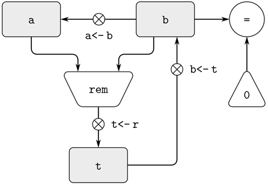

图 5.1：GCD 机床的数据路径。

根据常数和寄存器内容计算值的操作在数据路径图中用包含操作名称的梯形表示。例如，图 5.1：中标有`rem`的方框表示计算其所连接的寄存器`a`和`b`的剩余内容的操作。箭头(无按钮)从输入寄存器和常量指向方框，箭头将运算的输出值连接到寄存器。测试由包含测试名称的圆圈表示。比如我们的 GCD 机器有一个操作，测试寄存器`b`的内容是否为零。测试也有来自其输入寄存器和常数的箭头，但是它没有输出箭头；它的值由控制器使用，而不是由数据路径使用。总的来说，数据路径图显示了机器所需的寄存器和操作，以及它们必须如何连接。如果我们把箭头看作电线，把按钮看作开关，那么数据路径图就很像由电子元件构成的机器的接线图。

为了让数据路径实际计算 gcd，必须按正确的顺序按下按钮。我们将根据控制器图来描述这个序列，如图 5.2：所示。控制器图的元素指示数据路径组件应该如何操作。控制器图中的矩形框标识要按下的数据路径按钮，箭头描述从一个步骤到下一个步骤的顺序。图中的菱形代表一个决定。根据菱形中标识的数据路径测试值，将遵循两个排序箭头中的一个。我们可以从物理类比的角度来解释控制器:把这个图想象成一个弹子在其中滚动的迷宫。当弹球滚进一个盒子时，它会按下由盒子命名的数据路径按钮。当弹球滚入一个决策节点时(比如对`b` = 0 的测试)，它会离开由指示的测试结果所确定的路径上的节点。

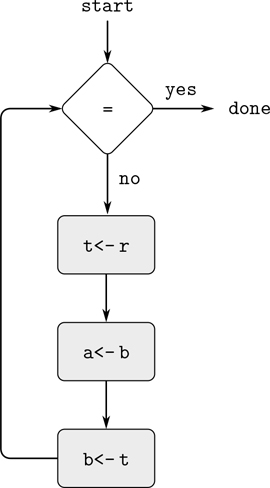

图 5.2：GCD 机的控制器。

总之，数据路径和控制器完整地描述了一台计算 gcd 的机器。在将数字放入寄存器`a`和`b`后，我们在标记为`start`的地方启动控制器(滚动的弹球)。当控制器到达`done`时，我们将在寄存器`a`中找到 GCD 的值。

##### 练习 5.1

设计一个寄存器机器，使用以下函数指定的迭代算法计算阶乘。画出这台机器的数据路径和控制器图。

```js
function factorial(n) {
    function iter(product, counter) {
    return counter > n
           ? product
           : iter(counter * product,
                  counter + 1);
    }
    return iter(1, 1);
}
```

### 5.1.1 一种描述注册机的语言

数据路径和控制器图足以表示简单的机器，如 GCD，但对于描述大型机器，如 JavaScript 解释器，它们就显得笨拙了。为了使处理复杂的机器成为可能，我们将创造一种语言，以文本的形式呈现由数据路径和控制器图给出的所有信息。我们将从直接反映图表的符号开始。

我们通过描述寄存器和操作来定义机器的数据路径。为了描述一个寄存器，我们给它一个名称，并指定控制分配给它的按钮。我们给每个按钮一个名称，并指定进入按钮控制下的寄存器的数据的来源。(源是寄存器、常数或操作。)为了描述一个操作，我们给它一个名字，并指定它的输入(寄存器或常数)。

我们将机器的控制器定义为一系列的指令以及在序列中识别入口点的标签。指令是下列指令之一:

*   为寄存器赋值而按下的数据路径按钮的名称。(这对应于控制器图中的一个方框。)
*   执行指定测试的`test`指令。
*   基于先前测试的结果，到由控制器标签指示的位置的条件分支(`branch`指令)。(测试和分支一起对应于控制器图中的菱形。)如果测试为假，控制器应该继续序列中的下一条指令。否则，控制器应该继续标签后的指令。
*   命名控制器标签的无条件分支(`go_to`指令)，在该标签处继续执行。

机器从控制器指令序列的开始处开始，并在执行到序列末尾时停止。除了当分支改变控制流时，指令按照它们被列出的顺序执行。

图 5.3：显示了这样描述的 GCD 机器。这个例子仅仅暗示了这些描述的一般性，因为 GCD 机器是一个非常简单的例子:每个寄存器只有一个按钮，每个按钮和测试在控制器中只使用一次。

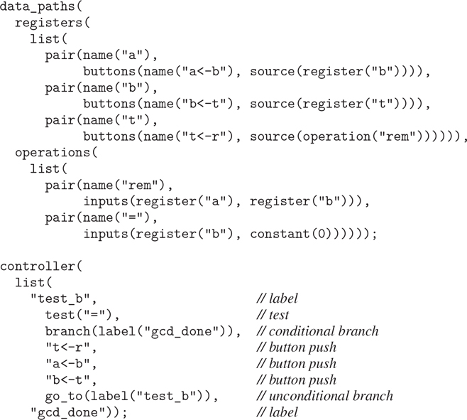

图 5.3：一台规格的 GCD 机。

遗憾的是，这样的描述很难读懂。为了理解控制器指令，我们必须不断地参考按钮名称和操作名称的定义，为了理解按钮的功能，我们可能需要参考操作名称的定义。因此，我们将转换我们的符号来组合来自数据路径和控制器描述的信息，这样我们就可以一起看到它们。

为了获得这种形式的描述，我们将任意的按钮和操作名称替换为它们行为的定义。也就是说，不是(在控制器中)说“按下按钮`t<-r`”和(在数据路径中)分别说“按钮`t<-r`将`rem`操作的值分配给寄存器`t`”和“`rem`操作的输入是寄存器`a`和`b`的内容”，而是说(在控制器中)“按下按钮，将寄存器`a`和`b`的内容上的`rem`操作的值分配给寄存器`t`。”类似地，不是(在控制器中)“执行`=`测试”和(在数据路径中)“测试对寄存器`b`和常数 0 的内容进行操作”，而是“对寄存器`b`和常数 0 的内容执行`=`测试。”我们将省略数据路径描述，只留下控制器序列。因此，GCD 机器描述如下:

```js
controller(
  list(
    "test_b",
      test(list(op("="), reg("b"), constant(0))),
      branch(label("gcd_done")),
      assign("t", list(op("rem"), reg("a"), reg("b"))),
      assign("a", reg("b")),
      assign("b", reg("t")),
      go_to(label("test_b")),
    "gcd_done"))
```

这种形式的描述比图 5.3 中的描述更容易阅读，但它也有缺点:

*   对于大型机器来说，它更加冗长，因为每当在控制器指令序列中提到数据路径元素时，都会重复对这些元素的完整描述。(这在 GCD 示例中不是问题，因为每个操作和按钮只使用一次。)此外，重复的数据路径描述模糊了机器的实际数据路径结构；对于一台大型机器来说，有多少寄存器、操作和按钮以及它们是如何相互连接的并不明显。
*   因为机器定义中的控制器指令看起来像 JavaScript 表达式，所以很容易忘记它们不是任意的 JavaScript 表达式。他们只能记录合法的机器操作。例如，运算只能直接作用于常数和寄存器的内容，而不能作用于其他运算的结果。

尽管有这些缺点，我们将在本章通篇使用这种寄存器-机器语言，因为我们将更关心理解控制器，而不是理解数据路径中的元素和连接。然而，我们应该记住，数据路径设计在设计真实机器时是至关重要的。

##### 练习 5.2

使用寄存器机器语言描述练习 5.1 的迭代阶乘机器。

##### 行动

让我们修改 GCD 机器，这样我们就可以输入我们想要 GCD 的数字，并打印出答案。我们不会讨论如何制造一台可以阅读和打印的机器，但会假设(正如我们在 JavaScript 中使用`prompt`和`display`时所做的那样)它们可以作为原始操作使用。 [²](#c5-fn-0002)

操作`prompt`类似于我们一直在使用的操作，它产生一个可以存储在寄存器中的值。但是`prompt`不接受任何寄存器的输入；它的值取决于发生在

我们正在设计的机器。我们将允许我们的机器的操作有这样的行为，因此将绘制和标注`prompt`的使用，就像我们做任何其他计算值的操作一样。

另一方面，操作`display`从根本上不同于我们一直在使用的操作:它不产生要存储在寄存器中的输出值。虽然它有影响，但这种影响不在我们设计的机器的一部分上。我们将这种操作称为动作。我们将在数据路径图中表示一个动作，就像我们表示一个计算值的操作一样——作为一个包含动作名称的梯形。箭头从任何输入(寄存器或常数)指向动作框。我们还将按钮与动作相关联。按下按钮使动作发生。为了让控制器按下一个动作按钮，我们使用了一种叫做`perform`的新指令。因此，打印寄存器`a`内容的动作在控制器序列中由指令表示

```js
perform(list(op("display"), reg("a")))
```

图 5.4：显示了新 GCD 机器的数据路径和控制器。我们没有让机器在打印出答案后停下来，而是让它重新开始，这样它可以重复读取一对数字，计算它们的 GCD，并打印出结果。这个结构就像我们在第四章的解释器中使用的驱动循环。

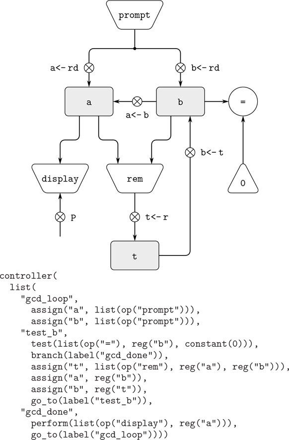

图 5.4：读取输入并打印结果的 GCD 机器。

### 5.1.2 机械设计中的抽象

我们通常会定义一台机器包含实际上非常复杂的“原始”操作。例如，在 5.4 和 5.5 节中，我们将把 JavaScript 的环境操作视为原语。这种抽象是有价值的，因为它允许我们忽略机器部件的细节，这样我们就可以专注于设计的其他方面。然而，我们已经掩盖了许多复杂性的事实并不意味着机器设计是不现实的。我们总是可以用更简单的原语操作来代替复杂的“原语”。

考虑一下 GCD 机器。该机器有一条指令，计算寄存器`a`和`b`内容的余数，并将结果分配给寄存器`t`。如果我们想在不使用原始余数运算的情况下构造 GCD 机器，我们必须指定如何根据更简单的运算来计算余数，例如减法。事实上，我们可以编写一个 JavaScript 函数，以这种方式查找余数:

```js
function remainder(n, d) {
    return n < d
           ? n
           : remainder(n - d, d);
}
```

因此，我们可以用减法运算和比较测试来代替 GCD 机器数据路径中的余数运算。图 5.5：显示了加工机器的数据路径和控制器。指令

```js
assign("t", list(op("rem"), reg("a"), reg("b")))
```

在 GCD 中，控制器定义被包含一个循环的指令序列所取代，如图 5.6：所示。

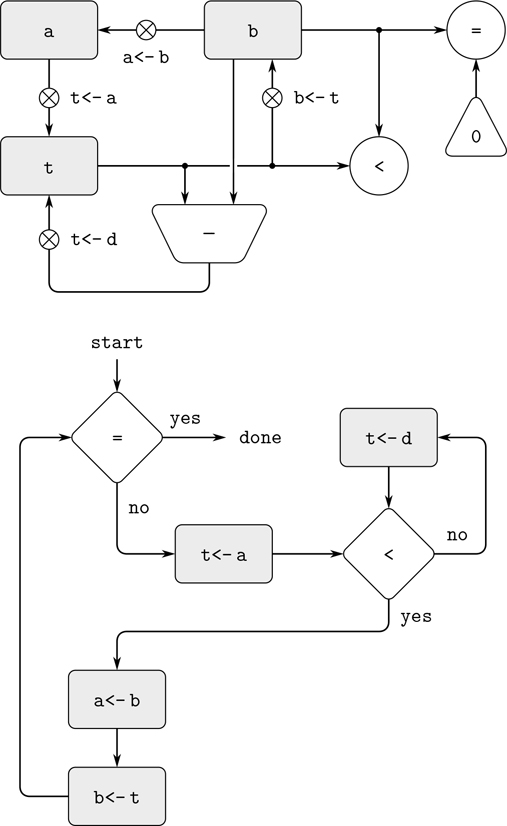

图 5.5：精心设计的 GCD 机床的数据路径和控制器。

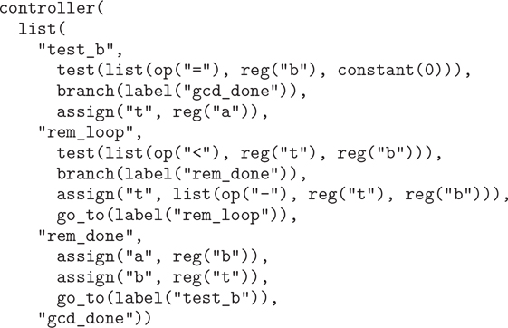

图 5.6：图 5.5 中 GCD 机控制器指令序列。

##### 练习 5.3

设计一台使用牛顿法计算平方根的机器，如第 1.1.7 节所述，并使用第 1.1.8 节中的以下代码实现:

```js
function sqrt(x) {
    function is_good_enough(guess) {
        return math_abs(square(guess) - x) < 0.001;
    }
    function improve(guess) {
        return average(guess, x / guess);
    }
    function sqrt_iter(guess) {
        return is_good_enough(guess)
               ? guess
           : sqrt_iter(improve(guess));
    }
    return sqrt_iter(1);
}
```

首先假设`is_good_enough`和`improve`操作作为原语可用。然后展示如何根据算术运算扩展这些。通过绘制数据路径图和用寄存器-机器语言编写控制器定义来描述每个版本的`sqrt`机器设计。

### 5.1.3 子程序

当设计一台执行计算的机器时，我们通常更喜欢安排组件由计算的不同部分共享，而不是复制组件。考虑一个包含两个 GCD 计算的机器——一个计算寄存器`a`和`b`内容的 GCD，另一个计算寄存器`c`和`d`内容的 GCD。我们可以从假设我们有一个原始的`gcd`操作开始，然后根据更多的原始操作扩展`gcd`的两个实例。图 5.7：只显示了最终机器数据路径的 GCD 部分，没有显示它们如何连接到机器的其余部分。该图还显示了机器控制器序列的相应部分。

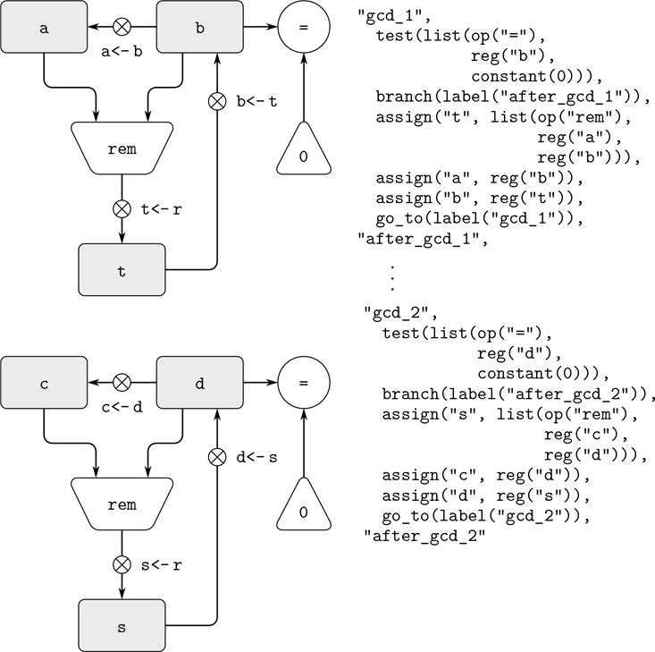

图 5.7：带有两个 GCD 计算的机器的数据路径和控制器序列部分。

这台机器有两个余数操作箱和两个相等测试箱。如果复制的部件很复杂，就像余料箱一样，这将不是制造机器的经济方法。我们可以通过对两个 GCD 计算使用相同的组件来避免复制数据路径组件，只要这样做不会影响更大机器的其余计算。如果控制器到达`gcd_2`时不需要寄存器`a`和`b`中的值(或者如果这些值可以移动到其他寄存器进行保管)，我们可以改变机器，使其在计算第二个和第一个 GCD 时使用寄存器`a`和`b`，而不是寄存器`c`和`d`。如果我们这样做，我们将获得如图 5.8 所示的控制器序列。

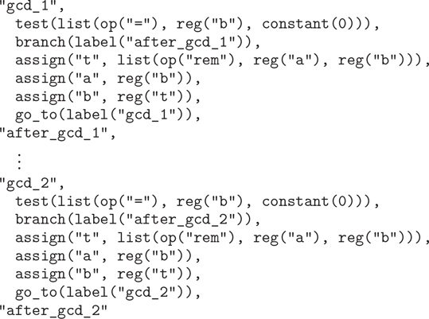

图 5.8：使用相同数据路径组件进行两种不同 GCD 计算的机器的控制器序列部分。

我们已经移除了重复的数据路径组件(因此数据路径再次如图 5.1：所示)，但是控制器现在有两个 GCD 序列，它们的不同之处仅在于入口点标签。最好是将这两个序列替换成一个单独的序列——一个`gcd` 子程序——在这个序列的末尾，我们分支回到主指令序列中的正确位置。我们可以这样完成:在转移到`gcd`之前，我们将一个区别值(比如 0 或 1)放入一个特殊的寄存器`continue`。在`gcd`子程序结束时，我们返回到`after_gcd_1`或`after_gcd_2`，这取决于`continue`寄存器的值。图 5.9：显示了生成的控制器序列的相关部分，其中仅包含一份`gcd`指令。

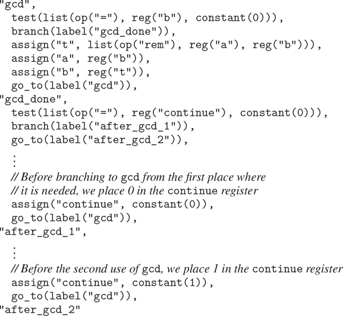

图 5.9：使用`continue`寄存器避免图 5.8：中的重复控制器序列。

对于处理小问题来说，这是一种合理的方法，但是如果在控制器序列中有许多 GCD 计算的实例，这将会很尴尬。为了决定在`gcd`子例程之后在哪里继续执行，我们需要测试所有使用`gcd`的地方的数据路径和控制器中的分支指令。实现子例程的一个更强大的方法是让`continue`寄存器保存控制器序列中入口点的标签，当子例程结束时，应该在该入口点继续执行。实现这种策略需要在数据路径和寄存器机器的控制器之间有一种新的连接:必须有一种方法在控制器序列中给寄存器分配一个标签，使得这个值可以从寄存器中取出并用于在指定的入口点继续执行。

为了反映这种能力，我们将扩展 registermachine 语言的`assign`指令，以允许一个寄存器被指定为来自控制器序列的值 a 标签(作为一种特殊的常量)。我们还将扩展`go_to`指令，以允许在寄存器内容描述的入口点继续执行，而不仅仅是在常量标签描述的入口点继续执行。使用这些新的构造，我们可以用一个到存储在`continue`寄存器中的位置的分支来终止`gcd`子程序。这导致图 5.10 中[所示的控制器序列。](#c5-fig-0010)

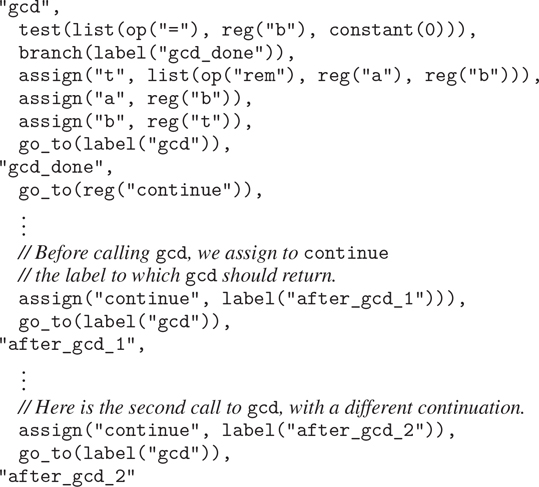

图 5.10：给`continue`寄存器分配标签简化并概括了图 5.9：所示的策略。

具有一个以上子程序的机器可以使用多个延续寄存器(如`gcd_continue`、`factorial_continue`)，或者我们可以让所有子程序共享一个`continue`寄存器。共享更经济，但是如果我们有一个子程序(`sub1`)调用另一个子程序(`sub2`)，我们必须小心。除非`sub1`在设置`continue`以调用`sub2`之前将`continue`的内容保存在其他寄存器中，否则`sub1`将不知道调用完成后该去哪里。下一节中开发的处理递归的机制也为嵌套子例程调用的问题提供了更好的解决方案。

### 5.1.4 使用堆栈实现递归

根据到目前为止所阐述的思想，我们可以通过指定一个寄存器机器来实现任何迭代过程，该寄存器机器具有对应于过程的每个状态变量的寄存器。机器重复执行控制器循环，改变寄存器的内容，直到满足某个终止条件。在控制器序列中的每一点，机器的状态(代表迭代过程的状态)完全由寄存器的内容(状态变量的值)决定。

然而，实现递归过程需要额外的机制。考虑下面计算阶乘的递归方法，我们首先在 1.2.1 节中研究了它:

```js
function factorial(n) {
    return n === 1
           ? 1
           : n * factorial(n - 1);
}
```

从函数中我们看到，计算 n ！需要计算(n–1)！。我们的 GCD 机器，以函数为模型

```js
function gcd(a, b) {
    return b === 0 ? a : gcd(b, a % b);
}
```

同样，必须计算另一个 GCD。但是在`gcd`函数和`factorial`函数之间有一个重要的区别，前者将原始计算简化为一个新的 GCD 计算，后者需要计算另一个阶乘作为子问题。在 GCD 中，新 GCD 计算的答案就是原问题的答案。为了计算下一个 GCD，我们只需将新参数放入 GCD 机器的输入寄存器中，并通过执行相同的控制器序列来重用机器的数据路径。当机器解决完最后一个 GCD 问题时，它就完成了整个计算。

在阶乘(或任何递归过程)的情况下，新阶乘子问题的答案不是原问题的答案。为(n–1)获得的值！必须乘以 n 才能得到最终答案。如果我们试图模仿 GCD 设计，并通过递减`n`寄存器并重新运行阶乘机器来解决阶乘子问题，我们将不再有用于乘以结果的旧值`n`。因此，我们需要第二台阶乘机器来处理

子问题。这个第二阶乘计算本身有一个阶乘子问题，需要第三阶乘机，以此类推。由于每台阶乘机器内部都包含另一台阶乘机器，所以整个机器包含一个由相似机器组成的无限嵌套，因此不能由固定的有限数量的部件构成。

尽管如此，如果我们能够为机器的每个嵌套实例安排使用相同的组件，我们可以将阶乘过程实现为注册机器。具体来说就是计算 n 的机器！应该使用相同的组件来处理计算的子问题(n–1)！，子问题为(n–2)！，等等。这似乎是合理的，因为尽管阶乘过程表明需要无限数量的相同机器的副本来执行计算，但是在任何给定时间，这些副本中只有一个副本需要是活动的。当机器遇到递归子问题时，它可以暂停主问题的工作，重新使用相同的物理部件来处理子问题，然后继续暂停的计算。

在子问题中，寄存器的内容将与主问题中的不同。(在这种情况下，`n`寄存器递减。)为了能够继续暂停的计算，机器必须保存子问题解决后将需要的任何寄存器的内容，以便可以恢复这些内容以继续暂停的计算。在阶乘的情况下，我们将保存旧的值`n`，当我们完成计算递减的`n`寄存器的阶乘时，将恢复旧的值。 [³](#c5-fn-0003)

由于嵌套递归调用的深度没有先验限制，我们可能需要保存任意数量的寄存器值。这些值必须以与它们被保存的顺序相反的顺序被恢复，因为在递归的嵌套中，最后进入的子问题是最先完成的。这决定了使用堆栈或“后进先出”数据结构来保存寄存器值。我们可以通过添加两种指令来扩展寄存器-机器语言以包括堆栈:使用`save`指令将值放入堆栈，使用`restore`指令从堆栈中恢复值。在一系列值已经被`save` d 到堆栈上之后，一系列的`restore`将以相反的顺序检索这些值。 [⁴](#c5-fn-0004)

借助堆栈，我们可以为每个阶乘子问题重用阶乘机器的数据路径的单个副本。在重用操作数据路径的控制器序列时，也存在类似的设计问题。为了重新执行阶乘计算，控制器不能像迭代过程那样简单地循环回到起点，因为在求解(n–1)之后！子问题机器仍然必须将结果乘以 n 。控制器必须暂停其对 n 的计算！，求解(n–1)！子问题，然后继续它的 n 的计算！。阶乘计算的这种观点建议使用第 5.1.3 节中描述的子程序机制，它让控制器使用一个`continue`寄存器转移到序列中解决子问题的部分，然后从主问题停止的地方继续。因此，我们可以创建一个阶乘子例程，返回到存储在`continue`寄存器中的入口点。在每个子程序调用前后，我们保存和恢复`continue`，就像我们保存和恢复`n`寄存器一样，因为阶乘计算的每个“级别”都将使用相同的`continue`寄存器。也就是说，当阶乘子例程为子问题调用自己时，它必须在`continue`中放入一个新值，但是为了返回到调用它来解决子问题的地方，它将需要旧值。

图 5.11：显示了实现递归`factorial`功能的机器的数据路径和控制器。机器有一个堆栈和三个寄存器，称为`n`、`val`和`continue`。为了简化数据路径图，我们没有命名寄存器分配按钮，只命名了堆栈操作按钮(`sc`和`sn`保存寄存器，`rc`和`rn`恢复寄存器)。为了操作机器，我们将希望计算其阶乘的数字放入寄存器`n`并启动机器。当机器到达`fact_done`时，计算结束，答案将在`val`寄存器中找到。在控制器序列中，`n`和`continue`在每次递归调用之前保存，并在调用返回时恢复。通过分支到存储在`continue`中的位置来完成呼叫返回。当机器启动时，寄存器`continue`被初始化，以便最后一次返回将到达`fact_done`。保存阶乘计算结果的`val`寄存器在递归调用之前没有保存，因为在子例程返回之后`val`的旧内容不再有用。只需要新值，即子计算产生的值。

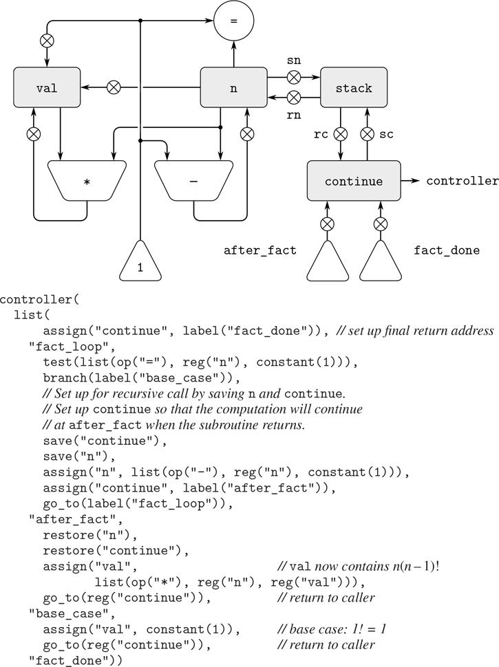

图 5.11：递归阶乘机。

虽然原则上阶乘计算需要一个无限的机器，但图 5.11 中的机器实际上是有限的，除了堆栈，它可能是无限的。然而，堆栈的任何特定物理实现都是有限大小的，这将限制机器可以处理的递归调用的深度。factorial 的实现说明了将递归算法实现为由栈扩充的普通寄存器机器的一般策略。当遇到递归子问题时，我们在堆栈上保存子问题解决后需要其当前值的寄存器，解决递归子问题，然后恢复保存的寄存器并继续执行主问题。必须始终保存`continue`寄存器。是否有其他寄存器需要保存取决于特定的机器，因为不是所有的递归计算都需要在子问题求解过程中修改的寄存器的初始值(见练习 5.4)。

##### 双重递归

让我们检查一个更复杂的递归过程，斐波纳契数的树递归计算，我们在 1.2.2 节中介绍过:

```js
function fib(n) {
    return n === 0
           ? 0
           : n === 1
           ? 1
           : fib(n - 1) + fib(n - 2);
}
```

就像阶乘一样，我们可以用寄存器`n`、`val`和`continue`来实现递归斐波那契计算。该机器比用于阶乘的机器更复杂，因为在控制器序列中有两个地方我们需要执行递归调用——一次是计算 Fib(n–1)，一次是计算 Fib(n–2)。为了设置这些调用，我们保存稍后需要其值的寄存器，将`n`寄存器设置为我们需要递归计算其 Fib 的数字(n–1 或 n–2)，并将主序列中要返回的入口点分配给`continue`(分别为`afterfib_n_1`或`afterfib_n_2`)。我们接着去`fib_loop`。当我们从递归调用返回时，答案在`val`中。图 5.12 显示了该机器的控制器顺序。

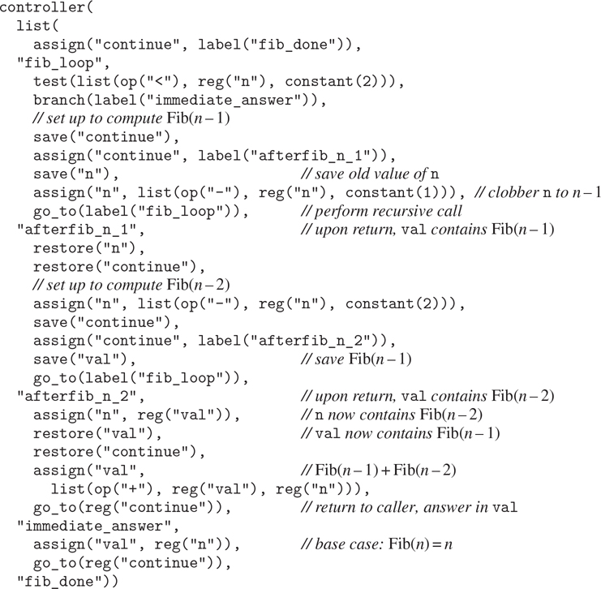

图 5.12：用于计算斐波那契数列的机器控制器。

##### 练习 5.4

指定实现以下每个功能的注册机器。为每台机器写一个控制器指令序列，并画出显示数据路径的图表。

1.  a. 递归求幂:

    ```js
    function expt(b, n) {     return n === 0            ? 1            : b * expt(b, n - 1); }
    ```

2.  b. 迭代求幂:

    ```js
    function expt(b, n) {     function expt_iter(counter, product) {         return counter === 0                ? product                : expt_iter(counter - 1, b * product);     }     return expt_iter(n, 1); }
    ```

##### 练习 5.5

手动模拟阶乘和斐波那契机器，使用一些重要的输入(要求至少执行一次递归调用)。显示执行过程中每个重要点的堆栈内容。

##### 练习 5.6

Ben Bitdiddle 观察到斐波那契机器的控制器序列有一个额外的`save`和一个额外的`restore`，它们可以被移除以制造一个更快的机器。这些说明在哪里？

### 5.1.5 说明摘要

我们的寄存器-机器语言中的一条控制器指令有以下形式之一，其中每个输入 [i] 是`reg(` 寄存器 - 名称 `)`或`constant(` 常量 - 值 `)`。

第 5.1.1 节介绍了这些说明:

```js
assign(register-name, reg(register-name))

assign(register-name, constant(constant-value))

assign(register-name, list(op(operation-name), input[1], . . ., input[n]))

perform(list(op(operation-name), input[1], . . ., input[n]))

test(list(op(operation-name), input[1], . . ., input[n]))

branch(label(label-name))

go_to(label(label-name))
```

第 5.1.3 节介绍了使用登记簿保存标签:

```js
assign(register-name, label(label-name))

go_to(reg(register-name))
```

第 5.1.4 节介绍了电池组的使用说明:

```js
save(register-name)

restore(register-name)
```

到目前为止我们看到的唯一一种常量 - 值是一个数字，不过后面我们也会用到字符串和列表。比如，`constant("abc")`是字符串`"abc"`，`constant(null)`是空列表，`constant(list("a", "b", "c"))`是列表`list("a", "b", "c")`。

## 5.2 一个收银机模拟器

为了更好地理解收银机的设计，我们必须测试我们设计的机器，看看它们是否能按预期运行。测试设计的一种方法是手动模拟控制器的操作，如练习 5.5。但是这对于除了最简单的机器之外的所有机器来说都是极其乏味的。在这一节中，我们为用寄存器机器语言描述的机器构建一个模拟器。模拟器是一个 JavaScript 程序，有四个接口函数。第一种使用寄存器机器的描述来构建机器的模型(其部件对应于要模拟的机器部件的数据结构)，另外三种允许我们通过操纵模型来模拟机器:

*   `make_machine(`register-names, operations, controller)

    用给定的寄存器、操作和控制器构造并返回机器模型。

*   `set_register_contents`(machine-model, register-name, value)

    在给定机器的模拟寄存器中存储一个值。

*   `get_register_contents`(machine-model, register-name)

    返回给定机器中模拟寄存器的内容。

*   `start`(machine-model)

    模拟给定机器的执行，从控制器序列的开头开始，并在到达序列结尾时停止。

作为如何使用这些功能的示例，我们可以将`gcd_machine`定义为第 5.1.1 节的 GCD 机器模型，如下所示:

```js
const gcd_machine =
    make_machine(
        list("a", "b", "t"),
        list(list("rem", (a, b) => a % b),
         list("=", (a, b) => a === b)),
        list(
          "test_b",
            test(list(op("="), reg("b"), constant(0))),
            branch(label("gcd_done")),
            assign("t", list(op("rem"), reg("a"), reg("b"))),
            assign("a", reg("b")),
            assign("b", reg("t")),
            go_to(label("test_b")),
      "gcd_done"));
```

`make_machine`的第一个参数是寄存器名称列表。下一个参数是一个表(两个元素列表的列表)，它将每个操作名称与实现该操作的 JavaScript 函数配对(即，给定相同的输入值，产生相同的输出值)。最后一个参数将控制器指定为标签和机器指令的列表，如 5.1 节所示。

为了用这台机器计算 gcd，我们设置输入寄存器，启动机器，并在模拟终止时检查结果:

```js
set_register_contents(gcd_machine, "a", 206);
"done"

set_register_contents(gcd_machine, "b", 40);
"done"

start(gcd_machine);
"done"

get_register_contents(gcd_machine, "a");
2
```

这种计算比用 JavaScript 编写的`gcd`函数运行起来要慢得多，因为我们将通过复杂得多的操作来模拟低级机器指令，比如`assign`。

##### 练习 5.7

使用模拟器测试您在练习 5.4 中设计的机器。

### 5.2.1 机器型号

使用第 3 章中开发的消息传递技术，由`make_machine`生成的机器模型被表示为具有本地状态的函数。为了构建这个模型，`make_machine`首先调用函数`make_new_machine`来构建机器模型中所有注册机器共有的部分。`make_new_machine`构建的这个基本机器模型，本质上是一些寄存器和堆栈的容器，再加上一个执行机制，逐个处理控制器指令。

然后函数`make_machine`扩展了这个基本模型(通过向它发送消息),以包括寄存器、操作和被定义的特定机器的控制器。首先，它在新机器中为每个提供的寄存器名分配一个寄存器，并在机器中安装指定的操作。然后，它使用一个汇编器(下面在第 5.2.2 节中描述)将控制器列表转换成新机器的指令，并将这些指令作为机器的指令序列安装。函数`make_machine`返回修改后的机器型号作为其值。

```js
function make_machine(register_names, ops, controller) {
    const machine = make_new_machine();
    for_each(register_name =>
               machine("allocate_register")(register_name),
             register_names);
    machine("install_operations")(ops);
    machine("install_instruction_sequence")
           (assemble(controller, machine));
    return machine;
}
```

##### 登记

我们将把一个寄存器表示为一个具有本地状态的函数，如第 3 章所述。函数`make_register`创建一个寄存器，该寄存器保存一个可被访问或更改的值:

```js
function make_register(name) {
    let contents = "*unassigned*";
    function dispatch(message) {
        return message === "get"
               ? contents
               : message === "set"
               ? value => { contents = value; }
               : error(message, "unknown request – make_register");
    }
    return dispatch;
}
```

以下函数用于访问寄存器:

```js
function get_contents(register) {
    return register("get");
}
function set_contents(register, value) {
    return register("set")(value);
}
```

##### 堆栈

我们也可以将堆栈表示为具有本地状态的函数。函数`make_ stack`创建一个堆栈，其本地状态由堆栈上的项目列表组成。堆栈接受请求，将一个项目`push`到堆栈上，将顶部项目`pop`出堆栈并返回，以及`initialize`清空堆栈。

```js
function make_stack() {
    let stack = null;
    function push(x) {
        stack = pair(x, stack);
        return "done";
    }
    function pop() {
        if (is_null(stack)) {
            error("empty stack – pop");
        } else {
            const top = head(stack);
            stack = tail(stack);
            return top;
        }
    }
    function initialize() {
        stack = null;
        return "done";
    }
    function dispatch(message) {
        return message === "push"
               ? push
               : message === "pop"
               ? pop()
               : message === "initialize"
               ? initialize()
               : error(message, "unknown request – stack");
    }
    return dispatch;
}
```

以下函数用于访问堆栈:

```js
function pop(stack) {
    return stack("pop");
}
function push(stack, value) {
    return stack("push")(value);
}
```

##### 基本机器

`make_new_machine`函数，如图 5.13：所示，构造了一个对象，其本地状态由一个堆栈、一个最初为空的指令序列、一个最初包含一个初始化堆栈操作的操作列表以及一个最初包含两个名为`flag`和`pc`(代表“程序计数器”)的注册表。内部函数`allocate_register`向注册表添加新条目，内部函数`lookup_register`在表中查找寄存器。

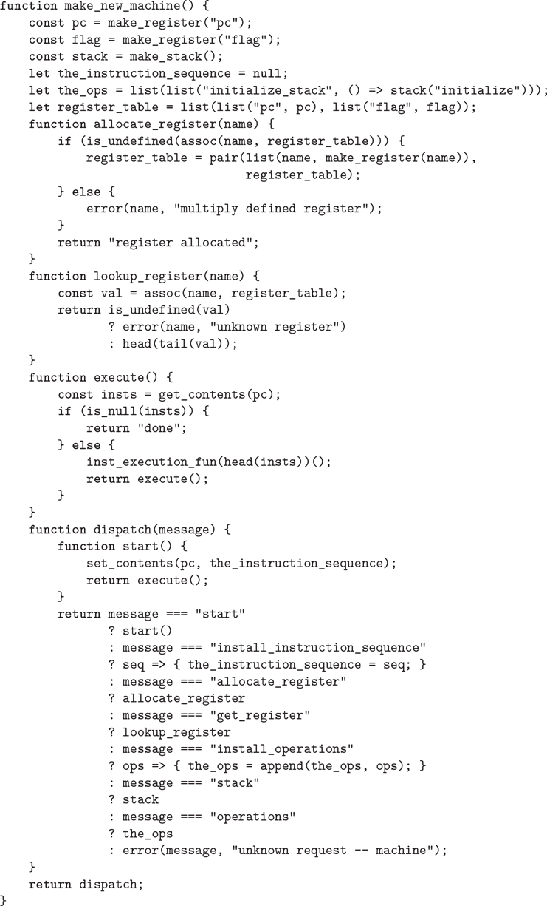

图 5.13：`make_new_machine`功能实现了基本机型。

`flag`寄存器用于控制模拟机器中的分支。我们的`test`指令将`flag`的内容设置为测试结果(真或假)。我们的`branch`指令通过检查`flag`的内容来决定是否分支。

`pc`寄存器决定机器运行时指令的顺序。该序列由内部函数`execute`执行。在仿真模型中，每条机器指令都是一个数据结构，它包括一个没有参数的函数，称为指令执行函数，这样调用这个函数就模拟了指令的执行。当模拟运行时，`pc`指向指令序列中从下一条要执行的指令开始的位置。函数`execute`获取该指令，通过调用指令执行函数来执行该指令，并重复该循环，直到不再有要执行的指令(即，直到`pc`指向指令序列的末尾)。

作为其操作的一部分，每个指令执行函数修改`pc`以指示要执行的下一条指令。指令`branch`和`go_to`改变`pc`指向新的目的地。所有其他指令简单地推进`pc`，使其指向序列中的下一条指令。注意到对`execute`的每次调用都会再次调用`execute`，但是这并不会产生无限循环，因为运行指令执行函数会改变`pc`的内容。

函数`make_new_machine`返回一个调度函数，该函数实现对内部状态的消息传递访问。请注意，启动机器是通过将`pc`设置到指令序列的开头并调用`execute`来完成的。

为方便起见，我们为机器的`start`操作提供了一个替代接口，以及设置和检查寄存器内容的功能，如第 5.2 节开头所述:

```js
function start(machine) {
    return machine("start");
}
function get_register_contents(machine, register_name) {
    return get_contents(get_register(machine, register_name));
}
function set_register_contents(machine, register_name, value) {
    set_contents(get_register(machine, register_name), value);
    return "done";
}
```

这些函数(以及第 5.2.2 节和第 5.2.3 节中的许多函数)使用以下内容来查找给定机器中具有给定名称的寄存器:

```js
function get_register(machine, reg_name) {
    return machine("get_register")(reg_name);
}
```

### 5.2.2 组装者

汇编程序将机器的控制器指令序列转换成相应的机器指令列表，每个指令都有其执行功能。总的来说，汇编程序很像我们在第 4 章中学习的赋值器——有一种输入语言(在这种情况下，是寄存器机器语言),我们必须为语言中的每种类型的组件执行适当的动作。

为每条指令生成一个执行函数的技术正是我们在 4.1.7 节中使用的，通过将分析与运行时执行分离来加速评估器。正如我们在第 4 章中看到的，在不知道名称的实际值的情况下，可以对 JavaScript 表达式进行很多有用的分析。这里，类似地，在不知道机器寄存器的实际内容的情况下，可以执行寄存器机器语言表达式的许多有用的分析。例如，我们可以用指向寄存器对象的指针来替换对寄存器的引用，也可以用指向指令序列中标签所指定位置的指针来替换对标签的引用。

在生成指令执行函数之前，汇编程序必须知道所有标签所指的是什么，因此它首先扫描控制器序列，将标签与指令分开。当它扫描控制器时，它构建一个指令列表和一个表，该表将每个标签与指向该列表的指针相关联。然后，汇编程序通过为每条指令插入执行函数来扩充指令表。

`assemble`函数是汇编程序的主要入口。它将控制器序列和机器模型作为参数，并返回要存储在模型中的指令序列。函数`assemble`调用`extract_labels`从提供的控制器构建初始指令表和标签表。`extract_labels`的第二个参数是一个被调用来处理这些结果的函数:这个函数使用`update_insts`来生成指令执行函数并将它们插入到指令表中，并返回修改后的列表。

```js
function assemble(controller, machine) {
    return extract_labels(controller,
                          (insts, labels) => {
                              update_insts(insts, labels, machine);
                              return insts;
                          });
}
```

函数`extract_labels`将一个列表`controller`和一个函数`receive`作为参数。函数`receive`将用两个值调用:(1)指令数据结构列表`insts`，每个包含一条来自`controller`的指令；以及(2)名为`labels`的表，其将来自`controller`的每个标签与标签指定的列表`insts`中的位置相关联。

```js
function extract_labels(controller, receive) {
    return is_null(controller)
           ? receive(null, null)
           : extract_labels(
                 tail(controller),
                 (insts, labels) => {
                   const next_element = head(controller);
                   return is_string(next_element)
                          ? receive(insts,
                                    pair(make_label_entry(next_element,
                                                          insts),
                                         labels))
                          : receive(pair(make_inst(next_element),
                                         insts),
                                    labels);
                 });
}
```

功能`extract_labels`通过顺序扫描`controller`的元素并累加`insts`和`labels`来工作。如果一个元素是一个字符串(因此是一个标签),一个适当的条目被添加到`labels`表中。否则，该元素被累积到`insts`列表中。 [⁵](#c5-fn-0005)

函数`update_insts`修改最初仅包含控制器指令的指令列表，以包括相应的执行函数:

```js
function update_insts(insts, labels, machine) {
    const pc = get_register(machine, "pc");
    const flag = get_register(machine, "flag");
    const stack = machine("stack");
    const ops = machine("operations");
    return for_each(inst => set_inst_execution_fun(
                                inst,
                                make_execution_function(
                                    inst_controller_instruction(inst),
                                    labels, machine, pc,
                                    flag, stack, ops)),
                    insts);
}
```

机器指令数据结构简单地将控制器指令与相应的执行功能配对。当`extract_labels`构造指令时，执行功能还不可用，稍后由`update_insts`插入。

```js
function make_inst(inst_controller_instruction) {
    return pair(inst_controller_instruction, null);
}
function inst_controller_instruction(inst) {
    return head(inst);
}
function inst_execution_fun(inst) {
    return tail(inst);
}
function set_inst_execution_fun(inst, fun) {
    set_tail(inst, fun);
}
```

我们的模拟器并不使用控制器指令，但是可以方便地用于调试(参见练习 5.15)。

标签表的元素是成对的:

```js
function make_label_entry(label_name, insts) {
    return pair(label_name, insts);
}
```

条目将在表中查找

```js
function lookup_label(labels, label_name) {
    const val = assoc(label_name, labels);
    return is_undefined(val)
           ? error(label_name, "undefined label – assemble")
           : tail(val);
}
```

##### 练习 5.8

以下注册机代码不明确，因为标签`here`定义了多次:

```js
"start",
  go_to(label("here")),
"here",
  assign("a", constant(3)),
  go_to(label("there")),
"here",
  assign("a", constant(4)),
  go_to(label("there")),
"there",
```

根据模拟器的编写，当控制到达`there`时，寄存器`a`的内容会是什么？修改`extract_labels`函数，这样，如果使用相同的标签名称来表示两个不同的位置，汇编程序将发出错误信号。

### 5.2.3 指令及其执行功能

汇编程序调用`make_execution_function`来生成控制器指令的执行函数。像 4.1.7 节的评估器中的`analyze`函数一样，它根据指令类型来调度，以生成适当的执行函数。这些执行功能的细节决定了寄存器机器语言中各个指令的含义。

```js
function make_execution_function(inst, labels, machine,
                                 pc, flag, stack, ops) {
    const inst_type = type(inst);
    return inst_type === "assign"
           ? make_assign_ef(inst, machine, labels, ops, pc)
           : inst_type === "test"
           ? make_test_ef(inst, machine, labels, ops, flag, pc)
           : inst_type === "branch"
           ? make_branch_ef(inst, machine, labels, flag, pc)
           : inst_type === "go_to"
           ? make_go_to_ef(inst, machine, labels, pc)
           : inst_type === "save"
           ? make_save_ef(inst, machine, stack, pc)
           : inst_type === "restore"
           ? make_restore_ef(inst, machine, stack, pc)
           : inst_type === "perform"
           ? make_perform_ef(inst, machine, labels, ops, pc)
           : error(inst, "unknown instruction type – assemble");
}
```

由`make_machine`接收并传递给`assemble`的`controller`序列的元素是字符串(用于标签)和标记列表(用于指令)。指令中的标签是标识指令类型的字符串，如`"go_to"`，列表的其余元素包含自变量，如`go_to`的目的地。`make_execution_function`中的调度使用

```js
function type(instruction) { return head(instruction); }
```

标签列表是在对作为第三个参数的表达式进行求值时构建的。这个`list`的每个参数要么是一个字符串(它自己求值)，要么是对一个指令标记列表的构造函数的调用。比如`assign("b", reg("t"))`用参数`"b"`调用构造函数`assign`，用参数`"t"`调用构造函数`reg`的结果。构造函数和它们的参数决定了寄存器机器语言中单个指令的语法。下面显示了指令构造器和选择器，以及使用选择器的执行函数生成器。

##### 指令`**assign**`

`make_assign_ef`函数为`assign`指令提供执行功能:

```js
function make_assign_ef(inst, machine, labels, operations, pc) {
    const target = get_register(machine, assign_reg_name(inst));
    const value_exp = assign_value_exp(inst);
    const value_fun =
        is_operation_exp(value_exp)
        ? make_operation_exp_ef(value_exp, machine, labels, operations)
        : make_primitive_exp_ef(value_exp, machine, labels);
    return () => {
               set_contents(target, value_fun());
               advance_pc(pc);
           };
}
```

函数`assign`构造`assign`指令。选择器`assign_reg_ name`和`assign_value_exp`从`assign`指令中提取寄存器名称和值表达式。

```js
function assign(register_name, source) {
    return list("assign", register_name, source);
}
function assign_reg_name(assign_instruction) {
    return head(tail(assign_instruction));
}
function assign_value_exp(assign_instruction) {
    return head(tail(tail(assign_instruction)));
}
```

函数`make_assign_ef`用`get_register`查找寄存器名，以产生目标寄存器对象。如果值是操作的结果，则值表达式被传递给`make_ operation_exp_ef`，否则被传递给`make_primitive_exp_ef`。这些函数(如下所示)分析值表达式，并为该值生成一个执行函数。这是一个没有参数的函数，称为`value_fun`，它将在仿真期间被评估，以产生要分配给寄存器的实际值。请注意，查找寄存器名称和分析值表达式的工作只在汇编时执行一次，而不是每次模拟指令时都执行。这种工作节省是我们使用执行函数的原因，并且直接对应于我们通过在 4.1.7 节的评估器中将程序分析从执行中分离出来而获得的工作节省。

`make_assign_ef`返回的结果是`assign`指令的执行函数。当该函数被调用时(通过机器模型的`execute`函数)，它将目标寄存器的内容设置为通过执行`value_fun`获得的结果。然后，它通过运行函数将`pc`推进到下一条指令

```js
function advance_pc(pc) {
    set_contents(pc, tail(get_contents(pc)));
}
```

功能`advance_pc`是除`branch`和`go_to`之外所有指令的正常终止。

##### 指令`**test**`、`**branch**`和`**go_to**`

功能`make_test_ef`以类似的方式处理`test`指令。它提取指定要测试的条件的表达式，并为其生成一个执行函数。在模拟时，条件的函数被调用，结果被分配给`flag`寄存器，并且`pc`被推进:

```js
function make_test_ef(inst, machine, labels, operations, flag, pc) {
    const condition = test_condition(inst);
    if (is_operation_exp(condition)) {
        const condition_fun = make_operation_exp_ef(
                                  condition, machine,
                                  labels, operations);
        return () => {
                   set_contents(flag, condition_fun());
                   advance_pc(pc);
               };
    } else {
        error(inst, "bad test instruction – assemble");
    }
}
```

函数`test`构造`test`指令。选择器`test_condition`从测试中提取条件。

```js
function test(condition) { return list("test", condition); }
function test_condition(test_instruction) {
    return head(tail(test_instruction));
}
```

`branch`指令的执行功能检查`flag`寄存器的内容，或者将`pc`的内容设置为分支目的地(如果分支被采用)，或者仅推进`pc`(如果分支未被采用)。注意，`branch`指令中指示的目的地必须是一个标签，而`make_branch_ef`函数强制执行这一点。还要注意，标签是在汇编时查找的，而不是每次模拟`branch`指令时。

```js
function make_branch_ef(inst, machine, labels, flag, pc) {
    const dest = branch_dest(inst);
    if (is_label_exp(dest)) {
        const insts = lookup_label(labels, label_exp_label(dest));
        return () => {
                   if (get_contents(flag)) {
                       set_contents(pc, insts);
                   } else {
                       advance_pc(pc);
                   }
               };
    } else {
        error(inst, "bad branch instruction – assemble");
    }
}
```

函数`branch`构造`branch`指令。选择器`branch_dest`从分支中提取目的地。

```js
function branch(label) { return list("branch", label); }
function branch_dest(branch_instruction) {
    return head(tail(branch_instruction));
}
```

`go_to`指令类似于分支，除了目标可以被指定为标签或寄存器，并且没有检查条件—`pc`总是被设置为新的目标。

```js
function make_go_to_ef(inst, machine, labels, pc) {
    const dest = go_to_dest(inst);
    if (is_label_exp(dest)) {
        const insts = lookup_label(labels, label_exp_label(dest));
        return () => set_contents(pc, insts);
    } else if (is_register_exp(dest)) {
        const reg = get_register(machine, register_exp_reg(dest));
        return () => set_contents(pc, get_contents(reg));
    } else {
        error(inst, "bad go_to instruction – assemble");
    }
}
```

函数`go_to`构造`go_to`指令。选择器`go_to_dest`从`go_to`指令中提取目的地。

```js
function go_to(label) { return list("go_to", label); }
function go_to_dest(go_to_instruction) {
    return head(tail(go_to_instruction));
}
```

##### 其他说明

堆栈指令`save`和`restore`简单地使用带有指定寄存器的堆栈，并推进`pc`:

```js
function make_save_ef(inst, machine, stack, pc) {
    const reg = get_register(machine, stack_inst_reg_name(inst));
    return () => {
               push(stack, get_contents(reg));
               advance_pc(pc);
           };
}
function make_restore_ef(inst, machine, stack, pc) {
    const reg = get_register(machine, stack_inst_reg_name(inst));
    return () => {
               set_contents(reg, pop(stack));
               advance_pc(pc);
           };
}
```

功能`save`和`restore`构成`save`和`restore`指令。选择器`stack_inst_reg_name`从这些指令中提取寄存器名称。

```js
function save(reg) { return list("save", reg); }
function restore(reg) { return list("restore", reg); }
function stack_inst_reg_name(stack_instruction) {
    return head(tail(stack_instruction));
}
```

由`make_perform_ef`处理的最终指令类型为要执行的动作生成一个执行函数。在模拟时间，动作功能被执行并且`pc`被推进。

```js
function make_perform_ef(inst, machine, labels, operations, pc) {
    const action = perform_action(inst);
    if (is_operation_exp(action)) {
        const action_fun = make_operation_exp_ef(action, machine,
                                                 labels, operations);
        return () => {
                   action_fun();
                   advance_pc(pc);
               };
    } else {
        error(inst, "bad perform instruction – assemble");
    }
}
```

函数`perform`构造`perform`指令。选择器`perform_ action`从`perform`指令中提取动作。

```js
function perform(action) { return list("perform", action); }
function perform_action(perform_instruction) {
    return head(tail(perform_instruction));
}
```

##### 子表达式的执行函数

`reg`、`label`或`constant`表达式的值可能需要分配给寄存器(上面的`make_assign_ef`)或输入操作(下面的`make_ operation_exp_ef`)。以下函数生成执行函数，以便在模拟过程中为这些表达式生成值:

```js
function make_primitive_exp_ef(exp, machine, labels) {
    if (is_constant_exp(exp)) {
        const c = constant_exp_value(exp);
        return () => c;
    } else if (is_label_exp(exp)) {
        const insts = lookup_label(labels, label_exp_label(exp));
        return () => insts;
    } else if (is_register_exp(exp)) {
        const r = get_register(machine, register_exp_reg(exp));
        return () => get_contents(r);
    } else {
        error(exp, "unknown expression type – assemble");
    }
}
```

`reg`、`label`和`constant`表达式的语法由以下构造函数以及相应的谓词和选择器决定。

```js
function reg(name) { return list("reg", name); }
function is_register_exp(exp) { return is_tagged_list(exp, "reg"); }
function register_exp_reg(exp) { return head(tail(exp)); }

function constant(value) { return list("constant", value); }
function is_constant_exp(exp) {
    return is_tagged_list(exp, "constant");
}
function constant_exp_value(exp) { return head(tail(exp)); }

function label(name) { return list("label", name); }
function is_label_exp(exp) { return is_tagged_list(exp, "label"); }
function label_exp_label(exp) { return head(tail(exp)); }
```

指令`assign`、`perform`和`test`可能包括将机器操作(由`op`表达式指定)应用于某些操作数(由`reg`和`constant`表达式指定)。以下函数为“运算表达式”生成一个执行函数，运算表达式是包含指令中运算和操作数表达式的列表:

```js
function make_operation_exp_ef(exp, machine, labels, operations) {
    const op = lookup_prim(operation_exp_op(exp), operations);
    const afuns = map(e => make_primitive_exp_ef(e, machine, labels),
                      operation_exp_operands(exp));
    return () => apply_in_underlying_javascript(
                     op, map(f => f(), afuns));
}
```

运算表达式的语法由以下因素决定

```js
function op(name) { return list("op", name); }
function is_operation_exp(exp) {
    return is_pair(exp) && is_tagged_list(head(exp), "op");
}
function operation_exp_op(op_exp) { return head(tail(head(op_exp))); }
function operation_exp_operands(op_exp) { return tail(op_exp); }
```

观察到运算表达式的处理非常类似于 4.1.7 节求值器中的`analyze_application`函数对函数应用的处理，因为我们为每个操作数生成一个执行函数。在模拟时，我们调用操作数函数，并将模拟操作的 JavaScript 函数应用于结果值。我们使用函数`apply_in_underlying_javascript`，就像我们在第 4.1.4 节的`apply_primitive_function`中所做的那样。这是将`op`应用于由第一个`map`产生的参数列表`afuns`的所有元素所需要的，就好像它们是`op`的单独参数一样。如果没有这个，`op`将被限制为一元函数。

通过在机器的操作表中查找操作名称，可以找到模拟功能:

```js
function lookup_prim(symbol, operations) {
    const val = assoc(symbol, operations);
    return is_undefined(val)
           ? error(symbol, "unknown operation – assemble")
           : head(tail(val));
}
```

##### 练习 5.9

上面对机器操作的处理允许它们对标签、常数和寄存器内容进行操作。修改表达式处理函数，以强制执行只能对寄存器和常数使用运算的条件。

##### 练习 5.10

当我们在第 5.1.4 节介绍`save`和 restore 时，我们没有说明如果您试图恢复一个不是最后保存的寄存器会发生什么，就像序列中那样

```js
save(y);
save(x);
restore(y);
```

`restore`的含义有几种合理的可能:

1.  a. `restore(y)`将保存在堆栈上的最后一个值放入`y`中，不管该值来自哪个寄存器。这是我们的模拟器的行为方式。展示如何利用此行为从第 5.1.4 节的斐波那契机器中删除一条指令(图 5.12： )。
2.  b. `restore(y)`将保存在堆栈上的最后一个值放入`y`，但前提是该值是从`y`保存的；否则，它会发出错误信号。修改模拟器，使其以这种方式运行。您必须更改`save`以将寄存器名称与值一起放入堆栈。
3.  c. 修改模拟器，使其以这种方式运行。您将不得不为每个寄存器关联一个单独的堆栈。你应该让`initialize_stack`操作初始化所有的寄存器堆栈。

##### 练习 5.11

模拟器可用于帮助确定实现具有给定控制器的机器所需的数据路径。扩展汇编程序以在机器模型中存储以下信息:

*   按指令类型(`assign`、`go_to`等)排序的所有指令的列表，删除重复的指令；
*   用于保存入口点的寄存器列表(无重复)(这些是由`go_to`指令引用的寄存器)；
*   `save` d 或`restore` d 寄存器的列表(无副本);
*   对于每个寄存器，一个其被分配的源的列表(没有重复)(例如，图 5.11 的[的阶乘机器中寄存器`val`的源是`constant(1)`和`list(op("*"), reg("n"), reg("val"))`)。](#c5-fig-0011)

将消息传递接口扩展到机器，以提供对这些新信息的访问。为了测试你的分析器，从图 5.12：中定义斐波那契机，并检查你构建的列表。

##### 练习 5.12

修改模拟器，使其使用控制器序列来确定机器有哪些寄存器，而不是要求寄存器列表作为`make_machine`的参数。您可以在指令汇编期间第一次看到寄存器时，一次分配一个，而不是预先分配`make_machine`中的寄存器。

### 5.2.4 监控机器性能

模拟不仅有助于验证机器设计的正确性，而且有助于测量机器的性能。例如，我们可以在模拟程序中安装一个“计量器”,用来测量计算中使用的堆栈操作的数量。为此，我们修改我们的模拟堆栈，以跟踪寄存器保存在堆栈上的次数以及堆栈达到的最大深度，并向打印统计数据的堆栈接口添加一条消息，如下所示。我们还向基本机器模型添加了一个操作来打印堆栈统计数据，方法是将`make_new_machine`中的`the_ops`初始化为

```js
list(list("initialize_stack",
          () => stack("initialize")),
     list("print_stack_statistics",
          () => stack("print_statistics")));
```

下面是新版的`make_stack`:

```js
function make_stack() {
    let stack = null;
    let number_pushes = 0;
    let max_depth = 0;
    let current_depth = 0;
    function push(x) {
        stack = pair(x, stack);
        number_pushes = number_pushes + 1;
        current_depth = current_depth + 1;
        max_depth = math_max(current_depth, max_depth);
        return "done";
    }
    function pop() {
        if (is_null(stack)) {
            error("empty stack – pop");
        } else {
            const top = head(stack);
            stack = tail(stack);
            current_depth = current_depth - 1;
            return top;
        }
    }
    function initialize() {
        stack = null;
        number_pushes = 0;
        max_depth = 0;
        current_depth = 0;
        return "done";
    }
    function print_statistics() {
        display("total pushes = " + stringify(number_pushes));
        display("maximum depth = " + stringify(max_depth));
    }
    function dispatch(message) {
        return message === "push"
               ? push
               : message === "pop"
               ? pop()
               : message === "initialize"
               ? initialize()
               : message === "print_statistics"
               ? print_statistics()
               : error(message, "unknown request – stack");
    }
    return dispatch;
}
```

练习 5.14 到 5.18 描述了可以添加到寄存器机器模拟器中的其他有用的监控和调试功能。

##### 练习 5.13

测量推动次数和计算 n 所需的最大堆叠深度！对于 n 的各种小值，使用图 5.11：所示的阶乘机。根据您的数据，根据 n 确定用于计算 n 的推送操作总数和最大堆栈深度的公式！对于任意 n1。注意，每个都是 n 的线性函数，因此由两个常数决定。为了打印统计数据，您必须用初始化堆栈和打印统计数据的指令来扩充阶乘机器。您可能还想修改机器，使其重复读取 n 的值，计算阶乘，并打印结果(就像我们在图 5.4：中对 GCD 机器所做的那样)，这样您就不必重复调用`get_register_contents`、`set_register_contents`和`start`。

##### 练习 5.14

将指令计数添加到寄存器机器模拟中。也就是说，让机器模型跟踪执行的指令数量。扩展机器模型的接口以接受打印指令计数的值并将计数重置为零的新消息。

##### 练习 5.15

增加模拟器以提供指令跟踪。也就是说，在执行每条指令之前，模拟器应该打印该指令。使机器模型接受`trace_on`和`trace_off`消息来打开和关闭跟踪。

##### 练习 5.16

扩展练习 5.15 的指令跟踪，以便在打印指令之前，模拟器打印控制器序列中该指令之前的所有标签。注意不要干扰指令计数(练习 5.14)。您必须让模拟器保留必要的标签信息。

##### 练习 5.17

修改第 5.2.1 节的`make_register`功能，以便可以跟踪寄存器。寄存器应该接受开启和关闭跟踪的消息。当寄存器被跟踪时，给寄存器赋值应该打印出寄存器的名称、寄存器的旧内容和被赋值的新内容。将接口扩展到机器型号，以允许您为指定的机器寄存器打开和关闭跟踪。

##### 练习 5.18

Alyssa P. Hacker 希望模拟器中有一个断点功能来帮助她调试她的机器设计。你被雇来为她安装这项功能。她希望能够在控制器序列中指定模拟器将停止的位置，并允许她检查机器的状态。你要实现一个功能

```js
set_breakpoint(machine, label, n)
```

这将在给定标签后的第 n 条指令之前设置断点。举个例子，

```js
set_breakpoint(gcd_machine, "test_b", 4)
```

在寄存器`a`赋值前的`gcd_machine`中安装一个断点。当模拟器到达断点时，它应该打印标签和断点的偏移量，并停止执行指令。然后，Alyssa 可以使用`get_register_contents`和`set_register_contents`来操纵模拟机器的状态。然后她应该能够继续执行，说

```js
proceed_machine(machine)
```

她还应该能够通过以下方式移除特定的断点

```js
cancel_breakpoint(machine, label, n)
```

或者通过以下方式移除所有断点

```js
cancel_all_breakpoints(machine)
```

## 5.3 存储分配和垃圾收集

在 5.4 节中，我们将展示如何实现一个 JavaScript 评估器作为注册机器。为了简化讨论，我们将假设我们的寄存器机器可以配备一个列表结构存储器，其中用于操作列表结构数据的基本操作是原语。当人们关注解释器中的控制机制时，假设这种存储器的存在是一种有用的抽象，但这并不反映当代计算机的实际原始数据操作的现实观点。为了更全面地了解系统如何有效地支持列表结构的内存，我们必须研究如何以一种与传统计算机内存兼容的方式来表示列表结构。

实现列表结构有两个考虑因素。第一个纯粹是表示的问题:如何仅使用典型的计算机存储器的存储和寻址能力来表示对的“盒指针”结构。第二个问题与计算过程中的内存管理有关。JavaScript 系统的操作关键取决于不断创建新数据对象的能力。这些包括由被解释的 JavaScript 函数显式创建的对象，以及由解释器本身创建的结构，例如环境和参数列表。尽管不断创建新的数据对象在具有无限量可快速寻址内存的计算机上不会造成问题，但计算机内存只有有限的大小(这就更令人遗憾了)。JavaScript 因此提供了一个自动存储分配工具来支持无限内存的假象。当不再需要某个数据对象时，分配给它的内存会自动回收并用于构造新的数据对象。有各种技术来提供这种自动存储分配。我们将在本节讨论的方法被称为垃圾收集。

### 5.3.1 记忆为向量

一个传统的计算机内存可以被认为是一个格子阵列，每个格子可以包含一条信息。每个格子都有一个独特的名字，称为它的地址或位置。典型的内存系统提供两种基本操作:一种是获取存储在指定位置的数据，另一种是将新数据分配到指定位置。存储器地址可以递增，以支持对某组隔间的顺序访问。更一般地说，许多重要的数据操作要求将内存地址视为数据，这些数据可以存储在内存位置，并在机器寄存器中进行操作。列表结构的表示就是这种地址算法的一个应用。

为了给计算机内存建模，我们使用了一种新的数据结构，称为矢量。抽象地说，vector 是一个复合数据对象，其单个元素可以通过整数索引在独立于索引的时间内进行访问。 [⁶](#c5-fn-0006) 为了描述内存操作，我们用两个函数来操作向量: [⁷](#c5-fn-0007)

*   `vector_ref` ( 向量， n )返回向量的第 n 个元素。
*   `vector_set` ( 向量， n ，值)将向量的第 n 个元素设置为指定值。

例如，如果`v`是一个向量，那么`vector_ref(v, 5)`获取向量`v`中的第五个条目，而`vector_set(v, 5, 7)`将向量`v`的第五个条目的值更改为 7。 [⁸](#c5-fn-0008) 对于计算机内存，这种访问可以通过使用地址算法将指定内存中向量开始位置的基址与指定向量特定元素偏移量的索引相结合来实现。

##### 表示数据

我们可以使用向量来实现列表结构存储器所需的基本对结构。我们假设计算机内存分为两个向量:`the_heads`和`the_tails`。我们将如下表示列表结构:指向一对的指针是两个向量的索引。该对的`head`是指定索引的`the_heads`中的条目，该对的尾部是指定索引的`the_tails`中的条目。我们还需要一种对象而不是对的表示(比如数字和字符串)，以及一种区分不同类型数据的方法。有许多方法可以实现这一点，但它们都归结为使用类型化指针，也就是说，扩展“指针”的概念，以包含关于数据类型的信息。 [⁹](#c5-fn-0009) 数据类型使系统能够区分指向一对(由“对”数据类型和内存向量索引组成)的指针和指向其他类型数据(由其他数据类型和用于表示该类型数据的任何内容组成)的指针。如果两个数据对象的指针相同，则认为它们是相同的(`===`)。图 5.14：说明了使用这种方法来表示`list(list(1, 2), 3, 4)`，其盒指针图也已显示。我们使用字母前缀来表示数据类型信息。因此，指向具有索引 5 的对的指针被表示为`p5`，空列表由指针`e0`表示，而指向数字 4 的指针被表示为`n4`。在盒指针图中，我们在每一对的左下方指示了向量索引，该索引指定了该对的`head`和`tail`的存储位置。`the_heads`和`the_tails`中的空白位置可能包含其他列表结构的部分(这里不感兴趣)。

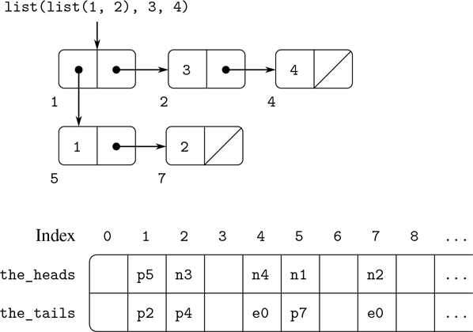

图 5.14：列表的盒指针和内存向量表示法`list(list(1, 2), 3, 4)`。

一个指向数字的指针，比如`n4`，可能由指示数字数据的类型和数字 4 的实际表示组成。 [^(10)](#c5-fn-0010) 为了处理太大而无法在分配给单个指针的固定空间中表示的数字，我们可以使用不同的 bignum 数据类型，为此指针指定一个列表，在其中存储数字的各个部分。 [^(11)](#c5-fn-0011)

一个字符串可能被表示为一个类型化的指针，该指针指定了形成该字符串的打印表示的字符序列。解析器在遇到一个字符串时会构造这样一个序列，字符串连接操作符`+`和产生字符串的原语函数(如`stringify`)会构造这样一个序列。由于我们希望一个字符串的两个实例被`===`识别为“相同的”字符串，并且我们希望`===`是指针相等的简单测试，我们必须确保如果系统两次看到相同的字符串，它将使用相同的指针(指向相同的字符序列)来表示这两个事件。为了实现这一点，系统维护了一个名为字符串池的表，其中包含了它曾经遇到的所有字符串。当系统将要构造一个字符串时，它检查字符串池，看它以前是否见过相同的字符串。如果没有，它将构造一个新的字符串(指向新字符序列的类型化指针)并将这个指针放入字符串池。如果系统以前见过该字符串，它将返回存储在字符串池中的字符串指针。这个用唯一指针替换字符串的过程被称为字符串驻留。

##### 实现原语列表操作

给定上面的表示方案，我们可以用一个或多个原语向量操作来替换寄存器机器的每个“原语”列表操作。我们将使用两个寄存器`the_heads`和`the_tails`来标识内存向量，并假设`vector_ref`和`vector_set`作为原语操作可用。我们还假设指针上的数字操作(例如递增指针、使用一个对指针索引一个向量或者将两个数字相加)只使用类型化指针的索引部分。

例如，我们可以让注册机支持指令

```js
assign(reg[1], list(op("head"), reg(reg[2])))

assign(reg[1], list(op("tail"), reg(reg[2])))
```

如果我们将这些分别实现为

```js
assign(reg[1], list(op("vector_ref"), reg("the_heads"), reg(reg[2])))

assign(reg[1], list(op("vector_ref"), reg("the_tails"), reg(reg[2])))
```

说明

```js
perform(list(op("set_head"), reg(reg[1]), reg(reg[2])))

perform(list(op("set_tail"), reg(reg[1]), reg(reg[2])))
```

被实现为

```js
perform(list(op("vector_set"), reg("the_heads"), reg(reg[1]), reg(reg[2])))

perform(list(op("vector_set"), reg("the_tails"), reg(reg[1]), reg(reg[2])))
```

操作`pair`是通过分配一个未使用的索引并将自变量存储到`the_heads`中的`pair`和该索引向量位置处的`the_tails`来执行的。我们假设有一个特殊的寄存器，`free`，它总是保存一个包含下一个可用索引的指针对，并且我们可以递增该指针的索引部分以找到下一个空闲位置。 [^(12)](#c5-fn-0012) 例如，指令

```js
assign(reg[1], list(op("pair"), reg(reg[2]), reg(reg[3])))
```

是按如下顺序实现的矢量运算: [^(13)](#c5-fn-0013)

```js
perform(list(op("vector_set"),
             reg("the_heads"), reg("free"), reg(reg[2]))),
perform(list(op("vector_set"),
             reg("the_tails"), reg("free"), reg(reg[3]))),
assign(reg[1], reg("free")),
assign("free", list(op("+"), reg("free"), constant(1)))
```

`===`操作

```js
list(op("==="), reg(reg[1]), reg(reg[2]))
```

简单地测试寄存器中所有字段的相等性，谓词如`is_pair`、`is_null`、`is_string`和`is_number`只需要检查类型字段。

##### 实现堆栈

虽然我们的注册机器使用堆栈，但是我们不需要做什么特别的事情，因为堆栈可以用列表来建模。堆栈可以是保存值的列表，由特殊寄存器`the_stack`指向。因此，`save(` 寄存器 `)`可以实现为

```js
assign("the_stack", list(op("pair"), reg(reg), reg("the_stack")))
```

同样，`restore(` reg `)`可以实现为

```js
assign(reg, list(op("head"), reg("the_stack")))
assign("the_stack", list(op("tail"), reg("the_stack")))
```

和`perform(list(op("initialize_stack")))`可以实现为

```js
assign("the_stack", constant(null))
```

这些运算可以根据上面给出的向量运算进一步扩展。然而，在传统的计算机体系结构中，将堆栈分配为单独的向量通常是有利的。那么可以通过递增或递减该向量的索引来完成推入和弹出堆栈。

##### 练习 5.19

画出由产生的列表结构的盒指针表示法和内存向量表示法(如图 5.14：

```js
const x = pair(1, 2);
const y = list(x, x);
```

用`free`指针初始`p1`。`free`的最终值是多少？哪些指针代表`x`和`y`的值？

##### 练习 5.20

为以下功能实现注册机器。假设列表结构内存操作作为机器原语可用。

1.  a. 递归`count_leaves` :

    ```js
    function count_leaves(tree) {     return is_null(tree)            ? 0            : ! is_pair(tree)            ? 1            : count_leaves(head(tree)) +              count_leaves(tail(tree)); }
    ```

2.  b. 递归`count_leaves`带显式计数器:

    ```js
    function count_leaves(tree) {     function count_iter(tree, n) {     return is_null(tree)                ? n                : ! is_pair(tree)                ? n + 1                : count_iter(tail(tree),                             count_iter(head(tree), n));     }     return count_iter(tree, 0); }
    ```

##### 练习 5.21

第 3.3.1 节的练习 3.12 给出了一个`append`函数，它追加两个列表以形成一个新列表，以及一个`append_mutator`函数，它将两个列表拼接在一起。设计一个注册机来实现这些功能。假设列表结构内存操作可作为原语操作。

### 5.3.2 保持无限记忆的错觉

5.3.1 节中概述的表示方法解决了实现列表结构的问题，前提是我们有无限量的内存。有了真正的计算机，我们最终将耗尽构建新对的自由空间。 [^(14)](#c5-fn-0014) 然而，在典型计算中生成的大多数对仅用于保存中间结果。在这些结果被访问之后，这些对就不再需要了——它们是垃圾。例如，计算

```js
accumulate((x, y) => x + y,
           0,
           filter(is_odd, enumerate_interval(0, n)))
```

构造两个列表:枚举和筛选枚举的结果。当累积完成时，不再需要这些列表，并且可以回收分配的内存。如果我们可以安排定期收集所有的垃圾，并且如果这最终以与我们构造新对的速度相同的速度回收内存，我们将保持内存无限量的错觉。

为了回收对，我们必须有一种方法来确定哪些分配的对是不需要的(在某种意义上，它们的内容不再影响计算的未来)。我们将研究的实现这一点的方法被称为垃圾收集。垃圾收集基于以下观察:在基于列表结构存储器的解释中的任何时刻，能够影响计算的未来的唯一对象是那些能够通过从当前在机器寄存器中的指针开始的一些连续的`head`和`tail`操作到达的对象。 [^(15)](#c5-fn-0015) 任何不可访问的存储单元都可以被回收。

有许多方法可以执行垃圾收集。我们在这里要检查的方法叫做停止并复制。基本思想是将内存分成两半:“工作内存”和“空闲内存”当`pair`构建配对时，它会在工作记忆中分配这些配对。当工作内存已满时，我们通过定位工作内存中所有有用的对并将它们复制到空闲内存中的连续位置来执行垃圾收集。(从机器寄存器开始，通过跟踪所有的`head`和`tail`指针来定位有用的对。)因为我们不复制垃圾，所以可能会有额外的空闲内存，我们可以用它来分配新的内存对。此外，工作存储器中什么都不需要，因为其中所有有用的对都已被复制。因此，如果我们交换工作记忆和自由记忆的角色，我们可以继续处理；新的配对将被分配到新的工作内存(旧的空闲内存)中。当这个空间满了，我们可以把有用的内存对复制到新的空闲内存(旧的工作内存)中。 [^(16)](#c5-fn-0016)

##### 停止复制垃圾收集器的实现

我们现在用寄存器机器语言来更详细地描述停止复制算法。我们将假设有一个名为`root`的寄存器，它包含一个指向最终指向所有可访问数据的结构的指针。这可以通过在开始垃圾收集之前将所有机器寄存器的内容存储在由`root`指向的预分配列表中来安排。 [^(17)](#c5-fn-0017) 我们还假设，除了当前的工作内存之外，还有空闲内存可供我们复制有用的数据。当前的工作内存由向量组成，向量的基址在名为`the_heads`和`the_tails`的寄存器中，空闲内存在名为`new_heads`和`new_tails`的寄存器中。

当我们耗尽当前工作内存中的空闲单元时，也就是说，当一个`pair`操作试图将`free`指针递增到内存向量的末尾之外时，垃圾收集被触发。当垃圾收集过程完成时，`root`指针将指向新内存，所有可从`root`访问的对象将被移动到新内存，并且`free`指针将指示新内存中可分配新对的下一个位置。此外，工作内存和新内存的角色将互换——新的内存对将在新内存中构建，从`free`指示的位置开始，并且(先前的)工作内存将可用作下一次垃圾收集的新内存。图 5.15：显示了垃圾收集前后的内存安排。

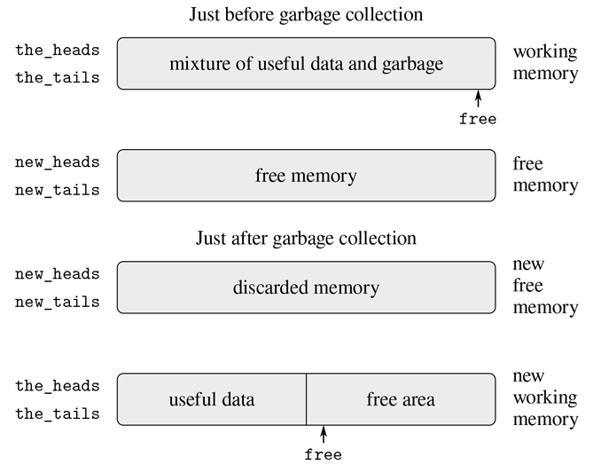

图 5.15：垃圾收集进程对内存的重新配置。

垃圾收集过程的状态通过维护两个指针来控制:`free`和`scan`。这些被初始化为指向新内存的开始。该算法首先将由`root`指向的配对重新定位到新内存的开头。该对被复制，`root`指针被调整以指向新位置，并且`free`指针递增。此外，还会标记该对的旧位置，以表明其内容已被移动。标记过程如下:在`head`位置，我们放置一个特殊标签，表明这是一个已经移动的物体。(这样的物体传统上被称为心碎。) [^(18)](#c5-fn-0018) 在`tail`位置我们放置一个转发地址，它指向对象被移动到的位置。

在重定位根之后，垃圾收集器进入它的基本循环。在算法的每一步，`scan`指针(最初指向重定位的根)指向一对已经被移动到新内存中的对象，但是它们的`head`和`tail`指针仍然指向旧内存中的对象。这些对象都被重新定位，并且`scan`指针递增。为了重新定位一个对象(例如，由我们正在扫描的对象对的`head`指针指示的对象)，我们检查该对象是否已经被移动过(如在对象的`head`位置出现的心碎标签所示)。如果对象还没有被移动，我们将它复制到由`free`指示的位置，更新`free`，在对象的旧位置建立一个破碎的心，并更新指向对象的指针(在这个例子中，我们正在扫描的对的`head`指针)指向新位置。如果对象已经被移动，它的转发地址(在破碎的心脏的`tail`位置找到)被替换为正在被扫描的对中的指针。最终，所有可访问的对象都将被移动和扫描，此时`scan`指针将超过`free`指针，该过程将终止。

我们可以将停止复制算法指定为寄存器机器的一系列指令。重新定位一个对象的基本步骤是由一个叫做`relocate_old_result_in_new`的子程序完成的。这个子例程从一个名为`old`的寄存器中获取它的参数，一个指向要重定位的对象的指针。它重定位指定的对象(在这个过程中递增`free`)，将指向重定位对象的指针放入名为`new`的寄存器中，并通过分支返回到存储在寄存器`relocate_continue`中的入口点。为了开始垃圾收集，在初始化`free`和`scan`之后，我们调用这个子程序来重新定位`root`指针。当`root`的重定位完成后，我们安装新的指针作为新的`root`，并进入垃圾收集器的主循环。

```js
"begin_garbage_collection",
  assign("free", constant(0)),
  assign("scan", constant(0)),
  assign("old", reg("root")),
  assign("relocate_continue", label("reassign_root")),
  go_to(label("relocate_old_result_in_new")),
"reassign_root",
  assign("root", reg("new")),
  go_to(label("gc_loop")),
```

在垃圾收集器的主循环中，我们必须确定是否还有要扫描的对象。我们通过测试`scan`指针是否与`free`指针一致来实现这一点。如果指针相等，那么所有可访问的对象都已经被重新定位，我们转移到`gc_flip`，它清理东西以便我们可以继续被中断的计算。如果还有要扫描的对，我们调用 relocate 子程序来重新定位下一对的`head`(通过将`head`指针放在`old`中)。设置`relocate_continue`寄存器，以便子程序返回更新`head`指针。

```js
"gc_loop",
  test(list(op("==="), reg("scan"), reg("free"))),
  branch(label("gc_flip")),
  assign("old", list(op("vector_ref"), reg("new_heads"), reg("scan"))),
  assign("relocate_continue", label("update_head")),
  go_to(label("relocate_old_result_in_new")),
```

在`update_head`处，我们修改被扫描对的`head`指针，然后继续重新定位对的`tail`。搬迁完成后，我们返回`update_tail`。在重新定位和更新了`tail`之后，我们完成了对该对的扫描，所以我们继续主循环。

```js
"update_head",
  perform(list(op("vector_set"),
               reg("new_heads"), reg("scan"), reg("new"))),
  assign("old", list(op("vector_ref"),
                     reg("new_tails"), reg("scan"))),
  assign("relocate_continue", label("update_tail")),
  go_to(label("relocate_old_result_in_new")),
"update_tail",
  perform(list(op("vector_set"),
               reg("new_tails"), reg("scan"), reg("new"))),
  assign("scan", list(op("+"), reg("scan"), constant(1))),
  go_to(label("gc_loop")),
```

子程序`relocate_old_result_in_new`重定位对象如下:如果要重定位的对象(由`old`指向)不是一对，那么我们返回相同的指针到对象不变(在`new`)。(例如，我们可能正在扫描`head`是数字 4 的一对。如果我们用`n4`表示`head`，如 5.3.1 节所述，那么我们希望“重定位”`head`指针仍然是`n4`。)否则，我们必须执行重新定位。如果要重新定位的对的`head`位置包含一个心碎标签，那么该对实际上已经被移动，所以我们检索转发地址(从心碎的`tail`位置)并在`new`中返回。如果`old`中的指针指向尚未移动的对，那么我们将该对移动到新存储器中的第一个空闲单元(由`free`指向),并通过在旧位置存储心碎标签和转发地址来设置心碎。子程序`relocate_old_result_in_new`使用寄存器`oldht`保存`old`指向的对象的`head`或`tail`。 [^(19)](#c5-fn-0019)

```js
"relocate_old_result_in_new",
  test(list(op("is_pointer_to_pair"), reg("old"))),
  branch(label("pair")),
  assign("new", reg("old")),
  go_to(reg("relocate_continue")),
"pair",
  assign("oldht", list(op("vector_ref"),
                       reg("the_heads"), reg("old"))),
  test(list(op("is_broken_heart"), reg("oldht"))),
  branch(label("already_moved")),
  assign("new", reg("free")),     // new location for pair
  // Update free pointer
  assign("free", list(op("+"), reg("free"), constant(1))),
  // Copy the head and tail to new memory
  perform(list(op("vector_set"),
               reg("new_heads"), reg("new"),
               reg("oldht"))),
  assign("oldht", list(op("vector_ref"),
                      reg("the_tails"), reg("old"))),
  perform(list(op("vector_set"),
               reg("new_tails"), reg("new"),
               reg("oldht"))),
  // Construct the broken heart
  perform(list(op("vector_set"),
               reg("the_heads"), reg("old"),
               constant("broken_heart"))),
  perform(list(op("vector_set"),
               reg("the_tails"), reg("old"),
               reg("new"))),
  go_to(reg("relocate_continue")),
"already_moved",
  assign("new", list(op("vector_ref"),
                     reg("the_tails"), reg("old"))),
  go_to(reg("relocate_continue")),
```

在垃圾收集过程的最后，我们通过交换指针来交换新旧内存的角色:用`new_heads`交换`the_heads`，用`new_tails`交换`the_tails`。下次内存耗尽时，我们将准备好执行另一次垃圾收集。

```js
"gc_flip",
  assign("temp", reg("the_tails")),
  assign("the_tails", reg("new_tails")),
  assign("new_tails", reg("temp")),
  assign("temp", reg("the_heads")),
  assign("the_heads", reg("new_heads")),
  assign("new_heads", reg("temp"))
```

## 5.4 显式控制评估器

在 5.1 节中，我们看到了如何将简单的 JavaScript 程序转换成注册机器的描述。我们现在将在一个更复杂的程序上执行这种转换，即 4 . 1 . 1–4 . 1 . 4 节的元循环求值器，它展示了如何用函数`evaluate`和`apply`来描述 JavaScript 解释器的行为。我们在本节开发的显式控制评估器展示了评估过程中使用的底层函数调用和参数传递机制是如何根据寄存器和堆栈上的操作来描述的。此外，显式控制评估器可以作为 JavaScript 解释器的实现，用与传统计算机的本机语言非常相似的语言编写。评估器可以由 5.2 节的寄存器机器模拟器执行。或者，它可以作为构建 JavaScript 评估器的机器语言实现的起点，甚至可以作为评估 JavaScript 程序的专用机器的起点。图 5.16：显示了这样一个硬件实现:一个充当 Scheme 评估器的硅片，Scheme 是本书最初版本中代替 JavaScript 使用的语言。芯片设计者从与本节描述的评估器相似的寄存器机器的数据路径和控制器规格开始，并使用设计自动化程序来构建集成电路布局。 [^(20)](#c5-fn-0020)

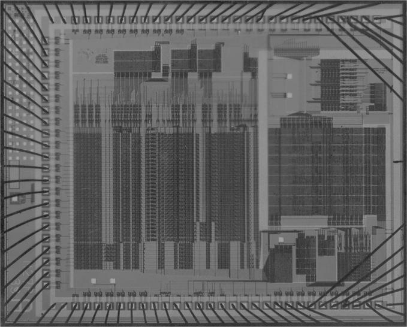

图 5.16：一种方案评估器的硅片实现。

##### 寄存器和操作

在设计显式控制鉴别器时，我们必须指定要在我们的寄存器机器中使用的操作。我们用抽象语法描述了元循环求值器，使用了像`is_literal`和`make_function`这样的函数。在实现寄存器机器时，我们可以将这些功能扩展成基本列表结构存储器操作的序列，并在我们的寄存器机器上实现这些操作。然而，这将使我们的评估器非常长，用细节模糊了基本结构。为了阐明这种表示，我们将把 4.1.2 节中给出的语法函数以及 4.1.3 和 4.1.4 节中给出的用于表示环境和其他运行时数据的函数作为注册机的基本操作。为了完全指定一个可以用低级机器语言编程或用硬件实现的评估器，我们将使用我们在 5.3 节中描述的列表结构实现，用更基本的操作来代替这些操作。

我们的 JavaScript evaluator 寄存器机器包括一个堆栈和七个寄存器:`comp`、`env`、`val`、`continue`、`fun`、`argl`和`unev`。`comp`寄存器用于保存要评估的元件，而`env`包含要执行评估的环境。在评估结束时，`val`包含通过在指定环境中评估组件获得的值。`continue`寄存器用于实现递归，如第 5.1.4 节所述。(评估器需要递归地调用自己，因为评估一个组件需要评估它的子组件。)寄存器`fun`、`argl`和`unev`用于评估函数应用。

我们不会提供数据路径图来显示评估器的寄存器和操作是如何连接的，也不会给出机器操作的完整列表。这些隐含在评估器的控制器中，将详细介绍。

### 5.4.1 调度员及基本评价

评估器的中心元素是从`eval_dispatch`开始的指令序列。这对应于第 4.1.1 节中描述的元圆计算器的`evaluate`功能。当控制器在`eval_dispatch`启动时，它在`env`指定的环境中评估`comp`指定的组件。当评估完成时，控制器将转到存储在`continue`中的入口点，并且`val`寄存器将保存组件的值。与元循环`evaluate`一样，`eval_dispatch`的结构是对要评估的组件的语法类型的案例分析。 [^(21)](#c5-fn-0021)

```js
"eval_dispatch",
  test(list(op("is_literal"), reg("comp"))),
  branch(label("ev_literal")),
  test(list(op("is_name"), reg("comp"))),
  branch(label("ev_name")),
  test(list(op("is_application"), reg("comp"))),
  branch(label("ev_application")),
  test(list(op("is_operator_combination"), reg("comp"))),
  branch(label("ev_operator_combination")),
  test(list(op("is_conditional"), reg("comp"))),
  branch(label("ev_conditional")),
  test(list(op("is_lambda_expression"), reg("comp"))),
  branch(label("ev_lambda")),
  test(list(op("is_sequence"), reg("comp"))),
  branch(label("ev_sequence")),
  test(list(op("is_block"), reg("comp"))),
  branch(label("ev_block")),
  test(list(op("is_return_statement"), reg("comp"))),
  branch(label("ev_return")),
  test(list(op("is_function_declaration"), reg("comp"))),
  branch(label("ev_function_declaration")),
  test(list(op("is_declaration"), reg("comp"))),
  branch(label("ev_declaration")),
  test(list(op("is_assignment"), reg("comp"))),
  branch(label("ev_assignment")),
  go_to(label("unknown_component_type")),
```

##### 评估简单表达式

数字和字符串、名称和 Lambda  表达式没有要计算的子表达式。对于这些，评估器只需将正确的值放入`val`寄存器，并在`continue`指定的入口点继续执行。简单表达式的计算由以下控制器代码执行:

```js
"ev_literal",
  assign("val", list(op("literal_value"), reg("comp"))),
  go_to(reg("continue")),
"ev_name",
  assign("val", list(op("symbol_of_name"), reg("comp"), reg("env"))),
  assign("val", list(op("lookup_symbol_value"),
                     reg("val"), reg("env"))),
  go_to(reg("continue")),
"ev_lambda",
  assign("unev", list(op("lambda_parameter_symbols"), reg("comp"))),
  assign("comp", list(op("lambda_body"), reg("comp"))),
  assign("val", list(op("make_function"),
                     reg("unev"), reg("comp"), reg("env"))),
  go_to(reg("continue")),
```

观察`ev_lambda`如何使用`unev`和`comp`寄存器来保存 Lambda  表达式的参数和主体，以便将它们与`env`中的环境一起传递给`make_function`操作。

##### 条件式

与元循环求值器一样，语法形式是通过有选择地对组件片段求值来处理的。对于条件句，我们必须评估谓词，并根据谓词的值决定是评估结果句还是替代句。

在评估谓词之前，我们保存条件本身，它在`comp`中，以便我们稍后可以提取结果或替代。为了评估谓词表达式，我们将它移动到`comp`寄存器并转到`eval_dispatch`。`env`寄存器中的环境已经是评估谓词的正确环境。然而，我们保存了`env`,因为我们以后需要它来评估结果或替代方案。我们设置了`continue`,以便在谓词被求值后，求值将在`ev_conditional_decide`继续。然而，首先，我们保存旧的值`continue`，我们稍后将需要它，以便返回到正在等待条件值的语句的评估。

```js
"ev_conditional",
  save("comp"), // save conditional for later
save("env"),
save("continue"),
assign("continue", label("ev_conditional_decide")),
assign("comp", list(op("conditional_predicate"), reg("comp"))),
  go_to(label("eval_dispatch")), // evaluate the predicate
```

当我们在评估谓词之后在`ev_conditional_decide`处继续时，我们测试它是真还是假，并且根据结果，在转到`eval_dispatch`之前，将结果或替代放置在`comp`中。 [^(22)](#c5-fn-0022) 注意，这里恢复`env`和`continue`设置`eval_dispatch`拥有正确的环境，并在正确的位置继续接收条件的值。

```js
"ev_conditional_decide",
  restore("continue"),
  restore("env"),
  restore("comp"),
  test(list(op("is_falsy"), reg("val"))),
  branch(label("ev_conditional_alternative")),
"ev_conditional_consequent",
  assign("comp", list(op("conditional_consequent"), reg("comp"))),
  go_to(label("eval_dispatch")),
"ev_conditional_alternative",
  assign("comp", list(op("conditional_alternative"), reg("comp"))),
  go_to(label("eval_dispatch")),
```

##### 序列评估

始于`ev_sequence`的显式控制求值器部分处理语句序列，类似于元循环求值器的`eval_ sequence`函数。

`ev_sequence_next`和`ev_sequence_continue`处的条目形成一个循环，依次评估序列中的每个语句。未评估报表清单保存在`unev`。在`ev_sequence`，我们将待评估的语句序列放在`unev`中。如果序列为空，我们将`val`设置为`undefined`，并通过`ev_sequence_empty`跳转到`continue`。否则我们开始序列评估循环，首先在堆栈上保存`continue`的值，因为`continue`寄存器将用于循环中的局部控制流，并且在语句序列之后继续需要原始值。在评估每个语句之前，我们检查序列中是否还有其他语句需要评估。如果是这样，我们保存剩余的未评估语句(保存在`unev`中)和必须评估这些语句的环境(保存在`env`中),并调用`eval_dispatch`来评估已经放置在`comp`中的语句。在该评估之后，在`ev_sequence_continue`处，两个保存的寄存器被恢复。

序列中的最后一条语句在入口点`ev_sequence_last_statement`以不同的方式处理。因为在这个语句之后没有更多的语句需要评估，所以我们不需要在转到`eval_dispatch`之前保存`unev`或`env`。整个序列的值就是最后一条语句的值，所以在对最后一条语句求值之后，除了在保存于`ev_sequence`的入口点继续之外，没有什么可做的了。我们没有设置`continue`来安排`eval_dispatch`返回到这里，然后从堆栈中恢复`continue`并在那个入口点继续，而是在转到`eval_dispatch`之前从堆栈中恢复`continue`，这样`eval_dispatch`在对语句求值后将在那个入口点继续。

```js
"ev_sequence",
  assign("unev", list(op("sequence_statements"), reg("comp"))),
  test(list(op("is_empty_sequence"), reg("unev"))),
  branch(label("ev_sequence_empty")),
  save("continue"),
"ev_sequence_next",
  assign("comp", list(op("first_statement"), reg("unev"))),
  test(list(op("is_last_statement"), reg("unev"))),
  branch(label("ev_sequence_last_statement")),
  save("unev"),
  save("env"),
  assign("continue", label("ev_sequence_continue")),
  go_to(label("eval_dispatch")),
"ev_sequence_continue",
  restore("env"),
  restore("unev"),
  assign("unev", list(op("rest_statements"), reg("unev"))),
  go_to(label("ev_sequence_next")),
"ev_sequence_last_statement",
  restore("continue"),
  go_to(label("eval_dispatch")),

"ev_sequence_empty",
  assign("val", constant(undefined)),
  go_to(reg("continue")),
```

与元循环求值器中的`eval_sequence`不同，`ev_sequence`不需要检查返回语句是否被求值，从而终止序列求值。该求值器中的“显式控制”允许 return 语句直接跳转到当前函数应用程序的继续，而无需继续序列求值。因此，序列求值不需要考虑返回，甚至不需要知道语言中是否存在返回语句。因为返回语句跳出了序列评估代码，所以不会执行`ev_sequence_continue`处已保存寄存器的恢复。我们将在后面看到 return 语句如何从堆栈中删除这些值。

### 5.4.2 评估功能应用

函数应用由包含函数表达式和自变量表达式的组合来指定。函数表达式是子表达式，其值是函数，而参数表达式是子表达式，其值是函数应该应用到的参数。元循环`evaluate`通过递归调用自身来评估组合的每个元素，然后将结果传递给`apply`来处理应用程序，后者执行实际的函数应用程序。显式控制求值器做同样的事情；这些递归调用由`go_to`指令实现，并使用堆栈来保存寄存器，这些寄存器将在递归调用返回后恢复。在每次调用之前，我们将仔细识别哪些寄存器必须被保存(因为稍后将需要它们的值)。 [^(23)](#c5-fn-0023)

如同在元循环求值器中一样，运算符组合被转换成与运算符相对应的原始函数的应用。这发生在`ev_operator_combination`，它在`comp`就地执行这种转换，并一直到`ev_application`。 [^(24)](#c5-fn-0024)

我们通过计算函数表达式来产生一个函数，这个函数随后将被应用到被计算的自变量表达式，从而开始对应用程序的计算。为了评估函数表达式，我们将它移动到`comp`寄存器并转到`eval_dispatch`。`env`寄存器中的环境已经是评估函数表达式的正确环境。然而，我们保存了`env`,因为我们稍后将需要它来评估参数表达式。我们还将参数表达式提取到`unev`中，并保存在堆栈中。我们设置了`continue`,以便在函数表达式求值后`eval_dispatch`将在`ev_appl_did_function_expression`处恢复。然而，首先，我们保存了旧的值`continue`，它告诉控制器在应用程序之后从哪里继续。

```js
"ev_operator_combination",
  assign("comp", list(op("operator_combination_to_application"),
                      reg("comp"), reg("env"))),
"ev_application",
  save("continue"),
  save("env"),
  assign("unev", list(op("arg_expressions"), reg("comp"))),
  save("unev"),
  assign("comp", list(op("function_expression"), reg("comp"))),
  assign("continue", label("ev_appl_did_function_expression")),
  go_to(label("eval_dispatch")),
```

从评估函数表达式返回后，我们继续评估应用程序的参数表达式，并将结果参数累积在一个列表中，保存在`argl`中。(这类似于对一系列语句的求值，只不过我们收集的是值。)首先我们恢复未赋值的自变量表达式和环境。我们将`argl`初始化为一个空列表。然后，我们将通过计算函数表达式产生的函数分配给`fun`寄存器。如果没有论点表达式，我们直接进入`apply_dispatch`。否则，我们将`fun`保存在堆栈中，并开始参数求值循环: [^(25)](#c5-fn-0025)

```js
"ev_appl_did_function_expression",
  restore("unev"), // the argument expressions
  restore("env"),
  assign("argl", list(op("empty_arglist"))),
  assign("fun", reg("val")), // the function
  test(list(op("is_null"), reg("unev"))),
  branch(label("apply_dispatch")),
  save("fun"),
```

自变量评估循环的每个周期评估`unev`列表中的一个自变量表达式，并将结果累积到`argl`中。为了评估一个参数表达式，我们将它放在`comp`寄存器中，并在设置`continue`之后转到`eval_dispatch`，以便继续执行参数累积阶段。但是首先我们保存到目前为止累积的参数(保存在`argl`中)、环境(保存在`env`中)以及剩余的待求值的参数表达式(保存在`unev`中)。最后一个参数表达式的求值是一个特例，在`ev_appl_last_arg`处理。

```js
"ev_appl_argument_expression_loop",
  save("argl"),
  assign("comp", list(op("head"), reg("unev"))),
  test(list(op("is_last_argument_expression"), reg("unev"))),
  branch(label("ev_appl_last_arg")),
  save("env"),
  save("unev"),
  assign("continue", label("ev_appl_accumulate_arg")),
  go_to(label("eval_dispatch")),
```

当一个参数表达式被求值后，该值被累加到保存在`argl`中的列表中。然后从`unev`中未赋值的自变量表达式列表中删除自变量表达式，自变量求值循环继续。

```js
"ev_appl_accumulate_arg",
  restore("unev"),
  restore("env"),
  restore("argl"),
  assign("argl", list(op("adjoin_arg"), reg("val"), reg("argl"))),
  assign("unev", list(op("tail"), reg("unev"))),
  go_to(label("ev_appl_argument_expression_loop")),
```

最后一个参数表达式的求值方式不同，序列中的最后一条语句也是如此。在转到`eval_dispatch`之前，不需要保存环境或未求值的自变量表达式列表，因为在最后一个自变量表达式求值之后，不再需要它们。因此，我们从求值返回到一个特殊的入口点`ev_appl_accum_last_arg`，它恢复参数列表，累积新的参数，恢复保存的函数，然后执行应用程序。 [^(26)](#c5-fn-0026)

```js
"ev_appl_last_arg",
  assign("continue", label("ev_appl_accum_last_arg")),
  go_to(label("eval_dispatch")),
"ev_appl_accum_last_arg",
  restore("argl"),
  assign("argl", list(op("adjoin_arg"), reg("val"), reg("argl"))),
  restore("fun"),
  go_to(label("apply_dispatch")),
```

自变量求值循环的细节决定了解释器对组合的自变量表达式求值的顺序(例如，从左到右或从右到左—参见练习 3.8)。这个顺序不是由元循环求值器决定的，它从实现它的底层 JavaScript 继承它的控制结构。 [^(27)](#c5-fn-0027) 因为我们使用`ev_appl_argument_expression_loop`中的`head`从`unev`中提取连续的参数表达式，使用`ev_appl_ accumulate_arg`中的`tail`提取其余的参数表达式，所以 explicitcontrol 评估器将按照 ECMAScript 规范的要求，以从左到右的顺序评估组合的参数表达式。

##### 功能应用

入口点`apply_dispatch`对应于元圆计算器的`apply`功能。当我们到达`apply_dispatch`时，`fun`寄存器包含了要应用的函数，`argl`包含了必须应用的求值参数列表。`continue`的保存值(最初传递给`eval_dispatch`并在`ev_application`保存)在堆栈上，它告诉函数应用的结果返回到哪里。当应用程序完成时，控制器转移到由保存的`continue`指定的入口点，应用程序的结果在`val`中。与元循环`apply`一样，有两种情况需要考虑。要应用的函数要么是原语函数，要么是复合函数。

```js
"apply_dispatch",
  test(list(op("is_primitive_function"), reg("fun"))),
  branch(label("primitive_apply")),
  test(list(op("is_compound_function"), reg("fun"))),
  branch(label("compound_apply")),
  go_to(label("unknown_function_type")),
```

我们假设每个原语都被实现为从`argl`获得其参数，并将其结果放入`val`。为了指定机器如何处理原语，我们必须提供一系列控制器指令来实现每个原语，并安排`primitive_apply`分派给由`fun`的内容标识的原语的指令。由于我们对评估过程的结构感兴趣，而不是原语的细节，我们将使用一个`apply_primitive_function`操作，将 fun 中的函数应用到`argl`中的参数。为了用 5.2 节的模拟器模拟评估器，我们使用了函数`apply_primitive_function`，它调用底层 JavaScript 系统来执行应用程序，就像我们在 4.1.1 节对元循环评估器所做的一样。计算完原始应用程序的值后，我们恢复`continue`并转到指定的入口点。

```js
"primitive_apply",
  assign("val", list(op("apply_primitive_function"),
                     reg("fun"), reg("argl"))),
  restore("continue"),
  go_to(reg("continue")),
```

标记为`compound_apply`的指令序列指定了复合函数的应用。为了应用一个复合函数，我们以类似于在元循环求值器中所做的方式进行。我们构建一个框架，将函数的参数绑定到实参，使用这个框架来扩展函数所承载的环境，并在这个扩展的环境中评估函数体。

此时，复合函数在寄存器`fun`中，它的参数在`argl`中。我们将函数的参数提取到`unev`，将其环境提取到`env`。然后，我们将`env`中的环境替换为通过将参数绑定到给定参数来扩展它而构建的环境。然后我们将函数体提取到`comp`中。自然的下一步是恢复保存的`continue`并继续进行`eval_dispatch`以评估主体并转到恢复的延续部分，结果在`val`中，就像对序列的最后一条语句所做的那样。但是有一个并发症！

复杂之处有两个方面。一个是在对主体求值的任何时候，一个 return 语句可能需要函数返回返回表达式的值作为主体的值。但是 return 语句可以任意深地嵌套在主体中；因此，遇到 return 语句时的堆栈不一定是函数返回所需的堆栈。为返回调整堆栈的一种方法是在堆栈上放置一个标记标记,返回代码可以找到这个标记。这由`push_marker_to_stack`指令实现。然后，在计算返回表达式之前，返回代码可以使用`revert_stack_to_marker`指令将堆栈恢复到标记所指示的位置。 [^(28)](#c5-fn-0028)

复杂的另一方面是，如果对主体的评估在没有执行 return 语句的情况下终止，那么主体的值必须是`undefined`。为了处理这个问题，我们设置了`continue`寄存器指向入口点`return_undefined`，然后转到`eval_dispatch`来评估身体。如果在评估身体期间没有遇到返回声明，身体的评估将在`return_undefined`继续。

```js
"compound_apply",
  assign("unev", list(op("function_parameters"), reg("fun"))),
  assign("env", list(op("function_environment"), reg("fun"))),
  assign("env", list(op("extend_environment"),
                     reg("unev"), reg("argl"), reg("env"))),
  assign("comp", list(op("function_body"), reg("fun"))),
  push_marker_to_stack(),
  assign("continue", label("return_undefined")),
  go_to(label("eval_dispatch")),
```

在解释器中，`env`寄存器被赋予新值的地方只有`compound_apply`和`ev_block`(第 5.4.3 节)。就像在元循环求值器中一样，函数体求值的新环境是由函数携带的环境以及参数列表和相应的要绑定的名称列表构成的。

当在`ev_return`评估一个返回语句时，我们使用`revert_stack_` `to_marker`指令，通过从堆栈中删除所有值(包括标记)将堆栈恢复到函数调用开始时的状态。因此，`restore("continue")`将恢复在`ev_application`保存的函数调用的延续。然后我们继续评估返回表达式，其结果将被放入`val`中，因此当我们在评估返回表达式之后继续时，它将是从函数返回的值。

```js
"ev_return",
  revert_stack_to_marker(),
  restore("continue"),
  assign("comp", list(op("return_expression"), reg("comp"))),
  go_to(label("eval_dispatch")),
```

如果在函数体评估期间没有遇到返回语句，评估在`return_undefined`继续，这是在`compound_apply`建立的延续。为了从函数中返回`undefined`，我们将`undefined`放入`val`并转到在`ev_application`放入堆栈的入口点。然而，在我们从堆栈中恢复该延续之前，我们必须移除在`compound_apply`保存的标记。

```js
"return_undefined",
  revert_stack_to_marker(),
  restore("continue"),
  assign("val", constant(undefined)),
  go_to(reg("continue")),
```

##### Return 语句和尾部递归

在第一章中，我们说过由函数描述的过程，例如

```js
function sqrt_iter(guess, x) {
    return is_good_enough(guess, x)
           ? guess
           : sqrt_iter(improve(guess, x), x);
}
```

是一个迭代的过程。尽管该函数在语法上是递归的(根据自身定义)，但从逻辑上讲，求值器没有必要在从一个对`sqrt_iter`的调用传递到下一个调用时保存信息。 [^(29)](#c5-fn-0029) 能够在函数继续调用自身时执行`sqrt_iter`之类的函数而不需要增加存储的求值器被称为尾递归求值器。

第四章中的元循环实现不是尾递归的。它将 return 语句实现为返回值对象的构造函数，该对象包含要返回的值，并检查函数调用的结果以查看它是否是这样的对象。如果函数体的求值产生一个返回值对象，那么函数的返回值就是那个对象的内容；否则，返回值是`undefined`。返回值对象的构造和函数调用结果的最终检查都是延迟操作，这会导致堆栈上信息的累积。

我们的显式控制求值器是尾递归的，因为它不需要包装返回值进行检查，从而避免了延迟操作的堆栈构建。在`ev_return`，为了评估计算函数返回值的表达式，我们直接转移到`eval_dispatch`，在函数调用之前，堆栈上什么都没有。我们通过使用`revert_stack_to_marker`撤销函数对堆栈的任何保存(这是无用的，因为我们正在返回)来实现这一点。然后，不是安排`eval_dispatch`返回到这里，然后然后从堆栈中恢复`continue`并在该入口点继续，而是在转到`eval_dispatch`之前从堆栈中恢复`continue`，以便在对表达式求值后`eval_dispatch`将在该入口点继续。最后，我们转移到`eval_dispatch`而不在堆栈上保存任何信息。因此，当我们继续计算一个返回表达式时，堆栈与调用我们将要计算其返回值的函数之前的堆栈相同。因此，对返回表达式求值——即使它是一个函数调用(如在`sqrt_iter`中，条件表达式简化为对`sqrt_iter`的调用)——也不会导致任何信息在堆栈上累积。 [^(30)](#c5-fn-0030)

如果我们没有考虑利用这样一个事实，即在计算一个返回表达式时，不必保留堆栈上的无用信息，我们可能会采取直接的方法来计算返回表达式，返回来恢复堆栈，最后在等待函数调用结果的入口点继续:

```js
"ev_return",  // alternative implementation: not tail-recursive
  assign("comp", list(op("return_expression"), reg("comp"))),
  assign("continue", label("ev_restore_stack")),
  go_to(label("eval_dispatch")),
"ev_restore_stack",
revert_stack_to_marker(),     // undo saves in current function
restore("continue"),          // undo save at ev_application
  go_to(reg("continue")),
```

这看起来像是对我们之前的 return 语句求值代码的一个小改动:唯一的区别是我们将撤销任何寄存器保存延迟到 return 表达式求值之后。解释器仍然会给任何表达式相同的值。但是这种改变对于尾部递归实现是致命的，因为我们现在必须在评估返回表达式之后返回，以便撤销(无用的)寄存器保存。这些额外的节省将在一个函数调用嵌套中累积。因此，像`sqrt_iter`这样的过程将需要与迭代次数成比例的空间，而不是需要恒定的空间。这种差异可能非常显著。例如，使用尾部递归，可以仅使用函数调用和返回机制来表达无限循环:

```js
function count(n) {
    display(n);
    return count(n + 1);
}
```

如果没有尾部递归，这样的函数最终会耗尽堆栈空间，表达真正的迭代将需要一些控制机制，而不是函数调用。

注意，我们的 JavaScript 实现需要使用`**return**`来实现尾递归。因为寄存器保存的撤销发生在`ev_return`，从上面的`count`函数中移除`**return**`将导致它最终耗尽堆栈空间。这解释了在第 4 章的无限驱动循环中使用`**return**`的原因。

##### 练习 5.22

解释如果`**return**`从`count`中移除，堆叠会如何形成:

```js
function count(n) {
    display(n);
    count(n + 1);
}
```

##### 练习 5.23

通过在`compound_apply`使用`save`在堆栈上存储一个特殊的标记值来实现`push_marker_to_stack`的等效。在`ev_return`和`return_undefined`实现等同于`revert_stack_ to_marker`的循环，重复执行`restore`直到到达标记。请注意，这将需要将一个值恢复到保存该值的寄存器之外的寄存器中。(尽管我们小心地避免在我们的评估器中出现这种情况，但我们的堆栈实现实际上允许这样做。参见练习 5.10。)这是必要的，因为从堆栈弹出的唯一方法是恢复到寄存器。提示:您需要创建一个唯一的常量作为标记，例如用`**const** marker = list("marker")`。因为`list`创建了一个新的 pair，所以它不能`===`到栈上的任何其他东西。

##### 练习 5.24

按照第 5.2.3 节中`save`和`restore`的执行，将`push_marker_to_stack`和`revert_stack_to_marker`作为套准机指令执行。添加函数`push_marker`和`pop_marker`来访问堆栈，镜像 5.2.1 节中`push`和`pop`的实现。请注意，您不需要在堆栈中实际插入一个标记。相反，您可以向堆栈模型添加一个局部状态变量，以跟踪每个`push_marker_to_stack`之前最后一个`save`的位置。如果你选择在堆栈上放一个标记，参见练习 5.23 中的提示。

### 5.4.3 阻止、转让和声明

##### 阻碍

块的主体相对于当前环境进行评估，当前环境由一个将所有本地名称绑定到值`"*unassigned*"`的框架进行扩展。我们暂时使用`val`寄存器来保存块中声明的所有变量的列表，该列表由`scan_out_declarations`从第 4.1.1 节获得。功能`scan_out_declarations`和`list_of_unassigned`被假定为机器操作可用。 [^(31)](#c5-fn-0031)

```js
"ev_block",
  assign("comp", list(op("block_body"), reg("comp"))),
  assign("val", list(op("scan_out_declarations"), reg("comp"))),

save("comp"), // so we can use it to temporarily hold *unassigned* values
  assign("comp", list(op("list_of_unassigned"), reg("val"))),
  assign("env", list(op("extend_environment"),
                     reg("val"), reg("comp"), reg("env"))),
  restore("comp"), // the block body
  go_to(label("eval_dispatch")),
```

##### 转让和声明

赋值由`ev_assignment`处理，从`eval_dispatch`到达`comp`中的赋值表达式。`ev_assignment`处的代码首先计算表达式的值部分，然后在环境中安装新值。假设功能`assign_symbol_value`可作为机器操作使用。

```js
"ev_assignment",
  assign("unev", list(op("assignment_symbol"), reg("comp"))),
  save("unev"), // save variable for later
  assign("comp", list(op("assignment_value_expression"), reg("comp"))),
  save("env"),
  save("continue"),
  assign("continue", label("ev_assignment_install")),
  go_to(label("eval_dispatch")), // evaluate assignment value
"ev_assignment_install",
  restore("continue"),
  restore("env"),
  restore("unev"),
  perform(list(op("assign_symbol_value"),
               reg("unev"), reg("val"), reg("env"))),
  go_to(reg("continue")),
```

变量和常量的声明以类似的方式处理。注意，赋值的值是被赋值的值，而声明的值是`undefined`。这通过在继续之前将`val`设置为`undefined`来处理。和在元循环求值器中一样，我们将函数声明转换为常量声明，常量声明的值表达式是 Lambda  表达式。这发生在`ev_function_declaration`处，这使得转换在`comp`处就位，并一直进行到`ev_declaration`。

```js
"ev_function_declaration",
  assign("comp",
         list(op("function_decl_to_constant_decl"), reg("comp"))),
"ev_declaration",
  assign("unev", list(op("declaration_symbol"), reg("comp"))),
  save("unev"), // save declared name
  assign("comp",
         list(op("declaration_value_expression"), reg("comp"))),
  save("env"),
  save("continue"),
  assign("continue", label("ev_declaration_assign")),
  go_to(label("eval_dispatch")), // evaluate declaration value
"ev_declaration_assign",
  restore("continue"),
  restore("env"),
  restore("unev"),
  perform(list(op("assign_symbol_value"),
               reg("unev"), reg("val"), reg("env"))),
  assign("val", constant(undefined)),
  go_to(reg("continue")),
```

##### 练习 5.25

如练习 4.7 所示，通过将求值器转换为函数`while_loop`的应用程序，扩展求值器以处理 while 循环。您可以将函数`while_loop`的声明粘贴到用户程序的前面。你可能会“欺骗”假设语法转换器`while_to_application`可以作为机器操作来使用。参考练习 4.7，讨论如果 while 循环中允许使用 return、break 和 continue 语句，这种方法是否有效。如果没有，如何修改显式控制计算器来运行包含这些语句的 while 循环程序呢？

##### 练习 5.26

根据第 4.2 节的惰性求值程序，修改求值程序，使其使用正常顺序求值。

### 5.4.4 运行评估器

随着显式控制鉴定器的实现，我们从第一章开始的研究已经接近尾声，在这一章中，我们已经连续探索了更精确的鉴定过程模型。我们从相对非正式的替代模型开始，然后在第 3 章扩展到环境模型，这使我们能够处理状态和变化。在第 4 章的元循环求值器中，我们使用 JavaScript 本身作为一种语言，使组件求值过程中构建的环境结构更加明确。现在，对于注册机，我们已经仔细研究了求值器的存储管理、参数传递和控制机制。在每一个新的描述层次上，我们都必须提出问题并解决在以前不太精确的评估处理中不明显的模糊之处。为了理解显式控制评估器的行为，我们可以模拟它并监控它的性能。

我们将在评估机中安装一个驱动循环。这起到了第 4.1.4 节的`driver_loop`功能的作用。评估员会反复打印一个提示，读取一个程序，通过去`eval_dispatch`评估程序，并打印结果。如果在提示符下没有输入任何内容，我们跳转到标签`evaluator_done`，这是控制器中的最后一个入口点。以下指令构成了显式控制评估器控制器序列的开始: [^(32)](#c5-fn-0032)

```js
"read_evaluate_print_loop",
  perform(list(op("initialize_stack"))),
  assign("comp", list(op("user_read"),
                      constant("EC-evaluate input:"))),
  assign("comp", list(op("parse"), reg("comp"))),
  test(list(op("is_null"), reg("comp"))),
  branch(label("evaluator_done")),
  assign("env", list(op("get_current_environment"))),
  assign("val", list(op("scan_out_declarations"), reg("comp"))),
  save("comp"),    // so we can use it to temporarily hold *unassigned* values
  assign("comp", list(op("list_of_unassigned"), reg("val"))),
  assign("env", list(op("extend_environment"),
                     reg("val"), reg("comp"), reg("env"))),
  perform(list(op("set_current_environment"), reg("env"))),
  restore("comp"), // the program
  assign("continue", label("print_result")),
  go_to(label("eval_dispatch")),
"print_result",
  perform(list(op("user_print"),
               constant("EC-evaluate value:"), reg("val"))),
  go_to(label("read_evaluate_print_loop")),
```

我们将当前环境(最初是全局环境)存储在变量`current_environment`中，并在每次循环时更新它，以记住过去的声明。操作`get_current_environment`和`set_current_ environment`简单地获取并设置这个变量。

```js
let current_environment = the_global_environment;
function get_current_environment() {
    return current_environment;
}
function set_current_environment(env) {
    current_environment = env;
}
```

当我们遇到函数中的错误时(如`apply_dispatch`处显示的“未知函数类型”错误)，我们打印一条错误消息并返回到驱动程序循环。 [^(33)](#c5-fn-0033)

```js
"unknown_component_type",
  assign("val", constant("unknown syntax")),
  go_to(label("signal_error")),

"unknown_function_type",
  restore("continue"), // clean up stack (from apply_dispatch)
  assign("val", constant("unknown function type")),
  go_to(label("signal_error")),

"signal_error",
  perform(list(op("user_print"),
               constant("EC-evaluator error:"), reg("val"))),
  go_to(label("read_evaluate_print_loop")),
```

出于模拟的目的，我们每次通过驱动程序循环初始化堆栈，因为在错误(例如未声明的名称)中断评估后，它可能不为空。 [^(34)](#c5-fn-0034)

如果我们将 5 . 4 . 1–5 . 4 . 4 节中介绍的所有代码片段结合起来，我们可以创建一个评估机模型，我们可以使用 5.2 节中的寄存器机器模拟器运行该模型。

```js
const eceval = make_machine(list("comp", "env", "val", "fun",
                                 "argl", "continue", "unev"),
                            eceval_operations,
                            list("read_evaluate_print_loop",
                                 〈entire machine controller as given above〉
                                 "evaluator_done"));
```

我们必须定义 JavaScript 函数来模拟评估器作为原语使用的操作。这些是我们在 4.1 节中用于元循环求值器的相同函数，以及在 5.4 节的脚注中定义的几个附加函数。

```js
const eceval_operations = list(list("is_literal", is_literal),
                               〈complete list of operations for eceval machine〉);
```

最后，我们可以初始化全局环境并运行评估器:

```js
const the_global_environment = setup_environment();
start(eceval);
```

EC-评估输入:

```js
function append(x, y) {
    return is_null(x)
           ? y
           : pair(head(x), append(tail(x), y));
}
```

EC-评估值:

```js
undefined
```

EC-评估输入:

```js
append(list("a", "b", "c"), list("d", "e", "f"));
```

EC-评估值:

["a "、["b "、["c "、["d "、["e "、["f "，null]]]]]

当然，用这种方式评估程序要比我们直接将它们输入到 JavaScript 中花费更长的时间，因为涉及到多层次的模拟。我们的程序由显式控制评估机评估，它由 JavaScript 程序模拟，JavaScript 程序本身由 JavaScript 解释器评估。

##### 监督评估者的表现

模拟可以成为指导评价者实施的有力工具。仿真不仅使探索寄存器机器设计的变化变得容易，而且使监控仿真评估器的性能变得容易。例如，性能的一个重要因素是评估器使用堆栈的效率。我们可以观察评估各种程序所需的堆栈操作的数量，方法是用收集堆栈使用统计数据的模拟器版本定义评估器寄存器机器(5.2.4 节)，并在评估器的`print_result`入口点添加一条指令来打印统计数据:

```js
"print_result",
  perform(list(op("print_stack_statistics"))), // added instruction
  // rest is same as before
  perform(list(op("user_print"),
               constant("EC-evaluate value:"), reg("val"))),
  go_to(label("read_evaluate_print_loop")),
```

与评估者的交互现在看起来像这样:

欧盟评估输入:

```js
function factorial (n) {
    return n === 1
           ? 1
           : factorial(n - 1) * n;
}
```

总推送数= 4

最大深度= 3

EC-评估值:

```js
undefined
```

EC-评估输入:

```js
factorial(5);
```

总推送数= 151

最大深度= 28

EC-评估值:

120

请注意，求值器的驱动程序循环会在每次交互开始时重新初始化堆栈，因此打印的统计数据将只涉及用于计算前一个程序的堆栈操作。

##### 练习 5.27

使用受监控的堆栈来探究求值器的尾递归属性(第 5.4.2 节)。启动评估器，并根据第 1.2.1 节定义迭代`factorial`函数:

```js
function factorial(n) {
    function iter(product, counter) {
    return counter > n
           ? product
           : iter(counter * product,
                  counter + 1);
    }
    return iter(1, 1);
}
```

使用 n 的一些小值运行函数。记录最大堆垛深度和计算 n 所需的推动次数！对于这些值中的每一个。

1.  a. 你会发现评估 n 所需的最大深度！独立于 n 。深度是多少？
2.  b. 根据您的数据确定一个公式，根据 n 计算用于评估 n 的推送操作总数！对于任何一个 n 1。注意，所使用的操作次数是 n 的线性函数，因此由两个常数决定。

##### 练习 5.28

为了与练习 5.27 进行比较，探究以下递归计算阶乘的函数的行为:

```js
function factorial(n) {
    return n === 1
           ? 1
           : factorial(n - 1) * n;
}
```

通过对受监控的堆栈运行该函数，确定作为 n 的函数的堆栈的最大深度和用于评估 n 的总推送次数！用于 n 1。(同样，这些函数将是线性的。)根据 n 用适当的表达式填写下表，总结你的实验:

|  | 最大深度 | 推送次数 |
| 递归阶乘 |  |  |
| 迭代阶乘 |  |  |

最大深度是评估者在执行计算时使用的空间量的度量，推送的次数与所需的时间密切相关。

##### 练习 5.29

如第 5.4.2 节所述，通过更改`ev_return`修改求值器的定义，使求值器不再是尾递归的。重新运行练习 5.27 和 5.28 中的实验，以证明两个版本的`factorial`函数现在都需要随其输入线性增长的空间。

##### 练习 5.30

监控树递归斐波那契计算中的堆栈操作:

```js
function fib(n) {
    return n < 2 ? n : fib(n - 1) + fib(n - 2);
}
```

1.  a. 对于 n ≥ 2，计算 Fib( n )所需的最大堆栈深度，用 n 给出一个公式。提示:在第 1.2.2 节中，我们认为这个进程使用的空间随着 n 线性增长。
2.  b. 给出一个公式，用于计算 n ≥ 2 的 Fib( n )的总推送次数。您应该会发现推送的次数(与所用的时间密切相关)随着 n 成指数增长。提示:设 S ( n )为计算 Fib 时使用的推送次数( n )。你应该可以论证，有一个公式是用 S(n–1)S(n–2)，和一些独立于 n 的固定“开销”常数 k 来表示 S ( n )。给出公式，并说出什么是 k 。然后证明 S ( n )可以表示为 aFib(n+1)+b 并给出 a 和 b 的值。

##### 练习 5.31

我们的评估器目前只捕捉和通知两种错误——未知的组件类型和未知的函数类型。其他错误会将我们带出评估器读取-评估-打印循环。当我们使用注册机模拟器运行评估器时，这些错误会被底层的 JavaScript 系统捕获。这类似于当用户程序出错时计算机崩溃。让一个真正的错误系统工作是一个大工程，但是很值得努力去理解这里涉及到什么。

1.  a. 在评估过程中发生的错误，例如试图访问未绑定名称，可以通过更改查找操作来捕获，使其返回可分辨的条件代码，该代码不能是任何用户名的可能值。评估器可以测试该条件代码，然后执行必要的操作，转到`signal_error`。找到评估器中需要进行这种更改的所有地方，并修复它们。这是大量的工作。
2.  b. 更糟糕的是处理错误的问题，这些错误是通过应用原语函数发出的，例如试图除以零或试图提取字符串的`head`。在专业编写的高质量系统中，每个原语应用程序都作为原语的一部分进行安全性检查。例如，每个对`head`的调用可以首先检查参数是否是一对。如果参数不是一对，应用程序将向评估器返回一个不同的条件代码，然后评估器将报告失败。我们可以在我们的寄存器机器模拟器中通过让每个原语函数检查适用性并在失败时返回一个适当的区分条件代码来安排这一点。然后，评估器中的`primitive_apply`代码可以检查条件代码，并在必要时转到`signal_error`。建立这种结构并使其发挥作用。这是一项重大工程。

## 5.5 编译

5.4 节的显式控制计算器是一个寄存器机器，它的控制器解释 JavaScript 程序。在这一节中，我们将看到如何在控制器不是 JavaScript 解释器的注册机器上运行 JavaScript 程序。

显式控制评估机是通用的——它可以执行任何可以用 JavaScript 描述的计算过程。评估器的控制器协调使用其数据路径来执行所需的计算。因此，评估器的数据路径是通用的:给定适当的控制器，它们足以执行我们想要的任何计算。 [^(36)](#c5-fn-0036)

商用通用计算机是围绕寄存器和操作的集合组织的寄存器机器，这些寄存器和操作构成了一组高效且方便的通用数据路径。通用机器的控制器是我们一直在使用的寄存器机器语言的解释器。这种语言被称为机器的母语，或者简称为机器语言。用机器语言编写的程序是使用机器数据路径的指令序列。例如，显式控制求值器的指令序列可以被认为是通用计算机的机器语言程序，而不是专用解释机的控制器。

有两种常用的策略来弥补高级语言和寄存器机器语言之间的差距。显式控制评估器说明了解释的策略。用机器的本地语言编写的解释器配置机器执行用可能不同于执行评估的机器的本地语言的语言(称为源语言)编写的程序。源语言的原语函数被实现为用给定机器的母语编写的子程序库。要解释的程序(称为源程序)被表示为数据结构。解释器遍历这个数据结构，分析源程序。当它这样做时，它通过从库中调用适当的原语子例程来模拟源程序的预期行为。

在本节中，我们将探讨编译的替代策略。给定源语言和机器的编译器将源程序翻译成用机器本地语言编写的等价程序(称为目标程序)。我们在本节中实现的编译器把用 JavaScript 编写的程序翻译成使用显式控制求值器机器的数据路径执行的指令序列。 [^(37)](#c5-fn-0037)

与解释相比，编译可以大大提高程序执行的效率，这一点我们将在下面的编译器概述中解释。另一方面，解释程序为交互式程序开发和调试提供了更强大的环境，因为正在执行的源程序在运行时可以被检查和修改。此外，因为存在整个原语库，所以可以在调试期间构造新程序并将其添加到系统中。

鉴于编译和解释的互补优势，现代程序开发环境追求混合策略。这些系统通常被组织成解释函数和编译函数可以相互调用。这使得程序员能够编译假定要被调试的那些程序部分，从而获得编译的效率优势，同时为处于交互开发和调试的流动中的那些程序部分保留解释执行模式。在 5.5.7 节中，在我们实现了编译器之后，我们将展示如何将它与我们的解释器连接起来，以产生一个集成的解释器-编译器系统。

##### 编译器概述

我们的编译器很像我们的解释器，无论是在结构上还是在它执行的功能上。因此，编译器用于分析组件的机制将类似于解释器所使用的机制。此外，为了使编译和解释的代码易于接口，我们将设计编译器来生成遵循与解释器相同的寄存器使用惯例的代码:环境将保存在`env`寄存器中，参数列表将在`argl`中累积，要应用的函数将在`fun`中，函数将在`val`中返回它们的答案，函数应该返回的位置将保存在`continue`中。一般来说，编译器将源程序翻译成目标程序，目标程序执行的寄存器操作与解释器在评估同一源程序时执行的寄存器操作基本相同。

这个描述提出了一个实现基本编译器的策略:我们以解释器同样的方式遍历组件。当我们遇到解释器在评估组件时要执行的寄存器指令时，我们不执行该指令，而是将其累加到一个序列中。产生的指令序列将是目标代码。观察编译相对于解释的效率优势。每次解释器评估一个组件时——例如，`f(96, 22)`——它执行的工作是对组件进行分类(发现这是一个函数应用程序)并测试自变量表达式列表的末尾(发现有两个自变量表达式)。使用编译器，组件只分析一次，即在编译时生成指令序列。编译器生成的目标代码只包含评估函数表达式和两个参数表达式、汇编参数列表以及将函数(在`fun`中)应用于参数(在`argl`中)的指令。

这是我们在第 4.1.7 节的分析评估器中实现的同类优化。但是在编译的代码中还有进一步提高效率的机会。当解释器运行时，它遵循一个必须适用于语言中任何组件的过程。相比之下，编译代码的给定片段意味着执行一些特定的组件。这可以产生很大的不同，例如在使用堆栈来保存寄存器时。当解释器评估一个组件时，它必须为任何意外情况做好准备。在评估一个子组件之前，解释器保存所有以后需要的寄存器，因为子组件可能需要任意评估。另一方面，编译器可以利用它正在处理的特定组件的结构来生成代码，从而避免不必要的堆栈操作。

作为一个恰当的例子，考虑应用程序`f(96, 22)`。在解释器评估应用程序的函数表达式之前，它通过保存包含自变量表达式和环境的寄存器来为这种评估做准备，稍后将需要它们的值。然后解释器对函数表达式求值以获得`val`中的结果，恢复保存的寄存器，最后将结果从`val`移动到`fun`。然而，在我们正在处理的特定表达式中，函数表达式的名字是`f`，它的求值是由机器操作`lookup_symbol_value`完成的，它不改变任何寄存器。我们在本节中实现的编译器将利用这一事实，并使用指令生成计算函数表达式的代码

```js
assign("fun",
       list(op("lookup_symbol_value"), constant("f"), reg("env")))
```

其中`lookup_symbol_value`的参数是在编译时从解析器对`f(96, 22)`的表示中提取的。该代码不仅避免了不必要的保存和恢复，还将查找值直接分配给`fun`，而解释器将在`val`中获得结果，然后将其移动到`fun`。

编译器还可以优化对环境的访问。分析完代码后，编译器可以知道特定名称的值将位于哪个帧中，并直接访问该帧，而不是执行`lookup_ symbol_value`搜索。我们将在 5.5.6 节讨论如何实现这样的词法寻址。然而，在此之前，我们将关注上面描述的那种寄存器和堆栈优化。编译器可以执行许多其他优化，例如“内嵌”编码原语操作，而不是使用通用的`apply`机制(参见练习 5.41)；但是这里就不强调这些了。我们在这一节的主要目标是在一个简化的(但仍然有趣的)上下文中说明编译过程。

### 5.5.1 编译器的结构

在 4.1.7 节中，我们修改了最初的元循环解释器，将分析与执行分开。我们分析了每个组件，以产生一个执行函数，该函数将环境作为参数，并执行所需的操作。在我们的编译器中，我们将进行本质上相同的分析。然而，我们不是生成执行函数，而是生成由我们的寄存器机器运行的指令序列。

函数`compile`是编译器中的顶级调度。它对应于 4.1.1 节的`evaluate`函数、4.1.7 节的`analyze`函数和 5.4.1 节的显式控制求值器的`eval_dispatch`入口点。编译器和解释器一样，使用 4.1.2 节中定义的组件语法函数。 [^(39)](#c5-fn-0039) 函数`compile`对待编译组件的语法类型进行用例分析。对于每种类型的组件，它会分派给一个专门的代码生成器:

```js
function compile(component, target, linkage) {
    return is_literal(component)
           ? compile_literal(component, target, linkage)
           : is_name(component)
           ? compile_name(component, target, linkage)
           : is_application(component)
           ? compile_application(component, target, linkage)
           : is_operator_combination(component)
           ? compile(operator_combination_to_application(component),
                     target, linkage)
           : is_conditional(component)
           ? compile_conditional(component, target, linkage)
           : is_lambda_expression(component)
           ? compile_lambda_expression(component, target, linkage)
           : is_sequence(component)
           ? compile_sequence(sequence_statements(component),
                              target, linkage)
           : is_block(component)
           ? compile_block(component, target, linkage)
           : is_return_statement(component)
           ? compile_return_statement(component, target, linkage)
           : is_function_declaration(component)
           ? compile(function_decl_to_constant_decl(component),
                     target, linkage)
           : is_declaration(component)
           ? compile_declaration(component, target, linkage)
           : is_assignment(component)
           ? compile_assignment(component, target, linkage)
           : error(component, "unknown component type – compile");
}
```

##### 目标和联系

除了要编译的组件之外，函数`compile`和它调用的代码生成器还接受两个参数。有一个目标，指定编译后的代码要返回组件值的寄存器。还有一个链接描述符，它描述了组件编译产生的代码在完成执行后应该如何进行。链接描述符可能要求代码执行以下三项操作之一:

*   继续执行序列中的下一条指令(由链接描述符`"next"`指定)，
*   作为从函数调用返回的一部分，跳转到`continue`寄存器的当前值(由链接描述符`"return"`指定)，或者
*   跳转到一个命名的入口点(这是通过使用指定的标签作为链接描述符来指定的)。

例如，用`val`寄存器的目标和`"next"`的链接编译文字`5`应该会产生指令

```js
assign("val", constant(5))
```

用链接`"return"`编译相同的表达式应该会产生指令

```js
assign("val", constant(5)),
go_to(reg("continue"))
```

在第一种情况下，将继续执行序列中的下一条指令。在第二种情况下，我们将跳转到存储在`continue`寄存器中的任何入口点。在这两种情况下，表达式的值将被放入目标`val`寄存器。我们的编译器在编译 return 语句的返回表达式时使用了`"return"`链接。正如在显式控制计算器中一样，从函数调用返回分三步进行:

1.  1。将堆栈恢复到标记并恢复`continue`(保存在函数调用开始时设置的延续)
2.  2。计算返回值并放入`val`
3.  3。跳到`continue`的入口点

return 语句的编译会显式生成用于还原堆栈和恢复`continue`的代码。使用 target `val`和 linkage `"return"`编译返回表达式，以便计算返回值的生成代码将返回值放在`val`中，并通过跳转到`continue`结束。

##### 指令序列和堆栈使用

每个代码生成器返回一个指令序列，包含它为组件生成的目标代码。复合组件的代码生成是通过组合子组件的简单代码生成器的输出来完成的，正如复合组件的评估是通过评估子组件来完成的一样。

组合指令序列的最简单方法是一个名为`append_instruction_sequences`的函数，它将两个要顺序执行的指令序列作为参数。它追加它们并返回组合序列。也就是说，如果 seq1 和 seq2 是指令序列，那么求值

```js
append_instruction_sequences(seq[1], seq[2])
```

产生序列

```js
seq[1]
seq[2]
```

每当需要保存寄存器时，编译器的代码生成器就会使用`preserving`，这是一种更微妙的组合指令序列的方法。函数`preserving`有三个参数:一组寄存器和两个顺序执行的指令序列。如果执行第二个序列需要，它附加序列的方式是在执行第一个序列时保留集合中每个寄存器的内容。也就是说，如果第一个序列修改了寄存器，而第二个序列实际上需要寄存器的原始内容，那么`preserving`在追加序列之前将寄存器的一个`save`和一个`restore`包装在第一个序列周围。否则，`preserving`只返回附加的指令序列。因此，举例来说，

```js
preserving(list(reg[1], reg[2]), seq[1], seq[2])
```

根据 seq1 和 seq2 如何使用 reg1 和 reg2 产生以下四个指令序列之一:

| 顺序 [1] | `save` (reg [1] )， | `save` (reg [2] )， | `save` (reg [2] )， |
| 顺序 [2] | 顺序 [1] | 序列 [1] | `save`(注册 [1] )， |
|  | `restore`(寄存器 [1] )， | `restore`(寄存器 [2] )， | 顺序 [1] |
|  | 序列 [2] | 序列 [2] | `restore` (reg [1] )， |
|  |  |  | `restore`(寄存器 [2] )， |
|  |  |  | 序列 [2] |

通过使用`preserving`来组合指令序列，编译器避免了不必要的堆栈操作。这也隔离了是否在`preserving`函数中生成`save`和`restore`指令的细节，将它们与编写每个单独的代码生成器时出现的问题分开。事实上，代码生成器不会显式生成`save`或`restore`指令，除了调用函数的代码会保存`continue`，从函数返回的代码会恢复它:这些对应的`save`和`restore`指令是由对`compile`的不同调用显式生成的，而不是由`preserving`作为匹配对生成的(我们将在 5.5.3 节中看到)。

原则上，我们可以将一个指令序列简单地表示为一个指令列表。然后，函数`append_instruction_sequences`可以通过执行普通列表`append`来组合指令序列。然而，`preserving`将是一个复杂的操作，因为它必须分析每个指令序列，以确定该序列如何使用其寄存器。函数`preserving`既复杂又低效，因为它必须分析它的每个指令序列参数，即使这些序列本身可能是通过调用`preserving`构建的，在这种情况下它们的部分可能已经被分析过了。为了避免这种重复的分析，我们将把每个指令序列与一些关于它的寄存器使用的信息联系起来。当我们构造一个基本的指令序列时，我们将明确地提供这个信息，并且组合指令序列的函数将从与被组合的序列相关联的信息中导出组合序列的寄存器使用信息。

指令序列将包含三条信息:

*   在执行序列中的指令之前必须初始化的一组寄存器(这些寄存器被称为序列需要的)，
*   其值由序列中的指令修改的一组寄存器，以及
*   序列中的实际指令。

我们将把一个指令序列表示为它的三个部分的列表。因此，指令序列的构造函数是

```js
function make_instruction_sequence(needs, modifies, instructions) {
    return list(needs, modifies, instructions);
}
```

例如，双指令序列在当前环境中查找符号`"x"`的值，将结果赋给`val`，然后继续，要求寄存器`env`和`continue`已经初始化，并修改寄存器`val`。因此，该序列将被构建为

```js
make_instruction_sequence
    list("env", "continue"), list("val"), list(assign("val",
                list(op("lookup_symbol_value"), constant("x"),
                     reg("env"))),
         go_to(reg("continue"))));
```

第 5.5.4 节显示了组合指令序列的功能。

##### 练习 5.32

在评估函数应用时，显式控制评估器总是在评估函数表达式时保存和恢复`env`寄存器，在评估每个自变量表达式时保存和恢复`env`(最后一个除外)，在评估每个自变量表达式时保存和恢复`argl`，在评估自变量表达式序列时保存和恢复`fun`。对于以下每个应用程序，说出这些`save`和`restore`操作中哪些是多余的，因此可以通过编译器的`preserving`机制消除:

```js
f("x", "y")
f()("x", "y")
f(g("x"), y)
f(g("x"), "y")
```

##### 练习 5.33

使用`preserving`机制，在函数表达式是名称的情况下，编译器将避免在应用程序的函数表达式求值周围保存和恢复`env`。我们也可以在评估器中构建这样的优化。事实上，5.4 节的显式控制求值器已经进行了类似的优化，把没有参数的应用程序作为特例处理。

1.  a. 扩展显式控制评估器，将函数表达式为名称的应用程序识别为一个单独的组件类，并在评估此类组件时利用这一事实。
2.  Alyssa P. Hacker 建议，通过扩展评估器以识别越来越多的特殊情况，我们可以整合所有编译器的优化，这将完全消除编译的优势。你觉得这个想法怎么样？

### 5.5.2 编译组件

在这一节和下一节中，我们将实现`compile`函数分派到的代码生成器。

##### 编译链接代码

一般来说，每个代码生成器的输出都会以指令结束——由函数`compile_linkage`生成——实现所需的链接。如果链接是`"return"`，那么我们必须生成指令`go_to(reg("continue"))`。这需要`continue`寄存器，并且不修改任何寄存器。如果联动是`"next"`，那么我们不需要包含任何额外的指令。否则，链接就是一个标签，我们为该标签生成一个`go_to`，一个不需要或修改任何寄存器的指令。

```js
function compile_linkage(linkage) {
    return linkage === "return"
           ? make_instruction_sequence(list("continue"), null,
                                       list(go_to(reg("continue"))))
           : linkage === "next"
           ? make_instruction_sequence(null, null, null)
           : make_instruction_sequence(null, null,
                                       list(go_to(label(linkage))));
}
```

由于`"return"`链接将需要`continue`寄存器，所以`preserving`寄存器将链接代码附加到指令序列:如果给定的指令序列修改了`continue`并且链接代码需要它，`continue`将被保存和恢复。

```js
function end_with_linkage(linkage, instruction_sequence) {
    return preserving(list("continue"),
                      instruction_sequence,
                      compile_linkage(linkage));
}
```

##### 编译简单组件

文字表达式和名称的代码生成器构造指令序列，将所需的值分配给目标寄存器，然后按照链接描述符的指定进行处理。

文字值在编译时从正在编译的组件中提取，并放入`assign`指令的常量部分。对于一个名字，当编译后的程序运行时，生成一条指令来使用`lookup_symbol_value`操作，以在当前环境中查找与符号相关联的值。与文字值一样，该符号在编译时从正在编译的组件中提取。因此，当程序被编译时，`symbol_of_name(component)`只被执行一次，并且该符号在`assign`指令中作为常量出现。

```js
function compile_literal(component, target, linkage) {
    const literal = literal_value(component);
    return end_with_linkage(linkage,
               make_instruction_sequence(null, list(target),
                   list(assign(target, constant(literal)))));
}
function compile_name(component, target, linkage) {
    const symbol = symbol_of_name(component);
    return end_with_linkage(linkage,
               make_instruction_sequence(list("env"), list(target),
                   list(assign(target,
                               list(op("lookup_symbol_value"),
                                    constant(symbol),
                                    reg("env"))))));
}
```

这些赋值指令修改目标寄存器，查找符号的指令需要`env`寄存器。

赋值和声明的处理很像在解释器中。函数`compile_assignment_declaration`递归地生成代码，该代码计算与符号相关联的值，并向其附加两个指令序列，该序列更新与环境中的符号相关联的值，并将整个组件的值(赋值的赋值或声明的`undefined`)赋给目标寄存器。递归编译有目标`val`和链接`"next"`，因此代码会将其结果放入`val`中，并继续执行附加在其后的代码。附加是在保留`env`的情况下完成的，因为更新符号-值关联需要环境，计算值的代码可能是一个复杂表达式的编译，该表达式可能以任意方式修改寄存器。

```js
function compile_assignment(component, target, linkage) {
    return compile_assignment_declaration(
               assignment_symbol(component),
               assignment_value_expression(component),
               reg("val"),
               target, linkage);
}
function compile_declaration(component, target, linkage) {
    return compile_assignment_declaration(
               declaration_symbol(component),
               declaration_value_expression(component),
               constant(undefined),
               target, linkage);
}
function compile_assignment_declaration(
             symbol, value_expression, final_value,
             target, linkage) {
    const get_value_code = compile(value_expression, "val", "next");
    return end_with_linkage(linkage,
               preserving(list("env"),
                   get_value_code,
                   make_instruction_sequence(list("env", "val"),
                                             list(target),
                        list(perform(list(op("assign_symbol_value"),
                                          constant(symbol),
                                          reg("val"),
                                          reg("env"))),
                             assign(target, final_value)))));
}
```

附加的双指令序列需要`env`和`val`，并修改目标。注意，尽管我们为这个序列保留了`env`，但是我们没有保留`val`，因为`get_value_code`被设计为将其结果显式地放置在`val`中，以供这个序列使用。(事实上，如果我们保存了`val`，我们就会有一个 bug，因为这会导致`val`的先前内容在`get_value_code`运行后立即恢复。)

##### 编译条件句

用给定目标和链接编译的条件代码具有以下形式

```js
〈compilation of predicate, target val, linkage "next"〉
  test(list(op("is_falsy"), reg("val"))),
  branch(label("false_branch")),
"true_branch",
  〈compilation of consequent with given target and given linkage or after_cond〉
"false_branch",
  〈compilation of alternative with given target and linkage〉
"after_cond"
```

为了生成这段代码，我们编译谓词、结果和替代，并将生成的代码与测试谓词结果的指令以及新生成的标记结合起来，以标记真假分支和条件的结束。 [^(40)](#c5-fn-0040) 在这种代码排列中，如果测试为假，我们必须绕过真分支。唯一稍微复杂的是如何处理真实分支的链接。如果条件的链接是`"return"`或一个标签，那么真和假分支都将使用相同的链接。如果链接是`"next"`，则真分支以绕过假分支的代码跳转到条件末尾的标签而结束。

```js
function compile_conditional(component, target, linkage) {
    const t_branch = make_label("true_branch");
    const f_branch = make_label("false_branch");
    const after_cond = make_label("after_cond");
    const consequent_linkage =
            linkage === "next" ? after_cond : linkage;
    const p_code = compile(conditional_predicate(component),
                           "val", "next");
    const c_code = compile(conditional_consequent(component),
                           target, consequent_linkage);
    const a_code = compile(conditional_alternative(component),
                           target, linkage);
    return preserving(list("env", "continue"),
             p_code,
             append_instruction_sequences(
               make_instruction_sequence(list("val"), null,
                 list(test(list(op("is_falsy"), reg("val"))),
                      branch(label(f_branch)))),
               append_instruction_sequences(
                 parallel_instruction_sequences(
                   append_instruction_sequences(t_branch, c_code),
                   append_instruction_sequences(f_branch, a_code)),
                 after_cond)));
}
```

`env`寄存器被保留在谓词代码周围，因为真和假分支可能需要它，而`continue`被保留是因为这些分支中的链接代码可能需要它。使用第 5.5.4 节中描述的特殊组合器`parallel_instruction_sequences`添加真分支和假分支的代码(不按顺序执行)。

##### 编译序列

语句序列的编译与它们在 explicitcontrol 求值器中的求值是并行的，只有一个例外:如果 return 语句出现在序列中的任何位置，我们会将其视为最后一条语句。序列中的每条语句都被编译——最后一条语句(或返回语句)带有为序列指定的链接，其他语句带有链接`"next"`(执行序列的其余部分)。附加各个语句的指令序列以形成单个指令序列，从而保留`env`(序列的其余部分需要)和`continue`(序列末尾的链接可能需要)。 [^(41)](#c5-fn-0041)

```js
function compile_sequence(seq, target, linkage) {
    return is_empty_sequence(seq)
           ? compile_literal(make_literal(undefined), target, linkage)
           : is_last_statement(seq) ||
                 is_return_statement(first_statement(seq))
           ? compile(first_statement(seq), target, linkage)
           : preserving(list("env", "continue"),
                 compile(first_statement(seq), target, "next"),
                 compile_sequence(rest_statements(seq),
                                  target, linkage));
}
```

将 return 语句视为序列中的最后一条语句，可以避免在 return 语句之后编译任何永远无法执行的“死代码”。移除`is_return_statement`检查不会改变目标程序的行为；但是，不编译死代码的原因有很多，超出了本书的范围(安全性、编译时间、目标代码的大小等。)，而且很多编译器都会对死代码给出警告。 [^(42)](#c5-fn-0042)

##### 编译块

通过在编译后的块体前添加一条`assign`指令来编译一个块。该赋值通过一个框架扩展了当前环境，该框架将块中声明的名称绑定到值`"*unassigned*"`。该操作需要并修改`env`寄存器。

```js
function compile_block(stmt, target, linkage) {
    const body = block_body(stmt);
    const locals = scan_out_declarations(body);
    const unassigneds = list_of_unassigned(locals);
    return append_instruction_sequences(
               make_instruction_sequence(list("env"), list("env"),
                   list(assign("env", list(op("extend_environment"),
                                           constant(locals),
                                           constant(unassigneds),
                                           reg("env"))))),
               compile(body, target, linkage));
}
```

##### 编译 Lambda  表达式

Lambda  表达式构造函数。Lambda  表达式的对象代码必须具有以下形式

```js
〈construct function object and assign it to target register〉
〈linkage〉
```

当我们编译 Lambda  表达式时，我们也为函数体生成代码。虽然主体不会在函数构造时执行，但是将它插入到目标代码中 Lambda  表达式代码的后面会很方便。如果 Lambda  表达式的链接是一个标签或`"return"`，这没问题。但是如果链接是`"next"`，我们将需要通过使用一个链接来跳过函数体的代码，该链接跳转到插入在函数体之后的标签。因此，目标代码具有以下形式

```js
〈construct function object and assign it to target register〉
〈code for given linkage〉 or go_to(label("after_lambda"))
〈compilation of function body〉
"after_lambda"
```

函数`compile_lambda_expression`生成构造函数对象的代码，然后是函数体的代码。函数对象将在运行时通过将当前环境(声明时的环境)与编译后的函数体的入口点(新生成的标签)相结合来构造。 [^(43)](#c5-fn-0043)

```js
function compile_lambda_expression(exp, target, linkage) {
    const fun_entry = make_label("entry");
    const after_lambda = make_label("after_lambda");
    const lambda_linkage =
            linkage === "next" ? after_lambda : linkage;
    return append_instruction_sequences(
               tack_on_instruction_sequence(
                   end_with_linkage(lambda_linkage,
                       make_instruction_sequence(list("env"),
                                                 list(target),
                           list(assign(target,
                                    list(op("make_compiled_function"),
                                         label(fun_entry),
                                         reg("env")))))),
                   compile_lambda_body(exp, fun_entry)),
               after_lambda);
}
```

函数`compile_lambda_expression`使用特殊的组合器`tack_on_ instruction_sequence`(来自 5.5.4 节)而不是`append_instruction_ sequences`将函数体附加到 Lambda  表达式代码上，因为函数体不是进入组合序列时将要执行的指令序列的一部分；更确切地说，它出现在序列中只是因为那是一个方便放置它的地方。

函数`compile_lambda_body`为函数体构造代码。这段代码以入口点的标签开始。接下来的指令将使运行时评估环境切换到评估函数体的正确环境，即函数的环境，扩展到包括参数到调用函数的参数的绑定。接下来是函数体的代码，增加代码以确保它以 return 语句结束。用 target `val`编译扩充的主体，这样它的返回值将被放在`val`中。传递给此编译的链接描述符是不相关的，因为它将被忽略。 [^(44)](#c5-fn-0044) 既然需要联动实参，我们就任意挑`"next"`。

```js
function compile_lambda_body(exp, fun_entry) {
    const params  = lambda_parameter_symbols(exp);
    return append_instruction_sequences(
        make_instruction_sequence(list("env", "fun", "argl"),
                                  list("env"),
            list(fun_entry,
                 assign("env",
                        list(op("compiled_function_env"),
                             reg("fun"))),
                 assign("env",
                        list(op("extend_environment"),
                             constant(params),
                             reg("argl"),
                             reg("env"))))),
        compile(append_return_undefined(lambda_body(exp)),
                "val", "next"));
}
```

为了确保所有的函数都通过执行一个返回语句结束，`compile_` `lambda_body`在 Lambda  体中附加一个返回语句，其返回表达式是文字`undefined`。为此，它使用了函数`append_return_ undefined`，该函数构造了由主体和一个`**return** undefined;`语句组成的序列的解析器标记列表表示(来自第 4.1.2 节)。

```js
function append_return_undefined(body) {
    return list("sequence", list(body,
                                 list("return_statement",
                                      list("literal", undefined))));
}
```

Lambda  主体的这个简单转换是确保不显式返回的函数具有返回值`undefined`的第三种方式。在元循环求值器中，我们使用了一个返回值对象，它也在停止序列求值中发挥了作用。在显式控制求值器中，没有显式返回的函数继续运行到一个入口点，该入口点将`undefined`存储在`val`中。关于处理 return 语句插入的更好的方法，请参见练习 5.35。

##### 练习 5.34

脚注 42 指出，编译器不会识别死代码的所有实例。编译器需要什么来检测死代码的所有实例？

提示:答案取决于我们如何定义死代码。一个可能的(也是有用的)定义是“序列中 return 语句之后的代码”——但是在`**if** (**false**)` `. . .`的结果分支中的代码或者练习 4.15 中对`run_forever()`的调用之后的代码呢？

##### 练习 5.35

`append_return_undefined`目前的设计有点粗糙:它总是在 Lambda  主体后面附加一个`**return** undefined;`，即使在主体的每个执行路径中已经有一个 return 语句。重写`append_return_undefined`,以便它只在那些不包含 return 语句的路径末尾插入`**return** undefined;`。在下面的函数上测试您的解决方案，用任何表达式替换 e1 和 e2，用任何(非返回)语句替换 s1 和 s2。在`t`中，应在两个`(*)`处或仅在`(**)`处添加 return 语句。在`w`和`h`中，应在其中一个`(*)`处添加返回语句。在`m`中，不应添加返回语句。

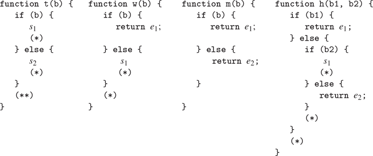

### 5.5.3 编制申请书和申报表

编译过程的本质是函数应用的编译。用给定目标和链接编译的应用程序代码具有以下形式

```js
〈compilation of function expression, target fun, linkage "next"〉
〈evaluate argument expressions and construct argument list in argl〉
〈compilation of function call with given target and linkage〉
```

寄存器`env`、`fun`和`argl`可能必须在函数和参数表达式求值期间保存和恢复。注意，这是编译器中唯一一个指定了目标而不是`val`的地方。

所需代码由`compile_application`生成。这递归地编译函数表达式，以产生将要应用的函数放入`fun`的代码，并编译自变量表达式，以产生评估应用的单个自变量表达式的代码。参数表达式的指令序列(通过`construct_arglist`与构建`argl`中的参数列表的代码相结合，得到的参数列表代码与函数代码和执行函数调用的代码(由`compile_function_call`产生)相结合。在追加代码序列时，`env`寄存器必须在函数表达式求值时保留(因为对函数表达式求值可能会修改`env`，这将是对自变量表达式求值所需要的)，而`fun`寄存器必须在自变量列表构造时保留(因为对自变量表达式求值可能会修改`fun`，这将是实际函数应用所需要的)。`continue`寄存器也必须始终保留，因为函数调用中的链接需要它。

```js
function compile_application(exp, target, linkage) {
    const fun_code = compile(function_expression(exp), "fun", "next");
    const argument_codes = map(arg => compile(arg, "val", "next"),
                               arg_expressions(exp));
    return preserving(list("env", "continue"),
                      fun_code,
                      preserving(list("fun", "continue"),
                          construct_arglist(argument_codes),
                          compile_function_call(target, linkage)));
}
```

构建参数列表的代码将评估每个参数表达式到`val`中，然后使用`pair`将该值与在`argl`中累积的参数列表相结合。因为我们按顺序将参数连接到`argl`的前面，所以我们必须从最后一个参数开始，以第一个参数结束，这样参数将在结果列表中按从第一个到最后一个的顺序出现。我们让第一个代码序列构造初始的`argl`，而不是浪费一条指令将`argl`初始化为空列表来设置这个求值序列。因此，参数列表结构的一般形式如下:

```js
〈compilation of last argument, targeted to val〉
〈assign("argl", list(op("list"), reg("val"))),
〈compilation of next argument, targeted to val〉
〈assign("argl", list(op("pair"), reg("val"), reg("argl"))),
. . .
〈compilation of first argument, targeted to val〉
assign("argl", list(op("pair"), reg("val"), reg("argl"))),
```

除了第一次参数求值之外，每个参数求值都必须保留`argl`寄存器(这样到目前为止累积的参数不会丢失)，除了最后一次参数求值之外，每个参数求值都必须保留`env`(供后续参数求值使用)。

编译这个参数代码有点棘手，因为要计算的第一个参数表达式需要特殊处理，并且需要在不同的地方保存`argl`和`env`。`construct_arglist`函数将评估单个参数表达式的代码作为参数。如果根本没有参数表达式，它只是发出指令

```js
assign(argl, constant(null))
```

否则，`construct_arglist`创建用最后一个参数初始化`argl`的代码，并附加评估其余参数的代码，并将它们连续邻接到`argl`。为了从最后到第一个处理参数，我们必须颠倒由`compile_application`提供的参数代码序列列表。

```js
function construct_arglist(arg_codes) {
    if (is_null(arg_codes)) {
        return make_instruction_sequence(null, list("argl"),
                   list(assign("argl", constant(null))));
    } else {
        const rev_arg_codes = reverse(arg_codes);
        const code_to_get_last_arg =
            append_instruction_sequences(
                head(rev_arg_codes),
                make_instruction_sequence(list("val"), list("argl"),
                    list(assign("argl",
                                list(op("list"), reg("val"))))));
        return is_null(tail(rev_arg_codes))
               ? code_to_get_last_arg
               : preserving(list("env"),
                     code_to_get_last_arg,
                     code_to_get_rest_args(tail(rev_arg_codes)));
    }
}
function code_to_get_rest_args(arg_codes) {
    const code_for_next_arg =
        preserving(list("argl"),
            head(arg_codes),
            make_instruction_sequence(list("val", "argl"), list("argl"),
                list(assign("argl", list(op("pair"),
                                         reg("val"), reg("argl"))))));
    return is_null(tail(arg_codes))
           ? code_for_next_arg
           : preserving(list("env"),
                        code_for_next_arg,
                        code_to_get_rest_args(tail(arg_codes)));
}
```

##### 应用函数

在评估函数应用程序的元素后，编译后的代码必须将`fun`中的函数应用到`argl`中的参数。代码本质上执行与 4.1.1 节的元循环求值器中的`apply`函数或 5.4.2 节的显式控制求值器中的`apply_dispatch`入口点相同的分派。它检查要应用的函数是原函数还是编译函数。对于一个原函数，它使用`apply_primitive_function`；我们很快就会看到它是如何处理编译函数的。功能应用代码具有以下形式:

```js
  test(list(op("primitive_function"), reg("fun"))),
  branch(label("primitive_branch")),
"compiled_branch",
 〈code to apply compiled function with given target and appropriate linkage〉
"primitive_branch",
  assign(target,
         list(op("apply_primitive_function"), reg("fun"), reg("argl"))),
 〈linkage〉
"after_call"
```

注意编译后的分支必须跳过原始分支。因此，如果原始函数调用的链接是`"next"`，复合分支必须使用跳转到原始分支后插入的标签的链接。(这类似于`compile_conditional`中用于真实分支的联动装置。)

```js
function compile_function_call(target, linkage) {
    const primitive_branch = make_label("primitive_branch");
    const compiled_branch = make_label("compiled_branch");
    const after_call = make_label("after_call");
    const compiled_linkage = linkage === "next" ? after_call : linkage;
    return append_instruction_sequences(
        make_instruction_sequence(list("fun"), null,
            list(test(list(op("is_primitive_function"), reg("fun"))),
                 branch(label(primitive_branch)))),
            append_instruction_sequences(
                parallel_instruction_sequences(
                    append_instruction_sequences(
                        compiled_branch,
                        compile_fun_appl(target, compiled_linkage)),
                    append_instruction_sequences(
                        primitive_branch,
                        end_with_linkage(linkage,
                            make_instruction_sequence(list("fun", "argl"),
                                                      list(target),
                                list(assign(
                                       target,
                                       list(op("apply_primitive_function"),
                                            reg("fun"), reg("argl")))))))),
            after_call));
}
```

原始分支和复合分支，就像`compile_ conditional`中的真分支和假分支一样，是使用`parallel_instruction_sequences`而不是普通的`append_instruction_sequences`追加的，因为它们不会按顺序执行。

##### 应用编译函数

函数应用和返回的处理是编译器最微妙的部分。编译后的函数(由`compile_lambda_expression`构造)有一个入口点，它是一个标签，指明函数代码的开始位置。这个入口点的代码在`val`中计算一个结果，并通过执行编译后的 return 语句中的指令结束。

编译函数应用程序的代码使用堆栈的方式与显式控制计算器(5.4.2 节)相同:在跳转到编译函数的入口点之前，它将函数调用的延续保存到堆栈中，后跟一个标记，该标记允许将堆栈恢复到调用之前的状态，延续位于顶部。

```js
  // set up for return from function
  save("continue"),
  push_marker_to_stack(),
  // jump to the function's entry point
  assign("val", list(op("compiled_function_entry"), reg("fun"))),
  go_to(reg("val")),
```

编译一个 return 语句(用`compile_return_statement`)生成对应的代码，用于还原堆栈，还原跳转到`continue`。

```js
  revert_stack_to_marker(),
  restore("continue"),
  〈evaluate the return expression and store the result in val〉
  go_to(reg("continue")), // "return"-linkage code
```

除非一个函数进入无限循环，否则它将通过执行上面的返回代码来结束，这是由程序中的一个 return 语句或由`compile_lambda_body`插入以返回`undefined`的语句产生的。 [^(45)](#c5-fn-0045)

具有给定目标和链接的编译函数应用程序的简单代码将设置`continue`使函数返回到本地标签而不是最终的链接，如果需要，将函数值从`val`复制到目标寄存器。如果链接是一个标签，看起来会是这样:

```js
  assign("continue", label("fun_return")), // where function should return to
  save("continue"),       // will be restored by the function
  push_marker_to_stack(), // allows the function to revert stack to find fun_return
  assign("val", list(op("compiled_function_entry"), reg("fun"))),
  go_to(reg("val")),    // eventually reverts stack, restores and jumps to continue
"fun_return",             // the function returns to here
  assign(target, reg("val")), // included if target is not val
  go_to(label(linkage)),   // linkage code
```

或者像这样—在开始时保存调用者的延续，以便在结束时还原并转到它—如果链接是`"return"`(也就是说，如果应用程序在 return 语句中，并且其值是要返回的结果):

```js
  save("continue"), // save the caller's continuation
  assign("continue", label("fun_return")), // where function should return to
  save("continue"), // will be restored by the function
push_marker_to_stack(), // allows the function to revert stack to find fun_return
  assign("val", list(op("compiled_function_entry"), reg("fun"))),
  go_to(reg("val")), // eventually reverts stack, restores and jumps to continue
"fun_return", // the function returns to here
  assign(target, reg("val")), // included if target is not val
  restore("continue"), // restore the caller's continuation
  go_to(reg("continue")), // linkage code
```

这段代码设置了`continue`，这样函数将返回到标签`fun_return`并跳转到函数的入口点。`fun_return`处的代码将函数的结果从`val`传输到目标寄存器(如有必要)，然后跳转到链接指定的位置。(链接始终是`"return"`或标签，因为`compile_function_call`用标签`after_call`代替了复合功能分支的`"next"`链接。)在跳转到函数的入口点之前，我们保存`continue`并执行`push_marker_to_stack()`以使函数返回到程序中具有预期堆栈的预期位置。匹配的`revert_stack_to_marker()`和`restore("continue")`指令由`compile_return_statement`为函数体中的每个返回语句生成。 [^(46)](#c5-fn-0046)

事实上，如果目标不是`val`，以上正是我们的编译器将生成的代码。[相反，我们通过设置`continue`来简化代码，这样被调用的函数将直接“返回”到调用者链接指定的位置:](#c5-fn-0047)

```js
〈set up continue for linkage and push the marker〉
assign("val", list(op("compiled_function_entry"), reg("fun"))),
go_to(reg("val")),
```

如果链接是一个标签，我们设置`continue`,这样函数将在那个标签上继续。(即被调用函数结束的`go_to(reg("continue"))`等价于上面`fun_return`处的`go_to(label(` 联动 `))`。)

```js
assign("continue", label(linkage)),
save("continue"),
push_marker_to_stack(),
assign("val", list(op("compiled_function_entry"), reg("fun"))),
go_to(reg("val")),
```

如果联动装置是`"return"`，我们不需要分配`continue`:它已经拥有了想要的位置。(也就是说，被调用函数结束的`go_to(reg("continue"))`直接转到`go_to(reg("continue"))`在`fun_ return`应该去的地方。)

```js
save("continue"),
push_marker_to_stack(),
assign("val", list(op("compiled_function_entry"), reg("fun"))),
go_to(reg("val")),
```

通过`"return"`链接的实现，编译器生成 tailrecursive 代码。return 语句中的函数调用(其值是要返回的结果)执行直接传输，而不会在堆栈上保存不必要的信息。

假设我们已经处理了一个函数调用的情况，它有一个链接`"return"`和一个目标`val`，处理方式与处理非`val`目标的方式相同。这将破坏尾部递归。我们的系统仍然会为任何函数调用返回相同的值。但是每次我们调用一个函数，我们会保存`continue`并在调用后返回以撤销(无用的)保存。这些额外的节省将在函数调用的嵌套中累积。 [^(48)](#c5-fn-0048)

函数`compile_fun_appl`通过考虑四种情况来生成上述函数应用代码，这取决于调用的目标是否为`val`以及链接是否为`"return"`。注意，声明指令序列是为了修改所有寄存器，因为执行函数体可以以任意方式改变寄存器。 [^(49)](#c5-fn-0049)

```js
function compile_fun_appl(target, linkage) {
    const fun_return = make_label("fun_return");
    return target === "val" && linkage !== "return"
           ? make_instruction_sequence(list("fun"), all_regs,
                 list(assign("continue", label(linkage)),
                      save("continue"),
                      push_marker_to_stack(),
                      assign("val", list(op("compiled_function_entry"),
                                         reg("fun"))),
                      go_to(reg("val"))))
           : target !== "val" && linkage !== "return"
           ? make_instruction_sequence(list("fun"), all_regs,
                 list(assign("continue", label(fun_return)),
                      save("continue"),
                      push_marker_to_stack(),
                      assign("val", list(op("compiled_function_entry"),
                                         reg("fun"))),
                      go_to(reg("val")),
                      fun_return,
                      assign(target, reg("val")),
                      go_to(label(linkage))))
           : target === "val" && linkage === "return"
           ? make_instruction_sequence(list("fun", "continue"),
                                       all_regs,
                 list(save("continue"),
                      push_marker_to_stack(),
                      assign("val", list(op("compiled_function_entry"),
                                         reg("fun"))),
                      go_to(reg("val"))))
           : // target !== "val" && linkage === "return"
             error(target, "return linkage, target not val – compile");
}
```

我们已经展示了如何在链接为`"return"`时为函数应用程序生成尾递归链接代码——也就是说，当应用程序处于 return 语句中并且其值是要返回的结果时。类似地，正如 5.4.2 节所解释的，这里(以及在显式控制计算器中)用于调用和返回的堆栈标记机制仅在这种情况下产生尾部递归行为。为函数应用程序生成的代码的这两个方面结合起来，可以确保当一个函数通过返回函数调用的值而结束时，不会累积堆栈。

##### 编译返回语句

不管给定的链接和目标是什么，return 语句的代码都采用以下形式:

```js
revert_stack_to_marker(),
restore("continue"),   // saved by compile_fun_appl
〈evaluate the return expression and store the result in val〉
go_to(reg("continue")) // "return"-linkage code
```

使用标记器恢复堆栈，然后恢复`continue`的指令对应于`compile_fun_appl`生成的保存`continue`并标记堆栈的指令。编译返回表达式时，通过使用`"return"`链接生成到`continue`的最终跳转。函数`compile_ return_statement`与所有其他代码生成器的不同之处在于，它忽略了目标和链接参数——它总是使用目标`val`和链接`"return"`来编译返回表达式。

```js
function compile_return_statement(stmt, target, linkage) {
    return append_instruction_sequences(
               make_instruction_sequence(null, list("continue"),
                   list(revert_stack_to_marker(),
                        restore("continue"))),
               compile(return_expression(stmt), "val", "return"));
}
```

### 5.5.4 组合指令序列

本节详细介绍了如何表示和组合指令序列。回想一下第 5.5.1 节，指令序列表示为所需寄存器、修改的寄存器和实际指令的列表。我们还将标签(字符串)视为指令序列的退化情况，它不需要或修改任何寄存器。因此，为了确定指令序列需要和修改的寄存器，我们使用选择器

```js
function registers_needed(s) {
    return is_string(s) ? null : head(s);
}
function registers_modified(s) {
    return is_string(s) ? null : head(tail(s));
}
function instructions(s) {
    return is_string(s) ? list(s) : head(tail(tail(s)));
}
```

为了确定一个给定的序列是否需要或修改一个给定的寄存器，我们使用谓词

```js
function needs_register(seq, reg) {
    return ! is_null(member(reg, registers_needed(seq)));
}
function modifies_register(seq, reg) {
    return ! is_null(member(reg, registers_modified(seq)));
}
```

根据这些谓词和选择器，我们可以实现编译器中使用的各种指令序列组合器。

基本组合器是`append_instruction_sequences`。它将两个要顺序执行的指令序列作为参数，并返回一个指令序列，该指令序列的语句是两个序列附加在一起的语句。微妙的一点是确定结果序列需要和修改的寄存器。它修改那些被任一序列修改的寄存器；它需要在第一个序列运行之前必须初始化的那些寄存器(第一个序列需要的寄存器)，以及第二个序列需要的那些没有被第一个序列初始化(修改)的寄存器。

函数`append_instruction_sequences`被赋予两个指令序列`seq1`和`seq2`并返回指令序列，其指令是`seq1`的指令后跟`seq2`的指令，其修改的寄存器是被`seq1`或`seq2`修改的寄存器，其需要的寄存器是`seq1`需要的寄存器加上`seq2`需要的未被`seq1`修改的寄存器。(在集合运算方面，新的一组需要的寄存器是`seq1`需要的寄存器集合与`seq2`需要的寄存器和`seq1`修改的寄存器的集合差的并集。)因此，`append_instruction_sequences`实现如下:

```js
function append_instruction_sequences(seq1, seq2) {
    return make_instruction_sequence(
               list_union(registers_needed(seq1),
                          list_difference(registers_needed(seq2),
                                         registers_modified(seq1))),
               list_union(registers_modified(seq1),
                          registers_modified(seq2)),
               append(instructions(seq1), instructions(seq2)));
}
```

这个函数使用一些简单的操作来操作表示为列表的集合，类似于 2.3.3 节中描述的(无序)集合表示:

```js
function list_union(s1, s2) {
    return is_null(s1)
           ? s2
           : is_null(member(head(s1), s2))
           ? pair(head(s1), list_union(tail(s1), s2))
           : list_union(tail(s1), s2);
}
function list_difference(s1, s2) {
    return is_null(s1)
           ? null
           : is_null(member(head(s1), s2))
           ? pair(head(s1), list_difference(tail(s1), s2))
           : list_difference(tail(s1), s2);
}
```

函数`preserving`，第二个主指令序列组合器，取一个寄存器列表`regs`和两个要顺序执行的指令序列`seq1`和`seq2`。它返回一个指令序列，其指令是`seq1`的指令后跟`seq2`的指令，在`seq1`周围有适当的`save`和`restore`指令来保护`regs`中被`seq1`修改但`seq2`需要的寄存器。为此，`preserving`首先创建一个序列，该序列具有所需的`save`，其后是指令`seq1`，其后是所需的`restore`，该序列除了需要`seq1`所需的寄存器外，还需要保存和恢复的寄存器，并修改由`seq1`修改的寄存器，除了保存和恢复的寄存器。然后，以通常的方式追加该扩充序列和`seq2`。下面的函数递归地实现这个策略，遍历要保留的寄存器列表:

```js
function preserving(regs, seq1, seq2) {
    if (is_null(regs)) {
        return append_instruction_sequences(seq1, seq2);
    } else {
        const first_reg = head(regs);
        return needs_register(seq2, first_reg) &&
               modifies_register(seq1, first_reg)
               ? preserving(tail(regs),
                     make_instruction_sequence(
                         list_union(list(first_reg),
                                    registers_needed(seq1)),
                         list_difference(registers_modified(seq1),
                                         list(first_reg)),
                         append(list(save(first_reg)),
                                append(instructions(seq1),
                                       list(restore(first_reg))))),
                     seq2)
               : preserving(tail(regs), seq1, seq2);
    }
}
```

另一个序列组合器`tack_on_instruction_sequence`被`compile_lambda_expression`用来将一个函数体附加到另一个序列上。因为函数体不是作为组合序列的一部分“在线”执行的，所以它的寄存器使用对它所嵌入的序列的寄存器使用没有影响。因此，当我们将函数体添加到另一个序列中时，我们忽略了函数体的所需和修改的寄存器集。

```js
function tack_on_instruction_sequence(seq, body_seq) {
    return make_instruction_sequence(
               registers_needed(seq),
               registers_modified(seq),
               append(instructions(seq), instructions(body_seq)));
}
```

函数`compile_conditional`和`compile_function_call`使用一个叫做`parallel_instruction_sequences`的特殊组合器来附加测试后的两个可选分支。这两个分支永远不会按顺序执行；对于测试的任何特定评估，将输入一个分支或另一个分支。因此，组合序列仍然需要第二分支所需的寄存器，即使这些寄存器被第一分支修改。

```js
function parallel_instruction_sequences(seq1, seq2) {
    return make_instruction_sequence(
               list_union(registers_needed(seq1),
                          registers_needed(seq2)),
               list_union(registers_modified(seq1),
                          registers_modified(seq2)),
               append(instructions(seq1), instructions(seq2)));
}
```

### 5.5.5 编译代码示例

现在我们已经看到了编译器的所有元素，让我们来看一个编译代码的例子，看看它们是如何组合在一起的。我们将编译递归`factorial`函数的声明，将`parse`应用于程序的字符串表示的结果作为第一个参数传递给`compile`(这里使用反引号`ˋ. . .ˋ`，它的作用类似于单引号和双引号，但允许字符串跨越多行):

```js
compile(parse(ˋ
function factorial(n) {
    return n === 1
           ? 1
           : factorial(n - 1) * n;
}
              ˋ),
        "val",
        "next");
```

我们已经指定声明的值应该放在`val`寄存器中。我们不关心编译后的代码在执行声明后做了什么，所以我们选择`"next"`作为链接描述符是任意的。

函数`compile`确定给了它一个函数声明，所以它将其转换为常量声明，然后调用`compile_declaration`。这将编译代码以计算要分配的值(目标为`val`)，然后是安装声明的代码，接着是将声明的值(值`undefined`)放入目标寄存器的代码，最后是链接代码。在值的计算过程中保留了`env`寄存器，因为需要它来安装声明。因为联动是`"next"`，所以这种情况下没有联动码。编译后的代码框架如下

```js
〈save env if modified by code to compute value〉
〈compilation of declaration value, target val, linkage "next"〉
〈restore env if saved above〉
perform(list(op("assign_symbol_value"),
             constant("factorial"),
             reg("val"),
             reg("env"))),
assign("val", constant(undefined))
```

被编译以产生名字`factorial`的值的表达式是一个 Lambda  表达式，其值是计算阶乘的函数。函数`compile`通过调用`compile_lambda_expression`来处理这个问题，后者编译函数体，将其标记为一个新的入口点，并生成指令，该指令将把新入口点的函数体与运行时环境结合起来，并将结果分配给`val`。然后，该序列跳过已编译的函数代码，该代码是在此时插入的。函数代码本身首先通过将参数`n`绑定到函数参数的框架来扩展函数的声明环境。然后是实际的函数体。由于这个名称值的代码没有修改`env`寄存器，所以上面显示的可选的`save`和`restore`没有生成。(此时不执行`entry1`处的功能代码，因此它对`env`的使用是不相关的。)因此，编译后的代码的框架变成了

```js
  assign("val", list(op("make_compiled_function"),
                     label("entry1"),
                     reg("env"))),
  go_to(label("after_lambda2")),
"entry1",
  assign("env", list(op("compiled_function_env"), reg("fun"))),
  assign("env", list(op("extend_environment"),
                     constant(list("n")),
                     reg("argl"),
                     reg("env"))),
  〈compilation of function body〉
"after_lambda2",
  perform(list(op("assign_symbol_value"),
               constant("factorial"),
               reg("val"),
               reg("env"))),
  assign("val", constant(undefined))
```

函数体总是用目标`val`和链接`"next"`编译(由`compile_lambda_body`)。本例中的主体由一条返回语句组成: [^(50)](#c5-fn-0050)

```js
return n === 1
       ? 1
       : factorial(n - 1) * n;
```

函数`compile_return_statement`生成代码，使用标记恢复堆栈并恢复`continue`寄存器，然后编译带有目标`val`和链接`"return"`的返回表达式，因为它的值将从函数返回。返回表达式是一个条件表达式，`compile_conditional`为其生成代码，首先计算谓词(目标是`val`，然后检查结果，如果谓词为假，则绕过真分支。寄存器`env`和`continue`保留在谓词代码周围，因为它们可能需要用于条件表达式的其余部分。真分支和假分支都用目标`val`和链接`"return"`编译。(也就是说，条件的值(由它的任一分支计算的值)是函数的值。)

```js
  revert_stack_to_marker(),
  restore("continue"),
  〈save continue, env if modified by predicate and needed by branches〉
  〈compilation of predicate, target val, linkage "next"〉
  〈restore continue, env if saved above〉
  test(list(op("is_falsy"), reg("val"))),
  branch(label("false_branch4")),
"true_branch3",
  〈compilation of true branch, target val, linkage "return"〉
"false_branch4",
  〈compilation of false branch, target val, linkage "return"〉
"after_cond5",
```

谓词`n === 1`是一个函数应用(运算符组合转换后)。这将查找函数表达式(符号`"==="`，并将该值放入`fun`。然后，它将参数`1`和`n`的值组装到`argl`中。然后它测试`fun`是否包含原语或复合函数，并相应地分派到原语分支或复合分支。两个分支都在`after_call`标签处恢复。复合分支必须设置`continue`跳过原始分支，并将一个标记压入堆栈，以匹配函数的已编译返回语句中的恢复操作。在函数和参数表达式的求值过程中保留寄存器的要求不会导致寄存器的任何保存，因为在这种情况下，这些求值不会修改所讨论的寄存器。

```js
  assign("fun", list(op("lookup_symbol_value"),
                     constant("==="), reg("env"))),
  assign("val", constant(1)),
  assign("argl", list(op("list"), reg("val"))),
  assign("val", list(op("lookup_symbol_value"),
                     constant("n"), reg("env"))),
  assign("argl", list(op("pair"), reg("val"), reg("argl"))),
  test(list(op("is_primitive_function"), reg("fun"))),
  branch(label("primitive_branch6")),
"compiled_branch7",
  assign("continue", label("after_call8")),
  save("continue"),
  push_marker_to_stack(),
  assign("val", list(op("compiled_function_entry"), reg("fun"))),
  go_to(reg("val")),
"primitive_branch6",
  assign("val", list(op("apply_primitive_function"),
                     reg("fun"),
                     reg("argl"))),
"after_call8",
```

真正的分支是常数 1，编译(使用目标值和链接“`return`”)为

```js
  assign("val", constant(1)),
  go_to(reg("continue")),
```

错误分支的代码是另一个函数调用，其中函数是符号`"*"`的值，参数是`n`和另一个函数调用的结果(对`factorial`的调用)。这些调用中的每一个都建立了`fun`和`argl`以及它自己的原始和复合分支。图 5.17：显示了`factorial`函数声明的完整编译。注意，如上所示，谓词周围的`continue`和`env`的可能的`save`和`restore`实际上是生成的，因为这些寄存器被谓词中的函数调用修改，并且需要用于分支中的函数调用和`"return"`链接。

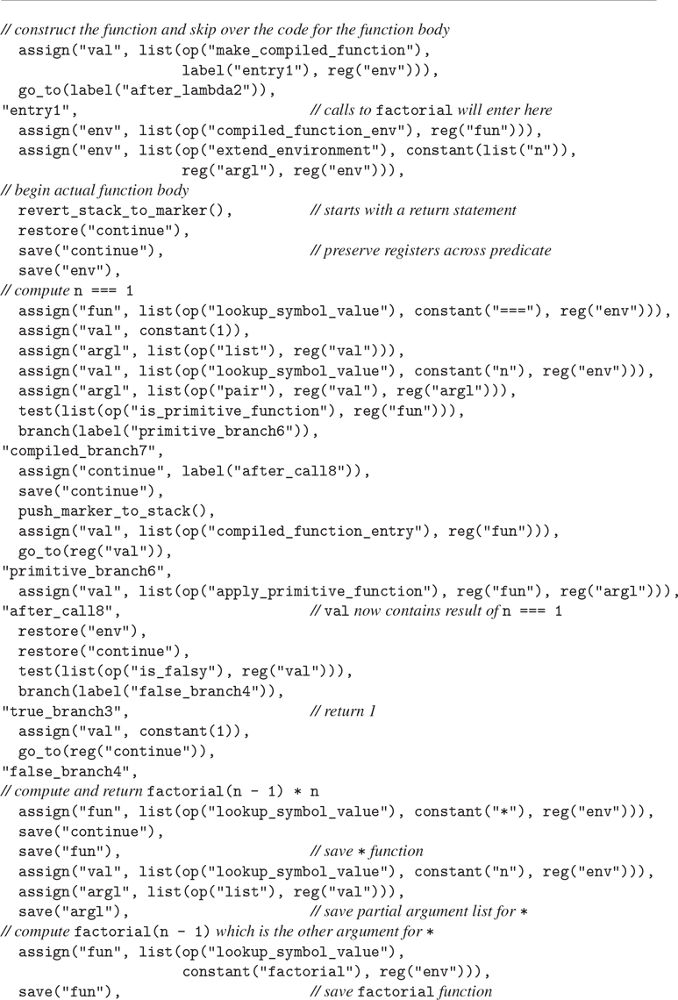
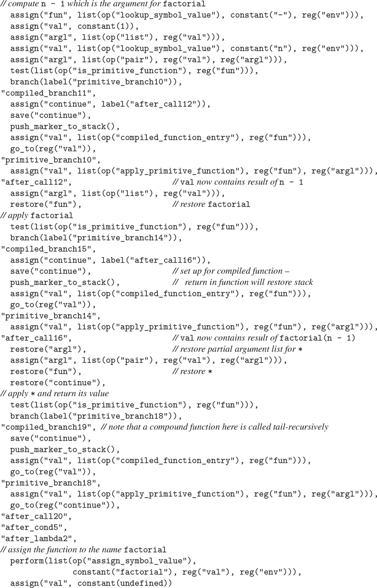

图 5.17：编译声明的`factorial`功能。

##### 练习 5.36

考虑以下阶乘函数的声明，它与上面给出的声明略有不同:

```js
function factorial_alt(n) {
    return n === 1
           ? 1
           : n * factorial_alt(n - 1);
}
```

编译该函数，并将结果代码与为`factorial`生成的代码进行比较。解释你发现的任何差异。这两个程序的执行效率是否比另一个更高？

##### 练习 5.37

编译迭代阶乘函数

```js
function factorial(n) {
    function iter(product, counter) {
        return counter > n
               ? product
               : iter(product * counter, counter + 1);
    }
    return iter(1, 1);
}
```

注释生成的代码，展示`factorial`的迭代和递归版本的代码之间的本质区别，这使得一个进程构建堆栈空间，而另一个进程在常量堆栈空间中运行。

##### 练习 5.38

编译了什么程序来产生如图 5.18：所示的代码？

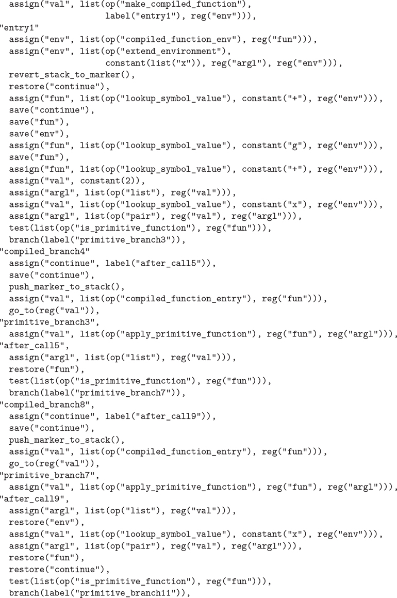
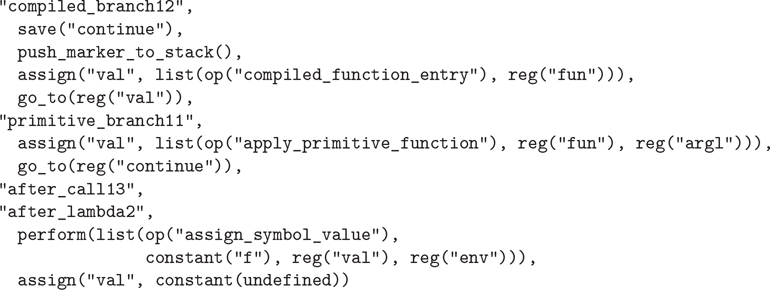

图 5.18：编译器输出的一个例子。见练习 5.38。

##### 练习 5.39

我们的编译器对应用程序的参数产生什么样的求值顺序？它是从左到右(如 ECMAScript 规范所要求的)、从右到左还是其他顺序？这个顺序是在编译器的什么地方确定的？修改编译器，使其产生一些其他的求值顺序。(参见第 5.4.1 节中对显式控制评估器评估顺序的讨论。)。)改变参数求值顺序如何影响构造参数列表的代码的效率？

##### 练习 5.40

理解编译器优化堆栈使用的`preserving`机制的一种方法是，看看如果我们不使用这个想法，会产生什么额外的操作。修改`preserving`，使其始终生成`save`和`restore`操作。编译一些简单的表达式，识别产生的不必要的栈操作。将代码与使用完整的`preserving`机制生成的代码进行比较。

##### 练习 5.41

我们的编译器在避免不必要的堆栈操作方面很聪明，但在根据机器提供的原语操作来编译对语言原语函数的调用时，它一点也不聪明。例如，考虑编译多少代码来计算`a + 1`:代码在`argl`中设置一个参数列表，将原语加法函数(它通过在环境中查找符号`"+"`找到)放入`fun`，并测试该函数是原语还是复合函数。编译器总是生成执行测试的代码，以及原始分支和复合分支的代码(只执行其中一个)。我们没有显示实现原语的控制器部分，但是我们假设这些指令在机器的数据路径中使用原语算术运算。考虑一下，如果编译器能够开放代码原语，将会生成多少代码——也就是说，如果它能够生成直接使用这些原语机器操作的代码。表达式`a + 1`可能会被编译成像 [^(51)](#c5-fn-0051) 这样简单的东西

```js
assign("val", list(op("lookup_symbol_value"), constant("a"), reg("env"))),
assign("val", list(op("+"), reg("val"), constant(1)))
```

在这个练习中，我们将扩展我们的编译器以支持所选原语的开放编码。将为调用这些原语函数生成专用代码，而不是通用函数应用程序代码。为了支持这一点，我们将用特殊的参数寄存器`arg1`和`arg2`来扩充我们的机器。机器的原始算术运算将从`arg1`和`arg2`获得输入。结果可以放入`val`、`arg1`或`arg2`。

编译器必须能够识别源程序中开放编码原语的应用。我们将增加`compile`函数中的调度，除了它当前识别的语法形式之外，还识别这些原语的名称。对于每种语法形式，我们的编译器都有一个代码生成器。在这个练习中，我们将为开放编码的原语构建一系列代码生成器。

1.  a. 与语法形式不同，开放编码的原语都需要评估它们的参数表达式。编写一个代码生成器`spread_arguments`供所有开放编码的代码生成器使用。函数`spread_arguments`应该接受一个自变量表达式列表，并编译给定的自变量表达式，目标是连续的自变量寄存器。请注意，参数表达式可能包含对开放编码原语的调用，因此在参数表达式求值期间必须保留参数寄存器。
2.  b .JavaScript 操作符`===`、`*`、`-`和`+`等在注册机中作为原语函数实现，在全局环境中用符号`"==="`、`"*"`、`"-"`和`"+"`引用。在 JavaScript 中，不可能重新声明这些名称，因为它们不符合名称的语法限制。这意味着对它们进行开放编码是安全的。对于每个原语函数`===`、`*`、`-`和`+`，编写一个代码生成器，它采用一个带有命名该函数的函数表达式的应用程序，以及一个目标和一个链接描述符，并生成代码以将参数传播到寄存器中，然后通过给定的链接执行针对给定目标的操作。对这些代码生成器进行`compile`调度。
3.  在`factorial`例子中尝试你的新编译器。将生成的代码与没有开放编码时产生的结果进行比较。

### 5.5.6 词法寻址

编译器执行的最常见的优化之一是名称查找的优化。我们的编译器，正如我们到目前为止所实现的那样，生成使用评估机的`lookup_symbol_value`操作的代码。这通过将名称与当前绑定的每个名称进行比较来搜索名称，通过运行时环境一帧一帧地向外工作。如果框架嵌套很深或者有很多名字，那么这种搜索会很昂贵。例如，考虑在应用程序中对表达式`x * y * z`求值时查找`x`的值的问题，该函数由

```js
((x, y) =>
   (a, b, c, d, e) =>
     ((y, z) => x * y * z)(a * b * x, c + d + x))(3, 4)
```

每次`lookup_symbol_value`搜索`x`时，必须确定符号`"x"`不等于`"y"`或`"z"`(第一帧)，也不等于`"a"`、`"b"`、`"c"`、`"d"`或`"e"`(第二帧)。因为我们的语言是词汇范围的，所以任何组件的运行时环境都将有一个与组件所在程序的词汇结构平行的结构。因此，当编译器分析上述表达式时，它可以知道，每次应用函数时，`x * y * z`中的`x`的绑定将在当前帧之外的两帧中找到，并且将是该帧中的第一个绑定。

我们可以通过发明一种新的名称查找操作`lexical_address_lookup`来利用这一事实，它将环境和由两个数字组成的词法地址作为参数:一个帧号，它指定要经过多少帧，一个位移号，它指定在该帧中要经过多少绑定。操作`lexical_address_lookup`将产生存储在相对于当前环境的词汇地址的名称值。如果我们将`lexical_address_lookup`操作添加到我们的机器中，我们可以让编译器使用这个操作而不是`lookup_symbol_value`来生成引用名称的代码。同样，我们编译的代码可以使用一个新的`lexical_address_assign`操作来代替`assign_symbol_value`。使用词法寻址，不需要在目标代码中包含任何对名称的符号引用，并且框架在运行时也不需要包含符号。

为了生成这样的代码，编译器必须能够确定它将要编译引用的名字的词法地址。名字在程序中的词法地址取决于它在代码中的位置。例如，在下面的程序中，表达式 e1 中的`x`的地址是(2，0)—向后两帧，并且是该帧中的第一个名字。此时`y`位于地址(0，0)，而`c`位于地址(1，2)。在表达式 e [2] 中，`x`位于(1，0)`y`位于(1，1)`c`位于(0，2)。

```js
((x, y) =>
   (a, b, c, d, e) =>
     ((y, z) => e1)(e2, c + d + x))(3, 4);
```

编译器生成使用词法寻址的代码的一种方法是维护一个叫做编译时环境的数据结构。这跟踪当执行特定的名称访问操作时，哪些绑定将在运行时环境中的哪些帧中的哪些位置。编译时环境是一个帧列表，每个帧包含一个符号列表。没有与符号相关联的值，因为编译时不计算值。(练习 5.47 将改变这一点，作为对常数的优化。)编译时环境成为`compile`的附加参数，并传递给每个代码生成器。对`compile`的顶层调用使用了一个编译时环境，其中包含了所有原始函数和原始值的名称。当编译 Lambda  表达式的主体时，`compile_lambda_body`通过一个包含函数参数的框架来扩展 compiletime 环境，以便用扩展的环境来编译主体。类似地，当编译一个块的主体时，`compile_block`通过一个包含扫描输出的主体本地名称的框架来扩展编译时环境。在编译的每一点，`compile_name`和`compile_assignment_declaration`使用编译时环境来生成适当的词法地址。

练习 5.42 到 5.45 描述了如何完成这个词法寻址策略的草图，以便将词法查找合并到编译器中。练习 5.46 和 5.47 描述了编译时环境的其他用途。

##### 练习 5.42

编写一个函数`lexical_address_lookup`来实现新的查找操作。它应该有两个参数——词法地址和运行时环境——并返回存储在指定词法地址的名称值。如果名字的值是字符串`"*unassigned*"`，函数`lexical_address_ lookup`应该发出错误信号。还要编写一个函数`lexical_address_assign`,它实现了在指定的词法地址改变名称值的操作。

##### 练习 5.43

如上所述，修改编译器以维护编译时环境。也就是说，给`compile`和各种代码生成器添加一个编译时环境参数，并在`compile_lambda_body`和`compile_block`中扩展它。

##### 练习 5.44

编写一个函数`find_symbol`，它将一个符号和一个编译时环境作为参数，并返回该符号相对于该环境的词法地址。例如，在上面显示的程序片段中，表达式 e [1] 编译期间的编译时环境是

```js
list(list("y", "z"),
     list("a", "b", "c", "d", "e"),
     list("x", "y"))
```

函数`find_symbol`应产生

```js
find_symbol("c", list(list("y", "z"),
                      list("a", "b", "c", "d", "e"),
                      list("x", "y")));
list(1, 2)

find_symbol("x", list(list("y", "z"),
                      list("a", "b", "c", "d", "e"),
                      list("x", "y")));
list(2, 0)

find_symbol("w", list(list("y", "z"),
                      list("a", "b", "c", "d", "e"),
                      list("x", "y")));
"not found"
```

##### 练习 5.45

使用练习 5.44 中的`find_symbol`，重写`compile_assignment_declaration`和`compile_name`以输出词法地址指令。如果`find_symbol`返回`"not found"`(即名称不在编译时环境中)，您应该报告一个编译时错误。在几个简单的案例上测试修改后的编译器，比如本节开头的嵌套 Lambda  组合。

##### 练习 5.46

在 JavaScript 中，试图给声明为常量的名称赋值会导致错误。练习 4.11 展示了如何在运行时检测此类错误。使用本节介绍的技术，我们可以检测到在编译时给常量赋值的企图。为此，扩展函数`compile_lambda_body`和`compile_block`以在编译时环境中记录一个名称是被声明为变量(使用`**let**`或参数)还是常量(使用`**const**`或`**function**`)。修改`compile_assignment`以在检测到常量赋值时报告适当的错误。

##### 练习 5.47

关于编译时常数的知识打开了许多优化的大门，允许我们生成更有效的目标代码。除了在练习 5.46 中扩展 compiletime 环境以指示声明为常量的名称之外，我们可以存储一个常量的值(如果它在编译时是已知的)，或者可以帮助我们优化代码的其他信息。

1.  a. 常量声明如`**const**`name`=`literal`;`允许我们用 literal 替换声明范围内所有出现的 name ，这样就不必在运行时环境中查找 name 了。这种优化被称为常数传播。使用扩展的编译时环境来存储文字常量，并修改`compile_name`以在生成的`assign`指令中使用存储的常量，而不是`lookup_symbol_value`操作。
2.  b. 函数声明是扩展为常量声明的派生组件。让我们假设全局环境中的原函数的名字也被认为是常数。如果我们进一步扩展我们的编译时环境，以跟踪哪些名称引用编译的函数，哪些名称引用原语函数，我们可以将检查函数是否是编译的或原语的测试从运行时移到编译时。这使得目标代码更有效，因为它用编译器执行的测试代替了生成的代码中每个函数应用程序必须执行一次的测试。使用这样一个扩展的编译时环境，修改`compile_function_call`,这样如果可以在编译时确定被调用的函数是编译的还是原语的，那么只生成`compiled_branch`或`primitive_branch`中的指令。
3.  c. 如在部分(a)中，用常量名称的文字值替换常量名称为另一个优化铺平了道路，即，用编译时计算的结果替换对文字值的原始函数的应用。这种优化称为常量折叠，通过在编译器中执行加法，用`42`代替了`40 + 2`等表达式。扩展编译器以执行数字算术运算和字符串连接的常数折叠。

### 5.5.7 将编译后的代码连接到评估器

我们还没有解释如何将编译后的代码加载到评估机中，或者如何运行它。我们将假设显式控制评估机已在 5.4.4 节中定义，附加操作在脚注 43 中说明(5.5.2 节)。我们将实现一个函数`compile_and_go`，它编译一个 JavaScript 程序，将结果目标代码加载到求值器机器中，并使机器在求值器全局环境中运行代码，打印结果，并进入求值器的驱动程序循环。我们还将修改求值器，以便解释的组件可以像调用解释的函数一样调用编译的函数。然后，我们可以将一个编译好的函数放入机器中，并使用计算器调用它:

```js
compile_and_go(parse(ˋ
function factorial(n) { 
    return n === 1
           ? 1
           : factorial(n - 1) * n;
}
                     ˋ));
```

EC-评估值:

```js
undefined
```

EC-评估输入:

```js
factorial(5);
```

EC-评估值:

120

为了允许评估器处理编译的函数(例如，评估对上面的`factorial`的调用)，我们需要在`apply_dispatch`(第 5.4.2 节)更改代码，以便它识别编译的函数(不同于复合函数或原始函数)，并将控制直接转移到编译代码的入口点: [^(52)](#c5-fn-0052)

```js
"apply_dispatch",
  test(list(op("is_primitive_function"), reg("fun"))),
  branch(label("primitive_apply")),
  test(list(op("is_compound_function"), reg("fun"))),
  branch(label("compound_apply")),
  test(list(op("is_compiled_function"), reg("fun"))),
  branch(label("compiled_apply")),
  go_to(label("unknown_function_type")),

"compiled_apply",
  push_marker_to_stack(),
  assign("val", list(op("compiled_function_entry"), reg("fun"))),
  go_to(reg("val")),
```

在`compiled_apply`，和在`compound_apply`一样，我们将一个标记压入堆栈，这样编译后的函数中的返回语句可以将堆栈恢复到这个状态。注意，在标记堆栈之前，在`compiled_apply`处没有保存`continue`，因为求值器被安排为在`apply_dispatch`处，延续将在堆栈的顶部。

为了使我们能够在启动求值器机器时运行一些编译的代码，我们在求值器机器的开头添加了一条`branch`指令，如果`flag`寄存器被置位，它会使机器转到一个新的入口点。 [^(53)](#c5-fn-0053)

```js
  branch(label("external_entry")), // branches if flag is set
"read_evaluate_print_loop",
  perform(list(op("initialize_stack"))),
  . . .
```

`external_entry`处的代码假定机器从包含将结果放入`val`的指令序列位置的`val`开始，并以`go_to(reg("continue"))`结束。从这个入口点开始跳转到由`val`指定的位置，但是首先分配`continue`以便执行将返回到`print_result`，打印`val`中的值，然后转到求值器的读取-求值-打印循环的开始。 [^(54)](#c5-fn-0054)

```js
"external_entry",
  perform(list(op("initialize_stack"))),
  assign("env", list(op("get_current_environment"))),
  assign("continue", label("print_result")),
  go_to(reg("val")),
```

现在我们可以使用下面的函数来编译函数声明，执行编译后的代码，并运行 read-evaluate-print 循环，这样我们就可以尝试该函数了。因为我们希望编译后的代码前进到`continue`中的位置，其结果在`val`中，所以我们用目标`val`和链接`"return"`来编译程序。为了将编译器生成的目标代码转换成评估寄存器机器的可执行指令，我们使用寄存器机器模拟器中的函数`assemble`(第 5.2.2 节)。为了让解释后的程序引用在编译后的程序中顶级声明的名字，我们扫描出顶级名字，并通过将这些名字绑定到`"*unassigned*"`来扩展全局环境，因为我们知道编译后的代码会给它们分配正确的值。然后，我们初始化`val`寄存器以指向指令列表，设置`flag`以使评估器转到`external_entry`，并启动评估器。

```js
function compile_and_go(program) {
    const instrs = assemble(instructions(compile(program,
                                                 "val", "return")),
                            eceval);
    const toplevel_names = scan_out_declarations(program);
    const unassigneds = list_of_unassigned(toplevel_names);
    set_current_environment(extend_environment(
                               toplevel_names,
                               unassigneds,
                               the_global_environment));
    set_register_contents(eceval, "val", instrs);
    set_register_contents(eceval, "flag", true);
    return start(eceval);
}
```

如果我们已经设置了堆栈监控，如 5.4.4 节的结尾，我们可以检查编译代码的堆栈使用情况:

```js
compile_and_go(parse(ˋ
function factorial(n) { 
    return n === 1
           ? 1
           : factorial(n - 1) * n;
}
                     ˋ));
```

总推送数= 0

最大深度= 0

EC-评估值:

```js
undefined
```

EC-评估输入:

```js
factorial(5);
```

总推送数= 36

最大深度= 14

EC-评估值:

120

将此示例与使用相同功能的解释版本对`factorial(5)`的评估进行比较，如第 5.4.4 节末尾所示。解释版本需要 151 次推送，最大堆栈深度为 28。这说明了我们的编译策略所带来的优化。

##### 解释和汇编

使用本节中的程序，我们现在可以试验解释和编译的替代执行策略。 [^(55)](#c5-fn-0055) 一个解释器把机器提升到用户程序的层次；编译器把用户程序降低到机器语言的水平。我们可以将 JavaScript 语言(或任何编程语言)视为建立在机器语言之上的一系列连贯的抽象。解释器有利于交互式程序开发和调试，因为程序执行的步骤是根据这些抽象来组织的，因此对程序员来说更容易理解。编译后的代码可以更快地执行，因为程序执行的步骤是根据机器语言组织的，编译器可以自由地进行优化，跨越更高级别的抽象。[56](#c5-fn-0056)

解释和编译的选择也导致了将语言移植到新计算机的不同策略。假设我们希望为一台新机器实现 JavaScript。一种策略是从 5.4 节的显式控制鉴别器开始，并把它的指令翻译成新机器的指令。一种不同的策略是从编译器开始，改变代码生成器，以便它们为新机器生成代码。第二种策略允许我们在新机器上运行任何 JavaScript 程序，方法是首先用运行在我们原始 JavaScript 系统上的编译器编译它，并将其与运行时库的编译版本相链接。更好的是，我们可以编译编译器本身，并在新机器上运行它来编译其他 JavaScript 程序。或者我们可以编译 4.1 节中的一个解释器，以产生一个在新机器上运行的解释器。

##### 练习 5.48

通过将编译后的代码使用的堆栈操作与评估器使用的堆栈操作进行比较，我们可以确定编译器优化堆栈使用的程度，包括速度(减少堆栈操作的总数)和空间(减少最大堆栈深度)。将这种优化的堆栈使用与用于相同计算的专用机器的性能进行比较，可以看出编译器的质量。

1.  a. Exercise 5.28 asked you to determine, as a function of n, the number of pushes and the maximum stack depth needed by the evaluator to compute n! using the recursive factorial function given above. Exercise 5.13 asked you to do the same measurements for the special-purpose factorial machine shown in [figure 5.11](#c5-fig-0011). Now perform the same analysis using the compiled `factorial` function.

    取编译版本中推送次数与解释版本中推送次数的比值，对最大堆栈深度做同样的处理。因为用来计算 n 的运算次数和堆栈深度！在 n 中是线性的，随着 n 变大，这些比值应该接近常数。这些常数是什么？类似地，找出专用机器中的堆栈使用率与解释版本中的使用率之比。

    将专用代码与解释代码的比率与编译代码与解释代码的比率进行比较。你应该会发现专用机器比编译的代码更有效，因为手工定制的控制器代码应该比我们基本的通用编译器产生的代码好得多。

2.  b. 你能对编译器提出改进建议，帮助它生成性能更接近手工定制版本的代码吗？

##### 练习 5.49

进行类似练习 5.48 中的分析，以确定编译树形递归斐波纳契函数的有效性

```js
function fib(n) {
    return n < 2 ? n : fib(n - 1) + fib(n - 2);
}
```

图 5.12 对比使用[专用斐波那契机的效果。(关于解释性能的测量，参见练习 5.30。)对于斐波那契，使用的时间资源在 n 中不是线性的；因此，堆栈操作的比率不会接近独立于 n 的极限值。](#c5-fig-0012)

##### 练习 5.50

本节描述了如何修改显式控制计算器，以便解释的代码可以调用编译的函数。展示如何修改编译器，使编译后的函数不仅可以调用原函数和编译后的函数，还可以调用解释后的函数。这需要修改`compile_function_call`来处理复合(解释)函数的情况。确保处理与`compile_fun_appl`中相同的`target`和`linkage`组合。为了进行实际的函数应用，代码需要跳转到求值器的`compound_apply`入口点。这个标签不能在目标代码中被直接引用(因为汇编程序要求被它正在汇编的代码引用的所有标签都在那里定义)，所以我们将向求值程序机器添加一个名为`compapp`的寄存器来保存这个入口点，并添加一条指令来初始化它:

```js
  assign("compapp", label("compound_apply")),
  branch(label("external_entry")),     // branches if flag is set
"read_evaluate_print_loop",
  . . .
```

为了测试您的代码，首先声明一个调用函数`g`的函数`f`。使用`compile_ and_go`编译`f`的声明并启动评估器。现在，在评估器上输入声明`g`并尝试调用`f`。

##### 练习 5.51

本节实现的`compile_and_go`接口很笨拙，因为编译器只能被调用一次(当评估机启动时)。通过提供一个可以从显式控制评估器中调用的`compile_and_run`原语来扩充编译器-解释器接口，如下所示:

EC-评估输入:

```js
compile_and_run(parse(ˋ
function factorial(n) {
    return n === 1
           ? 1
           : factorial(n - 1) * n;
}
                      ˋ));
```

EC-评估值:

```js
undefined
```

EC-评估输入:

```js
factorial(5)
```

EC 评估值:

120

##### 练习 5.52

作为使用显式控制求值器的读取-求值-打印循环的替代方法，设计一个执行读取-编译-执行-打印循环的寄存器机器。也就是说，机器应该运行一个循环来读取程序、编译程序、汇编和执行结果代码，并打印结果。这在我们的模拟设置中很容易运行，因为我们可以安排调用函数`compile`和`assemble`作为“注册机器操作”

##### 练习 5.53

使用编译器编译 4.1 节的元循环求值程序，并使用寄存器-机器模拟器运行该程序。因为解析器接受一个字符串作为输入，所以您需要将程序转换成一个字符串。最简单的方法是使用反引号(`-`)，正如我们对`compile_and_go`和`compile_and_run`的示例输入所做的那样。由于多层次的解释，最终的解释器将运行得非常慢，但是让所有的细节都工作起来是一个有益的练习。

##### 练习 5.54

通过将第 5.4 节的显式控制求值器翻译成 C 语言，用 C 语言(或您选择的其他低级语言)开发 JavaScript 的基本实现。为了运行此代码，您还需要提供适当的存储分配例程和其他运行时支持。

##### 练习 5.55

作为练习 5.54 的对照，修改编译器，使其将 JavaScript 函数编译成 C 指令序列。编译 4.1 节的元循环求值器，产生一个用 c 编写的 JavaScript 解释器。

[1](#c5-fn-0001a) 使用我们的元循环求值器，递归函数总是产生一个递归过程，即使根据 1.2.1 节的区别该过程应该是迭代的。见第 4.1.1 节脚注 6。

这个假设掩盖了大量的复杂性。读取和打印的实现需要大量的工作，例如处理不同语言的字符编码。

有人可能会说我们不需要拯救旧的。在我们减少它并解决子问题之后，我们可以简单地增加它来恢复旧的值。尽管这种策略适用于阶乘，但它并不适用于一般情况，因为寄存器的旧值并不总是能从新值计算出来。

在第 5.3 节中，我们将看到如何根据更原始的操作来实现堆栈。

[5](#c5-fn-0005a) 在这里使用`receive`函数是一种让`extract_labels`有效返回两个值——`labels`和`insts`——而不用显式地创建一个复合数据结构来保存它们的方法。返回显式值对的另一个实现是
**函数**extract _ labels(controller){
**if**(is _ null(controller)){
**返回**对( null ，null)；
}**else**{
**const**result = extract _ labels(tail(控制器))；
**const**insts = head(结果)；
**const**labels = tail(结果)；
**const**next _ element = head(控制器)；
**回车**is _ string(next _ element)
？pair(insts，
pair(make _ label _ entry(next _ element，insts)，labels))
:pair(pair(make _ inst(next _ element)，insts)，
labels)；
}
}
由`assemble`调用如下:
**函数** assemble(控制器，机器){
**const**result = extract _ labels(控制器)；
**const**insts = head(结果)；
**const**labels = tail(结果)；
update _ insts(insts，labels，machine)；
**返回**insts；
}
你可以把我们对`receive`的使用看作是展示一种返回多个值的优雅方式，或者仅仅是炫耀一个编程技巧的借口。像`receive`这样的参数是下一个被调用的函数，被称为“continuation”。回想一下，我们在第 4.3.3 节的`amb`评估器中也使用了延续来实现回溯控制结构。

T2:我们可以用项目列表来表示记忆。然而，访问时间将不会独立于索引，因为访问列表的第 n 个元素需要 n–1`tail`个操作。

[7](#c5-fn-0007a) 如 4.1.4 节(脚注 18)所述，JavaScript 支持向量作为数据结构，并将其称为“数组”。我们在本书中使用术语 vector ，因为这是更常用的术语。上面的向量函数很容易使用 JavaScript 的原始数组支持来实现。

[8](#c5-fn-0008a) 为了完整，我们应该指定一个`make_vector`操作来构造向量。然而，在本申请中，我们将仅使用向量来模拟计算机存储器的固定分区。

这正是我们在第 2 章中介绍的处理一般操作的“标记数据”的概念。然而，在这里，数据类型被包含在原始机器级别，而不是通过使用列表来构造。
类型信息可以以多种方式编码，这取决于 JavaScript 系统将在其上实现的机器的细节。JavaScript 程序的执行效率将强烈依赖于如何巧妙的做出选择，但是很难为好的选择制定通用的设计规则。实现类型化指针最直接的方法是在每个指针中分配一组固定的位，作为编码数据类型的类型字段。在设计这种表示时要解决的重要问题包括:需要多少类型位？向量索引必须有多大？使用原始机器指令来操作指针的类型字段有多有效？包含用于有效处理类型字段的特殊硬件的机器被称为具有标记的架构。

[10](#c5-fn-0010a) 这个关于数字表示的决定决定了测试指针相等的`===`是否可以用来测试数字相等。如果指针包含数字本身，那么相等的数字将有相同的指针。但是，如果指针包含存储该数字的位置的索引，那么只有当我们注意不要将相同的数字存储在多个位置时，才能保证相同的数字具有相同的指针。

这就像把一个数写成一个数字序列，除了每个“数字”是一个介于 0 和单个指针所能存储的最大数之间的数。

[12](#c5-fn-0012a) 还有其他方法可以找到免费储物空间。例如，我们可以将所有未使用的对链接到一个空闲列表中。我们的空闲位置是连续的(因此可以通过增加一个指针来访问),因为我们使用了压缩垃圾收集器，我们将在 5.3.2 节中看到。

[13](#c5-fn-0013a) 这实质上是`pair`在`set_head`和`set_tail`方面的实现，如 3.3.1 节所述。该实现中使用的操作`get_new_pair`在这里由`free`指针实现。

这最终可能不是真的，因为内存可能会变得足够大，以至于在计算机的生命周期内不可能用完空闲内存。例如，一年大约有 3 10 ^(16) 纳秒，所以如果我们每纳秒进行一次`pair`运算，我们将需要大约 10 ^(18) 个内存单元来建造一台可以运行 30 年而不会耗尽内存的机器。以今天的标准来看，这么大的内存似乎大得离谱，但这在物理上并非不可能。另一方面，处理器的速度越来越快，现代计算机在单个内存上并行运行的处理器数量越来越多，因此内存的消耗速度可能比我们假设的要快得多。

这里我们假设堆栈表示为一个列表，如 5.3.1 节所述，这样堆栈上的项目可以通过堆栈寄存器中的指针来访问。

[16](#c5-fn-0016a) 这个想法是由明斯基发明并首先实施的，是麻省理工学院电子研究实验室为 PDP-1 实施 Lisp 的一部分。Fenichel 和 Yochelson (1969)进一步开发了它，用于 Multics 分时系统的 Lisp 实现。后来，Baker (1978)开发了该方法的“实时”版本，它不需要在垃圾收集期间停止计算。Hewitt、Lieberman 和 Moon 扩展了 Baker 的想法(参见 Lieberman 和 Hewitt 1983 ),以利用一些结构更易变而另一些结构更持久的事实。
另一种常用的垃圾收集技术是标记清除方法。这包括跟踪所有可从机器寄存器访问的结构，并标记我们到达的每一对。然后，我们扫描所有的内存，任何未标记的位置都被作为垃圾“清除”并可供重用。Allen 1978 年的文章中对标记扫描方法进行了全面的讨论。
Minsky-fen ichel-Yochelson 算法是用于大内存系统的主要算法，因为它只检查内存中有用的部分。这与标记-扫描相反，在标记-扫描中，扫描阶段必须检查所有的存储器。停止复制的第二个优点是它是一个压缩垃圾收集器。也就是说，在垃圾收集阶段结束时，有用的数据将被移动到连续的内存位置，所有的垃圾对都被压缩掉。在具有虚拟内存的机器中，这可能是一个非常重要的性能考虑因素，在这种机器中，对相距很远的内存地址的访问可能需要额外的分页操作。

[17](#c5-fn-0017a) 这个寄存器列表不包括存储分配系统使用的寄存器:`root`、`the_heads`、`the_tails`，以及本节将要介绍的其他寄存器。

破碎的心这个词是由大卫·克雷西创造的，他为 MDL 编写了一个垃圾收集器，MDL 是 20 世纪 70 年代初麻省理工学院开发的 Lisp 方言。

[19](#c5-fn-0019a) 垃圾收集器使用低级谓词`is_pointer_to_pair`而不是 liststructure `is_pair`操作，因为在实际系统中，出于垃圾收集的目的，可能有各种事物被成对处理。例如，一个函数对象可能被实现为一种特殊的“对”,它不满足`is_pair`谓词。出于模拟的目的，`is_pointer_to_pair`可以实现为`is_pair`。

[20](#c5-fn-0020a) 参见 Batali 等人于 1982 年发表的关于芯片及其设计方法的更多信息。

[21](#c5-fn-0021a) 在我们的控制器中，调度被写成一系列的`test`和`branch`指令。或者，它可以以数据导向的方式编写，这避免了执行顺序测试的需要，并有助于新组件类型的定义。

在本章中，我们将使用函数`is_falsy`来测试谓词的值。这允许我们以与条件分支相同的顺序编写结果分支和替代分支，并且当谓词成立时，简单地进入结果分支。函数`is_falsy`被声明为与第 4.1.1 节中用于测试条件谓词的`is_truthy`函数相反。

在将算法从程序语言(如 JavaScript)翻译成寄存器机器语言的过程中，这是一个重要但微妙的点。作为仅保存所需内容的替代方法，我们可以在每次递归调用之前保存所有寄存器(除了`val`)。这叫做裱叠的纪律。这可以工作，但可能会保存更多不必要的寄存器；在堆栈操作开销很大的系统中，这可能是一个重要的考虑因素。保存以后不再需要其内容的寄存器也可能保存无用的数据，否则这些数据可能会被垃圾收集，从而释放空间供重用。

我们假设语法转换器`operator_combination_to_application`作为一个机器操作是可用的。在一个从头构建的实际实现中，我们将使用我们的显式控制评估器来解释一个 JavaScript 程序，该程序在执行前的语法阶段执行源代码级别的转换，就像这个和`function_decl_to_constant_decl`一样。

[25](#c5-fn-0025a) 我们在 4.1.3 节中为评估器数据结构函数添加了以下两个用于操作参数列表的函数:
**函数**empty _ arglist(){**return null**；}
**函数** adjoin_arg(arg，arg list){
**return**append(arg list，list(arg))；
}
我们还利用一个附加的语法函数来测试应用程序中的最后一个参数表达式:
**函数**is _ last _ argument _ expression(arg _ expression){
**return**is _ null(tail(arg _ expression))；
}

[26](#c5-fn-0026a) 专门处理最后一个自变量表达式的优化被称为 evlis 尾部递归(参见 Wand 1980)。如果我们把第一个参数表达式的求值也作为一个特例，那么我们在参数求值循环中会更有效率。这将允许我们推迟初始化`argl`,直到计算完第一个参数表达式，以避免在这种情况下保存`argl`。5.5 节中的编译器执行这种优化。(比较第 5.5.3 节的`construct_arglist`功能。)

[27](#c5-fn-0027a) 元循环求值器中函数`list_of_values`对自变量表达式求值的顺序取决于对`pair`自变量求值的顺序，用于构造自变量列表。4.1 节脚注 7 中的`list_of_values`版本直接调用`pair`；文中版本使用`map`，调用`pair`。(参见练习 4.1。)

[28](#c5-fn-0028a) 特殊指令`push_marker_to_stack`和`revert_stack_to_marker`不是绝对必要的，可以通过显式地将标记值推入堆栈或从堆栈弹出来实现。任何不会与程序中的值混淆的东西都可以用作标记。参见练习 5.23。

[29](#c5-fn-0029a) 我们在第 5.1 节中看到了如何用没有堆栈的注册机实现这样一个过程；进程的状态存储在一组固定的寄存器中。

尾递归的实现是许多编译器使用的一种众所周知的优化技术。在编译以函数调用结束的函数时，可以通过跳转到被调用函数的入口点来替换调用。正如我们在本节中所做的那样，将这种策略构建到解释器中，可以在整个语言中提供统一的优化。

[31](#c5-fn-0031a) 脚注 24 表明实际的实现会在程序执行前进行语法转换。同样，块中声明的名字应该在预处理步骤中扫描出来，而不是每次对块求值时都扫描出来。

[32](#c5-fn-0032a) 我们在这里假设`user_read`、`parse`以及各种印刷操作都可以作为原始的机器操作，这对我们的模拟很有用，但在实践中完全不现实。这些其实都是极其复杂的操作。实际上，阅读和打印将使用低级输入输出操作来实现，例如将单个字符传入或传出设备。

[33](#c5-fn-0033a) 还有其他一些我们希望解释器处理的错误，但这些并不那么简单。见练习 5.31。

[34](#c5-fn-0034a) 我们只能在出错后执行堆栈初始化，但是在驱动程序循环中执行将方便监控评估器的性能，如下所述。

例如，这表现为“内核崩溃”或“蓝屏死机”，甚至重启。自动重启是手机和平板电脑上常用的一种方法。大多数现代操作系统在防止用户程序导致整个机器崩溃方面做得相当不错。

这是一个理论上的陈述。我们并不认为评估器的数据路径对于通用计算机来说是一组特别方便或有效的数据路径。例如，它们不太适合实现高性能浮点计算或密集操作位向量的计算。

[37](#c5-fn-0037a) 实际上，运行编译代码的机器可以比解释器机器简单，因为我们不会使用`comp`和`unev`寄存器。解释器用这些来保存未赋值的组件。然而，使用编译器，这些组件被构建到注册机将运行的编译代码中。出于同样的原因，我们不需要处理组件语法的机器操作。但是编译后的代码将使用一些额外的机器操作(来表示编译后的函数对象),这些操作没有出现在显式控制求值器机器中。

语言实现经常延迟程序部分的编译，即使假设它们已经被调试过，直到有足够的证据表明编译它们会带来整体的效率优势。证据是在运行时通过监视程序部分被解释的次数获得的。这种技术被称为实时编译。

然而，请注意，我们的编译器是一个 JavaScript 程序，它用来操作表达式的语法函数实际上是元循环求值器使用的 JavaScript 函数。相比之下，对于显式控制评估器，我们假设等价的语法操作可用作寄存器机器的操作。(当然，当我们用 JavaScript 模拟注册机时，我们在注册机模拟中使用了实际的 JavaScript 函数。)

我们不能只使用如上所示的标签`true_branch`、`false_branch`和`after_cond`，因为程序中可能有不止一个条件。编译器使用函数`make_label`来生成标签。函数`make_label`将一个字符串作为参数，并返回一个以给定字符串开始的新字符串。例如，对`make_label("a")`的连续调用将返回`"a1"`、`"a2"`等等。函数`make_label`的实现类似于查询语言中唯一变量名的生成，如下
**设**label _ counter = 0；
**函数**new _ label _ number(){
label _ counter = label _ counter+1；
**返回**标签 _ 计数器；
}
**函数**make _ label(string){
**return**string+stringify(new _ label _ number())；
}

[41](#c5-fn-0041a) 一个`"return"`链接需要`continue`寄存器，这可以由`compile_and_go`的编译产生(第 5.5.7 节)。

我们的编译器不会检测所有的死代码。例如，如果条件语句的结果分支和可选分支都以 return 语句结束，则不会阻止后续语句的编译。参见练习 5.34 和 5.35。

[43](#c5-fn-0043a) 我们需要机器操作来实现一个表示编译函数的数据结构，类似于 4.1.3 节中描述的复合函数的结构:
**function**make _ compiled _ function(entry，env){
**return**list(" compiled _ function "，entry，env)；
}
**函数**is _ 编译 _ 函数(fun) {
**返回**is _ 标记 _ 列表(fun，“编译 _ 函数”)；
}
**函数**编译 _ 函数 _ 入口(c_fun) {
**返回**头(尾(c _ fun))；
}
**函数**编译 _ 函数 _ 环境(c _ 乐趣){
**返回**头(尾(尾(c _ 乐趣)))；
}

[44](#c5-fn-0044a) 扩充的函数体是一个以返回语句结束的序列。一系列语句的编译对其所有组成语句使用链接`"next"`,除了最后一个，它使用给定的链接。在这种情况下，最后一个语句是一个 return 语句，正如我们将在 5.5.3 节中看到的，return 语句总是使用`"return"`链接描述符作为它的 return 表达式。因此，所有函数体都将以一个`"return"`链接结束，而不是我们在`compile_lambda_body`中作为链接参数传递给`compile`的`"next"`。

[45](#c5-fn-0045a) 因为函数体的执行总是以返回结束，所以这里不需要像第 5.4.2 节中的`return_undefined`入口点那样的机制。

[46](#c5-fn-0046a) 在编译器的其他地方，寄存器的所有保存和恢复都是由`preserving`生成的，通过在这些指令之前保存寄存器的值并在之后恢复它来跨一系列指令保存寄存器的值——例如在条件谓词的求值过程中。但是这种机制不能为一个函数应用生成保存和恢复`continue`的指令和相应的返回，因为这些是分开编译的，不是连续的。相反，这些保存和恢复必须由`compile_fun_appl`和`compile_return_statement`显式生成。

[47](#c5-fn-0047a) 实际上，当目标不是`val`而链接是`"return"`时，我们会发出错误信号，因为我们请求`"return"`链接的唯一地方是在编译返回表达式时，而我们的约定是函数在`val`中返回值。

让编译器生成尾递归代码是可取的，尤其是在函数范式中。然而，包括 C 和 C++在内的通用语言的编译器并不总是这样做，因此这些语言不能仅用函数调用来表示迭代过程。这些语言中尾部递归的难点在于，它们的实现使用堆栈来存储函数参数、本地名称以及返回地址。本书中描述的 JavaScript 实现将参数和名称存储在内存中进行垃圾收集。对名称和参数使用堆栈的原因是，它避免了在不需要垃圾收集的语言中进行垃圾收集的需要，并且通常被认为更有效。事实上，复杂的编译器可以在不破坏尾部递归的情况下使用堆栈作为参数。(参见 Hanson 1990 的描述。)首先，关于堆栈分配是否真的比垃圾收集更有效，也有一些争论，但是细节似乎取决于计算机体系结构的细节。(见 Appel 1987 和 Miller 和 Rozas 1994 对这个问题的反对意见。)

[49](#c5-fn-0049a) 常量`all_regs`绑定到所有寄存器的名字列表:
**const**all _ regs = list(" env "、" fun "、" val "、" argl "、" continue ")；

[50](#c5-fn-0050a) 因为`compile_lambda_body`中的`append_return_undefined`，所以主体实际上是由一个带有两个返回语句的序列组成的。然而，`compile_ sequence`中的死代码检查将在第一条 return 语句编译后停止，因此主体实际上只包含一条 return 语句。

我们在这里使用相同的符号`+`来表示源语言功能和机器操作。一般来说，源语言的原语和机器的原语之间没有一一对应的关系。

当然，编译函数和解释函数都是复合的(非本原的)。为了与显式控制计算器中使用的术语兼容，在本节中，我们将使用“复合”来表示解释的(与编译的相对)。

[53](#c5-fn-0053a) 现在评估机以`branch`开始，我们必须在启动评估机之前初始化`flag`寄存器。要在普通的读取-评估-打印循环中启动机器，我们可以使用
**函数**start _ eceval(){
set _ register _ contents(eceval，" flag "，**false**)；
**返回**开始(eceval)；
}

[54](#c5-fn-0054a) 由于编译后的函数是系统可能试图打印的对象，我们也修改了系统打印操作`user_print`(来自 4.1.4 节)，这样它就不会试图打印编译后的函数的组件:
**函数** user_print(string，object) {
**函数**prepare(object){
**return**is _ compound _ function(object)<复合函数>
:is _ primitive _ function(object)
？<原函数>
:is _ compiled _ function(object)
？<编译函数>
:is _ pair(object)
？pair(prepare(头(对象))，
prepare(尾(对象)))
:对象；
}
display(string+" "+stringify(prepare(object)))；
}

通过扩展编译器，允许编译后的代码调用解释后的函数，我们可以做得更好。见练习 5.50。

独立于执行策略，如果我们坚持在用户程序执行中遇到的错误应该被检测并发出信号，而不是被允许杀死系统或产生错误的答案，我们会招致巨大的开销。例如，越界数组引用可以通过在执行之前检查引用的有效性来检测。然而，检查的开销可能是数组引用本身成本的许多倍，程序员应该在速度和安全之间权衡，以确定是否需要这样的检查。一个好的编译器应该能够产生带有这种检查的代码，应该避免冗余检查，并且应该允许程序员控制编译代码中错误检查的程度和类型。
流行语言的编译器，如 C 和 C++，在运行的代码中几乎不加任何错误检查操作，以使程序尽可能快地运行。因此，明确提供错误检查就落到了程序员的肩上。不幸的是，人们经常忽略这一点，即使在速度不是限制的关键应用中也是如此。他们的项目过着快速而危险的生活。例如，1988 年使互联网瘫痪的臭名昭著的“蠕虫”利用了 UNIX ^(TM) 操作系统检查手指守护进程中的输入缓冲区是否溢出的失败。(见斯帕福德 1989 年。)

当然，无论是解释策略还是编译策略，我们都必须为新机器实现存储分配、输入和输出，以及我们在讨论求值器和编译器时视为“原语”的所有各种操作。这里最小化工作的一个策略是用 JavaScript 编写尽可能多的这些操作，然后为新机器编译它们。最终，一切都简化为一个为新机器手工编码的小内核(比如垃圾收集和应用实际机器原语的机制)。

这种策略导致了对编译器正确性的有趣测试，例如使用编译后的编译器检查程序在新机器上的编译是否与程序在原始 JavaScript 系统上的编译相同。追踪差异的来源很有趣，但往往令人沮丧，因为结果对微小的细节极其敏感。