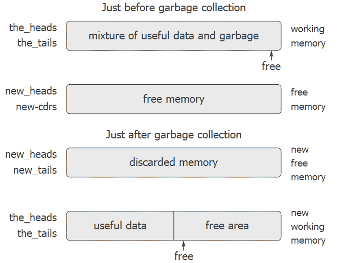

# 5.3.2维护无限内存的错觉

> 译者： [https://sicp.comp.nus.edu.sg/chapters/108](https://sicp.comp.nus.edu.sg/chapters/108)

[5.3.1](107) 节中概述的表示方法解决了实现列表结构的问题，只要我们拥有无限的内存量即可。 有了一台真正的计算机，我们最终将用尽自由空间来构造新的配对。 [[1]](108#footnote-1) 但是，在典型计算中生成的大多数对仅用于保留中间结果。 访问这些结果后，就不再需要这些对，它们是_垃圾_。 例如，计算

```js
accumulate((x, y) => x + y, 0, filter(is_odd, enumerate_interval(0, n)))
```

constructs two lists: the enumeration and the result of filtering the enumeration. When the accumulation is complete, these lists are no longer needed, and the allocated memory can be reclaimed. If we can arrange to collect all the garbage periodically, and if this turns out to recycle memory at about the same rate at which we construct new pairs, we will have preserved the illusion that there is an infinite amount of memory.

为了回收对，我们必须有一种方法来确定不需要分配的对（从它们的内容不再影响计算的未来的意义上来说）。 我们将检查实现此目的的方法称为_垃圾回收_。 垃圾收集基于以下观察结果：在JavaScript解释中的任何时刻，唯一会影响计算未来的对象是通过从指针开始的一系列`head`和`tail`操作可以到达的对象 当前在机器寄存器中。 [[2]](108#footnote-2) 不能回收的任何存储单元都可以回收。

有很多方法可以执行垃圾回收。 我们将在此处检查的方法称为_停止复制_。 基本思想是将内存分为两半：&lt;quote&gt;工作内存&lt;/quote&gt;和&lt;quote&gt;可用内存。&lt;/quote&gt; `pair`构造对时，会将它们分配在工作内存中。 当工作内存已满时，我们通过查找工作内存中的所有有用对并将它们复制到空闲内存中的连续位置中来执行垃圾回收。 （通过从机器寄存器开始跟踪所有`head`和`tail`指针来定位有用的对。）由于我们不复制垃圾，因此可能会有额外的可用内存可用于分配新对。 此外，工作存储器中不需要任何内容​​，因为其中的所有有用对均已复制。 因此，如果我们将工作内存和空闲内存的角色互换，则可以继续进行处理。 新对将分配到新的工作内存（原来的可用内存）中。 完成后，我们可以将有用的对复制到新的可用内存（这是旧的工作内存）中。 [[3]](108#footnote-3)

## 停止复制垃圾收集器的实现

现在，我们使用注册机语言来更详细地描述停止复制算法。 我们将假定存在一个名为`root`的寄存器，其中包含一个指向最终指向所有可访问数据的结构的指针。 可以通过在开始垃圾回收之前将所有机器寄存器的内容存储在`root`指向的预分配列表中来进行安排。 [[4]](108#footnote-4) 我们还假定，除了当前的工作内存之外，还有可用的可用内存可用来复制有用的数据。 当前的工作存储器由向量组成，这些向量的基地址位于称为`the_heads`和`the_tails`的寄存器中，而空闲存储器位于名为`new_heads`和`new_tails`的寄存器中。

当我们用完当前工作内存中的空闲单元时，即，当`pair`操作试图将`free`指针增加到内存向量的末尾时，将触发垃圾回收。 垃圾收集过程完成后，`root`指针将指向新的内存，可从`root`访问的所有对象都将移至新的内存，并且`free`指针将指示下一个位置。 可以分配新对的新内存。 此外，工作内存和新内存的角色将被互换-从`free`指示的位置开始，将在新内存中构造新对，并且（先前的）工作内存将用作新内存。 为下一个垃圾收集。 图 [5.15](108#fig_5.15) 显示了垃圾回收之前和之后的内存排列。

<figure>**[图5.15](108#fig_5.15)** 通过垃圾回收过程重新配置内存。</figure>

垃圾回收过程的状态通过维护两个指针`free`和`scan`来控制。 这些被初始化为指向新内存的开始。 该算法首先将`root`指向的对重新定位到新存储器的开头。 复制该对，将`root`指针调整为指向新位置，并增加`free`指针。 此外，该对的旧位置已标记为表明其内容已被移动。 此标记的完成方式如下：在`head`位置，我们放置一个特殊标签，该信号指示这是一个已移动的对象。 （这种对象传统上称为_破碎的心_。） [[5]](108#footnote-5) 在`tail`位置，我们放置了_转发地址_，该地址指向以下位置 该对象已被移动。

重定位根之后，垃圾收集器进入其基本周期。 在算法的每个步骤中，`scan`指针（最初指向重定位的根）指向已移动到新存储器中的一对，但其`head`和`tail`指针仍引用旧存储器中的对象 。 这些对象分别被重定位，并且`scan`指针增加。 要重新放置一个对象（例如，我们正在扫描的对象对中的`head`指针指示的对象），我们检查该对象是否已被移动（如[[ `head`对象的位置）。 如果尚未移动对象，则将其复制到`free`指示的位置，更新`free`，在该对象的旧位置设置一个破碎的心，然后更新指向该对象的指针（在本示例中， 我们正在扫描的对`head`指针）指向新位置。 如果对象已被移动，则将其转发地址（在破碎的心的`tail`位置中找到）替换为正在扫描的对中的指针。 最终，所有可访问的对象将被移动并扫描，这时`scan`指针将超过`free`指针，并且过程将终止。

我们可以将停止复制算法指定为寄存器机的指令序列。 重新定位对象的基本步骤是通过名为`relocate_old_result_in_new`的子例程完成的。 该子例程从名为`old`的寄存器获取其参数（指向要重定位的对象的指针）。 它重定位指定的对象（在此过程中递增`free`），将指向重定位对象的指针放入称为`new`的寄存器中，然后通过跳转到存储在寄存器`relocate-continue`中的入口点来返回。 要开始垃圾收集，我们在初始化`free`和`scan`之后调用此子例程来重定位`root`指针。 完成`root`的重定位后，我们将新的指针安装为新的`root`，并进入垃圾收集器的主循环。

```js
"begin_garbage_collection",
    assign("free", constant(0)),
    assign("scan", constant(0)),
    assign("old", reg("root")),
    assign("relocate_continue", label("reassign_root")),
    go_to(label("relocate_old_result_in_new")),
"reassign_root",
    assign("root", reg("new")),
    go_to(label("gc_loop")),
```

在垃圾收集器的主循环中，我们必须确定是否还有其他要扫描的对象。 我们通过测试`scan`指针是否与`free`指针一致来实现。 如果指针相等，则所有可访问的对象都已重定位，然后分支到`gc-flip`，它进行了清理，以便我们可以继续中断的计算。 如果仍然有要扫描的对，我们调用relocate子例程来重定位下一对的`head`（通过将`head`指针放在`old`中）。 设置`relocate_continue`寄存器，以便子例程返回以更新`head`指针。

```js
"gc_loop",
    test(list(op("==="), reg("scan"), reg("free"))),
    branch(label("gc_flip")),
    assign("old", list(op("vector_ref"), reg("new_heads"), reg("scan"))),
    assign("relocate_continue", label("update_head")),
    go_to(label("relocate_old_result_in_new")),
```

在`update_head`处，我们修改正在扫描的线对的`head`指针，然后继续重新放置线对的`tail`。 完成该重定位后，我们将返回`update_tail`。 在重新定位并更新了`tail`之后，我们就完成了该对的扫描，因此我们继续执行主循环。

```js
"update_head",
     perform(list(op("vector_set"), reg("new_heads"), reg("scan"), reg("new"))),
     assign("old", list(op("vector_ref"), reg("new_tails"), reg("scan"))),
     assign("relocate_continue", label("update_tail")),
     go_to(label("relocate_old_result_in_new")),

"update_tail",
     perform(list(op("vector_set"), reg("new_tails"), reg("scan"), reg("new"))),
     assign("scan", list(op("+"), reg("scan"), cons(1))),
     go_to(label("gc_loop")),
```

子例程`relocate_old_result_in_new`按如下方式重定位对象：如果要重定位的对象（由`old`指向）不是一对，则我们将相同的指针返回不变的对象（在`new`中）。 （例如，我们可能正在扫描`head`为数字4的一对。如果我们以`n4`表示`head`，请参见 [5.3.1](107)重定位的&lt;/quote&gt; `head`指针仍然是`n4`。）否则，我们必须执行重定位。 如果要重定位的线对的`head`位置包含心碎标签，则该线对实际上已经被移动了，因此我们从心碎的`tail`位置检索转发地址，并返回该地址 在`new`中。 如果`old`中的指针指向尚未移动的对，则将其移动到新内存中的第一个空闲单元（由`free`指向），并通过存储一个破碎的心形标签设置破碎的心，并 转发地址在旧位置。 `Relocate_old_result_in_new`使用寄存器`oldhr`来保持`old`所指向的对象的`head`或`tail`。 [[6]](108#footnote-6)

```js
"relocate_old_result_in_new",
    test(list(op("is_pointer_to_pair"), reg("old"))),
    branch(label("pair")),
    assign("new", reg("old")),
    go_to(reg("relocate_continue")),
"pair",
    assign("oldhr", list(op("vector_ref"), reg("the_heads"), reg("old"))),
    test(list(op("is_broken_heart"), reg("oldhr"))),
    branch(label("already_moved")),
    assign("new", reg("free")),       // new location for pair
    // Update "free" pointer.
    assign("free", list((op("+"), reg(free), cons(1))),
    // Copy the head and tail to new memory
    perform(list(op("vector_set"), 
                 reg("new_heads"), reg("new"), reg("oldhr"))),
    assign("oldhr", list(op("vector_ref"), reg("the_tails"), reg("old"))),
    perform(list(op("vector_set"), 
                 reg("new_tails"), reg("new"), reg("oldhr"))),
    // Construct the broken heart
    perform(list(op("vector_set"),
                 reg("the_heads"), reg("old"), cons("broken_heart"))),
    perform(list(op("vector_set"),
		 reg("the_tails"), reg("old"), reg("new"))),
    go_to(reg("relocate_continue")),
"already_moved",
    assign("new", list(op("vector_ref"), reg("the_tails"), reg("old"))),
    go_to(reg("relocate_continue")),
```

在垃圾回收过程的最后，我们通过交换指针来交换新旧存储器的作用：将`the_heads`与`new_heads`交换，并将`the_tails`与`new_tails`交换。 然后，我们准备在下次内存用尽时执行另一个垃圾回收。

```js
"gc_flip",
    assign("temp", reg("the_tails")),
    assign("the_tails", reg("new_tails")),
    assign("new_tails", reg("temp")),
    assign("temp", reg("the_heads")),
    assign("the_heads", reg("new_heads")),
    assign("new_heads", reg("temp")),
```

* * *

[[1]](108#footnote-link-1) This may not be true eventually, because memories may get large enough so that it would be impossible to run out of free memory in the lifetime of the computer. For example, there are about , microseconds in a year, so if we were to `pair` once per microsecond we would need about  cells of memory to build a machine that could operate for 30 years without running out of memory. That much memory seems absurdly large by today's standards, but it is not physically impossible. On the other hand, processors are getting faster and a future computer may have large numbers of processors operating in parallel on a single memory, so it may be possible to use up memory much faster than we have postulated.

[[2]](108#footnote-link-2) We assume here that the stack is represented as a list as described in section <ref name="sec:memory-as-vectors">[5.3.1](107)</ref>, so that items on the stack are accessible via the pointer in the stack register.

[[3]](108#footnote-link-3) 这个想法是由Minsky发明并首先实施的，这是MIT电子学研究实验室为PDP-1实施Lisp的一部分。 它由Fenichel和Yochelson（1969）进一步开发，用于Multics分时系统的Lisp实现。 后来，贝克（1978）开发了该方法的&lt;quote&gt;实时&lt;/quote&gt;版本，该版本不需要在垃圾收集期间停止计算。 休伊特，利伯曼和穆恩（见Lieberman和Hewitt 1983）扩展了贝克的思想，以利用某些结构更易变而其他结构更持久的事实。

另一种常用的垃圾收集技术是_标记扫描_方法。 这包括跟踪可从机器寄存器访问的所有结构，并标记我们到达的每一对。 然后，我们扫描所有内存，所有未标记的位置将&lt;quote&gt;清除为&lt;/quote&gt;作为垃圾，并可供重用。 可以在 &lt;citation&gt;Allen 1978&lt;/citation&gt; 中找到有关标记扫描方法的完整讨论。

Minsky-Fenichel-Yochelson算法是用于大型内存系统的主要算法，因为它仅检查内存的有用部分。 这与标记扫描相反，在标记扫描中，扫描阶段必须检查所有内存。 停止复制的第二个优点是它是_压缩_垃圾收集器。 也就是说，在垃圾回收阶段结束时，有用数据将被移至连续的内存位置，所有垃圾对均被压缩掉。 在具有虚拟内存的机器中，这可能是极其重要的性能考虑因素，在这种情况下，访问相距很远的内存地址可能需要额外的分页操作。

 [[4]](108#footnote-link-4) This list of registers does not include the registers used by the storage-allocation system—`root`, `the-heads`, `the-tails`, and the other registers that will be introduced in this section.

[[5]](108#footnote-link-5) The term _broken heart_ was coined by David Cressey, who wrote a garbage collector for MDL, a dialect of JavaScript developed at MIT during the early 1970s.

[[6]](108#footnote-link-6) The garbage collector uses the low-level predicate `is_pointer_to_pair` instead of the list-structure operation because in a real system there might be various things that are treated as pairs for garbage-collection purposes. For example, in a JavaScript system that conforms to the ECMAScript standard a function object may be implemented as a special kind of <quote>pair</quote> that doesn't satisfy the `is_pair` predicate. For simulation purposes, `is_pointer_to_pair` can be implemented as `is_pair`.

