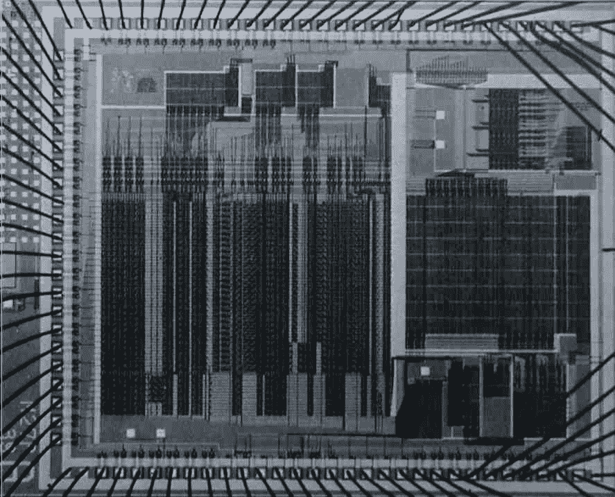

# 5.4显式控制评估者

> 译者： [https://sicp.comp.nus.edu.sg/chapters/109](https://sicp.comp.nus.edu.sg/chapters/109)

Note: this section is a work in progress!

在 [5.1](95)[4.1.1](74)[4.1.4](77)[5.2](101)[5.16](109#fig_5.16) 显示了这样的硬件实现：用作Scheme评估程序的硅芯片，该语言最初是为本书编写的。 寄存器机器的路径和控制器规范，类似于本节中所述的评估器，并使用设计自动化程序来构建集成电路布局。 [[1]](109#footnote-1)

## 寄存器和操作

在设计显式控件评估器时，我们必须指定要在注册机中使用的操作。 我们使用诸如`quoted?`和`make-procedure`之类的抽象语法描述了元圆评估器。 在实现注册机时，我们可以将这些功能扩展为基本列表结构存储操作的序列，并在我们的注册机上实现这些操作。 但是，这会使我们的评估人员变得非常冗长，从而使基本结构的细节难以理解。 为了澄清说明，我们将包括 [4.1.2](75)[4.1.3](76)[4.1.4](77)[5.3节中描述的列表结构实现，将这些操作替换为更多基本操作。](106) 。

<figure>**[Figure 5.16](109#fig_5.16)** A silicon-chip implementation of an evaluator for Scheme.</figure>

我们的源评估程序寄存器机器包括一个堆栈和七个寄存器：`exp`，`env`，`val`，`continue`，`proc`，`argl`和`unev`。 `Exp`用于保存要评估的表达式，`env`包含要执行评估的环境。 评估结束时，`val`包含通过评估指定环境中的表达式而获得的值。 `continue`寄存器用于实现递归，如 [5.1.4](99) 部分所述。 （评估者需要递归调用自身，因为评估表达式需要评估其子表达式。）寄存器`proc`，`argl`和`unev`用于评估组合。

我们将不会提供数据路径图来显示评估器的寄存器和操作是如何连接的，也不会提供机器操作的完整列表。 这些是隐含在评估者的控制器中的，将在后面详细介绍。

* * *

[[1]](109#footnote-link-1) See <citation>Batali et al. 1982</citation> for more information on the chip and the method by which it was designed.

