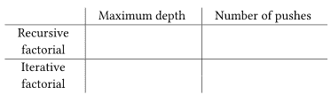
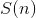

# 5.4.4运行评估器

> 译者： [https://sicp.comp.nus.edu.sg/chapters/113](https://sicp.comp.nus.edu.sg/chapters/113)

随着显式控制评估器的实施，我们从第1章开始发展到最后，在此过程中我们逐步探索了评估过程的更精确模型。 我们从相对非正式的替代模型开始，然后在第3章中将其扩展到环境模型，这使我们能够处理状态和变更。 在第4章的元圆评估器中，我们使用Scheme本身作为一种语言，用于更加明确地表达表达式期间构建的环境结构。 现在，借助寄存器机器，我们仔细研究了评估程序的存储管理，参数传递和控制机制。 在每个新的描述级别上，我们都不得不提出问题并解决以前在较不精确的评估方法中不明显的歧义。 要了解显式控件评估器的行为，我们可以对其进行仿真并监视其性能。

我们将在评估器计算机中安装一个驱动程序循环。 它起到 [4.1.4](77) 部分的`driver_loop`功能的作用。 评估程序将重复打印提示，读取表达式，通过转到`eval_dispatch`评估表达式，然后打印结果。 以下指令构成了显式控制评估器的控制器序列的开始： [[1]](113#footnote-1)

```js
"read_eval_print_loop",
          perform(op("initialize_stack")),
          perform(op("prompt_for_input"), const("/// EC_Eval input:")),
          assign("exp", op("read")),
          assign("env", op("get_global_environment")),
          assign("continue", label("print_result")),
          go_to(label("eval_dispatch")),
          !__  \indcode*{print_result} __>
      "print_result",
          perform(op("announce_output"), const(";;; EC_Eval value:")),
          perform(op("user_print"), reg("val")),
          go_to(label("read_eval_print_loop")),
```

当我们在函数中遇到错误时（例如`apply_dispatch`中指示的&lt;quote&gt;未知函数类型错误&lt;/quote&gt;），我们将输出一条错误消息并返回驱动程序循环。 [[2]](113#footnote-2)

```js
"unknown_expression_type",
          assign("val", const("unknown_expression_type_error")),
          go_to(label("signal_error")),

      "unknown_procedure_type",
          restore("continue"),    /// clean up stack (from apply_dispatch)
          assign(val(const("unknown_procedure_type_error"))),
          go_to(label("signal_error")),

      "signal_error",
          perform(op("user_print"), reg("val")),
          go_to(label("read_eval_print_loop")),
```

为了进行仿真，我们每次都通过驱动程序循环初始化堆栈，因为在错误（例如未定义的变量）中断评估后，堆栈可能不会为空。 [[3]](113#footnote-3)

如果我们结合 [5.4.1](110)[5.4.4](113)[5.2](101) 部分的注册机模拟器运行。

```js
function eceval() {
    return make_machine(list("exp", "env", "val", "proc", "argl", "continue", "unev"),
                        eceval_operations,
                        list(read_eval_print_loop,
                             ... /* entire machine controller as given above */ 
                             ));
}
```

我们必须定义Scheme函数，以模拟评估程序用作原语的操作。 这些功能与我们在 [4.1](73)[5.4](109) ]。

```js
const eceval_operations = 
    list(list("is_self_evaluating", is_self_evaluating),
         ... /* complete list of operations for eceval machine */
         );
```

最后，我们可以初始化全局环境并运行评估程序：

```js
const the_global_environment = setup_environment();

start(eceval);
```

当然，由于涉及到多个模拟级别，因此以这种方式评估表达式所花费的时间要比直接将它们键入到Scheme中的时间长得多。 我们的表达式是由显式控制评估器机器评估的，该机器正在由Scheme程序模拟，该程序本身由Scheme解释器评估。

## 监控评估者的绩效

模拟可以成为指导评估人员实施的强大工具。 通过仿真，不仅可以轻松探索套准机设计的变化，而且可以监视仿真评估器的性能。 例如，性能中的一个重要因素是评估者使用堆栈的效率。 我们可以通过使用收集版本使用统计信息的模拟器版本定义评估器注册机来观察评估各种表达式所需的堆叠操作数（ [5.2.4](105) 部分）， 并在评估者的`print_result`入口点添加一条指令以打印统计信息：

```js
"print_result",
          perform(op("print_stack_statistics")), // added instruction
          perform(op("announce_output"), const("/// EC-Eval value:")),
          /* ... same as before ... */
```

现在，与评估者的交互如下所示：

```js
/// EC-Eval input:
function factorial (n) {
return n === 1 ?
1
n * factorial(n - 1); }
(total-pushes = 3 maximum-depth = 3)
/// EC-Eval value:
ok

/// EC-Eval input:
factorial(5);
(total-pushes = 144 maximum-depth = 28)
/// EC-Eval value:
120
```

请注意，评估程序的驱动程序循环在每次交互开始时都会重新初始化堆栈，因此打印的统计信息将仅引用用于评估先前表达式的堆栈操作。

<exercise>Use the monitored stack to explore the tail-recursive property of the evaluator (section <ref name="sec:sequence-evaluation">[5.4.2](111)</ref>). Start the evaluator and define the iterative `factorial` function from section <ref name="sec:recursion-and-iteration">[1.2.1](12)</ref>:

```js
function factorial(n) {
    function iter(product, counter, max_count) {
        return counter > max_count
               ? product
               : fact_iter(counter * product,
                           counter + 1,
                           max_count);
    }

    return iter(1, 1, n);
}
```

Run the function with some small values of . Record the maximum stack depth and the number of pushes required to compute  for each of these values.

1.  您会发现评估所需的最大深度独立于。 那深度是多少？
2.  根据数据确定的公式，以计算任何的时使用的推送操作总数。 注意，所使用的运算次数是的线性函数，因此由两个常数确定。

<button class="btn btn-secondary solution_btn" data-toggle="collapse" href="#no_solution_113_1_div">Add solution</button>There is currently no solution available for this exercise. This textbook adaptation is a community effort. Do consider contributing by providing a solution for this exercise, using a Pull Request in [Github](https://github.com/source-academy/sicp).</exercise><exercise>For comparison with exercise <ref name="ex:tail-rec-fact">[5.26](113#ex_5.26)</ref>, explore the behavior of the following function for computing factorials recursively:

```js
function factorial(n) {
    return n === 1 
           ? 1
           : n * factorial(n - 1);
}
```

By running this function with the monitored stack, determine, as a function of , the maximum depth of the stack and the total number of pushes used in evaluating  for . (Again, these functions will be linear.) Summarize your experiments by filling in the following table with the appropriate expressions in terms of :  The maximum depth is a measure of the amount of space used by the evaluator in carrying out the computation, and the number of pushes correlates well with the time required.<button class="btn btn-secondary solution_btn" data-toggle="collapse" href="#no_solution_113_1_div">Add solution</button>There is currently no solution available for this exercise. This textbook adaptation is a community effort. Do consider contributing by providing a solution for this exercise, using a Pull Request in [Github](https://github.com/source-academy/sicp).</exercise><exercise>Modify the definition of the evaluator by changing `eval_sequence` as described in section <ref name="sec:sequence-evaluation">[5.4.2](111)</ref> so that the evaluator is no longer tail-recursive. Rerun your experiments from exercises <ref name="ex:tail-rec-fact">[5.26](113#ex_5.26)</ref> and <ref name="ex:rec-fact">[5.27](113#ex_5.27)</ref> to demonstrate that both versions of the `factorial` function now require space that grows linearly with their input.<button class="btn btn-secondary solution_btn" data-toggle="collapse" href="#no_solution_113_1_div">Add solution</button>There is currently no solution available for this exercise. This textbook adaptation is a community effort. Do consider contributing by providing a solution for this exercise, using a Pull Request in [Github](https://github.com/source-academy/sicp).</exercise><exercise>Monitor the stack operations in the tree-recursive Fibonacci computation:

```js
function fib(n) {
    return n  2 ? n : fib(n - 1) + fib(n - 2);
}
```

1.  给出以表示的公式，以计算的所需的最大堆栈深度。 提示：在 [ 1.2.2 ](13) 部分中，我们认为此过程使用的空间与线性增长。
2.  给出用于计算的的推入总数的公式。 您应该发现的推送次数（与使用的时间密切相关）呈指数增长。 提示：假设为计算中使用的推送次数。 您应该可以辩称，存在一个用，和一些固定的&lt;quote&gt;开销&lt;/quote&gt;常数来表示的公式，该常数独立于。 给出公式，然后说什么。 然后表明可以表示为并给出和的值。

<button class="btn btn-secondary solution_btn" data-toggle="collapse" href="#no_solution_113_1_div">Add solution</button>There is currently no solution available for this exercise. This textbook adaptation is a community effort. Do consider contributing by providing a solution for this exercise, using a Pull Request in [Github](https://github.com/source-academy/sicp).</exercise><exercise>Our evaluator currently catches and signals only two kinds of errors—unknown expression types and unknown function types. Other errors will take us out of the evaluator read-eval-print loop. When we run the evaluator using the register-machine simulator, these errors are caught by the underlying Scheme system. This is analogous to the computer crashing when a user program makes an error.[[4]](113#footnote-4) It is a large project to make a real error system work, but it is well worth the effort to understand what is involved here.

1.  评估过程中发生的错误，例如尝试访问未绑定变量的错误，可以通过更改查找操作以使其返回可区分的条件码来捕获，该条件码不能是任何用户变量的可能值。 评估人员可以测试该条件代码，然后执行转到`signal-error`所需的操作。 在评估器中找到所有需要进行此类更改的地方，然后修复它们。 这是很多工作。
2.  更糟糕的是处理通过应用原始函数发出的错误的问题，例如尝试除以零或尝试提取符号的`head`。 在专业编写的高质量系统中，每个原始应用程序都应作为原始程序的一部分进行安全性检查。 例如，每次对`head`的调用都可以首先检查该参数是否为对。 如果参数不是一对，则应用程序将区分的条件代码返回给评估器，然后评估器将报告失败。 我们可以通过对每个原始函数进行适用性检查并在失败时返回适当的可区分条件代码来在我们的注册机模拟器中进行安排。 然后，评估器中的`primitive-apply`代码可以检查条件代码，并在必要时转到`signal-error`。 建立此结构并使之工作。 这是一个重要的项目。

<button class="btn btn-secondary solution_btn" data-toggle="collapse" href="#no_solution_113_1_div">Add solution</button>There is currently no solution available for this exercise. This textbook adaptation is a community effort. Do consider contributing by providing a solution for this exercise, using a Pull Request in [Github](https://github.com/source-academy/sicp).</exercise>

* * *

[[1]](113#footnote-link-1) 我们在这里假设`read`和各种打印操作都可以作为原始机器操作使用，这对于我们的模拟很有用，但在实践中完全不现实。 这些实际上是极其复杂的操作。 在实践中，将使用低级输入输出操作（例如，与设备之间传输单个字符）来实现它们。

为了支持`get_global_environment`操作，我们定义了

```js
const the_global_environment = setup_environment();

function get_global_environment() {
    return the_global_environment;
}
```

 [[2]](113#footnote-link-2) There are other errors that we would like the interpreter to handle, but these are not so simple. See exercise <ref name="ex:interp-errors">[5.30](113#ex_5.30)</ref>.

[[3]](113#footnote-link-3) We could perform the stack initialization only after errors, but doing it in the driver loop will be convenient for monitoring the evaluator's performance, as described below.

[[4]](113#footnote-link-4) Regrettably, this is the normal state of affairs in conventional compiler-based language systems such as C. In UNIX the system <quote>dumps core,</quote> and in DOS/Windows it becomes catatonic. The Macintosh displays a picture of an exploding bomb and offers you the opportunity to reboot the computer—if you're lucky.

