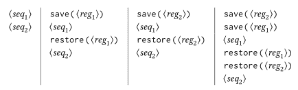

# 5.5.1编译器的结构

> 译者： [https://sicp.comp.nus.edu.sg/chapters/115](https://sicp.comp.nus.edu.sg/chapters/115)

在 [4.1.7](80) 部分中，我们修改了原始的元圆解释器，以将分析与执行分开。 我们分析了每个表达式以产生一个执行函数，该执行函数将环境作为参数并执行所需的操作。 在我们的编译器中，我们将进行基本相同的分析。 但是，我们将不生成执行功能，而是生成将由我们的寄存器机运行的指令序列。

函数`compile`是编译器中的顶级调度。 它对应于 [4.1.1](74)[4.1.7](80)[5.4.1](110)[4.1.2](75) 节中定义的表达式语法函数。 [[1]](115#footnote-1) `Compile`对要编译的表达式的句法类型进行案例分析。 对于每种类型的表达式，它都会调度到专门的_代码生成器_：

```js
function compile(exp, target, linkage) {
    return is_self-evaluating(exp)
        ? compile_self_evaluating(exp, target, linkage)
        : is_quoted(exp)
        ? compile_quoted(exp, target, linkage)
        : is_variable(exp)
        ? compile_variable(exp, target, linkage)
        : is_assignment(exp)
        ? compile_assignment(exp, target, linkage)
        : is_definition(exp)
        ? compile_definition(exp, target, linkage)
        : is_conditional_expression(exp)
        ? compile(cond_if(exp), target, linkage)
        : is_function_expression(exp)
        ? compile_function_expression(exp, target, linkage)
        : is_block(exp)
        ? compile_block(begin_actions(exp), target, linkage)
        : is_conditional_statement(exp)
        ? compile_conditional_statement(exp, target, linkage)
        : is_application(exp)
        ? compile_application(exp, target, linkage)
        : error(exp, "Unknown expression type - - COMPILE");
}
```

## 目标与联系

`Compile`及其调用的代码生成器除了要编译的表达式外，还接受两个参数。 有一个_目标_，它指定寄存器，编译后的代码将在该寄存器中返回表达式的值。 还有一个_链接描述符_，它描述了表达式编译完成后应如何进行处理。 链接描述符可以要求代码执行以下三件事之一：

*   继续按顺序执行下一条指令（由链接描述符`next`指定），
*   从正在编译的函数返回（由链接描述符`return`指定），或者
*   跳转到一个命名的入口点（通过使用指定的标签作为链接描述符来指定）。

例如，用`val`寄存器的目标和`next`的链接编译表达式`5`（它是自评估的）应该产生指令

```js
assign("val", constant(5));
```

用`return`的链接编译相同的表达式应产生指令

```js
assign("val", constant(5));
      go_to(reg("continue"));
```

在第一种情况下，将继续执行序列中的下一条指令。 在第二种情况下，我们将从函数调用中返回。 在这两种情况下，表达式的值都会放入目标`val`寄存器中。

## 指令序列和堆栈使用

每个代码生成器都返回一个_指令序列_，其中包含已为该表达式生成的目标代码。 复合表达式的代码生成是通过组合来自简单表达式生成器的用于组件表达式的输出来完成的，就像通过评估组件表达式来完成复合表达式的评估一样。

组合指令序列的最简单方法是称为`append_instruction_sequences`的函数。 它以要依次执行的任意数量的指令序列为参数。 它追加它们并返回组合的序列。 也就是说，如果和是指令序列，则评估`append_instruction_sequences(, );`会产生序列` `

每当可能需要保存寄存器时，编译器的代码生成器都会使用`preserving`，这是一种用于组合指令序列的更微妙的方法。 `Preserving`具有三个参数：一组寄存器和两个要顺序执行的指令序列。 它以如下方式附加序列：如果执行第二个序列需要在执行第一个序列时保留集合中每个寄存器的内容。 也就是说，如果第一个序列修改了寄存器，而第二个序列实际上需要寄存器的原始内容，则`preserving`会在追加序列之前将寄存器的`save`和`restore`包裹在第一个序列周围。 否则，`preserving`仅返回附加的指令序列。 因此，例如，`preserving(list(, ), , );`产生以下四个指令序列之一，具体取决于和如何使用和：

<split></split> 

通过使用`preserving`组合指令序列，编译器可以避免不必要的堆栈操作。 这也隔离了是否在`preserving`函数中生成`save`和`restore`指令的细节，将它们与编写每个单独的代码生成器时所引起的关注区分开了。 实际上，代码生成器没有明确生成`save`或`restore`指令。

原则上，我们可以简单地将指令序列表示为指令列表。 然后`Append_instruction_sequences`可以通过执行普通列表`append`组合指令序列。 但是，`preserving`将是一个复杂的操作，因为它必须分析每个指令序列以确定该指令如何使用其寄存器。 `Preserving`不仅效率低下而且复杂，因为它必须分析其每个指令序列参数，即使这些序列本身可能是通过调用`preserving`构造的，在这种情况下，它们的各个部分也已经被分析了 。 为避免这种重复分析，我们将与每个指令序列关联一些有关其寄存器使用的信息。 当我们构造基本指令序列时，我们将明确提供此信息，并且组合指令序列的功能将从与组件序列相关的信息中得出组合序列的寄存器使用信息。

指令序列将包含三部分信息：

*   在执行序列中的指令之前必须初始化的一组寄存器（这些寄存器被称为序列需要的），
*   一组寄存器，其值由序列中的指令修改，并且
*   序列中的实际指令（也称为_语句_）。

我们将一个指令序列表示为它的三个部分的列表。 因此，指令序列的构造函数为

```js
function make_instruction_sequence(needs, modifies, statements) {
    return list(needs, modifies,statements);
}
```

例如，两条指令序列在当前环境中查找变量`x`的值，然后将结果分配给`val`，然后返回，需要初始化寄存器`env`和`continue`， 并修改寄存器`val`。 因此，该序列将被构造为

```js
make_instruction_sequence(list("env", "continue"),
                          list("val"),
                          list(assign("val", op("lookup_variable_value"), constant("x"), reg("env")),
                               go_to(reg("continue"))));
```

有时我们需要构造不带任何语句的指令序列：

```js
function empty_instruction_sequence() {
    return make_instruction_sequence(list(), list(), list());
}
```

组合指令序列的功能在 [5.5.4](118) 部分中显示。

<exercise>In evaluating a function application, the explicit-control evaluator always saves and restores the `env` register around the evaluation of the operator, saves and restores `env` around the evaluation of each operand (except the final one), saves and restores `argl` around the evaluation of each operand, and saves and restores `proc` around the evaluation of the operand sequence. For each of the following combinations, say which of these `save` and `restore` operations are superfluous and thus could be eliminated by the compiler's `preserving` mechanism:<button class="btn btn-secondary solution_btn" data-toggle="collapse" href="#no_solution_115_1_div">Add solution</button>There is currently no solution available for this exercise. This textbook adaptation is a community effort. Do consider contributing by providing a solution for this exercise, using a Pull Request in [Github](https://github.com/source-academy/sicp).</exercise><exercise>Using the `preserving` mechanism, the compiler will avoid saving and restoring `env` around the evaluation of the operator of a combination in the case where the operator is a symbol. We could also build such optimizations into the evaluator. Indeed, the explicit-control evaluator of section <ref name="sec:eceval">[5.4](109)</ref> already performs a similar optimization, by treating combinations with no operands as a special case.

1.  扩展显式控件评估器，以将运算符为符号的组合识别为单独的表达式类别，并在评估此类表达式时利用这一事实。
2.  Alyssa P. Hacker建议，通过扩展评估程序以识别越来越多的特殊情况，我们可以合并所有编译器的优化，并且这将完全消除编译的优势。 您如何看待这个想法？

<button class="btn btn-secondary solution_btn" data-toggle="collapse" href="#no_solution_115_1_div">Add solution</button>There is currently no solution available for this exercise. This textbook adaptation is a community effort. Do consider contributing by providing a solution for this exercise, using a Pull Request in [Github](https://github.com/source-academy/sicp).</exercise>

* * *

[[1]](115#footnote-link-1) Notice, however, that our compiler is a Scheme program, and the syntax functions that it uses to manipulate expressions are the actual Scheme functions used with the metacircular evaluator. For the explicit-control evaluator, in contrast, we assumed that equivalent syntax operations were available as operations for the register machine. (Of course, when we simulated the register machine in Scheme, we used the actual Scheme functions in our register machine simulation.)

