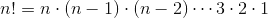
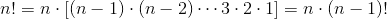
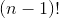
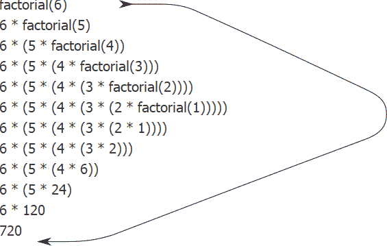
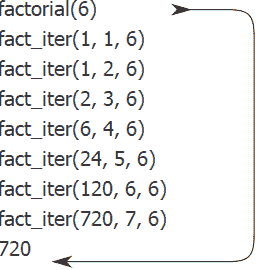
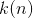
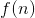
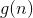
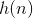
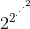

# 1.2.1线性递归和迭代

> 译者： [https://sicp.comp.nus.edu.sg/chapters/12](https://sicp.comp.nus.edu.sg/chapters/12)

我们首先考虑由定义的阶乘函数。有许多计算阶乘的方法。 一种方法是利用以下观察值：对于任何正整数，，等于乘以：因此，我们可以通过计算并将其乘以来计算。 的结果。 如果加上1的规定！ 等于1，该观察结果直接转换为一个函数：

```js
function factorial(n) {
    return n === 1 
           ? 1
           : n * factorial(n - 1);
}
```

 <split><figure>**[Figure 1.3](12#fig_1.3)** A linear recursive process for computing 6!.</figure>

我们可以使用 [1.1.5](7)[1.3](12#fig_1.3) 所示。 。</split> 

现在让我们对计算阶乘采取不同的观点。 我们可以通过指定首先将1乘以2，然后将结果乘以3，然后乘以4，依此类推，直到达到，来描述计算的规则。 更正式地说，我们维护一个正在运行的产品，以及一个从1到的计数器。 我们可以通过说计数器和乘积根据规则同时从一个步骤更改到另一个步骤来描述计算

产品计数器产品

计数器计数器 1

and stipulating that  is the value of the product when the counter exceeds .

再一次，我们可以将描述重塑为计算阶乘的函数： [[1]](12#footnote-1)

```js
function factorial(n) {
    return fact_iter(1, 1, n);
}
function fact_iter(product, counter, max_count) {
    return counter > max_count
           ? product
           : fact_iter(counter * product,
                       counter + 1,
                       max_count);
}
```

 <split><figure>**[Figure 1.4](12#fig_1.4)** A linear iterative process for computing .</figure>

和以前一样，我们可以使用替换模型来可视化计算的过程，如图 [ 1.4 ](12#fig_1.4) 所示。</split> 

比较两个过程。 从一种观点看，它们似乎一点都没有什么不同。 两者都在相同域上计算相同的数学函数，并且每个都需要与成比例的多个步骤才能计算。 实际上，两个过程甚至都执行相同的乘法序列，从而获得相同的部分乘积序列。 另一方面，当我们考虑这两个过程的&lt;quote&gt;形状&lt;/quote&gt;时，我们发现它们的演化完全不同。

考虑第一个过程。 取代模型显示了扩张后紧缩的形状，如图 [1.3](12#fig_1.3) 中的箭头所示。 扩展发生在进程建立_延迟操作_链（在这种情况下，是乘法链）的过程中。 收缩发生在实际执行操作时。 以一系列延迟操作为特征的此类过程称为_递归过程_。 执行此过程需要解释器跟踪以后要执行的操作。 在的计算中，延迟乘法链的长度以及跟踪它所需的信息量随线性增长（与成正比），就像 脚步。 这种过程称为_线性递归过程_。

相反，第二个过程不会增长和收缩。 在每个步骤中，对于任何，我们需要跟踪的是名称`product`，`counter`和`max_count`的当前值。 我们称其为_迭代过程_。 通常，迭代过程是这样一种迭代过程，其状态可以通过固定数量的_状态名称_的值以及描述该过程中应如何更新状态名称的值的固定规则来概括 从一个状态到另一个状态，以及一个（可选的）最终测试，该测试指定了终止过程的条件。 在计算时，所需的步数随线性增长。 这样的过程称为_线性迭代过程_。

可以用另一种方式看到这两个过程之间的对比。 在迭代情况下，状态名称的值在任何时候都提供对进程状态的完整描述。 如果我们在步骤之间停止了计算，则恢复计算所需要做的就是为解释器提供三个状态名称的值。 递归过程并非如此。 在这种情况下，有一些附加的&lt;quote&gt;隐藏的&lt;/quote&gt;信息，由解释器维护，并且不包含在状态名称中，这表示&lt;quote&gt;，在协商延迟操作链时，过程为&lt;/quote&gt;。 链越长，必须维护的信息越多。 [[2]](12#footnote-2)

与迭代和递归相反，我们必须小心不要将递归_进程_的概念与递归_函数_的概念混淆。 当我们将函数描述为递归时，我们指的是语法声明，即函数声明直接（或间接）指向函数本身。 但是，当我们将流程描述为遵循线性递归的模式时，我们所谈论的是流程的发展方式，而不是函数编写方式的语法。 我们将诸如`fact_iter`之类的递归函数称为生成迭代过程似乎令人不安。 但是，该过程实际上是迭代的：其状态由其三个状态名称完全捕获，并且解释器只需跟踪三个名称即可执行该过程。

流程和过程之间的区别可能造成混淆的一个原因是，大多数通用语言的实现（包括Ada，Pascal和C）的设计方式都是，对任何递归函数的解释都消耗了随着 即使原则上描述的过程是迭代的，函数调用的数量也是如此。 结果，这些语言只能通过使用特殊的&lt;quote&gt;循环结构&lt;/quote&gt;（例如`do`，`repeat`，`until`，`for`和`while`）来描述迭代过程。 我们将在第5章中考虑的JavaScript实现不存在此缺陷。 即使迭代过程由递归函数描述，它也会在恒定空间中执行迭代过程。 具有此属性的实现称为_尾递归_。 通过尾递归实现，可以使用普通的函数调用机制来表示迭代，因此特殊的迭代构造仅可用作语法糖。 [[3]](12#footnote-3)

<exercise>Each of the following two functions defines a method for adding two positive integers in terms of the functions `inc`, which increments its argument by 1, and `dec`, which decrements its argument by 1.

```js
function plus(a, b) {
    return a === 0 ? b : inc(plus(dec(a), b)); 
}
```

```js
function plus(a, b) {
    return a === 0 ? b : plus(dec(a), inc(b));
}
```

Using the substitution model, illustrate the process generated by each function in evaluating `plus(4, 5);`. Are these processes iterative or recursive?<button class="btn btn-secondary solution_btn" data-toggle="collapse" href="#solution_12_1_div">Solution</button><solution><split>The process generated by the first procedure is recursive.

```js
plus(4, 5)
4 === 0 ? 5 : inc(plus(dec(4), 5))
inc(plus(dec(4), 5))
...
inc(plus(3, 5))
...
inc(inc(plus(2, 5)))
...
inc(inc(inc(plus(1, 5))))
...
inc(inc(inc(inc(plus(0, 5)))))
inc(inc(inc(inc( 0 === 0 ? 5 : inc(plus(dec(0), 5))))))
inc(inc(inc(inc( 5 ))))
inc(inc(inc( 6 )))
inc(inc( 7 ))
inc( 8 )
9
```

The process generated by the second procedure is iterative.

```js
plus(4, 5)
4 === 0 ? 5 : plus(dec(4), inc(5))
plus(dec(4), inc(5))
...
plus(3, 6)
...
plus(2, 7)
...
plus(1, 8)
...
plus(0, 9)
0 === 0 ? 9 : plus(dec(0), inc(9))
9
```</split></solution></exercise> <exercise>The following function computes a mathematical function called Ackermann's function.

```js
function A(x,y) {
    return y === 0
           ? 0
           : x === 0
             ? 2 * y
             : y === 1
               ? 2
               : A(x - 1, A(x, y - 1));
}
```

What are the values of the following expressions?

```js
A(1, 10);
```

```js
A(2, 4);
```

```js
A(3, 3);
```

Consider the following functions, where `A` is the function declared above:

```js
function f(n) {
    return A(0, n);
}
function g(n) {
    return A(1, n);
}
function h(n) {
    return A(2, n);
}
function k(n) {
   return 5 * n * n;
}
```

Give concise mathematical definitions for the functions computed by the functions `f`, `g`, and `h` for positive integer values of . For example,  computes .<button class="btn btn-secondary solution_btn" data-toggle="collapse" href="#solution_12_2_div">Solution</button><solution>The function  computes , the function  computes , and the function  computes  where the number of 2s in the chain of exponentiation is .</solution></exercise>

* * *

[[1]](12#footnote-link-1) In a real program we would probably use the block structure introduced in the last section to hide the declaration of `fact_iter`:

```js
function factorial(n) {
    function iter(product, counter) {
        return counter > n 
               ? product
               : iter(counter * product,
                      counter + 1);
   }
   return iter(1, 1);
}
```

We avoided doing this here so as to minimize the number of things to think about at once.

[[2]](12#footnote-link-2) When we discuss the implementation of functions on register machines in chapter 5, we will see that any iterative process can be realized <quote>in hardware</quote> as a machine that has a fixed set of registers and no auxiliary memory. In contrast, realizing a recursive process requires a machine that uses an auxiliary data structure known as a _stack_.

[[3]](12#footnote-link-3) Tail recursion has long been known as a compiler optimization trick. A coherent semantic basis for tail recursion was provided by Carl Hewitt (1977), who explained it in terms of the <quote>message-passing</quote> model of computation that we shall discuss in chapter 3\. Inspired by this, Gerald Jay Sussman and Guy Lewis Steele Jr. (see <citation>Steele 1975</citation>) constructed a tail-recursive interpreter for Scheme. Steele later showed how tail recursion is a consequence of the natural way to compile function calls (<citation>Steele 1977</citation>). The IEEE standard for Scheme requires that Scheme implementations be tail-recursive. The ECMA standard for JavaScript eventually followed suit with ECMAScript 2015 (<citation>ECMA 2015</citation>). Note however, that as of this writing (2019), most implementations of JavaScript do not comply with this standard.

