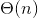
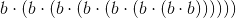
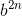
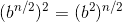

# 1.2.4求幂

> 译者： [https://sicp.comp.nus.edu.sg/chapters/15](https://sicp.comp.nus.edu.sg/chapters/15)

考虑计算给定指数的问题。 我们想要一个以基数和正整数指数作为参数并计算的函数。 一种方法是通过递归定义\ begin {eqnarray *} b ^ {n} & = & b \ cdot b ^ {n-1} \\ b ^ {0} & = & 1 \ end {eqnarray *}可以轻松转换为函数

```js
function expt(b,n) {
    return n === 0
           ? 1
           : b * expt(b, n - 1);
}
```

这是一个线性递归过程，需要步骤和空间。 与阶乘一样，我们可以轻松地制定等效的线性迭代：

```js
function expt(b,n) {
    return expt_iter(b,n,1);
}
function expt_iter(b,counter,product) {
    return counter === 0
           ? product
           : expt_iter(b,
                       counter - 1, 
                       b * product);
}
```

This version requires  steps and  space.

通过使用连续平方，我们可以用更少的步骤来计算指数。 例如，我们可以使用三个乘法来计算而不是：\ begin {eqnarray *} b ^ {2} & = & b \ cdot b \\ b ^ {4} & = & b ^ {2} \ cdot b ^ {2} \\ b ^ {8} & = & b ^ {4} \ cdot b ^ {4} \ end {eqnarray * }

此方法适用于2的幂的指数。如果使用规则![%0A%20%20%20%20%20%20%20%20%20%20%20%20%20%20%5Cbegin%7Barray%7D%7Bll%7D%0A%20%20%20%20%20%20%20%20%20%20%20%20%20%20b%5E%7Bn%7D%20%3D%28b%5E%7Bn%2F2%7D%29%5E%7B2%7D%20%20%26%20%5Cmbox%7B~if%20%3Cimg%20alt%3D%22n%22%20src%3D%22https%3A%2F%2Fwww.zhihu.com%2Fequation%3Ftex%3Dn%22%20%2F%3E%20is%20even%7D%5C%5C%0A%20%20%20%20%20%20%20%20%20%20%20%20%20%20b%5E%7Bn%7D%20%3Db%5Ccdot%20b%5E%7Bn-1%7D%20%26%20%5Cmbox%7B~if%20%3Cimg%20alt%3D%22n%22%20src%3D%22https%3A%2F%2Fwww.zhihu.com%2Fequation%3Ftex%3Dn%22%20%2F%3E%20is%20odd%7D%5C%5C%0A%20%20%20%20%20%20%20%20%20%20%20%20%20%20%5Cend%7Barray%7D%0A%20%20%20%20%20%20%20%20%20%20%20%20%20%20](img/9203dcb0423b3d0135bd45af8237578e.jpg)，我们通常还可以利用连续平方来计算指数，我们可以将该函数表示为函数：

```js
function fast_expt(b, n) {
    return n === 0
           ? 1
           : is_even(n)
             ? square(fast_expt(b, n / 2))
             : b * fast_expt(b, n - 1);
}
```

where the predicate to test whether an integer is even is defined in terms of the operator `%`, which computes the remainder after integer division, by

```js
function is_even(n) {
    return n % 2 === 0;
}
```

`fast_expt`演化的过程在空间和步数上与呈对数增长。 为此，请注意，使用`fast_expt`计算仅比计算多一个乘法。 因此，我们允许的每一个新乘法都可以计算出指数的大小加倍（大约）。 因此，指数所需的乘法数增长速度与对数以2为底的对数增长一样快。该过程具有增长。 [ [1]](15#footnote-1)

随着变大，增长和增长之间的差异变得惊人。 例如，的`fast_expt`仅需要14个乘法。 [[2]](15#footnote-2) 也可以使用连续平方的思想来设计一种迭代算法，该算法以对数步数计算指数（请参阅练习 [ 1.16 ](15#ex_1.16) ），尽管这与迭代算法通常一样，但它没有像递归算法那样简单地写下来。 [ [3]](15#footnote-3)

<exercise>Design a function that evolves an iterative exponentiation process that uses successive squaring and uses a logarithmic number of steps, as does `fast_expt`. (Hint: Using the observation that , keep, along with the exponent  and the base , an additional state name , and define the state transformation in such a way that the product  is unchanged from state to state. At the beginning of the process  is taken to be 1, and the answer is given by the value of  at the end of the process. In general, the technique of defining an _invariant quantity_ that remains unchanged from state to state is a powerful way to think about the design of iterative algorithms.)<button class="btn btn-secondary solution_btn" data-toggle="collapse" href="#solution_15_1_div">Solution</button> <solution>```js
function fast_expt_iter(a, b, n){
    return n === 0
           ? a
           : is_even(n)
             ? fast_expt_iter(a, b * b, n / 2)
             : fast_expt_iter(a * b, b, n - 1);
}
function fast_expt(b, n){
    return fast_expt_iter(1, b, n);
}
```</solution></exercise> <exercise>The exponentiation algorithms in this section are based on performing exponentiation by means of repeated multiplication. In a similar way, one can perform integer multiplication by means of repeated addition. The following multiplication function (in which it is assumed that our language can only add, not multiply) is analogous to the `expt` function:

```js
function times(a,b) {
    return b === 0
           ? 0
           : a + times(a, b - 1);
}
```

This algorithm takes a number of steps that is linear in `b`. Now suppose we include, together with addition, operations `double`, which doubles an integer, and `halve`, which divides an (even) integer by 2\. Using these, design a multiplication function analogous to `fast_expt` that uses a logarithmic number of steps.<button class="btn btn-secondary solution_btn" data-toggle="collapse" href="#solution_15_2_div">Solution</button> <solution>```js
function double(x) {
    return x + x;
}

function halve(x) {
    return x / 2;
}

function fast_times(a, b) { 
    return b === 1
           ? a
           : a === 0 || b === 0
             ? 0
             : is_even(b)
               ? double(fast_times(a, halve(b)))
               : a + fast_times(a, b - 1);
}
```</solution></exercise> <exercise>Using the results of exercises <ref name="ex:iter-expon-pro">[1.16](15#ex_1.16)</ref> and <ref name="ex:add-expon">[1.17](15#ex_1.17)</ref>, devise a function that generates an iterative process for multiplying two integers in terms of adding, doubling, and halving and uses a logarithmic number of steps.[[4]](15#footnote-4)<button class="btn btn-secondary solution_btn" data-toggle="collapse" href="#solution_15_3_div">Solution</button> <solution>```js
function double(x) {
    return x + x;
}

function half(x) {
    return x / 2;
}

function fast_times_iter(total, a, b) {
    return b === 1
           ? total + a
           : a === 0 || b===0
             ? 0
             : is_even(b)
               ? fast_times_iter(total, double(a), half(b))
               : fast_times_iter(total + a, a, b - 1);
}

function times(a, b) {
  return fast_times_iter(0, a, b);
}
```</solution></exercise> <exercise>There is a clever algorithm for computing the Fibonacci numbers in a logarithmic number of steps. Recall the transformation of the state names  and  in the `fib_iter` process of section <ref name="sec:tree-recursion">[1.2.2](13)</ref>:  and  over and over again  times, starting with 1 and 0, produces the pair  and . In other words, the Fibonacci numbers are produced by applying , the th power of the transformation , starting with the pair . Now consider  to be the special case of  and  in a family of transformations , where  transforms the pair  according to  and . Show that if we apply such a transformation  twice, the effect is the same as using a single transformation  of the same form, and compute  and  in terms of  and . This gives us an explicit way to square these transformations, and thus we can compute  using successive squaring, as in the `fast_expt` function. Put this all together to complete the following function, which runs in a logarithmic number of steps:[[5]](15#footnote-5)

```js
function fib(n) {
    return fib_iter(1,0,0,1,n);
}
function fib_iter(a,b,p,q,count) {
    return count === 0
           ? b
           : is_even(count)
             ? fib_iter(a,
                        b,
                        ??,           // compute p'
                        ??,           // compute q'
                        count / 2)
             : fib_iter(b * q + a * q + a * p,
                        b * p + a * q,
                        p,
                        q,
                        count - 1);
}
```

<button class="btn btn-secondary solution_btn" data-toggle="collapse" href="#solution_15_4_div">Solution</button> <solution>```js
function fib(n) {
    return fib_iter(1, 0, 0, 1, n);
}

function fib_iter(a, b, p, q, count) {
    return count === 0
           ? b
           : is_even(count)
             ? fib_iter(a,
   	                b,
	                p * p + q * q,
	                2 * p * q + q * q,
	                count / 2)
             : fib_iter(b * q + a * q + a * p,
                        b * p + a * q,
                        p,
                        q,
                        count - 1);
}
```</solution></exercise> 

* * *

[[1]](15#footnote-link-1) More precisely, the number of multiplications required is equal to 1 less than the log base 2 of , plus the number of ones in the binary representation of . This total is always less than twice the log base 2 of . The arbitrary constants  and  in the definition of order notation imply that, for a logarithmic process, the base to which logarithms are taken does not matter, so all such processes are described as .

[[2]](15#footnote-link-2) You may wonder why anyone would care about raising numbers to the 1000th power. See section <ref name="sec:primality">[1.2.6](17)</ref>.

[[3]](15#footnote-link-3) This iterative algorithm is ancient. It appears in the _Chandah-sutra_ by Áchárya, written before 200 <sc>b.c</sc>. See <citation>Knuth 1981</citation>, section 4.6.3, for a full discussion and analysis of this and other methods of exponentiation.

[[4]](15#footnote-link-4) This algorithm, which is sometimes known as the <quote>Russian peasant method</quote> of multiplication, is ancient. Examples of its use are found in the Rhind Papyrus, one of the two oldest mathematical documents in existence, written about 1700 <sc>b.c.</sc> (and copied from an even older document) by an Egyptian scribe named A'h-mose.

[[5]](15#footnote-link-5) This exercise was suggested to us by Joe Stoy, based on an example in <citation>Kaldewaij 1990</citation>.

