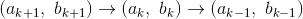

# 1.2.5最大公约数

> 译者： [https://sicp.comp.nus.edu.sg/chapters/16](https://sicp.comp.nus.edu.sg/chapters/16)

将两个整数和的最大公约数（GCD）定义为最大整数，该整数将和均除而无余数。 例如，16和28的GCD为4.在第2章中，当我们研究如何实现有理数算法时，我们将需要能够计算GCD以便将有理数减少到最低限度。 （要将有理数减少到最低的项，我们必须将分子和分母除以它们的GCD。例如，将16/28减为4/7。）找到两个整数的GCD的一种方法是将它们乘以因子，然后求和。 搜索常见因素，但是有一种著名的算法效率更高。

该算法的思想基于以下观察：如果除以时余数为，则和的公因数与公因数完全相同 和的定义。 因此，我们可以使用等式来将计算GCD的问题逐步减少到计算越来越小的整数对的GCD的问题。 例如，\ begin {eqnarray *} \ textrm {GCD}（206,40）& = & \ textrm {GCD}（40,6）\\ & = & \ textrm {GCD} （6,4）\\ & = & \ textrm {GCD}（4,2）\\ & = & \ textrm {GCD}（2,0）\\ & = & 2 \ end {eqnarray *}将减小为，即2。可能显示从任何两个正整数开始并进行重复的归约总是会最终产生一个对，其中第二个数字为0 然后，GCD是该对中的另一个数字。 这种用于计算GCD的方法称为 _Euclid算法_。 [ [1]](16#footnote-1)

将欧几里得算法很容易表达为一个函数：

```js
function gcd(a, b) {
    return b === 0 ? a : gcd(b, a % b);
}
```

这将生成一个迭代过程，其步数随着所涉及数字的对数而增加。

Euclid算法所需的步数具有对数增长的事实与斐波那契数具有有趣的关系：

**Lamé定理：**如果欧几里得算法要求步骤来计算某对的GCD，则该对中较小的数字必须大于或等于第个斐波那契数。 [ [2]](16#footnote-2)

我们可以使用该定理来获得Euclid算法的增长阶估计。 令为该函数的两个输入中的较小者。 如果该过程采取步骤，那么我们必须具有。 因此，步数随着的对数增长（以为底）。 因此，生长顺序为。

<exercise>The process that a function generates is of course dependent on the rules used by the interpreter. As an example, consider the iterative `gcd` function given above. Suppose we were to interpret this function using normal-order evaluation, as discussed in section <ref name="sec:substitution-model">[1.1.5](7)</ref>. (The normal-order-evaluation rule for `if` is described in exercise <ref name="ex:normal-order-vs-appl-order-test">[1.5](8#ex_1.5)</ref>.) Using the substitution method (for normal order), illustrate the process generated in evaluating `gcd(206, 40)` and indicate the remainder operations that are actually performed. How many remainder operations are actually performed in the normal-order evaluation of `gcd(206, 40)`? In the applicative-order evaluation?<button class="btn btn-secondary solution_btn" data-toggle="collapse" href="#solution_16_1_div">Solution</button> <solution><split>1.  使用正常顺序评估，该过程将进行18次余数运算。 14在评估条件的同时，在最终还原阶段休息。

    ```js
    gcd(206, 40)
    40 === 0 ? 206 : gcd(40, 206 % 40)
    gcd(40, 206 % 40)
    206 % 40 === 0 ? 40 : gcd(206 % 40,
                              40 % (206 % 40))
    // remainder operation (1)
    6 === 0 ? 40 : gcd(206 % 40,
                       40 % (206 % 40))
    gcd(206 % 40, 40 % (206 % 40))
    40 % (206 % 40) === 0 
        ? 206 % 40 
        : gcd(40 % (206 % 40),
              (206 % 40) % (40 % (206 % 40)))
    // remainder operations (2) and (3)
    4 === 0 
        ? 206 % 40 
        : gcd(40 % (206 % 40),
              (206 % 40) % (40 % (206 % 40)))
    gcd(40 % (206 % 40), (206 % 40) % (40 % (206 % 40)))
    (206 % 40) % (40 % (206 % 40)) === 0 
        ? 40 % (206 % 40)
        : gcd((206 % 40) % (40 % (206 % 40)), 
              (40 % (206 % 40)) % ((206 % 40) % (40 % 
                                                 (206 % 40)))
    // remainder operations (4), (5), (6), (7)
    2 === 0
        ? 40 % (206 % 40)
        : gcd((206 % 40) % (40 % (206 % 40)), 
              (40 % (206 % 40)) % ((206 % 40) % (40 % 
                                                 (206 % 40))))
    gcd((206 % 40) % (40 % (206 % 40)), 
        (40 % (206 % 40)) % ((206 % 40) % (40 % (206 % 40)))
    (40 % (206 % 40)) % ((206 % 40) % (40 % (206 % 40))) === 0
        ? (206 % 40) % (40 % (206 % 40)) 
        : gcd((40 % (206 % 40)) % ((206 % 40) % (40 % 
                                                 (206 % 40)),
              ((206 % 40) % (40 % (206 % 40))) %
              ((40 % (206 % 40)) % ((206 % 40) % (40 % 
                                                 (206 % 40))))
    // remainder operations 
                        (8), (9), (10), (11), (12), (13), (14)
    0 === 0
        ? (206 % 40) % (40 % (206 % 40)) 
        : gcd((40 % (206 % 40)) % ((206 % 40) % (40 % 
                                                 (206 % 40)),
              ((206 % 40) % (40 % (206 % 40))) %
              ((40 % (206 % 40)) % ((206 % 40) % (40 % 
                                                 (206 % 40))))
    (206 % 40) % (40 % (206 % 40))    
    // remainder operations (15), (16), (17), (18)
    2
    ```

2.  使用应用程序订单评估，该过程执行4个剩余操作。

    ```js
    gcd(206, 40)
    40 === 0 ? 206 : gcd(40, 206 % 40)
    gcd(40, 206 % 40)
    // remainder operation (1)
    gcd(40, 6)
    6 === 0 ? 40 : gcd(6, 40 % 6)
    gcd(6, 40 % 6)
    // remainder operation (2)
    gcd(6, 4)
    4 === 0 ? 6 : gcd(4, 6 % 4)
    gcd(4, 6 % 4)
    // remainder operation (3)
    gcd(4, 2)
    2 === 0 ? 4 : gcd(2, 4 % 2)
    gcd(2, 4 % 2)
    // remainder operation (4)
    gcd(2, 0)
    0 === 0 ? 2 : gcd(0, 2 % 0)
    2
    ```</split></solution></exercise> 

* * *

[[1]](16#footnote-link-1) Euclid's Algorithm is so called because it appears in Euclid's _Elements_ (Book 7, ca. 300 <sc>b.c</sc>. According to Knuth (1973), it can be considered the oldest known nontrivial algorithm. The ancient Egyptian method of multiplication (exercise <ref name="ex:it-pro-mult-int">[1.18](15#ex_1.18)</ref>) is surely older, but, as Knuth explains, Euclid's algorithm is the oldest known to have been presented as a general algorithm, rather than as a set of illustrative examples.

[[2]](16#footnote-link-2) This theorem was proved in 1845 by Gabriel Lamé, a French mathematician and engineer known chiefly for his contributions to mathematical physics. To prove the theorem, we consider pairs , where , for which Euclid's Algorithm terminates in  steps. The proof is based on the claim that, if  are three successive pairs in the reduction process, then we must have . To verify the claim, consider that a reduction step is defined by applying the transformation , . The second equation means that  for some positive integer . And since  must be at least 1 we have . But in the previous reduction step we have . Therefore, . This verifies the claim. Now we can prove the theorem by induction on , the number of steps that the algorithm requires to terminate. The result is true for , since this merely requires that  be at least as large as . Now, assume that the result is true for all integers less than or equal to  and establish the result for . Let  be successive pairs in the reduction process. By our induction hypotheses, we have  and . Thus, applying the claim we just proved together with the definition of the Fibonacci numbers gives , which completes the proof of Lamé's Theorem.

