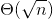
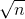
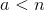
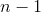
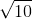
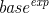
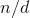
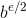

# 1.2.6示例：测试原始性

> 译者： [https://sicp.comp.nus.edu.sg/chapters/17](https://sicp.comp.nus.edu.sg/chapters/17)

本节介绍了两种检查整数的素性的方法，一种方法具有增长顺序，而一种&lt;quote&gt;概率&lt;/quote&gt;算法具有增长顺序。 本节末尾的练习提出了基于这些算法的编程项目。

## 搜索除数

自古以来，数学家就对质数问题着迷，许多人致力于确定测试数是否为质数的问题。 测试数字是否为质数的一种方法是找到数字的因数。 以下程序找到给定数字的最小整数除数（大于1）。 它通过以2开头的连续整数测试的可除性，从而以一种直接的方式完成此操作。

```js
function smallest_divisor(n) {
    return find_divisor(n, 2);
}
function find_divisor(n, test_divisor) {
     return square(test_divisor) > n
            ? n
            : divides(test_divisor, n)
              ? test_divisor
              : find_divisor(n, test_divisor + 1);
}
function divides(a, b) {
    return b % a === 0;
}
```

我们可以如下测试一个质数：是质数，当且仅当是它自己的最小除数。

```js
function is_prime(n) {
    return n === smallest_divisor(n);
}
```

`find_divisor`的最终测试基于以下事实：如果不是素数，则其除数必须小于或等于。 [[1]](17#footnote-1) 这意味着该算法仅需要测试1和之间的除数。 因此，将识别为素数所需的步骤数将具有增长顺序。

## 费马测试

素数测试基于称为费马小定理的数论结果。 [ [2]](17#footnote-2)

**费马小定理：**如果是质数，并且是小于的任何正整数，则提高到幂的等于 模。

(Two numbers are said to be _congruent modulo_  if they both have the same remainder when divided by . The remainder of a number  when divided by  is also referred to as the _remainder of_  _modulo_ , or simply as  _modulo_ .)

如果不是质数，则通常，大多数数字将不满足上述关系。 这导致以下用于测试素数的算法：给定一个数字，选择一个随机数并计算模的余数。 如果结果不等于，则当然不是素数。 如果是，则占优的机会很大。 现在选择另一个随机数，并使用相同的方法对其进行测试。 如果它也满足方程式，那么我们甚至可以更加确信是质数。 通过尝试越来越多的值，我们可以提高对结果的信心。 该算法称为Fermat测试。

要实施费马测试，我们需要一个函数，该函数可以计算另一个模的数字指数：

```js
function expmod(base, exp, m) {
    return exp === 0
           ? 1
           : is_even(exp)
             ? square(expmod(base, exp / 2, m)) % m
             : (base * expmod(base, exp - 1, m)) % m;
}
```

这与 [1.2.4](15) 部分的`fast_expt`功能非常相似。 它使用连续平方，因此步数与指数成对数增长。 [[3]](17#footnote-3)

通过随机选择介于1和之间的数字并检查的次幂的余数的余数是否等于来进行费马测试。 使用函数`random`选择随机数，我们假设我们的JavaScript环境将其定义为原始函数。 函数`random`返回的非负整数小于其整数输入。 因此，为了获得1到之间的随机数，我们用输入调用`random`并将结果加1：

```js
function fermat_test(n) {
    function try_it(a) {
        return expmod(a, n, n) === a;
    }
    return try_it(1 + random(n - 1));
}
```

以下函数按照参数指定的次数运行测试。 如果每次测试均成功，则其值为true，否则为false。

```js
function fast_is_prime(n, times) {
    return times === 0
           ? true
           : fermat_test(n)
             ? fast_is_prime(n, times - 1)
             : false;
}
```

## 概率方法

Fermat测试与大多数熟悉的算法不同，在该算法中，人们计算出的答案是可以肯定的。 在这里，获得的答案可能只是正确的。 更准确地说，如果未能通过Fermat测试，我们可以确定不是素数。 但是，尽管通过了测试，尽管这是一个非常有力的指示，但仍然不能保证是最优质的。 我们想说的是，对于任何数字，如果我们执行了足够多次的测试，并且发现始终通过测试，则可以将素数测试中的错误概率降低到我们想要的程度 。

不幸的是，这种说法并不完全正确。 确实存在一些使Fermat测试难以理解的数字：数字不是质数，但对于所有整数而言，其与模为的性质相同。 这样的数字非常罕见，因此Fermat测试在实践中是相当可靠的。 [ [4]](17#footnote-4)

费马（Fermat）测试的各种变化不能被愚弄。 在这些测试中，与Fermat方法一样，通过选择随机整数并检查取决于和的某些条件来测试整数的素数。 （有关此类测试的示例，请参见练习 [ 1.28 ](17#ex_1.28) 。）另一方面，与Fermat测试相反，对于任何，人们都可以证明其条件 除非为质数，否则对大多数整数都不适用。 因此，如果通过了对的某些随机选择的测试，则机会甚至比是首要的要好。 如果通过了针对的两个随机选择的测试，则为质数的机会要比四分之三更好。 通过使用越来越多的随机选择值进行测试，我们可以使错误概率尽可能小。

可以证明错误机会任意减小的测试的存在引发了对这种算法的兴趣，这种算法已被称为_概率算法_。 在这一领域有大量的研究活动，并且概率算法已经在许多领域取得了丰硕的成果。 [[5]](17#footnote-5)

<exercise>Use the `smallest_divisor` function to find the smallest divisor of each of the following numbers: 199, 1999, 19999.<button class="btn btn-secondary solution_btn" data-toggle="collapse" href="#solution_17_1_div">Solution</button> <solution>```js
smallest_divisor(199);
// smallest_divisor(1999);
// smallest_divisor(19999);
```</solution></exercise> <exercise>Assume that our JavaScript environment declares a primitive function called `runtime` that returns an integer that specifies the amount of time the system has been running (measured in microseconds). The following `timed_prime_test` function, when called with an integer , prints  and checks to see if  is prime. If  is prime, the function prints three asterisks followed by the amount of time used in performing the test.[[6]](17#footnote-6)

```js
function timed_prime_test(n) {
    display(n);
    return start_prime_test(n, runtime());
}
function start_prime_test(n, start_time) {
    return is_prime(n)
           ? report_prime(runtime() - start_time)
           : true;
}
function report_prime(elapsed_time) {
    display(" *** ");
    display(elapsed_time);
}
```

Using this function, write a function `search_for_primes` that checks the primality of consecutive odd integers in a specified range. Use your function to find the three smallest primes larger than 1000; larger than 10,000; larger than 100,000; larger than 1,000,000\. Note the time needed to test each prime. Since the testing algorithm has order of growth of , you should expect that testing for primes around 10,000 should take about  times as long as testing for primes around 1000\. Do your timing data bear this out? How well do the data for 100,000 and 1,000,000 support the  prediction? Is your result compatible with the notion that programs on your machine run in time proportional to the number of steps required for the computation?<button class="btn btn-secondary solution_btn" data-toggle="collapse" href="#no_solution_17_1_div">Add solution</button>There is currently no solution available for this exercise. This textbook adaptation is a community effort. Do consider contributing by providing a solution for this exercise, using a Pull Request in [Github](https://github.com/source-academy/sicp).</exercise><exercise>The `smallest_divisor` function shown at the start of this section does lots of needless testing: After it checks to see if the number is divisible by 2 there is no point in checking to see if it is divisible by any larger even numbers. This suggests that the values used for `test_divisor` should not be 2, 3, 4, 5, 6, … but rather 2, 3, 5, 7, 9, …. To implement this change, define a declare a function `next` that returns 3 if its input is equal to 2 and otherwise returns its input plus 2\. Modify the `smallest_divisor` function to use `next(test_divisor)` instead of `test_divisor + 1`. With `timed_prime_test` incorporating this modified version of `smallest_divisor`, run the test for each of the 12 primes found in exercise <ref name="ex:search-for-primes">[1.22](17#ex_1.22)</ref>. Since this modification halves the number of test steps, you should expect it to run about twice as fast. Is this expectation confirmed? If not, what is the observed ratio of the speeds of the two algorithms, and how do you explain the fact that it is different from 2?<button class="btn btn-secondary solution_btn" data-toggle="collapse" href="#no_solution_17_1_div">Add solution</button>There is currently no solution available for this exercise. This textbook adaptation is a community effort. Do consider contributing by providing a solution for this exercise, using a Pull Request in [Github](https://github.com/source-academy/sicp).</exercise><exercise>Modify the `timed_prime_test` function of exercise <ref name="ex:search-for-primes">[1.22](17#ex_1.22)</ref> to use `fast_is_prime` (the Fermat method), and test each of the 12 primes you found in that exercise. Since the Fermat test has  growth, how would you expect the time to test primes near 1,000,000 to compare with the time needed to test primes near 1000? Do your data bear this out? Can you explain any discrepancy you find?<button class="btn btn-secondary solution_btn" data-toggle="collapse" href="#no_solution_17_1_div">Add solution</button>There is currently no solution available for this exercise. This textbook adaptation is a community effort. Do consider contributing by providing a solution for this exercise, using a Pull Request in [Github](https://github.com/source-academy/sicp).</exercise><exercise>Alyssa P. Hacker complains that we went to a lot of extra work in writing `expmod`. After all, she says, since we already know how to compute exponentials, we could have simply written

```js
function expmod(base, exp, m) {
    return fast_expt(base, exp) % m;
}
```

Is she correct? Would this function serve as well for our fast prime tester? Explain.<button class="btn btn-secondary solution_btn" data-toggle="collapse" href="#solution_17_2_div">Solution</button><solution>Alyssa's suggestion is correct at first sight: her `expmod` function computes  and then finds its remainder modulo , as required in the Fermat test.However, for large bases, Alyssa's method will quickly bump into limitations because JavaScript uses 64 bits to represent numbers, following the double-precision floating point standard. When the numbers become so large that they cannot be represented precisely any longer in this standard, the results become unreliable. Even worse, the method might exceed the largest number that can be represented in this standard, and the computation leads to an error.For small bases, however, Alyssa's method may be even faster than the original `expmod` function, because it will carry out only one single remainder operation.</solution></exercise><exercise>Louis Reasoner is having great difficulty doing exercise <ref name="ex:mod-timed-prime-test">[1.24](17#ex_1.24)</ref>. His `fast_is_prime` test seems to run more slowly than his `is_prime` test. Louis calls his friend Eva Lu Ator over to help. When they examine Louis's code, they find that he has rewritten the `expmod` function to use an explicit multiplication, rather than calling `square`:

```js
function expmod(base, exp, m) {
    return exp === 0
           ? 1
           : is_even(exp)
             ? expmod(base, exp / 2, m) 
               * expmod(base, exp / 2, m)
               % m
             : base
               * expmod(base, exp - 1, m) 
               % m;
}
```

<quote>I don't see what difference that could make,</quote> says Louis. <quote>I do.</quote> says Eva. <quote>By writing the function like that, you have transformed the  process into a  process.</quote> Explain.<button class="btn btn-secondary solution_btn" data-toggle="collapse" href="#solution_17_3_div">Solution</button><solution>Eva is correct: by evaluating the expression:

```js
expmod(base, exp / 2, m) 
* expmod(base, exp / 2, m)
% m
```

the expression `expmod(base, exp / 2, m)` is evaluated twice at each step in the computation when the exponent is even, eliminating the benefit of the fast exponentiation algorithm—which halves the exponent when the exponent is even—therefore eliminating the feature of the algorithm that makes it faster.</solution></exercise><exercise>Demonstrate that the Carmichael numbers listed in footnote <ref name="foot:carmichaelfn">**Cound not find label for foot:carmichaelfn**</ref> really do fool the Fermat test. That is, write a function that takes an integer  and tests whether  is congruent to  modulo  for every , and try your function on the given Carmichael numbers.<button class="btn btn-secondary solution_btn" data-toggle="collapse" href="#solution_17_4_div">Solution</button> <solution>```js
function carmichael(n) {
    function expmod(base, exp, m) {
        return exp === 0
               ? 1
               : is_even(exp)
                 ? square(expmod(base, exp / 2, m)) % m
                 : (base * expmod(base, exp - 1, m)) % m;
    }
    function fermat_test(n, a) {
        return expmod(a, n, n) === a;
    }
    function iter(n, i) {
        return i === n
               ? true
               : fermat_test(n, i)
                 ? iter(n, i + 1)
                 : false;
    }
    return iter(n, 2);
}
```</solution></exercise> <exercise>One variant of the Fermat test that cannot be fooled is called the _Miller-Rabin test_ (<citation>Miller 1976</citation>; <citation>Rabin 1980</citation>). This starts from an alternate form of Fermat's Little Theorem, which states that if  is a prime number and  is any positive integer less than , then  raised to the st power is congruent to 1 modulo . To test the primality of a number  by the Miller-Rabin test, we pick a random number  and raise  to the st power modulo  using the `expmod` function. However, whenever we perform the squaring step in `expmod`, we check to see if we have discovered a <quote>nontrivial square root of 1 modulo , </quote> that is, a number not equal to 1 or  whose square is equal to 1 modulo . It is possible to prove that if such a nontrivial square root of 1 exists, then  is not prime. It is also possible to prove that if  is an odd number that is not prime, then, for at least half the numbers , computing  in this way will reveal a nontrivial square root of 1 modulo . (This is why the Miller-Rabin test cannot be fooled.) Modify the `expmod` function to signal if it discovers a nontrivial square root of 1, and use this to implement the Miller-Rabin test with a function analogous to `fermat_test`. Check your function by testing various known primes and non-primes. Hint: One convenient way to make `expmod` signal is to have it return 0.<button class="btn btn-secondary solution_btn" data-toggle="collapse" href="#solution_17_5_div">Solution</button> <solution>```js
function random(n) {
    return math_floor(math_random() * n);
}
function miller_rabin_test(n) {
    function expmod(base, exp, m) {
        return exp === 0
               ? 1
               : is_even(exp)
                 ? square(trivial_test(expmod(base,
                                              exp / 2,
                                              m), 
                                       m))
                   % m
		 : (base * expmod(base, exp - 1, m)) 
                   % m;
    }
    function trivial_test(r, m) {
        return r === 1 || r === m - 1
               ? r
               : square(r) % m === 1
                 ? 0
                 : r;
    }
    function try_it(a) {
        return expmod(a, n - 1, n) === 1;
    }
    return try_it(1 + random(n - 1));
}
function do_miller_rabin_test(n, times) {
    return times === 0
           ? true
           : miller_rabin_test(n)
             ? do_miller_rabin_test(n, times - 1)
             : false;
}
```</solution></exercise> 

* * *

[[1]](17#footnote-link-1) If  is a divisor of , then so is . But  and  cannot both be greater than .

[[2]](17#footnote-link-2) Pierre de Fermat (1601–1665) is considered to be the founder of modern number theory. He obtained many important number-theoretic results, but he usually announced just the results, without providing his proofs. Fermat's Little Theorem was stated in a letter he wrote in 1640\. The first published proof was given by Euler in 1736 (and an earlier, identical proof was discovered in the unpublished manuscripts of Leibniz). The most famous of Fermat's results—known as Fermat's Last Theorem—was jotted down in 1637 in his copy of the book _Arithmetic_ (by the third-century Greek mathematician Diophantus) with the remark <quote>I have discovered a truly remarkable proof, but this margin is too small to contain it.</quote> Finding a proof of Fermat's Last Theorem became one of the most famous challenges in number theory. A complete solution was finally given in 1995 by Andrew Wiles of Princeton University.

[[3]](17#footnote-link-3) The reduction steps in the cases where the exponent  is greater than 1 are based on the fact that, for any integers , , and , we can find the remainder of  times  modulo  by computing separately the remainders of  modulo  and  modulo , multiplying these, and then taking the remainder of the result modulo . For instance, in the case where  is even, we compute the remainder of  modulo , square this, and take the remainder modulo . This technique is useful because it means we can perform our computation without ever having to deal with numbers much larger than . (Compare exercise <ref name="ex:Alyssas-expmod">[1.25](17#ex_1.25)</ref>.)

[[4]](17#footnote-link-4) Numbers that fool the Fermat test are called _Carmichael numbers_, and little is known about them other than that they are extremely rare. There are 255 Carmichael numbers below 100,000,000\. The smallest few are 561, 1105, 1729, 2465, 2821, and 6601\. In testing primality of very large numbers chosen at random, the chance of stumbling upon a value that fools the Fermat test is less than the chance that cosmic radiation will cause the computer to make an error in carrying out a <quote>correct</quote> algorithm. Considering an algorithm to be inadequate for the first reason but not for the second illustrates the difference between mathematics and engineering.

[[5]](17#footnote-link-5) One of the most striking applications of probabilistic prime testing has been to the field of cryptography. Although it is now computationally infeasible to factor an arbitrary 200-digit number, the primality of such a number can be checked in a few seconds with the Fermat test. This fact forms the basis of a technique for constructing <quote>unbreakable codes</quote> suggested by Rivest, Shamir, and Adleman (1977). The resulting _RSA algorithm_ has become a widely used technique for enhancing the security of electronic communications. Because of this and related developments, the study of prime numbers, once considered the epitome of a topic in <quote>pure</quote> mathematics to be studied only for its own sake, now turns out to have important practical applications to cryptography, electronic funds transfer, and information retrieval.

[[6]](17#footnote-link-6) Note that the function `display` takes a string as argument and displays it in the programming environment. The operator `+` can be applied to two strings, in which case it concatenates them. When it is given two strings, this operator behaves entirely differently than when it is given two numbers. We say that the operator is _polymorphic_. The full language JavaScript allows for more interesting combinations of arguments of `+`, using the concept of _coercion_.

