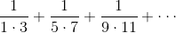
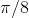
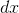
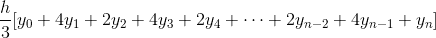
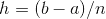
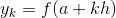
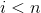

# 1.3.1函数作为参数

> 译者： [https://sicp.comp.nus.edu.sg/chapters/19](https://sicp.comp.nus.edu.sg/chapters/19)

考虑以下三个功能。 第一个计算从`a`到`b`的整数之和：

```js
function sum_integers(a, b) {
    return a > b
           ? 0
           : a + sum_integers(a + 1, b);
}
```

The second computes the sum of the cubes of the integers in the given range:

```js
function sum_cubes(a, b) {
    return a > b
           ? 0
           : cube(a) + sum_cubes(a + 1, b);
}
```

The third computes the sum of a sequence of terms in the series  which converges to  (very slowly):[[1]](19#footnote-1)

```js
function pi_sum(a, b) {
    return a > b
           ? 0
           : 1.0 / (a * (a + 2)) + 
             pi_sum(a + 4, b);
}
```

这三个功能显然共享一个共同的基础模式。 它们大部分是相同的，仅在函数名称，用于计算要添加的项的`a`函数以及提供`a`下一个值的函数上有所不同。 我们可以通过在同一模板中填充插槽来生成每个函数：

```js
function name(a, b) {
    return a > b
           ? 0
           : term(a) + name(next(a), b);
}
```

这种常见模式的存在是有力的证据，表明有一个有用的抽象正在等待浮出水面。 确实，数学家很久以前就确定了一系列的_求和的抽象，并发明了&lt;quote&gt;σ表示法，例如&lt;/quote&gt;来表达这一概念。 sigma表示法的功能在于，它使数学家能够处理求和本身的概念，而不是仅处理特定的和—例如，针对与被求和的特定序列无关的总和制定一般结果。_

同样，作为程序设计者，我们希望我们的语言足够强大，以便我们可以编写一个表达求和概念的函数，而不是仅计算特定总和的函数。 通过采用上面显示的通用模板并将&lt;quote&gt;插槽&lt;/quote&gt;转换为参数，我们可以使用我们的功能语言轻松地做到这一点：

```js
function sum(term, a, next, b) {
    return a > b
           ? 0
           : term(a) + sum(term, next(a), next, b);
}
```

请注意，`sum`将上下限`a`和`b`以及函数`term`和`next`作为其参数。 我们可以像使用任何功能一样使用`sum`。 例如，我们可以使用它（连同将其参数加1的函数`inc`一起使用）来定义`sum_cubes`：

```js
function inc(n) {
    return n + 1;
}
function sum_cubes(a, b) {
    return sum(cube, a, inc, b);
}
```

使用此方法，我们可以计算1到10的整数的立方的总和：

```js
sum_cubes(1, 10);
```

借助于身份函数来计算项，我们可以根据`sum`来定义`sum_integers`：

```js
function identity(x) {
    return x;
}
```

```js
function sum_integers(a, b) {
    return sum(identity, a, inc, b);
}
```

Then we can add up the integers from 1 to 10:

```js
sum_integers(1, 10);
```

我们还可以通过以下方式声明`pi_sum`： [[2]](19#footnote-2)

```js
function pi_sum(a, b) {
    function pi_term(x) {
        return 1.0 / (x * (x + 2));
    }
    function pi_next(x) {
        return x + 4;
    }
    return sum(pi_term, a, pi_next, b);
}
```

使用这些函数，我们可以计算出的近似值：

```js
8 * pi_sum(1, 1000);
```

一旦有了`sum`，我们就可以将其用作制定进一步概念的基础。 例如，对于较小的值，可以使用公式在界限和之间确定函数的定积分。 我们可以直接将其表示为一个函数：

```js
function integral(f, a, b, dx) {
    function add_dx(x) {
        return x + dx;
    }
    return sum(f, a + dx / 2, add_dx, b) * dx;
}
```

```js
integral(cube, 0, 1, 0.01);
```

```js
integral(cube, 0, 1, 0.005);
```

(The exact value of the integral of `cube` between 0 and 1 is 1/4.)<exercise>Simpson's Rule is a more accurate method of numerical integration than the method illustrated above. Using Simpson's Rule, the integral of a function  between  and  is approximated as  where , for some even integer , and . (Increasing  increases the accuracy of the approximation.) Declare a function that takes as arguments , , , and  and returns the value of the integral, computed using Simpson's Rule. Use your function to integrate `cube` between 0 and 1 (with  and ), and compare the results to those of the `integral` function shown above.<button class="btn btn-secondary solution_btn" data-toggle="collapse" href="#solution_19_1_div">Solution</button> <solution>```js
function inc(k) {
    return k + 1;
}
function simpsons_rule_integral(f, a, b, n) {
    function helper(h) {
        function y(k) { 
            return f((k * h) + a);
        }
	function term(k) {
            return k === 0 || k === n
                   ? y(k)
                   : k % 2 === 0
                     ? 2 * y(k)
                     : 4 * y(k);
        }
        return sum(term, 0, inc, n) * (h / 3);
    }
    return helper((b - a) / n);
}
```</solution></exercise> <exercise>The `sum` function above generates a linear recursion. The function can be rewritten so that the sum is performed iteratively. Show how to do this by filling in the missing expressions in the following declaration:

```js
function sum(term, a, next, b) {
    function iter(a, result) {
        return ??
               ? ??
               : iter(??,??);
    }
    return iter(??, ??);
}
```

<button class="btn btn-secondary solution_btn" data-toggle="collapse" href="#solution_19_2_div">Solution</button> <solution>```js
function sum(term, a, next, b) {
    function iter(a, result) {
        return a > b
               ? result
               : iter(next(a), result + term(a));
    }
    return iter(a, 0);
}
```</solution></exercise>  <exercise>1.  `sum`函数只是可被捕获为高阶函数的大量相似抽象中的最简单的。 [[3]](19#footnote-3) 编写一个称为`product`的类似函数，该函数返回给定范围内各点上函数值的乘积。 展示如何根据`product`定义`factorial`。 也可以使用`product`使用公式 [[4]](19#footnote-4) 来计算的近似值。
2.  如果您的`product`函数生成一个递归过程，请编写一个生成迭代过程的函数。 如果它生成一个迭代过程，请编写一个生成递归过程的过程。

<button class="btn btn-secondary solution_btn" data-toggle="collapse" href="#solution_19_3_div">Solution</button> <solution>```js
//recursive process
function product_r(term, a, next, b) {
    return a > b
           ? 1
           : term(a) * product_r(term, next(a), next, b);
}

//iterative process
function product_i(term, a, next, b) {
    function iter(a, result) {
        return a > b
               ? result
               : iter(next(a), term(a) * result);
    }
    return iter(a, 1);
}
```</solution></exercise>  <exercise>1.  证明`sum`和`product`（运动 [1.31](19#ex_1.31) ）都是更通用的概念`accumulate`的特例，该概念结合了术语集合，并使用一些常规累加 函数：

    ```js
    accumulate(combiner, null_value, term, a, next, b);
    ```

    函数`accumulate`以与`sum`和`product`相同的术语和范围规格，以及`combiner`函数（两个） 参数），该参数指定了当前术语与先前术语的累加方式如何结合在一起，`null_value`指定了这些术语用尽时要使用的基本值。 编写`accumulate`并显示如何将`sum`和`product`都声明为对`accumulate`的简单调用。
2.  如果您的`accumulate`函数生成一个递归过程，请编写一个生成迭代过程的函数。 如果它生成一个迭代过程，请编写一个生成递归过程的过程。

<button class="btn btn-secondary solution_btn" data-toggle="collapse" href="#solution_19_4_div">Solution</button> <solution>```js
//recursive process
function accumulate_r(combiner, null_value, term, a, next, b) {
    return a > b
           ? null_value
           : combiner(term(a), 
                      accumulate_r(combiner, 
                                   null_value, 
                                   term, next(a), next, b));
}

//iterative process
function accumulate_i(combiner, null_value, term, a, next, b) {
    function iter(a, result) {
        return a > b
               ? result
               : iter(next(a), combiner(term(a), result));
    }
    return iter(a, null_value);
}
function sum_i(term, a, next, b) {
    function plus(x, y) {
        return x + y;
    }
    return accumulate_i(plus, 0, term, a, next, b);
}
function product_r(term, a, next, b) {
    function times(x, y) {
        return x * y;
    }
    return accumulate_r(times, 1, term, a, next, b);
}
```</solution></exercise> <exercise>You can obtain an even more general version of `accumulate` (exercise <ref name="ex:accumulate">[1.32](19#ex_1.32)</ref>) by introducing the notion of a _filter_ on the terms to be combined. That is, combine only those terms derived from values in the range that satisfy a specified condition. The resulting `filtered_accumulate` abstraction takes the same arguments as accumulate, together with an additional predicate of one argument that specifies the filter. Write `filtered_accumulate` as a function. Show how to express the following using `filtered_accumulate`:

1.  到区间中素数平方的和（假设您已经编写了`is_prime`谓词）
2.  小于的所有正整数与相对质数的乘积（即，所有正整数等于）。

<button class="btn btn-secondary solution_btn" data-toggle="collapse" href="#solution_19_5_div">Solution</button> <solution>```js
function filtered_accumulate(combiner, null_value,
                             term, a, next, b, filter) {
    return a > b
           ? null_value
           : filter(a)
             ? combiner(term(a), 
                   filtered_accumulate(combiner, null_value, 
                                       term, next(a), next, 
                                       b, filter))
             : filtered_accumulate(combiner, null_value, 
                                   term, next(a), next, 
                                   b, filter);
}
```</solution></exercise> 

* * *

[[1]](19#footnote-link-1) This series, usually written in the equivalent form , is due to Leibniz. We'll see how to use this as the basis for some fancy numerical tricks in section <ref name="sec:exploiting-streams">[3.5.3](69)</ref>.

[[2]](19#footnote-link-2) Notice that we have used block structure (section <ref name="sec:black-box">[1.1.8](10)</ref>) to embed the declarations of `pi_next` and `pi_term` within `pi_sum`, since these functions are unlikely to be useful for any other purpose. We will see how to get rid of them altogether in section <ref name="sec:lambda">[1.3.2](20)</ref>.

[[3]](19#footnote-link-3) The intent of exercises <ref name="ex:product">[1.31](19#ex_1.31)</ref>–<ref name="ex:filtered-accumulate">[1.33](19#ex_1.33)</ref> is to demonstrate the expressive power that is attained by using an appropriate abstraction to consolidate many seemingly disparate operations. However, though accumulation and filtering are elegant ideas, our hands are somewhat tied in using them at this point since we do not yet have data structures to provide suitable means of combination for these abstractions. We will return to these ideas in section <ref name="sec:sequences-conventional-interfaces">[2.2.3](32)</ref> when we show how to use _sequences_ as interfaces for combining filters and accumulators to build even more powerful abstractions. We will see there how these methods really come into their own as a powerful and elegant approach to designing programs.

[[4]](19#footnote-link-4) This formula was discovered by the seventeenth-century English mathematician John Wallis.

