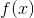
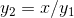
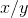
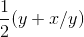
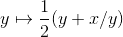
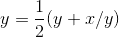
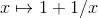
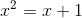
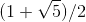

# 1.3.3通用方法

> 译者： [https://sicp.comp.nus.edu.sg/chapters/21](https://sicp.comp.nus.edu.sg/chapters/21)

我们在 [1.1.4](6)[1.3.1](19) 部分的`integral`函数，我们开始看到一种更强大的抽象：用于表示通用计算方法的函数 ，与所涉及的特定功能无关。 在本节中，我们将讨论两个更详细的示例-查找函数零和固定点的通用方法-并说明如何将这些方法直接表示为函数。

## 半间隔法求方程的根

_半间隔方法_是一种简单但功能强大的技术，用于查找方程式的根，其中是连续函数。 这个想法是，如果给我们赋予和点，使得，则在和之间必须至少有一个零。 为了找到零，令为和的平均值，然后计算。 如果为，则在和之间必须为零。 如果为，则在和之间必须为零。 以此方式继续，我们可以确定必须为零的间隔越来越小。 当我们到达间隔足够小的点时，该过程停止。 由于不确定性的间隔在过程的每个步骤中减少了一半，因此所需的步骤数将随着的增加而增加，其中是原始间隔的长度，而是错误容忍度（即， 间隔的大小，我们将认为&lt;quote&gt;足够小&lt;/quote&gt;）。 这是实现此策略的功能： [[1]](21#footnote-1)

```js
function search(f, neg_point, pos_point) {
    const midpoint = average(neg_point,pos_point);
    if (close_enough(neg_point, pos_point)) {
        return midpoint;
    } else {
        const test_value = f(midpoint);
        if (positive(test_value)) {
            return search(f, neg_point, midpoint);
        } else if (negative(test_value)) {
            return search(f, midpoint, pos_point);
        } else {
            return midpoint;
        }
    }
}
```

我们假设最初给我们函数以及其值为负和正的点。 我们首先计算两个给定点的中点。 接下来，我们检查给定的间隔是否足够小，如果是，则仅返回中点作为答案。 否则，我们将中点的值计算为测试值。 如果测试值是正值，则以从原始负点到中点的新间隔继续该过程。 如果测试值为负，则继续从中点到正点的间隔。 最后，测试值可能为0，在这种情况下，中点本身就是我们要搜索的根。 要测试端点是否&lt;quote&gt;足够接近&lt;/quote&gt;，我们可以使用类似于 [ 1.1.7 ](9) 部分中使用的函数来计算平方根： [[ 2]](21#footnote-2)

```js
function close_enough(x,y) {
    return abs(x - y) < 0.001;
}
```

函数`search`难以直接使用，因为我们可能不小心给它指定的值不具有必需符号的点，在这种情况下，我们将得到错误的答案。 取而代之的是，我们将通过以下函数使用`search`，该函数检查哪些端点具有负函数值，哪些端点具有正值，并相应地调用`search`函数。 如果函数在两个给定点上具有相同的符号，则不能使用半间隔方法，在这种情况下，函数会发出错误信号。 [ [3]](21#footnote-3)

```js
function half_interval_method(f, a, b) {
    const a_value = f(a);
    const b_value = f(b);
    return negative(a_value) && positive(b_value)
           ? search(f, a, b)
           : negative(b_value) && positive(a_value)
             ? search(f, b, a)
             : error("values are not of opposite sign");
}
```

The following example uses the half-interval method to approximate  as the root between 2 and 4 of :

```js
half_interval_method(math_sin, 2.0, 4.0);
```

Here is another example, using the half-interval method to search for a root of the equation  between 1 and 2:

```js
half_interval_method(
  x => x * x * x - 2 * x - 3,
  1.0,
  2.0);
```

## 寻找功能的固定点

如果满足等式，则将数字称为函数的_不动点_。 对于某些功能，我们可以从初始猜测开始并反复应用，直到值没有太大变化，从而找到一个固定点。 利用这种思想，我们可以设计一个函数`fixed_point`，该函数将一个函数和一个初始猜测作为输入，并生成对该函数固定点的近似值。 我们重复应用该函数，直到找到两个连续的值，其差小于某个规定的公差：

```js
const tolerance = 0.00001;
function fixed_point(f, first_guess) {
    function close_enough(x, y) {
        return abs(x - y) < tolerance;
    }
    function try_with(guess) {
        const next = f(guess);
        return close_enough(guess, next)
               ? next
               : try_with(next);
    }
    return try_with(first_guess);
}
```

例如，我们可以使用此方法来近似余弦函数的不动点，以1作为初始近似值： [[4]](21#footnote-4)

```js
fixed_point(math_cos, 1.0);
```

类似地，我们可以找到方程的解：

```js
fixed_point(
    y => math_sin(y) + math_cos(y),
    1.0);
```

定点过程让人想起我们在 [1.1.7](9) 部分中用于查找平方根的过程。 两者都是基于反复改善猜测直到结果满足某些标准的想法。 实际上，我们可以很容易地将平方根计算公式化为定点搜索。 计算某个数字的平方根需要找到一个这样的。 将这个方程式转化为等价形式，我们认识到我们正在寻找函数 [[5]](21#footnote-5) 的固定点，因此我们可以尝试计算平方根为

```js
function sqrt(x) {
    return fixed_point(y => x / y, 1.0);
}
// warning: does not converge!
```

Unfortunately, this fixed-point search does not converge. Consider an initial guess . The next guess is  and the next guess is . This results in an infinite loop in which the two guesses  and  repeat over and over, oscillating about the answer.

控制这种振荡的一种方法是防止猜测变化太大。 由于答案始终在我们的猜测和之间，因此我们可以通过将与进行平均，得出与和相距不远的新猜测。 在之后是，而不是。 进行这样一系列猜测的过程仅仅是寻找固定点的过程：

```js
function sqrt(x) {
    return fixed_point(
               y => average(y, x / y),
               1.0);
}
```

(Note that  is a simple transformation of the equation ; to derive it, add  to both sides of the equation and divide by 2.)

通过此修改，平方根函数起作用。 实际上，如果我们解开定义，我们可以看到此处生成的平方根的近似序列与 [1.1.7节的原始平方根函数生成的近似序列完全相同。](9) 。 这种对解决方案的逐次逼近进行平均的方法（我们称为_平均阻尼_的一种技术）通常有助于定点搜索的收敛。

<exercise>Show that the golden ratio  (section <ref name="sec:tree-recursion">[1.2.2](13)</ref>) is a fixed point of the transformation , and use this fact to compute  by means of the `fixed_point` function.<button class="btn btn-secondary solution_btn" data-toggle="collapse" href="#solution_21_1_div">Solution</button><solution>The fixed point of the function is  Solving for x, we get   Using the quadratic equation to solve for , we find that one of the roots of this equation is the golden ratio .

```js
fixed_point(x => 1 + (1 / x), 1.0);
```</solution></exercise> <exercise>Modify `fixed_point` so that it prints the sequence of approximations it generates, using the primitive function `display` shown in exercise <ref name="ex:search-for-primes">[1.22](17#ex_1.22)</ref>. Then find a solution to  by finding a fixed point of . (Use the primitive function `math_log` which computes natural logarithms.) , Compare the number of steps this takes with and without average damping. (Note that you cannot start `fixed_point` with a guess of 1, as this would cause division by .)<button class="btn btn-secondary solution_btn" data-toggle="collapse" href="#solution_21_2_div">Solution</button><solution>We modify the function `fixed_point` as follows:

```js
const tolerance = 0.00001;
function fixed_point(f, first_guess) {
    function close_enough(x, y) {
        return abs(x - y) < tolerance;
    }
    function try_with(guess) {
        display(guess);
        const next = f(guess);
        return close_enough(guess, next)
               ? next
               : try_with(next);
    }
    return try_with(first_guess);
}
```

Here is a version with average dampening built-in:

```js
function fixed_point_with_average_dampening(f, first_guess) {
    function close_enough(x, y) {
        return abs(x - y) < tolerance;
    }
    function try_with(guess) {
        display(guess);
        const next = (guess + f(guess)) / 2;
        return close_enough(guess, next)
               ? next
               : try_with(next);
    }
    return try_with(first_guess);
}
```</solution></exercise>  <exercise>*   无限的_连续分数_是形式的表达式。例如，可以显示无限大的和等于1的连续分数展开产生 ，其中是黄金比例（在 [ 1.2.2 ](13) 部分中进行了介绍）。 逼近无限连续分数的一种方法是在给定数目的项之后截断展开。 这种截断（即所谓的 _-有限连续分数_）的格式为。假设`n`和`d`是一个自变量的函数（术语索引 ），返回连续分数项的和。 声明函数`cont_frac`，以便对`cont_frac(n, d, k)`进行评估即可计算项有限连续分数的值。 通过使用

    ```js
    cont_frac(i =&gt; 1.0,
              i =&gt; 1.0,
              k);
    ```

    近似获取`k`的连续值来检查的功能。 为了得到精确到小数点后4位的近似值，您必须制造多少`k`？
*   如果您的`cont_frac`函数生成一个递归过程，请编写一个生成迭代过程的函数。 如果它生成一个迭代过程，请编写一个生成递归过程的过程。

<button class="btn btn-secondary solution_btn" data-toggle="collapse" href="#solution_21_3_div">Solution</button> <solution>```js
//recursive process
function cont_frac(n, d, k) {
    function fraction(i) {
        return i > k
               ? 0
               : n(i) / (d(i) + fraction(i + 1));
    }
    return fraction(1);
}
```

```js
//iterative process
function cont_frac(n, d, k) {
    function fraction(i, current) {
        return i === 0
               ? current
               : fraction(i - 1, n(i) / (d(i) + current));
    }
    return fraction(k, 0);
}
```

```js
cont_frac(i => 1.0,
          i => 1.0,
          20);
```</solution></exercise> <exercise>In 1737, the Swiss mathematician Leonhard Euler published a memoir _De Fractionibus Continuis_, which included a continued fraction expansion for , where  is the base of the natural logarithms. In this fraction, the  are all 1, and the  are successively 1, 2, 1, 1, 4, 1, 1, 6, 1, 1, 8, …. Write a program that uses your `cont_frac` function from exercise <ref name="ex:continued-fractions">[1.37](21#ex_1.37)</ref> to approximate , based on Euler's expansion.<button class="btn btn-secondary solution_btn" data-toggle="collapse" href="#solution_21_4_div">Solution</button> <solution>```js
2 + cont_frac(i => 1,  
              i => (i + 1) % 3 < 1 ? 2 * (i + 1) / 3 : 1,
              20);
```</solution></exercise> <exercise>A continued fraction representation of the tangent function was published in 1770 by the German mathematician J.H. Lambert:  where  is in radians. Declare a function `tan_cf(x, k)` that computes an approximation to the tangent function based on Lambert's formula. As in exercise <ref name="ex:continued-fractions">[1.37](21#ex_1.37)</ref>, `k` specifies the number of terms to compute.<button class="btn btn-secondary solution_btn" data-toggle="collapse" href="#solution_21_5_div">Solution</button> <solution>```js
function tan_cf(x, k) {
    return cont_frac(i => i === 1 ? x : - x * x,  
                     i => 2 * i - 1,
                     k);
}
```</solution></exercise> 

* * *

[[1]](21#footnote-link-1) Note that we slightly extend the syntax of conditional statements described in section <ref name="sec:lambda">[1.3.2](20)</ref> by allowing another conditional statement in place of the block following `else`.

[[2]](21#footnote-link-2) We have used 0.001 as a representative <quote>small</quote> number to indicate a tolerance for the acceptable error in a calculation. The appropriate tolerance for a real calculation depends upon the problem to be solved and the limitations of the computer and the algorithm. This is often a very subtle consideration, requiring help from a numerical analyst or some other kind of magician.

[[3]](21#footnote-link-3) This can be accomplished using `error`, which takes as argument a string that is printed as error message along with the number of the program line that gave rise to the call of `error`.

[[4]](21#footnote-link-4) Try this during a boring lecture: Set your calculator to radians mode and then repeatedly press the  button until you obtain the fixed point.

[[5] ](21#footnote-link-5) (pronounced <quote>maps to</quote>) is the mathematician's way of writing function definitions.  means `y => x / y`, that is, the function whose value at  is .

