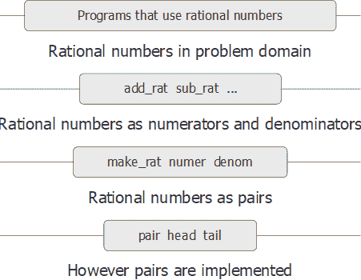

# 2.1.2抽象壁垒

> 译者： [https://sicp.comp.nus.edu.sg/chapters/26](https://sicp.comp.nus.edu.sg/chapters/26)

在继续介绍复合数据和数据抽象的更多示例之前，让我们考虑有理数示例带来的一些问题。 我们根据构造函数`make_rat`和选择器`numer`和`denom`定义了有理数运算。 通常，数据抽象的基本思想是为每种类型的数据对象标识一个基本的操作集，据此将表示该类型的数据对象的所有操作，然后仅使用这些操作来处理数据。 。

我们可以设想有理数系统的结构，如图 [2.1](26#fig_2.1)级别&lt;/quote&gt;隔离开。 在每个级别，屏障将使用数据抽象的程序（上）与实现数据抽象的程序（下）分开。 使用有理数的程序仅根据有理数软件包提供的&lt;quote&gt;，&lt;/quote&gt;，`sub_rat`，`mul_rat`，`div_rat`和`equal_rat`提供给公众使用的功能&lt;quote&gt;对其进行操作。 。 这些依次又仅根据构造函数和选择器`make_rat`，`numer`和`denom`来实现，它们本身是根据成对实现的。 只要可以通过使用`pair`，`head`和`tail`操纵对，则如何实现对的细节与有理数包的其余部分无关。 实际上，每个级别的功能都是定义抽象障碍并连接不同级别的接口。 &lt;split&gt;&lt;/split&gt;&lt;/quote&gt;

这个简单的想法有很多优点。 优点之一是它使程序更易于维护和修改。 任何复杂的数据结构都可以用编程语言提供的原始数据结构以多种方式表示。 当然，表示形式的选择会影响在其上执行的程序。 因此，如果以后要更改表示形式，则可能必须相应地修改所有此类程序。 在大型程序的情况下，此任务可能是耗时且昂贵的，除非通过设计将对表示的依赖关系限制在很少的程序模块中。

例如，解决将有理数减少为最低项的问题的另一种方法是，只要我们访问有理数的各个部分，而不是构造它，就执行归约。 这导致了不同的构造函数和选择器函数：

```js
function make_rat(n, d) {
    return pair(n, d);
}
function numer(x) {
    const g = gcd(head(x), tail(x));
    return head(x) / g;
}
function denom(x) {
    const g = gcd(head(x), tail(x));
    return tail(x) / g;
}
```

此实现与上一个实现之间的区别在于我们计算`gcd`时。 如果在我们有理数的典型使用中，我们多次访问相同有理数的分子和分母，那么构造有理数时最好计算`gcd`。 如果没有，我们最好等到访问时间来计算`gcd`。 无论如何，当我们从一种表示形式更改为另一种表示形式时，根本不需要修改函数`add_rat`，`sub_rat`等。

将对表示形式的依赖关系约束到一些接口函数可以帮助我们设计程序并对其进行修改，因为它使我们能够灵活地考虑其他实现。 为了继续我们的简单示例，假设我们正在设计一个有理数包，并且我们最初不能决定是在构造时还是在选择时执行`gcd`。 数据抽象方法为我们提供了一种推迟决策的方法，而不会失去在系统其余部分上取得进展的能力。

<exercise>Consider the problem of representing line segments in a plane. Each segment is represented as a pair of points: a starting point and an ending point. Declare a constructor `make_segment` and selectors `start_segment` and `end_segment` that define the representation of segments in terms of points. Furthermore, a point can be represented as a pair of numbers: the  coordinate and the  coordinate. Accordingly, specify a constructor `make_point` and selectors `x_point` and `y_point` that define this representation. Finally, using your selectors and constructors, declare a function `midpoint_segment` that takes a line segment as argument and returns its midpoint (the point whose coordinates are the average of the coordinates of the endpoints). To try your functions, you'll need a way to print points:

```js
function print_point(p) {
    display("(");
    display(x_point(p));
    display(",");
    display(y_point(p));
    display(")");
}
```

<button class="btn btn-secondary solution_btn" data-toggle="collapse" href="#solution_26_1_div">Solution</button> <solution>```js
function x_point(x) {
    return head(x);
}
function y_point(x) {
    return tail(x);
}
function make_point(x, y) {
    return pair(x, y);
}
function make_segment(start_point, end_point) {
    return pair(start_point,end_point);
}
function start_segment(x) {
    return head(x);
}
function end_segment(x) {
    return tail(x);
}
function average(a, b) {
    return (a + b) / 2;
}
function mid_point_segment(x) {
    const a = start_segment(x);
    const b = end_segment(x);
    return make_point(average(x_point(a),
                              x_point(b)),
                      average(y_point(a),
                              y_point(b)));
}
```</solution></exercise> <exercise>Implement a representation for rectangles in a plane. (Hint: You may want to make use of exercise <ref name="ex:segments1">[2.2](26#ex_2.2)</ref>.) In terms of your constructors and selectors, create functions that compute the perimeter and the area of a given rectangle. Now implement a different representation for rectangles. Can you design your system with suitable abstraction barriers, so that the same perimeter and area functions will work using either representation?<button class="btn btn-secondary solution_btn" data-toggle="collapse" href="#solution_26_2_div">Solution</button><solution>First implementation:

```js
function make_point(x,y){
    return pair(x,y);
}
function x_point(x){
    return head(x);
}
function y_point(x){
    return tail(x);
}

function make_rect(bottom_left, top_right){
    return pair(bottom_left, top_right);
}

function top_right(rect){
    return tail(rect);
}

function bottom_right(rect){
    return make_point(x_point(tail(rect)),
                      y_point(head(rect)));
}

function top_left(rect){
    return make_point(x_point(head(rect)),
                      y_point(tail(rect)));
}

function bottom_left(rect){
    return head(rect);
}

function abs(x){
    return x < 0 ? - x : x;
}

function width_rect(rect){
    return abs(x_point(bottom_left(rect)) - 
               x_point(bottom_right(rect)));
}

function height_rect(rect){
    return abs (y_point(bottom_left(rect)) - 
                y_point(top_left(rect)));
}

function area_rect(rect){
  return width_rect(rect) * height_rect(rect);
}

function perimeter_rect(rect){
  return 2 * (width_rect(rect) + height_rect(rect));
}
```

Second implementation:

```js
function make_point(x,y){
    return pair(x,y);
}

function make_rect(bottom_left, width, height){
    return pair(bottom_left, pair(width, height));
}

function height_rect(rect){
    return tail(tail(rect));
}

function width_rect(rect){
  return head(tail(rect));
}

function area_rect(rect){
  return width_rect(rect) * height_rect(rect);
}

function perimeter_rect(rect){
  return 2 * (width_rect(rect) + height_rect(rect));
}
```</solution></exercise>