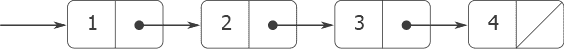
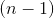

# 2.2.1表示序列

> 译者： [https://sicp.comp.nus.edu.sg/chapters/30](https://sicp.comp.nus.edu.sg/chapters/30)

<figure>**[图2.4](30#fig_2.4)** 序列1，2，3，4表示为成对链。</figure>

我们可以用成对构建的有用结构之一是_序列_-数据对象的有序集合。 当然，有许多种方法可以用对来表示序列。 在图 <ref name="fig:sequence-of-pairs">[2.4](30#fig_2.4)</ref> 中显示了一种特别简单的表示形式，其中序列1、2、3、4表示为成对的链。 每对的`head`是链中的对应项，而对的`tail`是链中的下一个对。 最终对的`tail`通过指向非对的区别值来指示序列的结束，该值在对等图中以对角线表示，而在程序中则以JavaScript值`null`表示 。 整个序列由嵌套的`pair`操作构成：

```js
pair(1, 
     pair(2, 
          pair(3, 
               pair(4, null))));
```

这样的一对序列称为_列表_，我们的JavaScript环境提供了一个名为`list`的原语来帮助构造列表。 [[1]](30#footnote-1)

以上序列可由`list(1, 2, 3, 4)`产生。 通常，`list(a, a, , a)`等同于`pair(a, pair(a, pair(, pair(a, null))))`

 <split>我们的解释器使用框和指针图的文本表示来打印对。 `pair(1, 2)`的结果打印为`[1, 2]`，图 [2.4](30#fig_2.4) 中的数据对象打印为`[1, [2, [3, [4, null]]]]`：</split> 

```js
const one_through_four = list(1, 2, 3, 4);
```

我们可以将`head`视为选择列表中的第一项，并将`tail`视为选择除第一项以外的所有项的子列表。 `head`和`tail`的嵌套应用程序可用于提取列表中的第二，第三和后续项。 构造函数`pair`生成一个与原始列表类似的列表，但在开头添加了一个附加项。

```js
head(one_through_four);
// result: 1
```

```js
tail(one_through_four);
// result: [2, [3, [4, null]]]
```

```js
head(tail(one_through_four));
// result: 2
```

```js
pair(10, one_through_four);
// result: [10, [1, [2, [3, [4, null]]]]]
```

```js
pair(5, one_through_four);
// result: [5, [1, [2, [3, [4, null]]]]]
```

 <split>可以将用于终止成对链的值`null`视为无元素的序列，即_空列表_。</split> 

## 清单操作

使用对将元素序列表示为列表的过程伴随有常规的编程技术，该技术通过依次 &lt;quote&gt;`tail`向下&lt;/quote&gt;列表来操纵列表。 例如，函数`list_ref`以一个列表和一个数字作为参数，并返回列表的第个项目。 习惯上以0开头的列表元素编号。`list_ref`的计算方法如下：

*   对于，`list_ref`应该返回列表的`head`。

*   否则，`list_ref`应该返回列表中`tail`的 st项目。

```js
function list_ref(items, n) {
    return n === 0
           ? head(items)
           : list_ref(tail(items), n - 1);
}
```

```js
const squares = list(1, 4, 9, 16, 25);
list_ref(squares, 3);
// result: 16
```

通常，我们在整个列表中都使用`tail`。 为此，我们的JavaScript环境包括谓词`is_null`，该谓词测试其参数是否为空列表。 函数`length`返回列表中的项目数，它说明了这种典型的使用模式：

```js
function length(items) {
    return is_null(items)
           ? 0
           : 1 + length(tail(items));
}
```

`length`函数实现一个简单的递归计划。 减少步骤为：

*   任何列表的`length`为1加上列表`tail`的`length`。

这将连续应用，直到达到基本情况为止：

*   空列表的`length`为0。

我们还可以迭代方式计算`length`：

```js
function length(items) {
    function length_iter(a, count) {
        return is_null(a)
               ? count
               : length_iter(tail(a), count + 1);
    }
    return length_iter(items, 0);
}
```

另一种传统的编程技术是 &lt;quote&gt;`pair`向上&lt;/quote&gt;答案列表，而`tail`向下搜索列表，如函数`append`一样，该函数将两个列表作为参数并组合它们的元素以创建一个新的 清单：

```js
append(squares, odds);
```

```js
// returns: [1, [4, [9, [16, [25, [1, [3, [5, [7, null]]]]]]]]]
```

```js
append(odds, squares);
```

功能`append`也使用递归计划实现。 要在`append`列表中列出`list1`和`list2`，请执行以下操作：

*   如果`list1`为空列表，则结果仅为`list2`。
*   否则，将`list1`和`list2`的`append`，`list1`的`head`的`tail`移到结果上：

```js
function append(list1, list2) {
    return is_null(list1)
           ? list2
           : pair(head(list1), append(tail(list1), list2));
}
```

<exercise>Define a function `last_pair` that returns the list that contains only the last element of a given (nonempty) list:

```js
last_pair(list(23, 72, 149, 34));
// result: [34, null]
```

<button class="btn btn-secondary solution_btn" data-toggle="collapse" href="#solution_30_1_div">Solution</button> <solution>```js
function last_pair(items) {
    return is_null(tail(items))
           ? items
           : last_pair(tail(items));
}
```</solution></exercise> <exercise>Define a function `reverse` that takes a list as argument and returns a list of the same elements in reverse order:

```js
reverse(list(1, 4, 9, 16, 25));
// result: [25, [16, [9, [4, [1, null]]]]]
```

<button class="btn btn-secondary solution_btn" data-toggle="collapse" href="#solution_30_2_div">Solution</button> <solution>```js
// naive reverse (what is the runtime?)
function reverse(items) {
    return is_null(items)
           ? null
           : append(reverse(tail(items)),
	            pair(head(items), null));
}
```

```js
// a better version
function reverse(items) {
    function reverse_iter(items, result) {
        return is_null(items)
               ? result
               : reverse_iter(tail(items),
	                      pair(head(items), result));
    }
    return reverse_iter(items, null);
}
```</solution></exercise>  <exercise>考虑 [1.2.2](13) 部分的变更计数程序。 能够轻松更改程序所使用的货币会很好，例如，我们可以计算更改英镑的方式。 在编写程序时，货币知识部分分配给功能`first_denomination`，部分分配给功能`count_change`（它知道有五种美国硬币）。 能够提供用于进行找零的硬币清单会更好。

我们要重写函数`cc`，以便其第二个参数是要使用的硬币的值的列表，而不是指定要使用的硬币的整数。 然后，我们可以使用定义每种货币的列表：

```js
const us_coins = list(50, 25, 10, 5, 1);
const uk_coins = list(100, 50, 20, 10, 5, 2, 1, 0.5);
```

We could then call `cc` as follows:

```js
cc(100, us_coins);
```

To do this will require changing the program `cc` somewhat. It will still have the same form, but it will access its second argument differently, as follows:

```js
function cc(amount, coin_values) {
    return amount === 0
           ? 1
           : amount < 0 || no_more(coin_values)
             ? 0
             : cc(amount,
	          except_first_denomination(coin_values))
               +
               cc(amount - first_denomination(coin_values), 
                  coin_values);
}
```

根据列表结构的原始操作定义函数`first_denomination`，`except_first_denomination`和`no_more`。 列表`coin_values`的顺序是否会影响`cc`产生的答案？ 为什么或者为什么不？

<button class="btn btn-secondary solution_btn" data-toggle="collapse" href="#solution_30_3_div">Solution</button> <solution>```js
function first_denomination(coin_values) {
    return head(coin_values);
}
function except_first_denomination(coin_values) {
    return tail(coin_values);
}
function no_more(coin_values) {
    return is_null(coin_values);
}
```

The order of the list `coin_values` does not affect the answer given by any correct solution of the problem, because the given list represents an unordered collection of denominations.</solution></exercise><split><exercise>In the presence of higher-order functions, it is not strictly necessary for functions to have multiple parameters; one would suffice.[[2]](30#footnote-2) If we have a function such as `plus` that naturally requires two parameters, we could write a variant of the function to which we pass the arguments one at at time. An application of the variant to the first argument could return a function that we can then apply to the second argument, and so on. This practice—called _currying_ and named after the American mathematician and logician Haskell Brooks Curry—is quite common in programming languages such as Haskell (the reader might venture a guess after whom this programming language is named) and Ocaml. In JavaScript, a curried version of `plus` looks as follows.

```js
function plus_curried(x) {	    
    return y => x + y;
}
```

Write a function `brooks`, that takes a curried function as first argument and as second argument a list of arguments to which the curried function is then applied, one by one, in the given order. For example, the following application of `brooks` should have the same effect as the call `plus_curried(3)(4)` above.

```js
brooks(plus_curried, list(3, 4));
```

While we are at it, we might as well curry the function `brooks`! Write a function `brooks_curried` that can be applied as follows, to yield the same result 7:

```js
brooks_curried(list(plus_curried, 3, 4));
```

With this function `brooks_curried` what are the results of evaluating the following two statements?

```js
brooks_curried(list(brooks_curried,
                    list(plus_curried, 3, 4)));
```

```js
brooks_curried(list(brooks_curried,
                    list(brooks_curried, 
                         list(plus_curried, 3, 4))));
```

<button class="btn btn-secondary solution_btn" data-toggle="collapse" href="#solution_30_4_div">Solution</button> <solution>1.  ```js
    function brooks(f, items) {
        return is_null(items)
               ? f
               : brooks(f(head(items)), tail(items));
    }
    ```

2.  ```js
    function brooks_curried(items) {
        return brooks(head(items), tail(items));
    }
    ```

3.  当然，语句

    ```js
    brooks_curried(list(brooks_curried,
                        list(plus_curried, 3, 4)));
    ```

    的计算结果为7，
4.  ```js
    brooks_curried(list(brooks_curried,
                        list(brooks_curried, 
                             list(plus_curried, 3, 4))));
    ```</solution></exercise></split> 

## 映射列表

一个非常有用的操作是对列表中的每个元素进行一些转换，然后生成结果列表。 例如，以下函数按给定因子缩放列表中的每个数字：

```js
function scale_list(items, factor) {
    return is_null(items)
           ? null
           : pair(head(items) * factor, 
                  scale_list(tail(items), factor));
}
```

我们可以抽象化此总体思路并将其捕获为表示为高阶函数的通用模式，就像 [1.3](18) 部分中所述。 此处的高阶函数称为`map`。 函数`map`将一个参数和一个列表的函数作为参数，并返回通过将该函数应用于列表中的每个元素而产生的结果的列表：

```js
function map(fun, items) {
    return is_null(items)
           ? null
           : pair(fun(head(items)), 
                  map(fun, tail(items)));
}
```

```js
map(abs, list(-10, 2.5, -11.6, 17));
```

```js
map(x => x * x, list(1, 2, 3, 4));
```

现在我们可以根据`map`给出`scale_list`的新定义：

```js
function scale_list(items, factor) {
    return map(x => x * factor, items);
}
```

函数`map`是一个重要的构造，不仅因为它捕获了通用模式，而且因为它在处理列表时建立了更高的抽象水平。 在`scale_list`的原始定义中，程序的递归结构引起了对列表的逐元素处理的注意。 用`map`定义`scale_list`会抑制该详细程度，并强调缩放将元素列表转换为结果列表。 两种定义之间的区别不是计算机正在执行不同的过程（不是），而是我们以不同的方式考虑该过程。 实际上，`map`帮助建立抽象屏障，该屏障将实现转换列表的功能与如何提取和组合列表元素的细节隔离开来。 就像图 [2.1](26#fig_2.1)[部分2.2.3](32) 扩展了这种使用序列作为组织程序框架的用途。

<exercise>The function `square_list` takes a list of numbers as argument and returns a list of the squares of those numbers.

```js
square_list(list(1, 2, 3, 4));
// returns: [1, [4, [9, [16, null]]]]
```

Here are two different definitions of `square_list`. Complete both of them by filling in the missing expressions:

```js
function square_list(items) {
    return is_null(items) 
           ? null
           : pair(??, ??);
}
```

```js
function square_list(items) {
   return map(??, ??);
}
```

<button class="btn btn-secondary solution_btn" data-toggle="collapse" href="#solution_30_5_div">Solution</button> <solution>```js
function square_list(items) {
    return is_null(items)
           ? null
           : pair(square(head(items)),
	          square_list(tail(items)));
}
```

```js
function square_list(items) {
    return map(square, items);
}
```</solution></exercise> <exercise>Louis Reasoner tries to rewrite the first `square_list` function of exercise <ref name="ex:square-list">[2.21](30#ex_2.21)</ref> so that it evolves an iterative process:

```js
function square_list(items) {
    function iter(things, answer) {
        return is_null(things) 
               ? answer
               : iter(tail(things), 
                      pair(square(head(things)), 
                           answer));
    }
    return iter(items, null);
}
```

Unfortunately, defining `square_list` this way produces the answer list in the reverse order of the one desired. Why? Louis then tries to fix his bug by interchanging the arguments to `pair`:

```js
function square_list(items) {
   function iter(things, answer) {
       return is_null(things)
              ? answer
              : iter(tail(things), 
                     pair(answer, 
                          square(head(things))));
   }
   return iter(items, null);
}
```

This doesn't work either. Explain.<button class="btn btn-secondary solution_btn" data-toggle="collapse" href="#solution_30_6_div">Solution</button> <solution>1.  结果列表在第一个程序中是反向的，因为参数列表是从头到尾以给定的顺序遍历的，但是通过`pair`将正方形连续添加到答案列表的前面。 列表的最后一个元素是要添加到答案中的最后一个元素，因此最终成为结果列表的第一个元素。
2.  第二个程序使情况更糟！ 结果不再是列表，因为元素占据了结果列表的尾部位置而不是头部位置。</solution></exercise> <exercise>The function `for_each` is similar to `map`. It takes as arguments a function and a list of elements. However, rather than forming a list of the results, `for_each` just applies the function to each of the elements in turn, from left to right. The values returned by applying the function to the elements are not used at all—`for_each` is used with functions that perform an action, such as printing. For example,

```js
for_each(x => display(x), 
         list(57, 321, 88));
```

The value returned by the call to `for_each` (not illustrated above) can be something arbitrary, such as true. Give an implementation of `for_each`.<button class="btn btn-secondary solution_btn" data-toggle="collapse" href="#solution_30_7_div">Solution</button> <solution>```js
function for_each(fun, items) {
    if (is_null(items)){
        return undefined;
    } else {
        fun(head(items));
        for_each(fun, tail(items));
    }
}
```</solution></exercise> 

* * *

[[1]](30#footnote-link-1) In this book, we use _list_ to mean a chain of pairs terminated by the end-of-list marker. In contrast, the term _list structure_ refers to any data structure made out of pairs, not just to lists.

[[2]](30#footnote-link-2) Exercise 2.20 of the original textbook deals with Scheme operators that take variable numbers of arguments. This concept exists in JavaScript, but plays a less prominent role. The textbook adaptors decided to sneak in currying on this occasion.

