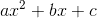
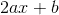
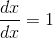
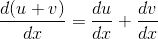
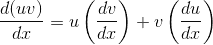
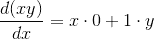
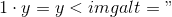
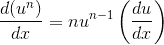

# 2.3.2示例：符号区分

> 译者： [https://sicp.comp.nus.edu.sg/chapters/36](https://sicp.comp.nus.edu.sg/chapters/36)

作为符号操作的说明和数据抽象的进一步说明，请考虑执行代数表达式的符号区分的函数的设计。 我们希望函数将代数表达式和变量作为参数，并返回表达式相对于变量的派生形式。 例如，如果函数的参数为​​和，则函数应返回。 符号差异在Lisp中具有特殊的历史意义。 这是开发用于符号操纵的计算机语言背后的激励示例之一。 此外，它标志着一系列研究的开始，从而导致了用于符号数学工作的强大系统的开发，目前越来越多的应用数学家和物理学家正在使用该系统。

在开发符号微分程序时，我们将遵循与开发 [2.1.1](25)和，&lt;/quote&gt; &lt;quote&gt;乘积，&lt;/quote&gt;和&lt;quote&gt;变量&lt;/quote&gt;）进行操作，而不必担心这些变量如何表示 。 只有在此之后，我们才能解决代表性问题。

## 具有抽象数据的微分程序

为了使事情简单，我们将考虑一个非常简单的符号微分程序，该程序处理仅使用具有两个参数的加法和乘法运算构建的表达式。 可以通过应用以下归约规则来进行任何此类表达式的区分：   请注意，后两个规则本质上是递归的。 也就是说，为了获得总和的导数，我们首先找到这些项的导数并将它们相加。 每个术语又可以是需要分解的表达。 分解成越来越小的块最终将产生常数或变量的块，它们的导数将是或。

为了将这些规则体现在功能中，我们沉迷于一厢情愿，就像我们设计有理数实现时所做的那样。 如果我们有一种表示代数表达式的方法，那么我们应该能够分辨出一个表达式是和，乘积，常数还是变量。 我们应该能够提取表达式的各部分。 例如，对于一个总和，我们希望能够提取加数（第一项）和加数（第二项）。 我们还应该能够从各个部分构造表达式。 让我们假设我们已经具有实现以下选择器，构造函数和谓词的函数：

| `is_variable(e)` | `e`是变量吗？ |
| `is_same_variable(v1, v2)` | `v1`和`v2`是否相同？ |
| `is_sum(e)` | `e`是一笔款项吗？ |
| `addend(e)` | 总和`e`的加法。 |
| `augend(e)` | 总和`e`的整数。 |
| `make_sum(a1, a2)` | 构造`a1`和`a2`的总和。 |
| `is_product(e)` | `e`是产品吗？ |
| `multiplier(e)` | 乘积`e`的乘数。 |
| `multiplicand(e)` | 产品`e`的被乘数。 |
| `make_product(m1, m2)` | 构建`m1`和`m2`的乘积。 |

使用这些，以及标识数字的原始谓词`is_number`，我们可以将微分规则表达为以下功能：

```js
function deriv(exp, variable) {
    return is_number(exp)
           ? 0
           : is_variable(exp)
             ? (is_same_variable(exp, variable)) ? 1 : 0
             : is_sum(exp)
               ? make_sum(deriv(addend(exp), variable), 
                          deriv(augend(exp), variable))
               : is_product(exp)
                 ? make_sum(make_product(multiplier(exp), 
                                deriv(multiplicand(exp), 
                                      variable)),
                       make_product(deriv(multiplier(exp), 
                                          variable), 
                           multiplicand(exp)))
                 : Error("unknown expression type in deriv",
                         exp);
}
```

此`deriv`函数包含完整的微分算法。 由于它是用抽象数据表示的，因此只要我们设计适当的选择器和构造函数集，无论我们如何选择表示代数表达式，它都将起作用。 这是我们接下来必须解决的问题。

## 表示代数表达式

我们可以想象出许多使用列表结构表示代数表达式的方法。 例如，我们可以使用与普通代数符号相对应的符号列表，将表示为`list( "a", "*", "x", "+", "b")`。 但是，如果我们在表示该表达式的JavaScript值中反映该表达式的数学结构，则会更加方便； 即，将表示为`list("+", list("*", "a", "x"), "b")`。 那么我们针对微分问题的数据表示如下：

*   变量是字符串。 它们由原始谓词`is_string`标识：

    ```js
    function is_variable(x) {
        return is_string(x);
    }
    ```

*   如果表示它们的字符串相等，则两个变量相同：

    ```js
    function is_same_variable(v1, v2) {
        return is_variable(v1) && 
               is_variable(v2) && v1 === v2;
    }
    ```

*   汇总和产品构造为以下列表：

    ```js
    function make_sum(a1, a2) {
        return list("+", a1, a2);
    }
    ```

    ```js
    function make_product(m1, m2) {
        return list("*", m1, m2);
    }
    ```

*   sum是一个列表，其第一个元素是字符串`"+"`：

    ```js
    function is_sum(x) {
        return is_pair(x) && head(x) === "+";
    }
    ```

*   加数是总和列表的第二项：

    ```js
    function addend(s) {
        return head(tail(s));
    }
    ```

*   整数是总和列表的第三项：

    ```js
    function augend(s) {
        return head(tail(tail(s)));
    }
    ```

*   产品是一个列表，其第一个元素是字符串`"*"`：

    ```js
    function is_product(x) {
        return is_pair(x) && head(x) === "*";
    }
    ```

*   乘数是产品列表的第二项：

    ```js
    function multiplier(s) {
        return head(tail(s));
    }
    ```

*   被乘数是产品列表的第三项：

    ```js
    function multiplicand(s) {
        return head(tail(tail(s)));
    }
    ```

因此，我们只需要将它们与`deriv`所体现的算法相结合，即可拥有一个有效的符号微分程序。 让我们看一下其行为的一些示例：

```js
deriv(list("+", "x", 3), "x");
// ["+", [1, [0, null]]]
```

```js
deriv(list("*", "x", "y"), "x");
// ["+", [["*", ["x", [0, null]]], 
//        [["*", [1, ["y", null]]], null]]]
```

```js
deriv(list("*", list("*", "x", "y"), list("+", "x", 3)), "x");
// [ "+",
//   [["*", [["*", ["x", ["y", null]]], 
//           [["+", [1, [0, null]]], null]]],
//    [["*",
//      [["+",
//        [["*", ["x", [0, null]]], 
//         [["*", [1, ["y", null]]], null]]],
//         [["+", ["x", [3, null]]], null] ] ],
//     null ]]]
```

该程序产生正确的答案。 但是，它们并没有简化。 确实是，但我们希望程序知道，。 第二个例子的答案应该只是`y`。 如第三个示例所示，当表达式复杂时，这将成为一个严重的问题。

我们的困难很像我们在有理数实现中遇到的困难：我们还没有将答案简化为最简单的形式。 为了完成有理数的减少，我们只需要更改实现的构造函数和选择器。 我们可以在这里采用类似的策略。 我们完全不会更改`deriv`。 相反，我们将更改`make_sum`，以便如果两个加数都是数字，则`make_sum`会将它们相加并返回它们的和。 另外，如果其中一个被加数为0，则`make_sum`将返回另一个被加数。

```js
function make_sum(a1, a2) {
    return number_equal(a1, 0)
           ? a2
           : number_equal(a2, 0)
             ? a1
	     : is_number(a1) && is_number(a2)
               ? a1 + a2
               : list("+", a1, a2);
}
```

This uses the function `number_equal`, which checks whether an expression is equal to a given number:

```js
function number_equal(exp, num) {
    return is_number(exp) && exp === num;
}
```

Similarly, we will change `make_product` to build in the rules that 0 times anything is 0 and 1 times anything is the thing itself:

```js
function make_product(m1, m2) {
    return number_equal(m1, 0) || number_equal(m2, 0)
           ? 0
           : number_equal(m1, 1)
             ? m2
             : number_equal(m2, 1)
             ? m1
             : is_number(m1) && is_number(m2)
               ? m1 * m2
               : list("*", m1, m2);
}
```

Here is how this version works on our three examples:

```js
deriv(list("+", "x", 3), "x");
// 1
```

```js
deriv(list("*", "x", "y"), "x");
// "y"
```

```js
deriv(list("*", list("*", "x", "y"), list("+", "x", 3)), "x");
// [ "+",
//   [["*", ["x", ["y", null]]], 
//    [["*", ["y", [["+", ["x", [3, null]]], null]]], null]] ]
```

Although this is quite an improvement, the third example shows that there is still a long way to go before we get a program that puts expressions into a form that we might agree is <quote>simplest.</quote> The problem of algebraic simplification is complex because, among other reasons, a form that may be simplest for one purpose may not be for another.<exercise>Show how to extend the basic differentiator to handle more kinds of expressions. For instance, implement the differentiation rule for exponentiation  by adding a new clause to the `deriv` program and defining appropriate functions `is_exp`, `base`, `exponent`, and `make_exp`. (You may use the string `"**"` to denote exponentiation.) Build in the rules that anything raised to the power 0 is 1 and anything raised to the power 1 is the thing itself.<button class="btn btn-secondary solution_btn" data-toggle="collapse" href="#solution_36_1_div">Solution</button> <solution>```js
function base(e) {
    return head(tail(e));
}
function exponent(e) {
    return head(tail(tail(e)));
}
function make_exp(base, exp) {
    return number_equal(exp, 0)
           ? 1
           : number_equal(exp, 1)
             ? base
             : list("**", base, exp);
}
function is_exp(x) {
    return is_pair(x) && head(x) ==="**";
}
function deriv(exp, variable) {
    return is_number(exp)
           ? 0
           : is_variable(exp)
             ? (is_same_variable(exp, variable) ? 1 : 0)
             : is_sum(exp)
               ? make_sum(deriv(addend(exp), variable), 
                          deriv(augend(exp), variable))
               : is_product(exp)
                 ? make_sum(make_product(multiplier(exp), 
                                deriv(multiplicand(exp), 
                                      variable)), 
                            make_product(deriv(multiplier(exp), 
                                               variable), 
                                multiplicand(exp)))
                 : is_exp(exp)
                   ? make_product(make_product(exponent(exp), 
                                      make_exp(
                                          base(exp),
                                          exponent(exp) - 1)),
			          deriv(base(exp), variable))
                   : Error("unknown expression type in deriv", 
		           exp);
}
```</solution></exercise> <exercise>Extend the differentiation program to handle sums and products of arbitrary numbers of (two or more) terms. Then the last example above could be expressed as

```js
deriv(list("*", "x", "y", list("+", "x", 3)), "x");
```

Try to do this by changing only the representation for sums and products, without changing the `deriv` function at all. For example, the `addend` of a sum would be the first term, and the `augend` would be the sum of the rest of the terms.<button class="btn btn-secondary solution_btn" data-toggle="collapse" href="#solution_36_2_div">Solution</button> <solution>```js
deriv(list("*", "x", "y", list("+", "x", 3)), "x");
```</solution></exercise> <exercise>Suppose we want to modify the differentiation program so that it works with ordinary mathematical notation, in which `"+"` and `"*"` are infix rather than prefix operators. Since the differentiation program is defined in terms of abstract data, we can modify it to work with different representations of expressions solely by changing the predicates, selectors, and constructors that define the representation of the algebraic expressions on which the differentiator is to operate.

1.  演示如何执行此操作以区分以infix形式表示的代数表达式，例如本例：

    ```js
    list("x", "+", 
         list(3, "*", 
              list("x", "+", 
                   list("y", "+", 2))))
    ```

    为简化任务，假设`"+"`和`"*"` 始终使用两个参数，并且表达式已完全括在括号中。
2.  如果我们允许通过假设加法之前已经完成乘法来避免不必要的列表，则问题将变得更加困难，例如在以下示例中：

    ```js
    list("x", "+", "3", "*", list("x", "+", "y", "+", 2))
    ```

    您可以设计适当的谓词，选择器， 以及此表示法的构造函数，以便我们的派生程序仍然有效？

<button class="btn btn-secondary solution_btn" data-toggle="collapse" href="#solution_36_3_div">Solution</button> <solution>1.  ```js
    function make_sum(a1, a2) {
        return number_equal(a1, 0)
               ? a2
               : number_equal(a2, 0)
                 ?  a1
                 : is_number(a1) && is_number(a2)
                   ? a1 + a2
                   : list(a1, "+", a2);
    }
    function is_sum(x) {
        return is_pair(x) && head(tail(x)) === "+";
    }
    function addend(s) {
        return head(s);
    }
    function augend(s) {
        return head(tail(tail(s)));
    }
    function make_product(m1, m2) {
        return number_equal(m1, 0) || number_equal(m2, 0)
               ?  0
               : number_equal(m1, 1)
                 ? m2
                 : number_equal(m2, 1)
                   ?  m1
                   : is_number(m1) && is_number(m2)
                     ? m1 * m2
                     : list(m1, "*", m2);
    }
    function is_product(x) {
        return is_pair(x) && head(tail(x)) === "*";
    }
    function multiplier(s) {
        return head(s);
    }
    function multiplicand(s) {
        return head(tail(tail(s)));
    }
    function deriv(exp, variable) {
        return is_number(exp)
            ? 0
            : is_variable(exp)
              ? (is_same_variable(exp, variable) ? 1 : 0)
              : is_sum(exp)
                ? make_sum(deriv(addend(exp), variable), 
                           deriv(augend(exp), variable))
                : is_product(exp)
                  ? make_sum(make_product(multiplier(exp), 
                                 deriv(multiplicand(exp), 
                                       variable)), 
                             make_product(deriv(multiplier(
                                                        exp), 
                                                variable), 
                                          multiplicand(exp)))
                  : Error("unknown expression type in deriv",
                          exp);
    }
    ```

2.  ```js
    function items_before_first(op, s) {
        return head(s) === op
               ? null
               : pair(head(s), 
                      items_before_first(op, tail(s)));
    }
    function items_after_first(op, s) {
        return head(s) === op
               ? tail(s)
               : items_after_first(op, tail(s);
    }
    function make_sum(a1, a2) {
        return number_equal(a1, 0)
               ? a2
               : number_equal(a2, 0)
                 ?  a1
                 : is_number(a1) && is_number(a2)
                   ? a1 + a2
                   : list(a1, "+", a2);
    }
    // a sequence of terms and operators is a sum
    // if and only if at least one + operator occurs
    function is_sum(x) {
        return is_pair(x) && 
               ! (is_null(member("+", x));
    }
    function addend(s) {
        return items_before_first("+", s);
    }
    function augend(s) {
        return items_after_first("+", s);
    }
    function make_product(m1, m2) {
        return number_equal(m1, 0) || number_equal(m2, 0)
               ?  0
               : number_equal(m1, 1)
                 ? m2
                 : number_equal(m2, 1)
                   ?  m1
                   : is_number(m1) && is_number(m2)
                     ? m1 * m2
                     : list(m1, "*", m2);
    }
    // a sequence of terms and operators is a product
    // if and only if no + operator occurs
    function is_product(x) {
        return is_pair(x) && is_null(member("+", x); 
    }
    function multiplier(s) {
        return items_before_first("*", s);
    }
    function multiplicand(s) {
        return items_after_first("*", s);
    }
    function deriv(exp, variable) {
        return is_number(exp)
            ? 0
            : is_variable(exp)
              ? (is_same_variable(exp, variable) ? 1 : 0)
              : is_sum(exp)
                ? make_sum(deriv(addend(exp), variable), 
                           deriv(augend(exp), variable))
                : is_product(exp)
                  ? make_sum(make_product(multiplier(exp), 
                                 deriv(multiplicand(exp), 
                                       variable)), 
                             make_product(deriv(multiplier(exp), 
                                                variable), 
                                 multiplicand(exp)))
                  : Error("unknown expression type in deriv",
                          exp);
    }
    ```</solution></exercise>