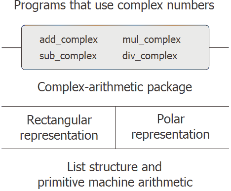

# 2.4抽象数据的多种表示形式

> 译者： [https://sicp.comp.nus.edu.sg/chapters/39](https://sicp.comp.nus.edu.sg/chapters/39)

我们已经引入了数据抽象，这是一种用于构造系统的方法，其方式是可以指定程序的大部分内容，而与实现程序所操纵的数据对象所涉及的选择无关。 例如，我们在 [2.1.1](25)高级别&lt;/quote&gt;函数分开。 生成的程序具有如图 [2.1](26#fig_2.1) 所示的结构。

这些数据抽象壁垒是控制复杂性的强大工具。 通过隔离数据对象的基础表示，我们可以将设计大型程序的任务划分为可以单独执行的较小任务。 但是，这种数据抽象功能还不够强大，因为谈论&lt;quote&gt;数据对象的基础表示&lt;/quote&gt;可能并不总是有意义。

一方面，一个数据对象可能有多个有用的表示形式，并且我们可能希望设计可以处理多种表示形式的系统。 举一个简单的例子，复数可以用两种几乎等效的方式表示：矩形（实部和虚部）和极坐标（大小和角度）。 有时矩形更合适，而极性则更合适。 的确，可以想象一个系统，其中以两种方式表示复数，并且其中用于操纵复数的函数可以使用任一种表示方式。

更重要的是，编程系统通常是由长时间工作的许多人设计的，受制于随时间变化的要求。 在这样的环境中，根本不可能每个人都事先同意数据表示的选择。 因此，除了将表示与使用隔离开的数据抽象壁垒之外，我们还需要将不同的设计选择彼此隔离并允许不同的选择在一个程序中共存的抽象壁垒。 此外，由于大型程序通常是通过组合隔离设计的现有模块来创建的，因此我们需要使用约定，允许程序员将模块并入_附加到较大的系统_中，也就是说，无需重新设计或重新实现这些程序 模块。

在本节中，我们将学习如何处理可能由程序的不同部分以不同方式表示的数据。 这需要构造_通用函数_-可以对可能以多种方式表示的数据进行操作的函数。 我们构建泛型函数的主要技术将是根据具有_类型标签_的数据对象工作，即，数据对象包括有关如何处理它们的明确信息。 我们还将讨论_数据导向_编程，这是一种功能强大且方便的实现策略，用于通过常规操作来附加组装系统。

我们从简单的复数示例开始。 我们将看到类型标记和数据定向样式如何使我们能够为复数设计单独的矩形和极坐标表示，同时保持抽象&lt;quote&gt;复数&lt;/quote&gt;数据对象的概念。 我们将通过根据通用选择器定义复数（`add_complex`，`sub_complex`，`mul_complex`和`div_complex`）的算术函数来实现此目的，这些选择器访问复数的各个部分，而与数字的表示方式无关。 生成的复数系统，如图 [2.19](39#fig_2.19)水平&lt;/quote&gt;抽象屏障的作用与图中的 [2.1](26#fig_2.1)高级别&lt;/quote&gt;操作与&lt;quote&gt;低级&lt;/quote&gt;表示分离。 此外，还有一个&lt;quote&gt;垂直&lt;/quote&gt;屏障，使我们能够分别设计和安装替代表示。

<figure>**[图2.19](39#fig_2.19)** 复数系统中的数据提取障碍。</figure>

在 [2.5](43)数字&lt;/quote&gt;，并且在需要新型数字时可以轻松扩展。 在 [2.5.3](46) 部分中，我们将展示如何在执行符号代数的系统中使用泛型算术。

