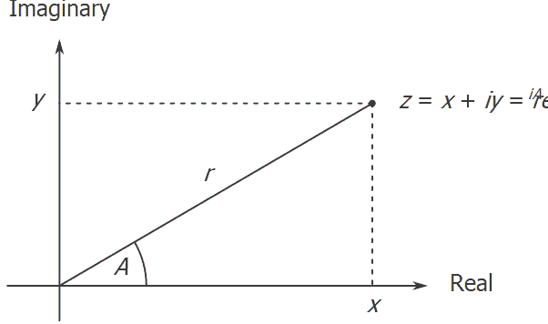
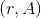
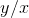

# 2.4.1复数的表示形式

> 译者： [https://sicp.comp.nus.edu.sg/chapters/40](https://sicp.comp.nus.edu.sg/chapters/40)

我们将开发一个对复数执行算术运算的系统，作为使用通用运算的程序的一个简单但不切实际的示例。 我们首先讨论复数的两个合理表示形式，即有序对：矩形形式（实部和虚部）和极坐标形式（幅度和角度）。 [[1]](40#footnote-1) 部分 [2.4.2](41) 将显示如何通过使用类型标记和通用操作将两种表示形式共存于单个系统中。

像有理数一样，复数自然地表示为有序对。 复数的集合可以被认为是具有两个正交轴的二维空间，即&lt;quote&gt;实&lt;/quote&gt;轴和&lt;quote&gt;虚数&lt;/quote&gt;轴。 （参见图 [2.20](40#fig_2.20) 。）从这个角度来看，复数（其中）可以视为平面中其实际坐标为 ，其虚坐标为。 在这种表示形式中，复数的加法减少了坐标的加法：\ begin {eqnarray *} \ mbox {Real-part}（z_ {1} + z_ {2}）& = & \ mbox {Real-part }（z_ {1}）+ \ mbox {实部}（z_ {2}）\\ \ mbox {虚部}（z_ {1} + z_ {2}）& = & \ mbox {Imaginary-part}（z_1）+ \ mbox {Imaginary-part}（z_2）\ end {eqnarray *}

乘以复数时，更自然地考虑以极性形式表示复数，即幅度和角度（图中的和 [ 2.20 ](40#fig_2.20) ）。 两个复数的乘积是通过将一个复数扩展为另一个的长度然后将其旋转到另一个的角度而​​获得的向量：\ begin {eqnarray *} \ mbox {Magnitude}（z_ {1} \ cdot z_ {2}）= \ mbox {Magnitude}（z_ {1}）\ cdot \ mbox {Magnitude}（z_ {2}）\\ \ mbox {Angle}（z_ {1} \ cdot z_ {2}）= \ mbox {角度}（z_ {1}）+ \ mbox {角度}（z_ {2}）\ end {eqnarray *}

因此，复数有两种不同的表示形式，适用于不同的运算。 但是，从有人编写使用复数的程序的角度来看，数据抽象的原理表明，不管计算机使用哪种表示形式，用于操纵复数的所有操作都应该可用。 例如，通常能够找到由直角坐标指定的复数的大小。 类似地，通常能够确定由极坐标指定的复数的实部。

<figure>**[图2.20](40#fig_2.20)** 复数作为平面中的点。</figure>

要设计这样的系统，我们可以遵循在 [2.1.1](25) 部分中设计有理数包时遵循的数据提取策略。 假设对复数的运算是通过四个选择器实现的：`real_part`，`imag_part`，`magnitude`和`angle`。 还要假设我们有两个构造复数的函数：`make_from_real_imag`返回具有指定实部和虚部的复数，`make_from_mag_ang`返回具有指定幅度和角度的复数。 这些函数的特性是，对于任何复数`z`，两者

```js
make_from_real_imag(real_part(z),imag_part(z));
```

and

```js
make_from_mag_ang(magnitude(z), angle(z));
```

produce complex numbers that are equal to `z`.

使用这些构造函数和选择器，我们可以使用构造函数和选择器指定的&lt;quote&gt;抽象数据&lt;/quote&gt;对复数进行算术运算，就像我们在 [2.1.1节中对有理数所做的一样。 ]](25) 。 如上面的公式所示，我们可以根据实部和虚部来添加和减去复数，同时可以根据大小和角度对复数进行乘除运算：

```js
function add_complex(z1, z2) {
    return make_from_real_imag(
               real_part(z1) + real_part(z2),
               imag_part(z1) + imag_part(z2));
}
function sub_complex(z1, z2) {
    return make_from_real_imag(
               real_part(z1) - real_part(z2),
               imag_part(z1) - imag_part(z2));
}
function mul_complex(z1, z2) {
    return make_from_mag_ang(
               magnitude(z1) * magnitude(z2),
               angle(z1) + angle(z2));
}
function div_complex(z1, z2) {
    return make_from_mag_ang(
               magnitude(z1) / magnitude(z2),
               angle(z1) - angle(z2));
}
```

要完成复数包，我们必须选择一个表示形式，并且必须根据原始数字和原始列表结构实现构造函数和选择器。 有两种显而易见的方法：我们可以将&lt;quote&gt;矩形形式&lt;/quote&gt;一对（实部，虚部）或&lt;quote&gt;极性形式&lt;/quote&gt;一对（量级， 角度）。 我们应该选择哪一个？

为了使不同的选择具体化，可以想象有两个程序员Ben Bitdiddle和Alyssa P. Hacker，他们正在独立设计复数系统的表示形式。 Ben选择以矩形形式表示复数。 通过这种选择，选择复数的实部和虚部非常简单，就像构造具有给定实部和虚部的复数一样。 为了找到大小和角度，或者用给定的大小和角度构造复数，他使用了三角关系\ begin {eqnarray *} x = r \ \ cos A \ qquad \ qquad r = \ sqrt {x ^ 2 + y ^ 2} \\ y = r \ \ sin A \ qquad \ qquad A = \ arctan（y，x）\ end {eqnarray *}与实部和虚部（，）相关 到幅度和角度。 [[2]](40#footnote-2) 因此，Ben的表示由以下选择器和构造器给出：

```js
function real_part(z) {
    return head(z);
}
function imag_part(z) {
    return tail(z);
}
function magnitude(z) {
    return math_sqrt(
               square(real_part(z)) + 
               square(imag_part(z)));
}
function angle(z) {
    return math_atan2(imag_part(z),real_part(z));
}
function make_from_real_imag(x, y) {
    return pair(x, y);
}
function make_from_mag_ang(r, a) {
    return pair(r * math_cos(a), r * math_sin(a));
}
```

相反，Alyssa选择以极性形式表示复数。 对于她来说，选择大小和角度很简单，但是她必须使用三角关系来获得实部和虚部。 阿丽莎的代表是：

```js
function real_part(z) {
    return magnitude(z) * math_cos(angle(z));
}
function imag_part(z) {
    return magnitude(z) * math_sin(angle(z));
}
function magnitude(z) {
    return head(z);
}
function angle(z) {
    return tail(z);
}
function make_from_real_imag(x, y) {
    return pair(math_sqrt(square(x) + square(y)),
                math_atan2(y, x));
}
function make_from_mag_ang(r, a) {
    return pair(r, a);
}
```

The discipline of data abstraction ensures that the same implementation of `add_complex`, `sub_complex`, `mul_complex`, and `div_complex` will work with either Ben's representation or Alyssa's representation.

* * *

[[1]](40#footnote-link-1) In actual computational systems, rectangular form is preferable to polar form most of the time because of roundoff errors in conversion between rectangular and polar form. This is why the complex-number example is unrealistic. Nevertheless, it provides a clear illustration of the design of a system using generic operations and a good introduction to the more substantial systems to be developed later in this chapter.

[[2]](40#footnote-link-2) The arctangent function referred to here, computed by JavaScript's `math_atan2` function, is defined so as to take two arguments  and  and to return the angle whose tangent is . The signs of the arguments determine the quadrant of the angle.

