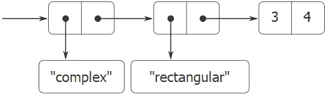
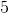

# 2.5.1通用算术运算

> 译者： [https://sicp.comp.nus.edu.sg/chapters/44](https://sicp.comp.nus.edu.sg/chapters/44)

设计通用算术运算的任务类似于设计通用复数运算的任务。 例如，我们希望有一个通用加法函数`add`，其作用类似于普通数上的普通原始加法`+`，有理数上的`add_rat`和复数上的`add_complex`。 通过遵循在 [2.4.3](42) 部分中使用的相同策略，可以实现`add`和其他通用算术运算，以实现复数的通用选择器。 我们将在每种数字上附加一个类型标签，并使泛型函数根据其参数的数据类型分派到适当的程序包。

通用算术函数定义如下：

```js
function add(x, y) {
   return apply_generic("add", list(x, y));
}
function sub(x, y) {
   return apply_generic("sub", list(x, y));
}
function mul(x, y) {
   return apply_generic("mul", list(x, y));
}
function div(x, y) {
   return apply_generic("div", list(x, y));
}
```

We begin by installing a package for handling _ordinary_ numbers, that is, the primitive numbers of our language. We will tag these with the symbol `javascript_number`. The arithmetic operations in this package are the primitive arithmetic functions (so there is no need to define extra functions to handle the untagged numbers). Since these operations each take two arguments, they are installed in the table keyed by the list `list("javascript_number","javascript_number")`:

```js
function install_javascript_number_package() {
    function tag(x) {
        return attach_tag("javascript_number", x);
    }
    put("add", list("javascript_number", "javascript_number"), 
        (x, y) => tag(x + y));
    put("sub", list("javascript_number", "javascript_number"), 
        (x, y) => tag(x - y));
    put("mul", list("javascript_number", "javascript_number"), 
        (x, y) => tag(x * y));
    put("div", list("javascript_number", "javascript_number"), 
        (x, y) => tag(x / y));
    put("make", "javascript_number", 
        x => tag(x));
    return "done";
}
```

Users of the JavaScript-number package will create (tagged) ordinary numbers by means of the function:

```js
function make_javascript_number(n) {
    return get("make", "javascript_number")(n);
}
```

既然通用算术系统的框架已经到位，我们就可以轻松地包含新的数字了。 这是一个执行有理数算术的程序包。 注意，作为可加性的好处，我们可以不加修改地将 [2.1.1](25) 节中的有理数代码用作程序包中的内部函数：

```js
function install_rational_package() {
    // internal functions
    function numer(x) { 
        return head(x); 
    }
    function denom(x) {
        return tail(x);
    }
    function make_rat(n, d) { 
        let g = gcd(n, d);
        return pair(n / g, d / g); 
    }
    function add_rat(x, y) {
        return make_rat(numer(x) * denom(y) +
                        numer(y) * denom(x),             
                        denom(x) * denom(y));
    }
    function sub_rat(x, y) {
        return make_rat(numer(x) * denom(y) -
                        numer(y) * denom(x),             
                        denom(x) * denom(y));
    }
    function mul_rat(x, y) {
        return make_rat(numer(x) * numer(y),
                        denom(x) * denom(y));
    }
    function div_rat(x, y) {
        return make_rat(numer(x) * denom(y),
                        denom(x) * numer(y));
    }
    // interface to rest of the system
    function tag(x) {
        return attach_tag("rational", x);
    }
    put("make", "rational", make_rational);
    put("add", list("rational", "rational"), add_rational);
    put("sub", list("rational", "rational"), sub_rational);
    put("mul", list("rational", "rational"), mul_rational);
    put("div", list("rational", "rational"), div_rational);
}

function make_rational(n, d) {
    return (get("make", "rational"))(n, d);
}
```

我们可以使用标签`"complex"`安装类似的软件包来处理复数。 在创建包时，我们从表中提取由矩形和极坐标包定义的操作`make_from_real_imag`和`make_from_mag_ang`。 可加性允许我们使用与 [2.4.1](40) 部分相同的`add_complex`，`sub_complex`，`mul_complex`和`div_complex`功能作为内部操作。

```js
function install_complex_package() {
    // imported functions from rectangular and polar packages	  
    function make_from_real_imag(x, y) {
        return get("make_from_real_imag", "rectangular")(x, y);
    }
    function make_from_mag_ang(r, a) {
        return get("make_from_mag_ang", "polar")(r, a);
    }

    // internal functions
    function add_complex(z1, z2) {
        return make_from_real_imag(real_part(z1) + 
                                   real_part(z2),
                                   imag_part(z1) + 
                                   imag_part(z2));
    }
    function sub_complex(z1, z2) {
        return make_from_real_imag(real_part(z1) - 
                                   real_part(z2),
                                   imag_part(z1) - 
                                   imag_part(z2));
    }
    function mul_complex(z1, z2) {
        return make_from_mag_ang(magnitude(x) * 
                                 magnitude(z2),
                                 angle(z1) + 
                                 angle(z2));
	}
    function div_complex(z1, z2) {
        return make_from_mag_ang(magnitude(x) / 
                                 magnitude(z2),
                                 angle(z1) - 
                                 angle(z2));
	}

    // interface to rest of the system
    function tag(z) {
        return attach_tag("complex", z);
    }
    put("add", list("complex", "complex"), 
        (z1, z2) => tag(add_complex(z1, z2)));
    put("sub", list("complex", "complex"), 
        (z1, z2) => tag(sub_complex(z1, z2)));
    put("mul", list("complex", "complex"), 
        (z1, z2) => tag(mul_complex(z1, z2)));
    put("div", list("complex", "complex"), 
        (z1, z2) => tag(div_complex(z1, z2)));
    put("make_from_real_imag", "complex", 
        (x, y) => tag(make_from_real_imag(x, y)));
    put("make_from_mag_ang", "complex", 
        (r, a) => tag(make_from_mag_ang(r, a)));
    return "done";    
}
```

复数软件包之外的程序可以从实部和虚部或从大小和角度构造复数。 请注意，最初在矩形和极地软件包中定义的基础函数如何导出到复杂的软件包，然后从那里导出到外界。

```js
function make_complex_from_real_imag(x, y){
   return get("make_from_real_imag", "complex")(x, y);
}
function make_complex_from_mag_ang(r, a){
   return get("make_from_mag_ang", "complex")(r, a);
}
```

What we have here is a two-level tag system. A typical complex number, such as  in rectangular form, would be represented as shown in Figure <ref name="fig:complex-number-structure">[2.24](44#fig_2.24)</ref>. The outer tag (`"complex"`) is used to direct the number to the complex package. Once within the complex package, the next tag (`"rectangular"`) is used to direct the number to the rectangular package. In a large and complicated system there might be many levels, each interfaced with the next by means of generic operations. As a data object is passed <quote>downward,</quote> the outer tag that is used to direct it to the appropriate package is stripped off (by applying `contents`) and the next level of tag (if any) becomes visible to be used for further dispatching. <split><figure>**[Figure 2.24](44#fig_2.24)** Representation of  in rectangular form.</figure></split> 

在上述程序包中，我们使用了`add_rat`，`add_complex`和其他算术函数，它们与原始编写的完全相同。 但是，一旦这些定义成为不同安装功能的内部定义，它们就不再需要彼此不同的名称：我们可以在两个软件包中简单地将它们命名为`add`，`sub`，`mul`和`div`。

<exercise>Louis Reasoner tries to evaluate the expression `magnitude(z)` where `z` is the object shown in Figure <ref name="fig:complex-number-structure">[2.24](44#fig_2.24)</ref>. To his surprise, instead of the answer  he gets an error message from `apply_generic`, saying there is no method for the operation `magnitude` on the types `["complex",null]`. He shows this interaction to Alyssa P. Hacker, who says <quote>The problem is that the complex-number selectors were never defined for `"complex"` numbers, just for `"polar"` and `"rectangular"` numbers. All you have to do to make this work is add the following to the `complex` package:</quote>

```js
put("real_part", list("complex"), real_part);
put("imag_part", list("complex"), imag_part);
put("magnitude", list("complex"), magnitude);
put("angle",     list("complex"), angle);
```

Describe in detail why this works. As an example, trace through all the functions called in evaluating the expression `magnitude(z)` where `z` is the object shown in Figure <ref name="fig:complex-number-structure">[2.24](44#fig_2.24)</ref>. In particular, how many times is `apply_generic` invoked? What function is dispatched to in each case?<button class="btn btn-secondary solution_btn" data-toggle="collapse" href="#no_solution_44_1_div">Add solution</button>There is currently no solution available for this exercise. This textbook adaptation is a community effort. Do consider contributing by providing a solution for this exercise, using a Pull Request in [Github](https://github.com/source-academy/sicp).</exercise><exercise>The internal functions in the `javascript_number` package are essentially nothing more than calls to the primitive functions `+`, `-`, etc. It was not possible to use the primitives of the language directly because our type-tag system requires that each data object have a type attached to it. In fact, however, all JavaScript implementations do have a type system, which they use internally. Primitive predicates such as `is_string` and `is_number` determine whether data objects have particular types. Modify the definitions of `type_tag`, `contents`, and `attach_tag` from section <ref name="sec:manifest-types">[2.4.2](41)</ref> so that our generic system takes advantage of JavaScript's internal type system. That is to say, the system should work as before except that ordinary numbers should be represented simply as JavaScript numbers rather than as pairs whose `head` is the string `"javascript_number"`.<button class="btn btn-secondary solution_btn" data-toggle="collapse" href="#no_solution_44_1_div">Add solution</button>There is currently no solution available for this exercise. This textbook adaptation is a community effort. Do consider contributing by providing a solution for this exercise, using a Pull Request in [Github](https://github.com/source-academy/sicp).</exercise><exercise>Define a generic equality predicate `is_equ` that tests the equality of two numbers, and install it in the generic arithmetic package. This operation should work for ordinary numbers, rational numbers, and complex numbers.<button class="btn btn-secondary solution_btn" data-toggle="collapse" href="#no_solution_44_1_div">Add solution</button>There is currently no solution available for this exercise. This textbook adaptation is a community effort. Do consider contributing by providing a solution for this exercise, using a Pull Request in [Github](https://github.com/source-academy/sicp).</exercise><exercise>Define a generic predicate `equal_to_zero` that tests if its argument is zero, and install it in the generic arithmetic package. This operation should work for ordinary numbers, rational numbers, and complex numbers.<button class="btn btn-secondary solution_btn" data-toggle="collapse" href="#no_solution_44_1_div">Add solution</button>There is currently no solution available for this exercise. This textbook adaptation is a community effort. Do consider contributing by providing a solution for this exercise, using a Pull Request in [Github](https://github.com/source-academy/sicp).</exercise>