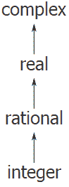
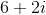
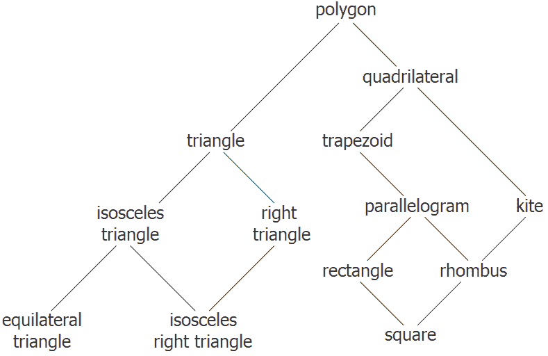

# 2.5.2组合不同类型的数据

> 译者： [https://sicp.comp.nus.edu.sg/chapters/45](https://sicp.comp.nus.edu.sg/chapters/45)

我们已经看到了如何定义一个包含普通数，复数，有理数以及我们可能决定发明的任何其他类型的数的统一算术系统，但是我们忽略了一个重要的问题。 到目前为止，我们定义的操作将不同的数据类型视为完全独立的。 因此，有单独的程序包用于相加两个或两个复数。 我们尚未考虑的事实是，定义跨越类型边界的操作（例如，将复数添加到普通数）是有意义的。 我们竭尽全力在程序的各个部分之间引入了障碍，以便可以分别开发和理解它们。 我们想以某种谨慎控制的方式介绍交叉类型的操作，以便我们可以在不严重违反模块边界的情况下为它们提供支持。

处理交叉类型操作的一种方法是为该操作对其有效的每种类型的可能组合设计不同的功能。 例如，我们可以扩展复数包，以便它提供将复数添加到普通数的功能，并使用标签`list("complex","javascript_number")`将其安装在表中： [[1]](45#footnote-1)

```js
// to be included in the complex package
function add_complex_to_javascript_num(z, x) {
   return make_from_real_imag(real_part(z) + x,
                              imag_part(z));
}
put("add", list("complex", "javascript_number"),
    (z, x) => tag(add_complex_to_javascript_num(z, x)));
```

该技术有效，但是很麻烦。 对于这样的系统，引入新类型的成本不仅是针对该类型的功能包的构造，而且还包括实现交叉类型操作的功能的构造和安装。 与在类型本身上定义操作所需的代码相比，这可能很容易。 该方法还破坏了我们将单独的程序包相加组合的能力，或者至少限制了单个程序包的实现者需要考虑其他程序包的程度。 例如，在上面的示例中，处理复数和普通数的混合运算应该由复数包负责。 但是，可以通过复杂程序包，有理程序包或使用从这两个程序包提取的操作的某些第三程序包来组合有理数和复数。 在设计具有多个程序包和许多跨类型操作的系统时，制定有关程序包之间责任分工的连贯策略可能是一项艰巨的任务。

## 强迫

在对完全不相关的类型起作用的完全不相关的操作的一般情况下，实现显式的跨类型操作（虽然可能很麻烦）是人们可以期望的最好方法。 幸运的是，我们通常可以通过利用类型系统中潜在的其他结构来做得更好。 通常，不同的数据类型不是完全独立的，并且可能有一种方法可以将一种类型的对象视为另一种类型。 该过程称为_强制_。 例如，如果要求我们将普通数与复数进行算术组合，则可以将普通数视为虚部为零的复数。 这将问题转换为合并两个复数的问题，这可以通过复数算术包以常规方式处理。

通常，我们可以通过设计强制功能来实现这一想法，这些功能会将一种类型的对象转换为另一种类型的等效对象。 这是一个典型的强制函数，它将给定的普通数转换为具有实部和虚部为零的复数：

```js
function javascript_number_to_complex(n) {
   return make_complex_from_real_imag(contents(n), 0);
}
```

We install these coercion functions in a special coercion table, indexed under the names of the two types:

```js
put_coercion("javascipt_number", 
             "complex", 
             javascript_number_to_complex);
```

(We assume that there are `put_coercion` and `get_coercion` functions available for manipulating this table.) Generally some of the slots in the table will be empty, because it is not generally possible to coerce an arbitrary data object of each type into all other types. For example, there is no way to coerce an arbitrary complex number to an ordinary number, so there will be no general `complex_to_javascript_number` function included in the table.

设置强制表之后，我们可以通过修改 [2.4.3](42) 部分的`apply_generic`功能以统一的方式处理强制。 当要求应用操作时，我们首先像以前一样检查是否为参数的类型定义了该操作。 如果是这样，我们将分派给在operation-and-type表中找到的函数。 否则，我们尝试强制。 为简单起见，我们仅考虑有两个参数的情况。 [[2]](45#footnote-2) 我们检查强制表以查看是否可以将第一种类型的对象强制转换为第二种类型。 如果是这样，我们将强制第一个参数，然后重试该操作。 如果通常无法将第一种类型的对象强制转换为第二种类型，则可以尝试以另一种方式强制转换，以查看是否存在将第二种参数强制转换为第一种参数类型的方法。 最后，如果没有已知的方法将任何一种类型强制转换为另一种类型，我们将放弃。 这是函数：

```js
function apply_generic(op, args) {
    const type_tags = map(type_tag, args);
    const fun = get(op, type_tags);
    if (fun !== false) {
        return fun(map(contents, args));
    } else {
        if (length(args) === 2) {
            const type1 = head(type_tags);
            const type2 = head(tail(type_tags));
            const a1 = head(args);
            const a2 = head(tail(args));
            const t1_to_t2 = get_coercion(type1, type2);
            const t2_to_t1 = get_coercion(type2, type1);
            if (t1_to_t2 !== false) {
                return apply_generic(op,list(t1_to_t2(a1),
                                             a2));
            } else if (t2_to_t1 !== false) {
                return apply_generic(op, list(a1,
                                              t2_to_t1(a2)));
		} else {
                return Error("No method for these types",
                             list(op, type_tags));
            }
        } else {
            return Error("No method for these types",
                         list(op, type_tags));
        }
    }
}
```

如上所述，这种强制方案比定义显式交叉类型操作的方法具有许多优势。 尽管我们仍然需要编写强制函数来关联类型（对于具有类型的系统可能需要函数），但是我们仅需要为每对类型编写一个函数，而不是为每个类型集合编写不同的函数 以及每个常规操作。 [[3]](45#footnote-3) 我们这里要依靠的事实是，类型之间的适当转换仅取决于类型本身，而不取决于要应用的操作。

另一方面，对于某些应用程序，我们的强制方案可能不够通用。 即使当两个要组合的对象都不能转换为另一个对象的类型时，仍然可以通过将两个对象都转换为第三种类型来执行操作。 为了处理这样的复杂性并仍然在我们的程序中保留模块化，通常需要构建利用类型之间关系的更进一步结构的系统，这将在下面讨论。

## 类型层次结构

上面提出的强制方案依赖于类型对之间自然关系的存在。 通常，在不同类型之间如何相互关联的全局&lt;quote&gt;结构更多。 例如，假设我们正在构建一个通用算术系统来处理整数，有理数，实数和复数。 在这样的系统中，将整数视为一种特殊的有理数是很自然的，而有理数又是一种实数，又是一种复数。 我们实际上拥有的是类型的所谓_层次结构，例如，整数是有理数的_子类型_（即，可以应用于有理数的任何运算） 数字可以自动应用于整数）。 相反，我们说有理数形成整数的_超类型_。 我们这里具有的特定层次结构是非常简单的类型，其中每种类型最多具有一个超类型和最多一个子类型。 这种结构称为_塔_，如图 [2.25](45#fig_2.25)

<figure>_**[图2.25](45#fig_2.25)** 类型的塔。_</figure>

如果我们具有塔式结构，则可以大大简化向层次结构中添加新类型的问题，因为我们仅需要指定如何将新类型嵌入到其上方的下一个超类型中，以及如何将其作为下面类型的超类型 它。 例如，如果要向整数添加整数，则无需显式定义特殊的强制函数`integer_to_complex`。 相反，我们定义了如何将整数转换为有理数，如何将有理数转换为实数，以及如何将实数转换为复数。 然后，我们允许系统通过这些步骤将整数转换为复数，然后将两个复数相加。

我们可以通过以下方式重新设计`apply_generic`函数：对于每种类型，我们需要提供`raise`函数，该函数&lt;quote&gt;将塔中该类型的&lt;/quote&gt;对象提升一级。 然后，当需要系统对不同类型的对象进行操作时，可以依次提升较低类型的对象，直到所有对象都位于塔中的同一高度。 （练习 [2.83](45#ex_2.83)[2.84](45#ex_2.84) 涉及实施此类策略的细节。）

塔的另一个优点是，我们可以轻松实现每个类型&lt;quote&gt;都继承&lt;/quote&gt;在超类型上定义的所有操作的概念。 例如，如果我们不提供用于查找整数实部的特殊函数，则由于整数是复数的子类型，我们应该期望为整数定义`real_part`。 在塔中，我们可以通过修改`apply_generic`以统一的方式安排此操作。 如果没有为给定对象的类型直接定义所需的操作，则将对象提升为其超类型，然后重试。 因此，我们爬上塔，随即改变论据，直到找到可以执行所需操作的级别或达到最高点（在这种情况下我们放弃）。

塔楼在更一般的层次结构上的另一个优点是，它为我们提供了一种简单的方法，可以将数据对象降低为最简单的表示形式。 例如，如果将添加到，则最好以整数6而不是复数的形式获得答案。 练习 [ 2.85 ](45#ex_2.85) 讨论了实现这种降低操作的方法。 （诀窍在于，我们需要一种通用的方法来区分那些可以降低的对象（例如）和那些不能降低的对象（例如。）

<figure>**[ [图2.26](45#fig_2.26)** 几何图形类型之间的关系。</figure>

## 层次结构的不足

如我们所见，如果我们系统中的数据类型可以自然地排列在塔中，那么这将大大简化处理不同类型的泛型运算的问题。 不幸的是，通常情况并非如此。 图 [2.26](45#fig_2.26)提升层次结构中&lt;/quote&gt;类型的独特方法。 找到向其中施加操作到对象的&lt;quote&gt;正确的&lt;/quote&gt;超型可能涉及在整个类型网络中进行大量搜索，例如`apply_generic`等功能。 由于一个类型通常有多个子类型，因此在将值&lt;quote&gt;强制降低为&lt;/quote&gt;类型层次结构时，存在类似的问题。 在大型系统的设计中仍要保持模块化的同时，要处理大量相互关联的类型非常困难，这是当前许多研究的领域。 [[4]](45#footnote-4)

<exercise>Louis Reasoner has noticed that `apply_generic` may try to coerce the arguments to each other's type even if they already have the same type. Therefore, he reasons, we need to put functions in the coercion table to <quote>coerce</quote> arguments of each type to their own type. For example, in addition to the `javascript_number_to_complex` coercion shown above, he would do:

```js
function javascript_number_to_javascript_number(n) { 
    return n;
}
function complex_number_to_complex_number(n) { 
    return n;
}
put_coercion("javascript_number", "javascript_number",
             javascript_number_to_javascript_number);
put_coercion("complex_number", "complex_number",
             complex_number_to_complex_number);
```

1.  安装了Louis的强制功能后，如果用表中找不到的`"javascript_number"`类型的两个自变量或`"complex"`类型的两个自变量调用`apply_generic`，会发生什么情况呢？ 例如，假设我们定义了一个通用的幂运算：

    ```js
    function exp(x, y) { 
        return apply_generic("exp", list(x, y)); 
    }
    ```

    ，并且在JavaScript-number包中但没有在其他任何包中放置了用于求幂的函数：[

    ```js
    // following added to JavaScript-number package
    put("exp", list("javascript_number", "javascript_number"),
        (x, y) =&gt; tag(math_exp(x, y))); // primitive math_exp
    ```

    如果我们用两个复数作为参数调用`exp`，会发生什么？
2.  Louis是否正确，必须对具有相同类型参数的强制执行某些操作，还是`apply_generic`照原样正确工作？
3.  修改`apply_generic`，以便在两个参数具有相同类型的情况下不尝试强制转换。

<button class="btn btn-secondary solution_btn" data-toggle="collapse" href="#no_solution_45_1_div">Add solution</button>There is currently no solution available for this exercise. This textbook adaptation is a community effort. Do consider contributing by providing a solution for this exercise, using a Pull Request in [Github](https://github.com/source-academy/sicp).</exercise><exercise>Show how to generalize `apply_generic` to handle coercion in the general case of multiple arguments. One strategy is to attempt to coerce all the arguments to the type of the first argument, then to the type of the second argument, and so on. Give an example of a situation where this strategy (and likewise the two-argument version given above) is not sufficiently general. (Hint: Consider the case where there are some suitable mixed-type operations present in the table that will not be tried.)<button class="btn btn-secondary solution_btn" data-toggle="collapse" href="#no_solution_45_1_div">Add solution</button>There is currently no solution available for this exercise. This textbook adaptation is a community effort. Do consider contributing by providing a solution for this exercise, using a Pull Request in [Github](https://github.com/source-academy/sicp).</exercise><exercise>Suppose you are designing a generic arithmetic system for dealing with the tower of types shown in Figure <ref name="fig:tower">[2.25](45#fig_2.25)</ref>: integer, rational, real, complex. For each type (except complex), design a function that raises objects of that type one level in the tower. Show how to install a generic `raise` operation that will work for each type (except complex).<button class="btn btn-secondary solution_btn" data-toggle="collapse" href="#no_solution_45_1_div">Add solution</button>There is currently no solution available for this exercise. This textbook adaptation is a community effort. Do consider contributing by providing a solution for this exercise, using a Pull Request in [Github](https://github.com/source-academy/sicp).</exercise><exercise>Using the `raise` operation of exercise <ref name="ex:raise">[2.83](45#ex_2.83)</ref>, modify the `apply_generic` function so that it coerces its arguments to have the same type by the method of successive raising, as discussed in this section. You will need to devise a way to test which of two types is higher in the tower. Do this in a manner that is <quote>compatible</quote> with the rest of the system and will not lead to problems in adding new levels to the tower.<button class="btn btn-secondary solution_btn" data-toggle="collapse" href="#no_solution_45_1_div">Add solution</button>There is currently no solution available for this exercise. This textbook adaptation is a community effort. Do consider contributing by providing a solution for this exercise, using a Pull Request in [Github](https://github.com/source-academy/sicp).</exercise><exercise>This section mentioned a method for <quote>simplifying</quote> a data object by lowering it in the tower of types as far as possible. Design a function `drop` that accomplishes this for the tower described in exercise <ref name="ex:raise">[2.83](45#ex_2.83)</ref>. The key is to decide, in some general way, whether an object can be lowered. For example, the complex number  can be lowered as far as `"real"`, the complex number  can be lowered as far as `"integer"`, and the complex number  cannot be lowered at all. Here is a plan for determining whether an object can be lowered: Begin by defining a generic operation `project` that <quote>pushes</quote> an object down in the tower. For example, projecting a complex number would involve throwing away the imaginary part. Then a number can be dropped if, when we `project` it and `raise` the result back to the type we started with, we end up with something equal to what we started with. Show how to implement this idea in detail, by writing a `drop` function that drops an object as far as possible. You will need to design the various projection operations[[5]](45#footnote-5) and install `project` as a generic operation in the system. You will also need to make use of a generic equality predicate, such as described in exercise <ref name="ex:equ?">[2.79](44#ex_2.79)</ref>. Finally, use `drop` to rewrite `apply_generic` from exercise <ref name="ex:apply-with-raise">[2.84](45#ex_2.84)</ref> so that it <quote>simplifies</quote> its answers.<button class="btn btn-secondary solution_btn" data-toggle="collapse" href="#no_solution_45_1_div">Add solution</button>There is currently no solution available for this exercise. This textbook adaptation is a community effort. Do consider contributing by providing a solution for this exercise, using a Pull Request in [Github](https://github.com/source-academy/sicp).</exercise><exercise>Suppose we want to handle complex numbers whose real parts, imaginary parts, magnitudes, and angles can be either ordinary numbers, rational numbers, or other numbers we might wish to add to the system. Describe and implement the changes to the system needed to accommodate this. You will have to define operations such as `sine` and `cosine` that are generic over ordinary numbers and rational numbers.<button class="btn btn-secondary solution_btn" data-toggle="collapse" href="#no_solution_45_1_div">Add solution</button>There is currently no solution available for this exercise. This textbook adaptation is a community effort. Do consider contributing by providing a solution for this exercise, using a Pull Request in [Github](https://github.com/source-academy/sicp).</exercise>

* * *

[[1]](45#footnote-link-1) We also have to supply an almost identical function to handle the types `list("javascript_number","complex")`.

[[2]](45#footnote-link-2) See exercise <ref name="ex:multi-coercion">[2.82](45#ex_2.82)</ref> for generalizations.

[[3]](45#footnote-link-3) If we are clever, we can usually get by with fewer than  coercion functions. For instance, if we know how to convert from type 1 to type 2 and from type 2 to type 3, then we can use this knowledge to convert from type 1 to type 3\. This can greatly decrease the number of coercion functions we need to supply explicitly when we add a new type to the system. If we are willing to build the required amount of sophistication into our system, we can have it search the <quote>graph</quote> of relations among types and automatically generate those coercion functions that can be inferred from the ones that are supplied explicitly.

[[4]](45#footnote-link-4) This statement, which also appears in the first edition of this book, is just as true now as it was when we wrote it twelve years ago. Developing a useful, general framework for expressing the relations among different types of entities (what philosophers call <quote>ontology</quote>) seems intractably difficult. The main difference between the confusion that existed ten years ago and the confusion that exists now is that now a variety of inadequate ontological theories have been embodied in a plethora of correspondingly inadequate programming languages. For example, much of the complexity of object-oriented programming languages—and the subtle and confusing differences among contemporary object-oriented languages—centers on the treatment of generic operations on interrelated types. Our own discussion of computational objects in chapter 3 avoids these issues entirely. Readers familiar with object-oriented programming will notice that we have much to say in chapter 3 about local state, but we do not even mention <quote>classes</quote> or <quote>inheritance.</quote> In fact, we suspect that these problems cannot be adequately addressed in terms of computer-language design alone, without also drawing on work in knowledge representation and automated reasoning.

[[5]](45#footnote-link-5) A real number can be projected to an integer using the `round` primitive, which returns the closest integer to its argument.

