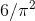
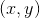
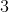
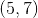
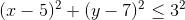
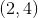
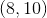
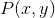
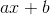

# 3.1.2引入作业的好处

> 译者： [https://sicp.comp.nus.edu.sg/chapters/50](https://sicp.comp.nus.edu.sg/chapters/50)

正如我们将看到的，将赋值引入我们的编程语言会使我们陷入困难的概念性问题的丛林。 但是，将系统视为具有局部状态的对象的集合是一种用于维护模块化设计的强大技术。 举一个简单的例子，考虑一个函数`rand`的设计，该函数每次被调用时都会返回一个随机选择的整数。

随机选择&lt;quote&gt;是什么意思还不清楚。&lt;/quote&gt; 我们大概想要的是连续调用`rand`来产生具有均匀分布统计特性的数字序列。 在此我们将不讨论生成合适序列的方法。 相反，让我们假设我们有一个函数`rand_update`，该函数具有以下性质：如果我们以给定数字`x_1`开头并形成

```js
x_2 = rand_update(x_1);
x_3 = rand_update(x_2);
```

then the sequence of values `x_1`, `x_2`, `x_3`, …, will have the desired statistical properties.[[1]](50#footnote-1)

我们可以使用局部状态变量`x`并将其初始化为某个固定值`random_init`的功能来实现`rand`。 每次对`rand`的调用都会计算`x`当前值的`rand_update`，将其返回为随机数，还将其存储为`x`的新值。

```js
function make_rand() {
   let x = random_init;
   function rand() {
        x = rand_update(x);
        return x;
   }
   return rand;
}
const rand = make_rand();
```

当然，我们可以通过直接调用`rand_update`来生成相同的随机数序列，而无需使用赋值。 但是，这意味着我们程序中使用随机数的任何部分都必须明确记住要作为`rand_update`的参数传递的`x`的当前值。 要意识到这会带来什么烦恼，请考虑使用随机数来实现一种称为_蒙特卡洛模拟_的技术。

蒙特卡洛方法包括从大量样本中随机选择样本实验，然后根据通过将这些实验的结果制成表格估算出的概率进行推论。 例如，我们可以使用以下事实来近似：是随机选择的两个整数没有共同因素的概率； 也就是说，它们的最大公约数将为1。 [[2]](50#footnote-2) 为了获得与的近似值，我们进行了大量实验。 在每个实验中，我们随机选择两个整数，然后进行测试以查看它们的GCD是否为1。通过测试的次数的分数给出了我们对的估计，由此我们获得了对的近似值。 。

我们程序的核心是一个函数`monte_carlo`，该函数以尝试实验的次数作为参数，并与该实验一起表示为无参数函数，该函数每次运行都会返回true或false。 `monte_carlo`对指定的试验次数进行实验，并返回一个数字，告诉您试验被认为是正确的那部分试验。

```js
function estimate_pi(trials) {
    return math_sqrt(6 / monte_carlo(trials, cesaro_test));
}

function cesaro_test() {
    return gcd(rand(), rand()) === 1;
}

function monte_carlo(trials, experiment) {
    function iter(trials_remaining, trials_passed) {
        if (trials_remaining === 0) {
            return trials_passed / trials;
        } else if (experiment()) {
            return iter(trials_remaining - 1,
                        trials_passed + 1);
        } else {
            return iter(trials_remaining - 1, 
                        trials_passed);
        }
    }
    return iter(trials, 0);
}
```

现在让我们直接使用`rand_update`而不是`rand`尝试相同的计算，如果不使用赋值来建模局部状态，我们将被迫继续进行以下操作：

```js
function estimate_pi(trials) {
    return math_sqrt(6 / random_gcd_test(trials, random_init));
}

function random_gcd_test(trials, initial_x) {
    function iter(trials_remaining, trials_passed, x) {
        const x1 = rand_update(x);
        const x2 = rand_update(x1);
        if (trials_remaining === 0) {
            return trials_passed / trials;
        } else if (gcd(x1, x2) === 1) {
            return iter(trials_remaining - 1, 
                        trials_passed + 1, x2);
        } else {
            return iter(trials_remaining - 1, 
                        trials_passed, x2);
        }
    }
    return iter(trials, 0, initial_x);
}
```

虽然该程序仍然很简单，但它却背叛了一些痛苦的模块化漏洞。 在程序的第一个版本中，使用`rand`可以将蒙特卡洛方法直接表示为通用`monte_carlo`函数，该函数以任意`experiment`函数作为参数。 在程序的第二版中，对于随机数生成器没有本地状态，`random_gcd_test`必须显式操作随机数`x1`和`x2`，并通过迭代循环回收`x2`作为[ `rand_update`。 这种对随机数的显式处理将累积测试结果的结构与以下事实交织在一起：我们的特定实验使用两个随机数，而其他蒙特卡洛实验可能使用一个或三个随机数。 甚至顶级功能`estimate_pi`也必须考虑提供初始随机数。 随机数生成器内部泄漏到程序的其他部分的事实使我们很难隔离蒙特卡洛的想法，以便将其应用于其他任务。 在程序的第一个版本中，赋值将随机数生成器的状态封装在[H​​TG9]函数中，以便随机数生成的详细信息与程序的其余部分保持独立。

蒙特卡洛示例说明的一般现象是：从复杂过程的一部分来看，其他部分似乎随时间而变化。 他们具有隐藏的时变本地状态。 如果我们希望编写结构能反映这种分解的计算机程序，则可以制作其行为随时间变化的计算对象（例如银行帐户和随机数生成器）。 我们使用局部状态变量对状态进行建模，并通过分配这些变量来对状态变化进行建模。

试图以这样的结论来结束讨论：通过引入赋值和在局部变量中隐藏状态的技术，与必须通过传递附加参数来显式操纵所有状态的情况相比，我们能够以更具模块化的方式构造系统。 不幸的是，正如我们将要看到的那样，这个故事并不是那么简单。

<exercise>_Monte Carlo integration_ is a method of estimating definite integrals by means of Monte Carlo simulation. Consider computing the area of a region of space described by a predicate  that is true for points  in the region and false for points not in the region. For example, the region contained within a circle of radius  centered at  is described by the predicate that tests whether . To estimate the area of the region described by such a predicate, begin by choosing a rectangle that contains the region. For example, a rectangle with diagonally opposite corners at  and  contains the circle above. The desired integral is the area of that portion of the rectangle that lies in the region. We can estimate the integral by picking, at random, points  that lie in the rectangle, and testing  for each point to determine whether the point lies in the region. If we try this with many points, then the fraction of points that fall in the region should give an estimate of the proportion of the rectangle that lies in the region. Hence, multiplying this fraction by the area of the entire rectangle should produce an estimate of the integral.Implement Monte Carlo integration as a function `estimate_integral` that takes as arguments a predicate `P`, upper and lower bounds `x1`, `x2`, `y1`, and `y2` for the rectangle, and the number of trials to perform in order to produce the estimate. Your function should use the same `monte_carlo` function that was used above to estimate . Use your `estimate_integral`  to produce an estimate of  by measuring the area of a unit circle.You will find it useful to have a function that returns a number chosen at random from a given range. The following `random_in_range` function implements this in terms of the `random` function used in section <ref name="sec:primality">[1.2.6](17)</ref>, which returns a nonnegative number less than its input.

```js
function random_in_range(low, high) {
    const range = high - low;
    return low + random(range);
}
```

<button class="btn btn-secondary solution_btn" data-toggle="collapse" href="#no_solution_50_1_div">Add solution</button>There is currently no solution available for this exercise. This textbook adaptation is a community effort. Do consider contributing by providing a solution for this exercise, using a Pull Request in [Github](https://github.com/source-academy/sicp).</exercise><exercise>It is useful to be able to reset a random-number generator to produce a sequence starting from a given value. Design a new `rand` function that is called with an argument that is either the symbol `generate` or the symbol `reset` and behaves as follows: `rand("generate")` produces a new random number; `(rand("reset"))()` resets the internal state variable to the designated . Thus, by resetting the state, one can generate repeatable sequences. These are very handy to have when testing and debugging programs that use random numbers.<button class="btn btn-secondary solution_btn" data-toggle="collapse" href="#solution_50_1_div">Solution</button> <solution>```js
let state = 2;

function rand(symbol) {
    if (symbol === "reset") {
        return new_state => {
            state = new_state;
        };
    } else {
        // symbol is "generate"
        state = (state * 1010) % 1101;
        return state;
    } 
}
```</solution></exercise> 

* * *

[[1]](50#footnote-link-1) One common way to implement `rand_update` is to use the rule that  is updated to  modulo , where , , and  are appropriately chosen integers. Chapter 3 of <citation>1981年

Knuth 1981</citation> includes an extensive discussion of techniques for generating sequences of random numbers and establishing their statistical properties. Notice that the `rand_update` function computes a mathematical function: Given the same input twice, it produces the same output. Therefore, the number sequence produced by `rand_update` certainly is not <quote>random,</quote> if by <quote>random</quote> we insist that each number in the sequence is unrelated to the preceding number. The relation between <quote>real randomness</quote> and so-called _pseudo-random_ sequences, which are produced by well-determined computations and yet have suitable statistical properties, is a complex question involving difficult issues in mathematics and philosophy. Kolmogorov, Solomonoff, and Chaitin have made great progress in clarifying these issues; a discussion can be found in <citation>Chaitin 1975</citation>.

[[2]](50#footnote-link-2) This theorem is due to E. Cesàro. See section 4.5.2 of <citation>Knuth 1981</citation> for a discussion and a proof.

