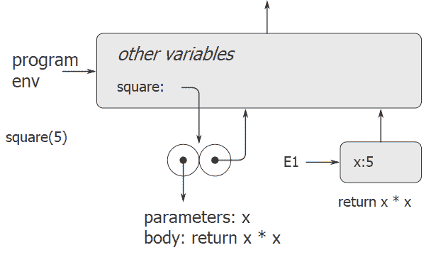

# 3.2.1评估规则

> 译者： [https://sicp.comp.nus.edu.sg/chapters/53](https://sicp.comp.nus.edu.sg/chapters/53)

&lt;split&gt;解释程序如何评估应用程序组合的总体规范与我们在 [1.1.5](7)

*   ` (  )`形式的应用程序组合执行以下操作：
    1.  评估应用程序组合的功能表达式，从而获得要应用的功能。
    2.  评估组合的参数表达式。
    3.  将函数定义自变量。

评估的环境模型在指定对参数应用复合函数意味着什么时取代了替换模型。

在评估环境模型中，一个函数始终是一对，其中包括一些代码和一个指向环境的指针。 仅以一种方式创建函数：通过评估函数定义表达式。 这产生了一个函数，该函数的代码是从函数定义表达式的文本中获得的，并且其环境是在其中评估了函数定义表达式以产生函数的环境。 例如，考虑函数声明

```js
function square(x) {
    return x * x;
}
```

evaluated in the global environment. The function declaration syntax is just syntactic sugar for an underlying implicit function definition expression. It would have been equivalent to have used

```js
const square = x => x * x;
```

which evaluates `x => x * x` and binds `square` to the resulting value, all in the global environment.

图 [3.2](53#fig_3.2) 显示了评估此函数声明语句的结果。 函数对象是一对，其代码指定函数具有一个形式参数，即`x`和函数体`return x * x;`。 函数的环境部分是指向程序环境的指针，因为这是在其中评估函数定义表达式以生成函数的环境。 将功能对象与符号`square`关联的新绑定已添加到程序框架。 框架中的绑定对应于const，并让声明直接嵌套在该框架中。 该程序产生一个自己的框架，我们将其称为_程序环境_，它直接位于全局框架内部。 为了减少混乱，在此图之后，我们将不显示全局环境（因为它始终是相同的），但是程序环境中的指针提醒我们它的存在。

<figure>**[图3.2](53#fig_3.2)** 通过在程序环境中评估`function square(x) { return x * x; }`产生的环境结构。</figure>

现在我们已经了解了函数的创建方式，我们可以描述函数的应用方式。 环境模型指定：要对参数应用函数，请创建一个新环境，该环境包含将参数绑定到参数值的框架。 该框架的封闭环境是功能指定的环境。 现在，在这个新环境中，评估功能主体。

为了显示如何遵循此规则，图 [3.3](53#fig_3.3)[3.2](53#fig_3.2) 。 应用该函数会导致创建一个新环境（在图中标记为E1），该环境始于一个框架，在该框架中，函数的形式参数`x`绑定到了参数5。从该框架向上指向的指针 显示框架的封闭环境是程序环境。 在这里选择程序环境，因为这是表示为`square`功能对象的一部分的环境。 在E1中，我们评估函数主体`return x * x;`。 由于E1中`x`的值为5，因此结果为`5 * 5`或25。

<figure>**[图3.3](53#fig_3.3)** 已创建环境 通过在程序环境中评估`square(5);`。</figure>

功能应用程序的环境模型可以归纳为两个规则：

*   通过构造一个框架，将函数对象应用于一组参数，在该框架中，我们创建函数的参数与调用的参数的变量绑定，然后在构造的新环境的上下文中评估函数的主体 。 新框架将正在应用的功能对象的环境部分作为其封闭环境。
*   通过评估相对于给定环境的函数定义表达式来创建函数。 结果函数对象是一对，由函数定义表达式的文本和指向创建函数的环境的指针组成。

我们还指定使用`const` / `let`定义符号会在当前环境框架中创建一个常量/变量绑定，并为该符号分配所指示的值。 最后，我们指定分配的行为，该操作首先迫使我们引入环境模型。 &lt;split&gt;在某些环境中评估语句 `=`  `;`可以在该环境中找到名称的绑定。 为此，可以在环境中找到包含名称绑定的第一帧。 如果名称在环境中未绑定，则分配会发出&lt;quote&gt;变量未定义&lt;/quote&gt;错误的信号。 否则，如果框架中的绑定是常量绑定，则该分配会发信号通知&lt;quote&gt;分配给常量&lt;/quote&gt;错误，因为JavaScript禁止分配给常量。 最后，如果框架中的绑定是变量绑定，则更改该绑定以反映变量的新值。&lt;/split&gt;

这些评估规则尽管比替换模型复杂得多，但仍然相当简单。 此外，评估模型虽然很抽象，但却提供了解释器如何评估表达式的正确描述。 在第4章中，我们将看到该模型如何用作实现有效解释器的蓝图。 以下各节通过分析一些说明性程序来详细说明模型。