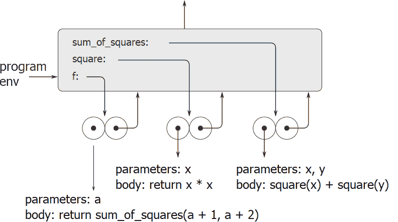
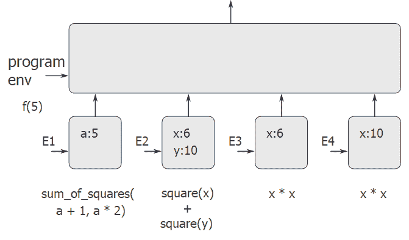

# 3.2.2应用简单功能

> 译者： [https://sicp.comp.nus.edu.sg/chapters/54](https://sicp.comp.nus.edu.sg/chapters/54)

当我们在 [1.1.5](7) 部分中介绍替换模型时，我们给出了给定以下功能定义的组合`f(5)`如何计算为136：

```js
function square(x) {
    return x * x;
}

function sum_of_squares(x, y) {
    return square(x) + square(y);
}

function f(a) {
    return sum_of_squares(a + 1, a * 2);
}
```

我们可以使用环境模型来分析同一示例。 图 [3.4](54#fig_3.4) 显示了通过在程序环境中评估`f`，`square`和`sum_of_squares`的定义而创建的三个功能对象。 每个函数对象都包含一些代码以及指向程序环境的指针。

<figure>**[图3.4](54#fig_3.4)** 程序框架中的功能对象。</figure>

在图 [3.5](54#fig_3.5) 中，我们看到了通过评估表达式`f(5)`创建的环境结构。 对`f`的调用创建了一个新的环境E1，该框架以其中`f`的形式参数`a`绑定到参数5的帧开始。在E1中，我们评估`f`的主体：

```js
return sum_of_squares(a + 1, a * 2);
```

 <split><figure>**[Figure 3.5](54#fig_3.5)** Environments created by evaluating `f(5)` using the functions in Figure <ref name="fig:sum-squares">[3.4](54#fig_3.4)</ref>.</figure></split> 

要评估此组合，我们首先评估子表达式。 第一个子表达式`sum_of_squares`具有作为函数对象的值。 （注意如何找到该值：我们首先查看E1的第一帧，其中不包含对`sum_of_squares`的绑定。然后进入封闭环境，即程序环境，并找到如图所示的绑定 [3.4](54#fig_3.4) 。）通过应用原始运算`+`和`*`评估两个组合`a + 1`和`a * 2`分别获得6和10，可以评估其他两个子表达式。

现在我们将函数对象`sum_of_squares`应用于参数6和10。这将导致一个新环境E2，其中形式参数`x`和`y`绑定到了参数。 在E2中，我们评估组合`square(x) + square(y)`。 这导致我们评估`square(x)`，其中在程序框架中找到`square`，`x`为6。再次，我们设置了一个新环境E3，其中`x`绑定到6，并且在 我们将评估`square`的主体，即`x * x`。 同样在应用`sum_of_squares`的过程中，我们必须评估子表达式`square(y)`，其中`y`为10。第二次调用`square`会创建另一个环境E4，其中`x`是[HTG15的形式参数] ]绑定到10。在E4中，我们必须评估`x * x`。

要注意的重要一点是，每次对`square`的调用都会创建一个包含`x`绑定的新环境。 我们可以在这里看到不同的框架如何将不同的局部变量（HTG2）分开。 注意，`square`创建的每个帧都指向程序环境，因为这是`square`功能对象指示的环境。

评估子表达式后，将返回结果。 `sum_of_squares`将两次调用`square`所生成的值相加，然后`f`返回此结果。 由于我们的重点是环境结构，因此我们将不讨论如何在调用之间传递这些返回值。 但是，这也是评估过程的重要方面，我们将在第5章中详细介绍。

<exercise>In section <ref name="sec:recursion-and-iteration">[1.2.1](12)</ref> we used the substitution model to analyze two functions for computing factorials, a recursive version

```js
function factorial(n) {
    return n === 1
           ? 1
           : n * factorial(n - 1);
}
```

and an iterative version

```js
function factorial(n) {
    return fact_iter(1, 1, n);
}
function fact_iter(product, counter, max_count) {
    return counter > max_count
           ? product
           : fact_iter(counter * product, 
                       counter + 1, 
                       max_count);
}
```

Show the environment structures created by evaluating `factorial(6)` using each version of the `factorial` function. [[1]](54#footnote-1)<button class="btn btn-secondary solution_btn" data-toggle="collapse" href="#no_solution_54_1_div">Add solution</button>There is currently no solution available for this exercise. This textbook adaptation is a community effort. Do consider contributing by providing a solution for this exercise, using a Pull Request in [Github](https://github.com/source-academy/sicp).</exercise>

* * *

[[1]](54#footnote-link-1)