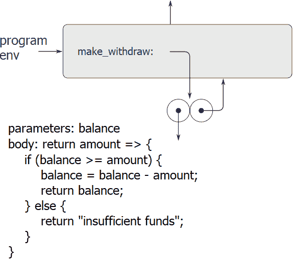
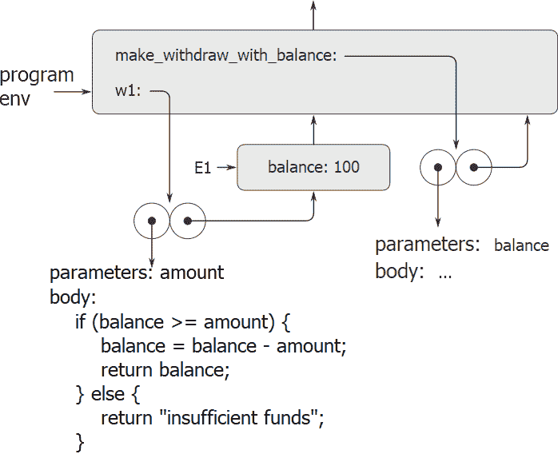
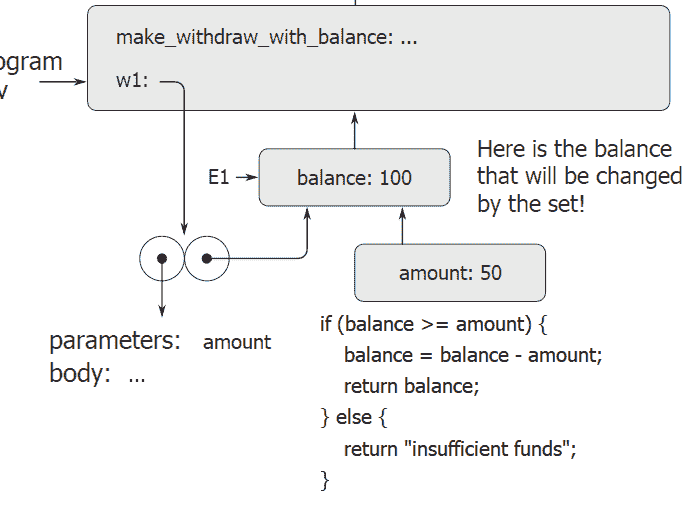
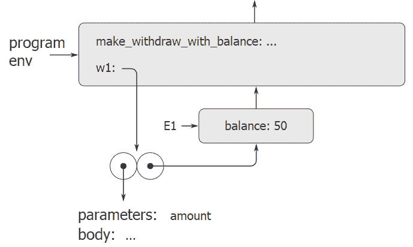
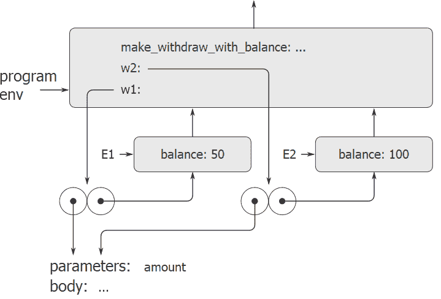

# 3.2.3框架作为本地状态的存储库

> 译者： [https://sicp.comp.nus.edu.sg/chapters/55](https://sicp.comp.nus.edu.sg/chapters/55)

我们可以转向环境模型，以了解如何使用函数和赋值来表示具有局部状态的对象。 例如，考虑通过调用函数创建的 [3.1.1](49)提取处理器&lt;/quote&gt;

```js
function make_withdraw_with_balance(balance) {
    return amount => {
        if (balance >= amount) {
            balance = balance - amount;
            return balance;
        } else {
            return "insufficient funds";
        }
    };
}
```

让我们描述一下对

```js
const w1 = make_withdraw_with_balance(100);
```

followed by

```js
w1(50);
```

图 [3.6](55#fig_3.6) 显示了在程序环境中声明`make_withdraw_with_balance`功能的结果。 这将产生一个函数对象，其中包含指向程序环境的指针。 到目前为止，这与我们已经看到的示例没有什么不同，除了函数的主体本身是一个函数定义表达式。

<figure>**[图3.6](55#fig_3.6)** 在程序环境中定义`make_withdraw_with_balance`的结果。</figure>

当我们应用函数时，计算的有趣部分发生了

```js
make_withdraw_with_balance
```

to an argument:

```js
const w1 = make_withdraw_with_balance(100);
```

与往常一样，我们首先建立一个环境E1，其中形式参数`balance`绑定到参数100。在此环境中，我们评估`make_withdraw_with_balance`的主体，即函数定义表达式。 这将构造一个新的函数对象，其代码由函数定义指定，其环境为E1，在该环境中评估了函数定义以生成函数。 结果函数对象是`make_withdraw_with_balance`调用返回的值。 在程序环境中，这与`w1`绑定在一起，因为常量声明本身正在程序环境中进行评估。 图 [3.7](55#fig_3.7) 显示了生成的环境结构。

<figure>**[图3.7](55#fig_3.7)** `const w1 = make_withdraw_with_balance(100);`的评估结果。</figure>

现在我们可以分析将`w1`应用于参数时会发生什么：

```js
w1(50);
```

我们首先构建一个框架，其中`w1`的形式参数`amount`绑定到参数50。要观察的关键点是，该框架的封闭环境不是程序环境，而是环境 E1，因为这是`w1`功能对象指定的环境。 在这个新环境中，我们评估函数的主体：

```js
if (balance >= amount) {
    balance = balance - amount;
    return balance;
} else {
    return "insufficient funds";
}
```

生成的环境结构如图 [3.8](55#fig_3.8) 所示。 被评估的表达式同时引用`amount`和`balance`。 变量`amount`将在环境的第一帧中找到，而`balance`将通过跟随E1的封闭环境指针找到。

<figure>**[图3.8](55#fig_3.8)** 通过应用功能对象`w1`创建的环境。</figure>

执行分配后，将更改E1中`balance`的绑定。 在对`w1`的调用完成时，`balance`为50，并且包含`balance`的帧仍由功能对象`w1`指向。 绑定`amount`的框架（我们在其中执行了更改过的代码`balance`）不再相关，因为构造它的函数调用已终止，并且环境的其他部分也没有指向该框架的指针。 下次调用`w1`时，这将建立一个绑定`amount`的新框架，其包围环境为E1。 我们看到E1充当&lt;quote&gt;位置&lt;/quote&gt;，它保存了功能对象`w1`的局部状态变量。 图 [3.9](55#fig_3.9) 显示了调用`W1`之后的情况。

<figure>**[图3.9](55#fig_3.9)** 调用`w1`之后的环境。</figure>

观察通过再次调用`make_withdraw`创建第二个&lt;quote&gt;撤消&lt;/quote&gt;对象时发生的情况：

```js
const w2 = make_withdraw(100);
```

这将产生图 [3.10](55#fig_3.10) 的环境结构，该图显示`w2`是一个功能对象，即一对带有某些代码和环境的对象。 通过调用`make_withdraw`创建了`w2`的环境E2。 它包含一个框架，该框架具有自己的`balance`本地绑定。 另一方面，`w1`和`w2`具有相同的代码：由`make_withdraw`主体中的函数定义表达式指定的代码。 [[1]](55#footnote-1) 我们在这里看到为什么`w1`和`w2`表现为独立的对象。 调用`w1`引用存储在E1中的状态变量`balance`，而调用`w2`引用引用存储在E2中的`balance`。 因此，对一个对象的局部状态的更改不会影响另一对象。

<figure>**[图3.10](55#fig_3.10)** 使用`const w2 = make_withdraw_with_balance(100)`创建第二个对象。</figure>

<exercise>In the `make_withdraw` function, the local variable `balance` is created as a parameter of `make_withdraw`. We could also create the local state variable explicitly, using `let`, as follows:

```js
function make_withdraw(initial_amount) {
    let balance = initial_amount;
    function withdraw(amount) {
        if (balance >= amount) {
            balance = balance - amount;
            return balance;
        } else {
            return "insufficient funds";
        }
    }
    return withdraw;
}
```

Use the environment model to analyze this alternate version of `make_withdraw`, drawing figures like the ones above to illustrate the interactions

```js
const w1 = make_withdraw(100);
w1(50);
const w2 = make_withdraw(100);
```

Show that the two versions of `make_withdraw` create objects with the same behavior. How do the environment structures differ for the two versions?<button class="btn btn-secondary solution_btn" data-toggle="collapse" href="#no_solution_55_1_div">Add solution</button>There is currently no solution available for this exercise. This textbook adaptation is a community effort. Do consider contributing by providing a solution for this exercise, using a Pull Request in [Github](https://github.com/source-academy/sicp).</exercise>

* * *

[[1]](55#footnote-link-1) Whether `w1` and `w2` share the same physical code stored in the computer, or whether they each keep a copy of the code, is a detail of the implementation. For the interpreter we implement in chapter 4, the code is in fact shared.

