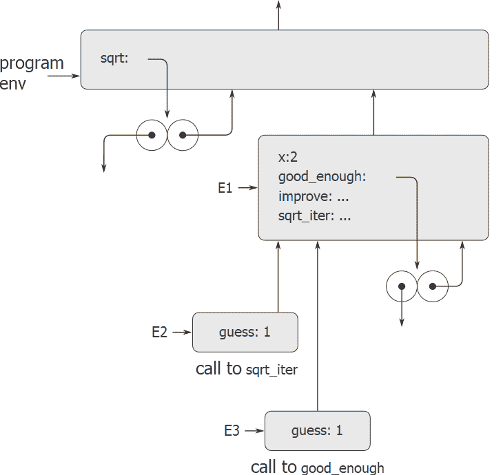

# 3.2.4内部定义

> 译者： [https://sicp.comp.nus.edu.sg/chapters/56](https://sicp.comp.nus.edu.sg/chapters/56)

[1.1.8](10) 节介绍了函数可以具有内部定义的想法，因此导致了如下结构的块结构，用于计算平方根：

```js
function sqrt(x) {
    function good_enough(guess) {
        return abs(square(guess) - x) < 0.001;
    }
    function improve(guess) {
        return average(guess,x/guess);
    }
    function sqrt_iter(guess){
        return good_enough(guess)
            ? guess
            : sqrt_iter(improve(guess));
    }
    return sqrt_iter(1.0);
}
```

现在，我们可以使用环境模型查看为什么这些内部定义的行为符合预期。 图 [3.11](56#fig_3.11) 显示了对`sqrt(2)`表达式求值的点，其中首次调用了内部函数`good_enough`，其中`guess`等于1。

<figure>**[图3.11](56#fig_3.11)** `sqrt`函数具有内部定义。</figure>

观察环境的结构。 `sqrt`是程序环境中的一个符号，该符号绑定到一个功能对象，该功能对象的关联环境是程序环境。 调用`sqrt`时，将形成一个隶属于程序环境的新环境E1，在该环境中参数`x`绑定到2。然后在E1中评估`sqrt`的主体。 由于`sqrt`主体中的第一个表达式是

```js
function good_enough(guess) {
    return abs(square(guess) - x) < 0.001;
}
```

evaluating this expression defined the function `good_enough` in the environment E1\. To be more precise, the symbol `good_enough` was added to the first frame of E1, bound to a function object whose associated environment is E1\. Similarly, `improve` and `sqrt_iter` were defined as functions in E1\. For conciseness, Figure <ref name="fig:sqrt-internal">[3.11](56#fig_3.11)</ref> shows only the function object for `good_enough`.

定义局部函数后，仍在环境E1中评估表达式`sqrt_iter(1.0)`。 因此，以1作为参数调用了绑定到E1中的`sqrt_iter`的函数对象。 这样就创建了一个环境E2，其中`sqrt_iter`的参数`guess`绑定到1。函数`sqrt_iter`依次将`guess`的值（来自E2）称为`good_enough`，作为[[ `good_enough`。 这将建立另一个环境E3，其中`guess`（`good_enough`的参数）绑定到1。尽管`sqrt_iter`和`good_enough`都有一个名为`guess`的参数，但这是位于两个不同的局部变量 在不同的框架中。 同样，E2和E3都以E1作为其封闭环境，因为`sqrt_iter`和`good_enough`功能都以E1作为其环境部分。 其结果之一是，出现在`good_enough`正文中的符号`x`将引用出现在E1中的`x`的绑定，即原始`sqrt`功能被调用的`x`的值 。

因此，环境模型解释了使局部函数定义成为模块化程序的一种有用技术的两个关键属性：

*   局部函数的名称不会干扰封装函数外部的名称，因为局部函数的名称将绑定在函数运行时创建的框架中，而不是绑定在程序环境中。
*   本地函数可以简单地通过使用参数名称作为自由变量来访问封闭函数的参数。 这是因为局部功能的主体是在从属于封闭功能的评估环境的环境中评估的。

<exercise>In section <ref name="sec:env-local-state">[3.2.3](55)</ref> we saw how the environment model described the behavior of functions with local state. Now we have seen how internal definitions work. A typical message-passing function contains both of these aspects. Consider the bank account function of section <ref name="sec:local-state-variables">[3.1.1](49)</ref>:

```js
function make_account(balance) {
    function withdraw(amount) {
        if (balance >= amount) {
            balance = balance - amount;
            return balance;
        } else {
            return "Insufficient funds";
        }
    }
    function deposit(amount) {
        balance = balance + amount;
    }
    function dispatch(m) {
        return m === "withdraw"
               ? withdraw
               : m === "deposit"
                 ? deposit
                 : "Unknown request: make_account";
    }
    return dispatch;
}
```

Show the environment structure generated by the sequence of interactions

```js
const acc = make_account(50);
(acc("deposit"))(40);
(acc("withdraw"))(60);
```

Where is the local state for `acc` kept? Suppose we define another account

```js
const acc2 = make_account(100);
```

How are the local states for the two accounts kept distinct? Which parts of the environment structure are shared between `acc` and `acc2`?<button class="btn btn-secondary solution_btn" data-toggle="collapse" href="#no_solution_56_1_div">Add solution</button>There is currently no solution available for this exercise. This textbook adaptation is a community effort. Do consider contributing by providing a solution for this exercise, using a Pull Request in [Github](https://github.com/source-academy/sicp).</exercise>