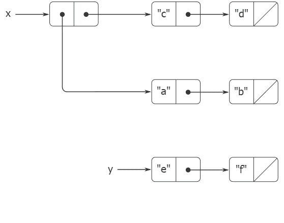
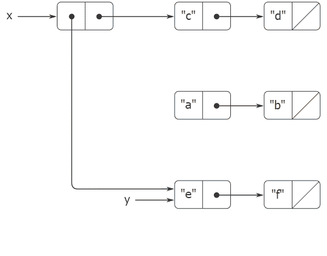
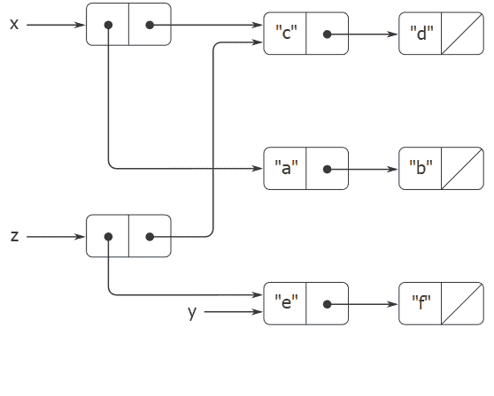
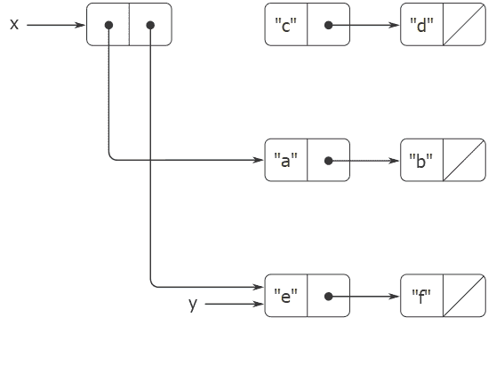

# 3.3.1可变列表结构

> 译者： [https://sicp.comp.nus.edu.sg/chapters/58](https://sicp.comp.nus.edu.sg/chapters/58)

对`pair`，`head`和`tail`的基本操作可用于构造列表结构并从列表结构中选择部分，但是它们不能修改列表结构。 到目前为止，我们可以使用`append`和`list`等列表操作，因为它们可以根据`pair`，`head`和`tail`进行定义。 要修改列表结构，我们需要新的操作。

<figure>**[图3.12](58#fig_3.12)** 列出`list(list("a", "b"), "c", "d")`和`y`：`list("e", "f")`。</figure>

 <split><figure>**[图3.13](58#fig_3.13)** `set_head(x, y)`对图中 <ref name="fig:two-lists">[的影响 ] 3.12](58#fig_3.12)</ref> 。</figure></split>  <split><figure>**[图3.14](58#fig_3.14)** `const z = pair(y, tail(x));`对图中 <ref name="fig:two-lists">[的影响 ] 3.12](58#fig_3.12)</ref> 。</figure></split>  <split><figure>**[图3.15](58#fig_3.15)** `set_tail(x, y)`对图中 <ref name="fig:two-lists">[的影响 ] 3.12](58#fig_3.12)</ref> 。</figure></split> 

对的原始变量为`set_head`和`set_tail`。 函数`set_head`具有两个参数，其中第一个必须是一对。 它修改了这一对，将`head`指针替换为指向`set_head`的第二个参数的指针。 [[1]](58#footnote-1)

例如，假设`x`绑定到列表`list(list("a", "b"), "c")`，`y`绑定到列表`list("e", "f")`，如图 [3.12](58#fig_3.12)[3.13](58#fig_3.13) 所示。 结构`x`已被修改，现在将被打印为`list(list("e", "f"), "c", "d")`。 现在，由替换的指针标识的代表列表`list("a", "b")`的对与原始结构分离。 [[2]](58#footnote-2)

将图 [3.13](58#fig_3.13)[3.14](58#fig_3.14) 进行比较，该图说明了执行结果

```js
const z = pair(y, tail(x));
```

with `x` and `y` bound to the original lists of figure <ref name="fig:two-lists">[3.12](58#fig_3.12)</ref>. The variable `z` is now bound to a new pair created by the `pair` operation; the list to which `x` is bound is unchanged.

`set_tail`操作类似于`set_head`。 唯一的区别是，替换了该对中的`tail`指针，而不是`head`指针。 图 [3.15](58#fig_3.15)[3.12](58#fig_3.12) 列表上执行`set_tail(x, y)`的效果。 此处，`x`的`tail`指针已由指向`list("e", "f")`的指针替换。 此外，列表`list("c", "d")`（以前是`x`的`tail`）现在已从结构中分离出来。

函数`pair`通过创建新的对来构建新的列表结构，而`set_head`和`set_tail`修改现有对。 确实，我们可以使用两个变体来实现`pair`以及函数`get_new_pair`，该函数返回不属于任何现有列表结构的新对。 我们获得新的配对，将其`head`和`tail`指针设置为指定的对象，并返回新的配对作为`pair`的结果。 [[3]](58#footnote-3)

```js
function pair(x, y) {
    const fresh = get_new_pair();
    set_head(fresh, x);
    set_tail(fresh, y);
    return fresh;
}
```

<exercise>The following function for appending lists was introduced in section <ref name="sec:sequences">[2.2.1](30)</ref>:

```js
function append(x, y) {
    return is_null(x)
           ? y
           : pair(head(x), append(tail(x), y));
}
```

The function `append` forms a new list by successively `pair`ing the elements of `x` onto `y`. The function `append_mutator` is similar to `append`, but it is a mutator rather than a constructor. It appends the lists by splicing them together, modifying the final pair of `x` so that its `tail` is now `y`. (It is an error to call `append_mutator` with an empty `x`.)

```js
function append_mutator(x, y) {
    set_tail(last_pair(x), y);
}
```

Here `last_pair` is a function that returns the last pair in its argument:

```js
function last_pair(x) {
    return is_null(tail(x)))
           ? x
           : last_pair(tail(x));
}
```

Consider the program

```js
const x = list("a", "b");
const y = list("c", "d");
const z = append(x, y);
display(z);       // ["a", ["b", ["c", ["d", null]]]]
display(tail(x)); // ???
const w = append_mutator(x, y);
display(w);       // ["a", ["b", ["c", ["d", null]]]]
display(tail(x)); // ???
```

What are the missing responses? Draw box-and-pointer diagrams to explain your answer.<button class="btn btn-secondary solution_btn" data-toggle="collapse" href="#no_solution_58_1_div">Add solution</button>There is currently no solution available for this exercise. This textbook adaptation is a community effort. Do consider contributing by providing a solution for this exercise, using a Pull Request in [Github](https://github.com/source-academy/sicp).</exercise><exercise>Consider the following `make_cycle` function, which uses the `last_pair` function defined in exercise <ref name="ex:append">[3.12](58#ex_3.12)</ref>:

```js
function make_cycle(x) {
    set_tail(last_pair(x), x);
    return x;
}
```

Draw a box-and-pointer diagram that shows the structure `z` created by

```js
const z = make_cycle(list("a", "b", "c"));
```

What happens if we try to compute `last_pair(z)`?<button class="btn btn-secondary solution_btn" data-toggle="collapse" href="#no_solution_58_1_div">Add solution</button>There is currently no solution available for this exercise. This textbook adaptation is a community effort. Do consider contributing by providing a solution for this exercise, using a Pull Request in [Github](https://github.com/source-academy/sicp).</exercise><exercise>The following function is quite useful, although obscure:

```js
function mystery(x) {
    function loop(x, y) {
        if (is_null(x)) {
            return y;
        } else {
            let temp = tail(x);
            set_tail(x, y);
            return loop(temp, x);
        }
    }
    return loop(x, null);
}
```

The function `loop` uses the <quote>temporary</quote> variable `temp` to hold the old value of the `tail` of `x`, since the `set_tail` on the next line destroys the `tail`. Explain what `mystery` does in general. Suppose `v` is defined by

```js
const v = list("a", "b", "c");
```

Draw the box-and-pointer diagram that represents the list to which `v` is bound. Suppose that we now evaluate

```js
const w = mystery(v);
```

Draw box-and-pointer diagrams that show the structures `v` and `w` after evaluating this program. What would be printed as the values of `v` and `w`?<button class="btn btn-secondary solution_btn" data-toggle="collapse" href="#no_solution_58_1_div">Add solution</button>There is currently no solution available for this exercise. This textbook adaptation is a community effort. Do consider contributing by providing a solution for this exercise, using a Pull Request in [Github](https://github.com/source-academy/sicp).</exercise>

## 分享和身份

我们在 [3.1.3](51)相同性&lt;/quote&gt;和&lt;quote&gt;更改&lt;/quote&gt;的理论问题。 这些问题实际上是在不同数据对象之间共享_对_的时候出现的。 例如，考虑由__

```js
const x = list("a", "b");
const z1 = pair(x, x);
```

如图 [3.16](58#fig_3.16) 所示，`z1`是一对，其`head`和`tail`都指向同一对`x`。 `z1`的`head`和`tail`对`x`的共享是实现`pair`的简单方法的结果。 通常，使用`pair`构造列表将导致成对的互连结构，其中许多不同的结构共享许多对。

<figure>**[图3.16](58#fig_3.16)** 由`pair(x, x)`形成的列表`z1`。 图3.17由`pair(list("a", "b"), list("a", "b"))`形成的列表`z2`。</figure>

与图 [3.16](58#fig_3.16)[3.17](58#fig_3.17) 显示了由

```js
const z2 = pair(list("a", "b"), list("a", "b"));
```

在此结构中，两个`list("a", "b")`列表中的对是不同的，尽管它们包含相同的字符串。 [[4]](58#footnote-4)

当视为列表时，`z1`和`z2`都代表&lt;quote&gt;相同的&lt;/quote&gt;列表：

```js
list(list("a", "b"), "a", "b")
```

In general, sharing is completely undetectable if we operate on lists using only `pair`, `head`, and `tail`. However, if we allow mutators on list structure, sharing becomes significant. As an example of the difference that sharing can make, consider the following function, which modifies the `head` of the structure to which it is applied:

```js
function set_to_wow(x) {
    set_head(head(x), "wow");
    return x;
}
```

即使`z1`和`z2`具有相同的结构，但将`set_to_wow`应用于它们也会产生不同的结果。 使用`z1`时，更改`head`也会更改`tail`，因为在`z1`中`head`和`tail`是同一对。 使用`z2`时，`head`和`tail`是不同的，因此`set-to-wow!`仅修改`head`：

```js
z1; 
// displays: [["a", ["b", null], ["a", ["b", null]]
```

```js
set_to_wow(z1); 
// displays: [["wow", ["b", null], ["wow", ["b", null]]
```

```js
z2; 
// displays: [["a", ["b", null], ["a", ["b", null]]
```

```js
set_to_wow(z2); 
// displays: [["wow", ["b", null], ["a", ["b", null]]
```

检测列表结构中共享的一种方法是使用谓词运算符===，我们在 [2.3.1](35)[3.16](58#fig_3.16)[3.17](58#fig_3.17) ，`head(z1) === tail(z1)`为真，`head(z2) === tail(z2)`是错误的。

如以下各节所示，我们可以利用共享来极大地扩展可以用成对表示的数据结构的全部范围。 另一方面，共享也可能很危险，因为对结构进行的修改也会影响碰巧共享修改后部分的其他结构。 应当谨慎使用突变操作`set_head`和`set_tail`； 除非我们对如何共享数据对象有一个很好的了解，否则突变可能会带来意想不到的结果。 [[5]](58#footnote-5)

<exercise>Draw box-and-pointer diagrams to explain the effect of `set_to_wow` on the structures `z1` and `z2` above.<button class="btn btn-secondary solution_btn" data-toggle="collapse" href="#no_solution_58_1_div">Add solution</button>There is currently no solution available for this exercise. This textbook adaptation is a community effort. Do consider contributing by providing a solution for this exercise, using a Pull Request in [Github](https://github.com/source-academy/sicp).</exercise><exercise>Ben Bitdiddle decides to write a function to count the number of pairs in any list structure. <quote>It's easy,</quote> he reasons. <quote>The number of pairs in any structure is the number in the `head` plus the number in the `tail` plus one more to count the current pair.</quote> So Ben writes the following function:

```js
function count_pairs(x) {
    return !is_pair(x)
           ? 0
           : count_pairs(head(x)) + 
             count_pairs(tail(x)) + 1;
}
```

Show that this function is not correct. In particular, draw box-and-pointer diagrams representing list structures made up of exactly three pairs for which Ben's function would return 3; return 4; return 7; never return at all.<button class="btn btn-secondary solution_btn" data-toggle="collapse" href="#no_solution_58_1_div">Add solution</button>There is currently no solution available for this exercise. This textbook adaptation is a community effort. Do consider contributing by providing a solution for this exercise, using a Pull Request in [Github](https://github.com/source-academy/sicp).</exercise><exercise>Devise a correct version of the `count_pairs` function of exercise <ref name="ex:count-pairs">[3.16](58#ex_3.16)</ref> that returns the number of distinct pairs in any structure. (Hint: Traverse the structure, maintaining an auxiliary data structure that is used to keep track of which pairs have already been counted.)<button class="btn btn-secondary solution_btn" data-toggle="collapse" href="#no_solution_58_1_div">Add solution</button>There is currently no solution available for this exercise. This textbook adaptation is a community effort. Do consider contributing by providing a solution for this exercise, using a Pull Request in [Github](https://github.com/source-academy/sicp).</exercise><exercise>Write a function that examines a list and determines whether it contains a cycle, that is, whether a program that tried to find the end of the list by taking successive `tail`s would go into an infinite loop. Exercise <ref name="ex:make-cycle">[3.13](58#ex_3.13)</ref> constructed such lists.<button class="btn btn-secondary solution_btn" data-toggle="collapse" href="#no_solution_58_1_div">Add solution</button>There is currently no solution available for this exercise. This textbook adaptation is a community effort. Do consider contributing by providing a solution for this exercise, using a Pull Request in [Github](https://github.com/source-academy/sicp).</exercise><exercise>Redo exercise <ref name="ex:find-cycle">[3.18](58#ex_3.18)</ref> using an algorithm that takes only a constant amount of space. (This requires a very clever idea.)<button class="btn btn-secondary solution_btn" data-toggle="collapse" href="#no_solution_58_1_div">Add solution</button>There is currently no solution available for this exercise. This textbook adaptation is a community effort. Do consider contributing by providing a solution for this exercise, using a Pull Request in [Github](https://github.com/source-academy/sicp).</exercise>

## 变异只是任务

当我们引入复合数据时，我们在 [2.1.3](27) 部分中观察到，对可以完全用功能表示：

```js
function pair(x, y) {
    function dispatch(m) {
        if (m === "head") {
            return x;
        } else if (m === "tail") {
            return y;
        } else {
            return "undefined operation -- pair";
        }
    }
    return dispatch;	
}
```

对于可变数据也是如此。 我们可以使用赋值和局部状态将可变数据对象实现为函数。 例如，我们可以将上述对实现扩展为处理`set_head`和`set_tail`，其方式类似于在 [3.1.1](49) 部分中使用`make-account`实现银行帐户的方式 ]：

```js
function pair(x, y) {
    function set_x(v) {
        x = v;
    }
    function set_y(v) {
        y = v;
    }
    return function dispatch(m) {
               if (m === "head") {
                   return x;
               } else if (m === "tail") {
                   return y;
               } else if (m === "set_head") {
                   return set_x;
               } else if (m === "set_tail") {
                   return set_y;
               } else {
                   return "undefined operation - - pair";
               }
           };
}

function head(z) {
    return z("head");
}

function tail(z) {
    return z("tail");
}

function set_head(z, new_value) {
    (z("set_head"))(new_value);
    return z;
}

function set_tail(z, new_value) {
    (z("set_tail"))(new_value);
    return z;
}
```

从理论上讲，分配是解决可变数据行为所需要的全部。 一旦我们承认对语言的赋值，我们就会提出所有问题，不仅是赋值问题，而且是可变数据。 [[6]](58#footnote-6)

<exercise>Draw environment diagrams to illustrate the evaluation of the sequence of expressions

```js
const x = pair(1, 2);
const z = pair(x, x);
set_head(tail(z), 17);
head(x);
```

using the functional implementation of pairs given above. (Compare exercise <ref name="ex:two-accounts">[3.11](56#ex_3.11)</ref>.)<button class="btn btn-secondary solution_btn" data-toggle="collapse" href="#no_solution_58_1_div">Add solution</button>There is currently no solution available for this exercise. This textbook adaptation is a community effort. Do consider contributing by providing a solution for this exercise, using a Pull Request in [Github](https://github.com/source-academy/sicp).</exercise>

* * *

[[1]](58#footnote-link-1) The functions `set_head` and `set_tail` return the value `undefined`. Like assignment, they should be used only for their effect.

[[2]](58#footnote-link-2) We see from this that mutation operations on lists can create <quote>garbage</quote> that is not part of any accessible structure.

[[3]](58#footnote-link-3) The function `get_new_pair` is one of the operations that must be implemented as part of the memory management required by a JavaScript implementation.

[[4]](58#footnote-link-4) The two pairs are distinct because each call to `pair` returns a new pair. The strings are <quote>the same</quote> in the sense that they are primitive data (just like numbers) that are composed of the same characters in the same order. Since JavaScript provides no way to mutate a string, any sharing that the designers of a JavaScript interpreter might decide to implement for strings is undetectable. We consider primitive data such as numbers, booleans and strings as _identical_, if and only if they are _indistinguishable_.

[[5]](58#footnote-link-5) The subtleties of dealing with sharing of mutable data objects reflect the underlying issues of <quote>sameness</quote> and <quote>change</quote> that were raised in section <ref name="sec:costs-of-assignment">[3.1.3](51)</ref>. We mentioned there that admitting change to our language requires that a compound object must have an <quote>identity</quote> that is something different from the pieces from which it is composed. In JavaScript, we consider this <quote>identity</quote> to be the quality that is tested by `===`, i.e., by equality of pointers. Since in most JavaScript implementations a pointer is essentially a memory address, we are <quote>solving the problem</quote> of defining the identity of objects by stipulating that a data object <quote>itself</quote> is the information stored in some particular set of memory locations in the computer. This suffices for simple JavaScript programs, but is hardly a general way to resolve the issue of <quote>sameness</quote> in computational models.

[[6]](58#footnote-link-6) On the other hand, from the viewpoint of implementation, assignment requires us to modify the environment, which is itself a mutable data structure. Thus, assignment and mutation are equipotent: Each can be implemented in terms of the other.

