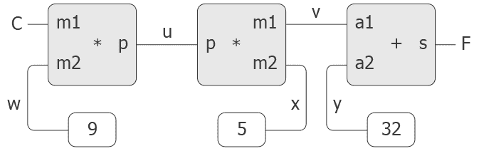

# 3.3.5约束的传播

> 译者： [https://sicp.comp.nus.edu.sg/chapters/62](https://sicp.comp.nus.edu.sg/chapters/62)

传统上，计算机程序是以单向计算的形式组织的，它们对预先指定的参数执行运算以产生所需的输出。 另一方面，我们经常根据数量之间的关系对系统进行建模。 例如，机械结构的数学模型可能包含以下信息：金属杆的挠度与杆上的力，杆的长度，横截面积有关 以及通过方程式的弹性模量这种方程式不是单向的。 给定任意四个数量，我们就可以用它来计算第五个数量。 然而，将方程式转换成传统的计算机语言将迫使我们选择要计算的其他四个量之一。 因此，即使和的计算来自同一方程式，用于计算面积的函数也不能用于计算挠度。 [ [1]](62#footnote-1)

在本节中，我们将概述一种语言的设计，该语言使我们能够根据关系本身进行工作。 语言的原始元素是_原始约束_，它们指出数量之间存在某些关系。 例如，`adder(a, b, c)`指定数量，和必须由公式关联，`multiplier(x, y, z)`表示约束，`constant(3.14, x)`表示值 的值必须为3.14。

我们的语言提供了一种组合原始约束以表达更复杂关系的方法。 我们通过构建_约束网络_来组合约束，其中约束由_连接器_连接。 连接器是&lt;quote&gt;持有&lt;/quote&gt;一个可能参与一个或多个约束的值的对象。 例如，我们知道华氏温度与摄氏温度之间的关系是

这样的约束可以认为是由原始加法器，乘法器和常量约束组成的网络（图 [3.28](62#fig_3.28) ）。 在图中，我们在左侧看到一个带三个端子的乘法器盒，分别标记为，和。 它们将乘法器按如下方式连接到网络的其余部分：端子链接到连接器，该连接器将保持摄氏温度。 端子链接到连接器，该连接器也链接到容纳9的恒定盒。端子，乘法器盒将其限制为和的乘积， “”链接到另一个乘法器盒的端子，该乘法器盒的连接到常数5，并且连接到总和中的一个项。

<figure>**[图3.28](62#fig_3.28)** 关系表示为约束网络。</figure>

通过这样的网络进行的计算如下：当给连接器一个值（由用户或链接到它的约束框）时，它将唤醒所有与其相关的约束（除了刚刚唤醒的约束之外）。 告诉他们它有价值。 然后，每个唤醒的约束框都会轮询其连接器，以查看是否有足够的信息来确定连接器的值。 如果是这样，则该框将设置该连接器，然后唤醒所有与其关联的约束，依此类推。 例如，在摄氏和华氏温度之间进行转换时，，和立即由常数框设置为9、5和32。 连接器唤醒乘法器和加法器，这确定没有足够的信息继续进行。 如果用户（或网络的其他部分）将设置为一个值（例如25），则会唤醒最左边的乘法器，并将设置为。 然后唤醒第二个乘法器，将设置为45，唤醒加法器，将设置为77。

## 使用约束系统

要使用约束系统进行上述温度计算，我们首先通过调用构造函数`make_connector`并在适当的网络中链接`C`和`F`来创建两个连接器`C`和`F`：

```js
const C = make_connector();
const F = make_connector();
celsius_fahrenheit_converter(C, F);
```

创建网络的功能定义如下：

```js
function celsius_fahrenheit_converter(c, f) {
    const u = make_connector();
    const v = make_connector();
    const w = make_connector();
    const x = make_connector();
    const y = make_connector();
    multiplier(c, w, u);
    multiplier(v, x, u);
    adder(v, y, f);
    constant(9, w);
    constant(5, x);
    constant(32, y);
    return "ok";
}
```

此函数创建内部连接器`u`，`v`，`w`，`x`和`y`，并使用图元将它们连接起来，如图 [3.28](62#fig_3.28)[3.3.4](61) 部分的数字电路仿真器一样，用功能表达原始元素的这些组合会自动为我们的语言提供一种复合对象的抽象方法。

为了观察网络的运行情况，我们可以使用`probe`功能将探针放在`C`和`F`连接器上，该功能类似于在 [3.3.4节中用于监视电线的功能。 ]](61) 。 只要给连接器指定一个值，就将探针放在连接器上将导致打印一条消息：

```js
probe("Celsius Temp", C);
probe("Fahrenheit Temp", F);
```

接下来，我们将`C`的值设置为25。（`set_value`的第三个参数告诉`C`该指令来自`user`。）

```js
set_value(C, 25, "user");
// Probe: Celsius Temp = 25
// Probe: Fahrenheit Temp = 77
```

`C`上的探测将唤醒并报告该值。 `C`也如上所述通过网络传播其值。 这将`F`设置为77，由`F`上的探针报告。

现在我们可以尝试将`F`设置为新值，例如212：

```js
set_value(F, 212, "user");
// Error! Contradiction (77 212)
```

连接器抱怨它感觉到一个矛盾：它的值是77，有人试图将其设置为212。如果我们真的想用新值重用网络，我们可以告诉`C`忘记它的旧值：

```js
forget_value(C, "user");
// Probe: Celsius Temp = ?
// Probe: Fahrenheit Temp = ?
```

`C`发现最初设置其值的`"user"`现在正在收回该值，因此`C`同意丢失其值（如探针所示），并将此事实通知网络的其余部分。 该信息最终传播到`F`，该`F`现在发现没有理由继续相信自己的价值为77。因此`F`也放弃了其价值，如探针所示。

现在`F`没有值，我们可以自由将其设置为212：

```js
set_value(F, 212, "user");
// Probe: Fahrenheit Temp = 212
// Probe: Celsius Temp = 100
```

该新值在通过网络传播时，会强制`C`的值为100，并由探针在`C`上进行注册。 请注意，在给定`F`的情况下使用相同的网络来计算`C`和在给定`C`的情况下用于计算`F`。 计算的这种非方向性是基于约束的系统的显着特征。

## 实施约束系统

约束系统是通过具有局部状态的过程对象来实现的，其方式与 [3.3.4](61) 的数字电路模拟器非常相似。 尽管约束系统的原始对象稍微复杂一些，但整个系统更为简单，因为不必担心议程和逻辑延迟。

连接器的基本操作如下：

*   `has_value(connector)`：告诉连接器是否有值。
*   `get_value(connector)`：返回连接器的当前值。
*   `set_value(connector, new_value, informant)`：指示通知者正在请求连接器将其值设置为新值。
*   `forget_value(connector, retractor)`：告诉连接器牵开器正在要求它忘记其值。
*   `connect(connector, new_constraint)`：告诉连接器参加新约束。

连接器通过函数`inform_about_value`和约束条件进行通信，函数`inform_about_value`告诉给定的约束条件连接器具有一个值，`forget_value`告诉约束条件连接器丢失了其值。

`Adder`在加法连接器`a1`和`a2`与`sum`连接器之间构造加法器约束。 加法器实现为具有本地状态的功能（以下功能`me`）：

```js
function adder(a1, a2, sum) {
    function process_new_value() {
        if (has_value(a1) && has_value(a2)) {
            set_value(sum, get_value(a1) + get_value(a2), me);
        } else if (has_value(a1) && has_value(sum)) {
            set_value(a2, get_value(sum) - get_value(a1), me);
        } else if (has_value(a2) && has_value(sum)) {
            set_value(a1, get_value(sum) - get_value(a2), me);
        } else {
        }
    }
    function process_forget_value() {
        forget_value(sum, me);
        forget_value(a1, me);
        forget_value(a2, me);
        process_new_value();
    }
    function me(request) {
        if (request === "I-have-a-value") {
            process_new_value();
        } else if (request === "I-lost-my-value") {
            process_forget_value();
        } else {
            Error("Unknown request in adder", request);
        }
    }
    connect(a1, me);
    connect(a2, me);
    connect(sum, me);
    return me;
}
```

`Adder`将新加法器连接到指定的连接器，并将其作为其值返回。 代表加法器的函数`me`充当局部函数的调度。 以下&lt;quote&gt;语法接口&lt;/quote&gt;（请参见脚注 **找不到脚的标签：对象语法**[3.3.4](61) 节中）与调度程序结合使用：

```js
function inform_about_value(constraint) {
    return constraint("I-have-a-value");
}

function inform_about_no_value(constraint) {
    return constraint("I-lost-my-value");
}
```

当通知加法器其连接器之一具有值时，将调用加法器的本地函数`process_new_value`。 加法器首先检查`a1`和`a2`是否都具有值。 如果是这样，它告诉`sum`将其值设置为两个加数之和。 `set_value`的`informant`参数是`me`，它是加法器对象本身。 如果`a1`和`a2`都不具有值，则加法器检查`a1`和`sum`是否具有值。 如果是这样，则将`a2`设置为这两者的差。 最后，如果`a2`和`sum`具有值，这将为加法器提供足够的信息来设置`a1`。 如果告知加法器其连接器之一丢失了值，则它要求所有连接器现在都丢失其值。 （实际上只有该加法器设置的那些值会丢失。）然后它运行`process_new_value`。 最后一步的原因是一个或多个连接器可能仍然具有一个值（即，一个连接器可能具有一个不是由加法器最初设置的值），并且这些值可能需要通过加法器传播回去。 。

乘法器与加法器非常相似。 即使两个因素中的任何一个都不为零，也会将其`product`设置为0。

```js
function multiplier(m1, m2, product) {
    function process_new_value() {
        if ((has_value(m1) && get_value(m1) === 0)
         || (has_value(m2) && get_value(m2) === 0)) {
            set_value(product, 0, me);
        } else if (has_value(m1) && has_value(m2)) {
            set_value(product, 
                      get_value(m1) * get_value(m2), 
		      me);
        } else if (has_value(product) && has_value(m1)) {
            set_value(m2, 
                      get_value(product) / get_value(m1), 
                      me);
        } else if (has_value(product) && has_value(m2)) {
            set_value(m1, 
	              get_value(product) / get_value(m2),
	              me);
        } else {
        }
    }
    function process_forget_value() {
        forget_value(product, me);
        forget_value(m1, me);
        forget_value(m2, me);
        process_new_value();
    }
    function me(request) {
        if (request === "I-have-a-value") {
            process_new_value();
        } else if (request === "I-lost-my-value") {
            process_forget_value();
        } else {
            Error("Unknown request in multiplier", request);
        }
    }
    connect(m1, me);
    connect(m2, me);
    connect(product, me);
    return me;
}
```

`constant`构造函数只需设置指定连接器的值即可。 发送到常量框的任何`"I-have-a-value"`或`"I-lost-my-value"`消息都会产生错误。

```js
function constant(value, connector) {
    function me(request) {
        Error("Unknown request in constant", request);
    }
    connect(connector, me);
    set_value(connector, value, me);
    return me;
}
```

最后，探针将打印一条有关指定连接器设置或取消设置的消息：

```js
function probe(name, connector) {
    function print_probe(value) {
        display("Probe: " + name + " = " + value);
    }
    function process_new_value() {
        print_probe(get_value(connector));
    }
    function process_forget_value() {
        print_probe("?");
    }
    function me(request) {
        return request === "I-have-a-value"
               ? process_new_value()
               : request === "I-lost-my-value"
                 ? process_forget_value()
                 : Error("Unknown request in probe", 
                         request);
    }
    connect(connector, me);
    return me;
}
```

## 表示连接器

连接器表示为具有本地状态变量`value`（连接器的当前值）的过程对象； `informant`，它是设置连接器值的对象； `constraints`是连接器参与的约束的列表。

```js
function make_connector() {
    let value = false;
    let informant = false;
    let constraints = null;
    function set_my_value(newval, setter) {
        if (!has_value(me)) {
            value = newval;
            informant = setter;
            for_each_except(setter,
                            inform_about_value,
                            constraints);
        } else if (value !== newval) {
            error("Contradiction " +
                  "(" + stringify(value) + ", " + 
                      + stringify(newval) + ")");
        } else {
            return "ignored";
        }
    }
    function forget_my_value(retractor) {
        if (retractor === informant) {
            informant = false;
            for_each_except(retractor,
                            inform_about_no_value,
                            constraints);
        } else {
            return "ignored";
        }
    }
    function connect(new_contraint) {
        if (is_null(member(new_contraint,
                                 constraints))) {
            constraints = pair(new_contraint, constraints);
        } else {
        }
        if (has_value(me)) {
            inform_about_value(new_contraint);
        } else {
        }

        return "done";
    }
    function me(request) {
        if (request === "has_value") {
            return informant !== false;
        } else if (request === "value") {
            return value;
        } else if (request === "set_value") {
            return set_my_value;
        } else if (request === "forget") {
            return forget_my_value;
        } else if (request === "connect") {
            return connect;
        } else {
            Error("Unknown operation in connector", request);
        }
    }
    return me;
}
```

当请求设置连接器值时，将调用连接器的本地功能`set_my_value`。 如果连接器当前没有值，它将设置其值，并将要求设置该值的约束记为`informant`。 [[2]](62#footnote-2) 然后，连接器将通知其所有参与约束，但要求设置该值的约束除外。 这可以使用以下迭代器完成，该迭代器将指定功能应用于列表中除给定项目之外的所有项目：

```js
function for_each_except(exception, fun, list) {
    function loop(items) {
        if (is_null(items)) {
            return "done";
        } else if (head(items) === exception) {
            return loop(tail(items));
        } else {
            fun(head(items));
            return loop(tail(items));
        }
    }
    return loop(list);
}
```

如果要求连接器忘记其值，它将运行本地函数`forget_my_value`，该函数首先检查以确保请求来自最初设置该值的同一对象。 如果是这样，则连接器将其值丢失告知其关联的约束。

如果本地函数`connect`不在列表中，则将其添加到约束列表中。 然后，如果连接器具有值，则它将这个事实通知新约束。

连接器的功能`me`用作其他内部功能的分派，并且也将连接器表示为对象。 以下函数为分派提供了语法接口：

```js
function has_value(connector) {
    return connector("has_value");
}

function get_value(connector) {
    return connector("value");
}

function set_value(connector, new_value, informant) {
    return (connector("set_value"))(new_value, informant);
}

function forget_value(connector, retractor) {
    return (connector("forget"))(retractor);
}

function connect(connector, new_constraint) {
    return (connector("connect"))(new_constraint);
}
```

<exercise>Using primitive multiplier, adder, and constant constraints, define a function `averager` that takes three connectors `a`, `b`, and `c` as inputs and establishes the constraint that the value of `c` is the average of the values of `a` and `b`.<button class="btn btn-secondary solution_btn" data-toggle="collapse" href="#no_solution_62_1_div">Add solution</button>There is currently no solution available for this exercise. This textbook adaptation is a community effort. Do consider contributing by providing a solution for this exercise, using a Pull Request in [Github](https://github.com/source-academy/sicp).</exercise><exercise>Louis Reasoner wants to build a squarer, a constraint device with two terminals such that the value of connector `b` on the second terminal will always be the square of the value `a` on the first terminal. He proposes the following simple device made from a multiplier:

```js
function squarer(a, b) {
    return multiplier(a, a, b);
}
```

There is a serious flaw in this idea. Explain.<button class="btn btn-secondary solution_btn" data-toggle="collapse" href="#no_solution_62_1_div">Add solution</button>There is currently no solution available for this exercise. This textbook adaptation is a community effort. Do consider contributing by providing a solution for this exercise, using a Pull Request in [Github](https://github.com/source-academy/sicp).</exercise><exercise>Ben Bitdiddle tells Louis that one way to avoid the trouble in exercise <ref name="ex:squarer-constraint">[3.34](62#ex_3.34)</ref> is to define a squarer as a new primitive constraint. Fill in the missing portions in Ben's outline for a function to implement such a constraint:

```js
function squarer(a, b) {
    function process_new_value() {
        if (has_value(b)) {
            if (get_value(b) < 0) {
                Error("Square less than 0 in squarer",
                      get_value(b));
            } else {
                // alternative1...
            } else {
                // alternative2...
            }
        }
    }
    function process_forget_value() {
        // body1...
    }
    function me(request) {
        // body2...
    }
    // rest of definition
    return me;
}
```

<button class="btn btn-secondary solution_btn" data-toggle="collapse" href="#no_solution_62_1_div">Add solution</button>There is currently no solution available for this exercise. This textbook adaptation is a community effort. Do consider contributing by providing a solution for this exercise, using a Pull Request in [Github](https://github.com/source-academy/sicp).</exercise><exercise>Suppose we evaluate the following sequence of expressions in the program environment:

```js
const a = make_connector();
const b = make_connector();
set_value(a, 10, "user");
```

At some time during evaluation of the `set_value`, the following expression from the connector's local function is evaluated:

```js
for_each_except(setter, inform_about_value, constraints);
```

Draw an environment diagram showing the environment in which the above expression is evaluated.<button class="btn btn-secondary solution_btn" data-toggle="collapse" href="#no_solution_62_1_div">Add solution</button>There is currently no solution available for this exercise. This textbook adaptation is a community effort. Do consider contributing by providing a solution for this exercise, using a Pull Request in [Github](https://github.com/source-academy/sicp).</exercise><exercise>The `celsius_fahrenheit_converter` function is cumbersome when compared with a more expression-oriented style of definition, such as

```js
function celsius_fahrenheit_converter(x) {
    return cplus(cmul(cdiv(cv(9), cv(5)), x), cv(32));
}
```

Here `cplus` , `cmul` , etc. are the <quote>constraint</quote> versions of the arithmetic operations. For example, `cplus` takes two connectors as arguments and returns a connector that is related to these by an adder constraint:

```js
function cplus(x, y) {
    const z = make_connector();
    adder(x, y, z);
    return z;
}
```

Define analogous functions `cminus` , `cmul` , `cdiv` , and `cv` (constant value) that enable us to define compound constraints as in the converter example above.[[3]](62#footnote-3)<button class="btn btn-secondary solution_btn" data-toggle="collapse" href="#no_solution_62_1_div">Add solution</button>There is currently no solution available for this exercise. This textbook adaptation is a community effort. Do consider contributing by providing a solution for this exercise, using a Pull Request in [Github](https://github.com/source-academy/sicp).</exercise>

* * *

[[1]](62#footnote-link-1) Constraint propagation first appeared in the incredibly forward-looking SKETCHPAD system of Ivan Sutherland (1963). A beautiful constraint-propagation system based on the Smalltalk language was developed by Alan Borning (1977) at Xerox Palo Alto Research Center. Sussman, Stallman, and Steele applied constraint propagation to electrical circuit analysis (<citation>Sussman and Stallman 1975</citation>; <citation>Sussman and Steele 1980</citation>). TK!Solver (<citation>Konopasek and Jayaraman 1984</citation>) is an extensive modeling environment based on constraints.

[[2]](62#footnote-link-2) The `setter` might not be a constraint. In our temperature example, we used `user` as the `setter`.

[[3]](62#footnote-link-3) The expression-oriented format is convenient because it avoids the need to name the intermediate expressions in a computation. Our original formulation of the constraint language is cumbersome in the same way that many languages are cumbersome when dealing with operations on compound data. For example, if we wanted to compute the product , where the variables represent vectors, we could work in <quote>imperative style,</quote> using functions that set the values of designated vector arguments but do not themselves return vectors as values:

```js
v_sum('a', 'b', temp1);
v_sum('c', 'd', temp2);
v_prod(temp1, temp2, answer);
```

Alternatively, we could deal with expressions, using functions that return vectors as values, and thus avoid explicitly mentioning `temp1` and `temp2`:

```js
const answer = v_prod(v_sum('a', 'b'), v_sum('c', 'd'));
```

Since JavaScript allows us to return compound objects as values of functions, we can transform our imperative-style constraint language into an expression-oriented style as shown in this exercise. In languages that are impoverished in handling compound objects, such as Algol, Basic, and Pascal (unless one explicitly uses Pascal pointer variables), one is usually stuck with the imperative style when manipulating compound objects. Given the advantage of the expression-oriented format, one might ask if there is any reason to have implemented the system in imperative style, as we did in this section. One reason is that the non-expression-oriented constraint language provides a handle on constraint objects (e.g., the value of the `adder` function) as well as on connector objects. This is useful if we wish to extend the system with new operations that communicate with constraints directly rather than only indirectly via operations on connectors. Although it is easy to implement the expression-oriented style in terms of the imperative implementation, it is very difficult to do the converse.

