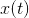

# 3.5流

> 译者： [https://sicp.comp.nus.edu.sg/chapters/66](https://sicp.comp.nus.edu.sg/chapters/66)

我们已经对分配作为建模工具有了很好的了解，并且对分配所带来的复杂问题也有了一定的了解。 现在是时候问一下我们是否可以以其他方式处理事情，从而避免其中的一些问题。 在本节中，我们基于称为_流_的数据结构，探索一种替代的状态建模方法。 正如我们将看到的，流可以减轻建模状态的某些复杂性。

让我们退后一步，回顾一下这种复杂性的来源。 为了模拟现实世界的现象，我们做出了一些看似合理的决定：我们通过具有局部变量的计算对象对具有局部状态的现实世界对象进行了建模。 我们通过计算机确定了现实世界中的时间变化。 我们通过分配模型对象的局部变量来实现计算机中模型对象状态的时变。

还有其他方法吗？ 我们是否可以避免在建模世界中用时间来识别计算机中的时间？ 为了模拟不断变化的世界中的现象，我们是否必须随着时间而改变模型？ 从数学函数的角度考虑问题。 我们可以将数量的时变行为描述为时间的函数。 如果我们不停地专注于，我们会将其视为变化的数量。 但是，如果我们专注于价值的整个时间历史，我们就不会强调变化-函数本身不会发生变化。 [ [1]](66#footnote-1)

如果时间是离散的，那么我们可以将时间函数建模为（可能是无限的）序列。 在本节中，我们将看到如何根据代表建模系统的时间历史的序列对变化进行建模。 为此，我们引入了称为_流_的新数据结构。 从抽象的角度来看，流只是一个序列。 但是，我们将发现流作为列表的直接实现（如 [2.2.1](30) 部分中）并没有完全揭示流处理的强大功能。 作为替代方案，我们介绍了_延迟评估_技术，该技术使我们能够将非常大（甚至无限）的序列表示为流。

流处理使我们可以对具有状态的系统进行建模，而无需使用分配或可变数据。 这具有重要的理论和实践意义，因为我们可以建立模型来避免引入任务时固有的弊端。 另一方面，流框架本身就带来了困难，哪种建模技术会导致模块化和易于维护的系统问题仍然悬而未决。

* * *

[[1]](66#footnote-link-1) Physicists sometimes adopt this view by introducing the <quote>world lines</quote> of particles as a device for reasoning about motion. We've also already mentioned (section <ref name="sec:sequences-conventional-interfaces">[2.2.3](32)</ref>) that this is the natural way to think about signal-processing systems. We will explore applications of streams to signal processing in section <ref name="sec:exploiting-streams">[3.5.3](69)</ref>.

