# 3.5.3利用流范例

> 译者： [https://sicp.comp.nus.edu.sg/chapters/69](https://sicp.comp.nus.edu.sg/chapters/69)

<subsection wip="yes">Note: this section is a work in progress!

具有延迟评估的流可以成为强大的建模工具，提供本地状态和分配的许多好处。 而且，它们避免了将赋值引入编程语言时所伴随的一些理论纠结。

流方法之所以具有启发性，是因为它允许我们构建与模块模块边界不同的系统，而不是围绕状态变量分配而组织的系统。 例如，我们可以将整个时间序列（或信号）视为关注的焦点，而不是各个时刻的状态变量的值。 这样可以方便地组合和比较不同时刻的状态分量。

## 将迭代表示为流过程

在 [1.2.1](12)永恒的&lt;/quote&gt;值流，而不是表示为一组要更新的变量。 让我们从 [1.1.7](9) 一节重新讨论平方根函数时采用这种观点。 回想一下，这个想法是通过一遍又一遍地应用改善猜测的函数来为的平方根生成一系列更好的猜测：

```js
function sqrt_improve(guess, x) {
    return average(guess, x / guess);
}
```

在我们最初的`sqrt`函数中，我们将这些猜测作为状态变量的连续值。 相反，我们可以生成无限的猜测流，从1的初始猜测开始： [[1]](69#footnote-1)

```js
function sqrt_stream(x) {
    const guesses =
        pair(1.0,
             () => stream_map(guess => sqrt_improve(guess, x),
                              guesses);
            );
    return guesses;
}
display(eval_stream(sqrt_stream(2), 5));
// [1, [1.5, [1.4166666666666665, [1.4142156862745097,
// [1.4142135623746899, null]]]]]
```

我们可以生成越来越多的词条，以获得越来越好的猜测。 如果愿意，我们可以编写一个函数，该函数将不断生成术语，直到答案足够好为止。 （请参阅练习 [3.64](69#ex_3.64) 。）

我们可以用相同的方式处理的另一个迭代是基于在 [1.3.1](19) ：部分中看到的交替序列，生成对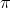的近似值。

我们首先生成该序列的求和流（奇数整数的倒数，带有交替的符号）。 然后我们获取越来越多的和（使用演习的`partial_sums`函数 [3.55](68#ex_3.55) ），并将结果按4缩放：

```js
function pi_summands(n) {
    return pair(1.0 / n, 
                () => stream_map(x => -x,
                                 pi_summands(n + 2))
               );
}

const pi_stream = 
    scale_stream(partial_sums(pi_summands(1)), 4);
display_stream(eval_stream(pi_stream, 8));
// [4, [2.666666666666667, [3.466666666666667,
// [2.8952380952380956, [3.3396825396825403, 
// [2.9760461760461765, [3.2837384837384844, 
// [3.017071817071818, null]]]]]]]]
```

这使我们对的近似越来越好，尽管这些近似收敛很慢。 序列的八个项将的值限制在3.284和3.017之间。

到目前为止，我们对状态流方法的使用与更新状态变量没有太大不同。 但是流提供了一些做一些有趣技巧的机会。 例如，我们可以使用_序列加速器_转换流，该序列加速器将近似序列转换为新序列，该新序列收敛到与原始序列相同的值，但速度更快。

由于18世纪的瑞士数学家莱昂哈德·欧拉（Leonhard Euler），一个这样的加速器可以很好地处理作为交替序列（具有交替符号的项的序列）的部分和的序列。 在Euler技术中，如果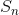是原始和序列的第项，则加速序列具有项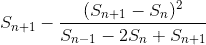。因此，如果原始序列表示为值流，则转换后的序列由

```js
function euler_transform(s) {
    const s0 = stream_ref(s, 0);
    const s1 = stream_ref(s, 1);
    const s2 = stream_ref(s, 2);
    return pair(s2 - 
                square(s2 - s1) / (s0 + (-2) * s1 + s2),
                () => euler_transform(stream_tail(s)));
}
```

我们可以通过与近似的序列来证明欧拉加速度：

```js
display_stream(euler_transform(pi_stream));
// 3.166666666666667
// 3.1333333333333337
// 3.1452380952380956
// 3.13968253968254
// 3.1427128427128435
// 3.1408813408813416
// 3.142071817071818
// 3.1412548236077655
// ...
```

更好的是，我们可以加速加速的序列，然后递归地加速等等。 即，我们创建一个流流（一种结构，我们将其称为 _tableau_ ），其中每个流都是前一个流的转换：

```js
function make_tableau(transform, s) {
    return pair(s, () => make_tableau(transform, transform(s)));
}
```

表格的形式为![%0A%20%20%20%20%20%20%5Cbegin%7Barray%7D%7Bllllll%7D%0A%20%20%20%20%20%20s_%7B00%7D%20%26%20s_%7B01%7D%20%26%20s_%7B02%7D%20%26%20s_%7B03%7D%20%26%20s_%7B04%7D%20%26%20%5Cldots%5C%5C%0A%20%20%20%20%20%20%26%20s_%7B10%7D%20%26%20s_%7B11%7D%20%26%20s_%7B12%7D%20%26%20s_%7B13%7D%20%26%20%5Cldots%5C%5C%0A%20%20%20%20%20%20%26%20%20%20%20%20%20%20%20%26%20s_%7B20%7D%20%26%20s_%7B21%7D%20%26%20s_%7B22%7D%20%26%20%5Cldots%5C%5C%0A%20%20%20%20%20%20%26%20%20%20%20%20%20%20%20%26%20%20%20%20%20%20%20%20%26%20%20%20%20%20%20%20%20%26%20%5Cldots%20%26%0A%20%20%20%20%20%20%5Cend%7Barray%7D%0A%20%20%20%20%20%20](img/1e8e20c11f3532507ab3f468f2c955d8.jpg)

最后，我们通过在表格的每一行中采用第一项来形成一个序列：

```js
function accelerated_sequence(transform, s) {
    return stream_map(head, make_tableau(transform, s));
}
```

We can demonstrate this kind of <quote>super-acceleration</quote> of the  sequence:

```js
display(eval_stream(accelerated_sequence(euler_transform,
                                         pi_stream),
                    8));
// [4, [3.166666666666667, [3.142105263157895,
// [3.141599357319005, [3.1415927140337785, [3.1415926539752927,
// [3.1415926535911765, [3.141592653589778, null]]]]]]]]
```

结果令人印象深刻。 取序列的8个项可将的正确值保留为14个小数位。 如果我们仅使用原始的序列，则需要按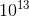项的顺序进行计算（即，将序列扩展到足够远的程度，以使单个项小于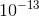），从而获得很高的准确性 ！

我们可以在不使用流的情况下实现这些加速技术。 但是流的表达特别优雅且方便，因为状态的整个序列对我们来说都是可用统一的一组操作进行操作的数据结构。

<exercise>Louis Reasoner asks why the `sqrt_stream` function was not written in the following more straightforward way, without the local variable `guesses`:

```js
function sqrt_stream(x) {
    return pair(1.0,
                () => stream_map(guess => 
                                   sqrt_improve(guess, x),
                                 sqrt_stream(x))
               );
}
```

Alyssa P. Hacker replies that this version of the function is considerably less efficient because it performs redundant computation. Explain Alyssa's answer. Would the two versions still differ in efficiency if our implementation of `delay` used only `???` without using the optimization provided by `memo-proc` (section <ref name="sec:delayed-lists">[3.5.1](67)</ref>)?<button class="btn btn-secondary solution_btn" data-toggle="collapse" href="#no_solution_69_1_div">Add solution</button>There is currently no solution available for this exercise. This textbook adaptation is a community effort. Do consider contributing by providing a solution for this exercise, using a Pull Request in [Github](https://github.com/source-academy/sicp).</exercise><exercise>Write a function `stream_limit` that takes as arguments a stream and a number (the tolerance). It should examine the stream until it finds two successive elements that differ in absolute value by less than the tolerance, and return the second of the two elements. Using this, we could compute square roots up to a given tolerance by

```js
function sqrt(x, tolerance) {
    return stream_limit(sqrt_stream(x), tolerance);
}
```

<button class="btn btn-secondary solution_btn" data-toggle="collapse" href="#no_solution_69_1_div">Add solution</button>There is currently no solution available for this exercise. This textbook adaptation is a community effort. Do consider contributing by providing a solution for this exercise, using a Pull Request in [Github](https://github.com/source-academy/sicp).</exercise><exercise>Use the series 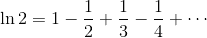 to compute three sequences of approximations to the natural logarithm of 2, in the same way we did above for . How rapidly do these sequences converge?<button class="btn btn-secondary solution_btn" data-toggle="collapse" href="#no_solution_69_1_div">Add solution</button>There is currently no solution available for this exercise. This textbook adaptation is a community effort. Do consider contributing by providing a solution for this exercise, using a Pull Request in [Github](https://github.com/source-academy/sicp).</exercise>

## 成对的无限流

在 [2.2.3](32)循环&lt;/quote&gt;必须在无限集范围内。

例如，假设我们要概括 [2.2.3](32) 节的`prime_sum_pairs`函数，以产生_所有_整数对的流，并带有[ 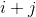是素数。 如果`int_pairs`是整数与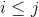的所有整数对的序列，那么我们所需的流就是 [[2]](69#footnote-2)

```js
stream_filter(pair => is_prime(head(pair) + head(tail(pair))),
              int_pairs);
```

那么，我们的问题是产生流`int_pairs`。 更一般地，假设我们有两个流和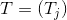，并想象无限矩形数组我们希望生成一个流，该流包含位于对角线上或对角线上的所有数组对，即 对![%0A%20%20%20%20%20%20%5Cbegin%7Barray%7D%7Bcccc%7D%0A%20%20%20%20%20%20%28S_0%2CT_0%29%20%26%20%28S_0%2CT_1%29%20%26%20%28S_0%2C%20T_2%29%20%26%20%5Cldots%5C%5C%0A%20%20%20%20%20%20%26%20%28S_1%2CT_1%29%20%26%20%28S_1%2C%20T_2%29%20%26%20%5Cldots%5C%5C%0A%20%20%20%20%20%20%26%20%20%20%20%20%20%20%20%20%20%20%26%20%28S_2%2C%20T_2%29%20%26%20%5Cldots%5C%5C%0A%20%20%20%20%20%20%26%20%20%20%20%20%20%20%20%20%20%20%26%20%20%20%20%20%20%20%20%20%20%20%20%26%20%5Cldots%0A%20%20%20%20%20%20%5Cend%7Barray%7D%0A%20%20%20%20%20%20](img/f38668c188beafecca51d096a7cba739.jpg)（如果我们同时将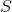和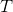都作为整数流，那么这将是我们想要的流`int_pairs`。）

称为通用对流`pairs(S, T)`，并认为它由三部分组成：对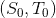，第一行中的其余对以及其余对： [[3]](69#footnote-3) ![%0A%20%20%20%20%20%20%5Cbegin%7Barray%7D%7Bc%7Cccc%7D%0A%20%20%20%20%20%20%28S_0%2CT_0%29%20%26%20%28S_0%2CT_1%29%20%26%20%28S_0%2C%20T_2%29%20%26%20%5Cldots%5C%5C%0A%20%20%20%20%20%20%5Chline%7B%7D%20%25---------------------------------------------------%20%5C%5C%0A%20%20%20%20%20%20%26%20%28S_1%2CT_1%29%20%26%20%28S_1%2C%20T_2%29%20%26%20%5Cldots%5C%5C%0A%20%20%20%20%20%20%26%20%20%20%20%20%20%20%20%20%20%20%26%20%28S_2%2C%20T_2%29%20%26%20%5Cldots%5C%5C%0A%20%20%20%20%20%20%26%20%20%20%20%20%20%20%20%20%20%20%26%20%20%20%20%20%20%20%20%20%20%20%20%26%20%5Cldots%0A%20%20%20%20%20%20%5Cend%7Barray%7D%0A%20%20%20%20%20%20](img/0f032833f33ed412cf86609176e15d99.jpg)观察到此分解过程中的第三部分（不在第一行中的对）是（递归地）由`stream_tail(S)`和`stream_tail(T)`形成的对。 另请注意，第二部分（第一行的其余部分）是

```js
stream_map(x => list(head(s), x),
           stream_tail(t));
```

因此，我们可以形成如下的成对流：

```js
function pairs(s, t) {
    return pair(list(head(s), head(t)), 
                () => <combine_in_some_way>(
                         stream_map(x => list(head(s), x),
                                    stream_tail(t)),
                         pairs(stream_tail(s), stream_tail(t)))
               );
}
```

为了完成功能，我们必须选择某种方式来组合两个内部流。 一种想法是使用 [2.2.1](30) 部分中`append`函数的流模拟：

```js
function stream_append(s1, s2) {
    return is_null(s1)
        ? s2
        : pair(head(s1), 
               () => stream_append(stream_tail(s1), s2)
              );
}
```

但是，这不适用于无限流，因为它会在合并第二个流之前从第一个流中获取所有元素。 特别是，如果我们尝试使用生成所有成对的正整数

```js
pairs(integers, integers);
```

our stream of results will first try to run through all pairs with the first integer equal to 1, and hence will never produce pairs with any other value of the first integer.

为了处理无限的流，我们需要设计一个组合顺序，以确保如果让程序运行足够长的时间，最终将到达每个元素。 可以通过以下`interleave`函数来完成此操作： [[4]](69#footnote-4)

```js
function interleave(s1, s2) {
    return is_null(s1)
        ? s2;
        : pair(head(s1), 
               () => interleave(s2, stream_tail(s1))
              );
}
```

由于`interleave`从两个流中交替获取元素，因此，即使第一个流是无限的，第二个流的每个元素最终也会进入交错的流。

因此，我们可以生成所需的对流，如下

```js
function pairs(s, t) {
    return pair(list(head(s), head(t)), 
   	        () => interleave(stream_map(x => list(head(s), 
                                                      x),
                                            stream_tail(t)),
                                 pairs(stream_tail(s), 
                                       stream_tail(t)));
}
```

<exercise>Examine the stream `pairs(integers, integers)`. Can you make any general comments about the order in which the pairs are placed into the stream? For example, about how many pairs precede the pair (1,100)? the pair (99,100)? the pair (100,100)? (If you can make precise mathematical statements here, all the better. But feel free to give more qualitative answers if you find yourself getting bogged down.)<button class="btn btn-secondary solution_btn" data-toggle="collapse" href="#no_solution_69_1_div">Add solution</button>There is currently no solution available for this exercise. This textbook adaptation is a community effort. Do consider contributing by providing a solution for this exercise, using a Pull Request in [Github](https://github.com/source-academy/sicp).</exercise><exercise>Modify the `pairs` function so that `pairs(integers, integers)` will produce the stream of _all_ pairs of integers  (without the condition ). Hint: You will need to mix in an additional stream.<button class="btn btn-secondary solution_btn" data-toggle="collapse" href="#no_solution_69_1_div">Add solution</button>There is currently no solution available for this exercise. This textbook adaptation is a community effort. Do consider contributing by providing a solution for this exercise, using a Pull Request in [Github](https://github.com/source-academy/sicp).</exercise><exercise>Louis Reasoner thinks that building a stream of pairs from three parts is unnecessarily complicated. Instead of separating the pair  from the rest of the pairs in the first row, he proposes to work with the whole first row, as follows:

```js
function pairs(s, t) {
    return interleave(stream_map(x => list(head(s), x),
                                 t), 
                      pair(stream_tail(s), stream_tail(t)));
}
```

Does this work? Consider what happens if we evaluate `pairs(integers, integers)` using Louis's definition of `pairs`.<button class="btn btn-secondary solution_btn" data-toggle="collapse" href="#no_solution_69_1_div">Add solution</button>There is currently no solution available for this exercise. This textbook adaptation is a community effort. Do consider contributing by providing a solution for this exercise, using a Pull Request in [Github](https://github.com/source-academy/sicp).</exercise><exercise>Write a function `triples` that takes three infinite streams, , , and 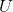, and produces the stream of triples 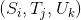 such that 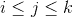. Use `triples` to generate the stream of all Pythagorean triples of positive integers, i.e., the triples 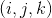 such that  and 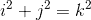.<button class="btn btn-secondary solution_btn" data-toggle="collapse" href="#no_solution_69_1_div">Add solution</button>There is currently no solution available for this exercise. This textbook adaptation is a community effort. Do consider contributing by providing a solution for this exercise, using a Pull Request in [Github](https://github.com/source-academy/sicp).</exercise><exercise>It would be nice to be able to generate streams in which the pairs appear in some useful order, rather than in the order that results from an _ad hoc_ interleaving process. We can use a technique similar to the `merge` function of exercise <ref name="ex:merge">[3.56](68#ex_3.56)</ref>, if we define a way to say that one pair of integers is <quote>less than</quote> another. One way to do this is to define a <quote>weighting function</quote> 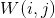 and stipulate that 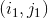 is less than 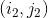 if . Write a function `merge_weighted` that is like `merge`, except that `merge_weighted` takes an additional argument `weight`, which is a function that computes the weight of a pair, and is used to determine the order in which elements should appear in the resulting merged stream.[[5]](69#footnote-5) Using this, generalize `pairs` to a function `weighted_pairs` that takes two streams, together with a function that computes a weighting function, and generates the stream of pairs, ordered according to weight. Use your function to generate

1.  所有带有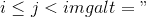的正整数对的流
2.  所有具有的正整数对的流都可以被2、3或5整除，并且这些对根据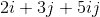之和排序。

<button class="btn btn-secondary solution_btn" data-toggle="collapse" href="#no_solution_69_1_div">Add solution</button>There is currently no solution available for this exercise. This textbook adaptation is a community effort. Do consider contributing by providing a solution for this exercise, using a Pull Request in [Github](https://github.com/source-academy/sicp).</exercise><exercise>Numbers that can be expressed as the sum of two cubes in more than one way are sometimes called _Ramanujan numbers_, in honor of the mathematician Srinivasa Ramanujan.[[6]](69#footnote-6) Ordered streams of pairs provide an elegant solution to the problem of computing these numbers. To find a number that can be written as the sum of two cubes in two different ways, we need only generate the stream of pairs of integers  weighted according to the sum 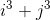 (see exercise <ref name="ex:weighted-pairs">[3.70](69#ex_3.70)</ref>), then search the stream for two consecutive pairs with the same weight. Write a function to generate the Ramanujan numbers. The first such number is 1,729\. What are the next five?<button class="btn btn-secondary solution_btn" data-toggle="collapse" href="#no_solution_69_1_div">Add solution</button>There is currently no solution available for this exercise. This textbook adaptation is a community effort. Do consider contributing by providing a solution for this exercise, using a Pull Request in [Github](https://github.com/source-academy/sicp).</exercise><exercise>In a similar way to exercise <ref name="ex:ramanujan-nums">[3.71](69#ex_3.71)</ref> generate a stream of all numbers that can be written as the sum of two squares in three different ways (showing how they can be so written).<button class="btn btn-secondary solution_btn" data-toggle="collapse" href="#no_solution_69_1_div">Add solution</button>There is currently no solution available for this exercise. This textbook adaptation is a community effort. Do consider contributing by providing a solution for this exercise, using a Pull Request in [Github](https://github.com/source-academy/sicp).</exercise>

## 作为信号流

我们通过将流描述为信号处理系统中&lt;quote&gt;信号&lt;/quote&gt;的计算类似物来开始对流的讨论。 实际上，我们可以使用流以非常直接的方式来对信号处理系统进行建模，以连续的时间间隔将信号的值表示为流的连续元素。 例如，我们可以实现一个_积分器_或_求和器_，对于输入流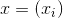，其初始值和一个小增量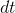会累加总和 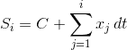并返回值流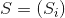。 以下`integral`函数让人想起整数流的&lt;quote&gt;隐式样式&lt;/quote&gt;定义（ [ 3.5.2 ](68) 节）：

```js
function integral(integrand, initial_value, dt) {
    const integ = pair(initial_value, 
        () => add_streams(scale_stream(integrand, dt),
                          integ);
        );
    return integ;
}
```

<figure>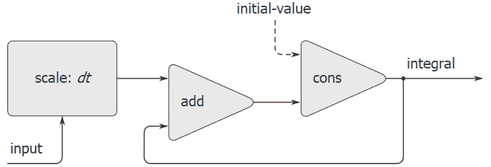**[Figure 3.32](69#fig_3.32)** The `integral` function viewed as a signal-processing system.</figure>

图 [3.32](69#fig_3.32) 是与`integral`功能相对应的信号处理系统的图片。 输入流由缩放并通过加法器，加法器的输出又通过同一加法器返回。 `int`定义中的自参考通过反馈环路反映在图中，该反馈环路将加法器的输出连接到输入之一。

 <exercise>[图3.33] RC电路和相关的信号流程图。 我们可以使用流对电路进行建模，以表示一系列时间的电流或电压值。 例如，假设我们有一个 _RC电路_，该电路由串联的电阻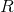的电阻和电容的电容组成。 电路对注入电流的电压响应由图 [ 3.33 ](69#fig_3.33) 中的公式确定，其结构由随附的信号流程图显示。

编写对电路进行建模的函数`RC`。 `RC`应将，和的值作为输入，并应返回一个函数，该函数将表示电流和电容器电压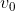的初始值的流作为输入。 并产生电压流作为输出。 例如，通过评估`const RC1 = RC(5, 1, 0.5)`，您应该能够使用`RC`为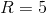欧姆，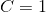法拉和0.5秒时间步长的RC电路建模。 这将`RC1`定义为一个函数，该函数采用代表电流时间序列和初始电容器电压的流，并产生电压的输出流。

<button class="btn btn-secondary solution_btn" data-toggle="collapse" href="#no_solution_69_1_div">Add solution</button>There is currently no solution available for this exercise. This textbook adaptation is a community effort. Do consider contributing by providing a solution for this exercise, using a Pull Request in [Github](https://github.com/source-academy/sicp).</exercise><exercise>Alyssa P. Hacker is designing a system to process signals coming from physical sensors. One important feature she wishes to produce is a signal that describes the _zero crossings_ of the input signal. That is, the resulting signal should be 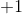 whenever the input signal changes from negative to positive,  whenever the input signal changes from positive to negative, and 0 otherwise. (Assume that the sign of a 0 input is positive.) For example, a typical input signal with its associated zero-crossing signal would be

```js
... 1  2  1.5  1  0.5  -0.1  -2  -3  -2  -0.5  0.2  3  4 ...
... 0  0    0  0    0     -1  0   0   0     0    1  0  0 ...
```

In Alyssa's system, the signal from the sensor is represented as a stream `sense_data` and the stream `zero_crossings` is the corresponding stream of zero crossings. Alyssa first writes a function `sign_change_detector` that takes two values as arguments and compares the signs of the values to produce an appropriate , , or . She then constructs her zero-crossing stream as follows:

```js
function make_zero_crossings(input_stream, last_value) {
    return pair(sign_change_detector(head(input_stream),
                                     last_value),
                () => make_zero_crossings(
                          stream_tail(input_stream),
                          head(input_stream)));
}
const zero_crossings = make_zero_crossings(sense_data, 0);
```

Alyssa's boss, Eva Lu Ator, walks by and suggests that this program is approximately equivalent to the following one, which uses the function `combine_streams` from exercise <ref name="ex:combine-streams">[3.50](67#ex_3.50)</ref>:

```js
const zero_crossing = combine_streams(sign_change_detector,
                                      sense_data,
                                      <expression>);
```

Complete the program by supplying the indicated `<expression>`.<button class="btn btn-secondary solution_btn" data-toggle="collapse" href="#no_solution_69_1_div">Add solution</button>There is currently no solution available for this exercise. This textbook adaptation is a community effort. Do consider contributing by providing a solution for this exercise, using a Pull Request in [Github](https://github.com/source-academy/sicp).</exercise><exercise>Unfortunately, Alyssa's zero-crossing detector in exercise <ref name="ex:zero-crossing">[3.74](69#ex_3.74)</ref> proves to be insufficient, because the noisy signal from the sensor leads to spurious zero crossings. Lem E. Tweakit, a hardware specialist, suggests that Alyssa smooth the signal to filter out the noise before extracting the zero crossings. Alyssa takes his advice and decides to extract the zero crossings from the signal constructed by averaging each value of the sense data with the previous value. She explains the problem to her assistant, Louis Reasoner, who attempts to implement the idea, altering Alyssa's program as follows:

```js
function make_zero_crossings(input_stream, last_value) {
    const avpt = (head(input_stream) + last_value) / 2;
    return pair(sign_change_detector(avpt, last_value),
        () => make_zero_crossings(
                  stream_tail(input_stream), 
                  avpt);
		 );
}
```

This does not correctly implement Alyssa's plan. Find the bug that Louis has installed and fix it without changing the structure of the program. (Hint: You will need to increase the number of arguments to `make_zero_crossings`.)<button class="btn btn-secondary solution_btn" data-toggle="collapse" href="#no_solution_69_1_div">Add solution</button>There is currently no solution available for this exercise. This textbook adaptation is a community effort. Do consider contributing by providing a solution for this exercise, using a Pull Request in [Github](https://github.com/source-academy/sicp).</exercise><exercise>Eva Lu Ator has a criticism of Louis's approach in exercise <ref name="ex:zero-crossing-2">[3.75](69#ex_3.75)</ref>. The program he wrote is not modular, because it intermixes the operation of smoothing with the zero-crossing extraction. For example, the extractor should not have to be changed if Alyssa finds a better way to condition her input signal. Help Louis by writing a function `smooth` that takes a stream as input and produces a stream in which each element is the average of two successive input stream elements. Then use `smooth` as a component to implement the zero-crossing detector in a more modular style.<button class="btn btn-secondary solution_btn" data-toggle="collapse" href="#no_solution_69_1_div">Add solution</button>There is currently no solution available for this exercise. This textbook adaptation is a community effort. Do consider contributing by providing a solution for this exercise, using a Pull Request in [Github](https://github.com/source-academy/sicp).</exercise>

* * *

[[1]](69#footnote-link-1) We can't use `let` to bind the local variable `guesses`, because the value of `guesses` depends on `guesses` itself. Exercise <ref name="ex:stream-internal-def">[3.63](69#ex_3.63)</ref> addresses why we want a local variable here.

[[2]](69#footnote-link-2) As in section <ref name="sec:sequences-conventional-interfaces">[2.2.3](32)</ref>, we represent a pair of integers as a list rather than a JavaScript pair.

[[3]](69#footnote-link-3) See exercise <ref name="ex:pairs-array">[3.68](69#ex_3.68)</ref> for some insight into why we chose this decomposition.

[[4]](69#footnote-link-4) The precise statement of the required property on the order of combination is as follows: There should be a function  of two arguments such that the pair corresponding to element  of the first stream and element  of the second stream will appear as element number 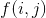 of the output stream. The trick of using `interleave` to accomplish this was shown to us by David Turner, who employed it in the language KRC (<citation>Turner 1981</citation>).

[[5]](69#footnote-link-5) We will require that the weighting function be such that the weight of a pair increases as we move out along a row or down along a column of the array of pairs.

[[6]](69#footnote-link-6) To quote from G. H. Hardy's obituary of Ramanujan (<citation>Hardy 1921</citation>): <quote>It was Mr. Littlewood (I believe) who remarked that <quote>every positive integer was one of his friends.</quote> I remember once going to see him when he was lying ill at Putney. I had ridden in taxi-cab No. 1729, and remarked that the number seemed to me a rather dull one, and that I hoped it was not an unfavorable omen. <quote>No,</quote> he replied, <quote>it is a very interesting number; it is the smallest number expressible as the sum of two cubes in two different ways.</quote></quote> The trick of using weighted pairs to generate the Ramanujan numbers was shown to us by Charles Leiserson.

