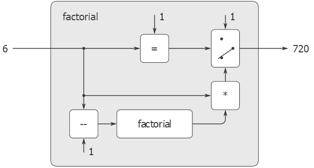

# 4.1.5数据作为程序

> 译者： [https://sicp.comp.nus.edu.sg/chapters/78](https://sicp.comp.nus.edu.sg/chapters/78)

在考虑评估JavaScript表达式的JavaScript程序时，类推可能会有所帮助。 程序含义的一种操作观点是，程序是对抽象（也许是无限大）机器的描述。 例如，考虑使用熟悉的程序来计算阶乘：

```js
function factorial(n) {
    return n === 1
           ? 1
           : factorial(n - 1) * n;
}
```

我们可以将这个程序看作是一台机器的描述，该机器包含递减，乘以和检验相等性的部件，以及两位置开关和另一台析因机器。 （阶乘机器是无限的，因为其中包含另一个阶乘机器。）图 [4.2](78#fig_4.2) 是阶乘机器的流程图，显示了零件如何连接在一起。

<figure>**[图4.2](78#fig_4.2)** 析因程序，被视为抽象机。</figure>

以类似的方式，我们可以将评估器视为一台非常特殊的机器，将机器的描述作为输入。 给定此输入，评估器将自身配置为模拟所描述的机器。 例如，如果我们向评估者提供`factorial`的定义，如图 [4.3](78#fig_4.3) 所示，则评估者将能够计算阶乘。

<figure>**[图4.3](78#fig_4.3)** 仿真器模拟阶乘机器。</figure>

从这个角度来看，我们的评估器被视为_通用计算机_。 当将其他机器描述为JavaScript程序时，它会模仿其他机器。 [[1]](78#footnote-1)

这是惊人的。 尝试想象一个类似的电路评估器。 这将是一个电路，其输入的信号将对诸如滤波器之类的其他电路的计划进行编码。 给定此输入，电路评估器将像具有相同描述的滤波器一样工作。 这样的通用电路几乎是难以想象的复杂。 值得注意的是，程序评估器是一个相当简单的程序。 [[2]](78#footnote-2)

评估器的另一个显着方面是，它充当了由我们的编程语言操纵的数据对象与编程语言本身之间的桥梁。 想象一下，评估程序（正在JavaScript中实现）正在运行，并且用户正在向评估程序键入表达式并观察结果。 从用户的角度来看，诸如`x * x`之类的输入表达式是编程人员应执行的用编程语言表示的表达式。 但是，从评估者的角度来看，该表达式只是一个字符串或（在解析之后）一个标记对象表示形式，将根据一组明确定义的规则进行操作。

 <split>用户的程序是评估者的数据并不一定会引起混淆。 实际上，有时可以方便地忽略此区别，并允许用户使用JavaScript的原始函数`eval`（将字符串作为参数）来将字符串明确评估为JavaScript表达式。 它解析字符串，并在语法上正确的前提下评估在`eval`应用环境中的结果表示形式。 [[3]](78#footnote-3)</split> <exercise>Given a one-argument function `p` and an object `a`, `p` is said to <quote>halt</quote> on `a` if evaluating the expression `p(a)` returns a value (as opposed to terminating with an error message or running forever). Show that it is impossible to write a function `halts` that correctly determines whether `p` halts on `a` for any function `p` and object `a`. Use the following reasoning: If you had such a function `halts`, you could implement the following program:

```js
function run_forever() {
    return run_forever();      
}
function try(p) {
    return halts(p, p) 
           ? run_forever();
           : "halted";
}
```

Now consider evaluating the expression `try(try)` and show that any possible outcome (either halting or running forever) violates the intended behavior of `halts`.[[4]](78#footnote-4)<button class="btn btn-secondary solution_btn" data-toggle="collapse" href="#no_solution_78_1_div">Add solution</button>There is currently no solution available for this exercise. This textbook adaptation is a community effort. Do consider contributing by providing a solution for this exercise, using a Pull Request in [Github](https://github.com/source-academy/sicp).</exercise>

* * *

[[1]](78#footnote-link-1) The fact that the machines are described in JavaScript is inessential. If we give our evaluator a JavaScript program that behaves as an evaluator for some other language, say C, the JavaScript evaluator will emulate the C evaluator, which in turn can emulate any machine described as a C program. Similarly, writing a JavaScript evaluator in C produces a C program that can execute any JavaScript program. The deep idea here is that any evaluator can emulate any other. Thus, the notion of <quote>what can in principle be computed</quote> (ignoring practicalities of time and memory required) is independent of the language or the computer, and instead reflects an underlying notion of _computability_. This was first demonstrated in a clear way by Alan M. Turing (1912–1954), whose 1936 paper laid the foundations for theoretical computer science. In the paper, Turing presented a simple computational model—now known as a _Turing machine_—and argued that any <quote>effective process</quote> can be formulated as a program for such a machine. (This argument is known as the _Church-Turing thesis_.) Turing then implemented a universal machine, i.e., a Turing machine that behaves as an evaluator for Turing-machine programs. He used this framework to demonstrate that there are well-posed problems that cannot be computed by Turing machines (see exercise <ref name="ex:halting-theorem">[4.7](78#ex_4.7)</ref>), and so by implication cannot be formulated as <quote>effective processes.</quote> Turing went on to make fundamental contributions to practical computer science as well. For example, he invented the idea of structuring programs using general-purpose subroutines. See <citation>Hodges 1983</citation> for a biography of Turing.

[[2]](78#footnote-link-2) Some people find it counterintuitive that an evaluator, which is implemented by a relatively simple function, can emulate programs that are more complex than the evaluator itself. The existence of a universal evaluator machine is a deep and wonderful property of computation. _Recursion theory_, a branch of mathematical logic, is concerned with logical limits of computation. Douglas Hofstadter's beautiful book _Gödel, Escher, Bach_ (1979) explores some of these ideas.

[[3]](78#footnote-link-3) Warning: This `eval` primitive is not identical to the `evaluate` function we implemented in section <ref name="sec:core-of-evaluator">[4.1.1](74)</ref>, because it uses _actual_ JavaScript environments rather than the sample environment structures we built in section <ref name="sec:eval-data-structures">[4.1.3](76)</ref>. These actual environments cannot be manipulated by the user as ordinary lists; they must be accessed via `eval` or other special operations. Similarly, the `apply` primitive we saw in section <ref name="sec:data-directed">[2.4.3](42)</ref> is not identical to the metacircular `apply`, because it uses actual JavaScript functions rather than the function objects we constructed in sections <ref name="sec:eval-data-structures">[4.1.3](76)</ref> and <ref name="sec:running-eval">[4.1.4](77)</ref>.

[[4]](78#footnote-link-4) Although we stipulated that `halts` is given a function object, notice that this reasoning still applies even if `halts` can gain access to the function's text and its environment. This is Turing's celebrated _Halting Theorem_, which gave the first clear example of a _non-computable_ problem, i.e., a well-posed task that cannot be carried out as a computational function.

