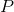
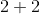
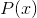

# 4.4.3逻辑编程是数学逻辑吗？

> 译者： [https://sicp.comp.nus.edu.sg/chapters/92](https://sicp.comp.nus.edu.sg/chapters/92)

查询语言中使用的组合方式乍一看似乎与数学逻辑的`and`，`or`和`not`操作相同，并且查询语言规则的应用实际上是通过合法的 推理。 [[1]](92#footnote-1) 这种用数学逻辑对查询语言的标识并不是真正有效，因为查询语言提供了一种_控制结构_，该结构可按程序解释逻辑语句。 我们经常可以利用这种控制结构。 例如，要查找程序员的所有主管，我们可以用两种逻辑上等效的形式来编写查询：

```js
and(job(x, list("computer", "programmer")),
    supervisor(x, y));
```

or

```js
and(supervisor(x, y),
    job(x, list("computer", "programmer")));
```

如果公司的主管人数比程序员多（通常情况下），则最好使用第一种形式而不是第二种形式，因为必须针对`and`第一个子句产生的每个中间结果（框架）扫描数据库 ]。

逻辑编程的目的是为程序员提供将计算问题分解为两个独立问题的技术：&lt;quote&gt;要计算什么&lt;/quote&gt;，以及&lt;quote&gt;应该如何计算&lt;/quote&gt;。 这是通过选择数学逻辑语句的一个子集来完成的，该子集的功能足以描述一个人可能想要计算的任何事物，而又足够弱以具有可控的过程解释能力。 这里的意图是，一方面，以逻辑编程语言指定的程序应该是可以由计算机执行的有效程序。 通过使用语言的评估顺序来实现控制（的计算方式）。 我们应该能够安排每个子句中子句的顺序和子目标的顺序，以便以被认为有效和高效的顺序进行计算。 同时，我们应该能够将计算结果（&lt;quote&gt;计算为&lt;/quote&gt;）作为逻辑定律的简单结果。

我们的查询语言可以被视为数学逻辑的过程可解释的子集。 断言表示一个简单的事实（一个原子命题）。 规则表示规则结论适用于规则主体所在的那些情况。 规则具有自然的程序解释：要确定规则的结论，请确定规则的主体。 因此，规则指定了计算。 但是，由于规则也可以看作是数学逻辑的陈述，因此我们可以断言逻辑程序可以通过完全在数学逻辑中工作来获得相同的结果，从而证明由逻辑程序完成的任何&lt;quote&gt;推论&lt;/quote&gt;是合理的。 [[2]](92#footnote-2)

## 无限循环

逻辑程序的过程解释的结果是，有可能构建无望的效率低下的程序来解决某些问题。 当系统陷入推论的无限循环时，就会出现效率低下的极端情况。 举一个简单的例子，假设我们正在建立著名婚姻的数据库，包括

```js
assert(married("Minnie", "Mickey"));
```

如果我们现在问

```js
married("Mickey", who);
```

we will get no response, because the system doesn't know that if  is married to , then  is married to . So we assert the rule

```js
assert(rule(married(x, y), married(y, x)));
```

and again query

```js
married("Mickey", who);
```

不幸的是，这将使系统陷入无限循环，如下所示：

*   系统发现`married`规则适用； 也就是说，规则结论`married(x, y)`成功地与查询模式`married("Mickey", who)`结合，生成了一个帧，其中`x`绑定到`"Mickey"`，`y`绑定到`who`。 因此，解释器将在此框架中评估规则主体`married(x, y)`，实际上是对查询`married(who, "Mickey")`进行处理。
*   一个答案直接作为一个断言出现在数据库中：`married("Minnie", "Mickey")`。
*   `married`规则也适用，因此解释器将再次评估规则主体，这一次与`married("Mickey", who)`等效。

系统现在处于无限循环中。 确实，系统在进入循环之前是否会找到简单答案`married("Minnie", "Mickey")`取决于与系统检查数据库中项目顺序有关的实现细节。 这是可能发生的各种循环的非常简单的示例。 相互关联的规则的集合可能导致难以预测的循环，并且循环的出现可能取决于`and`中子句的顺序（请参阅练习 [4.55](92#ex_4.55) ） 或有关系统处理查询顺序的低级详细信息。 [[3]](92#footnote-3)

## `not`有问题

查询系统中的另一个问题涉及`not`。 给定 [4.4.1](90) 部分的数据库，请考虑以下两个查询：

```js
and(supervisor(x, y),
    not(job(x, list("computer", "programmer"))));

and(not(job(x, list("computer", "programmer"))),
    supervisor(x, y));
```

这两个查询不会产生相同的结果。 第一个查询从查找数据库中与`supervisor(x, y)`匹配的所有条目开始，然后通过删除其中`x`的值满足`job(x, list("computer", "programmer"))`的帧来过滤结果帧。 第二个查询从过滤传入的帧开始，以除去那些可以满足`job(x, list("computer", "programmer"))`的帧。 由于唯一的传入帧为空，因此它将检查数据库以查看是否存在满足`job(x, list("computer", "programmer"))`的模式。 由于通常存在这种形式的条目，因此`not`子句会过滤出空帧并返回空帧流。 因此，整个复合查询将返回一个空流。

麻烦的是，我们对`not`的实现实际上是要用作变量值的过滤器。 如果对`not`子句使用其中某些变量保持未绑定的帧进行处理（如上例中的`x`一样），则系统将产生意外结果。 使用`javascript_value`也会发生类似的问题-如果JavaScript谓词的某些参数未绑定，则该谓词将不起作用。 参见练习 [4.68](93#ex_4.68) 。

查询语言的`not`与数学逻辑的`not`还有一种更为严重的方式。 在逻辑上，我们将&lt;quote&gt;而不是&lt;/quote&gt; 解释为意味着不正确。 但是，在查询系统中，&lt;quote&gt;不是&lt;/quote&gt; 意味着不能从数据库中的知识推论得出。 例如，给定 [ 4.4.1 ](90) 节的人员数据库，系统会很乐意推导各种`not`语句，例如Ben Bitdiddle不是棒球迷， 外面没有下雨，不是4。 [[4]](92#footnote-4) 换句话说，逻辑编程语言的`not`反映了所谓的_封闭世界假设_所有相关信息已包含在数据库中。 [ [5]](92#footnote-5)

<exercise>Louis Reasoner mistakenly deletes the `outranked_by` rule (section <ref name="sec:deductive-info-retrieval">[4.4.1](90)</ref>) from the data base. When he realizes this, he quickly reinstalls it. Unfortunately, he makes a slight change in the rule, and types it in as

```js
rule(outranked_by(staff_person, boss),      
     or(supervisor(staff_person, boss),
        and(outranked_by(middle_manager, boss),
            supervisor(staff_person, middle_manager))));
```

Just after Louis types this information into the system, DeWitt Aull comes by to find out who outranks Ben Bitdiddle. He issues the query

```js
outanked_by(list("Bitdiddle", "Ben"), who);
```

After answering, the system goes into an infinite loop. Explain why.<button class="btn btn-secondary solution_btn" data-toggle="collapse" href="#no_solution_92_1_div">Add solution</button>There is currently no solution available for this exercise. This textbook adaptation is a community effort. Do consider contributing by providing a solution for this exercise, using a Pull Request in [Github](https://github.com/source-academy/sicp).</exercise><exercise>Cy D. Fect, looking forward to the day when he will rise in the organization, gives a query to find all the wheels (using the `wheel` rule of section <ref name="sec:deductive-info-retrieval">[4.4.1](90)</ref>):

```js
wheel(who);
```

To his surprise, the system responds

```js
// Query results:
wheel(list("Warbucks", "Oliver"))
wheel(list("Bitdiddle", "Ben"))
wheel(list("Warbucks", "Oliver"))
wheel(list("Warbucks", "Oliver"))
wheel(list("Warbucks", "Oliver"))
```

Why is Oliver Warbucks listed four times?<button class="btn btn-secondary solution_btn" data-toggle="collapse" href="#no_solution_92_1_div">Add solution</button>There is currently no solution available for this exercise. This textbook adaptation is a community effort. Do consider contributing by providing a solution for this exercise, using a Pull Request in [Github](https://github.com/source-academy/sicp).</exercise><exercise>Ben has been generalizing the query system to provide statistics about the company. For example, to find the total salaries of all the computer programmers one will be able to say

```js
sum(amount,      
    and(job(x, list("computer", "programmer")),
        salary(x, amount)));
```

In general, Ben's new system allows expressions of the form `accumulation_function(, )` where `accumulation_function` can be things like `sum`, `average`, or `maximum`. Ben reasons that it should be a cinch to implement this. He will simply feed the query pattern to `qeval`. This will produce a stream of frames. He will then pass this stream through a mapping function that extracts the value of the designated variable from each frame in the stream and feed the resulting stream of values to the accumulation function. Just as Ben completes the implementation and is about to try it out, Cy walks by, still puzzling over the `wheel` query result in exercise <ref name="ex:multiple-query">[4.56](92#ex_4.56)</ref>. When Cy shows Ben the system's response, Ben groans, <quote>Oh, no, my simple accumulation scheme won't work!</quote> What has Ben just realized? Outline a method he can use to salvage the situation.<button class="btn btn-secondary solution_btn" data-toggle="collapse" href="#no_solution_92_1_div">Add solution</button>There is currently no solution available for this exercise. This textbook adaptation is a community effort. Do consider contributing by providing a solution for this exercise, using a Pull Request in [Github](https://github.com/source-academy/sicp).</exercise><exercise>Devise a way to install a loop detector in the query system so as to avoid the kinds of simple loops illustrated in the text and in exercise <ref name="ex:query-simple-loop">[4.55](92#ex_4.55)</ref>. The general idea is that the system should maintain some sort of history of its current chain of deductions and should not begin processing a query that it is already working on. Describe what kind of information (patterns and frames) is included in this history, and how the check should be made. (After you study the details of the query-system implementation in section <ref name="sec:implementing-the-query-system">[4.4.4](93)</ref>, you may want to modify the system to include your loop detector.)<button class="btn btn-secondary solution_btn" data-toggle="collapse" href="#no_solution_92_1_div">Add solution</button>There is currently no solution available for this exercise. This textbook adaptation is a community effort. Do consider contributing by providing a solution for this exercise, using a Pull Request in [Github](https://github.com/source-academy/sicp).</exercise><exercise>Define rules to implement the `reverse` operation of exercise <ref name="ex:reverse">[2.18](30#ex_2.18)</ref>, which returns a list containing the same elements as a given list in reverse order. (Hint: Use `append_to_form`. Can your rules answer both `reverse(list(1, 2, 3), x)` and `reverse(x, list(1, 2, 3)`?<button class="btn btn-secondary solution_btn" data-toggle="collapse" href="#no_solution_92_1_div">Add solution</button>There is currently no solution available for this exercise. This textbook adaptation is a community effort. Do consider contributing by providing a solution for this exercise, using a Pull Request in [Github](https://github.com/source-academy/sicp).</exercise><exercise>Beginning with the data base and the rules you formulated in exercise <ref name="ex:genesis">[4.54](90#ex_4.54)</ref>, devise a rule for adding <quote>greats</quote> to a grandson relationship. This should enable the system to deduce that Irad is the great-grandson of Adam, or that Jabal and Jubal are the great-great-great-great-great-grandsons of Adam. (Hint: Represent the fact about Irad, for example, as `list(list("great", "grandson"), "Adam", "Irad")`. Write rules that determine if a list ends in the word `"grandson"`. Use this to express a rule that allows one to derive the relationship `list(pair("great", rel), x, y)`, where `rel` is a list ending in `"grandson"`.) Check your rules on queries such as `list(list("great", "grandson"), g, ggs)` and `list(relationship, "Adam", "Irad")`.<button class="btn btn-secondary solution_btn" data-toggle="collapse" href="#no_solution_92_1_div">Add solution</button>There is currently no solution available for this exercise. This textbook adaptation is a community effort. Do consider contributing by providing a solution for this exercise, using a Pull Request in [Github](https://github.com/source-academy/sicp).</exercise>

* * *

[[1]](92#footnote-link-1) That a particular method of inference is legitimate is not a trivial assertion. One must prove that if one starts with true premises, only true conclusions can be derived. The method of inference represented by rule applications is _modus ponens_, the familiar method of inference that says that if _A_ is true and _A implies B_ is true, then we may conclude that _B_ is true.

[[2]](92#footnote-link-2) We must qualify this statement by agreeing that, in speaking of the <quote>inference</quote> accomplished by a logic program, we assume that the computation terminates. Unfortunately, even this qualified statement is false for our implementation of the query language (and also false for programs in Prolog and most other current logic programming languages) because of our use of `not` and `javascript_value`. As we will describe below, the `not` implemented in the query language is not always consistent with the `not` of mathematical logic, and `javascript_value` introduces additional complications. We could implement a language consistent with mathematical logic by simply removing `not` and `javascript_value` from the language and agreeing to write programs using only simple queries, `and`, and `or`. However, this would greatly restrict the expressive power of the language. One of the major concerns of research in logic programming is to find ways to achieve more consistency with mathematical logic without unduly sacrificing expressive power.

[[3]](92#footnote-link-3) This is not a problem of the logic but one of the procedural interpretation of the logic provided by our interpreter. We could write an interpreter that would not fall into a loop here. For example, we could enumerate all the proofs derivable from our assertions and our rules in a breadth-first rather than a depth-first order. However, such a system makes it more difficult to take advantage of the order of deductions in our programs. One attempt to build sophisticated control into such a program is described in <citation>deKleer et al. 1977</citation>. Another technique, which does not lead to such serious control problems, is to put in special knowledge, such as detectors for particular kinds of loops (exercise <ref name="ex:query-loop-detector">[4.58](92#ex_4.58)</ref>). However, there can be no general scheme for reliably preventing a system from going down infinite paths in performing deductions. Imagine a diabolical rule of the form <quote>To show  is true, show that  is true,</quote> for some suitably chosen function .

[[4]](92#footnote-link-4) Consider the query `not(baseball_fan(list("Bitdiddle", "Ben")))`. The system finds that `baseball_fan(list("Bitdiddle", "Ben"))` is not in the data base, so the empty frame does not satisfy the pattern and is not filtered out of the initial stream of frames. The result of the query is thus the empty frame, which is used to instantiate the input query to produce `not(baseball_fan(list("Bitdiddle", "Ben")))`.

[[5]](92#footnote-link-5) A discussion and justification of this treatment of `not` can be found in the article by Clark (1978).

